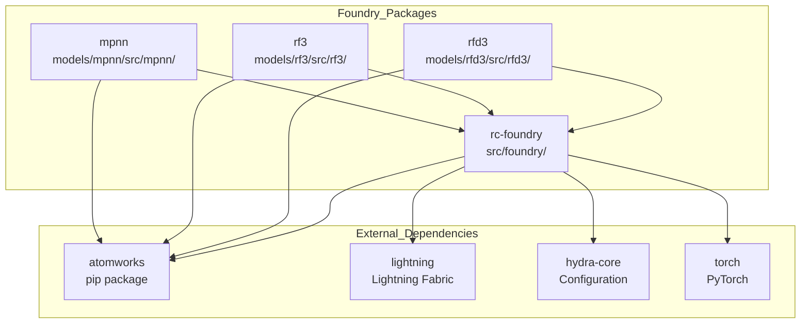
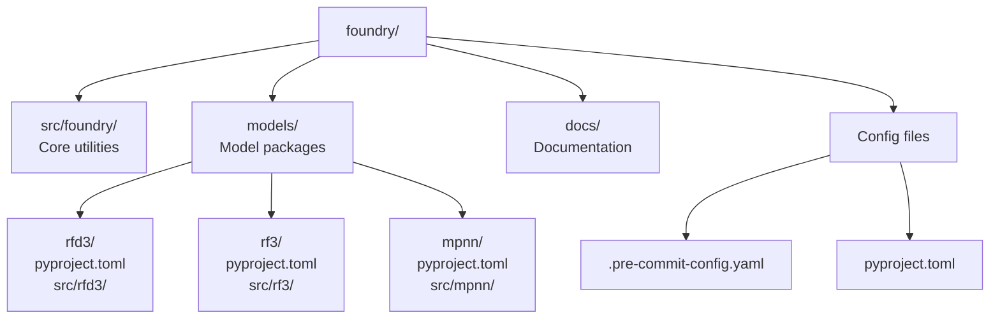
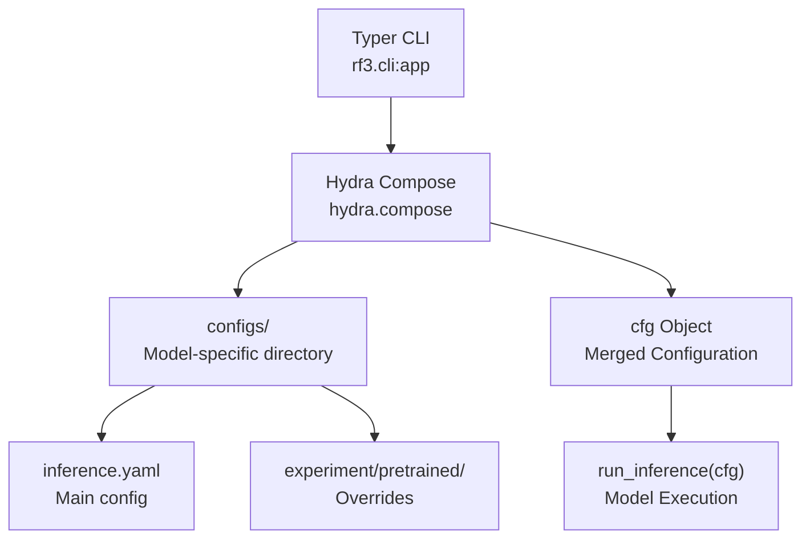

# Developer Reference

> **Relevant source files**
> * [CONTRIBUTING.md](https://github.com/RosettaCommons/foundry/blob/cee116dc/CONTRIBUTING.md?plain=1)
> * [docs/docs_requirements.txt](https://github.com/RosettaCommons/foundry/blob/cee116dc/docs/docs_requirements.txt)
> * [docs/source/_static/ga.js](https://github.com/RosettaCommons/foundry/blob/cee116dc/docs/source/_static/ga.js)
> * [docs/source/conf.py](https://github.com/RosettaCommons/foundry/blob/cee116dc/docs/source/conf.py)
> * [docs/source/contributing_link.rst](https://github.com/RosettaCommons/foundry/blob/cee116dc/docs/source/contributing_link.rst)
> * [docs/source/index.rst](https://github.com/RosettaCommons/foundry/blob/cee116dc/docs/source/index.rst)
> * [models/rf3/configs/experiment/pretrained/rf3.yaml](https://github.com/RosettaCommons/foundry/blob/cee116dc/models/rf3/configs/experiment/pretrained/rf3.yaml)
> * [models/rf3/src/rf3/callbacks/dump_validation_structures.py](https://github.com/RosettaCommons/foundry/blob/cee116dc/models/rf3/src/rf3/callbacks/dump_validation_structures.py)
> * [models/rf3/src/rf3/cli.py](https://github.com/RosettaCommons/foundry/blob/cee116dc/models/rf3/src/rf3/cli.py)
> * [models/rf3/src/rf3/utils/io.py](https://github.com/RosettaCommons/foundry/blob/cee116dc/models/rf3/src/rf3/utils/io.py)
> * [models/rfd3/src/rfd3/cli.py](https://github.com/RosettaCommons/foundry/blob/cee116dc/models/rfd3/src/rfd3/cli.py)
> * [pyproject.toml](https://github.com/RosettaCommons/foundry/blob/cee116dc/pyproject.toml)

This section provides technical reference for developers working on the Foundry codebase itself. If you're looking to use Foundry's models for protein design, see [Getting Started](/RosettaCommons/foundry/2-getting-started). If you want to train or customize models, see the model-specific documentation: [RFdiffusion3 (RFD3)](/RosettaCommons/foundry/4-rfdiffusion3-(rfd3)), [RosettaFold3 (RF3)](/RosettaCommons/foundry/5-rosettafold3-(rf3)), or [ProteinMPNN and LigandMPNN](/RosettaCommons/foundry/6-proteinmpnn-and-ligandmpnn).

## Purpose and Scope

This developer reference covers:

* Repository organization and package architecture
* Setting up a development environment with editable installs
* Running tests and validation
* Contributing code, including style guidelines and PR workflow

For details on the project structure, see [Project Structure](/RosettaCommons/foundry/11.1-project-structure). For environment setup, see [Development Setup](/RosettaCommons/foundry/11.2-development-setup). For contribution guidelines, see [Contributing](/RosettaCommons/foundry/11.3-contributing).

## Repository Architecture

Foundry follows a strict dependency hierarchy: `foundry` → `atomworks`. The repository is structured as a monorepo containing:

* **`foundry/`**: Core shared utilities, training infrastructure, and base classes [CONTRIBUTING.md L16-L17](https://github.com/RosettaCommons/foundry/blob/cee116dc/CONTRIBUTING.md?plain=1#L16-L17)
* **`models/`**: Individual model packages (rfd3, rf3, mpnn), each independently installable [CONTRIBUTING.md L18-L19](https://github.com/RosettaCommons/foundry/blob/cee116dc/CONTRIBUTING.md?plain=1#L18-L19)
* **`atomworks`**: External dependency for structure I/O and preprocessing [CONTRIBUTING.md L13-L16](https://github.com/RosettaCommons/foundry/blob/cee116dc/CONTRIBUTING.md?plain=1#L13-L16)

Each model in `models/<model_name>/` is a standalone Python package with its own `pyproject.toml`, allowing users to install only the models they need [CONTRIBUTING.md L67-L70](https://github.com/RosettaCommons/foundry/blob/cee116dc/CONTRIBUTING.md?plain=1#L67-L70)

**Sources:** [CONTRIBUTING.md L10-L19](https://github.com/RosettaCommons/foundry/blob/cee116dc/CONTRIBUTING.md?plain=1#L10-L19)

 [pyproject.toml L116-L124](https://github.com/RosettaCommons/foundry/blob/cee116dc/pyproject.toml#L116-L124)

### Package Dependency Graph



**Sources:** [pyproject.toml L24-L51](https://github.com/RosettaCommons/foundry/blob/cee116dc/pyproject.toml#L24-L51)

 [CONTRIBUTING.md L12-L19](https://github.com/RosettaCommons/foundry/blob/cee116dc/CONTRIBUTING.md?plain=1#L12-L19)

 [CONTRIBUTING.md L67-L70](https://github.com/RosettaCommons/foundry/blob/cee116dc/CONTRIBUTING.md?plain=1#L67-L70)

### Directory Structure



**Sources:** [pyproject.toml L116-L124](https://github.com/RosettaCommons/foundry/blob/cee116dc/pyproject.toml#L116-L124)

 [CONTRIBUTING.md L87-L96](https://github.com/RosettaCommons/foundry/blob/cee116dc/CONTRIBUTING.md?plain=1#L87-L96)

## Development Workflow

### Installation for Development

For developers working on multiple packages, install in editable mode using `uv`:

```markdown
# Install foundry core + all models in editable modeuv pip install -e '.[all,dev]'
```

This approach allows you to modify shared utilities and see changes immediately across all models [CONTRIBUTING.md L20-L29](https://github.com/RosettaCommons/foundry/blob/cee116dc/CONTRIBUTING.md?plain=1#L20-L29)

**Sources:** [CONTRIBUTING.md L20-L29](https://github.com/RosettaCommons/foundry/blob/cee116dc/CONTRIBUTING.md?plain=1#L20-L29)

 [pyproject.toml L66-L70](https://github.com/RosettaCommons/foundry/blob/cee116dc/pyproject.toml#L66-L70)

### Code Organization Principles

| Principle | Description |
| --- | --- |
| **Strict dependency flow** | Models use the structure provided by Foundry and AtomWorks [CONTRIBUTING.md L12-L19](https://github.com/RosettaCommons/foundry/blob/cee116dc/CONTRIBUTING.md?plain=1#L12-L19) |
| **AtomWorks foundation** | Used for I/O, preprocessing structures, and data featurization [CONTRIBUTING.md L16](https://github.com/RosettaCommons/foundry/blob/cee116dc/CONTRIBUTING.md?plain=1#L16-L16) |
| **Independent models** | Models are added as independent packages in `models/` [CONTRIBUTING.md L28](https://github.com/RosettaCommons/foundry/blob/cee116dc/CONTRIBUTING.md?plain=1#L28-L28) |
| **Google Docstrings** | All docstrings should follow the Google-format [CONTRIBUTING.md L34](https://github.com/RosettaCommons/foundry/blob/cee116dc/CONTRIBUTING.md?plain=1#L34-L34) |

**Sources:** [CONTRIBUTING.md L12-L37](https://github.com/RosettaCommons/foundry/blob/cee116dc/CONTRIBUTING.md?plain=1#L12-L37)

## Key Components

### Foundry Core (src/foundry/)

The core package provides shared utilities and training infrastructure. It includes:

* **`BaseCallback`**: Base class for system hooks like structure dumping [models/rf3/src/rf3/callbacks/dump_validation_structures.py L12-L15](https://github.com/RosettaCommons/foundry/blob/cee116dc/models/rf3/src/rf3/callbacks/dump_validation_structures.py#L12-L15)
* **Logging**: Minimal inference logging and warning suppression [models/rf3/src/rf3/cli.py L21-L23](https://github.com/RosettaCommons/foundry/blob/cee116dc/models/rf3/src/rf3/cli.py#L21-L23)  [models/rfd3/src/rfd3/cli.py L39-L42](https://github.com/RosettaCommons/foundry/blob/cee116dc/models/rfd3/src/rfd3/cli.py#L39-L42)
* **Alignment**: Utilities for `weighted_rigid_align` used in trajectory generation [models/rf3/src/rf3/utils/io.py L12](https://github.com/RosettaCommons/foundry/blob/cee116dc/models/rf3/src/rf3/utils/io.py#L12-L12)

**Sources:** [models/rf3/src/rf3/cli.py L21-L23](https://github.com/RosettaCommons/foundry/blob/cee116dc/models/rf3/src/rf3/cli.py#L21-L23)

 [models/rf3/src/rf3/utils/io.py L12](https://github.com/RosettaCommons/foundry/blob/cee116dc/models/rf3/src/rf3/utils/io.py#L12-L12)

### Model Package Structure

Each model package (e.g., `rf3`, `rfd3`) contains its own source code and Hydra configurations:

* **`configs/`**: Hydra YAML files for inference and experiments [models/rf3/src/rf3/cli.py L32-L38](https://github.com/RosettaCommons/foundry/blob/cee116dc/models/rf3/src/rf3/cli.py#L32-L38)
* **`cli.py`**: Typer-based entry points for model execution [models/rf3/src/rf3/cli.py L6-L12](https://github.com/RosettaCommons/foundry/blob/cee116dc/models/rf3/src/rf3/cli.py#L6-L12)
* **`inference.py`**: Model-specific inference logic [models/rf3/src/rf3/cli.py L67-L69](https://github.com/RosettaCommons/foundry/blob/cee116dc/models/rf3/src/rf3/cli.py#L67-L69)

**Sources:** [models/rf3/src/rf3/cli.py L25-L69](https://github.com/RosettaCommons/foundry/blob/cee116dc/models/rf3/src/rf3/cli.py#L25-L69)

 [pyproject.toml L126-L129](https://github.com/RosettaCommons/foundry/blob/cee116dc/pyproject.toml#L126-L129)

### Configuration System Architecture



**Sources:** [models/rf3/src/rf3/cli.py L64-L69](https://github.com/RosettaCommons/foundry/blob/cee116dc/models/rf3/src/rf3/cli.py#L64-L69)

 [models/rf3/configs/experiment/pretrained/rf3.yaml L1-L23](https://github.com/RosettaCommons/foundry/blob/cee116dc/models/rf3/configs/experiment/pretrained/rf3.yaml#L1-L23)

## Development Tools

### Pre-commit Hooks

Foundry uses `pre-commit` to run `ruff format` before each commit to ensure PEP8 compliance [CONTRIBUTING.md L43-L49](https://github.com/RosettaCommons/foundry/blob/cee116dc/CONTRIBUTING.md?plain=1#L43-L49)

```markdown
# Enable pre-commitpre-commit install
```

**Sources:** [CONTRIBUTING.md L43-L49](https://github.com/RosettaCommons/foundry/blob/cee116dc/CONTRIBUTING.md?plain=1#L43-L49)

 [pyproject.toml L132-L170](https://github.com/RosettaCommons/foundry/blob/cee116dc/pyproject.toml#L132-L170)

### Testing

Tests for the Foundry source code are located in `foundry/tests`, while model tests reside in their respective directories [CONTRIBUTING.md L38](https://github.com/RosettaCommons/foundry/blob/cee116dc/CONTRIBUTING.md?plain=1#L38-L38)

 Note that test files may be missing in current versions [CONTRIBUTING.md L39-L41](https://github.com/RosettaCommons/foundry/blob/cee116dc/CONTRIBUTING.md?plain=1#L39-L41)

**Sources:** [CONTRIBUTING.md L38-L41](https://github.com/RosettaCommons/foundry/blob/cee116dc/CONTRIBUTING.md?plain=1#L38-L41)

 [pyproject.toml L80-L85](https://github.com/RosettaCommons/foundry/blob/cee116dc/pyproject.toml#L80-L85)

## Adding New Models

To add a new model to the Foundry ecosystem:

1. Create `models/<model_name>` with a `pyproject.toml` [CONTRIBUTING.md L67](https://github.com/RosettaCommons/foundry/blob/cee116dc/CONTRIBUTING.md?plain=1#L67-L67)
2. Add `foundry` as a dependency [CONTRIBUTING.md L68](https://github.com/RosettaCommons/foundry/blob/cee116dc/CONTRIBUTING.md?plain=1#L68-L68)
3. Implement model code in `src/` and configs in `configs/` [CONTRIBUTING.md L69](https://github.com/RosettaCommons/foundry/blob/cee116dc/CONTRIBUTING.md?plain=1#L69-L69)
4. Register the package in the root `pyproject.toml` for wheel building [pyproject.toml L116-L124](https://github.com/RosettaCommons/foundry/blob/cee116dc/pyproject.toml#L116-L124)

**Sources:** [CONTRIBUTING.md L61-L71](https://github.com/RosettaCommons/foundry/blob/cee116dc/CONTRIBUTING.md?plain=1#L61-L71)

 [pyproject.toml L116-L124](https://github.com/RosettaCommons/foundry/blob/cee116dc/pyproject.toml#L116-L124)

## Core Module Reference

### Key Classes and CLI Entry Points

| Component | Code Identifier | Location |
| --- | --- | --- |
| **RF3 CLI** | `rf3 = "rf3.cli:app"` | [pyproject.toml L90](https://github.com/RosettaCommons/foundry/blob/cee116dc/pyproject.toml#L90-L90) |
| **RFD3 CLI** | `rfd3 = "rfd3.cli:app"` | [pyproject.toml L91](https://github.com/RosettaCommons/foundry/blob/cee116dc/pyproject.toml#L91-L91) |
| **MPNN CLI** | `mpnn = "mpnn.inference:main"` | [pyproject.toml L93](https://github.com/RosettaCommons/foundry/blob/cee116dc/pyproject.toml#L93-L93) |
| **Foundry CLI** | `foundry = "foundry_cli.download_checkpoints:app"` | [pyproject.toml L94](https://github.com/RosettaCommons/foundry/blob/cee116dc/pyproject.toml#L94-L94) |
| **Validation Callback** | `DumpValidationStructuresCallback` | [models/rf3/src/rf3/callbacks/dump_validation_structures.py L15](https://github.com/RosettaCommons/foundry/blob/cee116dc/models/rf3/src/rf3/callbacks/dump_validation_structures.py#L15-L15) |
| **Structure IO** | `dump_structures` | [models/rf3/src/rf3/utils/io.py L97](https://github.com/RosettaCommons/foundry/blob/cee116dc/models/rf3/src/rf3/utils/io.py#L97-L97) |

**Sources:** [pyproject.toml L89-L94](https://github.com/RosettaCommons/foundry/blob/cee116dc/pyproject.toml#L89-L94)

 [models/rf3/src/rf3/callbacks/dump_validation_structures.py L15-L40](https://github.com/RosettaCommons/foundry/blob/cee116dc/models/rf3/src/rf3/callbacks/dump_validation_structures.py#L15-L40)

 [models/rf3/src/rf3/utils/io.py L97-L103](https://github.com/RosettaCommons/foundry/blob/cee116dc/models/rf3/src/rf3/utils/io.py#L97-L103)

## Related Documentation

* [Project Structure](/RosettaCommons/foundry/11.1-project-structure) — Repository organization and package hierarchy
* [Development Setup](/RosettaCommons/foundry/11.2-development-setup) — Setting up the `uv` environment and editable installs
* [Contributing](/RosettaCommons/foundry/11.3-contributing) — Code style, PR guidelines, and documentation standards