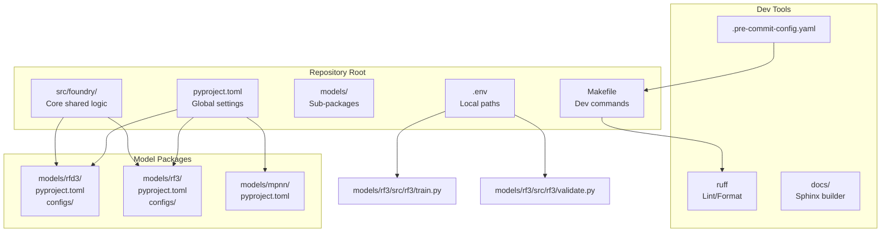
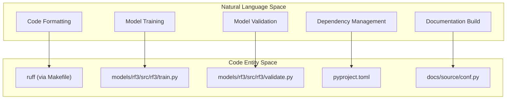

# Development Setup

> **Relevant source files**
> * [.github/workflows/lint_production.yaml](https://github.com/RosettaCommons/foundry/blob/cee116dc/.github/workflows/lint_production.yaml)
> * [CONTRIBUTING.md](https://github.com/RosettaCommons/foundry/blob/cee116dc/CONTRIBUTING.md?plain=1)
> * [Makefile](https://github.com/RosettaCommons/foundry/blob/cee116dc/Makefile)
> * [docs/docs_requirements.txt](https://github.com/RosettaCommons/foundry/blob/cee116dc/docs/docs_requirements.txt)
> * [docs/source/_static/ga.js](https://github.com/RosettaCommons/foundry/blob/cee116dc/docs/source/_static/ga.js)
> * [docs/source/conf.py](https://github.com/RosettaCommons/foundry/blob/cee116dc/docs/source/conf.py)
> * [docs/source/contributing_link.rst](https://github.com/RosettaCommons/foundry/blob/cee116dc/docs/source/contributing_link.rst)
> * [docs/source/index.rst](https://github.com/RosettaCommons/foundry/blob/cee116dc/docs/source/index.rst)
> * [models/rf3/src/rf3/train.py](https://github.com/RosettaCommons/foundry/blob/cee116dc/models/rf3/src/rf3/train.py)
> * [models/rf3/src/rf3/validate.py](https://github.com/RosettaCommons/foundry/blob/cee116dc/models/rf3/src/rf3/validate.py)
> * [models/rf3/tests/conftest.py](https://github.com/RosettaCommons/foundry/blob/cee116dc/models/rf3/tests/conftest.py)

This page provides instructions for setting up a development environment to contribute to or extend the Foundry codebase. For basic installation and usage, see [Installation](/RosettaCommons/foundry/2.1-installation). For project structure details, see [Project Structure](/RosettaCommons/foundry/11.1-project-structure). For contribution guidelines, see [Contributing](/RosettaCommons/foundry/11.3-contributing).

## Prerequisites

**Python Version**: Foundry requires Python 3.12 or higher.

**Package Manager**: Development uses `uv`, a fast Python package installer and resolver. Install it first:

```
pip install uv
```

**Git Repository**: Clone the Foundry repository:

```
git clone https://github.com/RosettaCommons/foundry.gitcd foundry
```

**Sources**: [.github/workflows/lint_production.yaml L26-L27](https://github.com/RosettaCommons/foundry/blob/cee116dc/.github/workflows/lint_production.yaml#L26-L27)

 [CONTRIBUTING.md L20-L24](https://github.com/RosettaCommons/foundry/blob/cee116dc/CONTRIBUTING.md?plain=1#L20-L24)

## Installation for Development

### Editable Installation

Install the entire Foundry ecosystem in editable mode for development. This allows you to modify shared utilities and see changes immediately across all models.

```
uv pip install -e '.[all,dev]'
```

This command installs:

* Core `foundry` package from `src/foundry/`
* All model packages located in `models/`
* All optional dependencies (`[all]`)
* Development tools (`[dev]`) including `ruff` and `pre-commit`

**Sources**: [CONTRIBUTING.md L20-L29](https://github.com/RosettaCommons/foundry/blob/cee116dc/CONTRIBUTING.md?plain=1#L20-L29)

 [CONTRIBUTING.md L62-L65](https://github.com/RosettaCommons/foundry/blob/cee116dc/CONTRIBUTING.md?plain=1#L62-L65)

### Development Dependencies

The `[dev]` extra includes tools for linting, formatting, and building documentation.

| Category | Tools |
| --- | --- |
| Linting & Formatting | `ruff`, `pre-commit` |
| Documentation | `sphinx`, `myst-parser`, `furo`, `sphinx-copybutton` |
| Build System | `Makefile` |

**Sources**: [docs/docs_requirements.txt L1-L4](https://github.com/RosettaCommons/foundry/blob/cee116dc/docs/docs_requirements.txt#L1-L4)

 [.github/workflows/lint_production.yaml L28-L33](https://github.com/RosettaCommons/foundry/blob/cee116dc/.github/workflows/lint_production.yaml#L28-L33)

 [CONTRIBUTING.md L43-L49](https://github.com/RosettaCommons/foundry/blob/cee116dc/CONTRIBUTING.md?plain=1#L43-L49)

## Development Environment Structure

The following diagram illustrates the development environment setup and how the configuration flows from the environment and repository root to the specific model implementations.

**Foundry Development Architecture**



**Sources**: [CONTRIBUTING.md L12-L19](https://github.com/RosettaCommons/foundry/blob/cee116dc/CONTRIBUTING.md?plain=1#L12-L19)

 [models/rf3/src/rf3/train.py L18](https://github.com/RosettaCommons/foundry/blob/cee116dc/models/rf3/src/rf3/train.py#L18-L18)

 [models/rf3/src/rf3/validate.py L13](https://github.com/RosettaCommons/foundry/blob/cee116dc/models/rf3/src/rf3/validate.py#L13-L13)

 [Makefile L16-L18](https://github.com/RosettaCommons/foundry/blob/cee116dc/Makefile#L16-L18)

## Environment Configuration

### Creating the .env File

Foundry relies on a `.env` file to manage local paths for data mirrors and external tools. This file is loaded at runtime by scripts using `dotenv`.

```javascript
# In training/inference scriptsfrom dotenv import load_dotenvload_dotenv(override=True)
```

**Sources**: [models/rf3/src/rf3/train.py L18](https://github.com/RosettaCommons/foundry/blob/cee116dc/models/rf3/src/rf3/train.py#L18-L18)

 [models/rf3/src/rf3/validate.py L13](https://github.com/RosettaCommons/foundry/blob/cee116dc/models/rf3/src/rf3/validate.py#L13-L13)

### Required Path Management

Training and validation scripts resolve project roots and configuration paths dynamically to ensure they work across different environments.

| Script | Root Resolution | Config Path |
| --- | --- | --- |
| `train.py` | `rootutils.setup_root` | `models/rf3/configs` |
| `validate.py` | `rootutils.setup_root` | `models/rf3/configs` |

**Sources**: [models/rf3/src/rf3/train.py L16-L20](https://github.com/RosettaCommons/foundry/blob/cee116dc/models/rf3/src/rf3/train.py#L16-L20)

 [models/rf3/src/rf3/validate.py L17-L19](https://github.com/RosettaCommons/foundry/blob/cee116dc/models/rf3/src/rf3/validate.py#L17-L19)

## Development Tools Setup

### Pre-commit Hooks and Formatting

Foundry uses `ruff` for both linting and formatting. A `Makefile` is provided to simplify these operations.

**Enable Git Hooks**:

```
pip install pre-commitpre-commit install
```

**Manual Formatting**:
To format the `src`, `models`, and `tests` directories, run:

```
make format
```

This executes `ruff format` followed by `ruff check --fix`.

**Sources**: [Makefile L16-L18](https://github.com/RosettaCommons/foundry/blob/cee116dc/Makefile#L16-L18)

 [CONTRIBUTING.md L43-L49](https://github.com/RosettaCommons/foundry/blob/cee116dc/CONTRIBUTING.md?plain=1#L43-L49)

 [.github/workflows/lint_production.yaml L34-L37](https://github.com/RosettaCommons/foundry/blob/cee116dc/.github/workflows/lint_production.yaml#L34-L37)

### Clean Workspace

To remove all compiled Python files, `__pycache__` directories, and test/ruff caches:

```
make clean
```

**Sources**: [Makefile L8-L13](https://github.com/RosettaCommons/foundry/blob/cee116dc/Makefile#L8-L13)

## Model Development Workflow

### Adding a New Model

To incorporate a new model into the Foundry ecosystem:

1. Create a `models/<model_name>` directory.
2. Add a `pyproject.toml` specific to the model.
3. Define `foundry` as a dependency in the model's `pyproject.toml`.
4. Implement specific logic in `models/<model_name>/src/`.
5. Install in editable mode: `uv pip install -e ./models/<model_name>`.

**Sources**: [CONTRIBUTING.md L61-L70](https://github.com/RosettaCommons/foundry/blob/cee116dc/CONTRIBUTING.md?plain=1#L61-L70)

### Documentation Development

Foundry documentation is built using Sphinx with the Furo theme and MyST parser for Markdown support.

**Build Requirements**:
Install dependencies from `docs/docs_requirements.txt`:

```
uv pip install -r docs/docs_requirements.txt
```

**Building Locally**:

```
cd docsmake html
```

**Sources**: [CONTRIBUTING.md L72-L84](https://github.com/RosettaCommons/foundry/blob/cee116dc/CONTRIBUTING.md?plain=1#L72-L84)

 [docs/docs_requirements.txt L1-L4](https://github.com/RosettaCommons/foundry/blob/cee116dc/docs/docs_requirements.txt#L1-L4)

 [docs/source/conf.py L17-L29](https://github.com/RosettaCommons/foundry/blob/cee116dc/docs/source/conf.py#L17-L29)

### Model Documentation Integration

Model-specific documentation is maintained within each model's directory and symlinked to the central documentation source.

1. Create `models/<model_name>/docs`.
2. Symlink to the main source: ``` ln -s ../../../models/<model_name>/docs docs/source/models/<model_name> ```

**Sources**: [CONTRIBUTING.md L86-L96](https://github.com/RosettaCommons/foundry/blob/cee116dc/CONTRIBUTING.md?plain=1#L86-L96)

## Code Standards and Entity Mapping

The following diagram maps natural language development concepts to the specific code entities and files that implement them in the Foundry repository.

**Development Entity Map**



**Sources**: [Makefile L16-L18](https://github.com/RosettaCommons/foundry/blob/cee116dc/Makefile#L16-L18)

 [models/rf3/src/rf3/train.py L26](https://github.com/RosettaCommons/foundry/blob/cee116dc/models/rf3/src/rf3/train.py#L26-L26)

 [models/rf3/src/rf3/validate.py L25](https://github.com/RosettaCommons/foundry/blob/cee116dc/models/rf3/src/rf3/validate.py#L25-L25)

 [docs/source/conf.py L9-L12](https://github.com/RosettaCommons/foundry/blob/cee116dc/docs/source/conf.py#L9-L12)

## Testing and Validation

Tests for the core Foundry code are located in `foundry/tests`, while model-specific tests reside in their respective directories (e.g., `models/rf3/tests`).

**Test Configuration**:
Tests use fixtures and configuration utilities defined in `conftest.py` files.

* `configure_pytest`: Sets up the environment for model-specific tests.
* `get_test_data_dir`: Locates assets for unit testing.

**Sources**: [CONTRIBUTING.md L38-L41](https://github.com/RosettaCommons/foundry/blob/cee116dc/CONTRIBUTING.md?plain=1#L38-L41)

 [models/rf3/tests/conftest.py L3-L10](https://github.com/RosettaCommons/foundry/blob/cee116dc/models/rf3/tests/conftest.py#L3-L10)