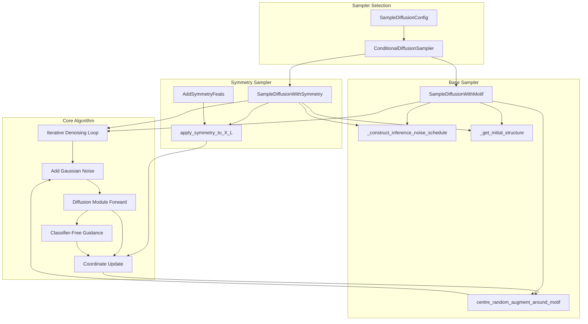
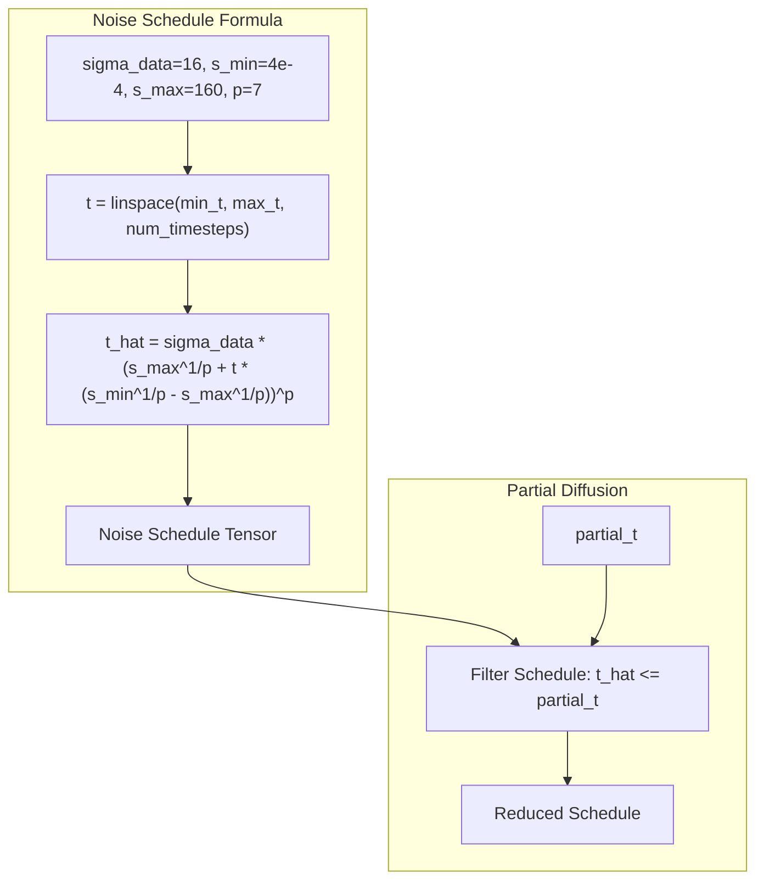
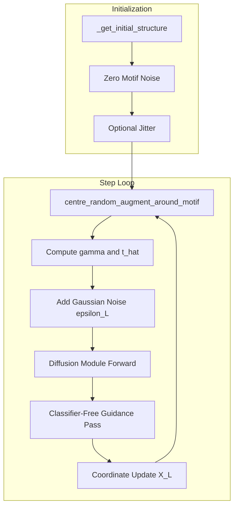
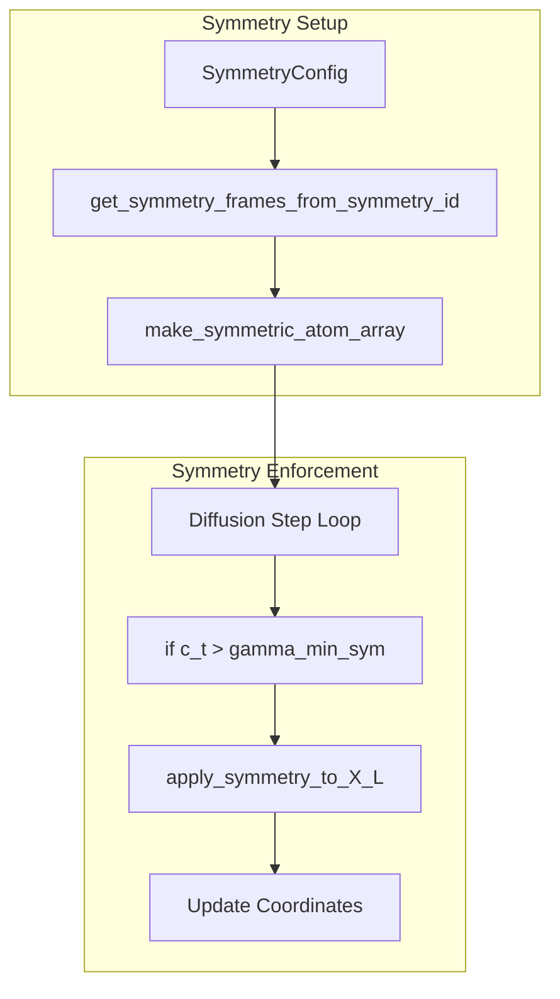

# Diffusion Sampling and Symmetry

> **Relevant source files**
> * [models/rfd3/.gitignore](https://github.com/RosettaCommons/foundry/blob/cee116dc/models/rfd3/.gitignore)
> * [models/rfd3/configs/model/samplers/symmetry.yaml](https://github.com/RosettaCommons/foundry/blob/cee116dc/models/rfd3/configs/model/samplers/symmetry.yaml)
> * [models/rfd3/src/rfd3/inference/parsing.py](https://github.com/RosettaCommons/foundry/blob/cee116dc/models/rfd3/src/rfd3/inference/parsing.py)
> * [models/rfd3/src/rfd3/inference/symmetry/atom_array.py](https://github.com/RosettaCommons/foundry/blob/cee116dc/models/rfd3/src/rfd3/inference/symmetry/atom_array.py)
> * [models/rfd3/src/rfd3/inference/symmetry/checks.py](https://github.com/RosettaCommons/foundry/blob/cee116dc/models/rfd3/src/rfd3/inference/symmetry/checks.py)
> * [models/rfd3/src/rfd3/inference/symmetry/frames.py](https://github.com/RosettaCommons/foundry/blob/cee116dc/models/rfd3/src/rfd3/inference/symmetry/frames.py)
> * [models/rfd3/src/rfd3/inference/symmetry/symmetry_utils.py](https://github.com/RosettaCommons/foundry/blob/cee116dc/models/rfd3/src/rfd3/inference/symmetry/symmetry_utils.py)
> * [models/rfd3/src/rfd3/model/inference_sampler.py](https://github.com/RosettaCommons/foundry/blob/cee116dc/models/rfd3/src/rfd3/model/inference_sampler.py)
> * [models/rfd3/src/rfd3/model/layers/block_utils.py](https://github.com/RosettaCommons/foundry/blob/cee116dc/models/rfd3/src/rfd3/model/layers/block_utils.py)
> * [models/rfd3/src/rfd3/transforms/symmetry.py](https://github.com/RosettaCommons/foundry/blob/cee116dc/models/rfd3/src/rfd3/transforms/symmetry.py)

This page documents the diffusion sampling process in RFdiffusion3, including the iterative denoising algorithm, noise schedule construction, motif alignment, classifier-free guidance, and comprehensive symmetry support for generating multimeric protein complexes. For information about input specifications and contig parsing, see [InputSpecification System](/RosettaCommons/foundry/4.2-inputspecification-system). For training details, see [RFD3 Training](/RosettaCommons/foundry/4.6-rfd3-training).

## Overview

RFdiffusion3 uses a conditional diffusion process based on the AlphaFold 3 sampling approach to generate protein backbone structures. The sampling system supports:

* **Standard diffusion sampling** with motif scaffolding [models/rfd3/src/rfd3/model/inference_sampler.py L58-L60](https://github.com/RosettaCommons/foundry/blob/cee116dc/models/rfd3/src/rfd3/model/inference_sampler.py#L58-L60)
* **Partial diffusion** starting from intermediate noise levels [models/rfd3/src/rfd3/model/inference_sampler.py L89-L131](https://github.com/RosettaCommons/foundry/blob/cee116dc/models/rfd3/src/rfd3/model/inference_sampler.py#L89-L131)
* **Motif realignment** at each diffusion step [models/rfd3/src/rfd3/model/inference_sampler.py L593-L605](https://github.com/RosettaCommons/foundry/blob/cee116dc/models/rfd3/src/rfd3/model/inference_sampler.py#L593-L605)
* **Classifier-free guidance** for conditional generation [models/rfd3/src/rfd3/model/inference_sampler.py L265-L295](https://github.com/RosettaCommons/foundry/blob/cee116dc/models/rfd3/src/rfd3/model/inference_sampler.py#L265-L295)
* **Symmetry constraints** for cyclic, dihedral, and polyhedral multimers [models/rfd3/src/rfd3/inference/symmetry/symmetry_utils.py L66-L153](https://github.com/RosettaCommons/foundry/blob/cee116dc/models/rfd3/src/rfd3/inference/symmetry/symmetry_utils.py#L66-L153)

The core implementation consists of two main sampler classes: `SampleDiffusionWithMotif` (standard) and `SampleDiffusionWithSymmetry` (symmetry-aware), both orchestrated by `ConditionalDiffusionSampler`.

**Sources:** [models/rfd3/src/rfd3/model/inference_sampler.py L1-L646](https://github.com/RosettaCommons/foundry/blob/cee116dc/models/rfd3/src/rfd3/model/inference_sampler.py#L1-L646)

 [models/rfd3/src/rfd3/inference/symmetry/symmetry_utils.py L1-L153](https://github.com/RosettaCommons/foundry/blob/cee116dc/models/rfd3/src/rfd3/inference/symmetry/symmetry_utils.py#L1-L153)

## Sampler Architecture

The sampling system uses a registry pattern to select between different sampling strategies at runtime.



**Sources:** [models/rfd3/src/rfd3/model/inference_sampler.py L24-L591](https://github.com/RosettaCommons/foundry/blob/cee116dc/models/rfd3/src/rfd3/model/inference_sampler.py#L24-L591)

 [models/rfd3/src/rfd3/transforms/symmetry.py L10-L38](https://github.com/RosettaCommons/foundry/blob/cee116dc/models/rfd3/src/rfd3/transforms/symmetry.py#L10-L38)

| Component | Purpose | Key Parameters |
| --- | --- | --- |
| `ConditionalDiffusionSampler` | Registry that selects sampler based on `kind` | `kind="default"` or `kind="symmetry"` [models/rfd3/src/rfd3/model/inference_sampler.py L550-L591](https://github.com/RosettaCommons/foundry/blob/cee116dc/models/rfd3/src/rfd3/model/inference_sampler.py#L550-L591) |
| `SampleDiffusionConfig` | Configuration dataclass | `num_timesteps=200`, `gamma_0=0.6`, `step_scale=1.5`, `cfg_scale=2.0` [models/rfd3/src/rfd3/model/inference_sampler.py L24-L51](https://github.com/RosettaCommons/foundry/blob/cee116dc/models/rfd3/src/rfd3/model/inference_sampler.py#L24-L51) |
| `SampleDiffusionWithMotif` | Base sampler implementation | Motif alignment, CFG support [models/rfd3/src/rfd3/model/inference_sampler.py L58-L343](https://github.com/RosettaCommons/foundry/blob/cee116dc/models/rfd3/src/rfd3/model/inference_sampler.py#L58-L343) |
| `SampleDiffusionWithSymmetry` | Symmetry-constrained sampler | `sym_step_frac=0.9`, symmetry enforcement [models/rfd3/src/rfd3/model/inference_sampler.py L345-L547](https://github.com/RosettaCommons/foundry/blob/cee116dc/models/rfd3/src/rfd3/model/inference_sampler.py#L345-L547) |

**Sources:** [models/rfd3/src/rfd3/model/inference_sampler.py L24-L591](https://github.com/RosettaCommons/foundry/blob/cee116dc/models/rfd3/src/rfd3/model/inference_sampler.py#L24-L591)

## Noise Schedule Construction

The diffusion process uses an AlphaFold 3-style noise schedule that determines the noise levels at each timestep.



The noise schedule is constructed using the formula from AF3 supplement Section 3.7.1:

```
t_hat = self.sigma_data * ((self.s_max) ** (1 / self.p) + t * (self.s_min ** (1 / self.p) - self.s_max ** (1 / self.p))) ** self.p
```

[models/rfd3/src/rfd3/model/inference_sampler.py L80-L87](https://github.com/RosettaCommons/foundry/blob/cee116dc/models/rfd3/src/rfd3/model/inference_sampler.py#L80-L87)

**Partial Diffusion:** When `partial_t` is provided, the noise schedule is filtered to only include timesteps where `t_hat <= partial_t`, enabling diffusion from partially noised structures [models/rfd3/src/rfd3/model/inference_sampler.py L89-L131](https://github.com/RosettaCommons/foundry/blob/cee116dc/models/rfd3/src/rfd3/model/inference_sampler.py#L89-L131)

**Sources:** [models/rfd3/src/rfd3/model/inference_sampler.py L61-L131](https://github.com/RosettaCommons/foundry/blob/cee116dc/models/rfd3/src/rfd3/model/inference_sampler.py#L61-L131)

## Diffusion Sampling Loop

The core sampling algorithm performs iterative denoising following the AF3 approach with stochastic differential equation (SDE) integration [models/rfd3/src/rfd3/model/inference_sampler.py L192-L342](https://github.com/RosettaCommons/foundry/blob/cee116dc/models/rfd3/src/rfd3/model/inference_sampler.py#L192-L342)



**Sources:** [models/rfd3/src/rfd3/model/inference_sampler.py L133-L342](https://github.com/RosettaCommons/foundry/blob/cee116dc/models/rfd3/src/rfd3/model/inference_sampler.py#L133-L342)

### Key Algorithm Parameters

| Parameter | Default | Description |
| --- | --- | --- |
| `num_timesteps` | 200 | Number of diffusion steps [models/rfd3/src/rfd3/model/inference_sampler.py L29](https://github.com/RosettaCommons/foundry/blob/cee116dc/models/rfd3/src/rfd3/model/inference_sampler.py#L29-L29) |
| `gamma_0` | 0.6 | Noise injection parameter [models/rfd3/src/rfd3/model/inference_sampler.py L36](https://github.com/RosettaCommons/foundry/blob/cee116dc/models/rfd3/src/rfd3/model/inference_sampler.py#L36-L36) |
| `noise_scale` | 1.003 | Scaling factor for noise injection [models/rfd3/src/rfd3/model/inference_sampler.py L38](https://github.com/RosettaCommons/foundry/blob/cee116dc/models/rfd3/src/rfd3/model/inference_sampler.py#L38-L38) |
| `step_scale` | 1.5 | Scaling factor for coordinate updates [models/rfd3/src/rfd3/model/inference_sampler.py L39](https://github.com/RosettaCommons/foundry/blob/cee116dc/models/rfd3/src/rfd3/model/inference_sampler.py#L39-L39) |

**Sources:** [models/rfd3/src/rfd3/model/inference_sampler.py L25-L40](https://github.com/RosettaCommons/foundry/blob/cee116dc/models/rfd3/src/rfd3/model/inference_sampler.py#L25-L40)

 [models/rfd3/configs/model/samplers/symmetry.yaml L6-L10](https://github.com/RosettaCommons/foundry/blob/cee116dc/models/rfd3/configs/model/samplers/symmetry.yaml#L6-L10)

## Motif Alignment and Centering

At each diffusion step, the structure can be realigned to maintain motif constraints through `centre_random_augment_around_motif` [models/rfd3/src/rfd3/model/inference_sampler.py L593-L646](https://github.com/RosettaCommons/foundry/blob/cee116dc/models/rfd3/src/rfd3/model/inference_sampler.py#L593-L646)

### Centering Options

The `center_option` parameter controls the centering strategy [models/rfd3/src/rfd3/model/inference_sampler.py L43-L631](https://github.com/RosettaCommons/foundry/blob/cee116dc/models/rfd3/src/rfd3/model/inference_sampler.py#L43-L631)

:

| Option | Description |
| --- | --- |
| `"motif"` | Center on motif center-of-mass |
| `"diffuse"` | Center on diffused region COM |
| `"all"` | Center on entire structure COM |

### Alignment Control

* **`fraction_of_steps_to_fix_motif`**: Fraction of steps during which motif position is fixed relative to origin [models/rfd3/src/rfd3/model/inference_sampler.py L46-L190](https://github.com/RosettaCommons/foundry/blob/cee116dc/models/rfd3/src/rfd3/model/inference_sampler.py#L46-L190)
* **`allow_realignment`**: If `True`, applies recentering and random augmentation at each step [models/rfd3/src/rfd3/model/inference_sampler.py L48-L200](https://github.com/RosettaCommons/foundry/blob/cee116dc/models/rfd3/src/rfd3/model/inference_sampler.py#L48-L200)
* **`insert_motif_at_end`**: If `True`, performs final motif insertion after diffusion [models/rfd3/src/rfd3/model/inference_sampler.py L49-L341](https://github.com/RosettaCommons/foundry/blob/cee116dc/models/rfd3/src/rfd3/model/inference_sampler.py#L49-L341)

**Sources:** [models/rfd3/src/rfd3/model/inference_sampler.py L43-L646](https://github.com/RosettaCommons/foundry/blob/cee116dc/models/rfd3/src/rfd3/model/inference_sampler.py#L43-L646)

## Classifier-Free Guidance

Classifier-free guidance (CFG) combines conditional and unconditional predictions to strengthen conditioning [models/rfd3/src/rfd3/model/inference_sampler.py L265-L295](https://github.com/RosettaCommons/foundry/blob/cee116dc/models/rfd3/src/rfd3/model/inference_sampler.py#L265-L295)

The CFG formula combines gradients:
`delta_L += (self.cfg_scale - 1) * (delta_L - delta_L_ref)` [models/rfd3/src/rfd3/model/inference_sampler.py L291](https://github.com/RosettaCommons/foundry/blob/cee116dc/models/rfd3/src/rfd3/model/inference_sampler.py#L291-L291)

* `delta_L`: Gradient from conditional forward pass.
* `delta_L_ref`: Gradient from unconditional pass (using `strip_X` to remove conditioning) [models/rfd3/src/rfd3/model/cfg_utils.py](https://github.com/RosettaCommons/foundry/blob/cee116dc/models/rfd3/src/rfd3/model/cfg_utils.py)
* `cfg_scale`: Guidance strength (default 2.0) [models/rfd3/src/rfd3/model/inference_sampler.py L51](https://github.com/RosettaCommons/foundry/blob/cee116dc/models/rfd3/src/rfd3/model/inference_sampler.py#L51-L51)

**Sources:** [models/rfd3/src/rfd3/model/inference_sampler.py L50-L295](https://github.com/RosettaCommons/foundry/blob/cee116dc/models/rfd3/src/rfd3/model/inference_sampler.py#L50-L295)

 [models/rfd3/src/rfd3/model/cfg_utils.py L10](https://github.com/RosettaCommons/foundry/blob/cee116dc/models/rfd3/src/rfd3/model/cfg_utils.py#L10-L10)

## Symmetry Sampling

`SampleDiffusionWithSymmetry` enforces symmetry constraints during diffusion [models/rfd3/src/rfd3/model/inference_sampler.py L345-L547](https://github.com/RosettaCommons/foundry/blob/cee116dc/models/rfd3/src/rfd3/model/inference_sampler.py#L345-L547)



**Sources:** [models/rfd3/src/rfd3/model/inference_sampler.py L345-L547](https://github.com/RosettaCommons/foundry/blob/cee116dc/models/rfd3/src/rfd3/model/inference_sampler.py#L345-L547)

 [models/rfd3/src/rfd3/inference/symmetry/symmetry_utils.py L66-L153](https://github.com/RosettaCommons/foundry/blob/cee116dc/models/rfd3/src/rfd3/inference/symmetry/symmetry_utils.py#L66-L153)

### Symmetry Application to Coordinates

The `apply_symmetry_to_xyz_atomwise` function enforces symmetry by copying the ASU coordinates to all symmetric subunits [models/rfd3/src/rfd3/inference/symmetry/symmetry_utils.py L328-L376](https://github.com/RosettaCommons/foundry/blob/cee116dc/models/rfd3/src/rfd3/inference/symmetry/symmetry_utils.py#L328-L376)

1. **COM Correction**: Centers the structure while respecting fixed motifs [models/rfd3/src/rfd3/inference/symmetry/symmetry_utils.py L344-L348](https://github.com/RosettaCommons/foundry/blob/cee116dc/models/rfd3/src/rfd3/inference/symmetry/symmetry_utils.py#L344-L348)
2. **ASU Extraction**: Identifies the asymmetric unit coordinates [models/rfd3/src/rfd3/inference/symmetry/symmetry_utils.py L355-L356](https://github.com/RosettaCommons/foundry/blob/cee116dc/models/rfd3/src/rfd3/inference/symmetry/symmetry_utils.py#L355-L356)
3. **Symmetry Expansion**: Applies rotation matrices `R` and translations `T` to the ASU to populate all subunits [models/rfd3/src/rfd3/inference/symmetry/symmetry_utils.py L365-L373](https://github.com/RosettaCommons/foundry/blob/cee116dc/models/rfd3/src/rfd3/inference/symmetry/symmetry_utils.py#L365-L373)

**Sources:** [models/rfd3/src/rfd3/inference/symmetry/symmetry_utils.py L328-L376](https://github.com/RosettaCommons/foundry/blob/cee116dc/models/rfd3/src/rfd3/inference/symmetry/symmetry_utils.py#L328-L376)

## Supported Symmetry Types

RFdiffusion3 supports various point group symmetries [models/rfd3/src/rfd3/inference/symmetry/frames.py L5-L39](https://github.com/RosettaCommons/foundry/blob/cee116dc/models/rfd3/src/rfd3/inference/symmetry/frames.py#L5-L39)

| Symmetry | ID Prefix | Number of Frames | Implementation |
| --- | --- | --- | --- |
| Cyclic | `C` | n | `get_cyclic_frames(n)` [models/rfd3/src/rfd3/inference/symmetry/frames.py L21-L23](https://github.com/RosettaCommons/foundry/blob/cee116dc/models/rfd3/src/rfd3/inference/symmetry/frames.py#L21-L23) |
| Dihedral | `D` | 2n | `get_dihedral_frames(n)` [models/rfd3/src/rfd3/inference/symmetry/frames.py L24-L26](https://github.com/RosettaCommons/foundry/blob/cee116dc/models/rfd3/src/rfd3/inference/symmetry/frames.py#L24-L26) |
| Tetrahedral | `T` | 12 | `get_tetrahedral_frames()` [models/rfd3/src/rfd3/inference/symmetry/frames.py L270-L305](https://github.com/RosettaCommons/foundry/blob/cee116dc/models/rfd3/src/rfd3/inference/symmetry/frames.py#L270-L305) |
| Octahedral | `O` | 24 | `get_octahedral_frames()` [models/rfd3/src/rfd3/inference/symmetry/frames.py L308-L364](https://github.com/RosettaCommons/foundry/blob/cee116dc/models/rfd3/src/rfd3/inference/symmetry/frames.py#L308-L364) |
| Icosahedral | `I` | 60 | `get_icosahedral_frames()` [models/rfd3/src/rfd3/inference/symmetry/frames.py L367-L506](https://github.com/RosettaCommons/foundry/blob/cee116dc/models/rfd3/src/rfd3/inference/symmetry/frames.py#L367-L506) |

**Sources:** [models/rfd3/src/rfd3/inference/symmetry/frames.py L5-L506](https://github.com/RosettaCommons/foundry/blob/cee116dc/models/rfd3/src/rfd3/inference/symmetry/frames.py#L5-L506)

## Unsymmetrized Motifs

The `is_unsym_motif` configuration allows specific chains (like DNA or ligands) to remain as single copies in a symmetric assembly [models/rfd3/src/rfd3/inference/symmetry/symmetry_utils.py L50-L125](https://github.com/RosettaCommons/foundry/blob/cee116dc/models/rfd3/src/rfd3/inference/symmetry/symmetry_utils.py#L50-L125)

* **Extraction**: Un-symmetrized elements are extracted from the ASU atom array before symmetry frames are applied [models/rfd3/src/rfd3/inference/symmetry/symmetry_utils.py L118-L122](https://github.com/RosettaCommons/foundry/blob/cee116dc/models/rfd3/src/rfd3/inference/symmetry/symmetry_utils.py#L118-L122)
* **Annotation**: These elements are annotated with `FIXED_TRANSFORM_ID` (-1) and `FIXED_ENTITY_ID` (-1) [models/rfd3/src/rfd3/inference/symmetry/atom_array.py L7-L184](https://github.com/RosettaCommons/foundry/blob/cee116dc/models/rfd3/src/rfd3/inference/symmetry/atom_array.py#L7-L184)
* **Concatenation**: They are appended back to the final symmetrized atom array [models/rfd3/src/rfd3/inference/symmetry/symmetry_utils.py L133-L139](https://github.com/RosettaCommons/foundry/blob/cee116dc/models/rfd3/src/rfd3/inference/symmetry/symmetry_utils.py#L133-L139)

**Sources:** [models/rfd3/src/rfd3/inference/symmetry/symmetry_utils.py L50-L139](https://github.com/RosettaCommons/foundry/blob/cee116dc/models/rfd3/src/rfd3/inference/symmetry/symmetry_utils.py#L50-L139)

 [models/rfd3/src/rfd3/inference/symmetry/atom_array.py L7-L184](https://github.com/RosettaCommons/foundry/blob/cee116dc/models/rfd3/src/rfd3/inference/symmetry/atom_array.py#L7-L184)