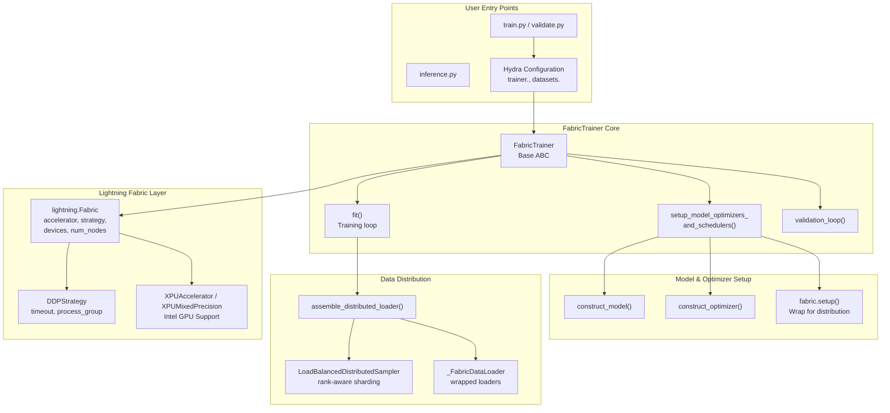
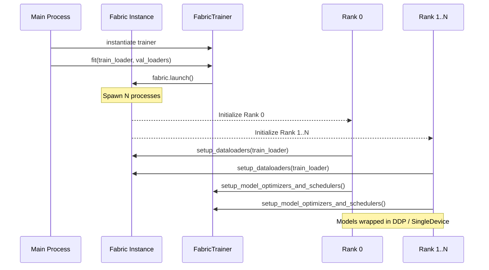
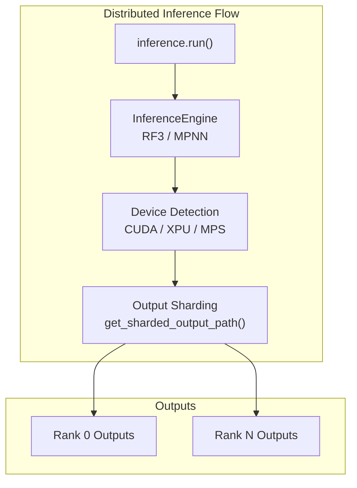

# Distributed Training and Inference

> **Relevant source files**
> * [models/mpnn/src/mpnn/inference_engines/mpnn.py](https://github.com/RosettaCommons/foundry/blob/cee116dc/models/mpnn/src/mpnn/inference_engines/mpnn.py)
> * [models/mpnn/src/mpnn/model/mpnn.py](https://github.com/RosettaCommons/foundry/blob/cee116dc/models/mpnn/src/mpnn/model/mpnn.py)
> * [models/rf3/configs/inference_engine/base.yaml](https://github.com/RosettaCommons/foundry/blob/cee116dc/models/rf3/configs/inference_engine/base.yaml)
> * [models/rf3/configs/inference_engine/rf3.yaml](https://github.com/RosettaCommons/foundry/blob/cee116dc/models/rf3/configs/inference_engine/rf3.yaml)
> * [models/rf3/configs/trainer/xpu.yaml](https://github.com/RosettaCommons/foundry/blob/cee116dc/models/rf3/configs/trainer/xpu.yaml)
> * [models/rf3/src/rf3/data/extra_xforms.py](https://github.com/RosettaCommons/foundry/blob/cee116dc/models/rf3/src/rf3/data/extra_xforms.py)
> * [models/rf3/src/rf3/data/pipelines.py](https://github.com/RosettaCommons/foundry/blob/cee116dc/models/rf3/src/rf3/data/pipelines.py)
> * [models/rf3/src/rf3/inference.py](https://github.com/RosettaCommons/foundry/blob/cee116dc/models/rf3/src/rf3/inference.py)
> * [models/rf3/src/rf3/inference_engines/rf3.py](https://github.com/RosettaCommons/foundry/blob/cee116dc/models/rf3/src/rf3/inference_engines/rf3.py)
> * [models/rf3/src/rf3/symmetry/resolve.py](https://github.com/RosettaCommons/foundry/blob/cee116dc/models/rf3/src/rf3/symmetry/resolve.py)
> * [models/rf3/src/rf3/utils/inference.py](https://github.com/RosettaCommons/foundry/blob/cee116dc/models/rf3/src/rf3/utils/inference.py)
> * [models/rfd3/configs/trainer/xpu.yaml](https://github.com/RosettaCommons/foundry/blob/cee116dc/models/rfd3/configs/trainer/xpu.yaml)
> * [src/foundry/trainers/fabric.py](https://github.com/RosettaCommons/foundry/blob/cee116dc/src/foundry/trainers/fabric.py)
> * [src/foundry/utils/ddp.py](https://github.com/RosettaCommons/foundry/blob/cee116dc/src/foundry/utils/ddp.py)
> * [src/foundry/utils/xpu/__init__.py](https://github.com/RosettaCommons/foundry/blob/cee116dc/src/foundry/utils/xpu/__init__.py)
> * [src/foundry/utils/xpu/single_xpu_strategy.py](https://github.com/RosettaCommons/foundry/blob/cee116dc/src/foundry/utils/xpu/single_xpu_strategy.py)
> * [src/foundry/utils/xpu/xpu_accelerator.py](https://github.com/RosettaCommons/foundry/blob/cee116dc/src/foundry/utils/xpu/xpu_accelerator.py)
> * [src/foundry/utils/xpu/xpu_precision.py](https://github.com/RosettaCommons/foundry/blob/cee116dc/src/foundry/utils/xpu/xpu_precision.py)

This page documents the distributed training and inference infrastructure in Foundry, which enables efficient training and inference across multiple GPUs and multiple nodes using Lightning Fabric. The system provides transparent abstractions for data parallelism, gradient synchronization, and checkpoint management, with native support for NVIDIA GPUs, Intel XPUs, and Apple MPS.

For model-specific training details, see [RF3 Training](/RosettaCommons/foundry/5.8-rf3-training) and [RFD3 Training](/RosettaCommons/foundry/4.6-rfd3-training). For the underlying training infrastructure components, see [Training Infrastructure](/RosettaCommons/foundry/8.4-training-infrastructure).

## Overview

Foundry's distributed system is built on **Lightning Fabric**, which provides hardware-agnostic abstractions for distributed computing. The core component is `FabricTrainer`, a base class that handles:

* Multi-GPU training within a single node.
* Multi-node training across compute clusters.
* Intel XPU support via custom accelerator and precision plugins [src/foundry/utils/xpu/__init__.py L1-L27](https://github.com/RosettaCommons/foundry/blob/cee116dc/src/foundry/utils/xpu/__init__.py#L1-L27)
* Distributed data loading with proper rank-based sharding.
* Gradient accumulation and synchronization [src/foundry/trainers/fabric.py L101-L128](https://github.com/RosettaCommons/foundry/blob/cee116dc/src/foundry/trainers/fabric.py#L101-L128)
* Checkpoint saving/loading in distributed contexts.
* Mixed precision training (fp16, bf16).

The system supports multiple distribution strategies, with **DDP (Distributed Data Parallel)** as the primary approach for model parallelism.

**Sources:** [src/foundry/trainers/fabric.py L57-L128](https://github.com/RosettaCommons/foundry/blob/cee116dc/src/foundry/trainers/fabric.py#L57-L128)

 [src/foundry/utils/xpu/__init__.py L1-L27](https://github.com/RosettaCommons/foundry/blob/cee116dc/src/foundry/utils/xpu/__init__.py#L1-L27)

## Architecture Overview



**Sources:** [src/foundry/trainers/fabric.py L57-L128](https://github.com/RosettaCommons/foundry/blob/cee116dc/src/foundry/trainers/fabric.py#L57-L128)

 [src/foundry/utils/xpu/xpu_accelerator.py L9-L15](https://github.com/RosettaCommons/foundry/blob/cee116dc/src/foundry/utils/xpu/xpu_accelerator.py#L9-L15)

 [models/rf3/src/rf3/inference_engines/rf3.py L17](https://github.com/RosettaCommons/foundry/blob/cee116dc/models/rf3/src/rf3/inference_engines/rf3.py#L17-L17)

## FabricTrainer: Core Training Harness

### Initialization and Configuration

The `FabricTrainer` class [src/foundry/trainers/fabric.py L57-L128](https://github.com/RosettaCommons/foundry/blob/cee116dc/src/foundry/trainers/fabric.py#L57-L128)

 wraps Lightning Fabric and provides a standardized interface for distributed training:

| Parameter | Type | Purpose |
| --- | --- | --- |
| `accelerator` | str \| Accelerator | Hardware type: "cpu", "cuda", "gpu", "mps", "xpu", "auto" |
| `strategy` | str \| Strategy | Distribution strategy: "ddp", "ddp_spawn", "fsdp", "deepspeed" |
| `devices_per_node` | int \| list \| str | Number/list of devices per node or "auto" |
| `num_nodes` | int | Number of machines for multi-node training |
| `precision` | str \| int | Numeric precision: "32-true", "16-mixed", "bf16-mixed" |
| `grad_accum_steps` | int | Gradient accumulation steps before optimizer.step() |
| `nccl_timeout` | int | NCCL timeout in seconds (default: 3200) |

**XPU Support:** If Intel XPUs are detected, the system automatically configures the `XPUAccelerator` and `XPUMixedPrecision` plugin [src/foundry/utils/ddp.py L39-L41](https://github.com/RosettaCommons/foundry/blob/cee116dc/src/foundry/utils/ddp.py#L39-L41)

 `XPUMixedPrecision` overrides the default behavior to use `torch.autocast(device_type="xpu")` [src/foundry/utils/xpu/xpu_precision.py L44-L49](https://github.com/RosettaCommons/foundry/blob/cee116dc/src/foundry/utils/xpu/xpu_precision.py#L44-L49)

**Sources:** [src/foundry/trainers/fabric.py L57-L128](https://github.com/RosettaCommons/foundry/blob/cee116dc/src/foundry/trainers/fabric.py#L57-L128)

 [src/foundry/utils/ddp.py L22-L55](https://github.com/RosettaCommons/foundry/blob/cee116dc/src/foundry/utils/ddp.py#L22-L55)

 [src/foundry/utils/xpu/xpu_precision.py L11-L49](https://github.com/RosettaCommons/foundry/blob/cee116dc/src/foundry/utils/xpu/xpu_precision.py#L11-L49)

### Process Spawning and Setup



**Sources:** [src/foundry/trainers/fabric.py L57-L128](https://github.com/RosettaCommons/foundry/blob/cee116dc/src/foundry/trainers/fabric.py#L57-L128)

 [src/foundry/utils/xpu/single_xpu_strategy.py L13-L48](https://github.com/RosettaCommons/foundry/blob/cee116dc/src/foundry/utils/xpu/single_xpu_strategy.py#L13-L48)

## Distributed Data Loading

### Load Balancing

For inference, especially in models like RF3, a `LoadBalancedDistributedSampler` is used to distribute work across ranks [models/rf3/src/rf3/inference_engines/rf3.py L17](https://github.com/RosettaCommons/foundry/blob/cee116dc/models/rf3/src/rf3/inference_engines/rf3.py#L17-L17)

 This ensures that different GPUs do not process the same structures and that the workload is distributed evenly based on the dataset size.

### Training Data Distribution

The `FabricTrainer` handles the setup of distributed dataloaders by wrapping them in `_FabricDataLoader` [src/foundry/trainers/fabric.py L23-L27](https://github.com/RosettaCommons/foundry/blob/cee116dc/src/foundry/trainers/fabric.py#L23-L27)

 This ensures that:

* Data is sharded across ranks.
* Workers are properly seeded for reproducibility.
* Prefetching and pinning are optimized for the specific accelerator.

**Sources:** [src/foundry/trainers/fabric.py L23-L27](https://github.com/RosettaCommons/foundry/blob/cee116dc/src/foundry/trainers/fabric.py#L23-L27)

 [models/rf3/src/rf3/inference_engines/rf3.py L17](https://github.com/RosettaCommons/foundry/blob/cee116dc/models/rf3/src/rf3/inference_engines/rf3.py#L17-L17)

## Distributed Inference Management

Inference engines like `RF3InferenceEngine` and `MPNNInferenceEngine` are designed to be rank-aware.



### Rank-Aware Output Sharding

To prevent file collisions when running inference on multiple GPUs, the system uses sharding patterns. In RF3, `get_sharded_output_path` ensures that each rank writes to a distinct subdirectory or file prefix [models/rf3/src/rf3/inference_engines/rf3.py L34-L35](https://github.com/RosettaCommons/foundry/blob/cee116dc/models/rf3/src/rf3/inference_engines/rf3.py#L34-L35)

### Device Detection logic

Inference engines implement a standard fallback for device selection [models/mpnn/src/mpnn/inference_engines/mpnn.py L70-L80](https://github.com/RosettaCommons/foundry/blob/cee116dc/models/mpnn/src/mpnn/inference_engines/mpnn.py#L70-L80)

:

1. Use explicit `device` if provided.
2. Fallback to `cuda` if available.
3. Fallback to `xpu` if available.
4. Fallback to `mps` if available.
5. Default to `cpu`.

**Sources:** [models/mpnn/src/mpnn/inference_engines/mpnn.py L70-L80](https://github.com/RosettaCommons/foundry/blob/cee116dc/models/mpnn/src/mpnn/inference_engines/mpnn.py#L70-L80)

 [models/rf3/src/rf3/inference_engines/rf3.py L31-L35](https://github.com/RosettaCommons/foundry/blob/cee116dc/models/rf3/src/rf3/inference_engines/rf3.py#L31-L35)

## Rank-Aware Logging

The `RankedLogger` [src/foundry/utils/ddp.py L58-L112](https://github.com/RosettaCommons/foundry/blob/cee116dc/src/foundry/utils/ddp.py#L58-L112)

 is a wrapper around the standard Python logger that prefixes messages with the process rank.

* **Rank Zero Only:** Loggers can be configured with `rank_zero_only=True` to suppress output from worker ranks [src/foundry/utils/ddp.py L79-L80](https://github.com/RosettaCommons/foundry/blob/cee116dc/src/foundry/utils/ddp.py#L79-L80)
* **Rank Prefixing:** Messages are automatically prefixed with `[Rank N]` to help disambiguate logs in multi-GPU environments [src/foundry/utils/ddp.py L103](https://github.com/RosettaCommons/foundry/blob/cee116dc/src/foundry/utils/ddp.py#L103-L103)

```markdown
# Usage in inference enginesranked_logger = RankedLogger(__name__, rank_zero_only=True)ranked_logger.info("Starting inference...") # Only logs once
```

**Sources:** [src/foundry/utils/ddp.py L58-L112](https://github.com/RosettaCommons/foundry/blob/cee116dc/src/foundry/utils/ddp.py#L58-L112)

 [models/rf3/src/rf3/inference_engines/rf3.py L47](https://github.com/RosettaCommons/foundry/blob/cee116dc/models/rf3/src/rf3/inference_engines/rf3.py#L47-L47)

## Implementation Details

### Accelerator Detection

The `set_accelerator_based_on_availability` function modifies the Hydra configuration in-place to match the local hardware [src/foundry/utils/ddp.py L22-L55](https://github.com/RosettaCommons/foundry/blob/cee116dc/src/foundry/utils/ddp.py#L22-L55)

```
if torch.cuda.is_available():    cfg.trainer.accelerator = "gpu"elif hasattr(torch, "xpu") and torch.xpu.is_available():    cfg.trainer.accelerator = "xpu"
```

### Intel XPU Integration

Intel GPU support is facilitated through three primary components:

1. **XPUAccelerator:** Implements device setup and parsing for `torch.xpu` [src/foundry/utils/xpu/xpu_accelerator.py L9-L91](https://github.com/RosettaCommons/foundry/blob/cee116dc/src/foundry/utils/xpu/xpu_accelerator.py#L9-L91)
2. **SingleXPUStrategy:** Manages execution on a single XPU device [src/foundry/utils/xpu/single_xpu_strategy.py L13-L48](https://github.com/RosettaCommons/foundry/blob/cee116dc/src/foundry/utils/xpu/single_xpu_strategy.py#L13-L48)
3. **XPUMixedPrecision:** Handles autocast contexts specifically for the XPU device type [src/foundry/utils/xpu/xpu_precision.py L11-L73](https://github.com/RosettaCommons/foundry/blob/cee116dc/src/foundry/utils/xpu/xpu_precision.py#L11-L73)

**Sources:** [src/foundry/utils/ddp.py L22-L55](https://github.com/RosettaCommons/foundry/blob/cee116dc/src/foundry/utils/ddp.py#L22-L55)

 [src/foundry/utils/xpu/xpu_accelerator.py L9-L91](https://github.com/RosettaCommons/foundry/blob/cee116dc/src/foundry/utils/xpu/xpu_accelerator.py#L9-L91)

 [src/foundry/utils/xpu/single_xpu_strategy.py L13-L48](https://github.com/RosettaCommons/foundry/blob/cee116dc/src/foundry/utils/xpu/single_xpu_strategy.py#L13-L48)

 [src/foundry/utils/xpu/xpu_precision.py L11-L73](https://github.com/RosettaCommons/foundry/blob/cee116dc/src/foundry/utils/xpu/xpu_precision.py#L11-L73)