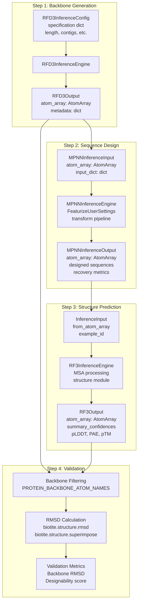
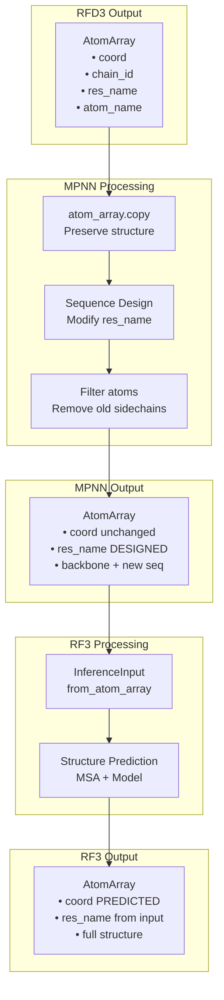
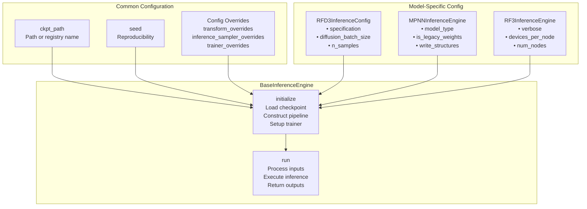

# End-to-End Workflows

> **Relevant source files**
> * [docs/_static/superimposed_80_residue_protein.png](https://github.com/RosettaCommons/foundry/blob/cee116dc/docs/_static/superimposed_80_residue_protein.png)
> * [examples/all.ipynb](https://github.com/RosettaCommons/foundry/blob/cee116dc/examples/all.ipynb)
> * [examples/ipd_design_pipeline_collab.ipynb](https://github.com/RosettaCommons/foundry/blob/cee116dc/examples/ipd_design_pipeline_collab.ipynb)
> * [models/rfd3/src/rfd3/engine.py](https://github.com/RosettaCommons/foundry/blob/cee116dc/models/rfd3/src/rfd3/engine.py)
> * [models/rfd3/src/rfd3/inference/datasets.py](https://github.com/RosettaCommons/foundry/blob/cee116dc/models/rfd3/src/rfd3/inference/datasets.py)
> * [models/rfd3/src/rfd3/utils/inference.py](https://github.com/RosettaCommons/foundry/blob/cee116dc/models/rfd3/src/rfd3/utils/inference.py)
> * [models/rfd3na/src/rfd3na/utils/inference.py](https://github.com/RosettaCommons/foundry/blob/cee116dc/models/rfd3na/src/rfd3na/utils/inference.py)

This page describes complete protein design workflows that combine multiple models from the Foundry ecosystem. End-to-end workflows chain together RFdiffusion3 (backbone generation), ProteinMPNN/LigandMPNN (sequence design), and RosettaFold3 (structure prediction and validation) to accomplish complex design tasks.

For detailed information about individual models, see:

* RFdiffusion3: [RFdiffusion3 (RFD3)](/RosettaCommons/foundry/4-rfdiffusion3-(rfd3))
* ProteinMPNN/LigandMPNN: [ProteinMPNN and LigandMPNN](/RosettaCommons/foundry/6-proteinmpnn-and-ligandmpnn)
* RosettaFold3: [RosettaFold3 (RF3)](/RosettaCommons/foundry/5-rosettafold3-(rf3))

For a complete walkthrough of the standard design pipeline with RMSD validation, see [Complete Design Pipeline](/RosettaCommons/foundry/7.1-complete-design-pipeline).

---

## Overview of End-to-End Design

End-to-end workflows leverage the complementary capabilities of the three primary models in Foundry:

| Model | Purpose | Input | Output |
| --- | --- | --- | --- |
| **RFdiffusion3** | Generate novel protein backbones | Design specification (JSON) | Protein backbone structures |
| **ProteinMPNN/LigandMPNN** | Design sequences for backbones | Protein backbone + design parameters | Designed sequences (in backbone) |
| **RosettaFold3** | Validate designability | Sequence (from MPNN) | Predicted structure + confidence metrics |

The standard workflow follows the pattern: **Generate → Design → Validate**. The final validation step compares the RF3-predicted structure against the original RFD3 backbone to assess designability through backbone RMSD.

**Sources:** [examples/all.ipynb L8-L28](https://github.com/RosettaCommons/foundry/blob/cee116dc/examples/all.ipynb#L8-L28)

---

## Pipeline Architecture

The following diagram shows the complete end-to-end pipeline with actual class names and data structures used in the codebase:



**Sources:** [examples/all.ipynb L63-L366](https://github.com/RosettaCommons/foundry/blob/cee116dc/examples/all.ipynb#L63-L366)

 [models/rfd3/src/rfd3/engine.py L44-L96](https://github.com/RosettaCommons/foundry/blob/cee116dc/models/rfd3/src/rfd3/engine.py#L44-L96)

---

## AtomArray as Data Interchange Format

All models in Foundry use Biotite's `AtomArray` as the universal data structure for representing molecular structures. This enables seamless data flow between models without format conversion. `RFD3InferenceEngine` produces `RFD3Output` which encapsulates the `AtomArray` [models/rfd3/src/rfd3/engine.py L91-L96](https://github.com/RosettaCommons/foundry/blob/cee116dc/models/rfd3/src/rfd3/engine.py#L91-L96)



**Key Integration Points:**

| Step | Code Location | Key Operation |
| --- | --- | --- |
| RFD3 → MPNN | [examples/all.ipynb L134-L136](https://github.com/RosettaCommons/foundry/blob/cee116dc/examples/all.ipynb#L134-L136) | `atom_array = outputs[first_key][0].atom_array` |
| MPNN Processing | [examples/all.ipynb L191-L192](https://github.com/RosettaCommons/foundry/blob/cee116dc/examples/all.ipynb#L191-L192) | `MPNNInferenceEngine.run(atom_arrays=[atom_array])` |
| MPNN → RF3 | [examples/all.ipynb L259](https://github.com/RosettaCommons/foundry/blob/cee116dc/examples/all.ipynb#L259-L259) | `InferenceInput.from_atom_array(atom_array, example_id)` |
| RF3 Output | [examples/all.ipynb L275-L276](https://github.com/RosettaCommons/foundry/blob/cee116dc/examples/all.ipynb#L275-L276) | `rf3_output.atom_array` |

**Sources:** [examples/all.ipynb L128-L265](https://github.com/RosettaCommons/foundry/blob/cee116dc/examples/all.ipynb#L128-L265)

 [models/rfd3/src/rfd3/engine.py L91-L96](https://github.com/RosettaCommons/foundry/blob/cee116dc/models/rfd3/src/rfd3/engine.py#L91-L96)

---

## Step-by-Step Data Transformation

The following table shows how data is transformed at each step in the pipeline:

| Stage | Input Data | Transformation | Output Data |
| --- | --- | --- | --- |
| **RFD3 Initialization** | `RFD3InferenceConfig` with specification dict | Load checkpoint, build diffusion sampler | Ready inference engine |
| **RFD3 Execution** | Specification (length, contigs, etc.) | Diffusion sampling, motif alignment | `RFD3Output` with generated backbone |
| **MPNN Initialization** | `MPNNInferenceEngine` config | Load checkpoint, build transform pipeline | Ready inference engine |
| **MPNN Execution** | `atom_array` + `input_dict` (design parameters) | `FeaturizeUserSettings`, message passing | `MPNNInferenceOutput` with designed sequences |
| **RF3 Initialization** | `RF3InferenceEngine` with checkpoint path | Load model, setup MSA pipeline | Ready inference engine |
| **RF3 Execution** | `InferenceInput.from_atom_array(atom_array)` | MSA search, structure prediction | `RF3Output` with predicted structure + metrics |
| **RMSD Validation** | Original backbone + predicted structure | Filter to backbone atoms, superimpose, calculate RMSD | Designability metric (Å) |

**Sources:** [examples/all.ipynb L84-L365](https://github.com/RosettaCommons/foundry/blob/cee116dc/examples/all.ipynb#L84-L365)

 [models/rfd3/src/rfd3/engine.py L142-L204](https://github.com/RosettaCommons/foundry/blob/cee116dc/models/rfd3/src/rfd3/engine.py#L142-L204)

---

## Programmatic Workflow Execution

The standard pattern for executing an end-to-end workflow programmatically:

### 1. Backbone Generation with RFD3

```javascript
from rfd3.engine import RFD3InferenceConfig, RFD3InferenceEngine # Configure and run RFD3config = RFD3InferenceConfig(    specification={'length': 80, 'extra': {}},    diffusion_batch_size=2,)model = RFD3InferenceEngine(**config)rfd3_outputs = model.run(inputs=None, out_dir=None, n_batches=1) # Extract generated backboneatom_array = rfd3_outputs[next(iter(rfd3_outputs.keys()))][0].atom_array
```

**Sources:** [examples/all.ipynb L84-L140](https://github.com/RosettaCommons/foundry/blob/cee116dc/examples/all.ipynb#L84-L140)

 [models/rfd3/src/rfd3/engine.py L205-L230](https://github.com/RosettaCommons/foundry/blob/cee116dc/models/rfd3/src/rfd3/engine.py#L205-L230)

### 2. Sequence Design with MPNN

```javascript
from mpnn.inference_engines.mpnn import MPNNInferenceEngine # Configure MPNNengine_config = {    "model_type": "ligand_mpnn",    "is_legacy_weights": True,    "out_directory": None,    "write_structures": False,    "write_fasta": False,} # Design parametersinput_configs = [{    "batch_size": 10,    "remove_waters": True,}] # Run MPNNmodel = MPNNInferenceEngine(**engine_config)mpnn_outputs = model.run(input_dicts=input_configs, atom_arrays=[atom_array])
```

**Sources:** [examples/all.ipynb L164-L193](https://github.com/RosettaCommons/foundry/blob/cee116dc/examples/all.ipynb#L164-L193)

### 3. Structure Prediction with RF3

```javascript
from rf3.inference_engines.rf3 import RF3InferenceEnginefrom rf3.utils.inference import InferenceInput # Initialize RF3inference_engine = RF3InferenceEngine(ckpt_path='rf3', verbose=False) # Create input from MPNN-designed structureinput_structure = InferenceInput.from_atom_array(    atom_array,     example_id="example_protein")rf3_outputs = inference_engine.run(inputs=input_structure) # Extract predictionrf3_output = rf3_outputs["example_protein"][0]
```

**Sources:** [examples/all.ipynb L244-L265](https://github.com/RosettaCommons/foundry/blob/cee116dc/examples/all.ipynb#L244-L265)

---

## Inference Engine Configuration

All three inference engines inherit from `BaseInferenceEngine` and share common configuration patterns:



**Key Methods:**

| Method | Purpose | Location |
| --- | --- | --- |
| `RFD3InferenceEngine.__init__` | Setup RFD3 specific configuration | [models/rfd3/src/rfd3/engine.py L142-L198](https://github.com/RosettaCommons/foundry/blob/cee116dc/models/rfd3/src/rfd3/engine.py#L142-L198) |
| `RFD3InferenceEngine.run` | Execute backbone diffusion | [models/rfd3/src/rfd3/engine.py L205-L230](https://github.com/RosettaCommons/foundry/blob/cee116dc/models/rfd3/src/rfd3/engine.py#L205-L230) |
| `RFD3Output.dump` | Write structure and metadata to disk | [models/rfd3/src/rfd3/engine.py L98-L137](https://github.com/RosettaCommons/foundry/blob/cee116dc/models/rfd3/src/rfd3/engine.py#L98-L137) |

**Sources:** [models/rfd3/src/rfd3/engine.py L139-L230](https://github.com/RosettaCommons/foundry/blob/cee116dc/models/rfd3/src/rfd3/engine.py#L139-L230)

---

## Output Structure and File Export

Each model produces structured outputs that can be saved to disk or passed directly to the next model.

### RFD3 Output Structure

The `RFD3Output` class stores the resulting `AtomArray` and optional trajectory stacks [models/rfd3/src/rfd3/engine.py L91-L96](https://github.com/RosettaCommons/foundry/blob/cee116dc/models/rfd3/src/rfd3/engine.py#L91-L96)

```yaml
rfd3_outputs: dict[str, list[RFD3Output]]# Key: batch identifier (e.g., "batch_0")# Value: List of RFD3Output objects#   - atom_array: Biotite AtomArray with generated structure#   - metadata: Dict with generation parameters
```

### MPNN Output Structure

MPNN results include designed sequences and recovery metrics [examples/all.ipynb L206-L216](https://github.com/RosettaCommons/foundry/blob/cee116dc/examples/all.ipynb#L206-L216)

```css
mpnn_outputs: list[MPNNInferenceOutput]# List of MPNNInferenceOutput objects (one per design)#   - atom_array: AtomArray with designed sequence#   - output_dict: {#       "designed_sequence": str (one-letter codes),#       "sequence_recovery": float,#       "batch_idx": int,#       "design_idx": int#   }
```

**Sources:** [examples/all.ipynb L115-L216](https://github.com/RosettaCommons/foundry/blob/cee116dc/examples/all.ipynb#L115-L216)

 [models/rfd3/src/rfd3/engine.py L91-L137](https://github.com/RosettaCommons/foundry/blob/cee116dc/models/rfd3/src/rfd3/engine.py#L91-L137)

---

## Common Workflow Patterns

### Pattern 1: Batch Processing Multiple Designs

Generate multiple backbones, design sequences for each, and validate all:

```css
# RFD3: Generate multiple structuresrfd3_config = RFD3InferenceConfig(    specification={'length': 80},    diffusion_batch_size=5,)rfd3_outputs = rfd3_engine.run(n_batches=2)  # Total: 10 designs
```

### Pattern 2: Filtering Based on Confidence Metrics

Use RF3 confidence metrics to select high-quality designs [examples/all.ipynb L269-L327](https://github.com/RosettaCommons/foundry/blob/cee116dc/examples/all.ipynb#L269-L327)

```markdown
# Filter by confidence thresholdshigh_confidence_designs = []for example_id, model_outputs in rf3_outputs.items():    for rf3_output in model_outputs:        metrics = rf3_output.summary_confidences        if metrics['overall_plddt'] > 0.80:            high_confidence_designs.append((example_id, rf3_output))
```

**Sources:** [examples/all.ipynb L84-L327](https://github.com/RosettaCommons/foundry/blob/cee116dc/examples/all.ipynb#L84-L327)

 [models/rfd3/src/rfd3/engine.py L44-L81](https://github.com/RosettaCommons/foundry/blob/cee116dc/models/rfd3/src/rfd3/engine.py#L44-L81)

---

## Summary

End-to-end workflows in Foundry enable complete protein design tasks by chaining:

1. **RFD3**: Generates novel protein backbones via diffusion
2. **MPNN**: Designs amino acid sequences for generated backbones
3. **RF3**: Validates designs by predicting structures and computing confidence metrics

The universal `AtomArray` data structure enables seamless data flow between models without format conversion. All models inherit from `BaseInferenceEngine` for consistent configuration and checkpoint management.

For a complete code walkthrough of the standard design pipeline, see [Complete Design Pipeline](/RosettaCommons/foundry/7.1-complete-design-pipeline).

**Sources:** [examples/all.ipynb L1-L116](https://github.com/RosettaCommons/foundry/blob/cee116dc/examples/all.ipynb#L1-L116)

 [models/rfd3/src/rfd3/engine.py L139-L175](https://github.com/RosettaCommons/foundry/blob/cee116dc/models/rfd3/src/rfd3/engine.py#L139-L175)