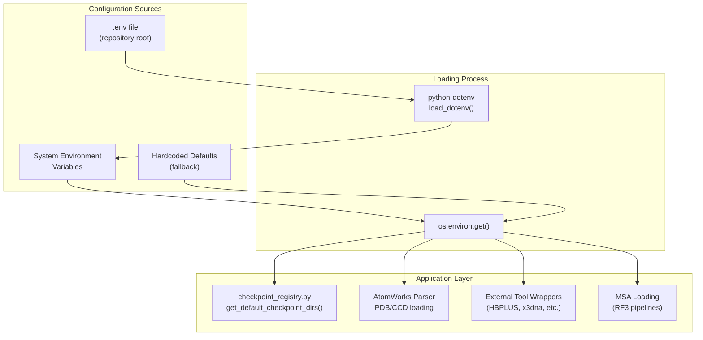
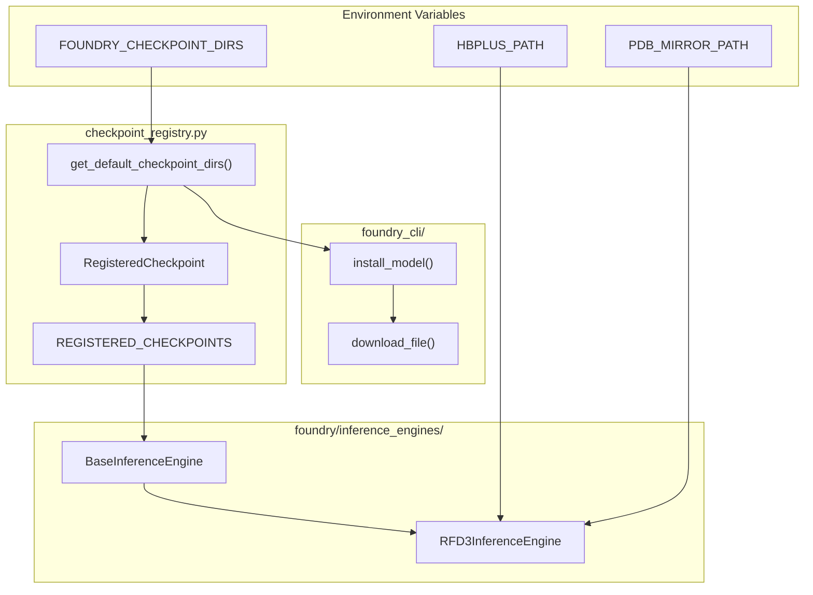

# Environment Configuration

> **Relevant source files**
> * [.env](https://github.com/RosettaCommons/foundry/blob/cee116dc/.env)
> * [README.md](https://github.com/RosettaCommons/foundry/blob/cee116dc/README.md?plain=1)
> * [models/rfd3/README.md](https://github.com/RosettaCommons/foundry/blob/cee116dc/models/rfd3/README.md?plain=1)
> * [models/rfd3/configs/datasets/train/pdb/af3_train_interface.yaml](https://github.com/RosettaCommons/foundry/blob/cee116dc/models/rfd3/configs/datasets/train/pdb/af3_train_interface.yaml)
> * [models/rfd3/configs/datasets/train/pdb/af3_train_pn_unit.yaml](https://github.com/RosettaCommons/foundry/blob/cee116dc/models/rfd3/configs/datasets/train/pdb/af3_train_pn_unit.yaml)
> * [models/rfd3/configs/logger/default.yaml](https://github.com/RosettaCommons/foundry/blob/cee116dc/models/rfd3/configs/logger/default.yaml)
> * [models/rfd3/configs/paths/data/default.yaml](https://github.com/RosettaCommons/foundry/blob/cee116dc/models/rfd3/configs/paths/data/default.yaml)
> * [src/foundry/inference_engines/base.py](https://github.com/RosettaCommons/foundry/blob/cee116dc/src/foundry/inference_engines/base.py)
> * [src/foundry/inference_engines/checkpoint_registry.py](https://github.com/RosettaCommons/foundry/blob/cee116dc/src/foundry/inference_engines/checkpoint_registry.py)
> * [src/foundry_cli/__init__.py](https://github.com/RosettaCommons/foundry/blob/cee116dc/src/foundry_cli/__init__.py)
> * [src/foundry_cli/download_checkpoints.py](https://github.com/RosettaCommons/foundry/blob/cee116dc/src/foundry_cli/download_checkpoints.py)

## Purpose and Scope

This page documents Foundry's environment configuration system, which controls paths to model checkpoints, data mirrors, MSA directories, and external tools. Environment variables are used throughout Foundry to enable flexible deployment across different computing environments without hardcoding paths.

For checkpoint management and download procedures, see [Checkpoint Management](/RosettaCommons/foundry/8.1-checkpoint-management). For Hydra-based configuration of model training and inference parameters, see [Configuration System](/RosettaCommons/foundry/8.2-configuration-system).

---

## Overview

Foundry uses environment variables to configure:

* **Checkpoint storage**: Where model weights are stored and loaded from.
* **Data mirrors**: Local copies of PDB and CCD databases for offline operation.
* **MSA directories**: Paths to precomputed multiple sequence alignments.
* **External tools**: Paths to third-party binaries (HBPLUS, x3dna, mmseqs2, etc.).

The recommended approach is to create a `.env` file in the repository root and use `python-dotenv` to automatically load these variables.

**Sources**: [.env L1-L63](https://github.com/RosettaCommons/foundry/blob/cee116dc/.env#L1-L63)

 [src/foundry_cli/download_checkpoints.py L9-L27](https://github.com/RosettaCommons/foundry/blob/cee116dc/src/foundry_cli/download_checkpoints.py#L9-L27)

---

## Environment Variable Loading

Foundry utilizes `python-dotenv` to load configurations from a `.env` file into the process environment. This occurs early in the execution of CLI tools and inference engines.

**Diagram: Configuration Loading Data Flow**

Title: Environment Variable Resolution and Application Flow



**Priority Order**:

1. System environment variables (highest priority).
2. Variables defined in `.env` file.
3. Hardcoded defaults in code (lowest priority).

**Sources**: [src/foundry_cli/download_checkpoints.py L9-L27](https://github.com/RosettaCommons/foundry/blob/cee116dc/src/foundry_cli/download_checkpoints.py#L9-L27)

 [src/foundry/inference_engines/checkpoint_registry.py L8-L32](https://github.com/RosettaCommons/foundry/blob/cee116dc/src/foundry/inference_engines/checkpoint_registry.py#L8-L32)

---

## Core Environment Variables

### Checkpoint Configuration

Foundry manages checkpoints through a search path system.

| Variable | Purpose | Default | Used By |
| --- | --- | --- | --- |
| `FOUNDRY_CHECKPOINT_DIRS` | Colon-separated list of checkpoint directories to search | `~/.foundry/checkpoints` | All inference engines |
| `FOUNDRY_CHECKPOINTS_DIR` | Single checkpoint directory (backward compatibility) | `~/.foundry/checkpoints` | All inference engines |

The `get_default_checkpoint_dirs` function [src/foundry/inference_engines/checkpoint_registry.py L25-L42](https://github.com/RosettaCommons/foundry/blob/cee116dc/src/foundry/inference_engines/checkpoint_registry.py#L25-L42)

 resolves these variables into a prioritized list of `Path` objects.

```python
# From RegisteredCheckpoint.get_default_path()def get_default_path(self):    checkpoint_dirs = get_default_checkpoint_dirs()    for checkpoint_dir in checkpoint_dirs:        candidate = checkpoint_dir / self.filename        if candidate.exists():            return candidate    return checkpoint_dirs[0] / self.filename  # Default to first dir
```

The `foundry install` command can persist new checkpoint directories to your `.env` file using `append_checkpoint_to_env` [src/foundry/inference_engines/checkpoint_registry.py L49-L61](https://github.com/RosettaCommons/foundry/blob/cee116dc/src/foundry/inference_engines/checkpoint_registry.py#L49-L61)

**Sources**: [.env L61-L63](https://github.com/RosettaCommons/foundry/blob/cee116dc/.env#L61-L63)

 [src/foundry/inference_engines/checkpoint_registry.py L25-L77](https://github.com/RosettaCommons/foundry/blob/cee116dc/src/foundry/inference_engines/checkpoint_registry.py#L25-L77)

 [src/foundry_cli/download_checkpoints.py L33-L51](https://github.com/RosettaCommons/foundry/blob/cee116dc/src/foundry_cli/download_checkpoints.py#L33-L51)

---

### Data Mirrors

#### PDB_MIRROR_PATH

Local mirror of the RCSB Protein Data Bank. AtomWorks uses this for offline structure loading [README.md L112-L115](https://github.com/RosettaCommons/foundry/blob/cee116dc/README.md?plain=1#L112-L115)

 It expects the standard RCSB flat-file structure: `{PDB_MIRROR_PATH}/{middle_two_chars}/{pdb_id}.cif.gz`.

**Sources**: [.env L9-L13](https://github.com/RosettaCommons/foundry/blob/cee116dc/.env#L9-L13)

 [models/rfd3/README.md L108-L115](https://github.com/RosettaCommons/foundry/blob/cee116dc/models/rfd3/README.md?plain=1#L108-L115)

#### CCD_MIRROR_PATH

Local mirror of the Chemical Component Dictionary (ligand definitions). It follows the convention: `{CCD_MIRROR_PATH}/{first_char}/{ccd_name}/{ccd_name}.cif`. If unset, the system falls back to the internal Biotite CCD [env L15-L22](https://github.com/RosettaCommons/foundry/blob/cee116dc/env#L15-L22)

**Sources**: [.env L15-L22](https://github.com/RosettaCommons/foundry/blob/cee116dc/.env#L15-L22)

 [models/rfd3/README.md L115](https://github.com/RosettaCommons/foundry/blob/cee116dc/models/rfd3/README.md?plain=1#L115-L115)

#### LOCAL_MSA_DIRS

Colon-separated list of paths to directories containing precomputed MSAs. Used primarily by RF3 for training and inference pipelines [.env L24-L25](https://github.com/RosettaCommons/foundry/blob/cee116dc/.env#L24-L25)

---

### External Tool Dependencies

Foundry integrates with several third-party tools for structural analysis and feature generation.

| Variable | Tool | Purpose | Required For |
| --- | --- | --- | --- |
| `HBPLUS_PATH` | HBPLUS | Hydrogen bond calculation | RFD3 H-bond conditioning [models/rfd3/README.md L32-L38](https://github.com/RosettaCommons/foundry/blob/cee116dc/models/rfd3/README.md?plain=1#L32-L38) |
| `X3DNA_PATH` | x3dna-v2.4 | DNA structure analysis | DNA-containing structures [.env L34-L36](https://github.com/RosettaCommons/foundry/blob/cee116dc/.env#L34-L36) |
| `DSSP_PATH` | DSSP | Secondary structure prediction | Currently unused [.env L38-L39](https://github.com/RosettaCommons/foundry/blob/cee116dc/.env#L38-L39) |
| `HHFILTER_PATH` | HH-suite | MSA filtering | MSA preprocessing [.env L41-L44](https://github.com/RosettaCommons/foundry/blob/cee116dc/.env#L41-L44) |
| `MMSEQS2_PATH` | MMseqs2 | Sequence searching | MSA generation [.env L46-L48](https://github.com/RosettaCommons/foundry/blob/cee116dc/.env#L46-L48) |

**Sources**: [.env L29-L48](https://github.com/RosettaCommons/foundry/blob/cee116dc/.env#L29-L48)

 [models/rfd3/README.md L32-L38](https://github.com/RosettaCommons/foundry/blob/cee116dc/models/rfd3/README.md?plain=1#L32-L38)

---

### CollabFold Database Paths

For performance, MMseqs2 databases used by CollabFold should be stored on local compute node drives [.env L50-L55](https://github.com/RosettaCommons/foundry/blob/cee116dc/.env#L50-L55)

* `COLABFOLD_LOCAL_DB_PATH_GPU`: Local GPU-optimized database.
* `COLABFOLD_LOCAL_DB_PATH_CPU`: Local CPU-optimized database.
* `COLABFOLD_NET_DB_PATH_GPU`: Network-accessible fallback (GPU).
* `COLABFOLD_NET_DB_PATH_CPU`: Network-accessible fallback (CPU).

**Sources**: [.env L50-L60](https://github.com/RosettaCommons/foundry/blob/cee116dc/.env#L50-L60)

---

## Environment Variables to Code Entities Mapping

This diagram illustrates how environment variables propagate through the `BaseInferenceEngine` and CLI utilities.

Title: Environment Variables to Code Entity Mapping



**Sources**: [src/foundry/inference_engines/checkpoint_registry.py L25-L80](https://github.com/RosettaCommons/foundry/blob/cee116dc/src/foundry/inference_engines/checkpoint_registry.py#L25-L80)

 [src/foundry/inference_engines/base.py L71-L91](https://github.com/RosettaCommons/foundry/blob/cee116dc/src/foundry/inference_engines/base.py#L71-L91)

 [src/foundry_cli/download_checkpoints.py L106-L142](https://github.com/RosettaCommons/foundry/blob/cee116dc/src/foundry_cli/download_checkpoints.py#L106-L142)

---

## Setting Up Your Environment

### Step 1: Initialize .env

Copy the template provided in the repository root:

```
cp .env.example .env
```

Update `FOUNDRY_CHECKPOINT_DIRS` and `HBPLUS_PATH` as needed.

### Step 2: Install Checkpoints

The `foundry install` command uses the search path logic to determine the primary installation target [src/foundry_cli/download_checkpoints.py L166-L170](https://github.com/RosettaCommons/foundry/blob/cee116dc/src/foundry_cli/download_checkpoints.py#L166-L170)

```
foundry install base-models --checkpoint-dir ~/.foundry/checkpoints
```

**Sources**: [README.md L44-L48](https://github.com/RosettaCommons/foundry/blob/cee116dc/README.md?plain=1#L44-L48)

 [src/foundry_cli/download_checkpoints.py L144-L186](https://github.com/RosettaCommons/foundry/blob/cee116dc/src/foundry_cli/download_checkpoints.py#L144-L186)

---

## Low Memory Mode

RFD3 supports a memory-efficient tokenization mode toggled via environment variable. This is typically managed by the `RFD3InferenceEngine` based on the `low_memory_mode` flag.

```markdown
# Internal behavior in RFD3if low_memory_mode:    os.environ["RFD3_LOW_MEMORY_MODE"] = "1"
```

**Sources**: [models/rfd3/src/rfd3/engine.py L68-L198](https://github.com/RosettaCommons/foundry/blob/cee116dc/models/rfd3/src/rfd3/engine.py#L68-L198)

 (Reference to conceptual usage in engine)

---

## Troubleshooting

### Checkpoint Resolution Order

Foundry searches directories in the following order:

1. Any directory passed explicitly via `--checkpoint-dir` in CLI [src/foundry_cli/download_checkpoints.py L33-L40](https://github.com/RosettaCommons/foundry/blob/cee116dc/src/foundry_cli/download_checkpoints.py#L33-L40)
2. Directories in `FOUNDRY_CHECKPOINT_DIRS` [.env L61-L63](https://github.com/RosettaCommons/foundry/blob/cee116dc/.env#L61-L63)
3. The default `~/.foundry/checkpoints` [src/foundry/inference_engines/checkpoint_registry.py L10](https://github.com/RosettaCommons/foundry/blob/cee116dc/src/foundry/inference_engines/checkpoint_registry.py#L10-L10)

### Verifying Installation

Use the CLI to inspect the environment's view of installed models:

```
foundry list-installed
```

This command iterates through all resolved `checkpoint_dirs` and identifies `.ckpt` or `.pt` files [src/foundry_cli/download_checkpoints.py L196-L210](https://github.com/RosettaCommons/foundry/blob/cee116dc/src/foundry_cli/download_checkpoints.py#L196-L210)

**Sources**: [src/foundry/inference_engines/checkpoint_registry.py L25-L42](https://github.com/RosettaCommons/foundry/blob/cee116dc/src/foundry/inference_engines/checkpoint_registry.py#L25-L42)

 [src/foundry_cli/download_checkpoints.py L196-L210](https://github.com/RosettaCommons/foundry/blob/cee116dc/src/foundry_cli/download_checkpoints.py#L196-L210)