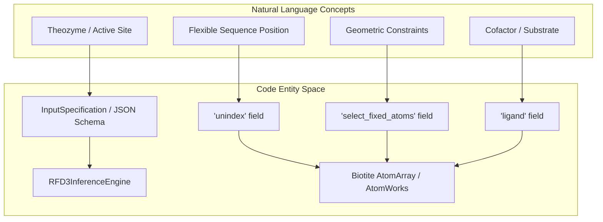
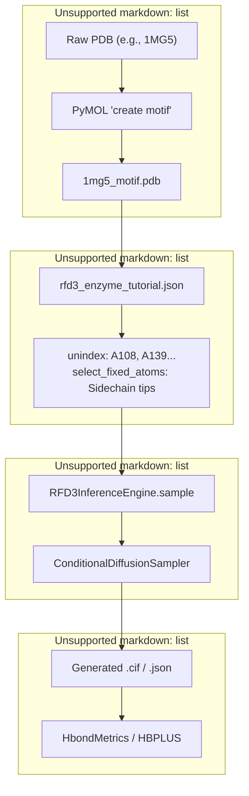

# Enzyme Design

> **Relevant source files**
> * [examples/enzymes.ipynb](https://github.com/RosettaCommons/foundry/blob/cee116dc/examples/enzymes.ipynb)
> * [models/rf3/src/rf3/callbacks/metrics_logging.py](https://github.com/RosettaCommons/foundry/blob/cee116dc/models/rf3/src/rf3/callbacks/metrics_logging.py)
> * [models/rfd3/docs/.assets/intermediate_enzyme_tutorial/1mg5_final.png](https://github.com/RosettaCommons/foundry/blob/cee116dc/models/rfd3/docs/.assets/intermediate_enzyme_tutorial/1mg5_final.png)
> * [models/rfd3/docs/.assets/intermediate_enzyme_tutorial/1mg5_redesign_final.png](https://github.com/RosettaCommons/foundry/blob/cee116dc/models/rfd3/docs/.assets/intermediate_enzyme_tutorial/1mg5_redesign_final.png)
> * [models/rfd3/docs/.assets/intermediate_enzyme_tutorial/1mg5_theozyme_final.png](https://github.com/RosettaCommons/foundry/blob/cee116dc/models/rfd3/docs/.assets/intermediate_enzyme_tutorial/1mg5_theozyme_final.png)
> * [models/rfd3/docs/tutorials/enzyme_design_tutorial.md](https://github.com/RosettaCommons/foundry/blob/cee116dc/models/rfd3/docs/tutorials/enzyme_design_tutorial.md?plain=1)
> * [models/rfd3/docs/tutorials/enzyme_tutorial_files/outputs.zip](https://github.com/RosettaCommons/foundry/blob/cee116dc/models/rfd3/docs/tutorials/enzyme_tutorial_files/outputs.zip)
> * [models/rfd3/docs/tutorials/enzyme_tutorial_files/rfd3_enzyme_tutorial.json](https://github.com/RosettaCommons/foundry/blob/cee116dc/models/rfd3/docs/tutorials/enzyme_tutorial_files/rfd3_enzyme_tutorial.json)
> * [models/rfd3/docs/tutorials/intermediate_enzyme_design_tutorial.md](https://github.com/RosettaCommons/foundry/blob/cee116dc/models/rfd3/docs/tutorials/intermediate_enzyme_design_tutorial.md?plain=1)
> * [models/rfd3/docs/tutorials/intermediate_enzyme_tutorial_files/1MG5.pdb](https://github.com/RosettaCommons/foundry/blob/cee116dc/models/rfd3/docs/tutorials/intermediate_enzyme_tutorial_files/1MG5.pdb)
> * [models/rfd3/docs/tutorials/intermediate_enzyme_tutorial_files/1mg5_motif.pdb](https://github.com/RosettaCommons/foundry/blob/cee116dc/models/rfd3/docs/tutorials/intermediate_enzyme_tutorial_files/1mg5_motif.pdb)
> * [models/rfd3/docs/tutorials/intermediate_enzyme_tutorial_files/outputs.zip](https://github.com/RosettaCommons/foundry/blob/cee116dc/models/rfd3/docs/tutorials/intermediate_enzyme_tutorial_files/outputs.zip)
> * [models/rfd3/docs/tutorials/na_binder_tutorial.md](https://github.com/RosettaCommons/foundry/blob/cee116dc/models/rfd3/docs/tutorials/na_binder_tutorial.md?plain=1)
> * [models/rfd3/docs/tutorials/ppi_design_tutorial.md](https://github.com/RosettaCommons/foundry/blob/cee116dc/models/rfd3/docs/tutorials/ppi_design_tutorial.md?plain=1)
> * [models/rfd3/src/rfd3/callbacks.py](https://github.com/RosettaCommons/foundry/blob/cee116dc/models/rfd3/src/rfd3/callbacks.py)
> * [models/rfd3/src/rfd3/train.py](https://github.com/RosettaCommons/foundry/blob/cee116dc/models/rfd3/src/rfd3/train.py)
> * [models/rfd3/src/rfd3/utils/io.py](https://github.com/RosettaCommons/foundry/blob/cee116dc/models/rfd3/src/rfd3/utils/io.py)
> * [models/rfd3/tests/transforms/regression_test_data/af2_122_train_test_unindexed.pkl](https://github.com/RosettaCommons/foundry/blob/cee116dc/models/rfd3/tests/transforms/regression_test_data/af2_122_train_test_unindexed.pkl)
> * [models/rfd3/tests/transforms/test_pipeline_regression.py](https://github.com/RosettaCommons/foundry/blob/cee116dc/models/rfd3/tests/transforms/test_pipeline_regression.py)

## Purpose and Scope

This page describes how to use RFdiffusion3 (RFD3) for enzyme design, specifically the technique of **scaffolding around active site residues** using **unindexed motifs**. Enzyme design in RFD3 involves generating a protein scaffold around a predefined active site (theozyme) where the relative positioning of catalytic residues is unknown or flexible.

For general RFD3 capabilities, see [RFD3 Overview and Capabilities](/RosettaCommons/foundry/4.1-rfd3-overview-and-capabilities). For complete InputSpecification documentation, see [InputSpecification System](/RosettaCommons/foundry/4.2-inputspecification-system). For other design applications like small molecule binders or protein-protein interactions, see [Small Molecule Binder Design](/RosettaCommons/foundry/4.4.2-small-molecule-binder-design) and [Protein Binder Design](/RosettaCommons/foundry/4.4.1-protein-binder-design).

Sources: [models/rfd3/docs/tutorials/enzyme_design_tutorial.md L1-L20](https://github.com/RosettaCommons/foundry/blob/cee116dc/models/rfd3/docs/tutorials/enzyme_design_tutorial.md?plain=1#L1-L20)

 [models/rfd3/docs/tutorials/intermediate_enzyme_design_tutorial.md L13-L25](https://github.com/RosettaCommons/foundry/blob/cee116dc/models/rfd3/docs/tutorials/intermediate_enzyme_design_tutorial.md?plain=1#L13-L25)

---

## Overview: Active Site Scaffolding

Enzyme design in RFD3 differs fundamentally from other design tasks because the **sequence positions of active site residues are not predetermined**. Instead, the model infers where to place catalytic residues within the generated scaffold while respecting geometric constraints defined by the theozyme.

**Key distinction:**

* **Indexed motifs** (`contig` field): Residues with known sequence positions relative to other chains or segments.
* **Unindexed motifs** (`unindex` field): Residues whose sequence positions the model determines during generation.

### System Mapping: Natural Language to Code Entities

The following diagram bridges high-level enzyme design concepts to specific code classes and configuration fields.

**Enzyme Design Architecture Mapping**



Sources: [models/rfd3/docs/tutorials/enzyme_design_tutorial.md L35-L66](https://github.com/RosettaCommons/foundry/blob/cee116dc/models/rfd3/docs/tutorials/enzyme_design_tutorial.md?plain=1#L35-L66)

 [models/rfd3/docs/tutorials/intermediate_enzyme_design_tutorial.md L126-L155](https://github.com/RosettaCommons/foundry/blob/cee116dc/models/rfd3/docs/tutorials/intermediate_enzyme_design_tutorial.md?plain=1#L126-L155)

---

## InputSpecification Fields for Enzyme Design

The following `InputSpecification` fields are essential for enzyme design:

| Field | Type | Purpose | Example |
| --- | --- | --- | --- |
| `input` | `str` | Path to theozyme PDB/CIF | `"./1euv_lig.pdb"` |
| `unindex` | `str` | Active site residues with flexible positioning | `"A514,A531,A574,A579-581"` |
| `ligand` | `str` | Ligand/cofactor residue names (use `:` for non-CCD) | `"l:g"` or `"NAI,ACT"` |
| `length` | `str` | Target scaffold length range | `"100-200"` |
| `select_fixed_atoms` | `dict` | Per-residue atom-level geometry fixation | `{"A514":"NE2,CE1,ND1"}` |
| `ori_token` | `list` | Specifies the center of mass for the design | `[0, 1, 0]` |

**Note:** When using `unindex`, residues are treated as functional motifs whose geometric relationships to the ligand are preserved via `select_fixed_atoms`, but their placement in the 1D sequence is determined by the model.

Sources: [models/rfd3/docs/tutorials/enzyme_design_tutorial.md L49-L94](https://github.com/RosettaCommons/foundry/blob/cee116dc/models/rfd3/docs/tutorials/enzyme_design_tutorial.md?plain=1#L49-L94)

 [models/rfd3/docs/tutorials/intermediate_enzyme_tutorial_files/rfd3_enzyme_tutorial.json L1-L24](https://github.com/RosettaCommons/foundry/blob/cee116dc/models/rfd3/docs/tutorials/intermediate_enzyme_tutorial_files/rfd3_enzyme_tutorial.json#L1-L24)

---

## Enzyme Design Workflow

The data flow from a raw PDB to a generated enzyme scaffold involves extraction, constraint definition, and diffusion sampling.

**Enzyme Design Data Flow**



Sources: [models/rfd3/docs/tutorials/intermediate_enzyme_design_tutorial.md L50-L121](https://github.com/RosettaCommons/foundry/blob/cee116dc/models/rfd3/docs/tutorials/intermediate_enzyme_design_tutorial.md?plain=1#L50-L121)

 [models/rfd3/docs/tutorials/enzyme_design_tutorial.md L120-L135](https://github.com/RosettaCommons/foundry/blob/cee116dc/models/rfd3/docs/tutorials/enzyme_design_tutorial.md?plain=1#L120-L135)

---

## Configuration Example: Cysteine Hydrolase

This example demonstrates designing a scaffold for a cysteine hydrolase using unindexed residues and RASA (Relative Solvent Accessible Surface Area) conditioning.

```json
{    "cys_1euv_lig": {        "input": "./1euv_lig.pdb",         "ligand": "l:g",                "unindex": "A514,A531,A574,A579-581",                 "length": "100-200",        "ori_token": [0, 1, 0],          "select_fixed_atoms": {            "A514":"NE2,CE1,ND1,CD2,CG,CB",              "A531":"OD1,CG,OD2,CB",                                          "A574":"NE2,CD,OE1,CG",             "A579":"C,O,CA,N",             "A580":"SG,CB,CA,N,C,O",             "A581":"C,O,CA,N"        },        "select_buried": {            "l:g": "O1,C8,O3,C4,C5,C23,C24,C25,C26,C27"        },        "select_exposed": {            "l:g": "C2,C22,C19,C18,C17,C20,C16,C15,O21,O14,C13,C12"        },        "select_unfixed_sequence": "A579,A581"    }}
```

**Field Breakdown:**

1. **`unindex`**: Residues A514, A531, A574, and the cluster A579-581 are treated as motifs. RFD3 will find the best sequence position for these in the 100-200 residue protein.
2. **`select_fixed_atoms`**: For His (A514), Asp (A531), and Gln (A574), only the sidechains are fixed. For Cys (A580), the entire residue is fixed.
3. **`select_buried` / `select_exposed`**: RASA conditioning tells RFD3 which atoms of the ligand should be buried within the protein core versus exposed to solvent.
4. **`select_unfixed_sequence`**: Allows the identity of residues A579 and A581 to be redesigned by sequence models (like ProteinMPNN) while keeping their backbone geometry constrained during diffusion.

Sources: [models/rfd3/docs/tutorials/enzyme_tutorial_files/rfd3_enzyme_tutorial.json L1-L24](https://github.com/RosettaCommons/foundry/blob/cee116dc/models/rfd3/docs/tutorials/enzyme_tutorial_files/rfd3_enzyme_tutorial.json#L1-L24)

 [models/rfd3/docs/tutorials/enzyme_design_tutorial.md L60-L110](https://github.com/RosettaCommons/foundry/blob/cee116dc/models/rfd3/docs/tutorials/enzyme_design_tutorial.md?plain=1#L60-L110)

---

## Technical Implementation

### The unindex Logic

When residues are specified in the `unindex` field, the `InputSpecification` parser ensures these residues are not tied to specific sequence indices in the generated `AtomArray`. During diffusion, these atoms act as static coordinates (if fixed) that the noised backbone must "evolve" around.

### Code Entities Involved

| Class/Function | File | Role |
| --- | --- | --- |
| `RFD3InferenceEngine` | [models/rfd3/src/rfd3/inference/engine.py](https://github.com/RosettaCommons/foundry/blob/cee116dc/models/rfd3/src/rfd3/inference/engine.py) | Orchestrates the diffusion sampling process. |
| `create_atom_array_from_design_specification` | [models/rfd3/src/rfd3/inference/input_parsing.py](https://github.com/RosettaCommons/foundry/blob/cee116dc/models/rfd3/src/rfd3/inference/input_parsing.py) | Converts JSON/YAML input into a featurized `AtomArray`. |
| `HbondMetrics` | [models/rfd3/src/rfd3/metrics/hbonds_hbplus_metrics.py L273](https://github.com/RosettaCommons/foundry/blob/cee116dc/models/rfd3/src/rfd3/metrics/hbonds_hbplus_metrics.py#L273-L273) | Calculates satisfaction of hydrogen bonds between the motif and scaffold. |
| `get_motif_features` | [models/rfd3/src/rfd3/transforms/conditioning_base.py L9](https://github.com/RosettaCommons/foundry/blob/cee116dc/models/rfd3/src/rfd3/transforms/conditioning_base.py#L9-L9) | Extracts motif-specific features for the diffusion model. |

Sources: [models/rfd3/src/rfd3/metrics/hbonds_hbplus_metrics.py L273](https://github.com/RosettaCommons/foundry/blob/cee116dc/models/rfd3/src/rfd3/metrics/hbonds_hbplus_metrics.py#L273-L273)

 [models/rfd3/src/rfd3/transforms/conditioning_base.py L9](https://github.com/RosettaCommons/foundry/blob/cee116dc/models/rfd3/src/rfd3/transforms/conditioning_base.py#L9-L9)

---

## Validation: Hydrogen Bond Metrics

Enzyme designs are often validated by their ability to maintain the precise hydrogen bonding network required for catalysis. RFD3 uses the `HbondMetrics` class to evaluate these interactions.

### Evaluation Flow

1. **HBPLUS Integration**: The model runs the HBPLUS tool on the generated PDB to identify all hydrogen bonds.
2. **Motif Verification**: The system checks if the bonds defined in the theozyme are present in the design.
3. **Metrics Calculation**: * `correct_donor_percent`: Percentage of input donors still forming bonds. * `correct_acceptor_percent`: Percentage of input acceptors still forming bonds.

Sources: [models/rfd3/src/rfd3/metrics/hbonds_hbplus_metrics.py L109-L217](https://github.com/RosettaCommons/foundry/blob/cee116dc/models/rfd3/src/rfd3/metrics/hbonds_hbplus_metrics.py#L109-L217)

 [models/rfd3/src/rfd3/metrics/hbonds_hbplus_metrics.py L273-L308](https://github.com/RosettaCommons/foundry/blob/cee116dc/models/rfd3/src/rfd3/metrics/hbonds_hbplus_metrics.py#L273-L308)

---

## Best Practices for Enzyme Design

1. **Ori Token Placement**: The `ori_token` defines the center of mass for the designed protein. For enzymes, it should typically be placed near the active site/ligand center to ensure the scaffold grows around the functional motif.
2. **Fixed Atom Selection**: * **Too many fixed atoms**: Can over-constrain the system, leading to poor designability or physical clashes. * **Too few fixed atoms**: May allow the active site geometry to drift, destroying the catalytic arrangement. * **Recommendation**: Fix the "tips" of catalytic sidechains (e.g., `NE2` for Histidine) and backbone atoms for residues where orientation is critical.
3. **Ligand Naming**: Use the format `l:name` for ligands not in the Chemical Component Database (CCD) to avoid naming collisions during featurization.

Sources: [models/rfd3/docs/tutorials/enzyme_design_tutorial.md L57-L59](https://github.com/RosettaCommons/foundry/blob/cee116dc/models/rfd3/docs/tutorials/enzyme_design_tutorial.md?plain=1#L57-L59)

 [models/rfd3/docs/tutorials/enzyme_design_tutorial.md L71-L82](https://github.com/RosettaCommons/foundry/blob/cee116dc/models/rfd3/docs/tutorials/enzyme_design_tutorial.md?plain=1#L71-L82)

 [models/rfd3/docs/tutorials/intermediate_enzyme_design_tutorial.md L151-L160](https://github.com/RosettaCommons/foundry/blob/cee116dc/models/rfd3/docs/tutorials/intermediate_enzyme_design_tutorial.md?plain=1#L151-L160)