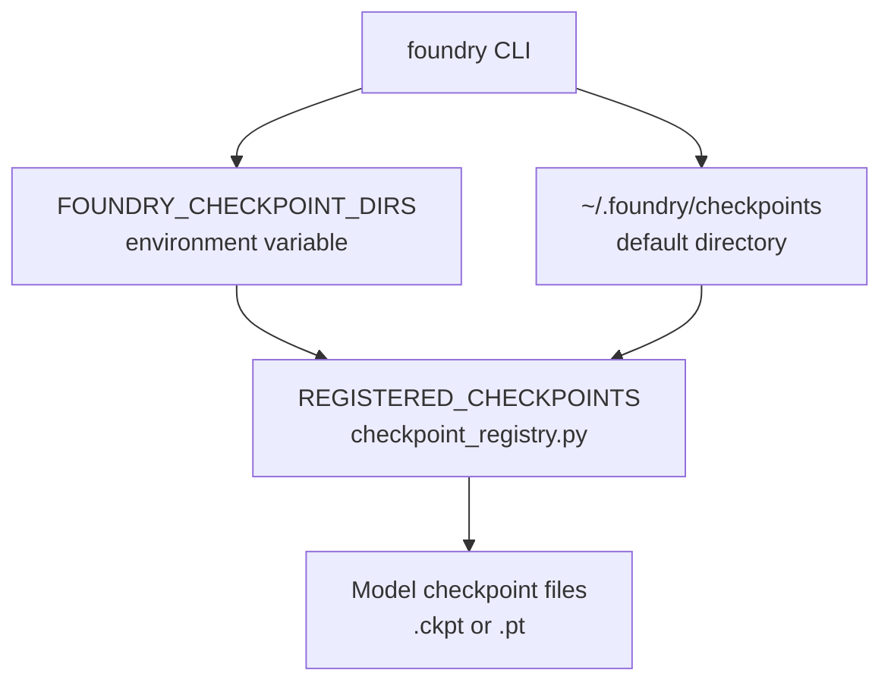
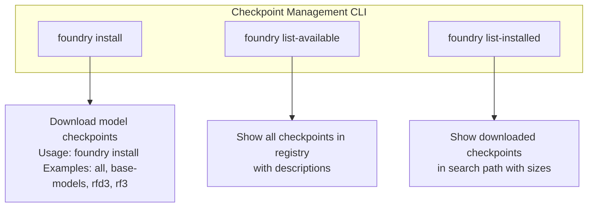
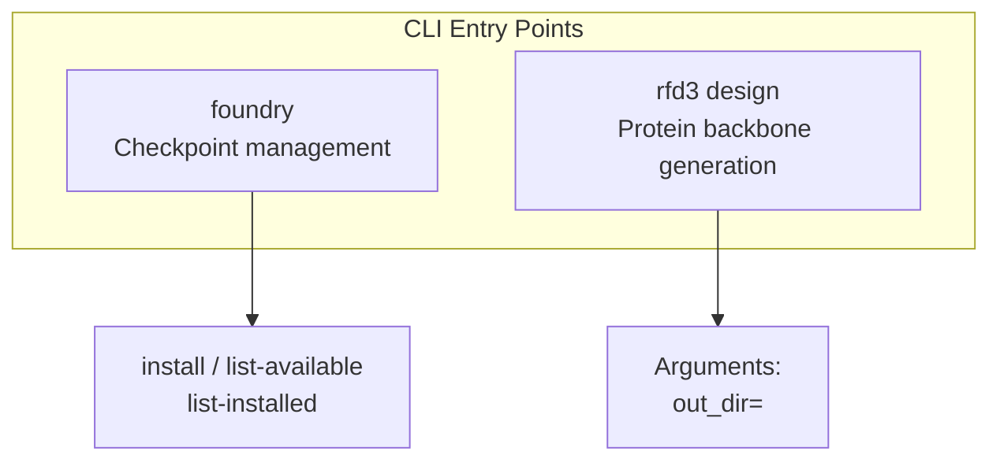
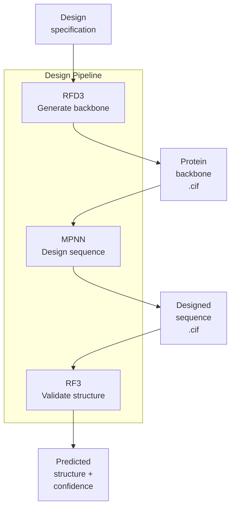

# Getting Started

> **Relevant source files**
> * [.env](https://github.com/RosettaCommons/foundry/blob/cee116dc/.env)
> * [README.md](https://github.com/RosettaCommons/foundry/blob/cee116dc/README.md?plain=1)
> * [examples/docker/Dockerfile](https://github.com/RosettaCommons/foundry/blob/cee116dc/examples/docker/Dockerfile)
> * [models/rfd3/README.md](https://github.com/RosettaCommons/foundry/blob/cee116dc/models/rfd3/README.md?plain=1)
> * [models/rfd3/docs/index.rst](https://github.com/RosettaCommons/foundry/blob/cee116dc/models/rfd3/docs/index.rst)
> * [models/rfd3/docs/tutorials/RFdiffusion3_installation_tutorial.md](https://github.com/RosettaCommons/foundry/blob/cee116dc/models/rfd3/docs/tutorials/RFdiffusion3_installation_tutorial.md?plain=1)
> * [models/rfd3/docs/tutorials/installation_tutorial/inputs.zip](https://github.com/RosettaCommons/foundry/blob/cee116dc/models/rfd3/docs/tutorials/installation_tutorial/inputs.zip)
> * [models/rfd3/docs/tutorials/installation_tutorial/outputs.zip](https://github.com/RosettaCommons/foundry/blob/cee116dc/models/rfd3/docs/tutorials/installation_tutorial/outputs.zip)
> * [src/foundry/inference_engines/base.py](https://github.com/RosettaCommons/foundry/blob/cee116dc/src/foundry/inference_engines/base.py)
> * [src/foundry/inference_engines/checkpoint_registry.py](https://github.com/RosettaCommons/foundry/blob/cee116dc/src/foundry/inference_engines/checkpoint_registry.py)
> * [src/foundry_cli/__init__.py](https://github.com/RosettaCommons/foundry/blob/cee116dc/src/foundry_cli/__init__.py)
> * [src/foundry_cli/download_checkpoints.py](https://github.com/RosettaCommons/foundry/blob/cee116dc/src/foundry_cli/download_checkpoints.py)

This page provides an introduction to the Foundry system and guides you through initial setup and basic usage. For detailed installation instructions, see [Installation](/RosettaCommons/foundry/2.1-installation). For a complete end-to-end protein design workflow example, see [Quick Start Tutorial](/RosettaCommons/foundry/2.2-quick-start-tutorial).

## Overview

Foundry is a unified framework for protein design models including:

* **RFdiffusion3 (RFD3)**: All-atom generative protein backbone design with complex constraints [README.md L71-L80](https://github.com/RosettaCommons/foundry/blob/cee116dc/README.md?plain=1#L71-L80)
* **RFdiffusion3NA (RFD3NA)**: Extension for multi-polymer (Protein-DNA-RNA) design [README.md L81-L90](https://github.com/RosettaCommons/foundry/blob/cee116dc/README.md?plain=1#L81-L90)
* **RosettaFold3 (RF3)**: Structure prediction and design validation with confidence scoring [README.md L91-L99](https://github.com/RosettaCommons/foundry/blob/cee116dc/README.md?plain=1#L91-L99)
* **ProteinMPNN/LigandMPNN**: Sequence design for protein backbones with ligand awareness [README.md L101-L105](https://github.com/RosettaCommons/foundry/blob/cee116dc/README.md?plain=1#L101-L105)

All models in Foundry depend on [AtomWorks](https://github.com/RosettaCommons/foundry/blob/cee116dc/AtomWorks)

 which provides structure I/O, preprocessing, and featurization capabilities [README.md L5-L6](https://github.com/RosettaCommons/foundry/blob/cee116dc/README.md?plain=1#L5-L6)

 Models share a common infrastructure through the `foundry` package while remaining independently installable [README.md L112-L117](https://github.com/RosettaCommons/foundry/blob/cee116dc/README.md?plain=1#L112-L117)

**Sources:** [README.md L1-L11](https://github.com/RosettaCommons/foundry/blob/cee116dc/README.md?plain=1#L1-L11)

 [README.md L71-L105](https://github.com/RosettaCommons/foundry/blob/cee116dc/README.md?plain=1#L71-L105)

 [README.md L112-L117](https://github.com/RosettaCommons/foundry/blob/cee116dc/README.md?plain=1#L112-L117)

## Installation Options

Foundry can be installed via pip in several configurations:

| Installation Command | Description |
| --- | --- |
| `pip install "rc-foundry[all]"` | All models (recommended) [README.md L15](https://github.com/RosettaCommons/foundry/blob/cee116dc/README.md?plain=1#L15-L15) |
| `pip install "rc-foundry[rfd3]"` | Core + RFD3 only [models/rfd3/README.md L23](https://github.com/RosettaCommons/foundry/blob/cee116dc/models/rfd3/README.md?plain=1#L23-L23) |
| `pip install rc-foundry` | Core utilities only |

**Hardware Support:**

* **Intel XPU:** Install PyTorch with XPU support first, then install Foundry using `pip` [README.md L18-L27](https://github.com/RosettaCommons/foundry/blob/cee116dc/README.md?plain=1#L18-L27)
* **macOS (Apple Silicon):** MPS support is available via a community fork [README.md L28-L42](https://github.com/RosettaCommons/foundry/blob/cee116dc/README.md?plain=1#L28-L42)

For development installations from source, see [Development Setup](/RosettaCommons/foundry/11.2-development-setup).

**Sources:** [README.md L13-L42](https://github.com/RosettaCommons/foundry/blob/cee116dc/README.md?plain=1#L13-L42)

 [models/rfd3/README.md L21-L24](https://github.com/RosettaCommons/foundry/blob/cee116dc/models/rfd3/README.md?plain=1#L21-L24)

## Checkpoint Management System

Foundry uses a centralized checkpoint registry to manage model weights. The `foundry` CLI provides commands for downloading, listing, and managing checkpoints [src/foundry_cli/download_checkpoints.py L1-L29](https://github.com/RosettaCommons/foundry/blob/cee116dc/src/foundry_cli/download_checkpoints.py#L1-L29)

### Checkpoint Directory Search Path

Foundry searches for checkpoints in the following order:



**Checkpoint Search Path Resolution**

1. Directories specified in `FOUNDRY_CHECKPOINT_DIRS` (colon-separated list) [src/foundry/inference_engines/checkpoint_registry.py L25-L41](https://github.com/RosettaCommons/foundry/blob/cee116dc/src/foundry/inference_engines/checkpoint_registry.py#L25-L41)
2. Default directory `~/.foundry/checkpoints` [src/foundry/inference_engines/checkpoint_registry.py L10](https://github.com/RosettaCommons/foundry/blob/cee116dc/src/foundry/inference_engines/checkpoint_registry.py#L10-L10)

The `foundry install` command automatically updates `FOUNDRY_CHECKPOINT_DIRS` in your `.env` file if present [src/foundry_cli/download_checkpoints.py L45-L51](https://github.com/RosettaCommons/foundry/blob/cee116dc/src/foundry_cli/download_checkpoints.py#L45-L51)

**Sources:** [src/foundry/inference_engines/checkpoint_registry.py L10-L41](https://github.com/RosettaCommons/foundry/blob/cee116dc/src/foundry/inference_engines/checkpoint_registry.py#L10-L41)

 [src/foundry_cli/download_checkpoints.py L33-L51](https://github.com/RosettaCommons/foundry/blob/cee116dc/src/foundry_cli/download_checkpoints.py#L33-L51)

### Available Commands



### Basic Checkpoint Commands

Download all base models (includes latest RFD3, RF3, and MPNN variants) [README.md L48](https://github.com/RosettaCommons/foundry/blob/cee116dc/README.md?plain=1#L48-L48)

:

```html
foundry install base-models --checkpoint-dir <path/to/ckpt/dir>
```

Download specific models:

```
foundry install rfd3 rf3
```

List available models in registry [src/foundry_cli/download_checkpoints.py L188-L194](https://github.com/RosettaCommons/foundry/blob/cee116dc/src/foundry_cli/download_checkpoints.py#L188-L194)

:

```
foundry list-available
```

Check installed checkpoints [src/foundry_cli/download_checkpoints.py L196-L208](https://github.com/RosettaCommons/foundry/blob/cee116dc/src/foundry_cli/download_checkpoints.py#L196-L208)

:

```
foundry list-installed
```

The `--checkpoint-dir` option is optional and defaults to `~/.foundry/checkpoints`. When specified, it is added to your checkpoint search path and persisted to `.env` [src/foundry_cli/download_checkpoints.py L150-L168](https://github.com/RosettaCommons/foundry/blob/cee116dc/src/foundry_cli/download_checkpoints.py#L150-L168)

**Sources:** [README.md L44-L56](https://github.com/RosettaCommons/foundry/blob/cee116dc/README.md?plain=1#L44-L56)

 [src/foundry_cli/download_checkpoints.py L144-L208](https://github.com/RosettaCommons/foundry/blob/cee116dc/src/foundry_cli/download_checkpoints.py#L144-L208)

### Checkpoint Registry

Model checkpoints are registered in `REGISTERED_CHECKPOINTS` with metadata including URL, filename, and description [src/foundry/inference_engines/checkpoint_registry.py L64-L122](https://github.com/RosettaCommons/foundry/blob/cee116dc/src/foundry/inference_engines/checkpoint_registry.py#L64-L122)

:

| Model Key | Checkpoint Filename | Description |
| --- | --- | --- |
| `rfd3` | `rfd3_latest.ckpt` | RFdiffusion3 checkpoint |
| `rfd3na` | `rfd3na_1190.ckpt` | RFdiffusion3NA checkpoint |
| `rf3` | `rf3_foundry_01_24_latest_remapped.ckpt` | Latest RF3 (data until 1/2024) |
| `proteinmpnn` | `proteinmpnn_v_48_020.pt` | ProteinMPNN checkpoint |
| `ligandmpnn` | `ligandmpnn_v_32_010_25.pt` | LigandMPNN checkpoint |

**Sources:** [src/foundry/inference_engines/checkpoint_registry.py L80-L122](https://github.com/RosettaCommons/foundry/blob/cee116dc/src/foundry/inference_engines/checkpoint_registry.py#L80-L122)

## Environment Configuration

Foundry uses a `.env` file to configure paths to external resources. Copy the template and configure paths as needed [.env L1-L6](https://github.com/RosettaCommons/foundry/blob/cee116dc/.env#L1-L6)

### Key Environment Variables

| Variable | Purpose | Required For |
| --- | --- | --- |
| `PDB_MIRROR_PATH` | Local PDB database mirror | Training [.env L9-L13](https://github.com/RosettaCommons/foundry/blob/cee116dc/.env#L9-L13) |
| `CCD_MIRROR_PATH` | Local CCD mirror | Training, custom ligands [.env L15-L22](https://github.com/RosettaCommons/foundry/blob/cee116dc/.env#L15-L22) |
| `FOUNDRY_CHECKPOINT_DIRS` | Colon-separated checkpoint directories | Checkpoint discovery [.env L61-L63](https://github.com/RosettaCommons/foundry/blob/cee116dc/.env#L61-L63) |
| `HBPLUS_PATH` | Path to HBPLUS executable | H-bond conditioning [models/rfd3/README.md L38](https://github.com/RosettaCommons/foundry/blob/cee116dc/models/rfd3/README.md?plain=1#L38-L38) |
| `X3DNA_PATH` | Path to x3dna tool | DNA structure analysis [.env L34-L36](https://github.com/RosettaCommons/foundry/blob/cee116dc/.env#L34-L36) |
| `MMSEQS2_PATH` | Path to mmseqs2 tool | Sequence searching [.env L46-L48](https://github.com/RosettaCommons/foundry/blob/cee116dc/.env#L46-L48) |

**Hydrogen Bond Conditioning:** If using H-bond conditioning in RFD3, you must install `HBPLUS` and set `HBPLUS_PATH` in your `.env` [models/rfd3/README.md L32-L39](https://github.com/RosettaCommons/foundry/blob/cee116dc/models/rfd3/README.md?plain=1#L32-L39)

**Sources:** [.env L1-L63](https://github.com/RosettaCommons/foundry/blob/cee116dc/.env#L1-L63)

 [models/rfd3/README.md L32-L39](https://github.com/RosettaCommons/foundry/blob/cee116dc/models/rfd3/README.md?plain=1#L32-L39)

## Command-Line Interface Overview

Foundry provides CLI entry points for model operations and checkpoint management:



### Basic Usage Examples

**RFdiffusion3 (Protein Backbone Design):**

```
rfd3 design out_dir=logs/inference_outs/demo inputs=models/rfd3/docs/examples/demo.json
```

*Note: `dump_trajectories=True` can be added to output trajectory structures [models/rfd3/README.md L47-L52](https://github.com/RosettaCommons/foundry/blob/cee116dc/models/rfd3/README.md?plain=1#L47-L52)*

**RosettaFold3 (Structure Prediction):**
RF3 can be run via the `rf3 fold` command (see documentation in [RosettaFold3 (RF3)](/RosettaCommons/foundry/5-rosettafold3-(rf3))).

**Sources:** [models/rfd3/README.md L40-L55](https://github.com/RosettaCommons/foundry/blob/cee116dc/models/rfd3/README.md?plain=1#L40-L55)

 [README.md L44-L56](https://github.com/RosettaCommons/foundry/blob/cee116dc/README.md?plain=1#L44-L56)

## Typical Workflow

A complete protein design workflow typically follows this sequence:



**Pipeline Steps:**

1. **Generate backbone with RFD3**: Create protein structure under constraints [models/rfd3/README.md L3-L4](https://github.com/RosettaCommons/foundry/blob/cee116dc/models/rfd3/README.md?plain=1#L3-L4)
2. **Design sequence with MPNN**: Generate amino acid sequences for the backbone [README.md L101-L102](https://github.com/RosettaCommons/foundry/blob/cee116dc/README.md?plain=1#L101-L102)
3. **Validate with RF3**: Predict structure from sequence and compute confidence metrics (pLDDT, pTM) [README.md L91-L93](https://github.com/RosettaCommons/foundry/blob/cee116dc/README.md?plain=1#L91-L93)

The [Quick Start Tutorial](/RosettaCommons/foundry/2.2-quick-start-tutorial) provides a complete working example of this pipeline.

**Sources:** [README.md L3](https://github.com/RosettaCommons/foundry/blob/cee116dc/README.md?plain=1#L3-L3)

 [README.md L71-L105](https://github.com/RosettaCommons/foundry/blob/cee116dc/README.md?plain=1#L71-L105)

## Next Steps

* **[Installation](/RosettaCommons/foundry/2.1-installation)**: Detailed installation instructions including development setup and external tool configuration.
* **[Quick Start Tutorial](/RosettaCommons/foundry/2.2-quick-start-tutorial)**: Complete end-to-end protein design workflow with code examples.
* **[RFdiffusion3 (RFD3)](/RosettaCommons/foundry/4-rfdiffusion3-(rfd3))**: Comprehensive RFD3 capabilities and usage.
* **[RosettaFold3 (RF3)](/RosettaCommons/foundry/5-rosettafold3-(rf3))**: Complete RF3 prediction and validation guide.
* **[ProteinMPNN and LigandMPNN](/RosettaCommons/foundry/6-proteinmpnn-and-ligandmpnn)**: MPNN sequence design reference.

For questions and support, join the [Protein Model Foundry Slack](https://join.slack.com/t/proteinmodelfoundry/shared_invite/zt-3pj032444-jC8MRqsV8nhpKX0PGowQ4A) [README.md L9](https://github.com/RosettaCommons/foundry/blob/cee116dc/README.md?plain=1#L9-L9)

**Sources:** [README.md L9](https://github.com/RosettaCommons/foundry/blob/cee116dc/README.md?plain=1#L9-L9)

 [README.md L58-L69](https://github.com/RosettaCommons/foundry/blob/cee116dc/README.md?plain=1#L58-L69)