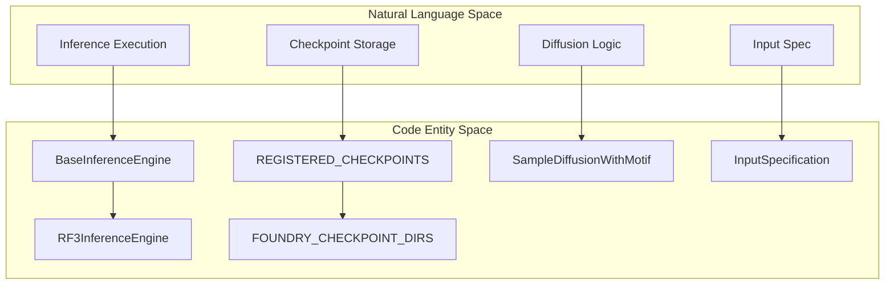
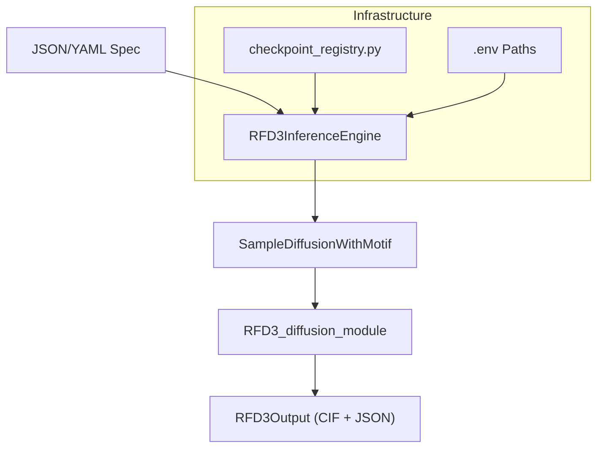

# Glossary

> **Relevant source files**
> * [.env](https://github.com/RosettaCommons/foundry/blob/cee116dc/.env)
> * [.gitignore](https://github.com/RosettaCommons/foundry/blob/cee116dc/.gitignore)
> * [README.md](https://github.com/RosettaCommons/foundry/blob/cee116dc/README.md?plain=1)
> * [models/mpnn/README.md](https://github.com/RosettaCommons/foundry/blob/cee116dc/models/mpnn/README.md?plain=1)
> * [models/mpnn/src/mpnn/__init__.py](https://github.com/RosettaCommons/foundry/blob/cee116dc/models/mpnn/src/mpnn/__init__.py)
> * [models/mpnn/src/mpnn/loss/nll_loss.py](https://github.com/RosettaCommons/foundry/blob/cee116dc/models/mpnn/src/mpnn/loss/nll_loss.py)
> * [models/mpnn/src/mpnn/utils/inference.py](https://github.com/RosettaCommons/foundry/blob/cee116dc/models/mpnn/src/mpnn/utils/inference.py)
> * [models/rf3/configs/inference_engine/base.yaml](https://github.com/RosettaCommons/foundry/blob/cee116dc/models/rf3/configs/inference_engine/base.yaml)
> * [models/rf3/configs/inference_engine/rf3.yaml](https://github.com/RosettaCommons/foundry/blob/cee116dc/models/rf3/configs/inference_engine/rf3.yaml)
> * [models/rf3/src/rf3/data/extra_xforms.py](https://github.com/RosettaCommons/foundry/blob/cee116dc/models/rf3/src/rf3/data/extra_xforms.py)
> * [models/rf3/src/rf3/data/pipelines.py](https://github.com/RosettaCommons/foundry/blob/cee116dc/models/rf3/src/rf3/data/pipelines.py)
> * [models/rf3/src/rf3/inference.py](https://github.com/RosettaCommons/foundry/blob/cee116dc/models/rf3/src/rf3/inference.py)
> * [models/rf3/src/rf3/inference_engines/rf3.py](https://github.com/RosettaCommons/foundry/blob/cee116dc/models/rf3/src/rf3/inference_engines/rf3.py)
> * [models/rf3/src/rf3/symmetry/resolve.py](https://github.com/RosettaCommons/foundry/blob/cee116dc/models/rf3/src/rf3/symmetry/resolve.py)
> * [models/rf3/src/rf3/utils/inference.py](https://github.com/RosettaCommons/foundry/blob/cee116dc/models/rf3/src/rf3/utils/inference.py)
> * [models/rfd3/README.md](https://github.com/RosettaCommons/foundry/blob/cee116dc/models/rfd3/README.md?plain=1)
> * [models/rfd3/configs/inference_engine/base.yaml](https://github.com/RosettaCommons/foundry/blob/cee116dc/models/rfd3/configs/inference_engine/base.yaml)
> * [models/rfd3/configs/inference_engine/rfdiffusion3.yaml](https://github.com/RosettaCommons/foundry/blob/cee116dc/models/rfd3/configs/inference_engine/rfdiffusion3.yaml)
> * [models/rfd3/configs/trainer/loss/losses/diffusion_loss.yaml](https://github.com/RosettaCommons/foundry/blob/cee116dc/models/rfd3/configs/trainer/loss/losses/diffusion_loss.yaml)
> * [models/rfd3/docs/.assets/input_selection_large.png](https://github.com/RosettaCommons/foundry/blob/cee116dc/models/rfd3/docs/.assets/input_selection_large.png)
> * [models/rfd3/docs/input.md](https://github.com/RosettaCommons/foundry/blob/cee116dc/models/rfd3/docs/input.md?plain=1)
> * [models/rfd3/src/rfd3/model/RFD3_diffusion_module.py](https://github.com/RosettaCommons/foundry/blob/cee116dc/models/rfd3/src/rfd3/model/RFD3_diffusion_module.py)
> * [models/rfd3/src/rfd3/model/inference_sampler.py](https://github.com/RosettaCommons/foundry/blob/cee116dc/models/rfd3/src/rfd3/model/inference_sampler.py)
> * [models/rfd3/src/rfd3/model/layers/block_utils.py](https://github.com/RosettaCommons/foundry/blob/cee116dc/models/rfd3/src/rfd3/model/layers/block_utils.py)
> * [models/rfd3/src/rfd3/model/layers/chunked_pairwise.py](https://github.com/RosettaCommons/foundry/blob/cee116dc/models/rfd3/src/rfd3/model/layers/chunked_pairwise.py)
> * [models/rfd3/src/rfd3/model/layers/encoders.py](https://github.com/RosettaCommons/foundry/blob/cee116dc/models/rfd3/src/rfd3/model/layers/encoders.py)
> * [models/rfd3/src/rfd3/run_inference.py](https://github.com/RosettaCommons/foundry/blob/cee116dc/models/rfd3/src/rfd3/run_inference.py)
> * [models/rfd3/src/rfd3/trainer/rfd3.py](https://github.com/RosettaCommons/foundry/blob/cee116dc/models/rfd3/src/rfd3/trainer/rfd3.py)
> * [src/foundry/inference_engines/base.py](https://github.com/RosettaCommons/foundry/blob/cee116dc/src/foundry/inference_engines/base.py)
> * [src/foundry/inference_engines/checkpoint_registry.py](https://github.com/RosettaCommons/foundry/blob/cee116dc/src/foundry/inference_engines/checkpoint_registry.py)
> * [src/foundry_cli/__init__.py](https://github.com/RosettaCommons/foundry/blob/cee116dc/src/foundry_cli/__init__.py)
> * [src/foundry_cli/download_checkpoints.py](https://github.com/RosettaCommons/foundry/blob/cee116dc/src/foundry_cli/download_checkpoints.py)

This glossary provides technical definitions for codebase-specific terms, domain jargon, and architectural concepts within the Foundry repository.

## Core Data Structures & Representations

### AtomArray

The primary data structure used for representing molecular systems, provided by the [AtomWorks](https://github.com/RosettaCommons/foundry/blob/cee116dc/AtomWorks)

 library and based on `biotite.structure.AtomArray` [models/rf3/src/rf3/inference_engines/rf3.py L18](https://github.com/RosettaCommons/foundry/blob/cee116dc/models/rf3/src/rf3/inference_engines/rf3.py#L18-L18)

 It is a structure-oriented NumPy-like array where each row represents an atom and columns represent attributes (coordinates, chain ID, residue name, atom name, etc.).

### Atom14

A standardized representation of protein residues using a maximum of 14 heavy atoms. This fixed-size representation allows for efficient tensorized operations in neural networks like RFdiffusion3 and RosettaFold3 [models/rfd3/README.md L56-L57](https://github.com/RosettaCommons/foundry/blob/cee116dc/models/rfd3/README.md?plain=1#L56-L57)

### Contig String

A mini-language used to specify the composition of a protein design target. It defines which parts of a structure are fixed (motif) and which are to be generated (diffused).

* **Example**: `50-80,/0,A1-100` means: diffuse a monomer of length 50-80, followed by a chain break, then use residues 1-100 of chain A from the input structure as a fixed motif [models/rfd3/docs/input.md L39](https://github.com/RosettaCommons/foundry/blob/cee116dc/models/rfd3/docs/input.md?plain=1#L39-L39)

### InputSelection

A mini-language used within the `InputSpecification` to select specific subsets of atoms or residues for conditioning (e.g., selecting ligands by name or specific residue ranges) [models/rfd3/docs/input.md L18](https://github.com/RosettaCommons/foundry/blob/cee116dc/models/rfd3/docs/input.md?plain=1#L18-L18)

## Diffusion Terminology (RFD3)

### Classifier-Free Guidance (CFG)

A technique used during the reverse diffusion process to steer the model toward specific conditions (like hydrogen bond donors/acceptors) without requiring a separate classifier network [models/rfd3/docs/input.md L85](https://github.com/RosettaCommons/foundry/blob/cee116dc/models/rfd3/docs/input.md?plain=1#L85-L85)

 It involves interpolating between a conditional and unconditional model prediction using a `cfg_scale` [models/rfd3/src/rfd3/model/inference_sampler.py L51](https://github.com/RosettaCommons/foundry/blob/cee116dc/models/rfd3/src/rfd3/model/inference_sampler.py#L51-L51)

### Noise Schedule

A sequence of noise levels ($t$) defined from $T$ (pure noise) to $0$ (clean structure). RFD3 uses an EDM-style schedule [models/rfd3/src/rfd3/model/inference_sampler.py L66-L75](https://github.com/RosettaCommons/foundry/blob/cee116dc/models/rfd3/src/rfd3/model/inference_sampler.py#L66-L75)

* **$p$**: Power constant determining the "shape" of the noise schedule (default: 7) [models/rfd3/docs/input.md L97](https://github.com/RosettaCommons/foundry/blob/cee116dc/models/rfd3/docs/input.md?plain=1#L97-L97)
* **$\gamma_0$**: A parameter influencing design diversity vs. designability [models/rfd3/docs/input.md L98](https://github.com/RosettaCommons/foundry/blob/cee116dc/models/rfd3/docs/input.md?plain=1#L98-L98)

### Partial Diffusion

A mode where the process starts from a partially noised structure rather than pure Gaussian noise. This is used for "refining" or diversifying an existing structure [models/rfd3/src/rfd3/model/inference_sampler.py L89-L93](https://github.com/RosettaCommons/foundry/blob/cee116dc/models/rfd3/src/rfd3/model/inference_sampler.py#L89-L93)

### Recycling

An iterative process where the model's own outputs are fed back as inputs within a single denoising step to refine the structural prediction [models/rfd3/docs/input.md L83](https://github.com/RosettaCommons/foundry/blob/cee116dc/models/rfd3/docs/input.md?plain=1#L83-L83)

 Controlled by `n_recycle` (default: 2) [models/rfd3/configs/inference_engine/rfdiffusion3.yaml L41](https://github.com/RosettaCommons/foundry/blob/cee116dc/models/rfd3/configs/inference_engine/rfdiffusion3.yaml#L41-L41)

**Sources:** [models/rfd3/src/rfd3/model/inference_sampler.py L25-L131](https://github.com/RosettaCommons/foundry/blob/cee116dc/models/rfd3/src/rfd3/model/inference_sampler.py#L25-L131)

 [models/rfd3/docs/input.md L68-L101](https://github.com/RosettaCommons/foundry/blob/cee116dc/models/rfd3/docs/input.md?plain=1#L68-L101)

 [models/rfd3/configs/inference_engine/rfdiffusion3.yaml L24-L51](https://github.com/RosettaCommons/foundry/blob/cee116dc/models/rfd3/configs/inference_engine/rfdiffusion3.yaml#L24-L51)

## Model Architecture & Training

### Inference Engine

A high-level class abstraction (`BaseInferenceEngine`) that encapsulates the logic for loading checkpoints, preprocessing inputs, executing model forward passes, and saving outputs [src/foundry/inference_engines/base.py L22](https://github.com/RosettaCommons/foundry/blob/cee116dc/src/foundry/inference_engines/base.py#L22-L22)

* **RFD3InferenceEngine**: Handles diffusion sampling and contig parsing [models/rfd3/configs/inference_engine/rfdiffusion3.yaml L6](https://github.com/RosettaCommons/foundry/blob/cee116dc/models/rfd3/configs/inference_engine/rfdiffusion3.yaml#L6-L6)
* **RF3InferenceEngine**: Handles structure prediction, MSA processing, and confidence scoring [models/rf3/src/rf3/inference_engines/rf3.py L222](https://github.com/RosettaCommons/foundry/blob/cee116dc/models/rf3/src/rf3/inference_engines/rf3.py#L222-L222)

### Tokenization

The process of grouping atoms into discrete units (tokens) for the transformer blocks. In Foundry, this often involves grouping atoms by residue [models/rfd3/src/rfd3/model/layers/block_utils.py L33-L54](https://github.com/RosettaCommons/foundry/blob/cee116dc/models/rfd3/src/rfd3/model/layers/block_utils.py#L33-L54)

* **Low Memory Mode**: A memory-efficient tokenization strategy for handling large systems on limited GPU RAM [models/rfd3/docs/input.md L70](https://github.com/RosettaCommons/foundry/blob/cee116dc/models/rfd3/docs/input.md?plain=1#L70-L70)

### Structure to Code Mapping

The following diagram maps high-level concepts to the specific classes and files implementing them.

**Conceptual Entity to Code Mapping**

**Sources:** [src/foundry/inference_engines/base.py L22](https://github.com/RosettaCommons/foundry/blob/cee116dc/src/foundry/inference_engines/base.py#L22-L22)

 [models/rf3/src/rf3/inference_engines/rf3.py L222](https://github.com/RosettaCommons/foundry/blob/cee116dc/models/rf3/src/rf3/inference_engines/rf3.py#L222-L222)

 [src/foundry/inference_engines/checkpoint_registry.py L80-L122](https://github.com/RosettaCommons/foundry/blob/cee116dc/src/foundry/inference_engines/checkpoint_registry.py#L80-L122)

 [models/rfd3/src/rfd3/model/inference_sampler.py L58](https://github.com/RosettaCommons/foundry/blob/cee116dc/models/rfd3/src/rfd3/model/inference_sampler.py#L58-L58)

## RosettaFold3 (RF3) Confidence Metrics

RF3 outputs several metrics to validate the quality of predicted structures [models/rf3/src/rf3/inference_engines/rf3.py L99-L110](https://github.com/RosettaCommons/foundry/blob/cee116dc/models/rf3/src/rf3/inference_engines/rf3.py#L99-L110)

:

| Metric | Definition | Implementation |
| --- | --- | --- |
| **pLDDT** | Predicted Local Distance Difference Test; measures per-residue confidence. | `get_mean_atomwise_plddt` [models/rf3/src/rf3/inference_engines/rf3.py L39](https://github.com/RosettaCommons/foundry/blob/cee116dc/models/rf3/src/rf3/inference_engines/rf3.py#L39-L39) |
| **pTM** | Predicted Template Modeling score; measures global topology confidence. | `ComputePTM` [models/rf3/src/rf3/inference_engines/rf3.py L51](https://github.com/RosettaCommons/foundry/blob/cee116dc/models/rf3/src/rf3/inference_engines/rf3.py#L51-L51) |
| **ipTM** | Interface pTM; measures confidence in the relative orientation of chains. | `ComputeIPTM` [models/rf3/src/rf3/inference_engines/rf3.py L52](https://github.com/RosettaCommons/foundry/blob/cee116dc/models/rf3/src/rf3/inference_engines/rf3.py#L52-L52) |
| **Ranking Score** | Weighted sum of ipTM and pTM used to select the best design. | `compute_ranking_score` [models/rf3/src/rf3/inference_engines/rf3.py L79-L95](https://github.com/RosettaCommons/foundry/blob/cee116dc/models/rf3/src/rf3/inference_engines/rf3.py#L79-L95) |

## Infrastructure & Environment

### Checkpoint Registry

A centralized mapping of model names (e.g., `rfd3`, `rf3`, `proteinmpnn`) to their remote URLs, local filenames, and SHA256 hashes [src/foundry/inference_engines/checkpoint_registry.py L80-L122](https://github.com/RosettaCommons/foundry/blob/cee116dc/src/foundry/inference_engines/checkpoint_registry.py#L80-L122)

### .env Configuration

A local file used to define paths to external tools and data mirrors [README.md L112-L115](https://github.com/RosettaCommons/foundry/blob/cee116dc/README.md?plain=1#L112-L115)

* **PDB_MIRROR_PATH**: Path to a local mirror of the Protein Data Bank [env L13](https://github.com/RosettaCommons/foundry/blob/cee116dc/env#L13-L13)
* **CCD_MIRROR_PATH**: Path to a local mirror of the Chemical Component Dictionary [env L22](https://github.com/RosettaCommons/foundry/blob/cee116dc/env#L22-L22)
* **HBPLUS_PATH**: Path to the `hbplus` executable for hydrogen bond calculation [env L32](https://github.com/RosettaCommons/foundry/blob/cee116dc/env#L32-L32)

### Data Flow Diagram

This diagram illustrates how an input specification moves through the system components to produce a design.

**Foundry Data Pipeline**

**Sources:** [models/rfd3/src/rfd3/run_inference.py](https://github.com/RosettaCommons/foundry/blob/cee116dc/models/rfd3/src/rfd3/run_inference.py)

 [models/rfd3/src/rfd3/model/inference_sampler.py L58-L156](https://github.com/RosettaCommons/foundry/blob/cee116dc/models/rfd3/src/rfd3/model/inference_sampler.py#L58-L156)

 [src/foundry/inference_engines/checkpoint_registry.py L80-L122](https://github.com/RosettaCommons/foundry/blob/cee116dc/src/foundry/inference_engines/checkpoint_registry.py#L80-L122)

 [models/rf3/src/rf3/inference_engines/rf3.py L99-L110](https://github.com/RosettaCommons/foundry/blob/cee116dc/models/rf3/src/rf3/inference_engines/rf3.py#L99-L110)