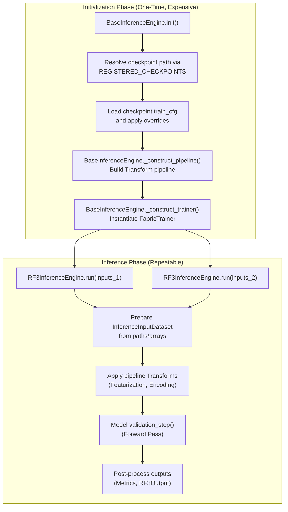
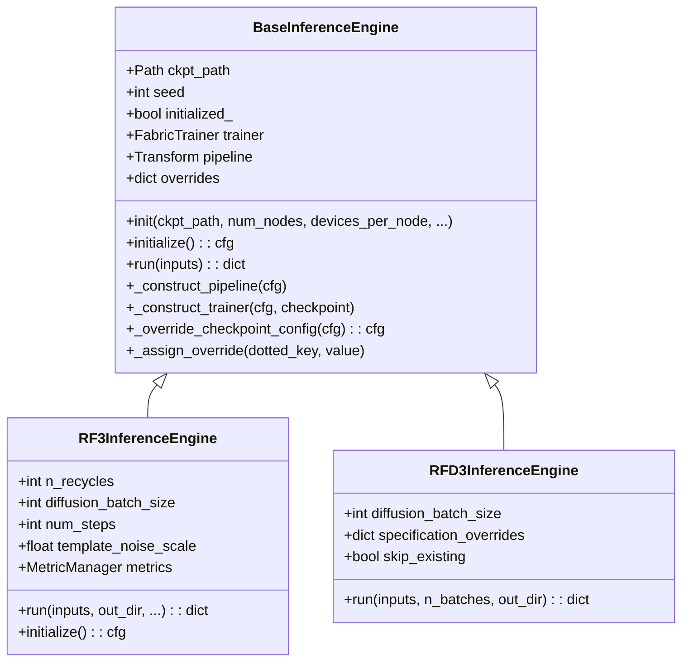
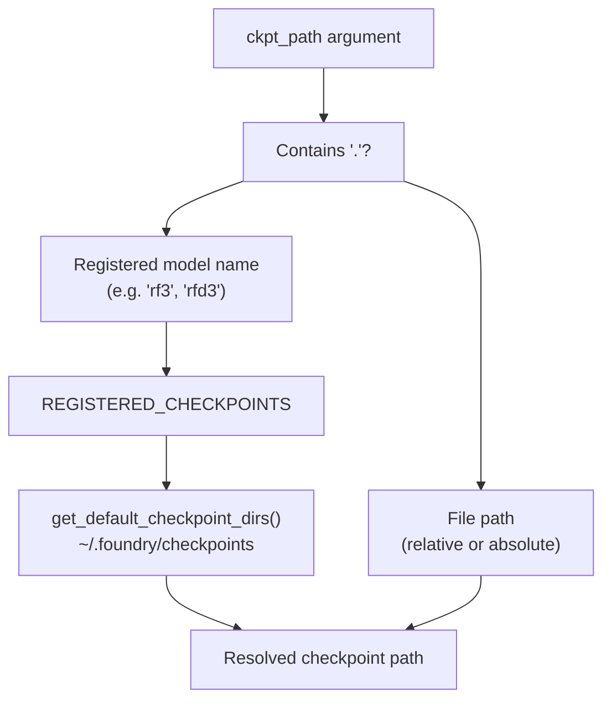
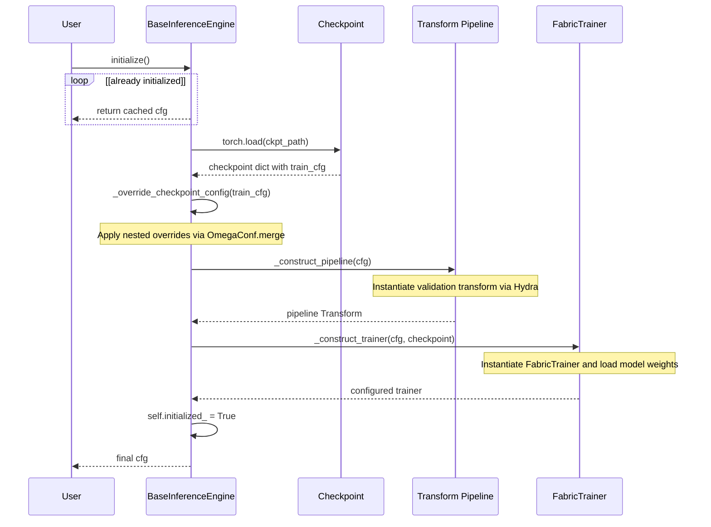
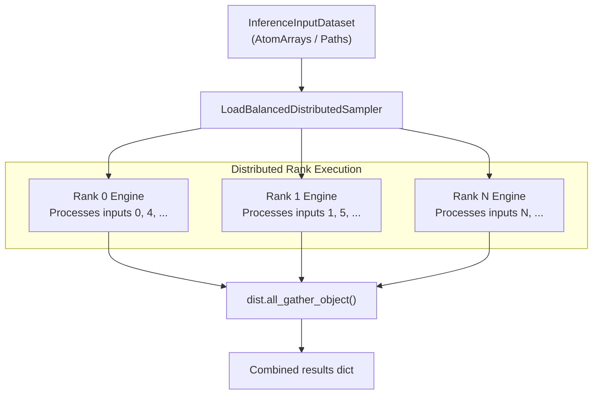

# Inference Engines

> **Relevant source files**
> * [.env](https://github.com/RosettaCommons/foundry/blob/cee116dc/.env)
> * [README.md](https://github.com/RosettaCommons/foundry/blob/cee116dc/README.md?plain=1)
> * [models/rf3/configs/experiment/pretrained/rf3.yaml](https://github.com/RosettaCommons/foundry/blob/cee116dc/models/rf3/configs/experiment/pretrained/rf3.yaml)
> * [models/rf3/configs/inference_engine/base.yaml](https://github.com/RosettaCommons/foundry/blob/cee116dc/models/rf3/configs/inference_engine/base.yaml)
> * [models/rf3/configs/inference_engine/rf3.yaml](https://github.com/RosettaCommons/foundry/blob/cee116dc/models/rf3/configs/inference_engine/rf3.yaml)
> * [models/rf3/src/rf3/callbacks/dump_validation_structures.py](https://github.com/RosettaCommons/foundry/blob/cee116dc/models/rf3/src/rf3/callbacks/dump_validation_structures.py)
> * [models/rf3/src/rf3/cli.py](https://github.com/RosettaCommons/foundry/blob/cee116dc/models/rf3/src/rf3/cli.py)
> * [models/rf3/src/rf3/data/extra_xforms.py](https://github.com/RosettaCommons/foundry/blob/cee116dc/models/rf3/src/rf3/data/extra_xforms.py)
> * [models/rf3/src/rf3/data/pipelines.py](https://github.com/RosettaCommons/foundry/blob/cee116dc/models/rf3/src/rf3/data/pipelines.py)
> * [models/rf3/src/rf3/inference.py](https://github.com/RosettaCommons/foundry/blob/cee116dc/models/rf3/src/rf3/inference.py)
> * [models/rf3/src/rf3/inference_engines/rf3.py](https://github.com/RosettaCommons/foundry/blob/cee116dc/models/rf3/src/rf3/inference_engines/rf3.py)
> * [models/rf3/src/rf3/symmetry/resolve.py](https://github.com/RosettaCommons/foundry/blob/cee116dc/models/rf3/src/rf3/symmetry/resolve.py)
> * [models/rf3/src/rf3/utils/inference.py](https://github.com/RosettaCommons/foundry/blob/cee116dc/models/rf3/src/rf3/utils/inference.py)
> * [models/rf3/src/rf3/utils/io.py](https://github.com/RosettaCommons/foundry/blob/cee116dc/models/rf3/src/rf3/utils/io.py)
> * [models/rfd3/README.md](https://github.com/RosettaCommons/foundry/blob/cee116dc/models/rfd3/README.md?plain=1)
> * [models/rfd3/src/rfd3/cli.py](https://github.com/RosettaCommons/foundry/blob/cee116dc/models/rfd3/src/rfd3/cli.py)
> * [pyproject.toml](https://github.com/RosettaCommons/foundry/blob/cee116dc/pyproject.toml)
> * [src/foundry/inference_engines/base.py](https://github.com/RosettaCommons/foundry/blob/cee116dc/src/foundry/inference_engines/base.py)
> * [src/foundry/inference_engines/checkpoint_registry.py](https://github.com/RosettaCommons/foundry/blob/cee116dc/src/foundry/inference_engines/checkpoint_registry.py)
> * [src/foundry_cli/__init__.py](https://github.com/RosettaCommons/foundry/blob/cee116dc/src/foundry_cli/__init__.py)
> * [src/foundry_cli/download_checkpoints.py](https://github.com/RosettaCommons/foundry/blob/cee116dc/src/foundry_cli/download_checkpoints.py)

## Overview

Inference engines provide a unified interface for running model predictions across the Foundry ecosystem. They separate expensive one-time model setup from inference execution, enabling efficient repeated predictions with different inputs. Each model (RF3, RFD3, MPNN) implements its own inference engine that inherits from `BaseInferenceEngine`.

For information about training infrastructure, see **Infrastructure and Configuration (8.4)**. For checkpoint management utilities, see **Infrastructure and Configuration (8.1)**.

**Sources:** [src/foundry/inference_engines/base.py L32-L36](https://github.com/RosettaCommons/foundry/blob/cee116dc/src/foundry/inference_engines/base.py#L32-L36)

 [models/rf3/src/rf3/inference_engines/rf3.py L222-L239](https://github.com/RosettaCommons/foundry/blob/cee116dc/models/rf3/src/rf3/inference_engines/rf3.py#L222-L239)

---

## Architecture and Lifecycle

**Diagram: Inference Engine Lifecycle** - Initialization occurs once and is expensive (loading weights, building pipeline). The `run()` method can be called multiple times with different inputs after initialization.

**Sources:** [src/foundry/inference_engines/base.py L38-L100](https://github.com/RosettaCommons/foundry/blob/cee116dc/src/foundry/inference_engines/base.py#L38-L100)

 [src/foundry/inference_engines/base.py L125-L142](https://github.com/RosettaCommons/foundry/blob/cee116dc/src/foundry/inference_engines/base.py#L125-L142)

 [models/rf3/src/rf3/inference_engines/rf3.py L440-L525](https://github.com/RosettaCommons/foundry/blob/cee116dc/models/rf3/src/rf3/inference_engines/rf3.py#L440-L525)

---

## BaseInferenceEngine

The `BaseInferenceEngine` class provides the foundational pattern that all model-specific engines inherit. It handles checkpoint loading, configuration management, pipeline construction, and distributed inference setup via Lightning Fabric.

**Diagram: Inheritance Hierarchy** - RF3 and RFD3 inherit from `BaseInferenceEngine` to leverage shared checkpoint and pipeline logic.

**Sources:** [src/foundry/inference_engines/base.py L32-L246](https://github.com/RosettaCommons/foundry/blob/cee116dc/src/foundry/inference_engines/base.py#L32-L246)

 [models/rf3/src/rf3/inference_engines/rf3.py L222-L240](https://github.com/RosettaCommons/foundry/blob/cee116dc/models/rf3/src/rf3/inference_engines/rf3.py#L222-L240)

---

## Checkpoint Resolution

Inference engines support multiple ways to specify checkpoints: registered model names, absolute paths, or relative paths. The `REGISTERED_CHECKPOINTS` registry provides default installation locations and metadata.

**Diagram: Checkpoint Path Resolution** - The engine resolves checkpoint paths through the registry system or direct file paths.

**Sources:** [src/foundry/inference_engines/base.py L71-L91](https://github.com/RosettaCommons/foundry/blob/cee116dc/src/foundry/inference_engines/base.py#L71-L91)

 [src/foundry/inference_engines/checkpoint_registry.py L25-L41](https://github.com/RosettaCommons/foundry/blob/cee116dc/src/foundry/inference_engines/checkpoint_registry.py#L25-L41)

 [src/foundry/inference_engines/checkpoint_registry.py L80-L122](https://github.com/RosettaCommons/foundry/blob/cee116dc/src/foundry/inference_engines/checkpoint_registry.py#L80-L122)

### Registered Checkpoints

| Model Name | Filename | Description |
| --- | --- | --- |
| `rfd3` | `rfd3_latest.ckpt` | RFdiffusion3 checkpoint |
| `rfd3na` | `rfd3na_1190.ckpt` | RFdiffusion3NA checkpoint |
| `rf3` | `rf3_foundry_01_24_latest_remapped.ckpt` | RF3 trained until 1/2024 |
| `proteinmpnn` | `proteinmpnn_v_48_020.pt` | ProteinMPNN checkpoint |
| `ligandmpnn` | `ligandmpnn_v_32_010_25.pt` | LigandMPNN checkpoint |

**Sources:** [src/foundry/inference_engines/checkpoint_registry.py L80-L122](https://github.com/RosettaCommons/foundry/blob/cee116dc/src/foundry/inference_engines/checkpoint_registry.py#L80-L122)

---

## Configuration Override System

Configuration overrides allow runtime modification of checkpoint settings without altering the saved configuration. Overrides use dotted-path notation and are applied hierarchically during `_override_checkpoint_config`.

**Key Override Patterns:**

* **Transform overrides:** `transform_overrides={"diffusion_batch_size": 5}` * Applied to: `cfg.datasets.val.<dataset>.dataset.transform` [src/foundry/inference_engines/base.py L160-L163](https://github.com/RosettaCommons/foundry/blob/cee116dc/src/foundry/inference_engines/base.py#L160-L163)
* **Sampler overrides:** `inference_sampler_overrides={"num_timesteps": 50}` * Applied to: `cfg.model.net.inference_sampler` [src/foundry/inference_engines/base.py L199-L208](https://github.com/RosettaCommons/foundry/blob/cee116dc/src/foundry/inference_engines/base.py#L199-L208)
* **Trainer overrides:** `trainer_overrides={"cleanup_guideposts": True}` * Applied to: `cfg.trainer` [src/foundry/inference_engines/base.py L102-L120](https://github.com/RosettaCommons/foundry/blob/cee116dc/src/foundry/inference_engines/base.py#L102-L120)

**Sources:** [src/foundry/inference_engines/base.py L102-L120](https://github.com/RosettaCommons/foundry/blob/cee116dc/src/foundry/inference_engines/base.py#L102-L120)

 [src/foundry/inference_engines/base.py L199-L208](https://github.com/RosettaCommons/foundry/blob/cee116dc/src/foundry/inference_engines/base.py#L199-L208)

 [src/foundry/inference_engines/base.py L160-L163](https://github.com/RosettaCommons/foundry/blob/cee116dc/src/foundry/inference_engines/base.py#L160-L163)

---

## Initialization Process

The `initialize()` method performs one-time setup. It is called automatically on the first `run()` invocation if not already initialized.

**Sources:** [src/foundry/inference_engines/base.py L125-L142](https://github.com/RosettaCommons/foundry/blob/cee116dc/src/foundry/inference_engines/base.py#L125-L142)

 [src/foundry/inference_engines/base.py L165-L197](https://github.com/RosettaCommons/foundry/blob/cee116dc/src/foundry/inference_engines/base.py#L165-L197)

 [src/foundry/inference_engines/base.py L209-L229](https://github.com/RosettaCommons/foundry/blob/cee116dc/src/foundry/inference_engines/base.py#L209-L229)

---

## Model-Specific Implementations

### RF3InferenceEngine

`RF3InferenceEngine` predicts all-atom biomolecular structures from sequences or structure templates. It uses the `InferenceInputDataset` to manage data flow.

**Key Parameters:**

* `n_recycles` (int): Number of recycling iterations (default: 10) [models/rf3/configs/inference_engine/rf3.yaml L12](https://github.com/RosettaCommons/foundry/blob/cee116dc/models/rf3/configs/inference_engine/rf3.yaml#L12-L12)
* `diffusion_batch_size` (int): Structures generated per input (default: 5) [models/rf3/configs/inference_engine/rf3.yaml L13](https://github.com/RosettaCommons/foundry/blob/cee116dc/models/rf3/configs/inference_engine/rf3.yaml#L13-L13)
* `num_steps` (int): Diffusion sampling steps (default: 50) [models/rf3/configs/inference_engine/rf3.yaml L16](https://github.com/RosettaCommons/foundry/blob/cee116dc/models/rf3/configs/inference_engine/rf3.yaml#L16-L16)
* `early_stopping_plddt_threshold` (float): Stop if mean pLDDT below threshold [models/rf3/configs/inference_engine/rf3.yaml L20](https://github.com/RosettaCommons/foundry/blob/cee116dc/models/rf3/configs/inference_engine/rf3.yaml#L20-L20)

**Output Structure:**
The engine returns `RF3Output` objects containing the `atom_array` and AlphaFold3-compatible confidence metrics. [models/rf3/src/rf3/inference_engines/rf3.py L98-L147](https://github.com/RosettaCommons/foundry/blob/cee116dc/models/rf3/src/rf3/inference_engines/rf3.py#L98-L147)

**Sources:** [models/rf3/src/rf3/inference_engines/rf3.py L240-L327](https://github.com/RosettaCommons/foundry/blob/cee116dc/models/rf3/src/rf3/inference_engines/rf3.py#L240-L327)

 [models/rf3/src/rf3/inference_engines/rf3.py L98-L147](https://github.com/RosettaCommons/foundry/blob/cee116dc/models/rf3/src/rf3/inference_engines/rf3.py#L98-L147)

 [models/rf3/configs/inference_engine/rf3.yaml L1-L33](https://github.com/RosettaCommons/foundry/blob/cee116dc/models/rf3/configs/inference_engine/rf3.yaml#L1-L33)

---

### RFD3InferenceEngine

`RFD3InferenceEngine` generates novel protein backbones via conditional diffusion. It processes `DesignInputSpecification` objects which define constraints like motifs or hotspots.

**Key Features:**

* **Input Validation:** Supports `prevalidate_inputs` to check JSON/YAML schemas before model loading. [models/rfd3/README.md L53](https://github.com/RosettaCommons/foundry/blob/cee116dc/models/rfd3/README.md?plain=1#L53-L53)
* **Trajectory Management:** Can `dump_trajectories` to save the full diffusion denoising process. [models/rfd3/README.md L52](https://github.com/RosettaCommons/foundry/blob/cee116dc/models/rfd3/README.md?plain=1#L52-L52)

**Sources:** [models/rfd3/README.md L41-L64](https://github.com/RosettaCommons/foundry/blob/cee116dc/models/rfd3/README.md?plain=1#L41-L64)

 [models/rfd3/src/rfd3/cli.py L1-L48](https://github.com/RosettaCommons/foundry/blob/cee116dc/models/rfd3/src/rfd3/cli.py#L1-L48)

---

## Distributed Inference

Inference engines support multi-GPU and multi-node execution through Lightning Fabric. The `LoadBalancedDistributedSampler` from `atomworks` ensures work is distributed evenly across ranks by balancing sequence lengths.

**Sources:** [models/rf3/src/rf3/inference_engines/rf3.py L487-L505](https://github.com/RosettaCommons/foundry/blob/cee116dc/models/rf3/src/rf3/inference_engines/rf3.py#L487-L505)

 [models/rf3/src/rf3/inference_engines/rf3.py L723-L733](https://github.com/RosettaCommons/foundry/blob/cee116dc/models/rf3/src/rf3/inference_engines/rf3.py#L723-L733)