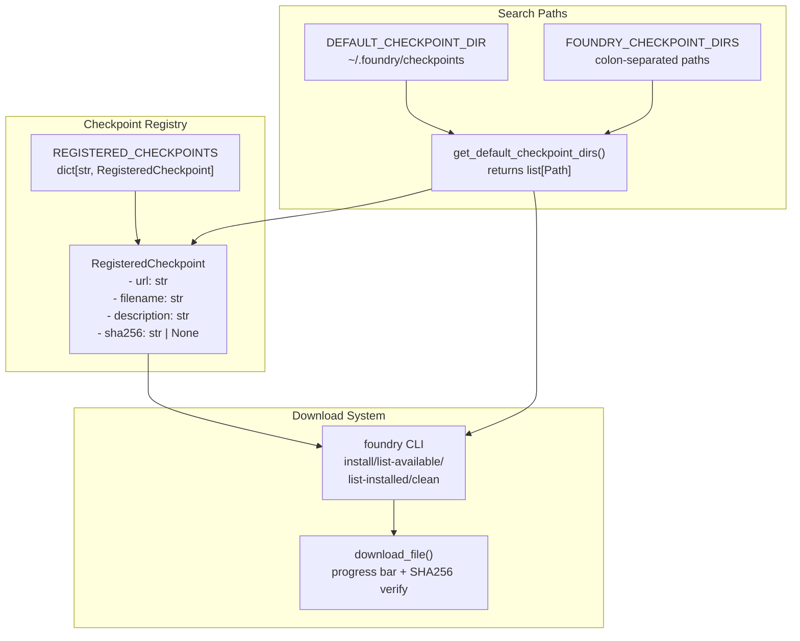
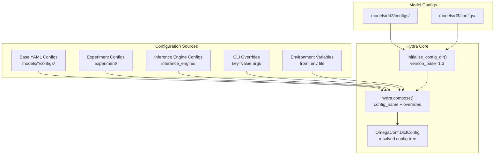

# Infrastructure and Configuration

> **Relevant source files**
> * [.env](https://github.com/RosettaCommons/foundry/blob/cee116dc/.env)
> * [README.md](https://github.com/RosettaCommons/foundry/blob/cee116dc/README.md?plain=1)
> * [models/rf3/configs/trainer/xpu.yaml](https://github.com/RosettaCommons/foundry/blob/cee116dc/models/rf3/configs/trainer/xpu.yaml)
> * [models/rfd3/README.md](https://github.com/RosettaCommons/foundry/blob/cee116dc/models/rfd3/README.md?plain=1)
> * [models/rfd3/configs/trainer/xpu.yaml](https://github.com/RosettaCommons/foundry/blob/cee116dc/models/rfd3/configs/trainer/xpu.yaml)
> * [src/foundry/__init__.py](https://github.com/RosettaCommons/foundry/blob/cee116dc/src/foundry/__init__.py)
> * [src/foundry/inference_engines/base.py](https://github.com/RosettaCommons/foundry/blob/cee116dc/src/foundry/inference_engines/base.py)
> * [src/foundry/inference_engines/checkpoint_registry.py](https://github.com/RosettaCommons/foundry/blob/cee116dc/src/foundry/inference_engines/checkpoint_registry.py)
> * [src/foundry/metrics/metric.py](https://github.com/RosettaCommons/foundry/blob/cee116dc/src/foundry/metrics/metric.py)
> * [src/foundry/testing/__init__.py](https://github.com/RosettaCommons/foundry/blob/cee116dc/src/foundry/testing/__init__.py)
> * [src/foundry/testing/pytest_hooks.py](https://github.com/RosettaCommons/foundry/blob/cee116dc/src/foundry/testing/pytest_hooks.py)
> * [src/foundry/trainers/fabric.py](https://github.com/RosettaCommons/foundry/blob/cee116dc/src/foundry/trainers/fabric.py)
> * [src/foundry/utils/logging.py](https://github.com/RosettaCommons/foundry/blob/cee116dc/src/foundry/utils/logging.py)
> * [src/foundry/utils/squashfs.py](https://github.com/RosettaCommons/foundry/blob/cee116dc/src/foundry/utils/squashfs.py)
> * [src/foundry/utils/xpu/__init__.py](https://github.com/RosettaCommons/foundry/blob/cee116dc/src/foundry/utils/xpu/__init__.py)
> * [src/foundry/utils/xpu/single_xpu_strategy.py](https://github.com/RosettaCommons/foundry/blob/cee116dc/src/foundry/utils/xpu/single_xpu_strategy.py)
> * [src/foundry/utils/xpu/xpu_accelerator.py](https://github.com/RosettaCommons/foundry/blob/cee116dc/src/foundry/utils/xpu/xpu_accelerator.py)
> * [src/foundry/utils/xpu/xpu_precision.py](https://github.com/RosettaCommons/foundry/blob/cee116dc/src/foundry/utils/xpu/xpu_precision.py)
> * [src/foundry_cli/__init__.py](https://github.com/RosettaCommons/foundry/blob/cee116dc/src/foundry_cli/__init__.py)
> * [src/foundry_cli/download_checkpoints.py](https://github.com/RosettaCommons/foundry/blob/cee116dc/src/foundry_cli/download_checkpoints.py)

This page documents the infrastructure components that support model training and inference in Foundry, including checkpoint management, configuration systems, environment setup, command-line interfaces, and distributed execution utilities. For model-specific configuration details, see the individual model pages: [RFdiffusion3 (RFD3)](/RosettaCommons/foundry/4-rfdiffusion3-(rfd3)), [RosettaFold3 (RF3)](/RosettaCommons/foundry/5-rosettafold3-(rf3)), and [ProteinMPNN and LigandMPNN](/RosettaCommons/foundry/6-proteinmpnn-and-ligandmpnn). For training infrastructure details, see [Training Infrastructure](/RosettaCommons/foundry/8.4-training-infrastructure).

---

## Checkpoint Management System

Foundry provides a centralized checkpoint registry and download system that manages model weights across all models in the ecosystem.

### Checkpoint Registry

The checkpoint registry maintains metadata about available model checkpoints and provides utilities for locating and downloading them.



**Checkpoint Search Path Resolution**

The `get_default_checkpoint_dirs()` function in [src/foundry/inference_engines/checkpoint_registry.py L25-L41](https://github.com/RosettaCommons/foundry/blob/cee116dc/src/foundry/inference_engines/checkpoint_registry.py#L25-L41)

 returns an ordered list of directories to search for checkpoints:

1. Directories specified in `FOUNDRY_CHECKPOINT_DIRS` environment variable (colon-separated)
2. Default directory: `~/.foundry/checkpoints`

The `RegisteredCheckpoint` class [src/foundry/inference_engines/checkpoint_registry.py L64-L77](https://github.com/RosettaCommons/foundry/blob/cee116dc/src/foundry/inference_engines/checkpoint_registry.py#L64-L77)

 encapsulates checkpoint metadata and provides `get_default_path()` which searches the checkpoint directories in order and returns the first existing match, or the default location if none exist.

**Available Checkpoints**

The `REGISTERED_CHECKPOINTS` dictionary [src/foundry/inference_engines/checkpoint_registry.py L80-L117](https://github.com/RosettaCommons/foundry/blob/cee116dc/src/foundry/inference_engines/checkpoint_registry.py#L80-L117)

 contains:

| Checkpoint Key | Filename | Description |
| --- | --- | --- |
| `rfd3` | `rfd3_latest.ckpt` | RFdiffusion3 checkpoint |
| `rfd3na` | `rfd3na_1190.ckpt` | RFdiffusion3NA checkpoint |
| `rf3` | `rf3_foundry_01_24_latest_remapped.ckpt` | Latest RF3 (trained with data until 1/2024) |
| `proteinmpnn` | `proteinmpnn_v_48_020.pt` | ProteinMPNN checkpoint |
| `ligandmpnn` | `ligandmpnn_v_32_010_25.pt` | LigandMPNN checkpoint |
| `rf3_preprint_921` | `rf3_foundry_09_21_preprint_remapped.ckpt` | RF3 preprint (9/2021 data) |
| `rf3_preprint_124` | `rf3_foundry_01_24_preprint_remapped.ckpt` | RF3 preprint (1/2024 data) |
| `solublempnn` | `solublempnn_v_48_020.pt` | SolubleMPNN checkpoint |

**Sources:** [src/foundry/inference_engines/checkpoint_registry.py L1-L118](https://github.com/RosettaCommons/foundry/blob/cee116dc/src/foundry/inference_engines/checkpoint_registry.py#L1-L118)

 [README.md L44-L57](https://github.com/RosettaCommons/foundry/blob/cee116dc/README.md?plain=1#L44-L57)

---

### Download CLI

The `foundry` CLI command provides checkpoint management utilities.

**Installation Command**

```
foundry install <models> [--checkpoint-dir PATH] [--force]
```

The `install` command [src/foundry_cli/download_checkpoints.py L144-L186](https://github.com/RosettaCommons/foundry/blob/cee116dc/src/foundry_cli/download_checkpoints.py#L144-L186)

 supports:

* **Model selectors**: `all` (all models), `base-models` (rfd3, rfd3na, rf3, proteinmpnn, ligandmpnn), or individual model names
* **Checkpoint directory**: Optional custom directory; defaults to `~/.foundry/checkpoints`
* **Force flag**: Overwrites existing checkpoints when present

The download process [src/foundry_cli/download_checkpoints.py L54-L103](https://github.com/RosettaCommons/foundry/blob/cee116dc/src/foundry_cli/download_checkpoints.py#L54-L103)

:

1. Creates destination directory if needed
2. Downloads file with progress bar showing transfer speed and time remaining
3. Verifies SHA256 hash if provided in registry
4. Removes corrupted file if hash mismatch occurs

**Listing Commands**

```markdown
foundry list-available    # Show all checkpoints in registryfoundry list-installed    # Show downloaded checkpoints with sizes
```

The `list-installed` command [src/foundry_cli/download_checkpoints.py L196-L223](https://github.com/RosettaCommons/foundry/blob/cee116dc/src/foundry_cli/download_checkpoints.py#L196-L223)

 searches all checkpoint directories and reports total disk usage.

**Environment Variable Updates**

When installing to a custom directory, `append_checkpoint_to_env()` [src/foundry/inference_engines/checkpoint_registry.py L49-L61](https://github.com/RosettaCommons/foundry/blob/cee116dc/src/foundry/inference_engines/checkpoint_registry.py#L49-L61)

 attempts to update the `.env` file to add the directory to `FOUNDRY_CHECKPOINT_DIRS`, making it persistent across sessions.

**Sources:** [src/foundry_cli/download_checkpoints.py L1-L274](https://github.com/RosettaCommons/foundry/blob/cee116dc/src/foundry_cli/download_checkpoints.py#L1-L274)

 [src/foundry/inference_engines/checkpoint_registry.py L1-L118](https://github.com/RosettaCommons/foundry/blob/cee116dc/src/foundry/inference_engines/checkpoint_registry.py#L1-L118)

---

## Configuration System

Foundry uses [Hydra](https://hydra.cc/) for compositional configuration management, enabling flexible hierarchical configs with runtime overrides.

### Configuration Architecture



**Configuration Composition**

Each model package contains a `configs/` directory with hierarchical YAML files. Hydra composes the final configuration by loading base configs and applying experiment-specific overrides.

**Inference Engine Initialization**

The `BaseInferenceEngine` [src/foundry/inference_engines/base.py L32-L61](https://github.com/RosettaCommons/foundry/blob/cee116dc/src/foundry/inference_engines/base.py#L32-L61)

 handles the initialization logic for inference. It loads the training configuration stored within the checkpoint and applies runtime overrides [src/foundry/inference_engines/base.py L160-L163](https://github.com/RosettaCommons/foundry/blob/cee116dc/src/foundry/inference_engines/base.py#L160-L163)

**Sources:** [src/foundry/inference_engines/base.py L32-L205](https://github.com/RosettaCommons/foundry/blob/cee116dc/src/foundry/inference_engines/base.py#L32-L205)

 [models/rfd3/README.md L46-L54](https://github.com/RosettaCommons/foundry/blob/cee116dc/models/rfd3/README.md?plain=1#L46-L54)

---

## Environment Configuration

The `.env` file provides system-wide configuration for external dependencies and resource locations. Foundry uses the [python-dotenv](https://pypi.org/project/python-dotenv/) library to load environment variables.

### Environment Variable Reference

```mermaid
flowchart TD

PDB_MIRROR["PDB_MIRROR_PATH<br>Local PDB mirror"]
CCD_MIRROR["CCD_MIRROR_PATH<br>Local CCD mirror"]
LOCAL_MSA["LOCAL_MSA_DIRS<br>Pre-computed MSA storage"]
HBPLUS["HBPLUS_PATH<br>Hydrogen bond calculation"]
X3DNA["X3DNA_PATH<br>DNA structure analysis"]
DSSP["DSSP_PATH<br>Secondary structure prediction"]
HHFILTER["HHFILTER_PATH<br>MSA filtering (HH-suite)"]
MMSEQS2["MMSEQS2_PATH<br>Fast sequence search"]
COLABFOLD_GPU["COLABFOLD_LOCAL_DB_PATH_GPU<br>ColabFold DB (GPU)"]
COLABFOLD_CPU["COLABFOLD_LOCAL_DB_PATH_CPU<br>ColabFold DB (CPU)"]
CHECKPOINT_DIRS["FOUNDRY_CHECKPOINT_DIRS<br>Colon-separated search paths"]
AtomWorks["AtomWorks<br>Uses PDB/CCD mirrors"]
RF3MSA["RF3<br>Uses MSA databases"]
Training["Training<br>Uses HBPLUS, X3DNA"]
Inference["Inference Engines<br>Uses checkpoint dirs"]

PDB_MIRROR --> AtomWorks
CCD_MIRROR --> AtomWorks
COLABFOLD_GPU --> RF3MSA
COLABFOLD_CPU --> RF3MSA
HBPLUS --> Training
X3DNA --> Training
HHFILTER --> RF3MSA
MMSEQS2 --> RF3MSA
CHECKPOINT_DIRS --> Inference

subgraph Usage ["Usage"]
    AtomWorks
    RF3MSA
    Training
    Inference
end

subgraph subGraph3 ["Checkpoint System"]
    CHECKPOINT_DIRS
end

subgraph subGraph2 ["MSA Databases"]
    COLABFOLD_GPU
    COLABFOLD_CPU
end

subgraph subGraph1 ["External Tools"]
    HBPLUS
    X3DNA
    DSSP
    HHFILTER
    MMSEQS2
end

subgraph subGraph0 ["Data Mirrors"]
    PDB_MIRROR
    CCD_MIRROR
    LOCAL_MSA
end
```



### Mirror Setup

**PDB Mirror**
The `PDB_MIRROR_PATH` [.env L9-L13](https://github.com/RosettaCommons/foundry/blob/cee116dc/.env#L9-L13)

 points to a local mirror of the Protein Data Bank following RCSB conventions.

**CCD Mirror**
The `CCD_MIRROR_PATH` [.env L15-L22](https://github.com/RosettaCommons/foundry/blob/cee116dc/.env#L15-L22)

 points to a Chemical Component Dictionary mirror. If not provided, Foundry falls back to Biotite's internal CCD.

**External Tool Paths**

* **HBPLUS_PATH** [.env L29-L32](https://github.com/RosettaCommons/foundry/blob/cee116dc/.env#L29-L32) : Used for hydrogen bond calculation during training and metrics computation.
* **X3DNA_PATH** [.env L34-L36](https://github.com/RosettaCommons/foundry/blob/cee116dc/.env#L34-L36) : Used for DNA structure analysis.
* **MMSEQS2_PATH** [.env L46-L48](https://github.com/RosettaCommons/foundry/blob/cee116dc/.env#L46-L48) : Used for fast sequence searching in RF3 pipelines.

**Sources:** [.env L1-L63](https://github.com/RosettaCommons/foundry/blob/cee116dc/.env#L1-L63)

 [models/rfd3/README.md L32-L39](https://github.com/RosettaCommons/foundry/blob/cee116dc/models/rfd3/README.md?plain=1#L32-L39)

 [models/rfd3/README.md L106-L115](https://github.com/RosettaCommons/foundry/blob/cee116dc/models/rfd3/README.md?plain=1#L106-L115)

---

## Training Infrastructure

Foundry utilizes **Lightning Fabric** to provide a flexible training harness that supports distributed execution, mixed precision, and hardware acceleration.

### FabricTrainer

The `FabricTrainer` [src/foundry/trainers/fabric.py L57-L84](https://github.com/RosettaCommons/foundry/blob/cee116dc/src/foundry/trainers/fabric.py#L57-L84)

 is the base class for all training activities. It abstracts standard features like:

* **Gradient Accumulation** [src/foundry/trainers/fabric.py L101](https://github.com/RosettaCommons/foundry/blob/cee116dc/src/foundry/trainers/fabric.py#L101-L101)
* **Mixed Precision** [src/foundry/trainers/fabric.py L96-L97](https://github.com/RosettaCommons/foundry/blob/cee116dc/src/foundry/trainers/fabric.py#L96-L97)
* **Distributed Training (DDP)** [src/foundry/trainers/fabric.py L90-L91](https://github.com/RosettaCommons/foundry/blob/cee116dc/src/foundry/trainers/fabric.py#L90-L91)
* **EMA (Exponential Moving Average)** [src/foundry/trainers/fabric.py L30](https://github.com/RosettaCommons/foundry/blob/cee116dc/src/foundry/trainers/fabric.py#L30-L30)

### Hardware Support

Foundry supports a variety of hardware accelerators through Fabric:

* **CUDA**: Standard NVIDIA GPU acceleration.
* **XPU**: Native support for Intel GPUs using `XPUAccelerator` [src/foundry/utils/xpu/xpu_accelerator.py L9-L14](https://github.com/RosettaCommons/foundry/blob/cee116dc/src/foundry/utils/xpu/xpu_accelerator.py#L9-L14)  `SingleXPUStrategy` [src/foundry/utils/xpu/single_xpu_strategy.py L13-L17](https://github.com/RosettaCommons/foundry/blob/cee116dc/src/foundry/utils/xpu/single_xpu_strategy.py#L13-L17)  and `XPUMixedPrecision` [src/foundry/utils/xpu/xpu_precision.py L11-L16](https://github.com/RosettaCommons/foundry/blob/cee116dc/src/foundry/utils/xpu/xpu_precision.py#L11-L16)
* **MPS**: Support for Apple Silicon via community forks [README.md L28-L36](https://github.com/RosettaCommons/foundry/blob/cee116dc/README.md?plain=1#L28-L36)

**Sources:** [src/foundry/trainers/fabric.py L1-L129](https://github.com/RosettaCommons/foundry/blob/cee116dc/src/foundry/trainers/fabric.py#L1-L129)

 [src/foundry/utils/xpu/__init__.py L1-L27](https://github.com/RosettaCommons/foundry/blob/cee116dc/src/foundry/utils/xpu/__init__.py#L1-L27)

 [README.md L18-L43](https://github.com/RosettaCommons/foundry/blob/cee116dc/README.md?plain=1#L18-L43)

---

## Logging Infrastructure

Foundry provides distributed-aware logging utilities that handle multi-GPU training and inference scenarios.

### RankedLogger

The `RankedLogger` class [src/foundry/utils/ddp.py L50-L104](https://github.com/RosettaCommons/foundry/blob/cee116dc/src/foundry/utils/ddp.py#L50-L104)

 extends Python's standard `LoggerAdapter` to provide rank-aware logging in distributed contexts. It automatically prefixes messages with rank information [src/foundry/utils/ddp.py L88-L103](https://github.com/RosettaCommons/foundry/blob/cee116dc/src/foundry/utils/ddp.py#L88-L103)

### Logging Configuration

**Minimal Inference Logging**
For inference workloads, `configure_minimal_inference_logging()` [src/foundry/utils/logging.py L98-L124](https://github.com/RosettaCommons/foundry/blob/cee116dc/src/foundry/utils/logging.py#L98-L124)

 reduces logging verbosity by suppressing noisy loggers and setting the root level to `WARNING`.

**Warning Suppression**
The `suppress_warnings()` context manager [src/foundry/utils/logging.py L69-L96](https://github.com/RosettaCommons/foundry/blob/cee116dc/src/foundry/utils/logging.py#L69-L96)

 provides scoped warning filtering, particularly useful for silencing common NumPy or Biotite warnings [src/foundry/utils/logging.py L30-L67](https://github.com/RosettaCommons/foundry/blob/cee116dc/src/foundry/utils/logging.py#L30-L67)

**Sources:** [src/foundry/utils/logging.py L1-L206](https://github.com/RosettaCommons/foundry/blob/cee116dc/src/foundry/utils/logging.py#L1-L206)

 [src/foundry/utils/ddp.py L50-L104](https://github.com/RosettaCommons/foundry/blob/cee116dc/src/foundry/utils/ddp.py#L50-L104)