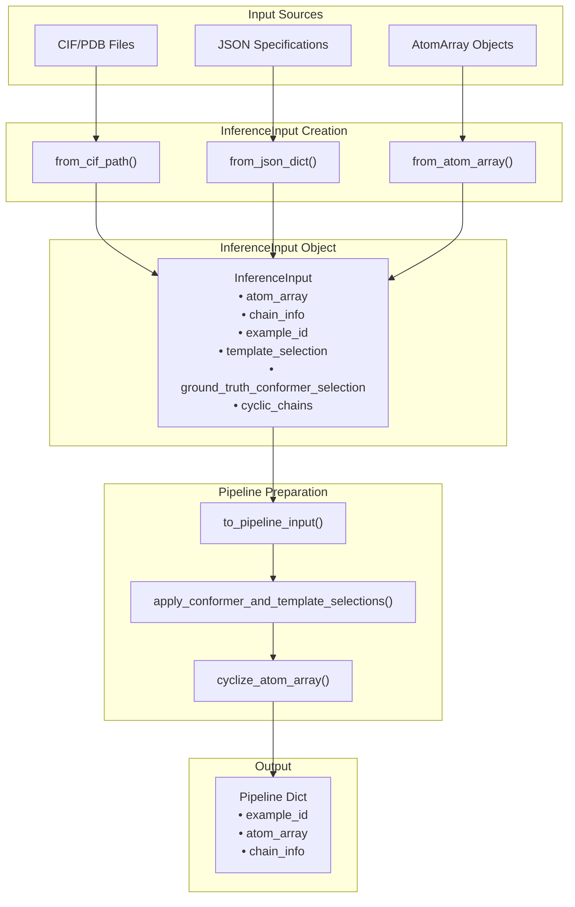
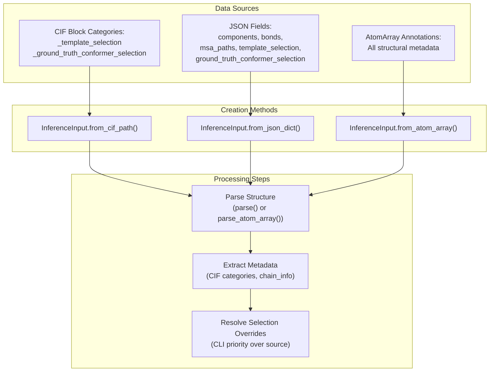
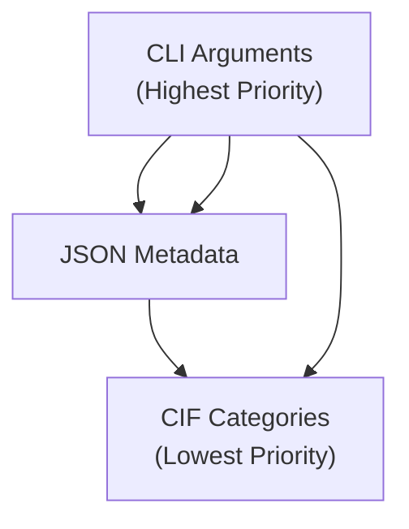

# Input Preparation and Selection

> **Relevant source files**
> * [models/rf3/configs/datasets/base.yaml](https://github.com/RosettaCommons/foundry/blob/cee116dc/models/rf3/configs/datasets/base.yaml)
> * [models/rf3/configs/datasets/train/pdb/base.yaml](https://github.com/RosettaCommons/foundry/blob/cee116dc/models/rf3/configs/datasets/train/pdb/base.yaml)
> * [models/rf3/configs/inference_engine/base.yaml](https://github.com/RosettaCommons/foundry/blob/cee116dc/models/rf3/configs/inference_engine/base.yaml)
> * [models/rf3/configs/inference_engine/rf3.yaml](https://github.com/RosettaCommons/foundry/blob/cee116dc/models/rf3/configs/inference_engine/rf3.yaml)
> * [models/rf3/src/rf3/data/cyclic_transform.py](https://github.com/RosettaCommons/foundry/blob/cee116dc/models/rf3/src/rf3/data/cyclic_transform.py)
> * [models/rf3/src/rf3/data/extra_xforms.py](https://github.com/RosettaCommons/foundry/blob/cee116dc/models/rf3/src/rf3/data/extra_xforms.py)
> * [models/rf3/src/rf3/data/ground_truth_template.py](https://github.com/RosettaCommons/foundry/blob/cee116dc/models/rf3/src/rf3/data/ground_truth_template.py)
> * [models/rf3/src/rf3/data/pipeline_utils.py](https://github.com/RosettaCommons/foundry/blob/cee116dc/models/rf3/src/rf3/data/pipeline_utils.py)
> * [models/rf3/src/rf3/data/pipelines.py](https://github.com/RosettaCommons/foundry/blob/cee116dc/models/rf3/src/rf3/data/pipelines.py)
> * [models/rf3/src/rf3/inference.py](https://github.com/RosettaCommons/foundry/blob/cee116dc/models/rf3/src/rf3/inference.py)
> * [models/rf3/src/rf3/inference_engines/rf3.py](https://github.com/RosettaCommons/foundry/blob/cee116dc/models/rf3/src/rf3/inference_engines/rf3.py)
> * [models/rf3/src/rf3/symmetry/resolve.py](https://github.com/RosettaCommons/foundry/blob/cee116dc/models/rf3/src/rf3/symmetry/resolve.py)
> * [models/rf3/src/rf3/utils/inference.py](https://github.com/RosettaCommons/foundry/blob/cee116dc/models/rf3/src/rf3/utils/inference.py)

## Purpose and Scope

This page documents how inputs are prepared and configured for RF3 structure prediction inference. It covers the `InferenceInput` specification system, selection mechanisms for templating and conformer conditioning, and the AtomSelection query syntax used to specify which portions of a structure should receive special treatment during prediction.

For information about running RF3 inference with these inputs, see [RF3 Inference](/RosettaCommons/foundry/5.2-rf3-inference). For details on RF3's transform pipeline that processes these inputs, see [RF3 Data Pipeline](/RosettaCommons/foundry/5.6-rf3-data-pipeline).

## Input Preparation Overview

RF3 accepts inputs from multiple sources and converts them to a unified `InferenceInput` representation before processing. The preparation workflow involves three main steps:

1. **Loading**: Reading structural data from CIF/PDB files, JSON specifications, or AtomArray objects. [models/rf3/src/rf3/utils/inference.py L72-L258](https://github.com/RosettaCommons/foundry/blob/cee116dc/models/rf3/src/rf3/utils/inference.py#L72-L258)
2. **Selection Configuration**: Specifying which atoms/tokens should be templated or receive ground truth conformers. [models/rf3/src/rf3/utils/inference.py L456-L555](https://github.com/RosettaCommons/foundry/blob/cee116dc/models/rf3/src/rf3/utils/inference.py#L456-L555)
3. **Pipeline Preparation**: Converting the `InferenceInput` to a format suitable for the transform pipeline. [models/rf3/src/rf3/utils/inference.py L260-L282](https://github.com/RosettaCommons/foundry/blob/cee116dc/models/rf3/src/rf3/utils/inference.py#L260-L282)



**Sources:** [models/rf3/src/rf3/utils/inference.py L60-L283](https://github.com/RosettaCommons/foundry/blob/cee116dc/models/rf3/src/rf3/utils/inference.py#L60-L283)

 [models/rf3/src/rf3/inference_engines/rf3.py L439-L477](https://github.com/RosettaCommons/foundry/blob/cee116dc/models/rf3/src/rf3/inference_engines/rf3.py#L439-L477)

## InferenceInput Dataclass

The `InferenceInput` dataclass is the central specification for RF3 inference inputs. It encapsulates all information needed to predict a structure, including the atomic coordinates, metadata, and selection directives. [models/rf3/src/rf3/utils/inference.py L60-L70](https://github.com/RosettaCommons/foundry/blob/cee116dc/models/rf3/src/rf3/utils/inference.py#L60-L70)

### Fields

| Field | Type | Description |
| --- | --- | --- |
| `atom_array` | `AtomArray` | Biotite AtomArray containing atomic coordinates and annotations |
| `chain_info` | `dict` | Chain metadata including MSA paths and entity information |
| `example_id` | `str` | Unique identifier for this prediction example |
| `template_selection` | `list[str] \| None` | Selection strings for token-level templating (distogram) |
| `ground_truth_conformer_selection` | `list[str] \| None` | Selection strings for atom-level conformer conditioning |
| `cyclic_chains` | `list[str] \| None` | Chain IDs to treat as cyclic peptides |

**Sources:** [models/rf3/src/rf3/utils/inference.py L60-L70](https://github.com/RosettaCommons/foundry/blob/cee116dc/models/rf3/src/rf3/utils/inference.py#L60-L70)

### Creation Methods

RF3 provides factory methods for creating `InferenceInput` objects from different sources. [models/rf3/src/rf3/utils/inference.py L72-L258](https://github.com/RosettaCommons/foundry/blob/cee116dc/models/rf3/src/rf3/utils/inference.py#L72-L258)



**Sources:** [models/rf3/src/rf3/utils/inference.py L72-L258](https://github.com/RosettaCommons/foundry/blob/cee116dc/models/rf3/src/rf3/utils/inference.py#L72-L258)

#### from_cif_path()

Loads an `InferenceInput` from a CIF or PDB file. Extracts selection directives from CIF block categories if present. [models/rf3/src/rf3/utils/inference.py L72-L142](https://github.com/RosettaCommons/foundry/blob/cee116dc/models/rf3/src/rf3/utils/inference.py#L72-L142)

The method reads the CIF file using AtomWorks' `parse()` function, extracts the assembly or asymmetric unit, and searches for `_template_selection` and `_ground_truth_conformer_selection` categories in the CIF block using `category_to_dict`. [models/rf3/src/rf3/utils/inference.py L112-L124](https://github.com/RosettaCommons/foundry/blob/cee116dc/models/rf3/src/rf3/utils/inference.py#L112-L124)

#### from_json_dict()

Creates an `InferenceInput` from a JSON dictionary specification. This method supports the AlphaFold3-compatible JSON format with components, bonds, and MSA paths. [models/rf3/src/rf3/utils/inference.py L145-L205](https://github.com/RosettaCommons/foundry/blob/cee116dc/models/rf3/src/rf3/utils/inference.py#L145-L205)

The method uses AtomWorks' `components_to_atom_array()` to build the structure, then extracts chain information and MSA paths from the component list. [models/rf3/src/rf3/utils/inference.py L164-L193](https://github.com/RosettaCommons/foundry/blob/cee116dc/models/rf3/src/rf3/utils/inference.py#L164-L193)

#### from_atom_array()

Converts an existing `AtomArray` to an `InferenceInput`. This is useful when constructing inputs programmatically or when processing structures that are already loaded in memory. [models/rf3/src/rf3/utils/inference.py L207-L258](https://github.com/RosettaCommons/foundry/blob/cee116dc/models/rf3/src/rf3/utils/inference.py#L207-L258)

## Selection Systems

RF3 uses two complementary selection systems to control which parts of a structure receive conditioning during prediction:

1. **Template Selection** - Token-level conditioning via ground truth distogram. [models/rf3/src/rf3/utils/inference.py L456-L495](https://github.com/RosettaCommons/foundry/blob/cee116dc/models/rf3/src/rf3/utils/inference.py#L456-L495)
2. **Ground Truth Conformer Selection** - Atom-level conditioning via reference conformers. [models/rf3/src/rf3/utils/inference.py L498-L555](https://github.com/RosettaCommons/foundry/blob/cee116dc/models/rf3/src/rf3/utils/inference.py#L498-L555)

### Selection Priority and Overrides

When selections are specified in multiple places, the following priority order applies via `_resolve_override`: [models/rf3/src/rf3/utils/inference.py L34-L39](https://github.com/RosettaCommons/foundry/blob/cee116dc/models/rf3/src/rf3/utils/inference.py#L34-L39)



**Sources:** [models/rf3/src/rf3/utils/inference.py L34-L39](https://github.com/RosettaCommons/foundry/blob/cee116dc/models/rf3/src/rf3/utils/inference.py#L34-L39)

 [models/rf3/src/rf3/utils/inference.py L117-L125](https://github.com/RosettaCommons/foundry/blob/cee116dc/models/rf3/src/rf3/utils/inference.py#L117-L125)

 [models/rf3/src/rf3/utils/inference.py L195-L203](https://github.com/RosettaCommons/foundry/blob/cee116dc/models/rf3/src/rf3/utils/inference.py#L195-L203)

### Template Selection

Template selection enables token-level conditioning by providing a ground truth distogram (distance matrix) for selected tokens. This is the preferred method for templating polymer structures. [models/rf3/src/rf3/data/pipeline_utils.py L45-L52](https://github.com/RosettaCommons/foundry/blob/cee116dc/models/rf3/src/rf3/data/pipeline_utils.py#L45-L52)

The `apply_template_selection()` function processes template selection strings and annotates the `atom_array` with the `is_input_file_templated` boolean annotation. [models/rf3/src/rf3/utils/inference.py L456-L495](https://github.com/RosettaCommons/foundry/blob/cee116dc/models/rf3/src/rf3/utils/inference.py#L456-L495)

### Ground Truth Conformer Selection

Ground truth conformer selection enables atom-level conditioning by providing explicit atomic coordinates as a reference conformer. This is preferred for small molecules and cases where precise atomic geometry must be maintained. [models/rf3/src/rf3/data/pipelines.py L178-L180](https://github.com/RosettaCommons/foundry/blob/cee116dc/models/rf3/src/rf3/data/pipelines.py#L178-L180)

The `apply_ground_truth_conformer_selection()` function processes conformer selection strings and annotates the `atom_array` with the `ground_truth_conformer_policy` enumeration, typically setting it to `GroundTruthConformerPolicy.ADD`. [models/rf3/src/rf3/utils/inference.py L498-L555](https://github.com/RosettaCommons/foundry/blob/cee116dc/models/rf3/src/rf3/utils/inference.py#L498-L555)

## AtomSelection Query Syntax

RF3 uses AtomWorks' `AtomSelectionStack` mini-language to specify structural selections. The syntax follows a hierarchical pattern with support for wildcards, ranges, and unions. [models/rf3/src/rf3/utils/inference.py L429-L453](https://github.com/RosettaCommons/foundry/blob/cee116dc/models/rf3/src/rf3/utils/inference.py#L429-L453)

### Syntax Structure

The general format is: `CHAIN_ID/RES_NAME/RES_ID/ATOM_NAME/TRANSFORM_ID`

Each field can be:

* **Exact value**: `A`, `ALA`, `42`, `CA`, `0`
* **Wildcard**: `*` (matches any value)
* **Range** (residues only): `5-10` (inclusive)
* **Union**: Multiple selections separated by commas

**Sources:** [models/rf3/src/rf3/utils/inference.py L429-L453](https://github.com/RosettaCommons/foundry/blob/cee116dc/models/rf3/src/rf3/utils/inference.py#L429-L453)

### Selection Processing

The `apply_atom_selection_mask()` function implements the selection logic:

```python
def apply_atom_selection_mask(    atom_array: AtomArray,     selection_list: Iterable[str]) -> np.ndarray:    """Return combined boolean mask for list of AtomSelectionStack queries."""    selection_mask = np.zeros(len(atom_array), dtype=bool)    for selection in selection_list:        if not selection:            continue        selector = AtomSelectionStack.from_query(selection)        mask = selector.get_mask(atom_array)        selection_mask = selection_mask | mask  # OR semantics    return selection_mask
```

**Sources:** [models/rf3/src/rf3/utils/inference.py L429-L453](https://github.com/RosettaCommons/foundry/blob/cee116dc/models/rf3/src/rf3/utils/inference.py#L429-L453)

## Pipeline Integration

### to_pipeline_input() Method

The `to_pipeline_input()` method converts an `InferenceInput` to a dictionary suitable for the transform pipeline. [models/rf3/src/rf3/utils/inference.py L260-L282](https://github.com/RosettaCommons/foundry/blob/cee116dc/models/rf3/src/rf3/utils/inference.py#L260-L282)

It performs three main operations:

1. **Copies the atom_array** to avoid modifying the original.
2. **Applies selections** via `apply_conformer_and_template_selections()`. [models/rf3/src/rf3/utils/inference.py L558-L584](https://github.com/RosettaCommons/foundry/blob/cee116dc/models/rf3/src/rf3/utils/inference.py#L558-L584)
3. **Cyclizes chains** if `cyclic_chains` is specified. [models/rf3/src/rf3/utils/inference.py L587-L625](https://github.com/RosettaCommons/foundry/blob/cee116dc/models/rf3/src/rf3/utils/inference.py#L587-L625)

### Cyclic Peptide Handling

The `cyclize_atom_array()` function prepares cyclic peptides for prediction by locating the first N atom and last C atom in each specified chain and adding bidirectional bond annotations between them. [models/rf3/src/rf3/utils/inference.py L587-L625](https://github.com/RosettaCommons/foundry/blob/cee116dc/models/rf3/src/rf3/utils/inference.py#L587-L625)

## Batch Processing and Loading

### InferenceInputDataset

For efficient multi-GPU inference, RF3 wraps `InferenceInput` objects in an `InferenceInputDataset`. [models/rf3/src/rf3/utils/inference.py L628-L665](https://github.com/RosettaCommons/foundry/blob/cee116dc/models/rf3/src/rf3/utils/inference.py#L628-L665)

* Computes approximate token counts for load balancing. [models/rf3/src/rf3/utils/inference.py L643-L656](https://github.com/RosettaCommons/foundry/blob/cee116dc/models/rf3/src/rf3/utils/inference.py#L643-L656)
* Works with `LoadBalancedDistributedSampler` to balance work across GPUs. [models/rf3/src/rf3/inference_engines/rf3.py L484-L486](https://github.com/RosettaCommons/foundry/blob/cee116dc/models/rf3/src/rf3/inference_engines/rf3.py#L484-L486)

### prepare_inference_inputs_from_paths()

This function provides a high-level interface for loading multiple inputs from files or directories with parallel processing using `ProcessPoolExecutor`. [models/rf3/src/rf3/utils/inference.py L285-L426](https://github.com/RosettaCommons/foundry/blob/cee116dc/models/rf3/src/rf3/utils/inference.py#L285-L426)

* **Skip existing**: Checks for existing outputs and skips if requested. [models/rf3/src/rf3/utils/inference.py L381-L395](https://github.com/RosettaCommons/foundry/blob/cee116dc/models/rf3/src/rf3/utils/inference.py#L381-L395)
* **Format detection**: Automatically detects JSON vs CIF/PDB based on extension. [models/rf3/src/rf3/utils/inference.py L338-L356](https://github.com/RosettaCommons/foundry/blob/cee116dc/models/rf3/src/rf3/utils/inference.py#L338-L356)

**Sources:** [models/rf3/src/rf3/utils/inference.py L285-L426](https://github.com/RosettaCommons/foundry/blob/cee116dc/models/rf3/src/rf3/utils/inference.py#L285-L426)

 [models/rf3/src/rf3/inference_engines/rf3.py L439-L477](https://github.com/RosettaCommons/foundry/blob/cee116dc/models/rf3/src/rf3/inference_engines/rf3.py#L439-L477)