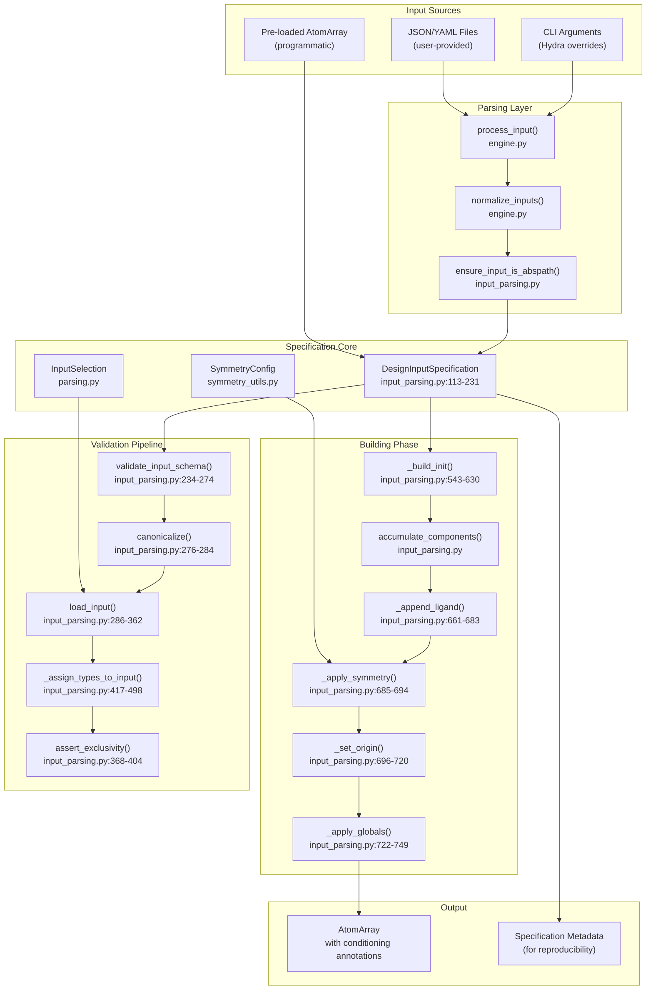
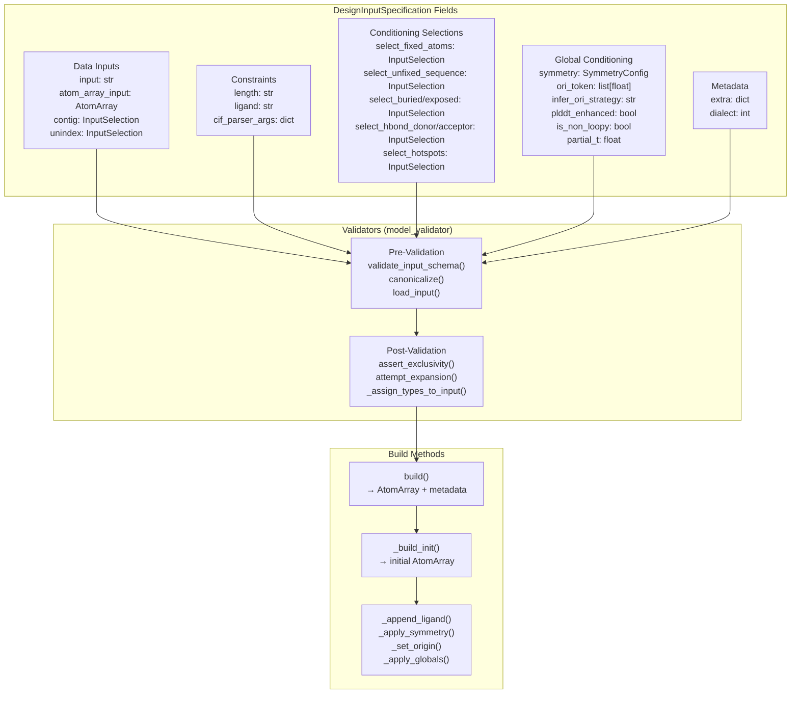
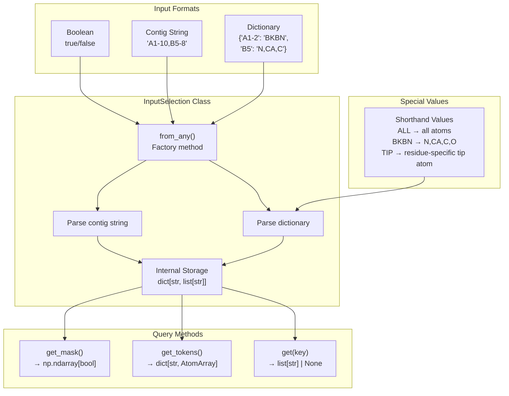
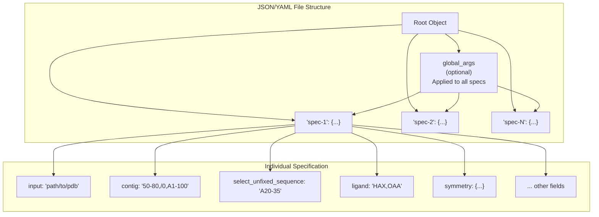
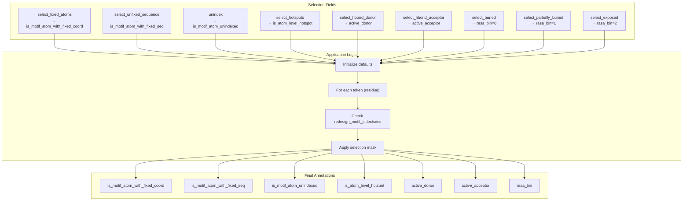
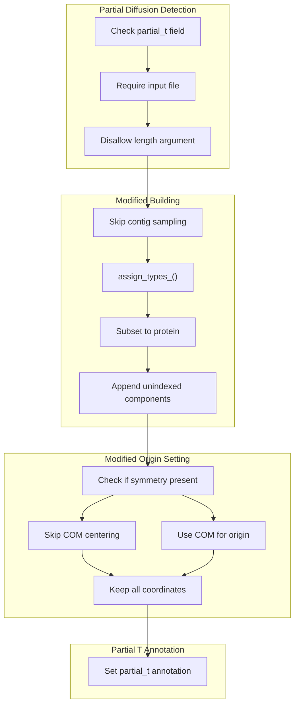
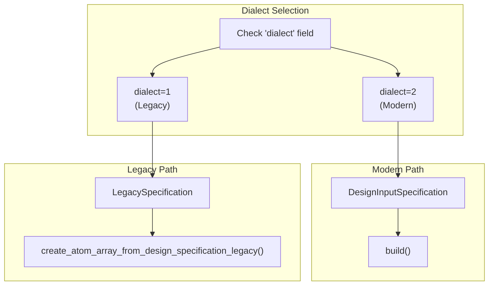

# InputSpecification System

> **Relevant source files**
> * [models/rfd3/configs/inference_engine/rfdiffusion3.yaml](https://github.com/RosettaCommons/foundry/blob/cee116dc/models/rfd3/configs/inference_engine/rfdiffusion3.yaml)
> * [models/rfd3/configs/trainer/loss/losses/diffusion_loss.yaml](https://github.com/RosettaCommons/foundry/blob/cee116dc/models/rfd3/configs/trainer/loss/losses/diffusion_loss.yaml)
> * [models/rfd3/docs/.assets/input_selection_large.png](https://github.com/RosettaCommons/foundry/blob/cee116dc/models/rfd3/docs/.assets/input_selection_large.png)
> * [models/rfd3/docs/examples/demo.json](https://github.com/RosettaCommons/foundry/blob/cee116dc/models/rfd3/docs/examples/demo.json)
> * [models/rfd3/docs/input.md](https://github.com/RosettaCommons/foundry/blob/cee116dc/models/rfd3/docs/input.md?plain=1)
> * [models/rfd3/src/rfd3/inference/input_parsing.py](https://github.com/RosettaCommons/foundry/blob/cee116dc/models/rfd3/src/rfd3/inference/input_parsing.py)
> * [models/rfd3/src/rfd3/inference/legacy_input_parsing.py](https://github.com/RosettaCommons/foundry/blob/cee116dc/models/rfd3/src/rfd3/inference/legacy_input_parsing.py)
> * [models/rfd3/src/rfd3/model/RFD3_diffusion_module.py](https://github.com/RosettaCommons/foundry/blob/cee116dc/models/rfd3/src/rfd3/model/RFD3_diffusion_module.py)
> * [models/rfd3/tests/test_bond_preservation_cases.py](https://github.com/RosettaCommons/foundry/blob/cee116dc/models/rfd3/tests/test_bond_preservation_cases.py)
> * [models/rfd3/tests/test_conditioning.py](https://github.com/RosettaCommons/foundry/blob/cee116dc/models/rfd3/tests/test_conditioning.py)
> * [models/rfd3/tests/test_legacy_ptm_bonds.py](https://github.com/RosettaCommons/foundry/blob/cee116dc/models/rfd3/tests/test_legacy_ptm_bonds.py)

## Purpose and Scope

The InputSpecification System is RFdiffusion3's declarative interface for defining protein design tasks. It provides a validated, type-safe specification language for describing what structures to generate, what constraints to apply, and how to condition the diffusion process. The system translates user-provided JSON/YAML configurations into annotated `AtomArray` objects ready for model inference.

This page covers the specification schema, validation pipeline, and the `InputSelection` mini-language. For information about running inference with these specifications, see [4.5](https://github.com/RosettaCommons/foundry/blob/cee116dc/4.5)

 For training-time usage, see [4.6](https://github.com/RosettaCommons/foundry/blob/cee116dc/4.6)

 For symmetry configuration details, see [4.3](https://github.com/RosettaCommons/foundry/blob/cee116dc/4.3)

---

## System Architecture

The InputSpecification System consists of three major components: specification parsing, validation, and atom array construction.



**Sources:** [models/rfd3/src/rfd3/inference/input_parsing.py L113-L777](https://github.com/RosettaCommons/foundry/blob/cee116dc/models/rfd3/src/rfd3/inference/input_parsing.py#L113-L777)

 [models/rfd3/docs/input.md L1-L25](https://github.com/RosettaCommons/foundry/blob/cee116dc/models/rfd3/docs/input.md?plain=1#L1-L25)

---

## Core Components

### DesignInputSpecification Class

The `DesignInputSpecification` is a Pydantic `BaseModel` that defines the complete schema for RFD3 input specifications [models/rfd3/src/rfd3/inference/input_parsing.py L113-L123](https://github.com/RosettaCommons/foundry/blob/cee116dc/models/rfd3/src/rfd3/inference/input_parsing.py#L113-L123)

 It enforces strict validation at initialization time and provides methods for building annotated atom arrays.



**Key Validation Rules:**

| Validator | Purpose | File Location |
| --- | --- | --- |
| `validate_input_schema` | Ensures either `input` or `contig`/`length` provided; validates usage consistency | [models/rfd3/src/rfd3/inference/input_parsing.py L234-L274](https://github.com/RosettaCommons/foundry/blob/cee116dc/models/rfd3/src/rfd3/inference/input_parsing.py#L234-L274) |
| `canonicalize` | Normalizes `length` to string format, `input` to absolute path | [models/rfd3/src/rfd3/inference/input_parsing.py L276-L284](https://github.com/RosettaCommons/foundry/blob/cee116dc/models/rfd3/src/rfd3/inference/input_parsing.py#L276-L284) |
| `load_input` | Loads atom array from file, initializes `InputSelection` objects | [models/rfd3/src/rfd3/inference/input_parsing.py L286-L362](https://github.com/RosettaCommons/foundry/blob/cee116dc/models/rfd3/src/rfd3/inference/input_parsing.py#L286-L362) |
| `assert_exclusivity` | Validates mutually exclusive selections (RASA bins, motifs) | [models/rfd3/src/rfd3/inference/input_parsing.py L368-L404](https://github.com/RosettaCommons/foundry/blob/cee116dc/models/rfd3/src/rfd3/inference/input_parsing.py#L368-L404) |
| `_assign_types_to_input` | Applies selection masks to atom array annotations | [models/rfd3/src/rfd3/inference/input_parsing.py L417-L498](https://github.com/RosettaCommons/foundry/blob/cee116dc/models/rfd3/src/rfd3/inference/input_parsing.py#L417-L498) |

**Sources:** [models/rfd3/src/rfd3/inference/input_parsing.py L113-L231](https://github.com/RosettaCommons/foundry/blob/cee116dc/models/rfd3/src/rfd3/inference/input_parsing.py#L113-L231)

 [models/rfd3/src/rfd3/inference/input_parsing.py L234-L404](https://github.com/RosettaCommons/foundry/blob/cee116dc/models/rfd3/src/rfd3/inference/input_parsing.py#L234-L404)

---

### InputSelection Mini-Language

The `InputSelection` class provides a flexible mini-language for selecting atoms and residues within input structures [models/rfd3/src/rfd3/inference/parsing.py](https://github.com/RosettaCommons/foundry/blob/cee116dc/models/rfd3/src/rfd3/inference/parsing.py)

 It accepts three input formats: booleans, contig strings, or dictionaries with atom-level granularity.



**Example Usage:**

```sql
# Boolean: select all/noneselect_fixed_atoms = InputSelection.from_any(True, atom_array) # Contig string: select residuesselect_fixed_atoms = InputSelection.from_any("A1-10,B5-8", atom_array) # Dictionary: atom-level controlselect_fixed_atoms = InputSelection.from_any({    "A1-2": "BKBN",      # N,CA,C,O for residues A1-2    "A3": "N,CA,C,O,CB", # Explicit atom list    "B5-7": "ALL",       # All atoms    "B10": "TIP"         # Residue-specific tip atom}, atom_array)
```

**Sources:** [models/rfd3/src/rfd3/inference/input_parsing.py L150-L165](https://github.com/RosettaCommons/foundry/blob/cee116dc/models/rfd3/src/rfd3/inference/input_parsing.py#L150-L165)

 [models/rfd3/docs/input.md L95-L110](https://github.com/RosettaCommons/foundry/blob/cee116dc/models/rfd3/docs/input.md?plain=1#L95-L110)

---

## Input File Format

The InputSpecification System accepts JSON or YAML files containing one or more design specifications. Each top-level key becomes an independent design task [models/rfd3/docs/input.md L34-L47](https://github.com/RosettaCommons/foundry/blob/cee116dc/models/rfd3/docs/input.md?plain=1#L34-L47)

### JSON Structure



**Example JSON:**

```json
{  "M0255_1mg5_unfixed": {    "input": "../input_pdbs/M0255_1mg5.pdb",     "ligand": "NAI,ACT",        "unindex": "A108,A139,A152,A156",    "length": "180-200",    "select_fixed_atoms": {      "A108": "ND2,CG",      "A139": "OG,CB,CA",      "A152": "OH,CZ",      "A156": "NZ,CE,CD",      "ACT": "OXT",      "NAI": ""    },    "allow_ligand_on_existing_chain": true  }}
```

**Sources:** [models/rfd3/docs/examples/demo.json L1-L16](https://github.com/RosettaCommons/foundry/blob/cee116dc/models/rfd3/docs/examples/demo.json#L1-L16)

 [models/rfd3/docs/input.md L34-L47](https://github.com/RosettaCommons/foundry/blob/cee116dc/models/rfd3/docs/input.md?plain=1#L34-L47)

---

## Processing Pipeline

The InputSpecification System processes inputs through a multi-stage pipeline that validates, loads, and constructs annotated atom arrays.

```mermaid
flowchart TD

LoadJSON["Load JSON/YAML"]
ApplyGlobalArgs["Apply global_args"]
SubsetKeys["Subset to keys"]
MakeAbsolute["Make paths absolute"]
SafeInit["DesignInputSpecification.safe_init()"]
CheckDialect["Check dialect field"]
LegacyPath["dialect=1<br>→ LegacySpecification"]
ModernPath["dialect=2<br>→ DesignInputSpecification"]
ValidateSchema["validate_input_schema()"]
Canonicalize["canonicalize()"]
LoadAtomArray["load_input()"]
CoerceSelections["Coerce to InputSelection"]
CheckExclusivity["assert_exclusivity()"]
AttemptExpansion["attempt_expansion()"]
AssignTypes["_assign_types_to_input()"]
BuildInit["_build_init()"]
GetTokens["Get indexed/unindexed tokens"]
SampleContig["Sample contig pattern"]
Accumulate["accumulate_components()"]
PostProcess["Post-process:<br>append ligand,<br>apply symmetry,<br>set origin,<br>apply globals"]
ValidateAnnotations["Validate annotations"]
ConvertBool["Convert to bool"]
ReturnArray["Return AtomArray + metadata"]

MakeAbsolute --> SafeInit
ModernPath --> ValidateSchema
CoerceSelections --> CheckExclusivity
AssignTypes --> BuildInit
PostProcess --> ValidateAnnotations

subgraph subGraph5 ["Stage 6: Output"]
    ValidateAnnotations
    ConvertBool
    ReturnArray
    ValidateAnnotations --> ConvertBool
    ConvertBool --> ReturnArray
end

subgraph subGraph4 ["Stage 5: Building"]
    BuildInit
    GetTokens
    SampleContig
    Accumulate
    PostProcess
    BuildInit --> GetTokens
    GetTokens --> SampleContig
    SampleContig --> Accumulate
    Accumulate --> PostProcess
end

subgraph subGraph3 ["Stage 4: Post-Validation"]
    CheckExclusivity
    AttemptExpansion
    AssignTypes
    CheckExclusivity --> AttemptExpansion
    AttemptExpansion --> AssignTypes
end

subgraph subGraph2 ["Stage 3: Pre-Validation"]
    ValidateSchema
    Canonicalize
    LoadAtomArray
    CoerceSelections
    ValidateSchema --> Canonicalize
    Canonicalize --> LoadAtomArray
    LoadAtomArray --> CoerceSelections
end

subgraph subGraph1 ["Stage 2: Specification Creation"]
    SafeInit
    CheckDialect
    LegacyPath
    ModernPath
    SafeInit --> CheckDialect
    CheckDialect --> LegacyPath
    CheckDialect --> ModernPath
end

subgraph subGraph0 ["Stage 1: File Loading"]
    LoadJSON
    ApplyGlobalArgs
    SubsetKeys
    MakeAbsolute
    LoadJSON --> ApplyGlobalArgs
    ApplyGlobalArgs --> SubsetKeys
    SubsetKeys --> MakeAbsolute
end
```



**Key Functions:**

| Function | Purpose | Location |
| --- | --- | --- |
| `DesignInputSpecification.safe_init()` | Factory method handling legacy/modern dialects | [models/rfd3/src/rfd3/inference/input_parsing.py L752-L762](https://github.com/RosettaCommons/foundry/blob/cee116dc/models/rfd3/src/rfd3/inference/input_parsing.py#L752-L762) |
| `validate_input_schema()` | Validates field requirements and usage | [models/rfd3/src/rfd3/inference/input_parsing.py L234-L274](https://github.com/RosettaCommons/foundry/blob/cee116dc/models/rfd3/src/rfd3/inference/input_parsing.py#L234-L274) |
| `load_input()` | Loads atom array and initializes selections | [models/rfd3/src/rfd3/inference/input_parsing.py L286-L362](https://github.com/RosettaCommons/foundry/blob/cee116dc/models/rfd3/src/rfd3/inference/input_parsing.py#L286-L362) |
| `_assign_types_to_input()` | Applies selection masks to annotations | [models/rfd3/src/rfd3/inference/input_parsing.py L417-L498](https://github.com/RosettaCommons/foundry/blob/cee116dc/models/rfd3/src/rfd3/inference/input_parsing.py#L417-L498) |
| `build()` | Orchestrates atom array construction | [models/rfd3/src/rfd3/inference/input_parsing.py L504-L537](https://github.com/RosettaCommons/foundry/blob/cee116dc/models/rfd3/src/rfd3/inference/input_parsing.py#L504-L537) |

**Sources:** [models/rfd3/src/rfd3/inference/input_parsing.py L504-L777](https://github.com/RosettaCommons/foundry/blob/cee116dc/models/rfd3/src/rfd3/inference/input_parsing.py#L504-L777)

---

## Conditioning Annotations

The InputSpecification System assigns conditioning annotations to atoms based on the provided selections [models/rfd3/src/rfd3/inference/input_parsing.py L417-L498](https://github.com/RosettaCommons/foundry/blob/cee116dc/models/rfd3/src/rfd3/inference/input_parsing.py#L417-L498)

 These annotations control the diffusion process.



**Required Annotations:**

| Annotation | Type | Purpose |
| --- | --- | --- |
| `is_motif_atom_with_fixed_coord` | `int` (bool) | Whether atom coordinates are fixed during diffusion |
| `is_motif_atom_with_fixed_seq` | `int` (bool) | Whether atom sequence identity is fixed |
| `is_motif_atom_unindexed` | `int` (bool) | Whether motif position is unknown to model |
| `is_atom_level_hotspot` | `int` (bool) | PPI hotspot conditioning |
| `active_donor` | `int` (bool) | Hydrogen bond donor atom |
| `active_acceptor` | `int` (bool) | Hydrogen bond acceptor atom |
| `rasa_bin` | `int` | Solvent accessibility: 0=buried, 1=partial, 2=exposed, 3=unconditioned |

**Sources:** [models/rfd3/src/rfd3/inference/input_parsing.py L417-L498](https://github.com/RosettaCommons/foundry/blob/cee116dc/models/rfd3/src/rfd3/inference/input_parsing.py#L417-L498)

 [models/rfd3/src/rfd3/constants.py L30-L34](https://github.com/RosettaCommons/foundry/blob/cee116dc/models/rfd3/src/rfd3/constants.py#L30-L34)

---

## Partial Diffusion Mode

When `partial_t` is specified, the InputSpecification System operates in partial diffusion mode [models/rfd3/docs/input.md L121-L147](https://github.com/RosettaCommons/foundry/blob/cee116dc/models/rfd3/docs/input.md?plain=1#L121-L147)



**Sources:** [models/rfd3/src/rfd3/inference/input_parsing.py L195-L198](https://github.com/RosettaCommons/foundry/blob/cee116dc/models/rfd3/src/rfd3/inference/input_parsing.py#L195-L198)

 [models/rfd3/docs/input.md L121-L147](https://github.com/RosettaCommons/foundry/blob/cee116dc/models/rfd3/docs/input.md?plain=1#L121-L147)

---

## Legacy Compatibility

The system maintains backwards compatibility with original input formats through the `LegacySpecification` class [models/rfd3/src/rfd3/inference/input_parsing.py L78-L105](https://github.com/RosettaCommons/foundry/blob/cee116dc/models/rfd3/src/rfd3/inference/input_parsing.py#L78-L105)



**Migration Guide:**

| Legacy Field | Modern Field | Notes |
| --- | --- | --- |
| `unfix_sequence` | `select_unfixed_sequence` | Now uses `InputSelection` |
| `contig_atoms` | `select_fixed_atoms` | Now uses `InputSelection` |
| `atomwise_rasa` | `select_buried`/`select_exposed` | Split into explicit fields |

**Sources:** [models/rfd3/src/rfd3/inference/input_parsing.py L78-L105](https://github.com/RosettaCommons/foundry/blob/cee116dc/models/rfd3/src/rfd3/inference/input_parsing.py#L78-L105)

 [models/rfd3/src/rfd3/inference/legacy_input_parsing.py L416-L611](https://github.com/RosettaCommons/foundry/blob/cee116dc/models/rfd3/src/rfd3/inference/legacy_input_parsing.py#L416-L611)

---

## Field Reference

### Complete Field Table

| Field | Type | Description |
| --- | --- | --- |
| `input` | `str` | Path to input PDB/CIF file [models/rfd3/src/rfd3/inference/input_parsing.py L130](https://github.com/RosettaCommons/foundry/blob/cee116dc/models/rfd3/src/rfd3/inference/input_parsing.py#L130-L130) |
| `contig` | `InputSelection` | Contig specification string [models/rfd3/src/rfd3/inference/input_parsing.py L132](https://github.com/RosettaCommons/foundry/blob/cee116dc/models/rfd3/src/rfd3/inference/input_parsing.py#L132-L132) |
| `unindex` | `InputSelection` | Unindexed components selection [models/rfd3/src/rfd3/inference/input_parsing.py L133](https://github.com/RosettaCommons/foundry/blob/cee116dc/models/rfd3/src/rfd3/inference/input_parsing.py#L133-L133) |
| `length` | `str` | Length range as 'min-max' or int [models/rfd3/src/rfd3/inference/input_parsing.py L139](https://github.com/RosettaCommons/foundry/blob/cee116dc/models/rfd3/src/rfd3/inference/input_parsing.py#L139-L139) |
| `ligand` | `str` | Ligand name or index to include [models/rfd3/src/rfd3/inference/input_parsing.py L140](https://github.com/RosettaCommons/foundry/blob/cee116dc/models/rfd3/src/rfd3/inference/input_parsing.py#L140-L140) |
| `select_fixed_atoms` | `InputSelection` | Atoms to fix coordinates for [models/rfd3/src/rfd3/inference/input_parsing.py L150](https://github.com/RosettaCommons/foundry/blob/cee116dc/models/rfd3/src/rfd3/inference/input_parsing.py#L150-L150) |
| `select_unfixed_sequence` | `InputSelection` | Components to unfix sequence for [models/rfd3/src/rfd3/inference/input_parsing.py L158](https://github.com/RosettaCommons/foundry/blob/cee116dc/models/rfd3/src/rfd3/inference/input_parsing.py#L158-L158) |
| `select_buried` | `InputSelection` | Selection of RASA buried conditioning [models/rfd3/src/rfd3/inference/input_parsing.py L168](https://github.com/RosettaCommons/foundry/blob/cee116dc/models/rfd3/src/rfd3/inference/input_parsing.py#L168-L168) |
| `select_hotspots` | `InputSelection` | Selection of hotspot residues [models/rfd3/src/rfd3/inference/input_parsing.py L182](https://github.com/RosettaCommons/foundry/blob/cee116dc/models/rfd3/src/rfd3/inference/input_parsing.py#L182-L182) |
| `partial_t` | `float` | Partial diffusion noise level [models/rfd3/src/rfd3/inference/input_parsing.py L198](https://github.com/RosettaCommons/foundry/blob/cee116dc/models/rfd3/src/rfd3/inference/input_parsing.py#L198-L198) |
| `dialect` | `int` | RFdiffusion3 input dialect (1: legacy, 2: release) [models/rfd3/src/rfd3/inference/input_parsing.py L144](https://github.com/RosettaCommons/foundry/blob/cee116dc/models/rfd3/src/rfd3/inference/input_parsing.py#L144-L144) |

**Sources:** [models/rfd3/src/rfd3/inference/input_parsing.py L121-L229](https://github.com/RosettaCommons/foundry/blob/cee116dc/models/rfd3/src/rfd3/inference/input_parsing.py#L121-L229)