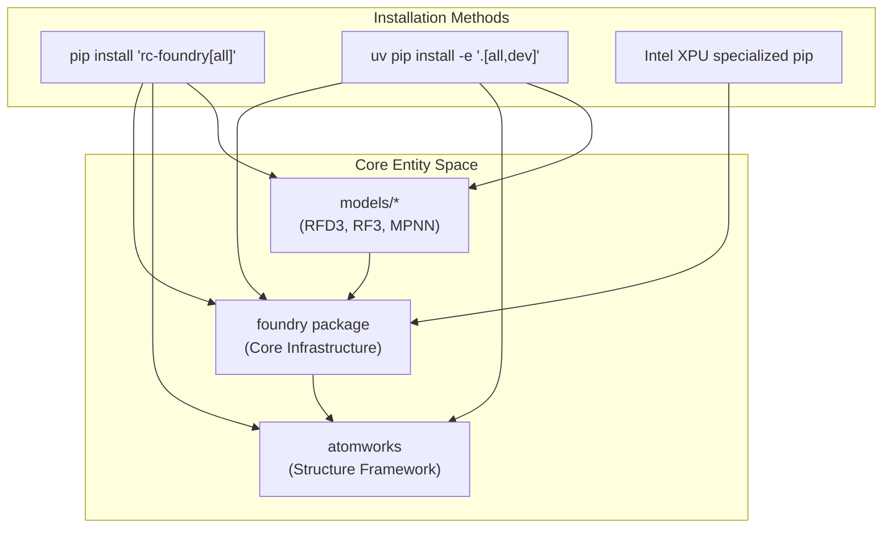
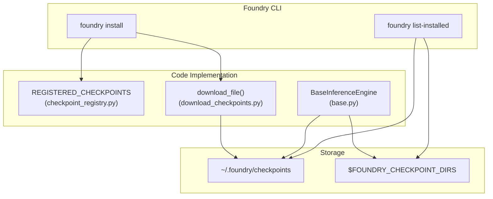

# Installation

> **Relevant source files**
> * [.env](https://github.com/RosettaCommons/foundry/blob/cee116dc/.env)
> * [README.md](https://github.com/RosettaCommons/foundry/blob/cee116dc/README.md?plain=1)
> * [examples/docker/Dockerfile](https://github.com/RosettaCommons/foundry/blob/cee116dc/examples/docker/Dockerfile)
> * [models/rfd3/README.md](https://github.com/RosettaCommons/foundry/blob/cee116dc/models/rfd3/README.md?plain=1)
> * [models/rfd3/docs/index.rst](https://github.com/RosettaCommons/foundry/blob/cee116dc/models/rfd3/docs/index.rst)
> * [models/rfd3/docs/tutorials/RFdiffusion3_installation_tutorial.md](https://github.com/RosettaCommons/foundry/blob/cee116dc/models/rfd3/docs/tutorials/RFdiffusion3_installation_tutorial.md?plain=1)
> * [models/rfd3/docs/tutorials/installation_tutorial/inputs.zip](https://github.com/RosettaCommons/foundry/blob/cee116dc/models/rfd3/docs/tutorials/installation_tutorial/inputs.zip)
> * [models/rfd3/docs/tutorials/installation_tutorial/outputs.zip](https://github.com/RosettaCommons/foundry/blob/cee116dc/models/rfd3/docs/tutorials/installation_tutorial/outputs.zip)
> * [src/foundry/inference_engines/base.py](https://github.com/RosettaCommons/foundry/blob/cee116dc/src/foundry/inference_engines/base.py)
> * [src/foundry/inference_engines/checkpoint_registry.py](https://github.com/RosettaCommons/foundry/blob/cee116dc/src/foundry/inference_engines/checkpoint_registry.py)
> * [src/foundry_cli/__init__.py](https://github.com/RosettaCommons/foundry/blob/cee116dc/src/foundry_cli/__init__.py)
> * [src/foundry_cli/download_checkpoints.py](https://github.com/RosettaCommons/foundry/blob/cee116dc/src/foundry_cli/download_checkpoints.py)

This page covers installing the Foundry platform, including the core package, individual model packages (RFD3, RF3, MPNN), model checkpoints, and environment setup. Foundry is a unified framework that relies on **AtomWorks** for structure manipulation and processing.

## Overview

Foundry installation consists of four main components:

1. **Package Installation** - Installing Python packages via `pip` or `uv`.
2. **Hardware-Specific Setup** - Specialized instructions for Intel XPU and Apple Silicon (MPS).
3. **Checkpoint Management** - Downloading pre-trained model weights via the `foundry` CLI.
4. **Environment Configuration** - Setting up the `.env` file for external tools and data mirrors.

**Sources:** [README.md L1-L5](https://github.com/RosettaCommons/foundry/blob/cee116dc/README.md?plain=1#L1-L5)

## Package Installation

### Standard Installation

The recommended installation for most users installs the core framework along with all supported models (RFD3, RF3, and MPNN variants).

```
pip install "rc-foundry[all]"
```

This command installs:

* `foundry`: Core architectures, training infrastructure, and inference endpoints [README.md L115](https://github.com/RosettaCommons/foundry/blob/cee116dc/README.md?plain=1#L115-L115)
* `atomworks`: The underlying framework for structure I/O and featurization [README.md L114](https://github.com/RosettaCommons/foundry/blob/cee116dc/README.md?plain=1#L114-L114)
* `rfd3`, `rf3`, `mpnn`: Specific model implementations located in the `models/` directory [README.md L116](https://github.com/RosettaCommons/foundry/blob/cee116dc/README.md?plain=1#L116-L116)

**Sources:** [README.md L13-L16](https://github.com/RosettaCommons/foundry/blob/cee116dc/README.md?plain=1#L13-L16)

 [README.md L112-L116](https://github.com/RosettaCommons/foundry/blob/cee116dc/README.md?plain=1#L112-L116)

### Hardware-Specific Installation

#### Intel XPU Support

For Intel XPU devices, PyTorch must be installed with XPU support before installing Foundry. Use `pip` instead of `uv` to prevent dependency re-resolution from replacing the XPU-specific torch version.

```
pip install torch --index-url https://download.pytorch.org/whl/xpupip install "rc-foundry[all]"
```

**Sources:** [README.md L18-L26](https://github.com/RosettaCommons/foundry/blob/cee116dc/README.md?plain=1#L18-L26)

#### macOS (Apple Silicon / MPS)

Inference for RFD3, RF3, and MPNN is supported on Apple Silicon via Metal Performance Shaders (MPS). Note that `bfloat16` is not supported on MPS; Foundry automatically enforces `float32` precision on these devices.

```
pip install torchpip install "rc-foundry[all] @ git+https://github.com/fnachon/foundry.git"
```

**Sources:** [README.md L28-L43](https://github.com/RosettaCommons/foundry/blob/cee116dc/README.md?plain=1#L28-L43)

### Developer / Editable Installation

Core developers working on multiple packages should install in editable mode to ensure changes to shared utilities or model-specific code are reflected immediately.

```
uv pip install -e '.[all,dev]'
```

**Sources:** [README.md L118-L124](https://github.com/RosettaCommons/foundry/blob/cee116dc/README.md?plain=1#L118-L124)



**Diagram: Association of Installation Commands to Code Entities**
**Sources:** [README.md L112-L116](https://github.com/RosettaCommons/foundry/blob/cee116dc/README.md?plain=1#L112-L116)

 [README.md L123-L124](https://github.com/RosettaCommons/foundry/blob/cee116dc/README.md?plain=1#L123-L124)

## Checkpoint Management

Pre-trained weights are managed via the `foundry` CLI, which interacts with a centralized `REGISTERED_CHECKPOINTS` registry.

### The Foundry CLI

The `foundry` command (implemented in `src/foundry_cli/download_checkpoints.py`) allows users to install, list, and verify model weights.

* **Install Base Models:** Downloads the latest RFD3, RF3, and MPNN variants. ```html foundry install base-models --checkpoint-dir <path/to/ckpt/dir> ```
* **List Available:** Shows all models in the registry [src/foundry_cli/download_checkpoints.py L188-L193](https://github.com/RosettaCommons/foundry/blob/cee116dc/src/foundry_cli/download_checkpoints.py#L188-L193) ``` foundry list-available ```
* **List Installed:** Scans `~/.foundry/checkpoints` and `$FOUNDRY_CHECKPOINT_DIRS` [src/foundry_cli/download_checkpoints.py L196-L198](https://github.com/RosettaCommons/foundry/blob/cee116dc/src/foundry_cli/download_checkpoints.py#L196-L198) ``` foundry list-installed ```

**Sources:** [README.md L44-L56](https://github.com/RosettaCommons/foundry/blob/cee116dc/README.md?plain=1#L44-L56)

 [src/foundry_cli/download_checkpoints.py L1-L29](https://github.com/RosettaCommons/foundry/blob/cee116dc/src/foundry_cli/download_checkpoints.py#L1-L29)

### Checkpoint Registry

The registry maps model keys to their download metadata, including URLs and filenames.

| Model Key | Filename | Description |
| --- | --- | --- |
| `rfd3` | `rfd3_latest.ckpt` | RFdiffusion3 checkpoint [src/foundry/inference_engines/checkpoint_registry.py L86-L90](https://github.com/RosettaCommons/foundry/blob/cee116dc/src/foundry/inference_engines/checkpoint_registry.py#L86-L90) |
| `rf3` | `rf3_foundry_01_24_latest_remapped.ckpt` | Latest RF3 (best performance) [src/foundry/inference_engines/checkpoint_registry.py L91-L95](https://github.com/RosettaCommons/foundry/blob/cee116dc/src/foundry/inference_engines/checkpoint_registry.py#L91-L95) |
| `proteinmpnn` | `proteinmpnn_v_48_020.pt` | Standard ProteinMPNN [src/foundry/inference_engines/checkpoint_registry.py L96-L100](https://github.com/RosettaCommons/foundry/blob/cee116dc/src/foundry/inference_engines/checkpoint_registry.py#L96-L100) |
| `rfd3na` | `rfd3na_1190.ckpt` | RFdiffusion3 Nucleic Acid extension [src/foundry/inference_engines/checkpoint_registry.py L81-L85](https://github.com/RosettaCommons/foundry/blob/cee116dc/src/foundry/inference_engines/checkpoint_registry.py#L81-L85) |

**Sources:** [src/foundry/inference_engines/checkpoint_registry.py L80-L122](https://github.com/RosettaCommons/foundry/blob/cee116dc/src/foundry/inference_engines/checkpoint_registry.py#L80-L122)

### Checkpoint Resolution Logic

When an inference engine is initialized (e.g., `BaseInferenceEngine`), it resolves the checkpoint path. If a registered name is provided instead of a path, it searches the default directory (`~/.foundry/checkpoints`) and any directories defined in the `FOUNDRY_CHECKPOINT_DIRS` environment variable.

**Sources:** [src/foundry/inference_engines/base.py L72-L91](https://github.com/RosettaCommons/foundry/blob/cee116dc/src/foundry/inference_engines/base.py#L72-L91)

 [src/foundry/inference_engines/checkpoint_registry.py L25-L41](https://github.com/RosettaCommons/foundry/blob/cee116dc/src/foundry/inference_engines/checkpoint_registry.py#L25-L41)



**Diagram: Checkpoint Data Flow from Registry to Local Storage**
**Sources:** [src/foundry_cli/download_checkpoints.py L33-L51](https://github.com/RosettaCommons/foundry/blob/cee116dc/src/foundry_cli/download_checkpoints.py#L33-L51)

 [src/foundry/inference_engines/checkpoint_registry.py L71-L78](https://github.com/RosettaCommons/foundry/blob/cee116dc/src/foundry/inference_engines/checkpoint_registry.py#L71-L78)

 [src/foundry/inference_engines/base.py L72-L85](https://github.com/RosettaCommons/foundry/blob/cee116dc/src/foundry/inference_engines/base.py#L72-L85)

## Environment Configuration

Foundry uses a `.env` file to manage paths for external tools and data mirrors. A template is provided in the repository root.

### Data Mirrors (Training/Validation)

For training or advanced validation, Foundry requires mirrors of the PDB and CCD (Chemical Component Dictionary).

* **PDB_MIRROR_PATH**: Local mirror of PDB CIF files [.env L9-L13](https://github.com/RosettaCommons/foundry/blob/cee116dc/ .env#L9-L13)
* **CCD_MIRROR_PATH**: Local mirror of CCD CIF files [.env L15-L22](https://github.com/RosettaCommons/foundry/blob/cee116dc/ .env#L15-L22)

### External Tools

Certain features require external executables. Paths to these must be defined in the `.env` file:

* **HBPLUS_PATH**: Path to `hbplus` for hydrogen bond calculation [.env L29-L32](https://github.com/RosettaCommons/foundry/blob/cee116dc/ .env#L29-L32)  Required for RFD3 hydrogen bond conditioning [models/rfd3/README.md L32-L38](https://github.com/RosettaCommons/foundry/blob/cee116dc/models/rfd3/README.md?plain=1#L32-L38)
* **X3DNA_PATH**: Path to `x3dna` for DNA structure analysis [.env L34-L36](https://github.com/RosettaCommons/foundry/blob/cee116dc/ .env#L34-L36)
* **MMSEQS2_PATH**: Path to `mmseqs` for sequence searching [.env L46-L48](https://github.com/RosettaCommons/foundry/blob/cee116dc/ .env#L46-L48)
* **HHFILTER_PATH**: Path to `hhfilter` for MSA filtering [.env L41-L44](https://github.com/RosettaCommons/foundry/blob/cee116dc/ .env#L41-L44)

**Sources:** [.env L1-L63](https://github.com/RosettaCommons/foundry/blob/cee116dc/ .env#L1-L63)

 [models/rfd3/README.md L32-L38](https://github.com/RosettaCommons/foundry/blob/cee116dc/models/rfd3/README.md?plain=1#L32-L38)

## Docker Installation

For containerized environments, an official Docker image is available. The `slim` tag is recommended if you intend to mount your own checkpoints.

```
docker pull rosettacommons/foundry:latest
```

The Dockerfile (located in `examples/docker/Dockerfile`) uses `uv` to manage the virtual environment and pre-installs the `base-models` to `/app/foundry/checkpoints`.

**Sources:** [README.md L60-L66](https://github.com/RosettaCommons/foundry/blob/cee116dc/README.md?plain=1#L60-L66)

 [examples/docker/Dockerfile L30-L40](https://github.com/RosettaCommons/foundry/blob/cee116dc/examples/docker/Dockerfile#L30-L40)