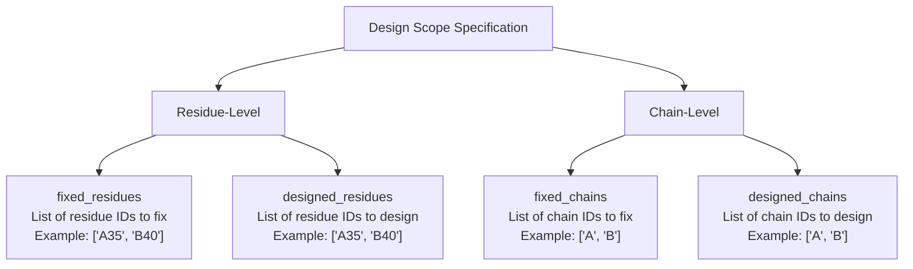
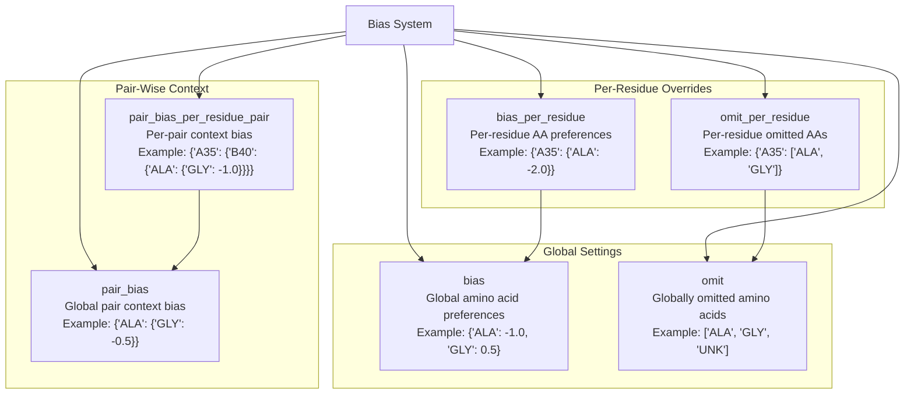
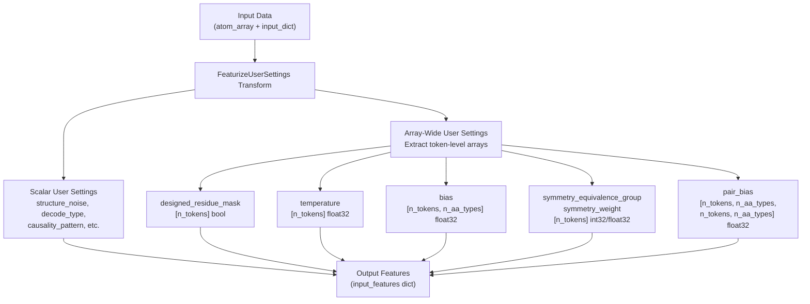

# MPNN Configuration

> **Relevant source files**
> * [models/mpnn/README.md](https://github.com/RosettaCommons/foundry/blob/cee116dc/models/mpnn/README.md?plain=1)
> * [models/mpnn/src/mpnn/__init__.py](https://github.com/RosettaCommons/foundry/blob/cee116dc/models/mpnn/src/mpnn/__init__.py)
> * [models/mpnn/src/mpnn/collate/feature_collator.py](https://github.com/RosettaCommons/foundry/blob/cee116dc/models/mpnn/src/mpnn/collate/feature_collator.py)
> * [models/mpnn/src/mpnn/inference.py](https://github.com/RosettaCommons/foundry/blob/cee116dc/models/mpnn/src/mpnn/inference.py)
> * [models/mpnn/src/mpnn/loss/nll_loss.py](https://github.com/RosettaCommons/foundry/blob/cee116dc/models/mpnn/src/mpnn/loss/nll_loss.py)
> * [models/mpnn/src/mpnn/metrics/nll.py](https://github.com/RosettaCommons/foundry/blob/cee116dc/models/mpnn/src/mpnn/metrics/nll.py)
> * [models/mpnn/src/mpnn/metrics/sequence_recovery.py](https://github.com/RosettaCommons/foundry/blob/cee116dc/models/mpnn/src/mpnn/metrics/sequence_recovery.py)
> * [models/mpnn/src/mpnn/model/layers/graph_embeddings.py](https://github.com/RosettaCommons/foundry/blob/cee116dc/models/mpnn/src/mpnn/model/layers/graph_embeddings.py)
> * [models/mpnn/src/mpnn/model/layers/message_passing.py](https://github.com/RosettaCommons/foundry/blob/cee116dc/models/mpnn/src/mpnn/model/layers/message_passing.py)
> * [models/mpnn/src/mpnn/pipelines/mpnn.py](https://github.com/RosettaCommons/foundry/blob/cee116dc/models/mpnn/src/mpnn/pipelines/mpnn.py)
> * [models/mpnn/src/mpnn/samplers/samplers.py](https://github.com/RosettaCommons/foundry/blob/cee116dc/models/mpnn/src/mpnn/samplers/samplers.py)
> * [models/mpnn/src/mpnn/train.py](https://github.com/RosettaCommons/foundry/blob/cee116dc/models/mpnn/src/mpnn/train.py)
> * [models/mpnn/src/mpnn/utils/inference.py](https://github.com/RosettaCommons/foundry/blob/cee116dc/models/mpnn/src/mpnn/utils/inference.py)

## Purpose and Scope

This page documents the configuration system for ProteinMPNN and LigandMPNN inference, including the `MPNNInferenceInput` dataclass, global and per-input settings, user-configurable parameters (designed residue masks, temperature schedules, bias terms, symmetry constraints), and the ID specification format for targeting specific residues and chains. For general MPNN capabilities and model selection, see [MPNN Overview](/RosettaCommons/foundry/6.1-mpnn-overview). For the inference execution pipeline and engine implementation, see [MPNN Inference](/RosettaCommons/foundry/6.3-mpnn-inference).

---

## Configuration System Overview

MPNN configuration is divided into two levels:

1. **Global Configuration**: Engine-level settings that apply to all inputs (model type, checkpoint path, output settings).
2. **Per-Input Configuration**: Settings specific to each structure being designed (sampling parameters, design scope, temperature, bias terms).

**Configuration Structure Diagram**

```mermaid
flowchart TD

Config["MPNN Configuration"]
ModelType["model_type<br>(protein_mpnn | ligand_mpnn)"]
Checkpoint["checkpoint_path<br>is_legacy_weights"]
Output["out_directory<br>write_fasta<br>write_structures"]
Structure["structure_path<br>name"]
Sampling["Sampling Parameters<br>seed, batch_size,<br>number_of_batches"]
Parser["Parser Overrides<br>remove_ccds,<br>remove_waters"]
Pipeline["Pipeline Overrides<br>occupancy_threshold_*<br>undesired_res_names"]
Scalar["Scalar User Settings<br>structure_noise,<br>decode_type,<br>causality_pattern"]
Design["Design Scope<br>fixed_residues,<br>designed_residues,<br>fixed_chains,<br>designed_chains"]
Temp["Temperature<br>temperature,<br>temperature_per_residue"]
Bias["Bias & Omission<br>bias, bias_per_residue,<br>omit, omit_per_residue,<br>pair_bias,<br>pair_bias_per_residue_pair"]
Symmetry["Symmetry<br>symmetry_residues,<br>symmetry_residues_weights,<br>homo_oligomer_chains"]

Config --> ModelType
Config --> Checkpoint
Config --> Output
Config --> Structure
Config --> Sampling
Config --> Parser
Config --> Pipeline
Config --> Scalar
Config --> Design
Config --> Temp
Config --> Bias
Config --> Symmetry

subgraph subGraph1 ["Per-Input Configuration"]
    Structure
    Sampling
    Parser
    Pipeline
    Scalar
    Design
    Temp
    Bias
    Symmetry
end

subgraph subGraph0 ["Global Configuration"]
    ModelType
    Checkpoint
    Output
end
```



**Sources:** [models/mpnn/src/mpnn/utils/inference.py L35-L90](https://github.com/RosettaCommons/foundry/blob/cee116dc/models/mpnn/src/mpnn/utils/inference.py#L35-L90)

---

## MPNNInferenceInput Dataclass

The `MPNNInferenceInput` dataclass encapsulates a structure and its associated configuration for MPNN inference.

### Structure

| Field | Type | Description |
| --- | --- | --- |
| `atom_array` | `AtomArray` | Biotite AtomArray containing the protein backbone structure |
| `input_dict` | `dict[str, Any]` | Dictionary containing all per-input configuration parameters |

### Construction

`MPNNInferenceInput` is constructed using the factory method `from_atom_array_and_dict` in [models/mpnn/src/mpnn/utils/inference.py L677-L741](https://github.com/RosettaCommons/foundry/blob/cee116dc/models/mpnn/src/mpnn/utils/inference.py#L677-L741)

**Key behaviors:**

* If `atom_array` is provided, it is treated as authoritative for structure and annotations [models/mpnn/src/mpnn/utils/inference.py L698-L701](https://github.com/RosettaCommons/foundry/blob/cee116dc/models/mpnn/src/mpnn/utils/inference.py#L698-L701)
* If `atom_array` contains MPNN annotations (e.g., `mpnn_designed_residue_mask`, `mpnn_temperature`), they take precedence over `input_dict` specifications [models/mpnn/src/mpnn/utils/inference.py L718-L725](https://github.com/RosettaCommons/foundry/blob/cee116dc/models/mpnn/src/mpnn/utils/inference.py#L718-L725)
* If `atom_array` is None, the structure is loaded from `input_dict["structure_path"]` [models/mpnn/src/mpnn/utils/inference.py L688-L692](https://github.com/RosettaCommons/foundry/blob/cee116dc/models/mpnn/src/mpnn/utils/inference.py#L688-L692)
* The method applies defaults, validates inputs, and annotates the atom array with per-residue settings.

**Sources:** [models/mpnn/src/mpnn/utils/inference.py L677-L741](https://github.com/RosettaCommons/foundry/blob/cee116dc/models/mpnn/src/mpnn/utils/inference.py#L677-L741)

---

## Global Configuration Parameters

Global parameters are specified when constructing the `MPNNInferenceEngine`.

### Configuration Table

| Parameter | Type | Default | Description |
| --- | --- | --- | --- |
| `model_type` | `str` | `None` | Model variant: `"protein_mpnn"` or `"ligand_mpnn"` |
| `checkpoint_path` | `str` | `None` | Path to model checkpoint file |
| `is_legacy_weights` | `bool` | `None` | Whether checkpoint uses legacy weight format [models/mpnn/src/mpnn/utils/inference.py L152-L157](https://github.com/RosettaCommons/foundry/blob/cee116dc/models/mpnn/src/mpnn/utils/inference.py#L152-L157) |
| `out_directory` | `str` | `None` | Output directory for CIF structures and FASTA files |
| `write_fasta` | `bool` | `True` | Whether to write FASTA output files |
| `write_structures` | `bool` | `True` | Whether to write designed structures as CIF files |

**Example:**

```javascript
from mpnn.inference_engines.mpnn import MPNNInferenceEngine engine = MPNNInferenceEngine(    model_type="ligand_mpnn",    checkpoint_path="path/to/ligandmpnn_v_32_010_25.pt",    is_legacy_weights=True,    out_directory="outputs/designs",    write_fasta=True,    write_structures=True)
```

**Sources:** [models/mpnn/src/mpnn/utils/inference.py L35-L46](https://github.com/RosettaCommons/foundry/blob/cee116dc/models/mpnn/src/mpnn/utils/inference.py#L35-L46)

 [models/mpnn/src/mpnn/inference.py L27-L46](https://github.com/RosettaCommons/foundry/blob/cee116dc/models/mpnn/src/mpnn/inference.py#L27-L46)

---

## Per-Input Configuration Parameters

Per-input parameters are specified in the `input_dict` for each structure or via CLI arguments.

### Sampling Parameters

| Parameter | Type | Default | Description |
| --- | --- | --- | --- |
| `seed` | `int` | `None` | Random seed for reproducible sampling |
| `batch_size` | `int` | `1` | Number of sequences to design per structure (per batch) |
| `number_of_batches` | `int` | `1` | Number of batches to run |

**Total sequences generated** = `batch_size × number_of_batches` [models/mpnn/src/mpnn/utils/inference.py L53-L55](https://github.com/RosettaCommons/foundry/blob/cee116dc/models/mpnn/src/mpnn/utils/inference.py#L53-L55)

### Parser and Pipeline Overrides

| Parameter | Type | Default | Description |
| --- | --- | --- | --- |
| `remove_ccds` | `list[str]` | `[]` | CCD residue names to remove as solvents/crystallization components |
| `remove_waters` | `bool` | `None` | Override parser default for removing water molecules |
| `occupancy_threshold_sidechain` | `float` | `0.0` | Minimum occupancy for side chain atoms [models/mpnn/src/mpnn/utils/inference.py L60](https://github.com/RosettaCommons/foundry/blob/cee116dc/models/mpnn/src/mpnn/utils/inference.py#L60-L60) |
| `occupancy_threshold_backbone` | `float` | `0.0` | Minimum occupancy for backbone atoms [models/mpnn/src/mpnn/utils/inference.py L61](https://github.com/RosettaCommons/foundry/blob/cee116dc/models/mpnn/src/mpnn/utils/inference.py#L61-L61) |
| `undesired_res_names` | `list[str]` | `[]` | Residue names to treat as undesired in the pipeline |

**Sources:** [models/mpnn/src/mpnn/utils/inference.py L48-L90](https://github.com/RosettaCommons/foundry/blob/cee116dc/models/mpnn/src/mpnn/utils/inference.py#L48-L90)

---

## Scalar User Settings

These parameters control the decoding behavior and sampling strategy.

### User Settings Table

| Parameter | Type | Default (Inference) | Description |
| --- | --- | --- | --- |
| `structure_noise` | `float` | `0.0` | Standard deviation (Å) of Gaussian noise added to coordinates |
| `decode_type` | `str` | `"auto_regressive"` | Decoding strategy (see below) |
| `causality_pattern` | `str` | `"auto_regressive"` | Attention pattern for decoder (see below) |
| `initialize_sequence_embedding_with_ground_truth` | `bool` | `False` | Whether to initialize sequence embedding with ground truth |
| `atomize_side_chains` | `bool` | `False` | Whether to atomize side chains of fixed residues (LigandMPNN) |

### Decode Type Options

* **`"auto_regressive"`**: Use previously predicted residues for decoding (standard inference mode).
* **`"teacher_forcing"`**: Use ground-truth residues for all previous positions when predicting each residue.

### Causality Pattern Options

* **`"auto_regressive"`**: Each position attends to sequence/decoder representations of all previously decoded positions.
* **`"unconditional"`**: Each position does not attend to sequence/decoder representations of other positions.
* **`"conditional"`**: Each position attends to all other positions.
* **`"conditional_minus_self"`**: Each position attends to all other positions except itself.

**Sources:** [models/mpnn/src/mpnn/utils/inference.py L64-L70](https://github.com/RosettaCommons/foundry/blob/cee116dc/models/mpnn/src/mpnn/utils/inference.py#L64-L70)

 [models/mpnn/src/mpnn/transforms/feature_aggregation/user_settings.py L143-L209](https://github.com/RosettaCommons/foundry/blob/cee116dc/models/mpnn/src/mpnn/transforms/feature_aggregation/user_settings.py#L143-L209)

---

## Design Scope

Design scope parameters specify which residues/chains should be designed versus fixed. These parameters are mutually exclusive.

**Design Scope Diagram**



### Design Scope Parameters

| Parameter | Type | Default | Description |
| --- | --- | --- | --- |
| `fixed_residues` | `list[str]` | `None` | List of residue IDs to fix (e.g., `["A35", "B40"]`) |
| `designed_residues` | `list[str]` | `None` | List of residue IDs to design |
| `fixed_chains` | `list[str]` | `None` | List of chain IDs to fix (e.g., `["A", "B"]`) |
| `designed_chains` | `list[str]` | `None` | List of chain IDs to design |

**Mutual exclusivity:** Only one of these four parameters may be specified per input. If all are `None`, all residues are designed [models/mpnn/src/mpnn/utils/inference.py L72-L75](https://github.com/RosettaCommons/foundry/blob/cee116dc/models/mpnn/src/mpnn/utils/inference.py#L72-L75)

**Sources:** [models/mpnn/src/mpnn/utils/inference.py L72-L75](https://github.com/RosettaCommons/foundry/blob/cee116dc/models/mpnn/src/mpnn/utils/inference.py#L72-L75)

 [models/mpnn/src/mpnn/utils/inference.py L359-L389](https://github.com/RosettaCommons/foundry/blob/cee116dc/models/mpnn/src/mpnn/utils/inference.py#L359-L389)

---

## Temperature Scheduling

Temperature controls the sampling diversity. Lower temperatures produce more confident predictions, higher temperatures increase diversity.

### Temperature Parameters

| Parameter | Type | Default | Description |
| --- | --- | --- | --- |
| `temperature` | `float` | `0.1` | Global temperature for all residues |
| `temperature_per_residue` | `dict[str, float]` | `None` | Per-residue temperature override (e.g., `{"A35": 0.5}`) |

**Priority:** `temperature_per_residue` overrides `temperature` for specified residues [models/mpnn/src/mpnn/utils/inference.py L449-L464](https://github.com/RosettaCommons/foundry/blob/cee116dc/models/mpnn/src/mpnn/utils/inference.py#L449-L464)

**Sources:** [models/mpnn/src/mpnn/utils/inference.py L84-L85](https://github.com/RosettaCommons/foundry/blob/cee116dc/models/mpnn/src/mpnn/utils/inference.py#L84-L85)

 [models/mpnn/src/mpnn/utils/inference.py L449-L464](https://github.com/RosettaCommons/foundry/blob/cee116dc/models/mpnn/src/mpnn/utils/inference.py#L449-L464)

---

## Bias and Omission Terms

Bias terms modify the log probabilities before sampling, allowing fine-grained control over amino acid preferences.

**Bias System Diagram**



### Bias Parameters

| Parameter | Type | Description |
| --- | --- | --- |
| `bias` | `dict[str, float]` | Global bias for amino acid types (e.g., `{"ALA": -1.0, "GLY": 0.5}`) |
| `bias_per_residue` | `dict[str, dict[str, float]]` | Per-residue bias overriding global bias |
| `omit` | `list[str]` | Globally omitted amino acid types (e.g., `["UNK", "CYS"]`) |
| `omit_per_residue` | `dict[str, list[str]]` | Per-residue omit list overriding global omit |
| `pair_bias` | `dict[str, dict[str, float]]` | Global pair context bias |
| `pair_bias_per_residue_pair` | `dict[str, dict[str, dict[str, dict[str, float]]]]` | Per-residue-pair context bias |

### Pair Bias Semantics

The `pair_bias_per_residue_pair` structure is:
`{"residue_i": {"residue_j": {"AA_i": {"AA_j": bias_value}}}}`

This reads as: "If residue i is assigned amino acid AA_i, apply bias_value to amino acid AA_j at residue j." [models/mpnn/src/mpnn/utils/inference.py L432-L447](https://github.com/RosettaCommons/foundry/blob/cee116dc/models/mpnn/src/mpnn/utils/inference.py#L432-L447)

**Sources:** [models/mpnn/src/mpnn/utils/inference.py L77-L82](https://github.com/RosettaCommons/foundry/blob/cee116dc/models/mpnn/src/mpnn/utils/inference.py#L77-L82)

 [models/mpnn/src/mpnn/utils/inference.py L391-L447](https://github.com/RosettaCommons/foundry/blob/cee116dc/models/mpnn/src/mpnn/utils/inference.py#L391-L447)

---

## Symmetry Constraints

Symmetry constraints enforce that certain residues are designed to have the same amino acid type.

### Symmetry Parameters

| Parameter | Type | Description |
| --- | --- | --- |
| `symmetry_residues` | `list[list[str]]` | Residue-based symmetry groups |
| `symmetry_residues_weights` | `list[list[float]]` | Optional weights for each residue in symmetry groups |
| `homo_oligomer_chains` | `list[list[str]]` | Chain-based symmetry groups (e.g., `[["A", "B", "C"]]`) |

**Mutual exclusivity:** `symmetry_residues` and `homo_oligomer_chains` are mutually exclusive [models/mpnn/src/mpnn/utils/inference.py L466-L502](https://github.com/RosettaCommons/foundry/blob/cee116dc/models/mpnn/src/mpnn/utils/inference.py#L466-L502)

**Sources:** [models/mpnn/src/mpnn/utils/inference.py L87-L89](https://github.com/RosettaCommons/foundry/blob/cee116dc/models/mpnn/src/mpnn/utils/inference.py#L87-L89)

 [models/mpnn/src/mpnn/utils/inference.py L466-L502](https://github.com/RosettaCommons/foundry/blob/cee116dc/models/mpnn/src/mpnn/utils/inference.py#L466-L502)

---

## User Settings Processing

User settings are processed by the `FeaturizeUserSettings` transform in [models/mpnn/src/mpnn/transforms/feature_aggregation/user_settings.py](https://github.com/RosettaCommons/foundry/blob/cee116dc/models/mpnn/src/mpnn/transforms/feature_aggregation/user_settings.py)

 which converts configuration parameters into model-ready features.

**Processing Flow Diagram**



**Sources:** [models/mpnn/src/mpnn/transforms/feature_aggregation/user_settings.py L21-L347](https://github.com/RosettaCommons/foundry/blob/cee116dc/models/mpnn/src/mpnn/transforms/feature_aggregation/user_settings.py#L21-L347)

 [models/mpnn/src/mpnn/pipelines/mpnn.py L149-L153](https://github.com/RosettaCommons/foundry/blob/cee116dc/models/mpnn/src/mpnn/pipelines/mpnn.py#L149-L153)

---

## ID Specification Format

MPNN uses a flexible ID format for specifying residues and chains.

### Supported Formats

| Format | Example | Description |
| --- | --- | --- |
| `<chain>` | `"A"`, `"AB"` | Match all residues in chain |
| `<chain><res_num>` | `"A35"`, `"AB12"` | Match specific residue by number |
| `<chain><res_num><icode>` | `"A35B"`, `"AB12C"` | Match residue with insertion code |

### Parsing Logic

The `_parse_id()` method parses ID strings using the regex pattern:
`([A-Za-z]+)(\d+)?([A-Za-z]*)` [models/mpnn/src/mpnn/utils/inference.py L875-L877](https://github.com/RosettaCommons/foundry/blob/cee116dc/models/mpnn/src/mpnn/utils/inference.py#L875-L877)

**Sources:** [models/mpnn/src/mpnn/utils/inference.py L743-L904](https://github.com/RosettaCommons/foundry/blob/cee116dc/models/mpnn/src/mpnn/utils/inference.py#L743-L904)