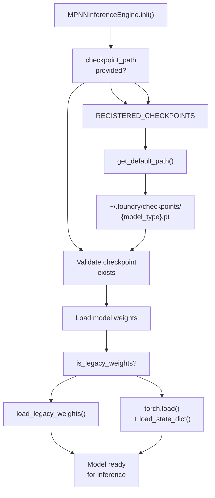
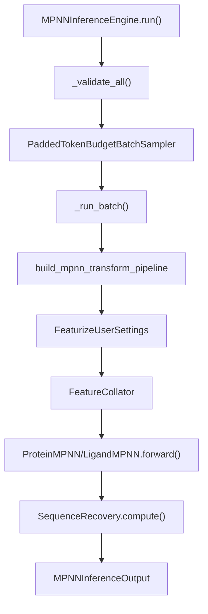

# MPNN Inference

> **Relevant source files**
> * [models/mpnn/src/mpnn/collate/feature_collator.py](https://github.com/RosettaCommons/foundry/blob/cee116dc/models/mpnn/src/mpnn/collate/feature_collator.py)
> * [models/mpnn/src/mpnn/inference.py](https://github.com/RosettaCommons/foundry/blob/cee116dc/models/mpnn/src/mpnn/inference.py)
> * [models/mpnn/src/mpnn/inference_engines/mpnn.py](https://github.com/RosettaCommons/foundry/blob/cee116dc/models/mpnn/src/mpnn/inference_engines/mpnn.py)
> * [models/mpnn/src/mpnn/metrics/nll.py](https://github.com/RosettaCommons/foundry/blob/cee116dc/models/mpnn/src/mpnn/metrics/nll.py)
> * [models/mpnn/src/mpnn/metrics/sequence_recovery.py](https://github.com/RosettaCommons/foundry/blob/cee116dc/models/mpnn/src/mpnn/metrics/sequence_recovery.py)
> * [models/mpnn/src/mpnn/model/layers/graph_embeddings.py](https://github.com/RosettaCommons/foundry/blob/cee116dc/models/mpnn/src/mpnn/model/layers/graph_embeddings.py)
> * [models/mpnn/src/mpnn/model/layers/message_passing.py](https://github.com/RosettaCommons/foundry/blob/cee116dc/models/mpnn/src/mpnn/model/layers/message_passing.py)
> * [models/mpnn/src/mpnn/model/mpnn.py](https://github.com/RosettaCommons/foundry/blob/cee116dc/models/mpnn/src/mpnn/model/mpnn.py)
> * [models/mpnn/src/mpnn/pipelines/mpnn.py](https://github.com/RosettaCommons/foundry/blob/cee116dc/models/mpnn/src/mpnn/pipelines/mpnn.py)
> * [models/mpnn/src/mpnn/samplers/samplers.py](https://github.com/RosettaCommons/foundry/blob/cee116dc/models/mpnn/src/mpnn/samplers/samplers.py)
> * [models/mpnn/src/mpnn/train.py](https://github.com/RosettaCommons/foundry/blob/cee116dc/models/mpnn/src/mpnn/train.py)
> * [models/mpnn/tests/test_integration.py](https://github.com/RosettaCommons/foundry/blob/cee116dc/models/mpnn/tests/test_integration.py)
> * [models/mpnn/tests/test_pipeline.py](https://github.com/RosettaCommons/foundry/blob/cee116dc/models/mpnn/tests/test_pipeline.py)
> * [models/mpnn/tests/test_samplers.py](https://github.com/RosettaCommons/foundry/blob/cee116dc/models/mpnn/tests/test_samplers.py)
> * [models/mpnn/tests/test_utils.py](https://github.com/RosettaCommons/foundry/blob/cee116dc/models/mpnn/tests/test_utils.py)
> * [models/rf3/src/rf3/alignment.py](https://github.com/RosettaCommons/foundry/blob/cee116dc/models/rf3/src/rf3/alignment.py)
> * [src/foundry/utils/ddp.py](https://github.com/RosettaCommons/foundry/blob/cee116dc/src/foundry/utils/ddp.py)

This page describes how to run inference with ProteinMPNN and LigandMPNN models using the `MPNNInferenceEngine`. For configuration options and design parameters, see [MPNN Configuration](/RosettaCommons/foundry/6.2-mpnn-configuration). For an overview of MPNN capabilities, see [MPNN Overview](/RosettaCommons/foundry/6.1-mpnn-overview).

## Overview

MPNN inference executes the sequence design process on input protein structures. The inference pipeline:

1. Loads a trained ProteinMPNN or LigandMPNN model checkpoint. [models/mpnn/src/mpnn/inference_engines/mpnn.py L92](https://github.com/RosettaCommons/foundry/blob/cee116dc/models/mpnn/src/mpnn/inference_engines/mpnn.py#L92-L92)
2. Processes input structures through the MPNN transform pipeline, including `FeaturizeUserSettings`. [models/mpnn/src/mpnn/pipelines/mpnn.py L149-L153](https://github.com/RosettaCommons/foundry/blob/cee116dc/models/mpnn/src/mpnn/pipelines/mpnn.py#L149-L153)
3. Generates designed sequences via autoregressive sampling. [models/mpnn/src/mpnn/model/mpnn.py L152-L172](https://github.com/RosettaCommons/foundry/blob/cee116dc/models/mpnn/src/mpnn/model/mpnn.py#L152-L172)
4. Returns designed structures as `AtomArray` objects with updated residue identities. [models/mpnn/src/mpnn/inference_engines/mpnn.py L468-L488](https://github.com/RosettaCommons/foundry/blob/cee116dc/models/mpnn/src/mpnn/inference_engines/mpnn.py#L468-L488)
5. Optionally writes outputs to CIF and FASTA files. [models/mpnn/src/mpnn/inference_engines/mpnn.py L492-L556](https://github.com/RosettaCommons/foundry/blob/cee116dc/models/mpnn/src/mpnn/inference_engines/mpnn.py#L492-L556)

The inference engine handles batching via the `PaddedTokenBudgetBatchSampler`, device placement, pipeline construction, and output management automatically.

**Sources:** [models/mpnn/src/mpnn/inference_engines/mpnn.py L1-L557](https://github.com/RosettaCommons/foundry/blob/cee116dc/models/mpnn/src/mpnn/inference_engines/mpnn.py#L1-L557)

 [models/mpnn/src/mpnn/samplers/samplers.py L9-L40](https://github.com/RosettaCommons/foundry/blob/cee116dc/models/mpnn/src/mpnn/samplers/samplers.py#L9-L40)

## MPNNInferenceEngine

The `MPNNInferenceEngine` class provides the main interface for MPNN inference.

### Initialization

```javascript
from mpnn.inference_engines.mpnn import MPNNInferenceEngine engine = MPNNInferenceEngine(    model_type="ligand_mpnn",           # or "protein_mpnn"    checkpoint_path="ligandmpnn",       # foundry checkpoint name or path    is_legacy_weights=True,             # required for current checkpoints    out_directory=None,                 # optional output directory    write_fasta=False,                  # write FASTA files    write_structures=False,             # write CIF files    device=None,                        # auto-detect GPU/CPU)
```

### Constructor Parameters

| Parameter | Type | Description |
| --- | --- | --- |
| `model_type` | `str` | Model variant: `"protein_mpnn"` or `"ligand_mpnn"` |
| `checkpoint_path` | `str` | Path to checkpoint or foundry model name (`"proteinmpnn"`, `"ligandmpnn"`) |
| `is_legacy_weights` | `bool` | Whether checkpoint uses legacy weight format (currently required) |
| `out_directory` | `str \| None` | Directory for output files; required if writing outputs |
| `write_fasta` | `bool` | Write sequences to FASTA files (one per input structure) |
| `write_structures` | `bool` | Write designed structures to CIF files (one per design) |
| `device` | `str \| torch.device \| None` | Device placement; auto-detects GPU if available |

The engine validates configuration on initialization and loads the model checkpoint. [models/mpnn/src/mpnn/inference_engines/mpnn.py L139-L145](https://github.com/RosettaCommons/foundry/blob/cee116dc/models/mpnn/src/mpnn/inference_engines/mpnn.py#L139-L145)

 Checkpoint paths can be resolved via the `REGISTERED_CHECKPOINTS` registry. [models/mpnn/src/mpnn/inference_engines/mpnn.py L60-L68](https://github.com/RosettaCommons/foundry/blob/cee116dc/models/mpnn/src/mpnn/inference_engines/mpnn.py#L60-L68)

**Sources:** [models/mpnn/src/mpnn/inference_engines/mpnn.py L37-L89](https://github.com/RosettaCommons/foundry/blob/cee116dc/models/mpnn/src/mpnn/inference_engines/mpnn.py#L37-L89)

 [models/mpnn/src/mpnn/utils/inference.py L35-L46](https://github.com/RosettaCommons/foundry/blob/cee116dc/models/mpnn/src/mpnn/utils/inference.py#L35-L46)

### Checkpoint Resolution Flow



**Sources:** [models/mpnn/src/mpnn/inference_engines/mpnn.py L59-L68](https://github.com/RosettaCommons/foundry/blob/cee116dc/models/mpnn/src/mpnn/inference_engines/mpnn.py#L59-L68)

 [models/mpnn/src/mpnn/inference_engines/mpnn.py L150-L182](https://github.com/RosettaCommons/foundry/blob/cee116dc/models/mpnn/src/mpnn/inference_engines/mpnn.py#L150-L182)

## FeaturizeUserSettings Transform

A critical part of the MPNN pipeline is the `FeaturizeUserSettings` transform. This transform bridges user-provided settings (like masks, biases, and temperatures) from the input structure annotations to the model's expected feature tensors.

### Implementation Details

The transform handles:

1. **Mask Generation**: Converts user-specified designed/fixed residue strings into boolean masks. [models/mpnn/tests/test_pipeline.py L114-L116](https://github.com/RosettaCommons/foundry/blob/cee116dc/models/mpnn/tests/test_pipeline.py#L114-L116)
2. **Temperature Scheduling**: Maps scalar temperatures or per-residue temperatures to token-wise tensors. [models/mpnn/tests/test_pipeline.py L117-L119](https://github.com/RosettaCommons/foundry/blob/cee116dc/models/mpnn/tests/test_pipeline.py#L117-L119)
3. **Bias Injection**: Aggregates residue-level amino acid biases and pair-wise biases into the feature set. [models/mpnn/tests/test_pipeline.py L127-L147](https://github.com/RosettaCommons/foundry/blob/cee116dc/models/mpnn/tests/test_pipeline.py#L127-L147)
4. **Noise Application**: During training, it manages the addition of Gaussian noise to atomic coordinates. [models/mpnn/tests/test_pipeline.py L161](https://github.com/RosettaCommons/foundry/blob/cee116dc/models/mpnn/tests/test_pipeline.py#L161-L161)

**Sources:** [models/mpnn/src/mpnn/pipelines/mpnn.py L149-L153](https://github.com/RosettaCommons/foundry/blob/cee116dc/models/mpnn/src/mpnn/pipelines/mpnn.py#L149-L153)

 [models/mpnn/tests/test_pipeline.py L89-L153](https://github.com/RosettaCommons/foundry/blob/cee116dc/models/mpnn/tests/test_pipeline.py#L89-L153)

## Sequence Sampling and Output

MPNN uses an autoregressive decoding process to sample sequences based on the input structure and constraints.

### MPNNInferenceOutput Structure

The inference engine returns `MPNNInferenceOutput` objects containing the designed structure and metadata. [models/mpnn/src/mpnn/inference_engines/mpnn.py L468-L488](https://github.com/RosettaCommons/foundry/blob/cee116dc/models/mpnn/src/mpnn/inference_engines/mpnn.py#L468-L488)

| Key | Type | Description |
| --- | --- | --- |
| `designed_sequence` | `str` | The resulting one-letter amino acid sequence. [models/mpnn/src/mpnn/utils/inference.py L1086](https://github.com/RosettaCommons/foundry/blob/cee116dc/models/mpnn/src/mpnn/utils/inference.py#L1086-L1086) |
| `sequence_recovery` | `float` | Fraction of native residues recovered. [models/mpnn/src/mpnn/metrics/sequence_recovery.py L15-L18](https://github.com/RosettaCommons/foundry/blob/cee116dc/models/mpnn/src/mpnn/metrics/sequence_recovery.py#L15-L18) |
| `log_probs` | `torch.Tensor` | Log probabilities of the sampled sequence. [models/mpnn/src/mpnn/metrics/nll.py L146-L153](https://github.com/RosettaCommons/foundry/blob/cee116dc/models/mpnn/src/mpnn/metrics/nll.py#L146-L153) |

### Inference Execution Flow



**Sources:** [models/mpnn/src/mpnn/inference_engines/mpnn.py L204-L490](https://github.com/RosettaCommons/foundry/blob/cee116dc/models/mpnn/src/mpnn/inference_engines/mpnn.py#L204-L490)

 [models/mpnn/src/mpnn/samplers/samplers.py L9-L40](https://github.com/RosettaCommons/foundry/blob/cee116dc/models/mpnn/src/mpnn/samplers/samplers.py#L9-L40)

 [models/mpnn/src/mpnn/model/mpnn.py L19-L151](https://github.com/RosettaCommons/foundry/blob/cee116dc/models/mpnn/src/mpnn/model/mpnn.py#L19-L151)

## Writing Outputs

The engine supports writing designed structures and sequences to disk.

### CIF and FASTA Generation

* **CIF**: Structures are updated with the new sequence. For residues where the identity changed, side chains are removed to avoid clashes, leaving only the backbone (N, CA, C, O). [models/mpnn/src/mpnn/inference_engines/mpnn.py L388-L450](https://github.com/RosettaCommons/foundry/blob/cee116dc/models/mpnn/src/mpnn/inference_engines/mpnn.py#L388-L450)
* **FASTA**: Sequences are written with headers containing recovery metrics and sampling parameters. [models/mpnn/src/mpnn/inference_engines/mpnn.py L532-L556](https://github.com/RosettaCommons/foundry/blob/cee116dc/models/mpnn/src/mpnn/inference_engines/mpnn.py#L532-L556)

**Sources:** [models/mpnn/src/mpnn/inference_engines/mpnn.py L492-L556](https://github.com/RosettaCommons/foundry/blob/cee116dc/models/mpnn/src/mpnn/inference_engines/mpnn.py#L492-L556)

 [models/mpnn/src/mpnn/utils/inference.py L1135-L1165](https://github.com/RosettaCommons/foundry/blob/cee116dc/models/mpnn/src/mpnn/utils/inference.py#L1135-L1165)

## Distributed Inference

For large-scale design tasks, the engine integrates with Foundry's DDP utilities. The `RankedLogger` ensures that logging is clean across multiple GPUs, and the `PaddedTokenBudgetBatchSampler` optimizes throughput by grouping structures of similar sizes to minimize padding overhead. [src/foundry/utils/ddp.py L58-L112](https://github.com/RosettaCommons/foundry/blob/cee116dc/src/foundry/utils/ddp.py#L58-L112)

 [models/mpnn/src/mpnn/samplers/samplers.py L97-L129](https://github.com/RosettaCommons/foundry/blob/cee116dc/models/mpnn/src/mpnn/samplers/samplers.py#L97-L129)

**Sources:** [src/foundry/utils/ddp.py L1-L112](https://github.com/RosettaCommons/foundry/blob/cee116dc/src/foundry/utils/ddp.py#L1-L112)

 [models/mpnn/src/mpnn/samplers/samplers.py L1-L168](https://github.com/RosettaCommons/foundry/blob/cee116dc/models/mpnn/src/mpnn/samplers/samplers.py#L1-L168)