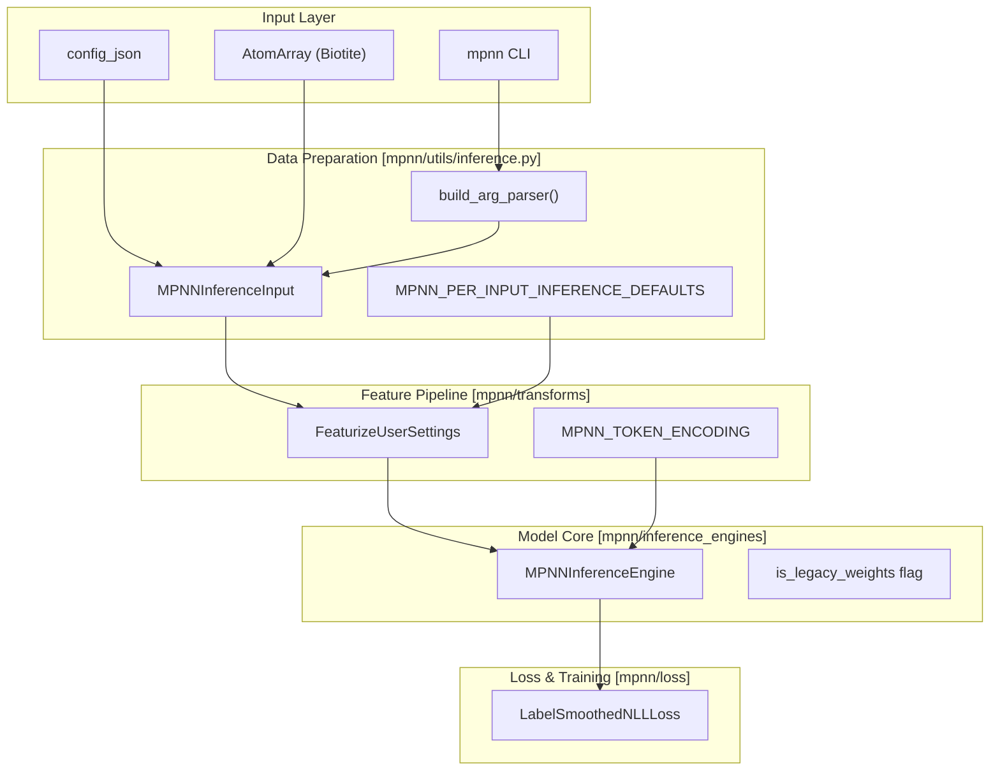
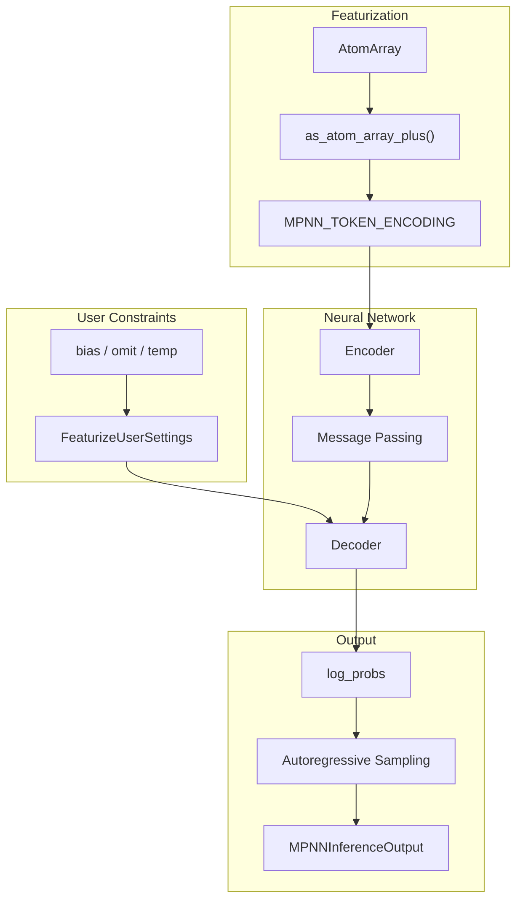

# MPNN Overview

> **Relevant source files**
> * [docs/source/installation_faq.md](https://github.com/RosettaCommons/foundry/blob/cee116dc/docs/source/installation_faq.md?plain=1)
> * [models/mpnn/README.md](https://github.com/RosettaCommons/foundry/blob/cee116dc/models/mpnn/README.md?plain=1)
> * [models/mpnn/docs/index.md](https://github.com/RosettaCommons/foundry/blob/cee116dc/models/mpnn/docs/index.md?plain=1)
> * [models/mpnn/src/mpnn/__init__.py](https://github.com/RosettaCommons/foundry/blob/cee116dc/models/mpnn/src/mpnn/__init__.py)
> * [models/mpnn/src/mpnn/loss/nll_loss.py](https://github.com/RosettaCommons/foundry/blob/cee116dc/models/mpnn/src/mpnn/loss/nll_loss.py)
> * [models/mpnn/src/mpnn/utils/inference.py](https://github.com/RosettaCommons/foundry/blob/cee116dc/models/mpnn/src/mpnn/utils/inference.py)

## Purpose and Scope

This document introduces ProteinMPNN and LigandMPNN (collectively referred to as MPNN), which provide fixed-backbone sequence design capabilities within the Foundry framework. MPNN models take protein backbone structures as input and generate amino acid sequences that are predicted to fold into those structures. This page covers the model variants, core capabilities, and system architecture.

MPNN in Foundry is a re-implementation of the original models within the `modelforge`/`atomworks` framework, supporting both legacy weights and newly trained checkpoints [models/mpnn/README.md L9-L16](https://github.com/RosettaCommons/foundry/blob/cee116dc/models/mpnn/README.md?plain=1#L9-L16)

**Sources:** [models/mpnn/README.md L1-L16](https://github.com/RosettaCommons/foundry/blob/cee116dc/models/mpnn/README.md?plain=1#L1-L16)

## Model Variants

MPNN is available in variants designed for different chemical contexts:

| Model Type | Purpose | Key Features |
| --- | --- | --- |
| **ProteinMPNN** | Protein-only sequence design | Designs sequences for protein backbones; ignores non-protein context [models/mpnn/README.md L9-L12](https://github.com/RosettaCommons/foundry/blob/cee116dc/models/mpnn/README.md?plain=1#L9-L12) |
| **LigandMPNN** | Ligand-aware sequence design | Incorporates atomic context from small molecules, ions, and nucleic acids [models/mpnn/README.md L13-L14](https://github.com/RosettaCommons/foundry/blob/cee116dc/models/mpnn/README.md?plain=1#L13-L14) |
| **SolubleMPNN** | Soluble protein design | Specifically trained for designing soluble analogues of membrane proteins [models/mpnn/README.md L14-L15](https://github.com/RosettaCommons/foundry/blob/cee116dc/models/mpnn/README.md?plain=1#L14-L15) |

The model type is specified via the `model_type` parameter in the inference configuration [models/mpnn/src/mpnn/utils/inference.py L138-L144](https://github.com/RosettaCommons/foundry/blob/cee116dc/models/mpnn/src/mpnn/utils/inference.py#L138-L144)

**Sources:** [models/mpnn/README.md L9-L15](https://github.com/RosettaCommons/foundry/blob/cee116dc/models/mpnn/README.md?plain=1#L9-L15)

 [models/mpnn/src/mpnn/utils/inference.py L138-L144](https://github.com/RosettaCommons/foundry/blob/cee116dc/models/mpnn/src/mpnn/utils/inference.py#L138-L144)

## Core Capabilities

### Fixed-Backbone Design

MPNN performs inverse folding, sampling amino acid sequences for a fixed set of backbone coordinates [models/mpnn/README.md L9-L10](https://github.com/RosettaCommons/foundry/blob/cee116dc/models/mpnn/README.md?plain=1#L9-L10)

### Selective Design Control

Users define the design scope through several mechanisms:

* **Masking**: `designed_residues` or `fixed_residues` lists [models/mpnn/src/mpnn/utils/inference.py L72-L73](https://github.com/RosettaCommons/foundry/blob/cee116dc/models/mpnn/src/mpnn/utils/inference.py#L72-L73)
* **Chain Control**: `designed_chains` or `fixed_chains` [models/mpnn/src/mpnn/utils/inference.py L74-L75](https://github.com/RosettaCommons/foundry/blob/cee116dc/models/mpnn/src/mpnn/utils/inference.py#L74-L75)
* **Omission**: `omit` lists (e.g., "UNK") or `omit_per_residue` [models/mpnn/src/mpnn/utils/inference.py L79-L80](https://github.com/RosettaCommons/foundry/blob/cee116dc/models/mpnn/src/mpnn/utils/inference.py#L79-L80)

### Sampling Modifiers

* **Temperature**: Global `temperature` or `temperature_per_residue` [models/mpnn/src/mpnn/utils/inference.py L84-L85](https://github.com/RosettaCommons/foundry/blob/cee116dc/models/mpnn/src/mpnn/utils/inference.py#L84-L85)
* **Biasing**: `bias_per_residue` and `pair_bias_per_residue_pair` to influence amino acid selection [models/mpnn/src/mpnn/utils/inference.py L77-L82](https://github.com/RosettaCommons/foundry/blob/cee116dc/models/mpnn/src/mpnn/utils/inference.py#L77-L82)

### Symmetry and Oligomers

* **Symmetry Groups**: `symmetry_residues` and `symmetry_residues_weights` define equivalent positions [models/mpnn/src/mpnn/utils/inference.py L87-L88](https://github.com/RosettaCommons/foundry/blob/cee116dc/models/mpnn/src/mpnn/utils/inference.py#L87-L88)
* **Homo-oligomers**: `homo_oligomer_chains` enforces identical sequences across chains [models/mpnn/src/mpnn/utils/inference.py L89](https://github.com/RosettaCommons/foundry/blob/cee116dc/models/mpnn/src/mpnn/utils/inference.py#L89-L89)

**Sources:** [models/mpnn/src/mpnn/utils/inference.py L70-L90](https://github.com/RosettaCommons/foundry/blob/cee116dc/models/mpnn/src/mpnn/utils/inference.py#L70-L90)

## System Architecture

The following diagram maps the logical inference components to specific code entities within the `mpnn` module.

**Diagram: MPNN Code Entity Map**

**Sources:** [models/mpnn/src/mpnn/utils/inference.py L35-L120](https://github.com/RosettaCommons/foundry/blob/cee116dc/models/mpnn/src/mpnn/utils/inference.py#L35-L120)

 [models/mpnn/src/mpnn/loss/nll_loss.py L5-L22](https://github.com/RosettaCommons/foundry/blob/cee116dc/models/mpnn/src/mpnn/loss/nll_loss.py#L5-L22)

 [models/mpnn/src/mpnn/utils/inference.py L677-L680](https://github.com/RosettaCommons/foundry/blob/cee116dc/models/mpnn/src/mpnn/utils/inference.py#L677-L680)

## Data Flow Through MPNN

The data flow highlights how raw structural data is transformed into designable features and finally into sampled sequences.

**Diagram: MPNN Data Flow Pipeline**

1. **Featurization**: Structural data is converted into `AtomArrayPlus` and tokenized using `MPNN_TOKEN_ENCODING` [models/mpnn/src/mpnn/utils/inference.py L24-L31](https://github.com/RosettaCommons/foundry/blob/cee116dc/models/mpnn/src/mpnn/utils/inference.py#L24-L31)
2. **Constraint Processing**: `FeaturizeUserSettings` maps CLI/JSON settings into tensors for masking and biasing [models/mpnn/src/mpnn/utils/inference.py L63-L85](https://github.com/RosettaCommons/foundry/blob/cee116dc/models/mpnn/src/mpnn/utils/inference.py#L63-L85)
3. **Inference**: The model generates `log_probs` which are sampled autoregressively [models/mpnn/src/mpnn/loss/nll_loss.py L38-L40](https://github.com/RosettaCommons/foundry/blob/cee116dc/models/mpnn/src/mpnn/loss/nll_loss.py#L38-L40)

**Sources:** [models/mpnn/src/mpnn/utils/inference.py L24-L90](https://github.com/RosettaCommons/foundry/blob/cee116dc/models/mpnn/src/mpnn/utils/inference.py#L24-L90)

 [models/mpnn/src/mpnn/loss/nll_loss.py L38-L40](https://github.com/RosettaCommons/foundry/blob/cee116dc/models/mpnn/src/mpnn/loss/nll_loss.py#L38-L40)

## Training and Loss

MPNN uses a specialized loss function for sequence design:

### LabelSmoothedNLLLoss

The model is trained using a label-smoothed negative log-likelihood loss [models/mpnn/src/mpnn/loss/nll_loss.py L5-L15](https://github.com/RosettaCommons/foundry/blob/cee116dc/models/mpnn/src/mpnn/loss/nll_loss.py#L5-L15)

* **Label Smoothing**: Controlled by `label_smoothing_eps` (default 0.1), it distributes probability mass away from the ground truth to prevent over-fitting [models/mpnn/src/mpnn/loss/nll_loss.py L91-L95](https://github.com/RosettaCommons/foundry/blob/cee116dc/models/mpnn/src/mpnn/loss/nll_loss.py#L91-L95)
* **Normalization**: Uses a `normalization_constant` (default 6000.0) instead of simple batch averaging to stabilize gradients across varying protein lengths [models/mpnn/src/mpnn/loss/nll_loss.py L112-L114](https://github.com/RosettaCommons/foundry/blob/cee116dc/models/mpnn/src/mpnn/loss/nll_loss.py#L112-L114)

**Sources:** [models/mpnn/src/mpnn/loss/nll_loss.py L5-L123](https://github.com/RosettaCommons/foundry/blob/cee116dc/models/mpnn/src/mpnn/loss/nll_loss.py#L5-L123)

## Key Implementation Details

### Weight Loading

Foundry supports legacy weights from the original ProteinMPNN/LigandMPNN repositories. When using these, the `is_legacy_weights` flag must be set to `True` to ensure correct parameter mapping [models/mpnn/README.md L121-L128](https://github.com/RosettaCommons/foundry/blob/cee116dc/models/mpnn/README.md?plain=1#L121-L128)

### Known Limitations

* **Annotation Shapes**: `mpnn_bias` and `mpnn_pair_bias` annotations cannot currently be saved directly to CIF files due to shape constraints; they must be provided via input dictionaries [models/mpnn/README.md L139-L141](https://github.com/RosettaCommons/foundry/blob/cee116dc/models/mpnn/README.md?plain=1#L139-L141)
* **User Annotations**: There is a known issue with loading MPNN user annotations (e.g., temperature) directly from CIF/AtomArray annotations; command-line or `input_dict` specifications are the recommended workarounds [models/mpnn/README.md L121-L122](https://github.com/RosettaCommons/foundry/blob/cee116dc/models/mpnn/README.md?plain=1#L121-L122)

**Sources:** [models/mpnn/README.md L121-L141](https://github.com/RosettaCommons/foundry/blob/cee116dc/models/mpnn/README.md?plain=1#L121-L141)