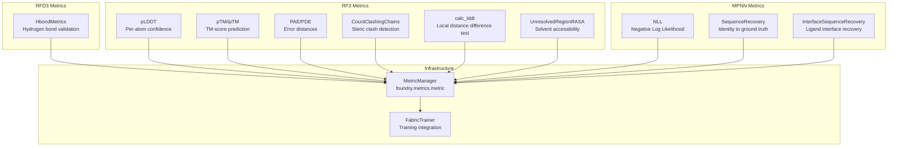
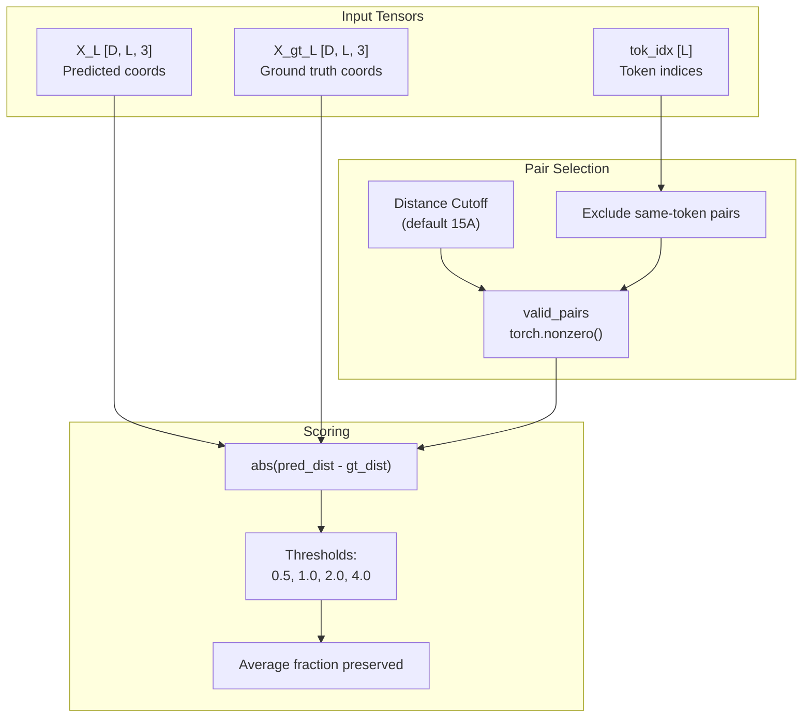
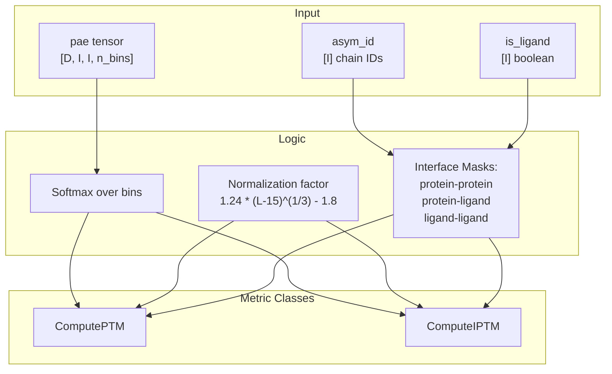
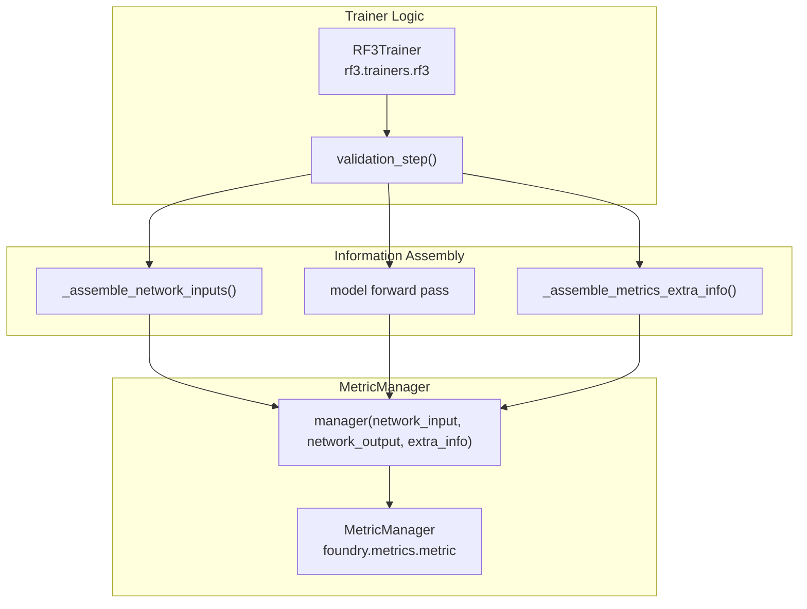

# Metrics and Evaluation

> **Relevant source files**
> * [models/mpnn/src/mpnn/collate/feature_collator.py](https://github.com/RosettaCommons/foundry/blob/cee116dc/models/mpnn/src/mpnn/collate/feature_collator.py)
> * [models/mpnn/src/mpnn/inference.py](https://github.com/RosettaCommons/foundry/blob/cee116dc/models/mpnn/src/mpnn/inference.py)
> * [models/mpnn/src/mpnn/metrics/nll.py](https://github.com/RosettaCommons/foundry/blob/cee116dc/models/mpnn/src/mpnn/metrics/nll.py)
> * [models/mpnn/src/mpnn/metrics/sequence_recovery.py](https://github.com/RosettaCommons/foundry/blob/cee116dc/models/mpnn/src/mpnn/metrics/sequence_recovery.py)
> * [models/mpnn/src/mpnn/model/layers/graph_embeddings.py](https://github.com/RosettaCommons/foundry/blob/cee116dc/models/mpnn/src/mpnn/model/layers/graph_embeddings.py)
> * [models/mpnn/src/mpnn/model/layers/message_passing.py](https://github.com/RosettaCommons/foundry/blob/cee116dc/models/mpnn/src/mpnn/model/layers/message_passing.py)
> * [models/mpnn/src/mpnn/pipelines/mpnn.py](https://github.com/RosettaCommons/foundry/blob/cee116dc/models/mpnn/src/mpnn/pipelines/mpnn.py)
> * [models/mpnn/src/mpnn/samplers/samplers.py](https://github.com/RosettaCommons/foundry/blob/cee116dc/models/mpnn/src/mpnn/samplers/samplers.py)
> * [models/mpnn/src/mpnn/train.py](https://github.com/RosettaCommons/foundry/blob/cee116dc/models/mpnn/src/mpnn/train.py)
> * [models/rf3/src/rf3/metrics/clashing_chains.py](https://github.com/RosettaCommons/foundry/blob/cee116dc/models/rf3/src/rf3/metrics/clashing_chains.py)
> * [models/rf3/src/rf3/metrics/distogram.py](https://github.com/RosettaCommons/foundry/blob/cee116dc/models/rf3/src/rf3/metrics/distogram.py)
> * [models/rf3/src/rf3/metrics/lddt.py](https://github.com/RosettaCommons/foundry/blob/cee116dc/models/rf3/src/rf3/metrics/lddt.py)
> * [models/rf3/src/rf3/metrics/metadata.py](https://github.com/RosettaCommons/foundry/blob/cee116dc/models/rf3/src/rf3/metrics/metadata.py)
> * [models/rf3/src/rf3/metrics/predicted_error.py](https://github.com/RosettaCommons/foundry/blob/cee116dc/models/rf3/src/rf3/metrics/predicted_error.py)
> * [models/rf3/src/rf3/metrics/rasa.py](https://github.com/RosettaCommons/foundry/blob/cee116dc/models/rf3/src/rf3/metrics/rasa.py)
> * [models/rf3/src/rf3/trainers/rf3.py](https://github.com/RosettaCommons/foundry/blob/cee116dc/models/rf3/src/rf3/trainers/rf3.py)
> * [models/rf3/src/rf3/utils/predict_and_score.py](https://github.com/RosettaCommons/foundry/blob/cee116dc/models/rf3/src/rf3/utils/predict_and_score.py)
> * [models/rfd3/src/rfd3/metrics/hbonds_hbplus_metrics.py](https://github.com/RosettaCommons/foundry/blob/cee116dc/models/rfd3/src/rfd3/metrics/hbonds_hbplus_metrics.py)

The Foundry system provides model-specific metrics for assessing prediction quality, validating designs, and ranking outputs. Each model (RFD3, RF3, MPNN) implements metrics tailored to its task, unified through the `MetricManager` infrastructure for training and inference.

---

## Metrics Overview



| Model | Metrics | Purpose |
| --- | --- | --- |
| **RFD3** | Hydrogen bonds | Validate conditioning constraints (donors/acceptors) |
| **RF3** | pLDDT, pTM, ipTM, PAE, PDE, LDDT, RASA, clashing chains | Confidence scoring, structural accuracy, and ranking |
| **MPNN** | NLL, Perplexity, Sequence recovery, interface recovery | Sequence design quality and likelihood assessment |

**Sources:** [models/rfd3/src/rfd3/metrics/hbonds_hbplus_metrics.py L109-L115](https://github.com/RosettaCommons/foundry/blob/cee116dc/models/rfd3/src/rfd3/metrics/hbonds_hbplus_metrics.py#L109-L115)

 [models/rf3/src/rf3/metrics/lddt.py L18-L40](https://github.com/RosettaCommons/foundry/blob/cee116dc/models/rf3/src/rf3/metrics/lddt.py#L18-L40)

 [models/rf3/src/rf3/metrics/predicted_error.py L9-L40](https://github.com/RosettaCommons/foundry/blob/cee116dc/models/rf3/src/rf3/metrics/predicted_error.py#L9-L40)

 [models/mpnn/src/mpnn/metrics/nll.py L12-L21](https://github.com/RosettaCommons/foundry/blob/cee116dc/models/mpnn/src/mpnn/metrics/nll.py#L12-L21)

---

## RF3 Structural Accuracy and Confidence

RF3 produces metrics for both ground-truth comparison (LDDT) and internal confidence scoring (pLDDT, pTM).

### LDDT: Local Distance Difference Test

The `calc_lddt` function calculates structural accuracy by comparing pairwise distances between predicted and ground-truth structures. It excludes same-token (intra-residue) pairs and uses standard thresholds (0.5Å, 1.0Å, 2.0Å, 4.0Å).

**Title: LDDT Calculation Flow**



**Implementation Details:**

* **Feature Extraction:** `extract_lddt_features_from_atom_arrays` handles the conversion from Biotite `AtomArray` to tensors, ensuring coordinate masks are created from occupancy [models/rf3/src/rf3/metrics/lddt.py L116-L170](https://github.com/RosettaCommons/foundry/blob/cee116dc/models/rf3/src/rf3/metrics/lddt.py#L116-L170)
* **Symmetry Resolution:** During training and validation, structural metrics like LDDT are computed after symmetry resolution using `SubunitSymmetryResolution` and `ResidueSymmetryResolution` [models/rf3/src/rf3/trainers/rf3.py L85-L88](https://github.com/RosettaCommons/foundry/blob/cee116dc/models/rf3/src/rf3/trainers/rf3.py#L85-L88)

**Sources:** [models/rf3/src/rf3/metrics/lddt.py L18-L113](https://github.com/RosettaCommons/foundry/blob/cee116dc/models/rf3/src/rf3/metrics/lddt.py#L18-L113)

 [models/rf3/src/rf3/metrics/lddt.py L116-L170](https://github.com/RosettaCommons/foundry/blob/cee116dc/models/rf3/src/rf3/metrics/lddt.py#L116-L170)

### pTM and ipTM: TM-Score Prediction

**Title: TM-Score Metrics and Interface Masks**



**Metric Definitions:**

* **ComputePTM:** Estimates structural similarity for the whole complex [models/rf3/src/rf3/metrics/predicted_error.py L43-L67](https://github.com/RosettaCommons/foundry/blob/cee116dc/models/rf3/src/rf3/metrics/predicted_error.py#L43-L67)
* **ComputeIPTM:** Specifically measures interface quality by masking for inter-chain pairs (`asym_id[i] != asym_id[j]`). It further categorizes interfaces into protein-protein, protein-ligand, and ligand-ligand [models/rf3/src/rf3/metrics/predicted_error.py L70-L134](https://github.com/RosettaCommons/foundry/blob/cee116dc/models/rf3/src/rf3/metrics/predicted_error.py#L70-L134)

**Sources:** [models/rf3/src/rf3/metrics/predicted_error.py L9-L40](https://github.com/RosettaCommons/foundry/blob/cee116dc/models/rf3/src/rf3/metrics/predicted_error.py#L9-L40)

 [models/rf3/src/rf3/metrics/predicted_error.py L70-L134](https://github.com/RosettaCommons/foundry/blob/cee116dc/models/rf3/src/rf3/metrics/predicted_error.py#L70-L134)

---

## RFD3 Hydrogen Bond Statistics

RFD3 validates hydrogen bond conditioning using the HBPLUS tool. The system compares specified donors/acceptors in the input against those formed in the generated structure.

**Key Functions:**

* `simplified_processing_atom_array`: Prepares generated structures by inferring residue types from atom names, essential for `calculate_hbonds` to identify potential donors/acceptors [models/rfd3/src/rfd3/metrics/hbonds_hbplus_metrics.py L19-L106](https://github.com/RosettaCommons/foundry/blob/cee116dc/models/rfd3/src/rfd3/metrics/hbonds_hbplus_metrics.py#L19-L106)
* `calculate_hbond_stats`: Aggregates percentages of "correct" donors and acceptors (those that appear in the output structure at the designed positions) [models/rfd3/src/rfd3/metrics/hbonds_hbplus_metrics.py L109-L183](https://github.com/RosettaCommons/foundry/blob/cee116dc/models/rfd3/src/rfd3/metrics/hbonds_hbplus_metrics.py#L109-L183)

**Sources:** [models/rfd3/src/rfd3/metrics/hbonds_hbplus_metrics.py L19-L106](https://github.com/RosettaCommons/foundry/blob/cee116dc/models/rfd3/src/rfd3/metrics/hbonds_hbplus_metrics.py#L19-L106)

 [models/rfd3/src/rfd3/metrics/hbonds_hbplus_metrics.py L109-L183](https://github.com/RosettaCommons/foundry/blob/cee116dc/models/rfd3/src/rfd3/metrics/hbonds_hbplus_metrics.py#L109-L183)

---

## MPNN Likelihood and Recovery

MPNN models use Negative Log Likelihood (NLL) and Perplexity to assess how well the model "expects" a specific sequence given a structure.

### NLL and Perplexity

The `NLL` metric class computes the average negative log probability at the ground-truth token indices.

```markdown
# From mpnn/metrics/nll.py:113-125# S_onehot [B, L, vocab_size]S_onehot = torch.nn.functional.one_hot(S, num_classes=vocab_size).float() # nll_per_residue [B, L]nll_per_residue = -torch.sum(S_onehot * log_probs, dim=-1) * per_residue_mask # nll_per_example [B]nll_per_example = nll_per_residue.sum(dim=-1) / total_valid_per_example # perplexity_per_example [B]perplexity_per_example = torch.exp(nll_per_example)
```

**Sub-interface Masking:**
LigandMPNN often uses specialized masks to compute NLL specifically at the protein-ligand interface [models/mpnn/src/mpnn/metrics/nll.py L4-L7](https://github.com/RosettaCommons/foundry/blob/cee116dc/models/mpnn/src/mpnn/metrics/nll.py#L4-L7)

**Sources:** [models/mpnn/src/mpnn/metrics/nll.py L12-L42](https://github.com/RosettaCommons/foundry/blob/cee116dc/models/mpnn/src/mpnn/metrics/nll.py#L12-L42)

 [models/mpnn/src/mpnn/metrics/nll.py L76-L144](https://github.com/RosettaCommons/foundry/blob/cee116dc/models/mpnn/src/mpnn/metrics/nll.py#L76-L144)

---

## Advanced Evaluation Metrics

### Clashing Chains

The `CountClashingChains` metric identifies steric overlaps between polymer chains. A clash is defined by a distance `< 1.1Å`. A pair of chains is considered clashing if they have `> 100` clashing atom pairs or if `> 50%` of the atoms in the larger chain are clashing [models/rf3/src/rf3/metrics/clashing_chains.py L10-L68](https://github.com/RosettaCommons/foundry/blob/cee116dc/models/rf3/src/rf3/metrics/clashing_chains.py#L10-L68)

### RASA (Relative Solvent Accessible Surface Area)

`UnresolvedRegionRASA` computes the RASA for regions that were unresolved in the ground truth (occupancy 0.0). This is used to evaluate if the model is correctly placing disordered loops on the surface vs. the core [models/rf3/src/rf3/metrics/rasa.py L9-L108](https://github.com/RosettaCommons/foundry/blob/cee116dc/models/rf3/src/rf3/metrics/rasa.py#L9-L108)

### Distogram Comparison

`DistogramComparisons` and `DistogramLoss` evaluate the 2D representation within the model's trunk. The `ComparisonConfig` class allows subsetting these comparisons to specific relationships like "inter-chain" vs "intra-chain" or "atomized" vs "non-atomized" tokens [models/rf3/src/rf3/metrics/distogram.py L19-L81](https://github.com/RosettaCommons/foundry/blob/cee116dc/models/rf3/src/rf3/metrics/distogram.py#L19-L81)

 [models/rf3/src/rf3/metrics/distogram.py L173-L188](https://github.com/RosettaCommons/foundry/blob/cee116dc/models/rf3/src/rf3/metrics/distogram.py#L173-L188)

**Sources:** [models/rf3/src/rf3/metrics/clashing_chains.py L30-L62](https://github.com/RosettaCommons/foundry/blob/cee116dc/models/rf3/src/rf3/metrics/clashing_chains.py#L30-L62)

 [models/rf3/src/rf3/metrics/rasa.py L56-L81](https://github.com/RosettaCommons/foundry/blob/cee116dc/models/rf3/src/rf3/metrics/rasa.py#L56-L81)

 [models/rf3/src/rf3/metrics/distogram.py L47-L80](https://github.com/RosettaCommons/foundry/blob/cee116dc/models/rf3/src/rf3/metrics/distogram.py#L47-L80)

---

## Metric Integration and Data Flow

Metrics are typically managed by the `MetricManager` and executed within the `FabricTrainer`.

**Title: Metric Execution Flow**



**Key Code Paths:**

* **Initialization:** `MetricManager.instantiate_from_hydra` is used in the `RF3Trainer` constructor to build metrics from config [models/rf3/src/rf3/trainers/rf3.py L72-L80](https://github.com/RosettaCommons/foundry/blob/cee116dc/models/rf3/src/rf3/trainers/rf3.py#L72-L80)
* **Prediction & Scoring Utility:** `predict_and_score_with_rf3` provides a high-level API to run RF3 on a list of `AtomArray` objects and return both structures and computed metrics [models/rf3/src/rf3/utils/predict_and_score.py L42-L165](https://github.com/RosettaCommons/foundry/blob/cee116dc/models/rf3/src/rf3/utils/predict_and_score.py#L42-L165)

**Sources:** [models/rf3/src/rf3/trainers/rf3.py L72-L80](https://github.com/RosettaCommons/foundry/blob/cee116dc/models/rf3/src/rf3/trainers/rf3.py#L72-L80)

 [models/rf3/src/rf3/utils/predict_and_score.py L111-L141](https://github.com/RosettaCommons/foundry/blob/cee116dc/models/rf3/src/rf3/utils/predict_and_score.py#L111-L141)