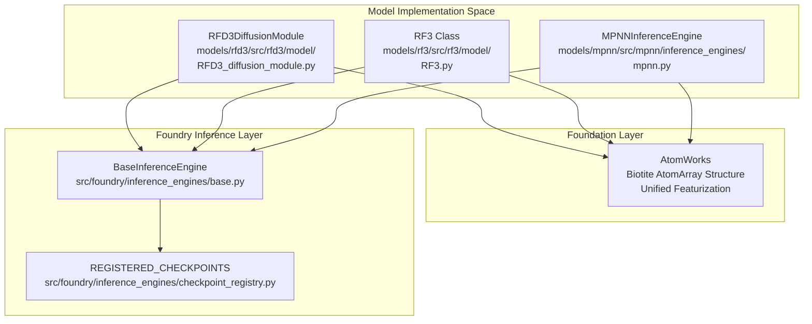
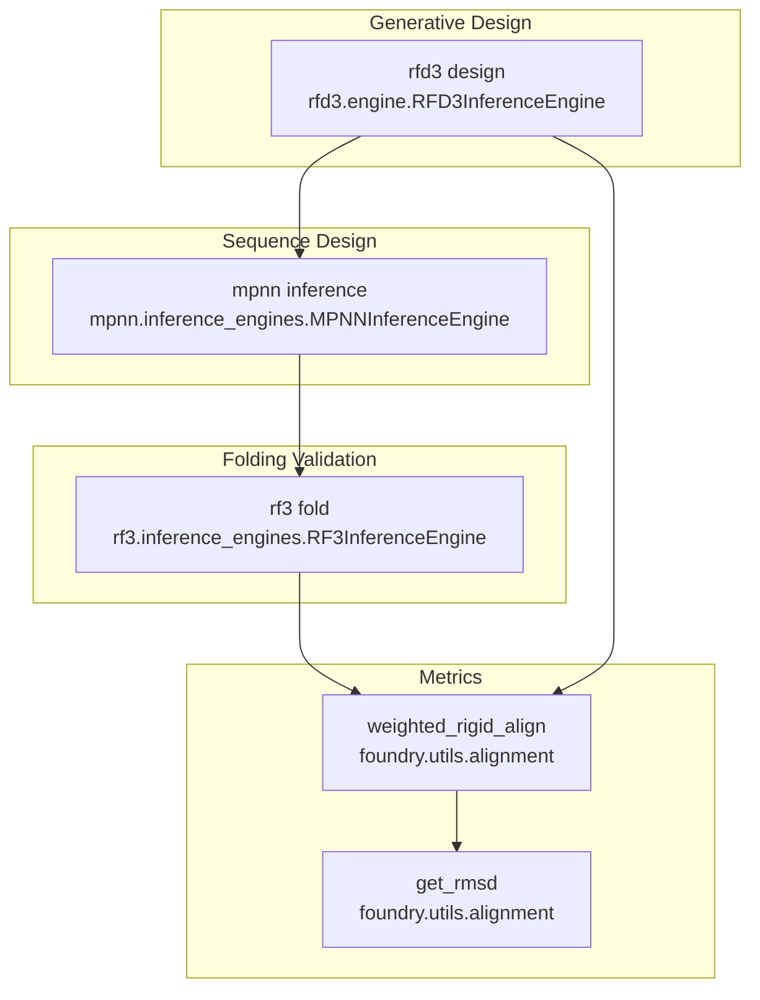

# Model Architecture

> **Relevant source files**
> * [.env](https://github.com/RosettaCommons/foundry/blob/cee116dc/.env)
> * [README.md](https://github.com/RosettaCommons/foundry/blob/cee116dc/README.md?plain=1)
> * [models/rf3/src/rf3/model/RF3.py](https://github.com/RosettaCommons/foundry/blob/cee116dc/models/rf3/src/rf3/model/RF3.py)
> * [models/rf3/src/rf3/model/layers/af3_diffusion_transformer.py](https://github.com/RosettaCommons/foundry/blob/cee116dc/models/rf3/src/rf3/model/layers/af3_diffusion_transformer.py)
> * [models/rf3/src/rf3/model/layers/attention.py](https://github.com/RosettaCommons/foundry/blob/cee116dc/models/rf3/src/rf3/model/layers/attention.py)
> * [models/rf3/src/rf3/model/layers/pairformer_layers.py](https://github.com/RosettaCommons/foundry/blob/cee116dc/models/rf3/src/rf3/model/layers/pairformer_layers.py)
> * [models/rfd3/README.md](https://github.com/RosettaCommons/foundry/blob/cee116dc/models/rfd3/README.md?plain=1)
> * [models/rfd3/configs/inference_engine/rfdiffusion3.yaml](https://github.com/RosettaCommons/foundry/blob/cee116dc/models/rfd3/configs/inference_engine/rfdiffusion3.yaml)
> * [models/rfd3/configs/trainer/loss/losses/diffusion_loss.yaml](https://github.com/RosettaCommons/foundry/blob/cee116dc/models/rfd3/configs/trainer/loss/losses/diffusion_loss.yaml)
> * [models/rfd3/docs/.assets/input_selection_large.png](https://github.com/RosettaCommons/foundry/blob/cee116dc/models/rfd3/docs/.assets/input_selection_large.png)
> * [models/rfd3/docs/input.md](https://github.com/RosettaCommons/foundry/blob/cee116dc/models/rfd3/docs/input.md?plain=1)
> * [models/rfd3/src/rfd3/model/RFD3_diffusion_module.py](https://github.com/RosettaCommons/foundry/blob/cee116dc/models/rfd3/src/rfd3/model/RFD3_diffusion_module.py)
> * [src/foundry/inference_engines/base.py](https://github.com/RosettaCommons/foundry/blob/cee116dc/src/foundry/inference_engines/base.py)
> * [src/foundry/inference_engines/checkpoint_registry.py](https://github.com/RosettaCommons/foundry/blob/cee116dc/src/foundry/inference_engines/checkpoint_registry.py)
> * [src/foundry/utils/alignment.py](https://github.com/RosettaCommons/foundry/blob/cee116dc/src/foundry/utils/alignment.py)
> * [src/foundry_cli/__init__.py](https://github.com/RosettaCommons/foundry/blob/cee116dc/src/foundry_cli/__init__.py)
> * [src/foundry_cli/download_checkpoints.py](https://github.com/RosettaCommons/foundry/blob/cee116dc/src/foundry_cli/download_checkpoints.py)

This page provides an overview of the three core models in the Foundry framework: RFdiffusion3 (RFD3), RosettaFold3 (RF3), and ProteinMPNN/LigandMPNN (MPNN), along with the specialized RFdiffusion3NA (RFD3NA). It explains their individual purposes, capabilities, and how they complement each other in protein design workflows.

## The Core Model Packages

Foundry integrates three independently trained deep learning models, each solving a distinct problem in computational protein design. These models are packaged as separate modules under `models/` but share common infrastructure through the `foundry` core package and the **AtomWorks** foundation.

| Model | Primary Purpose | Key Capability | Package Location |
| --- | --- | --- | --- |
| **RFdiffusion3 (RFD3)** | Generative backbone design | Generate novel all-atom protein structures under complex constraints | `models/rfd3/` |
| **RFdiffusion3NA (RFD3NA)** | Nucleic Acid design | Extended generative model for protein-DNA-RNA complexes | `models/rfd3na/` |
| **RosettaFold3 (RF3)** | Structure prediction | Predict 3D structure from sequence and validate designs | `models/rf3/` |
| **ProteinMPNN/LigandMPNN** | Sequence design | Design amino acid sequences for fixed backbone structures | `models/mpnn/` |

**Sources:** [README.md L1-L106](https://github.com/RosettaCommons/foundry/blob/cee116dc/README.md?plain=1#L1-L106)

 [models/rfd3/README.md L1-L12](https://github.com/RosettaCommons/foundry/blob/cee116dc/models/rfd3/README.md?plain=1#L1-L12)

## Model Architecture Hierarchy

The following diagram bridges the logical model components to their specific code entities and implementation files.

**Diagram: Logical to Code Entity Mapping**

All models within Foundry rely on AtomWorks for structure manipulation, preprocessing, and featurization [README.md L5-L7](https://github.com/RosettaCommons/foundry/blob/cee116dc/README.md?plain=1#L5-L7)

 The `BaseInferenceEngine` provides a consistent interface for loading `REGISTERED_CHECKPOINTS` [src/foundry/inference_engines/checkpoint_registry.py L80-L122](https://github.com/RosettaCommons/foundry/blob/cee116dc/src/foundry/inference_engines/checkpoint_registry.py#L80-L122)

**Sources:** [README.md L112-L117](https://github.com/RosettaCommons/foundry/blob/cee116dc/README.md?plain=1#L112-L117)

 [src/foundry/inference_engines/base.py L1-L155](https://github.com/RosettaCommons/foundry/blob/cee116dc/src/foundry/inference_engines/base.py#L1-L155)

 [src/foundry/inference_engines/checkpoint_registry.py L80-L122](https://github.com/RosettaCommons/foundry/blob/cee116dc/src/foundry/inference_engines/checkpoint_registry.py#L80-L122)

## RFdiffusion3 (RFD3): Generative Backbone Design

RFD3 is an all-atom generative model capable of designing protein structures under complex constraints [models/rfd3/README.md L3-L4](https://github.com/RosettaCommons/foundry/blob/cee116dc/models/rfd3/README.md?plain=1#L3-L4)

 It utilizes a diffusion transformer architecture to iteratively denoise atomic coordinates.

### Implementation Details

The core logic resides in `RFD3DiffusionModule`, which implements a diffusion forward pass with recycling [models/rfd3/src/rfd3/model/RFD3_diffusion_module.py L32-L191](https://github.com/RosettaCommons/foundry/blob/cee116dc/models/rfd3/src/rfd3/model/RFD3_diffusion_module.py#L32-L191)

 It processes inputs through:

1. **Atom Transformer Encoder**: Local processing of atomic features [models/rfd3/src/rfd3/model/RFD3_diffusion_module.py L99-L101](https://github.com/RosettaCommons/foundry/blob/cee116dc/models/rfd3/src/rfd3/model/RFD3_diffusion_module.py#L99-L101)
2. **Diffusion Token Encoder**: Pooling atomic representations to token level [models/rfd3/src/rfd3/model/RFD3_diffusion_module.py L103-L109](https://github.com/RosettaCommons/foundry/blob/cee116dc/models/rfd3/src/rfd3/model/RFD3_diffusion_module.py#L103-L109)
3. **Local Token Transformer**: Processing token-level interactions [models/rfd3/src/rfd3/model/RFD3_diffusion_module.py L111-L116](https://github.com/RosettaCommons/foundry/blob/cee116dc/models/rfd3/src/rfd3/model/RFD3_diffusion_module.py#L111-L116)
4. **Streaming Decoder**: Mapping token features back to atomic coordinate updates [models/rfd3/src/rfd3/model/RFD3_diffusion_module.py L118-L125](https://github.com/RosettaCommons/foundry/blob/cee116dc/models/rfd3/src/rfd3/model/RFD3_diffusion_module.py#L118-L125)

### Diffusion Sampling and Guidance

The `RFD3InferenceEngine` manages the sampling process [models/rfd3/configs/inference_engine/rfdiffusion3.yaml L6-L38](https://github.com/RosettaCommons/foundry/blob/cee116dc/models/rfd3/configs/inference_engine/rfdiffusion3.yaml#L6-L38)

 It supports **Classifier-Free Guidance (CFG)** to steer designs toward specific conditions like hydrogen bond donors/acceptors without training separate classifiers [models/rfd3/docs/input.md L85-L88](https://github.com/RosettaCommons/foundry/blob/cee116dc/models/rfd3/docs/input.md?plain=1#L85-L88)

**Sources:** [models/rfd3/src/rfd3/model/RFD3_diffusion_module.py L32-L220](https://github.com/RosettaCommons/foundry/blob/cee116dc/models/rfd3/src/rfd3/model/RFD3_diffusion_module.py#L32-L220)

 [models/rfd3/configs/inference_engine/rfdiffusion3.yaml L24-L51](https://github.com/RosettaCommons/foundry/blob/cee116dc/models/rfd3/configs/inference_engine/rfdiffusion3.yaml#L24-L51)

 [models/rfd3/docs/input.md L81-L101](https://github.com/RosettaCommons/foundry/blob/cee116dc/models/rfd3/docs/input.md?plain=1#L81-L101)

## RosettaFold3 (RF3): Structure Prediction and Validation

RF3 is a structure prediction neural network that narrows the gap between closed-source AF-3 and open-source alternatives [README.md L93-L94](https://github.com/RosettaCommons/foundry/blob/cee116dc/README.md?plain=1#L93-L94)

 In design workflows, it serves as the primary validation tool.

### Architecture Components

The `RF3` class integrates several specialized modules [models/rf3/src/rf3/model/RF3.py L56-L123](https://github.com/RosettaCommons/foundry/blob/cee116dc/models/rf3/src/rf3/model/RF3.py#L56-L123)

:

* **FeatureInitializer**: Creates initial token-level representations and embeddings from sequence and MSA inputs [models/rf3/src/rf3/model/RF3.py L98-L105](https://github.com/RosettaCommons/foundry/blob/cee116dc/models/rf3/src/rf3/model/RF3.py#L98-L105)
* **Recycler**: Runs the trunk (Evoformer-like blocks) repeatedly with shared weights to refine representations [models/rf3/src/rf3/model/RF3.py L108](https://github.com/RosettaCommons/foundry/blob/cee116dc/models/rf3/src/rf3/model/RF3.py#L108-L108)
* **DiffusionModule**: A denoising module that predicts atomic coordinates [models/rf3/src/rf3/model/RF3.py L109-L115](https://github.com/RosettaCommons/foundry/blob/cee116dc/models/rf3/src/rf3/model/RF3.py#L109-L115)
* **DistogramHead**: Predicts pairwise distance distributions for confidence assessment [models/rf3/src/rf3/model/RF3.py L116](https://github.com/RosettaCommons/foundry/blob/cee116dc/models/rf3/src/rf3/model/RF3.py#L116-L116)

### Confidence Metrics

RF3 produces critical metrics for design validation, including **pLDDT** (per-residue confidence), **pTM**, **ipTM** (interface confidence), and **PAE** (Predicted Aligned Error).

**Sources:** [models/rf3/src/rf3/model/RF3.py L56-L177](https://github.com/RosettaCommons/foundry/blob/cee116dc/models/rf3/src/rf3/model/RF3.py#L56-L177)

 [models/rf3/src/rf3/model/layers/af3_diffusion_transformer.py L18-L105](https://github.com/RosettaCommons/foundry/blob/cee116dc/models/rf3/src/rf3/model/layers/af3_diffusion_transformer.py#L18-L105)

 [models/rf3/src/rf3/model/layers/pairformer_layers.py L27-L124](https://github.com/RosettaCommons/foundry/blob/cee116dc/models/rf3/src/rf3/model/layers/pairformer_layers.py#L27-L124)

## ProteinMPNN and LigandMPNN: Sequence Design

ProteinMPNN and LigandMPNN are lightweight inverse-folding models used to design diverse sequences for fixed backbones [README.md L101-L102](https://github.com/RosettaCommons/foundry/blob/cee116dc/README.md?plain=1#L101-L102)

* **ProteinMPNN**: Optimized for protein-only sequence design.
* **LigandMPNN**: Ligand-aware design that considers the atomic environment of small molecules, ions, and nucleic acids.
* **SolubleMPNN**: A variant optimized for soluble protein design [src/foundry/inference_engines/checkpoint_registry.py L117-L121](https://github.com/RosettaCommons/foundry/blob/cee116dc/src/foundry/inference_engines/checkpoint_registry.py#L117-L121)

The models use a message-passing architecture to propose sequences that maximize the likelihood of the input backbone structure.

**Sources:** [README.md L101-L105](https://github.com/RosettaCommons/foundry/blob/cee116dc/README.md?plain=1#L101-L105)

 [src/foundry/inference_engines/checkpoint_registry.py L96-L122](https://github.com/RosettaCommons/foundry/blob/cee116dc/src/foundry/inference_engines/checkpoint_registry.py#L96-L122)

## Complementary Workflow Architecture

The Foundry framework is designed for a sequential "Design-Build-Test" workflow where models pass data via AtomWorks `AtomArray` objects.

**Diagram: End-to-End Model Integration and Validation**

### Integration Points

* **Data Flow**: Models output structures in PDB/CIF format which are re-loaded by subsequent engines.
* **Validation**: The `weighted_rigid_align` function in `src/foundry/utils/alignment.py` allows for comparing the generated backbone (RFD3) with the predicted structure (RF3) to calculate RMSD [src/foundry/utils/alignment.py L8-L79](https://github.com/RosettaCommons/foundry/blob/cee116dc/src/foundry/utils/alignment.py#L8-L79)
* **Refinement**: Low-confidence designs (low pLDDT/pTM) or high RMSD designs can be sent back to MPNN for sequence re-sampling or RFD3 for backbone modification.

**Sources:** [README.md L58-L69](https://github.com/RosettaCommons/foundry/blob/cee116dc/README.md?plain=1#L58-L69)

 [src/foundry/utils/alignment.py L8-L85](https://github.com/RosettaCommons/foundry/blob/cee116dc/src/foundry/utils/alignment.py#L8-L85)

 [models/rfd3/README.md L40-L54](https://github.com/RosettaCommons/foundry/blob/cee116dc/models/rfd3/README.md?plain=1#L40-L54)