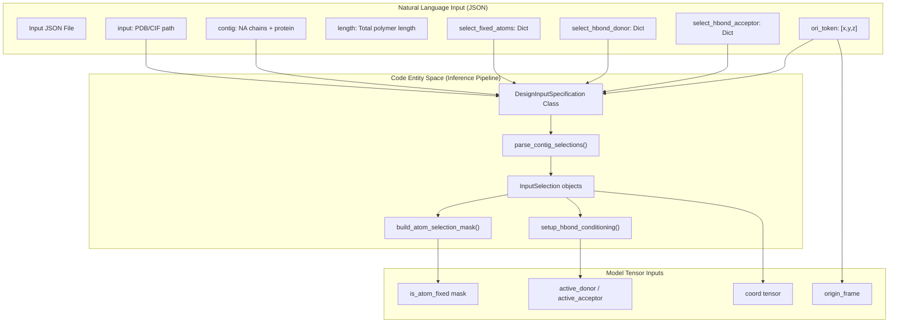
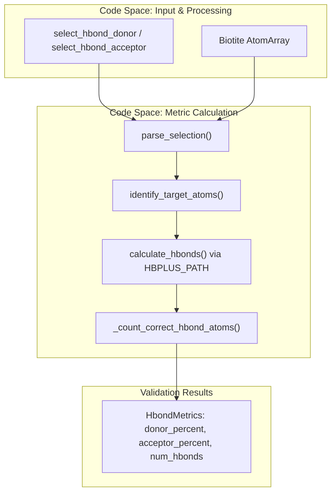

# Nucleic Acid Binder Design

> **Relevant source files**
> * [models/rfd3/docs/.assets/na_tutorial/example_output.png](https://github.com/RosettaCommons/foundry/blob/cee116dc/models/rfd3/docs/.assets/na_tutorial/example_output.png)
> * [models/rfd3/docs/.assets/na_tutorial/hydrogen_bond_constraints.png](https://github.com/RosettaCommons/foundry/blob/cee116dc/models/rfd3/docs/.assets/na_tutorial/hydrogen_bond_constraints.png)
> * [models/rfd3/docs/.assets/na_tutorial/input_unfix_sequence.png](https://github.com/RosettaCommons/foundry/blob/cee116dc/models/rfd3/docs/.assets/na_tutorial/input_unfix_sequence.png)
> * [models/rfd3/docs/.assets/na_tutorial/ori_token_output.png](https://github.com/RosettaCommons/foundry/blob/cee116dc/models/rfd3/docs/.assets/na_tutorial/ori_token_output.png)
> * [models/rfd3/docs/examples/na_binder_design.md](https://github.com/RosettaCommons/foundry/blob/cee116dc/models/rfd3/docs/examples/na_binder_design.md?plain=1)
> * [models/rfd3/docs/tutorials/na_tutorial_files/rfd3_na_tutorial.json](https://github.com/RosettaCommons/foundry/blob/cee116dc/models/rfd3/docs/tutorials/na_tutorial_files/rfd3_na_tutorial.json)

This page documents the use of RFdiffusion3 (RFD3) for designing proteins that bind nucleic acids (DNA and RNA). This includes designing binders for double-stranded DNA (dsDNA), single-stranded DNA (ssDNA), and RNA structures using specialized conditioning features such as hydrogen bond constraints and selective atom fixation.

For general protein binder design, see [Protein Binder Design](/RosettaCommons/foundry/4.4.1-protein-binder-design). For small molecule binder design, see [Small Molecule Binder Design](/RosettaCommons/foundry/4.4.2-small-molecule-binder-design). For comprehensive InputSpecification documentation, see [InputSpecification System](/RosettaCommons/foundry/4.2-inputspecification-system).

**Sources**: [models/rfd3/docs/examples/na_binder_design.md L1-L117](https://github.com/RosettaCommons/foundry/blob/cee116dc/models/rfd3/docs/examples/na_binder_design.md?plain=1#L1-L117)

## Overview

Nucleic acid binder design presents unique challenges compared to protein-protein interactions due to the distinct chemical properties and structural motifs of DNA and RNA. RFD3 supports nucleic acid binder design through several specialized features:

* **Selective atom fixation**: Control which nucleotide atoms remain fixed versus diffused during generation.
* **Hydrogen bond conditioning**: Explicitly specify donor and acceptor atoms for hydrogen bonding interactions.
* **Partial diffusion**: Sample nucleic acid conformations while maintaining sequence.
* **Mixed polymer support**: Design proteins in the context of both fixed and diffused nucleic acid regions.

The model treats nucleic acid chains as structural components similar to protein chains but with distinct chemical properties that influence the design process.

**Sources**: [models/rfd3/docs/examples/na_binder_design.md L1-L117](https://github.com/RosettaCommons/foundry/blob/cee116dc/models/rfd3/docs/examples/na_binder_design.md?plain=1#L1-L117)

## Input Specification Format

Nucleic acid binder design uses the standard `InputSpecification` JSON format with NA-specific parameters. The key differences from protein binder design involve how nucleic acid chains are specified and conditioned.

### Core Parameters for NA Binding

| Parameter | Type | Purpose | Example |
| --- | --- | --- | --- |
| `input` | string | Path to input PDB/CIF with NA structure | `"../input_pdbs/1bna.pdb"` |
| `contig` | string | Contig specification including NA chains | `"A1-10,/0,B15-24,/0,120-130"` |
| `length` | string | Total length range (protein + NA) | `"140-150"` |
| `select_fixed_atoms` | dict | Per-residue atom selection for fixation | `{"A1-10": "ALL"}` |
| `select_hbond_donor` | dict | Atoms to condition as H-bond donors | `{"D31-32": "N6"}` |
| `select_hbond_acceptor` | dict | Atoms to condition as H-bond acceptors | `{"C16": "N7,O6"}` |
| `ori_token` | list | Origin positioning (x, y, z offsets) | `[24, 20, 10]` |
| `is_non_loopy` | bool | Encourage structured designs | `true` |

### Atom Selection Syntax

The `select_fixed_atoms` parameter accepts special keywords:

* `"ALL"`: Fix all atoms in the specified residues [models/rfd3/docs/examples/na_binder_design.md L104-L105](https://github.com/RosettaCommons/foundry/blob/cee116dc/models/rfd3/docs/examples/na_binder_design.md?plain=1#L104-L105)
* `"BKBN"`: Fix backbone atoms only (phosphate backbone for NA).
* `""` (empty string): Allow all atoms to diffuse [models/rfd3/docs/examples/na_binder_design.md L106-L107](https://github.com/RosettaCommons/foundry/blob/cee116dc/models/rfd3/docs/examples/na_binder_design.md?plain=1#L106-L107)
* Specific atom names: Comma-separated list (e.g., `"OP1,OP2,O3',O5'"` [models/rfd3/docs/examples/na_binder_design.md L110-L111](https://github.com/RosettaCommons/foundry/blob/cee116dc/models/rfd3/docs/examples/na_binder_design.md?plain=1#L110-L111) ).

**Sources**: [models/rfd3/docs/examples/na_binder_design.md L23-L117](https://github.com/RosettaCommons/foundry/blob/cee116dc/models/rfd3/docs/examples/na_binder_design.md?plain=1#L23-L117)

### Data Flow for NA Input Specification

The following diagram bridges the Natural Language parameters in the JSON to the internal `DesignInputSpecification` processing.



**Sources**: [models/rfd3/docs/examples/na_binder_design.md L23-L117](https://github.com/RosettaCommons/foundry/blob/cee116dc/models/rfd3/docs/examples/na_binder_design.md?plain=1#L23-L117)

 [models/rfd3/docs/tutorials/na_tutorial_files/rfd3_na_tutorial.json L1-L16](https://github.com/RosettaCommons/foundry/blob/cee116dc/models/rfd3/docs/tutorials/na_tutorial_files/rfd3_na_tutorial.json#L1-L16)

## Hydrogen Bond Conditioning

Hydrogen bond conditioning is the primary mechanism for directing protein-nucleic acid interactions in RFD3. This feature allows explicit specification of which atoms on the nucleic acid should form hydrogen bonds with the designed protein.

### Specification Format

Hydrogen bond conditioning is specified through two parameters:

```json
{    "select_hbond_donor": {        "D31-32": "N6"    },    "select_hbond_acceptor": {        "C16": "N7,O6",        "D31-32": "N7",        "D28-30": "OP1,OP2,O3',O5'"    }}
```

* **Keys**: Residue selections using `InputSelection` syntax (e.g., `"D31-32"` for residues 31-32 on chain D) [models/rfd3/docs/examples/na_binder_design.md L110-L111](https://github.com/RosettaCommons/foundry/blob/cee116dc/models/rfd3/docs/examples/na_binder_design.md?plain=1#L110-L111)
* **Values**: Comma-separated atom names from those residues [models/rfd3/docs/examples/na_binder_design.md L110-L111](https://github.com/RosettaCommons/foundry/blob/cee116dc/models/rfd3/docs/examples/na_binder_design.md?plain=1#L110-L111)

### Common Nucleotide Atoms for H-bonding

| Nucleotide Type | Common Donor Atoms | Common Acceptor Atoms |
| --- | --- | --- |
| DNA (A, G, C, T) | N6 (A), N4 (C), N2 (G) | N7, O6 (G), N3 (A), O4 (T), O2 (C) |
| RNA (A, G, C, U) | N6 (A), N4 (C), N2 (G) | N7, O6 (G), N3 (A), O4 (U), O2 (C) |
| Phosphate backbone | O3', O5' | OP1, OP2, O3', O5' |

**Sources**: [models/rfd3/docs/examples/na_binder_design.md L110-L111](https://github.com/RosettaCommons/foundry/blob/cee116dc/models/rfd3/docs/examples/na_binder_design.md?plain=1#L110-L111)

### H-Bond Metric Validation Flow

This diagram shows how the system validates designs using external tools like `hbplus`.



**Sources**: [models/rfd3/docs/examples/na_binder_design.md L86-L116](https://github.com/RosettaCommons/foundry/blob/cee116dc/models/rfd3/docs/examples/na_binder_design.md?plain=1#L86-L116)

## Design Pattern: dsDNA Binding

Double-stranded DNA binding is one of the most common nucleic acid binder design tasks. The DNA chains are typically specified as fixed in the contig, and a protein chain is generated to bind the DNA.

### Example: Basic dsDNA Binder

```json
{    "dsDNA_basic": {         "input": "../input_pdbs/1bna.pdb",        "contig": "A1-10,/0,B15-24,/0,120-130",        "length": "140-150",        "ori_token": [24,20,10],        "is_non_loopy": true    }}
```

**Explanation**:

* **`contig: "A1-10,/0,B15-24,/0,120-130"`**: * `A1-10`: DNA chain A, residues 1-10 (fixed) [models/rfd3/docs/examples/na_binder_design.md L25](https://github.com/RosettaCommons/foundry/blob/cee116dc/models/rfd3/docs/examples/na_binder_design.md?plain=1#L25-L25) * `/0`: Chain break. * `B15-24`: DNA chain B, residues 15-24 (fixed) [models/rfd3/docs/examples/na_binder_design.md L25](https://github.com/RosettaCommons/foundry/blob/cee116dc/models/rfd3/docs/examples/na_binder_design.md?plain=1#L25-L25) * `/0`: Chain break. * `120-130`: Generate protein chain of length 120-130 residues [models/rfd3/docs/examples/na_binder_design.md L25](https://github.com/RosettaCommons/foundry/blob/cee116dc/models/rfd3/docs/examples/na_binder_design.md?plain=1#L25-L25)
* **`length: "140-150"`**: Total length is sum of all polymers: 10 + 10 + (120 to 130) = 140-150 [models/rfd3/docs/examples/na_binder_design.md L26](https://github.com/RosettaCommons/foundry/blob/cee116dc/models/rfd3/docs/examples/na_binder_design.md?plain=1#L26-L26)
* **`ori_token: [24,20,10]`**: Position the origin 24Å in x, 20Å in y, 10Å in z relative to DNA [models/rfd3/docs/examples/na_binder_design.md L33](https://github.com/RosettaCommons/foundry/blob/cee116dc/models/rfd3/docs/examples/na_binder_design.md?plain=1#L33-L33)

### Design Pattern: Complex Example with Mixed Fixation

For more sophisticated designs, you can selectively fix certain DNA atoms while allowing others to diffuse, combined with hydrogen bond conditioning:

```json
{    "dsDNA_complex": {        "input": "../input_pdbs/2r5z.pdb",        "contig": "C5-18,/0,D24-37,/0,40-50,A146-154,80-90",        "length": "157-177",        "unindex": "/0,/0,B251-255",        "select_fixed_atoms": {            "C9-14":"ALL",            "D28-33":"ALL",            "C5-8,C15-18": "",            "D24-27,D34-37": ""        },        "ori_token":[25,35,20],        "select_hbond_acceptor": {"C16":"N7,O6", "D31-32":"N7", "D28-30":"OP1,OP2,O3',O5'"},        "select_hbond_donor": {"D31-32":"N6"},        "is_non_loopy": true    }}
```

**Key features**:

* **Mixed fixation**: Some DNA residues fully fixed (`C9-14`, `D28-33`), others diffused (`C5-8`, etc.) [models/rfd3/docs/examples/na_binder_design.md L103-L108](https://github.com/RosettaCommons/foundry/blob/cee116dc/models/rfd3/docs/examples/na_binder_design.md?plain=1#L103-L108)
* **Indexed motif**: `A146-154` maintains its original residue numbering [models/rfd3/docs/examples/na_binder_design.md L100](https://github.com/RosettaCommons/foundry/blob/cee116dc/models/rfd3/docs/examples/na_binder_design.md?plain=1#L100-L100)
* **Unindexed motif**: `B251-B255` gets renumbered via the `unindex` parameter [models/rfd3/docs/examples/na_binder_design.md L102](https://github.com/RosettaCommons/foundry/blob/cee116dc/models/rfd3/docs/examples/na_binder_design.md?plain=1#L102-L102)
* **H-bond conditioning**: Specific base atoms (N7, O6, N6) and backbone atoms (OP1, OP2) targeted [models/rfd3/docs/examples/na_binder_design.md L110-L111](https://github.com/RosettaCommons/foundry/blob/cee116dc/models/rfd3/docs/examples/na_binder_design.md?plain=1#L110-L111)

**Sources**: [models/rfd3/docs/examples/na_binder_design.md L23-L116](https://github.com/RosettaCommons/foundry/blob/cee116dc/models/rfd3/docs/examples/na_binder_design.md?plain=1#L23-L116)

 [models/rfd3/docs/tutorials/na_tutorial_files/rfd3_na_tutorial.json L1-L16](https://github.com/RosettaCommons/foundry/blob/cee116dc/models/rfd3/docs/tutorials/na_tutorial_files/rfd3_na_tutorial.json#L1-L16)

## Design Pattern: ssDNA Binding

Single-stranded DNA presents different structural challenges than dsDNA, as it has more conformational flexibility.

### Fixed ssDNA Conformation

When the input structure has a stable ssDNA conformation (e.g., G-quadruplex):

```json
{    "ssDNA_basic": {        "input": "../input_pdbs/5o4d.pdb",        "contig": "A1-23,/0,120-130",        "length": "143-153",        "ori_token": [-5,-10,8],        "is_non_loopy": true    }}
```

The single DNA chain A (residues 1-23) is treated as fixed [models/rfd3/docs/examples/na_binder_design.md L47](https://github.com/RosettaCommons/foundry/blob/cee116dc/models/rfd3/docs/examples/na_binder_design.md?plain=1#L47-L47)

### Diffused ssDNA Conformation

When you want to sample ssDNA conformations during design:

```json
{    "ssDNA_diffused_from_dsDNA_pdb":{        "input": "../input_pdbs/1bna.pdb",        "contig": "A1-10,/0,120-130",        "length": "130-140",        "select_fixed_atoms": {"A1-10":""},        "is_non_loopy": true    }}
```

**Key difference**: `"select_fixed_atoms": {"A1-10":""}` specifies that no atoms in the DNA chain should be fixed [models/rfd3/docs/examples/na_binder_design.md L64](https://github.com/RosettaCommons/foundry/blob/cee116dc/models/rfd3/docs/examples/na_binder_design.md?plain=1#L64-L64)

 This allows RFD3 to sample single-stranded conformations during diffusion while maintaining the sequence from the input PDB [models/rfd3/docs/examples/na_binder_design.md L57](https://github.com/RosettaCommons/foundry/blob/cee116dc/models/rfd3/docs/examples/na_binder_design.md?plain=1#L57-L57)

**Sources**: [models/rfd3/docs/examples/na_binder_design.md L39-L68](https://github.com/RosettaCommons/foundry/blob/cee116dc/models/rfd3/docs/examples/na_binder_design.md?plain=1#L39-L68)

## Design Pattern: RNA Binding

RNA binder design follows similar principles to DNA binding but accounts for RNA's distinct structural features.

### Example: Basic RNA Binder

```json
{    "RNA_basic": {        "input": "../input_pdbs/1q75.pdb",        "contig": "A1-15,/0,120-130",        "length": "135-145",        "ori_token": [15,2,-4],        "is_non_loopy": true    }   }
```

The approach is identical to ssDNA binding, with the model automatically recognizing RNA residues [models/rfd3/docs/examples/na_binder_design.md L76-L83](https://github.com/RosettaCommons/foundry/blob/cee116dc/models/rfd3/docs/examples/na_binder_design.md?plain=1#L76-L83)

**Sources**: [models/rfd3/docs/examples/na_binder_design.md L70-L84](https://github.com/RosettaCommons/foundry/blob/cee116dc/models/rfd3/docs/examples/na_binder_design.md?plain=1#L70-L84)

## Validation and Metrics

### HBPLUS Installation Requirement

To calculate hydrogen bond metrics, `hbplus` must be installed and configured [models/rfd3/docs/examples/na_binder_design.md L90](https://github.com/RosettaCommons/foundry/blob/cee116dc/models/rfd3/docs/examples/na_binder_design.md?plain=1#L90-L90)

1. Download from: [https://www.ebi.ac.uk/thornton-srv/software/HBPLUS/download.html](https://www.ebi.ac.uk/thornton-srv/software/HBPLUS/download.html) [models/rfd3/docs/examples/na_binder_design.md L92](https://github.com/RosettaCommons/foundry/blob/cee116dc/models/rfd3/docs/examples/na_binder_design.md?plain=1#L92-L92)
2. Follow installation instructions: [https://www.ebi.ac.uk/thornton-srv/software/HBPLUS/install.html](https://www.ebi.ac.uk/thornton-srv/software/HBPLUS/install.html) [models/rfd3/docs/examples/na_binder_design.md L93](https://github.com/RosettaCommons/foundry/blob/cee116dc/models/rfd3/docs/examples/na_binder_design.md?plain=1#L93-L93)
3. Set `HBPLUS_PATH` in the `foundry/.env` file [models/rfd3/docs/examples/na_binder_design.md L94](https://github.com/RosettaCommons/foundry/blob/cee116dc/models/rfd3/docs/examples/na_binder_design.md?plain=1#L94-L94)

**Sources**: [models/rfd3/docs/examples/na_binder_design.md L90-L95](https://github.com/RosettaCommons/foundry/blob/cee116dc/models/rfd3/docs/examples/na_binder_design.md?plain=1#L90-L95)

## Running NA Binder Design

### Command-Line Execution

To run nucleic acid binder design examples:

```
rfd3 design out_dir=inference_outputs/na_binder/0 \    ckpt_path=/path/to/rfd3_latest.ckpt \    inputs=./na_binder_design.json
```

**Sources**: [models/rfd3/docs/examples/na_binder_design.md L5-L8](https://github.com/RosettaCommons/foundry/blob/cee116dc/models/rfd3/docs/examples/na_binder_design.md?plain=1#L5-L8)

## Summary Table of NA Design Scenarios

| Scenario | DNA/RNA Type | Key Parameters | Use Case |
| --- | --- | --- | --- |
| Basic dsDNA | dsDNA (2 chains) | Fixed DNA chains, generated protein | Standard DNA-binding protein |
| Basic ssDNA | ssDNA (1 chain) | Fixed ssDNA, generated protein | G-quadruplex binders |
| Diffused ssDNA | ssDNA from dsDNA | `select_fixed_atoms: ""` for DNA | Flexible ssDNA conformation sampling |
| RNA Binding | RNA (1 chain) | Fixed RNA, generated protein | RNA-binding proteins |
| Complex dsDNA | dsDNA + protein motif | Partial fixation, H-bond conditioning | Sophisticated DNA-protein interfaces |

**Sources**: [models/rfd3/docs/examples/na_binder_design.md L23-L116](https://github.com/RosettaCommons/foundry/blob/cee116dc/models/rfd3/docs/examples/na_binder_design.md?plain=1#L23-L116)