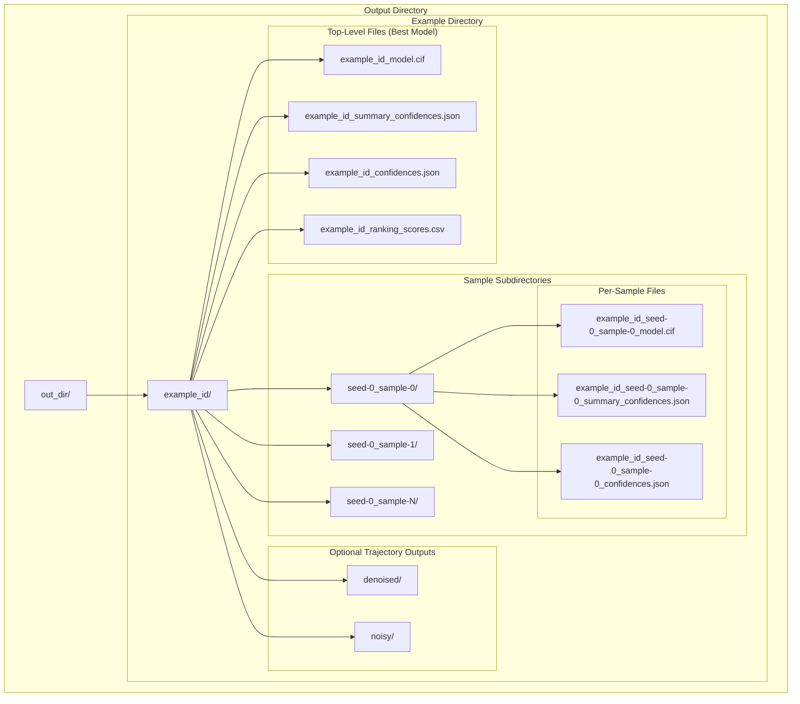
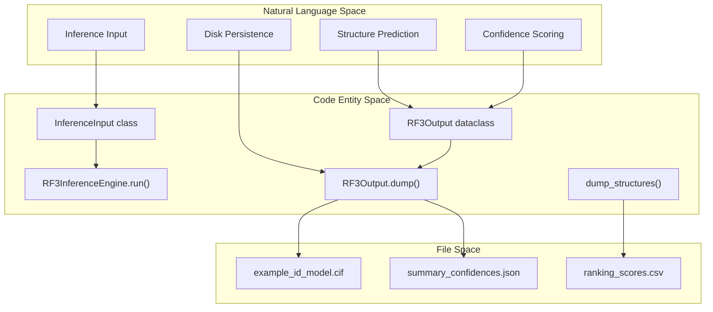

# Output Management

> **Relevant source files**
> * [models/rf3/configs/experiment/pretrained/rf3.yaml](https://github.com/RosettaCommons/foundry/blob/cee116dc/models/rf3/configs/experiment/pretrained/rf3.yaml)
> * [models/rf3/configs/inference_engine/base.yaml](https://github.com/RosettaCommons/foundry/blob/cee116dc/models/rf3/configs/inference_engine/base.yaml)
> * [models/rf3/configs/inference_engine/rf3.yaml](https://github.com/RosettaCommons/foundry/blob/cee116dc/models/rf3/configs/inference_engine/rf3.yaml)
> * [models/rf3/src/rf3/callbacks/dump_validation_structures.py](https://github.com/RosettaCommons/foundry/blob/cee116dc/models/rf3/src/rf3/callbacks/dump_validation_structures.py)
> * [models/rf3/src/rf3/cli.py](https://github.com/RosettaCommons/foundry/blob/cee116dc/models/rf3/src/rf3/cli.py)
> * [models/rf3/src/rf3/data/extra_xforms.py](https://github.com/RosettaCommons/foundry/blob/cee116dc/models/rf3/src/rf3/data/extra_xforms.py)
> * [models/rf3/src/rf3/data/pipelines.py](https://github.com/RosettaCommons/foundry/blob/cee116dc/models/rf3/src/rf3/data/pipelines.py)
> * [models/rf3/src/rf3/inference.py](https://github.com/RosettaCommons/foundry/blob/cee116dc/models/rf3/src/rf3/inference.py)
> * [models/rf3/src/rf3/inference_engines/rf3.py](https://github.com/RosettaCommons/foundry/blob/cee116dc/models/rf3/src/rf3/inference_engines/rf3.py)
> * [models/rf3/src/rf3/symmetry/resolve.py](https://github.com/RosettaCommons/foundry/blob/cee116dc/models/rf3/src/rf3/symmetry/resolve.py)
> * [models/rf3/src/rf3/utils/inference.py](https://github.com/RosettaCommons/foundry/blob/cee116dc/models/rf3/src/rf3/utils/inference.py)
> * [models/rf3/src/rf3/utils/io.py](https://github.com/RosettaCommons/foundry/blob/cee116dc/models/rf3/src/rf3/utils/io.py)
> * [models/rfd3/src/rfd3/cli.py](https://github.com/RosettaCommons/foundry/blob/cee116dc/models/rfd3/src/rfd3/cli.py)
> * [pyproject.toml](https://github.com/RosettaCommons/foundry/blob/cee116dc/pyproject.toml)

This page documents how RosettaFold3 (RF3) organizes and saves prediction outputs, including directory structures, file formats, and configuration options. RF3 uses an AlphaFold3-compatible output format that includes structure files, confidence metrics, and optional trajectories.

For information about running RF3 inference, see [RF3 Inference](/RosettaCommons/foundry/5.2-rf3-inference). For details on interpreting confidence metrics, see [Confidence Metrics](/RosettaCommons/foundry/5.4-confidence-metrics).

---

## Overview

RF3 predictions generate multiple output files per input structure, organized in a hierarchical directory structure. The output system supports:

* **AlphaFold3-compatible format**: Structure files (CIF) with confidence metrics (JSON) [models/rf3/src/rf3/inference_engines/rf3.py L102-L103](https://github.com/RosettaCommons/foundry/blob/cee116dc/models/rf3/src/rf3/inference_engines/rf3.py#L102-L103)
* **Multiple samples per input**: Each input can generate multiple predictions controlled by `diffusion_batch_size` [models/rf3/configs/inference_engine/rf3.yaml L13](https://github.com/RosettaCommons/foundry/blob/cee116dc/models/rf3/configs/inference_engine/rf3.yaml#L13-L13)
* **Ranking-based selection**: Automatic selection and top-level promotion of the highest-scoring model [models/rf3/src/rf3/inference_engines/rf3.py L167-L172](https://github.com/RosettaCommons/foundry/blob/cee116dc/models/rf3/src/rf3/inference_engines/rf3.py#L167-L172)
* **Optional compression**: GZIP compression for structure files [models/rf3/configs/inference_engine/base.yaml L10](https://github.com/RosettaCommons/foundry/blob/cee116dc/models/rf3/configs/inference_engine/base.yaml#L10-L10)
* **Sharding support**: Hash-based directory organization for large-scale predictions [models/rf3/src/rf3/utils/io.py L34-L35](https://github.com/RosettaCommons/foundry/blob/cee116dc/models/rf3/src/rf3/utils/io.py#L34-L35)
* **Trajectory outputs**: Optional diffusion trajectory snapshots [models/rf3/src/rf3/inference_engines/rf3.py L43](https://github.com/RosettaCommons/foundry/blob/cee116dc/models/rf3/src/rf3/inference_engines/rf3.py#L43-L43)

Sources: [models/rf3/src/rf3/inference_engines/rf3.py L98-L201](https://github.com/RosettaCommons/foundry/blob/cee116dc/models/rf3/src/rf3/inference_engines/rf3.py#L98-L201)

 [models/rf3/configs/inference_engine/rf3.yaml L1-L33](https://github.com/RosettaCommons/foundry/blob/cee116dc/models/rf3/configs/inference_engine/rf3.yaml#L1-L33)

---

## Output Directory Structure

RF3 organizes outputs in a two-level hierarchy: top-level files for the best prediction, and per-sample subdirectories for all predictions.

### Directory Hierarchy



**Directory Structure with Sharding**

When `sharding_pattern` is enabled, the example directory is placed within hash-based subdirectories to prevent directory entry limits [models/rf3/src/rf3/utils/io.py L34-L58](https://github.com/RosettaCommons/foundry/blob/cee116dc/models/rf3/src/rf3/utils/io.py#L34-L58)

```markdown
out_dir/
├── a1/                    # First hash shard
│   ├── b2/                # Second hash shard
│   │   └── example_id/    # Example directory
│   │       ├── example_id_model.cif
│   │       └── ...
```

Sources: [models/rf3/src/rf3/inference_engines/rf3.py L128-L148](https://github.com/RosettaCommons/foundry/blob/cee116dc/models/rf3/src/rf3/inference_engines/rf3.py#L128-L148)

 [models/rf3/src/rf3/utils/io.py L21-L58](https://github.com/RosettaCommons/foundry/blob/cee116dc/models/rf3/src/rf3/utils/io.py#L21-L58)

---

## Output File Types

RF3 generates several file types for each prediction:

| File Type | Description | Optional | Content |
| --- | --- | --- | --- |
| `*_model.cif[.gz]` | Structure file | No | Atomic coordinates in mmCIF format [models/rf3/src/rf3/inference_engines/rf3.py L132-L137](https://github.com/RosettaCommons/foundry/blob/cee116dc/models/rf3/src/rf3/inference_engines/rf3.py#L132-L137) |
| `*_summary_confidences.json` | Summary metrics | No | pLDDT, pTM, ipTM, PAE, PDE, ranking score [models/rf3/src/rf3/inference_engines/rf3.py L139-L141](https://github.com/RosettaCommons/foundry/blob/cee116dc/models/rf3/src/rf3/inference_engines/rf3.py#L139-L141) |
| `*_confidences.json` | Full confidence data | Yes | Per-atom and per-token-pair confidence arrays [models/rf3/src/rf3/inference_engines/rf3.py L144-L146](https://github.com/RosettaCommons/foundry/blob/cee116dc/models/rf3/src/rf3/inference_engines/rf3.py#L144-L146) |
| `*_ranking_scores.csv` | Sample rankings | No | Ranking scores for all samples (top-level only) [models/rf3/src/rf3/inference_engines/rf3.py L149-L164](https://github.com/RosettaCommons/foundry/blob/cee116dc/models/rf3/src/rf3/inference_engines/rf3.py#L149-L164) |
| `denoised/*_model_*.cif[.gz]` | Denoised trajectory | Yes | Diffusion trajectory (predicted structures) [models/rf3/callbacks/dump_validation_structures.py L89-L95](https://github.com/RosettaCommons/foundry/blob/cee116dc/models/rf3/callbacks/dump_validation_structures.py#L89-L95) |
| `noisy/*_model_*.cif[.gz]` | Noisy trajectory | Yes | Diffusion trajectory (noisy structures) [models/rf3/callbacks/dump_validation_structures.py L96-L101](https://github.com/RosettaCommons/foundry/blob/cee116dc/models/rf3/callbacks/dump_validation_structures.py#L96-L101) |

### Structure Files (CIF)

Structure files contain atomic coordinates. The file format is controlled by the `compress_outputs` parameter:

* **Uncompressed**: `*.cif` (text format)
* **Compressed**: `*.cif.gz` (gzipped) [models/rf3/configs/inference_engine/base.yaml L10](https://github.com/RosettaCommons/foundry/blob/cee116dc/models/rf3/configs/inference_engine/base.yaml#L10-L10)

When `annotate_b_factor_with_plddt=True`, the B-factor column contains per-atom pLDDT confidence scores [models/rf3/src/rf3/inference.py L45](https://github.com/RosettaCommons/foundry/blob/cee116dc/models/rf3/src/rf3/inference.py#L45-L45)

Sources: [models/rf3/src/rf3/inference_engines/rf3.py L112-L148](https://github.com/RosettaCommons/foundry/blob/cee116dc/models/rf3/src/rf3/inference_engines/rf3.py#L112-L148)

 [models/rf3/src/rf3/utils/io.py L31-L35](https://github.com/RosettaCommons/foundry/blob/cee116dc/models/rf3/src/rf3/utils/io.py#L31-L35)

### Confidence Files (JSON)

RF3 outputs confidence metrics in AlphaFold3-compatible JSON format with compact array formatting for readability [models/rf3/src/rf3/inference_engines/rf3.py L59-L76](https://github.com/RosettaCommons/foundry/blob/cee116dc/models/rf3/src/rf3/inference_engines/rf3.py#L59-L76)

**summary_confidences.json** (compact format):

```json
{  "plddt": 85.2,  "ptm": 0.87,  "iptm": 0.92,  "has_clash": false,  "ranking_score": 0.911,  "pae": [[1.2, 3.4], [3.4, 1.5]],  "pde": [[2.1, 4.2], [4.2, 2.3]]}
```

Sources: [models/rf3/src/rf3/inference_engines/rf3.py L59-L76](https://github.com/RosettaCommons/foundry/blob/cee116dc/models/rf3/src/rf3/inference_engines/rf3.py#L59-L76)

 [models/rf3/src/rf3/inference_engines/rf3.py L139-L141](https://github.com/RosettaCommons/foundry/blob/cee116dc/models/rf3/src/rf3/inference_engines/rf3.py#L139-L141)

### Ranking Scores

The `*_ranking_scores.csv` file contains ranking scores for all samples. The ranking score formula is: `0.8 * ipTM + 0.2 * pTM - 100 * has_clash` [models/rf3/src/rf3/inference_engines/rf3.py L79-L95](https://github.com/RosettaCommons/foundry/blob/cee116dc/models/rf3/src/rf3/inference_engines/rf3.py#L79-L95)

For single-chain predictions where ipTM is not defined, pTM is used instead of ipTM [models/rf3/src/rf3/inference_engines/rf3.py L90-L92](https://github.com/RosettaCommons/foundry/blob/cee116dc/models/rf3/src/rf3/inference_engines/rf3.py#L90-L92)

Sources: [models/rf3/src/rf3/inference_engines/rf3.py L79-L96](https://github.com/RosettaCommons/foundry/blob/cee116dc/models/rf3/src/rf3/inference_engines/rf3.py#L79-L96)

 [models/rf3/src/rf3/inference_engines/rf3.py L149-L164](https://github.com/RosettaCommons/foundry/blob/cee116dc/models/rf3/src/rf3/inference_engines/rf3.py#L149-L164)

---

## RF3Output Container

The `RF3Output` dataclass encapsulates all output data for a single prediction sample [models/rf3/src/rf3/inference_engines/rf3.py L98-L110](https://github.com/RosettaCommons/foundry/blob/cee116dc/models/rf3/src/rf3/inference_engines/rf3.py#L98-L110)

### Key Methods

**dump()** - Save output to disk:

```
output.dump(    out_dir=Path("./results"),    file_type="cif.gz",    dump_full_confidences=True)
```

This method creates:

* `{example_id}_seed-{seed}_sample-{sample_idx}_model.{file_type}`
* `{example_id}_seed-{seed}_sample-{sample_idx}_summary_confidences.json`
* `{example_id}_seed-{seed}_sample-{sample_idx}_confidences.json` (if `dump_full_confidences=True`)

Sources: [models/rf3/src/rf3/inference_engines/rf3.py L112-L148](https://github.com/RosettaCommons/foundry/blob/cee116dc/models/rf3/src/rf3/inference_engines/rf3.py#L112-L148)

---

## Output Generation Pipeline

The following diagram maps the model data flow to specific code entities and output files:



Sources: [models/rf3/src/rf3/inference_engines/rf3.py L98-L201](https://github.com/RosettaCommons/foundry/blob/cee116dc/models/rf3/src/rf3/inference_engines/rf3.py#L98-L201)

 [models/rf3/src/rf3/utils/inference.py L61-L70](https://github.com/RosettaCommons/foundry/blob/cee116dc/models/rf3/src/rf3/utils/inference.py#L61-L70)

 [models/rf3/src/rf3/utils/io.py L31-L35](https://github.com/RosettaCommons/foundry/blob/cee116dc/models/rf3/src/rf3/utils/io.py#L31-L35)

---

## Sharding Patterns

For large-scale predictions, RF3 supports hash-based directory sharding to avoid placing too many directories in a single folder.

### Usage

The `sharding_pattern` parameter (e.g., `/0:2/2:4/`) creates nested directories using hash slices of the `example_id` [models/rf3/src/rf3/utils/io.py L34-L58](https://github.com/RosettaCommons/foundry/blob/cee116dc/models/rf3/src/rf3/utils/io.py#L34-L58)

1. Compute hash of `example_id`.
2. Create directory structure: `hash[0:2]/hash[2:4]/example_id`.
3. Distribute predictions across directories to prevent filesystem performance degradation.

Sources: [models/rf3/src/rf3/utils/io.py L21-L58](https://github.com/RosettaCommons/foundry/blob/cee116dc/models/rf3/src/rf3/utils/io.py#L21-L58)

 [models/rf3/configs/inference_engine/base.yaml L19](https://github.com/RosettaCommons/foundry/blob/cee116dc/models/rf3/configs/inference_engine/base.yaml#L19-L19)

---

## Compression and File Types

RF3 supports optional GZIP compression for structure files to reduce disk usage [models/rf3/configs/inference_engine/base.yaml L10](https://github.com/RosettaCommons/foundry/blob/cee116dc/models/rf3/configs/inference_engine/base.yaml#L10-L10)

| Setting | File Extension | Size | Read Speed |
| --- | --- | --- | --- |
| `compress_outputs=False` | `.cif` | Larger | Faster |
| `compress_outputs=True` | `.cif.gz` | ~5-10x smaller | Slower |

The compression setting affects:

* Structure files (`*_model.cif[.gz]`)
* Trajectory files (if enabled)

Sources: [models/rf3/configs/inference_engine/base.yaml L10](https://github.com/RosettaCommons/foundry/blob/cee116dc/models/rf3/configs/inference_engine/base.yaml#L10-L10)

 [models/rf3/src/rf3/callbacks/dump_validation_structures.py L76-L87](https://github.com/RosettaCommons/foundry/blob/cee116dc/models/rf3/src/rf3/callbacks/dump_validation_structures.py#L76-L87)

---

## Trajectory Outputs

RF3 can optionally save diffusion trajectories showing the denoising process over time [models/rf3/src/rf3/inference.py L43](https://github.com/RosettaCommons/foundry/blob/cee116dc/models/rf3/src/rf3/inference.py#L43-L43)

### Trajectory Structure

Trajectories are saved in two subdirectories [models/rf3/callbacks/dump_validation_structures.py L89-L101](https://github.com/RosettaCommons/foundry/blob/cee116dc/models/rf3/callbacks/dump_validation_structures.py#L89-L101)

:

* **denoised/**: Predicted structures at each diffusion timestep.
* **noisy/**: Noisy structures at each diffusion timestep.

Each trajectory file is an `AtomArrayStack` containing models ordered from final to initial, making them compatible with PyMOL's bond graph building [models/rf3/callbacks/dump_validation_structures.py L79-L101](https://github.com/RosettaCommons/foundry/blob/cee116dc/models/rf3/callbacks/dump_validation_structures.py#L79-L101)

Sources: [models/rf3/src/rf3/inference.py L43](https://github.com/RosettaCommons/foundry/blob/cee116dc/models/rf3/src/rf3/inference.py#L43-L43)

 [models/rf3/callbacks/dump_validation_structures.py L1-L102](https://github.com/RosettaCommons/foundry/blob/cee116dc/models/rf3/callbacks/dump_validation_structures.py#L1-L102)

---

## Configuration Options

### Run Parameters

Configure output behavior via the `run()` method or CLI overrides [models/rf3/src/rf3/inference.py L39-L54](https://github.com/RosettaCommons/foundry/blob/cee116dc/models/rf3/src/rf3/inference.py#L39-L54)

:

| Parameter | Type | Default | Description |
| --- | --- | --- | --- |
| `out_dir` | `str\|None` | `None` | Output directory [models/rf3/src/rf3/inference.py L41](https://github.com/RosettaCommons/foundry/blob/cee116dc/models/rf3/src/rf3/inference.py#L41-L41) |
| `dump_predictions` | `bool` | `True` | Save predicted structures [models/rf3/src/rf3/inference.py L42](https://github.com/RosettaCommons/foundry/blob/cee116dc/models/rf3/src/rf3/inference.py#L42-L42) |
| `dump_trajectories` | `bool` | `False` | Save diffusion trajectories [models/rf3/src/rf3/inference.py L43](https://github.com/RosettaCommons/foundry/blob/cee116dc/models/rf3/src/rf3/inference.py#L43-L43) |
| `one_model_per_file` | `bool` | `False` | Save each sample in separate file [models/rf3/src/rf3/inference.py L44](https://github.com/RosettaCommons/foundry/blob/cee116dc/models/rf3/src/rf3/inference.py#L44-L44) |
| `annotate_b_factor_with_plddt` | `bool` | `False` | Write pLDDT to B-factor column [models/rf3/src/rf3/inference.py L45](https://github.com/RosettaCommons/foundry/blob/cee116dc/models/rf3/src/rf3/inference.py#L45-L45) |
| `sharding_pattern` | `str\|None` | `None` | Directory sharding pattern [models/rf3/src/rf3/inference.py L46](https://github.com/RosettaCommons/foundry/blob/cee116dc/models/rf3/src/rf3/inference.py#L46-L46) |

Sources: [models/rf3/src/rf3/inference.py L39-L54](https://github.com/RosettaCommons/foundry/blob/cee116dc/models/rf3/src/rf3/inference.py#L39-L54)

 [models/rf3/configs/inference_engine/base.yaml L12-L26](https://github.com/RosettaCommons/foundry/blob/cee116dc/models/rf3/configs/inference_engine/base.yaml#L12-L26)

### Configuration Files

Output settings are managed via Hydra:

**models/rf3/configs/inference_engine/base.yaml**:

```yaml
compress_outputs: falsedump_predictions: truedump_trajectories: falseone_model_per_file: falseannotate_b_factor_with_plddt: true
```

Sources: [models/rf3/configs/inference_engine/base.yaml L1-L26](https://github.com/RosettaCommons/foundry/blob/cee116dc/models/rf3/configs/inference_engine/base.yaml#L1-L26)

---

## Early Stopping Outputs

When early stopping is triggered (mean pLDDT falls below the specified threshold), RF3 returns a closure that triggers the stop [models/rf3/src/rf3/inference_engines/rf3.py L203-L219](https://github.com/RosettaCommons/foundry/blob/cee116dc/models/rf3/src/rf3/inference_engines/rf3.py#L203-L219)

 The threshold is typically set via `early_stopping_plddt_threshold` [models/rf3/configs/inference_engine/rf3.yaml L20](https://github.com/RosettaCommons/foundry/blob/cee116dc/models/rf3/configs/inference_engine/rf3.yaml#L20-L20)

Sources: [models/rf3/src/rf3/inference_engines/rf3.py L203-L219](https://github.com/RosettaCommons/foundry/blob/cee116dc/models/rf3/src/rf3/inference_engines/rf3.py#L203-L219)

 [models/rf3/configs/inference_engine/rf3.yaml L20](https://github.com/RosettaCommons/foundry/blob/cee116dc/models/rf3/configs/inference_engine/rf3.yaml#L20-L20)

---

## Validation Callback Outputs

During training or validation, the `DumpValidationStructuresCallback` handles structure dumping to the validation directory [models/rf3/src/rf3/callbacks/dump_validation_structures.py L15-L101](https://github.com/RosettaCommons/foundry/blob/cee116dc/models/rf3/src/rf3/callbacks/dump_validation_structures.py#L15-L101)

```
save_dir/
├── predictions/
│   └── epoch_{N}/
│       └── {dataset_name}/
│           └── {identifier}.cif[.gz]
└── trajectories/
    └── epoch_{N}/
        └── {dataset_name}/
            ├── {identifier}_denoised_model_{i}.cif[.gz]
```

Sources: [models/rf3/src/rf3/callbacks/dump_validation_structures.py L15-L101](https://github.com/RosettaCommons/foundry/blob/cee116dc/models/rf3/src/rf3/callbacks/dump_validation_structures.py#L15-L101)