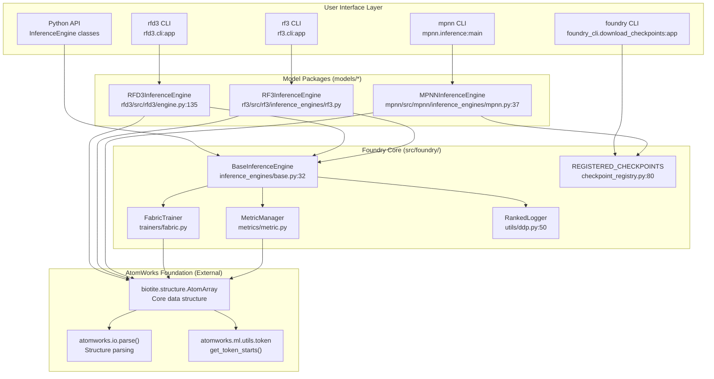
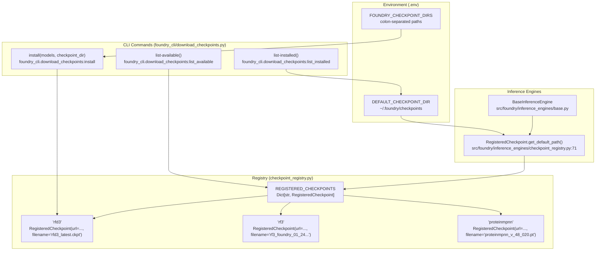
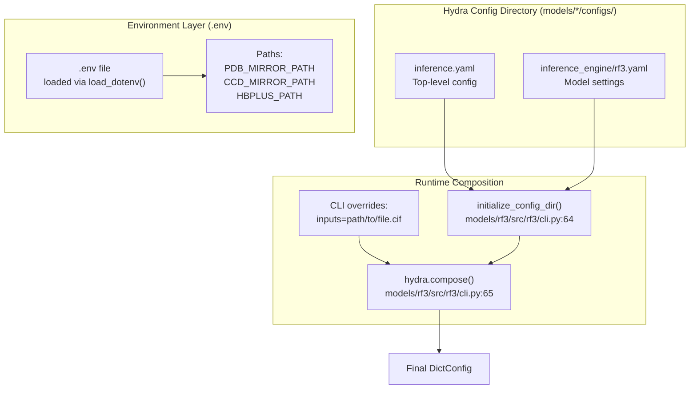

# Overview

> **Relevant source files**
> * [.env](https://github.com/RosettaCommons/foundry/blob/cee116dc/.env)
> * [CONTRIBUTING.md](https://github.com/RosettaCommons/foundry/blob/cee116dc/CONTRIBUTING.md?plain=1)
> * [README.md](https://github.com/RosettaCommons/foundry/blob/cee116dc/README.md?plain=1)
> * [docs/docs_requirements.txt](https://github.com/RosettaCommons/foundry/blob/cee116dc/docs/docs_requirements.txt)
> * [docs/source/_static/ga.js](https://github.com/RosettaCommons/foundry/blob/cee116dc/docs/source/_static/ga.js)
> * [docs/source/conf.py](https://github.com/RosettaCommons/foundry/blob/cee116dc/docs/source/conf.py)
> * [docs/source/contributing_link.rst](https://github.com/RosettaCommons/foundry/blob/cee116dc/docs/source/contributing_link.rst)
> * [docs/source/index.rst](https://github.com/RosettaCommons/foundry/blob/cee116dc/docs/source/index.rst)
> * [models/rf3/configs/experiment/pretrained/rf3.yaml](https://github.com/RosettaCommons/foundry/blob/cee116dc/models/rf3/configs/experiment/pretrained/rf3.yaml)
> * [models/rf3/src/rf3/callbacks/dump_validation_structures.py](https://github.com/RosettaCommons/foundry/blob/cee116dc/models/rf3/src/rf3/callbacks/dump_validation_structures.py)
> * [models/rf3/src/rf3/cli.py](https://github.com/RosettaCommons/foundry/blob/cee116dc/models/rf3/src/rf3/cli.py)
> * [models/rf3/src/rf3/utils/io.py](https://github.com/RosettaCommons/foundry/blob/cee116dc/models/rf3/src/rf3/utils/io.py)
> * [models/rfd3/README.md](https://github.com/RosettaCommons/foundry/blob/cee116dc/models/rfd3/README.md?plain=1)
> * [models/rfd3/src/rfd3/cli.py](https://github.com/RosettaCommons/foundry/blob/cee116dc/models/rfd3/src/rfd3/cli.py)
> * [pyproject.toml](https://github.com/RosettaCommons/foundry/blob/cee116dc/pyproject.toml)
> * [src/foundry/inference_engines/base.py](https://github.com/RosettaCommons/foundry/blob/cee116dc/src/foundry/inference_engines/base.py)
> * [src/foundry/inference_engines/checkpoint_registry.py](https://github.com/RosettaCommons/foundry/blob/cee116dc/src/foundry/inference_engines/checkpoint_registry.py)
> * [src/foundry_cli/__init__.py](https://github.com/RosettaCommons/foundry/blob/cee116dc/src/foundry_cli/__init__.py)
> * [src/foundry_cli/download_checkpoints.py](https://github.com/RosettaCommons/foundry/blob/cee116dc/src/foundry_cli/download_checkpoints.py)

## Purpose and Scope

Foundry is a unified platform for training and deploying protein design models, providing infrastructure for three complementary deep learning systems: **RFdiffusion3 (RFD3)** for all-atom generative design, **RosettaFold3 (RF3)** for structure prediction, and **ProteinMPNN/LigandMPNN** for sequence design. All models share a common foundation built on [AtomWorks](https://github.com/RosettaCommons/foundry/blob/cee116dc/AtomWorks)

 ensuring consistent biomolecular structure handling across training and inference workflows.

This page provides an architectural overview of the Foundry ecosystem. For installation instructions, see [Getting Started](/RosettaCommons/foundry/2-getting-started). For model-specific documentation, see [RFdiffusion3 (RFD3)](/RosettaCommons/foundry/4-rfdiffusion3-(rfd3)), [RosettaFold3 (RF3)](/RosettaCommons/foundry/5-rosettafold3-(rf3)), and [ProteinMPNN and LigandMPNN](/RosettaCommons/foundry/6-proteinmpnn-and-ligandmpnn). For infrastructure details, see [Infrastructure and Configuration](/RosettaCommons/foundry/8-infrastructure-and-configuration) and [Advanced Topics](/RosettaCommons/foundry/9-advanced-topics).

Sources: [README.md L1-L6](https://github.com/RosettaCommons/foundry/blob/cee116dc/README.md?plain=1#L1-L6)

---

## Core Architecture

Foundry follows a strict dependency hierarchy where all model packages depend on a shared core, which in turn depends on AtomWorks for structure handling. This architecture enables independent model installation while maintaining consistency across the platform.

### System Dependency Hierarchy



**Dependency Flow**: `models` → `foundry` → `atomworks` → `biotite`

The strict dependency hierarchy ensures:

* **No circular dependencies**: Models depend on foundry core, not vice versa [README.md L112-L117](https://github.com/RosettaCommons/foundry/blob/cee116dc/README.md?plain=1#L112-L117)
* **Shared infrastructure**: All models use the same `BaseInferenceEngine` [src/foundry/inference_engines/base.py L32-L35](https://github.com/RosettaCommons/foundry/blob/cee116dc/src/foundry/inference_engines/base.py#L32-L35)
* **Consistent data structures**: All models operate on `biotite.structure.AtomArray` objects via AtomWorks [README.md L5-L6](https://github.com/RosettaCommons/foundry/blob/cee116dc/README.md?plain=1#L5-L6)
* **Independent installation**: Each model can be installed separately or as a group [pyproject.toml L54-L70](https://github.com/RosettaCommons/foundry/blob/cee116dc/pyproject.toml#L54-L70)

| Component | Location | Key Classes | Purpose |
| --- | --- | --- | --- |
| **foundry** | `src/foundry/` | `BaseInferenceEngine`, `FabricTrainer` | Shared training/inference infrastructure [pyproject.toml L118](https://github.com/RosettaCommons/foundry/blob/cee116dc/pyproject.toml#L118-L118) |
| **AtomWorks** | External | `AtomArray` (via Biotite) | Structure I/O, preprocessing, featurization [README.md L5](https://github.com/RosettaCommons/foundry/blob/cee116dc/README.md?plain=1#L5-L5) |
| **rfd3** | `models/rfd3/` | `RFD3InferenceEngine` | All-atom generative protein design [README.md L71-L73](https://github.com/RosettaCommons/foundry/blob/cee116dc/README.md?plain=1#L71-L73) |
| **rf3** | `models/rf3/` | `RF3InferenceEngine` | Structure prediction with confidence scores [README.md L91-L93](https://github.com/RosettaCommons/foundry/blob/cee116dc/README.md?plain=1#L91-L93) |
| **mpnn** | `models/mpnn/` | `MPNNInferenceEngine` | Fixed-backbone sequence design [README.md L101-L102](https://github.com/RosettaCommons/foundry/blob/cee116dc/README.md?plain=1#L101-L102) |

Sources: [README.md L1-L117](https://github.com/RosettaCommons/foundry/blob/cee116dc/README.md?plain=1#L1-L117)

 [pyproject.toml L54-L124](https://github.com/RosettaCommons/foundry/blob/cee116dc/pyproject.toml#L54-L124)

 [src/foundry/inference_engines/base.py L32-L35](https://github.com/RosettaCommons/foundry/blob/cee116dc/src/foundry/inference_engines/base.py#L32-L35)

---

## The Three Models

### RFdiffusion3 (RFD3)

**All-atom generative design** via conditional diffusion. Generates novel protein backbones under complex constraints including small molecule binding, enzyme active sites, protein-protein interfaces, and nucleic acid interactions [models/rfd3/README.md L1-L4](https://github.com/RosettaCommons/foundry/blob/cee116dc/models/rfd3/README.md?plain=1#L1-L4)

**Key capabilities**:

* Small molecule binder design [models/rfd3/README.md L82-L84](https://github.com/RosettaCommons/foundry/blob/cee116dc/models/rfd3/README.md?plain=1#L82-L84)
* Enzyme design [models/rfd3/README.md L92-L94](https://github.com/RosettaCommons/foundry/blob/cee116dc/models/rfd3/README.md?plain=1#L92-L94)
* Protein binder design with hotspot targeting [models/rfd3/README.md L86-L88](https://github.com/RosettaCommons/foundry/blob/cee116dc/models/rfd3/README.md?plain=1#L86-L88)
* Nucleic acid complex design (via RFD3NA) [README.md L81-L83](https://github.com/RosettaCommons/foundry/blob/cee116dc/README.md?plain=1#L81-L83)
* Symmetric oligomer design [models/rfd3/README.md L96-L98](https://github.com/RosettaCommons/foundry/blob/cee116dc/models/rfd3/README.md?plain=1#L96-L98)

**Entry point**: `rfd3` CLI mapping to `rfd3.cli:app` [pyproject.toml L91](https://github.com/RosettaCommons/foundry/blob/cee116dc/pyproject.toml#L91-L91)

Sources: [README.md L71-L90](https://github.com/RosettaCommons/foundry/blob/cee116dc/README.md?plain=1#L71-L90)

 [models/rfd3/README.md L1-L100](https://github.com/RosettaCommons/foundry/blob/cee116dc/models/rfd3/README.md?plain=1#L1-L100)

 [pyproject.toml L91](https://github.com/RosettaCommons/foundry/blob/cee116dc/pyproject.toml#L91-L91)

### RosettaFold3 (RF3)

**All-atom structure prediction** for proteins, nucleic acids, small molecules, and their complexes [README.md L91-L93](https://github.com/RosettaCommons/foundry/blob/cee116dc/README.md?plain=1#L91-L93)

**Key capabilities**:

* Protein-DNA/RNA complex prediction [README.md L95-L97](https://github.com/RosettaCommons/foundry/blob/cee116dc/README.md?plain=1#L95-L97)
* Confidence scoring for designability validation [README.md L93](https://github.com/RosettaCommons/foundry/blob/cee116dc/README.md?plain=1#L93-L93)
* MSA processing and template selection [models/rf3/src/rf3/cli.py L12-L18](https://github.com/RosettaCommons/foundry/blob/cee116dc/models/rf3/src/rf3/cli.py#L12-L18)

**Entry point**: `rf3` CLI mapping to `rf3.cli:app` [pyproject.toml L90](https://github.com/RosettaCommons/foundry/blob/cee116dc/pyproject.toml#L90-L90)

Sources: [README.md L91-L99](https://github.com/RosettaCommons/foundry/blob/cee116dc/README.md?plain=1#L91-L99)

 [pyproject.toml L90](https://github.com/RosettaCommons/foundry/blob/cee116dc/pyproject.toml#L90-L90)

 [models/rf3/src/rf3/cli.py L1-L86](https://github.com/RosettaCommons/foundry/blob/cee116dc/models/rf3/src/rf3/cli.py#L1-L86)

### ProteinMPNN and LigandMPNN

**Inverse folding** models that design amino acid sequences to fold into target backbone structures [README.md L101-L102](https://github.com/RosettaCommons/foundry/blob/cee116dc/README.md?plain=1#L101-L102)

**Key capabilities**:

* Sequence design for fixed backbones [README.md L102](https://github.com/RosettaCommons/foundry/blob/cee116dc/README.md?plain=1#L102-L102)
* Ligand-aware design (LigandMPNN) [README.md L102](https://github.com/RosettaCommons/foundry/blob/cee116dc/README.md?plain=1#L102-L102)
* Soluble protein optimization (SolubleMPNN) [src/foundry/inference_engines/checkpoint_registry.py L117-L121](https://github.com/RosettaCommons/foundry/blob/cee116dc/src/foundry/inference_engines/checkpoint_registry.py#L117-L121)

**Entry point**: `mpnn` CLI mapping to `mpnn.inference:main` [pyproject.toml L93](https://github.com/RosettaCommons/foundry/blob/cee116dc/pyproject.toml#L93-L93)

Sources: [README.md L101-L105](https://github.com/RosettaCommons/foundry/blob/cee116dc/README.md?plain=1#L101-L105)

 [pyproject.toml L93](https://github.com/RosettaCommons/foundry/blob/cee116dc/pyproject.toml#L93-L93)

 [src/foundry/inference_engines/checkpoint_registry.py L96-L121](https://github.com/RosettaCommons/foundry/blob/cee116dc/src/foundry/inference_engines/checkpoint_registry.py#L96-L121)

---

## Checkpoint Management

Foundry provides centralized checkpoint management through the `foundry` CLI and a registry system. All checkpoints are tracked in `REGISTERED_CHECKPOINTS` and resolved automatically.

### Checkpoint Registry System



**CLI Usage**:

```markdown
# Install latest RFD3, RF3 and MPNN variantsfoundry install base-models # List available models in registryfoundry list-available # List installed checkpoints and search pathsfoundry list-installed
```

**Checkpoint Resolution**: Foundry searches `~/.foundry/checkpoints` plus any colon-separated entries in `$FOUNDRY_CHECKPOINT_DIRS` [README.md L44-L48](https://github.com/RosettaCommons/foundry/blob/cee116dc/README.md?plain=1#L44-L48)

Sources: [README.md L44-L56](https://github.com/RosettaCommons/foundry/blob/cee116dc/README.md?plain=1#L44-L56)

 [src/foundry/inference_engines/checkpoint_registry.py L1-L122](https://github.com/RosettaCommons/foundry/blob/cee116dc/src/foundry/inference_engines/checkpoint_registry.py#L1-L122)

 [src/foundry_cli/download_checkpoints.py L1-L198](https://github.com/RosettaCommons/foundry/blob/cee116dc/src/foundry_cli/download_checkpoints.py#L1-L198)

 [pyproject.toml L94](https://github.com/RosettaCommons/foundry/blob/cee116dc/pyproject.toml#L94-L94)

---

## Configuration System

Foundry uses **Hydra** for configuration management. Models define configs in `models/*/configs/`, composed at runtime with CLI overrides.

### Configuration Composition Flow



**Environment Configuration**: The `.env` file stores paths to external tools (e.g., `HBPLUS_PATH`) and data mirrors (`PDB_MIRROR_PATH`, `CCD_MIRROR_PATH`) [.env L1-L63](https://github.com/RosettaCommons/foundry/blob/cee116dc/.env#L1-L63)

Sources: [.env L1-L63](https://github.com/RosettaCommons/foundry/blob/cee116dc/.env#L1-L63)

 [models/rf3/src/rf3/cli.py L4-L69](https://github.com/RosettaCommons/foundry/blob/cee116dc/models/rf3/src/rf3/cli.py#L4-L69)

 [models/rfd3/src/rfd3/cli.py L1-L48](https://github.com/RosettaCommons/foundry/blob/cee116dc/models/rfd3/src/rfd3/cli.py#L1-L48)

---

## External Dependencies

Foundry relies on several external tools for specialized functionality:

| Tool | Purpose | Environment Variable |
| --- | --- | --- |
| **HBPLUS** | Hydrogen bond calculation during training and metrics [models/rfd3/README.md L32-L38](https://github.com/RosettaCommons/foundry/blob/cee116dc/models/rfd3/README.md?plain=1#L32-L38) | `HBPLUS_PATH` [.env L29-L32](https://github.com/RosettaCommons/foundry/blob/cee116dc/.env#L29-L32) |
| **x3dna** | DNA structure analysis [.env L34-L36](https://github.com/RosettaCommons/foundry/blob/cee116dc/.env#L34-L36) | `X3DNA_PATH` [.env L36](https://github.com/RosettaCommons/foundry/blob/cee116dc/.env#L36-L36) |
| **mmseqs2** | Fast sequence searching [.env L46-L48](https://github.com/RosettaCommons/foundry/blob/cee116dc/.env#L46-L48) | `MMSEQS2_PATH` [.env L48](https://github.com/RosettaCommons/foundry/blob/cee116dc/.env#L48-L48) |
| **hhfilter** | Filtering MSAs to reduce redundancy [.env L41-L44](https://github.com/RosettaCommons/foundry/blob/cee116dc/.env#L41-L44) | `HHFILTER_PATH` [.env L44](https://github.com/RosettaCommons/foundry/blob/cee116dc/.env#L44-L44) |

Sources: [.env L1-L63](https://github.com/RosettaCommons/foundry/blob/cee116dc/.env#L1-L63)

 [models/rfd3/README.md L32-L38](https://github.com/RosettaCommons/foundry/blob/cee116dc/models/rfd3/README.md?plain=1#L32-L38)