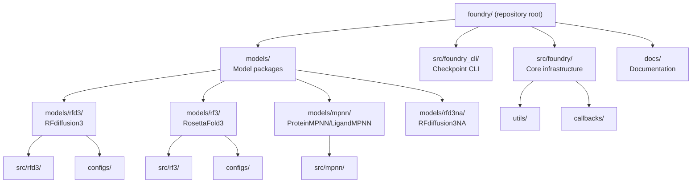
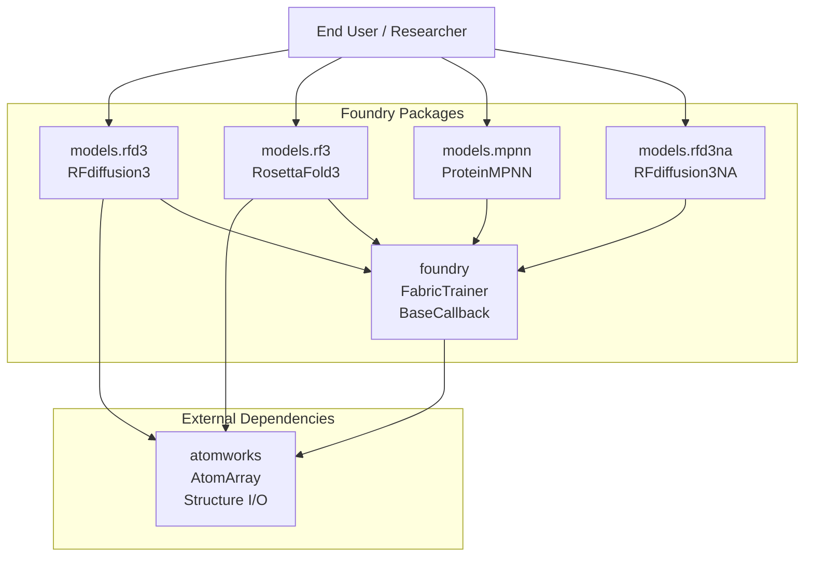
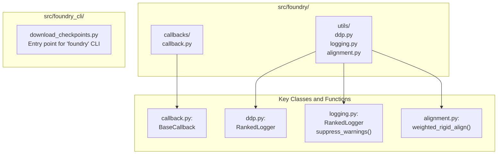
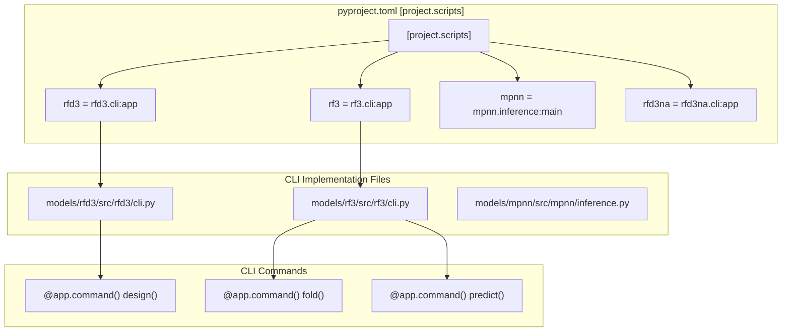
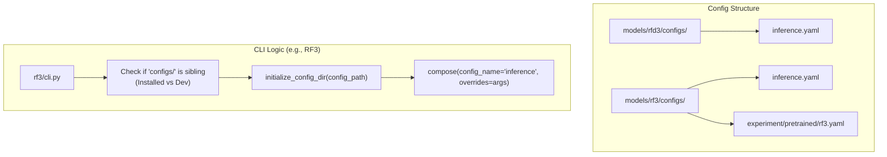
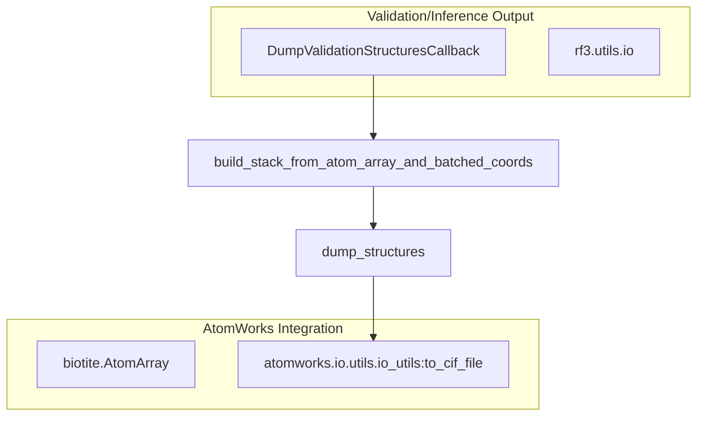

# Project Structure

> **Relevant source files**
> * [.gitmodules](https://github.com/RosettaCommons/foundry/blob/cee116dc/.gitmodules)
> * [CONTRIBUTING.md](https://github.com/RosettaCommons/foundry/blob/cee116dc/CONTRIBUTING.md?plain=1)
> * [docs/docs_requirements.txt](https://github.com/RosettaCommons/foundry/blob/cee116dc/docs/docs_requirements.txt)
> * [docs/source/_static/ga.js](https://github.com/RosettaCommons/foundry/blob/cee116dc/docs/source/_static/ga.js)
> * [docs/source/conf.py](https://github.com/RosettaCommons/foundry/blob/cee116dc/docs/source/conf.py)
> * [docs/source/contributing_link.rst](https://github.com/RosettaCommons/foundry/blob/cee116dc/docs/source/contributing_link.rst)
> * [docs/source/index.rst](https://github.com/RosettaCommons/foundry/blob/cee116dc/docs/source/index.rst)
> * [models/rf3/configs/experiment/pretrained/rf3.yaml](https://github.com/RosettaCommons/foundry/blob/cee116dc/models/rf3/configs/experiment/pretrained/rf3.yaml)
> * [models/rf3/src/rf3/callbacks/dump_validation_structures.py](https://github.com/RosettaCommons/foundry/blob/cee116dc/models/rf3/src/rf3/callbacks/dump_validation_structures.py)
> * [models/rf3/src/rf3/cli.py](https://github.com/RosettaCommons/foundry/blob/cee116dc/models/rf3/src/rf3/cli.py)
> * [models/rf3/src/rf3/utils/io.py](https://github.com/RosettaCommons/foundry/blob/cee116dc/models/rf3/src/rf3/utils/io.py)
> * [models/rfd3/src/rfd3/cli.py](https://github.com/RosettaCommons/foundry/blob/cee116dc/models/rfd3/src/rfd3/cli.py)
> * [pyproject.toml](https://github.com/RosettaCommons/foundry/blob/cee116dc/pyproject.toml)

This page documents the organization of the Foundry repository, including the directory layout, package dependencies, and relationships between components. For information about setting up a development environment, see [Development Setup](/RosettaCommons/foundry/11.2-development-setup). For details about specific model implementations, refer to [RFdiffusion3 (RFD3)](/RosettaCommons/foundry/4-rfdiffusion3-(rfd3)), [RosettaFold3 (RF3)](/RosettaCommons/foundry/5-rosettafold3-(rf3)), and [ProteinMPNN and LigandMPNN](/RosettaCommons/foundry/6-proteinmpnn-and-ligandmpnn).

## Repository Organization

Foundry is organized as a multi-package repository with a strict dependency hierarchy. The core `rc-foundry` package provides shared training infrastructure and utilities, while individual model packages (`rfd3`, `rf3`, `mpnn`, `rfd3na`) are independently installable and depend on both `foundry` and `atomworks` [CONTRIBUTING.md L12-L18](https://github.com/RosettaCommons/foundry/blob/cee116dc/CONTRIBUTING.md?plain=1#L12-L18)

### Top-Level Directory Structure



**Sources:** [pyproject.toml L117-L124](https://github.com/RosettaCommons/foundry/blob/cee116dc/pyproject.toml#L117-L124)

 [CONTRIBUTING.md L12-L18](https://github.com/RosettaCommons/foundry/blob/cee116dc/CONTRIBUTING.md?plain=1#L12-L18)

### Package Dependency Flow

The repository enforces a strict dependency hierarchy to maintain clean separation of concerns:



**Key principle:** `foundry` → `atomworks` (one-way dependency). All models within Foundry use AtomWorks for manipulating and processing biomolecular structures in both training and inference [CONTRIBUTING.md L12-L18](https://github.com/RosettaCommons/foundry/blob/cee116dc/CONTRIBUTING.md?plain=1#L12-L18)

**Sources:** [CONTRIBUTING.md L12-L18](https://github.com/RosettaCommons/foundry/blob/cee116dc/CONTRIBUTING.md?plain=1#L12-L18)

 [pyproject.toml L47-L51](https://github.com/RosettaCommons/foundry/blob/cee116dc/pyproject.toml#L47-L51)

## Core Package Structure

The `foundry` package provides shared infrastructure used by all models:

**Diagram: Foundry Core Module Organization**



**Core modules:**

| Module | Key Classes/Functions | Purpose |
| --- | --- | --- |
| `foundry.callbacks` | `BaseCallback` | Base class for training/inference hooks [models/rf3/src/rf3/callbacks/dump_validation_structures.py L12-L15](https://github.com/RosettaCommons/foundry/blob/cee116dc/models/rf3/src/rf3/callbacks/dump_validation_structures.py#L12-L15) |
| `foundry.utils.logging` | `RankedLogger`, `suppress_warnings()` | Centralized logging and warning management [models/rf3/src/rf3/cli.py L21-L23](https://github.com/RosettaCommons/foundry/blob/cee116dc/models/rf3/src/rf3/cli.py#L21-L23) |
| `foundry.utils.alignment` | `weighted_rigid_align()` | Rigid body alignment for trajectories [models/rf3/src/rf3/utils/io.py L12](https://github.com/RosettaCommons/foundry/blob/cee116dc/models/rf3/src/rf3/utils/io.py#L12-L12) |
| `foundry_cli` | `download_checkpoints:app` | Checkpoint management CLI [pyproject.toml L94](https://github.com/RosettaCommons/foundry/blob/cee116dc/pyproject.toml#L94-L94) |

**Sources:** [pyproject.toml L89-L94](https://github.com/RosettaCommons/foundry/blob/cee116dc/pyproject.toml#L89-L94)

 [models/rf3/src/rf3/callbacks/dump_validation_structures.py L12-L15](https://github.com/RosettaCommons/foundry/blob/cee116dc/models/rf3/src/rf3/callbacks/dump_validation_structures.py#L12-L15)

 [models/rf3/src/rf3/utils/io.py L12](https://github.com/RosettaCommons/foundry/blob/cee116dc/models/rf3/src/rf3/utils/io.py#L12-L12)

## Model Package Structure

Each model package under `models/` is treated as an independent package with its own `src/` and `configs/` [CONTRIBUTING.md L61-L70](https://github.com/RosettaCommons/foundry/blob/cee116dc/CONTRIBUTING.md?plain=1#L61-L70)

### Model-Specific Entry Points

Each model provides its own CLI entry point through `pyproject.toml`:

**Diagram: CLI Entry Points and Implementation**



| Model | Command | Entry Point | Implementation |
| --- | --- | --- | --- |
| RFD3 | `rfd3 design` | `rfd3.cli:app` | [models/rfd3/src/rfd3/cli.py L9-L12](https://github.com/RosettaCommons/foundry/blob/cee116dc/models/rfd3/src/rfd3/cli.py#L9-L12) |
| RF3 | `rf3 fold` / `rf3 predict` | `rf3.cli:app` | [models/rf3/src/rf3/cli.py L9-L83](https://github.com/RosettaCommons/foundry/blob/cee116dc/models/rf3/src/rf3/cli.py#L9-L83) |
| MPNN | `mpnn` | `mpnn.inference:main` | [pyproject.toml L93](https://github.com/RosettaCommons/foundry/blob/cee116dc/pyproject.toml#L93-L93) |
| RFD3NA | `rfd3na` | `rfd3na.cli:app` | [pyproject.toml L92](https://github.com/RosettaCommons/foundry/blob/cee116dc/pyproject.toml#L92-L92) |

**Sources:** [pyproject.toml L89-L94](https://github.com/RosettaCommons/foundry/blob/cee116dc/pyproject.toml#L89-L94)

 [models/rfd3/src/rfd3/cli.py L1-L48](https://github.com/RosettaCommons/foundry/blob/cee116dc/models/rfd3/src/rfd3/cli.py#L1-L48)

 [models/rf3/src/rf3/cli.py L1-L87](https://github.com/RosettaCommons/foundry/blob/cee116dc/models/rf3/src/rf3/cli.py#L1-L87)

## Configuration System

Foundry uses Hydra for configuration. Model CLIs locate their configs by checking for development vs. installed modes [models/rf3/src/rf3/cli.py L25-L39](https://github.com/RosettaCommons/foundry/blob/cee116dc/models/rf3/src/rf3/cli.py#L25-L39)

**Diagram: Hydra Configuration Resolution**



**Key configuration handling:**

* **Dynamic Config Paths:** CLIs like `rf3` and `rfd3` automatically detect if they are running from a source checkout or an installed site-package to find the correct `configs/` directory [models/rf3/src/rf3/cli.py L28-L39](https://github.com/RosettaCommons/foundry/blob/cee116dc/models/rf3/src/rf3/cli.py#L28-L39)  [models/rfd3/src/rfd3/cli.py L18-L24](https://github.com/RosettaCommons/foundry/blob/cee116dc/models/rfd3/src/rfd3/cli.py#L18-L24)
* **Default Engines:** CLIs ensure a default `inference_engine` is set if not provided in overrides (e.g., `inference_engine=rf3`) [models/rf3/src/rf3/cli.py L53-L59](https://github.com/RosettaCommons/foundry/blob/cee116dc/models/rf3/src/rf3/cli.py#L53-L59)  [models/rfd3/src/rfd3/cli.py L30-L34](https://github.com/RosettaCommons/foundry/blob/cee116dc/models/rfd3/src/rfd3/cli.py#L30-L34)

**Sources:** [models/rf3/src/rf3/cli.py L25-L69](https://github.com/RosettaCommons/foundry/blob/cee116dc/models/rf3/src/rf3/cli.py#L25-L69)

 [models/rfd3/src/rfd3/cli.py L14-L43](https://github.com/RosettaCommons/foundry/blob/cee116dc/models/rfd3/src/rfd3/cli.py#L14-L43)

### Build and Packaging

The repository uses `hatchling` as the build backend and explicitly includes model source and config directories in the wheel [pyproject.toml L102-L124](https://github.com/RosettaCommons/foundry/blob/cee116dc/pyproject.toml#L102-L124)

```markdown
[tool.hatch.build.targets.wheel]packages = [  "src/foundry",  "src/foundry_cli",  "models/rf3/src/rf3",  "models/rfd3/src/rfd3",  # ...] [tool.hatch.build.targets.wheel.force-include]"models/rfd3na/configs" = "rfd3na/configs""models/rfd3/configs" = "rfd3/configs""models/rf3/configs" = "rf3/configs"
```

**Sources:** [pyproject.toml L116-L130](https://github.com/RosettaCommons/foundry/blob/cee116dc/pyproject.toml#L116-L130)

## Data Flow and I/O Utilities

Models share I/O patterns for structure generation and validation.

**Diagram: Structure Output Flow**



**Key I/O Functions:**

* `build_stack_from_atom_array_and_batched_coords`: Converts raw coordinates into a `biotite.AtomArrayStack` and handles `chain_id` adjustments for multiple transformations [models/rf3/src/rf3/utils/io.py L61-L94](https://github.com/RosettaCommons/foundry/blob/cee116dc/models/rf3/src/rf3/utils/io.py#L61-L94)
* `dump_structures`: High-level wrapper to save structures to CIF/PDB, supporting single or multi-model files [models/rf3/src/rf3/utils/io.py L97-L138](https://github.com/RosettaCommons/foundry/blob/cee116dc/models/rf3/src/rf3/utils/io.py#L97-L138)
* `dump_trajectories`: Handles denoising trajectories, including rigid alignment to the final prediction [models/rf3/src/rf3/utils/io.py L141-L174](https://github.com/RosettaCommons/foundry/blob/cee116dc/models/rf3/src/rf3/utils/io.py#L141-L174)

**Sources:** [models/rf3/src/rf3/utils/io.py L61-L174](https://github.com/RosettaCommons/foundry/blob/cee116dc/models/rf3/src/rf3/utils/io.py#L61-L174)

 [models/rf3/src/rf3/callbacks/dump_validation_structures.py L15-L101](https://github.com/RosettaCommons/foundry/blob/cee116dc/models/rf3/src/rf3/callbacks/dump_validation_structures.py#L15-L101)

## Contributing a New Model

To add a new model to the Foundry ecosystem:

1. Create `models/<model_name>/` with a `pyproject.toml` [CONTRIBUTING.md L67](https://github.com/RosettaCommons/foundry/blob/cee116dc/CONTRIBUTING.md?plain=1#L67-L67)
2. Add `rc-foundry` as a dependency [CONTRIBUTING.md L68](https://github.com/RosettaCommons/foundry/blob/cee116dc/CONTRIBUTING.md?plain=1#L68-L68)
3. Implement logic in `models/<model_name>/src/` [CONTRIBUTING.md L69](https://github.com/RosettaCommons/foundry/blob/cee116dc/CONTRIBUTING.md?plain=1#L69-L69)
4. Add the package to the root `pyproject.toml` wheel targets for distribution [pyproject.toml L116-L124](https://github.com/RosettaCommons/foundry/blob/cee116dc/pyproject.toml#L116-L124)

**Sources:** [CONTRIBUTING.md L61-L70](https://github.com/RosettaCommons/foundry/blob/cee116dc/CONTRIBUTING.md?plain=1#L61-L70)

 [pyproject.toml L116-L124](https://github.com/RosettaCommons/foundry/blob/cee116dc/pyproject.toml#L116-L124)