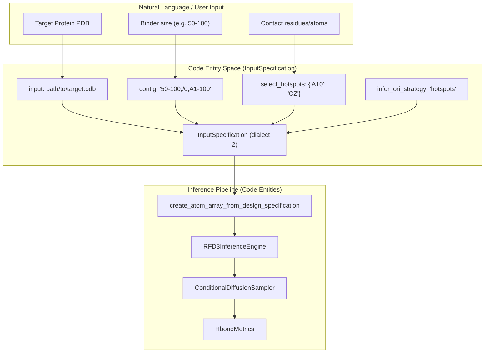
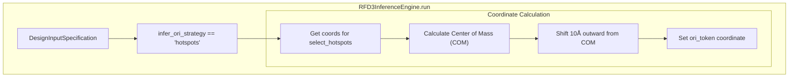

# Protein Binder Design

> **Relevant source files**
> * [models/rfd3/docs/.assets/conditioning.png](https://github.com/RosettaCommons/foundry/blob/cee116dc/models/rfd3/docs/.assets/conditioning.png)
> * [models/rfd3/docs/.assets/input_selection.png](https://github.com/RosettaCommons/foundry/blob/cee116dc/models/rfd3/docs/.assets/input_selection.png)
> * [models/rfd3/docs/.assets/partial_diff.png](https://github.com/RosettaCommons/foundry/blob/cee116dc/models/rfd3/docs/.assets/partial_diff.png)
> * [models/rfd3/docs/tutorials/enzyme_design_tutorial.md](https://github.com/RosettaCommons/foundry/blob/cee116dc/models/rfd3/docs/tutorials/enzyme_design_tutorial.md?plain=1)
> * [models/rfd3/docs/tutorials/enzyme_tutorial_files/outputs.zip](https://github.com/RosettaCommons/foundry/blob/cee116dc/models/rfd3/docs/tutorials/enzyme_tutorial_files/outputs.zip)
> * [models/rfd3/docs/tutorials/enzyme_tutorial_files/rfd3_enzyme_tutorial.json](https://github.com/RosettaCommons/foundry/blob/cee116dc/models/rfd3/docs/tutorials/enzyme_tutorial_files/rfd3_enzyme_tutorial.json)
> * [models/rfd3/docs/tutorials/na_binder_tutorial.md](https://github.com/RosettaCommons/foundry/blob/cee116dc/models/rfd3/docs/tutorials/na_binder_tutorial.md?plain=1)
> * [models/rfd3/docs/tutorials/ppi_design_tutorial.md](https://github.com/RosettaCommons/foundry/blob/cee116dc/models/rfd3/docs/tutorials/ppi_design_tutorial.md?plain=1)

## Purpose and Scope

This document describes how to design protein binders using RFdiffusion3 (RFD3). Protein binder design involves generating novel protein scaffolds that bind to a specific target protein at designated interface residues (hotspots). This page focuses on the configuration and execution of protein-protein interaction design tasks using hotspot conditioning.

For small molecule binder design, see [Small Molecule Binder Design](/RosettaCommons/foundry/4.4.2-small-molecule-binder-design). For enzyme design using unindexed motifs, see [Enzyme Design](/RosettaCommons/foundry/4.4.3-enzyme-design). For general RFD3 capabilities, see [RFD3 Overview and Capabilities](/RosettaCommons/foundry/4.1-rfd3-overview-and-capabilities).

Sources: [models/rfd3/docs/tutorials/ppi_design_tutorial.md L1-L23](https://github.com/RosettaCommons/foundry/blob/cee116dc/models/rfd3/docs/tutorials/ppi_design_tutorial.md?plain=1#L1-L23)

 [models/rfd3/README.md L46-L49](https://github.com/RosettaCommons/foundry/blob/cee116dc/models/rfd3/README.md?plain=1#L46-L49)

## Overview

Protein binder design with RFD3 uses hotspot-guided conditional diffusion to generate protein backbones that form interfaces with target proteins. The model conditions generation on:

1. **Target structure**: Fixed coordinates of the target protein provided via the `input` field.
2. **Hotspot residues**: Specific atoms on the target that should be contacted by the binder, specified in `select_hotspots`.
3. **Binder length**: Desired length range for the generated binder, defined in the `contig` string or `length` field.
4. **Origin placement**: Strategic positioning of the binder relative to hotspots using `infer_ori_strategy`.

**Key Design Pattern**: Hotspot-conditioned diffusion



Sources: [models/rfd3/docs/tutorials/ppi_design_tutorial.md L38-L96](https://github.com/RosettaCommons/foundry/blob/cee116dc/models/rfd3/docs/tutorials/ppi_design_tutorial.md?plain=1#L38-L96)

 [models/rfd3/docs/input.md L1-L185](https://github.com/RosettaCommons/foundry/blob/cee116dc/models/rfd3/docs/input.md?plain=1#L1-L185)

## InputSpecification Parameters

Protein binder design requires specific `InputSpecification` fields. While tutorials often show YAML format, the underlying schema is the `InputSpecification` class.

### Core Parameters

| Parameter | Type | Description | Required |
| --- | --- | --- | --- |
| `input` | `str` | Path to target protein PDB/CIF file [models/rfd3/docs/tutorials/ppi_design_tutorial.md L48-L51](https://github.com/RosettaCommons/foundry/blob/cee116dc/models/rfd3/docs/tutorials/ppi_design_tutorial.md?plain=1#L48-L51) | Yes |
| `contig` | `str` | Binder length range and target selection [models/rfd3/docs/tutorials/ppi_design_tutorial.md L58-L65](https://github.com/RosettaCommons/foundry/blob/cee116dc/models/rfd3/docs/tutorials/ppi_design_tutorial.md?plain=1#L58-L65) | Yes |
| `select_hotspots` | `Dict` | Hotspot atoms for interface design [models/rfd3/docs/tutorials/ppi_design_tutorial.md L71-L79](https://github.com/RosettaCommons/foundry/blob/cee116dc/models/rfd3/docs/tutorials/ppi_design_tutorial.md?plain=1#L71-L79) | Yes |
| `infer_ori_strategy` | `str` | Origin placement strategy: `"hotspots"` [models/rfd3/docs/tutorials/ppi_design_tutorial.md L88-L92](https://github.com/RosettaCommons/foundry/blob/cee116dc/models/rfd3/docs/tutorials/ppi_design_tutorial.md?plain=1#L88-L92) | Recommended |
| `is_non_loopy` | `bool` | Reduces loop content in designed binder [models/rfd3/docs/tutorials/ppi_design_tutorial.md L93-L96](https://github.com/RosettaCommons/foundry/blob/cee116dc/models/rfd3/docs/tutorials/ppi_design_tutorial.md?plain=1#L93-L96) | Recommended |

### Contig Specification Format

The `contig` field for binder design follows the pattern:
`"<binder_length_range>,/0,<target_chain><target_start>-<target_end>"`

* **Binder length range**: `"40-120"` specifies the length of the generated binder.
* **Chain break**: `/0` indicates a chain break between the binder and target.
* **Target selection**: `"E6-155"` selects residues 6-155 from chain E of the input.

Sources: [models/rfd3/docs/tutorials/ppi_design_tutorial.md L58-L65](https://github.com/RosettaCommons/foundry/blob/cee116dc/models/rfd3/docs/tutorials/ppi_design_tutorial.md?plain=1#L58-L65)

 [models/rfd3/docs/input.md L44-L67](https://github.com/RosettaCommons/foundry/blob/cee116dc/models/rfd3/docs/input.md?plain=1#L44-L67)

## Hotspot Selection

Hotspots define the specific atoms on the target protein that should be contacted by the generated binder. RFD3 was trained to produce structures where hotspots are typically at most 4.5 Å from any heavy atom on the binder [models/rfd3/docs/tutorials/ppi_design_tutorial.md L71-L73](https://github.com/RosettaCommons/foundry/blob/cee116dc/models/rfd3/docs/tutorials/ppi_design_tutorial.md?plain=1#L71-L73)

### Hotspot Format

The `select_hotspots` parameter maps residue identifiers to specific atoms:

```yaml
select_hotspots:    E64: CD2,CZ    E88: CG,CZ    E96: CD1,CZ
```

**Key components**:

* **Residue identifier**: `"E64"` = chain E, residue 64.
* **Atom names**: Comma-separated list of atom names.
* **Requirement**: Residues used as hotspots must be included in the `contig` string [models/rfd3/docs/tutorials/ppi_design_tutorial.md L85-L87](https://github.com/RosettaCommons/foundry/blob/cee116dc/models/rfd3/docs/tutorials/ppi_design_tutorial.md?plain=1#L85-L87)

Sources: [models/rfd3/docs/tutorials/ppi_design_tutorial.md L71-L87](https://github.com/RosettaCommons/foundry/blob/cee116dc/models/rfd3/docs/tutorials/ppi_design_tutorial.md?plain=1#L71-L87)

 [models/rfd3/docs/input.md L57-L60](https://github.com/RosettaCommons/foundry/blob/cee116dc/models/rfd3/docs/input.md?plain=1#L57-L60)

## Origin Placement Strategy

The `infer_ori_strategy` parameter controls the placement of the "ORI token", which specifies the center of mass of the designed portion of the output structure [models/rfd3/docs/tutorials/enzyme_design_tutorial.md L71-L73](https://github.com/RosettaCommons/foundry/blob/cee116dc/models/rfd3/docs/tutorials/enzyme_design_tutorial.md?plain=1#L71-L73)

### Strategy Comparison

| Strategy | Description |
| --- | --- |
| `"hotspots"` | Places the ORI token 10Å outward from the center of mass of the hotspots [models/rfd3/docs/tutorials/ppi_design_tutorial.md L88-L92](https://github.com/RosettaCommons/foundry/blob/cee116dc/models/rfd3/docs/tutorials/ppi_design_tutorial.md?plain=1#L88-L92) |
| `"com"` | Centers origin at the center of mass of the target protein. |
| `Manual` | User provides explicit coordinates, e.g., `"ori_token": [0,1,0]` [models/rfd3/docs/tutorials/enzyme_design_tutorial.md L73](https://github.com/RosettaCommons/foundry/blob/cee116dc/models/rfd3/docs/tutorials/enzyme_design_tutorial.md?plain=1#L73-L73) |

### Hotspots Strategy Implementation



Sources: [models/rfd3/docs/tutorials/ppi_design_tutorial.md L88-L92](https://github.com/RosettaCommons/foundry/blob/cee116dc/models/rfd3/docs/tutorials/ppi_design_tutorial.md?plain=1#L88-L92)

 [models/rfd3/docs/tutorials/enzyme_design_tutorial.md L71-L82](https://github.com/RosettaCommons/foundry/blob/cee116dc/models/rfd3/docs/tutorials/enzyme_design_tutorial.md?plain=1#L71-L82)

## Execution and Workflow

### Command-Line Execution

Run protein binder design using the `rfd3 design` command:

```
rfd3 design \    out_dir=outputs/binder \    inputs=ppi_tutorial.yaml
```

### Workflow Stages

1. **Input Parsing**: `create_atom_array_from_design_specification` parses the YAML/JSON and creates an `AtomArray` with hotspot annotations.
2. **Inference**: `RFD3InferenceEngine` executes the diffusion sampling, utilizing the `ConditionalDiffusionSampler`.
3. **Validation**: Post-generation, hydrogen bond metrics are calculated using the `HbondMetrics` class, which interfaces with the `HBPLUS` external tool [models/rfd3/src/rfd3/metrics/hbonds_hbplus_metrics.py L109-L218](https://github.com/RosettaCommons/foundry/blob/cee116dc/models/rfd3/src/rfd3/metrics/hbonds_hbplus_metrics.py#L109-L218)

Sources: [models/rfd3/README.md L18-L31](https://github.com/RosettaCommons/foundry/blob/cee116dc/models/rfd3/README.md?plain=1#L18-L31)

 [models/rfd3/docs/input.md L99-L111](https://github.com/RosettaCommons/foundry/blob/cee116dc/models/rfd3/docs/input.md?plain=1#L99-L111)

## Interface Validation

RFD3 evaluates the generated binder-target interface using hydrogen bond patterns.

**Key metrics** (from `HbondMetrics`):

| Metric | Description |
| --- | --- |
| `num_hbonds` | Total hydrogen bonds at the motif-diffused interface [models/rfd3/src/rfd3/metrics/hbonds_hbplus_metrics.py L218](https://github.com/RosettaCommons/foundry/blob/cee116dc/models/rfd3/src/rfd3/metrics/hbonds_hbplus_metrics.py#L218-L218) |
| `correct_donor_percent` | Fraction of predicted donor atoms matching target hotspots [models/rfd3/src/rfd3/metrics/hbonds_hbplus_metrics.py L109](https://github.com/RosettaCommons/foundry/blob/cee116dc/models/rfd3/src/rfd3/metrics/hbonds_hbplus_metrics.py#L109-L109) |
| `correct_acceptor_percent` | Fraction of predicted acceptor atoms matching target hotspots [models/rfd3/src/rfd3/metrics/hbonds_hbplus_metrics.py L110](https://github.com/RosettaCommons/foundry/blob/cee116dc/models/rfd3/src/rfd3/metrics/hbonds_hbplus_metrics.py#L110-L110) |

**Requirement**: The `HBPLUS` tool must be configured in the `.env` file via the `HBPLUS_PATH` variable.

Sources: [models/rfd3/src/rfd3/metrics/hbonds_hbplus_metrics.py L1-L309](https://github.com/RosettaCommons/foundry/blob/cee116dc/models/rfd3/src/rfd3/metrics/hbonds_hbplus_metrics.py#L1-L309)

 [models/rfd3/README.md L117-L122](https://github.com/RosettaCommons/foundry/blob/cee116dc/models/rfd3/README.md?plain=1#L117-L122)

## Best Practices for Binder Design

* **Scientific Intuition**: Hotspot selection should be based on literature or structural knowledge of catalytic/functional residues [models/rfd3/docs/tutorials/ppi_design_tutorial.md L71-L73](https://github.com/RosettaCommons/foundry/blob/cee116dc/models/rfd3/docs/tutorials/ppi_design_tutorial.md?plain=1#L71-L73)
* **Loop Control**: Always set `is_non_loopy: true` for PPI design to improve the structural integrity of the binder [models/rfd3/docs/tutorials/ppi_design_tutorial.md L93-L95](https://github.com/RosettaCommons/foundry/blob/cee116dc/models/rfd3/docs/tutorials/ppi_design_tutorial.md?plain=1#L93-L95)
* **Coordinate Constraints**: Use `select_fixed_atoms` if specific residues on the target need to maintain precise geometries relative to the interface [models/rfd3/docs/tutorials/enzyme_design_tutorial.md L83-L94](https://github.com/RosettaCommons/foundry/blob/cee116dc/models/rfd3/docs/tutorials/enzyme_design_tutorial.md?plain=1#L83-L94)
* **Unindexed Motifs**: If a specific functional motif must be present in the binder but its sequence position is unknown, use the `unindex` option [models/rfd3/docs/tutorials/enzyme_design_tutorial.md L60-L63](https://github.com/RosettaCommons/foundry/blob/cee116dc/models/rfd3/docs/tutorials/enzyme_design_tutorial.md?plain=1#L60-L63)

Sources: [models/rfd3/docs/tutorials/ppi_design_tutorial.md L71-L96](https://github.com/RosettaCommons/foundry/blob/cee116dc/models/rfd3/docs/tutorials/ppi_design_tutorial.md?plain=1#L71-L96)

 [models/rfd3/docs/tutorials/enzyme_design_tutorial.md L60-L94](https://github.com/RosettaCommons/foundry/blob/cee116dc/models/rfd3/docs/tutorials/enzyme_design_tutorial.md?plain=1#L60-L94)