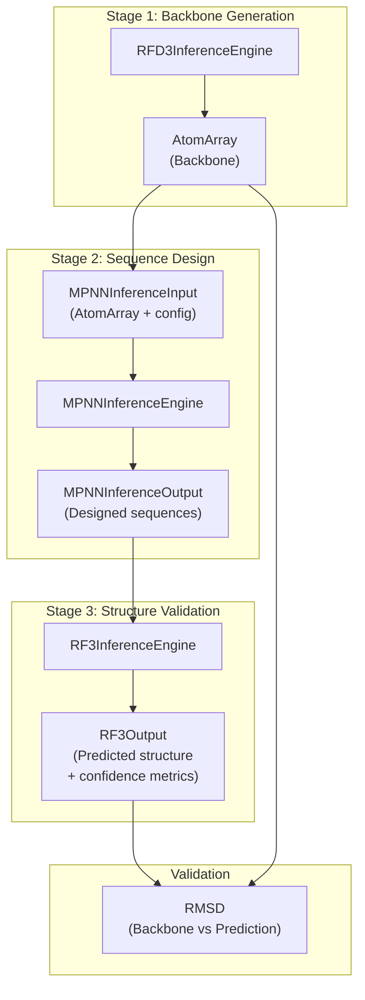
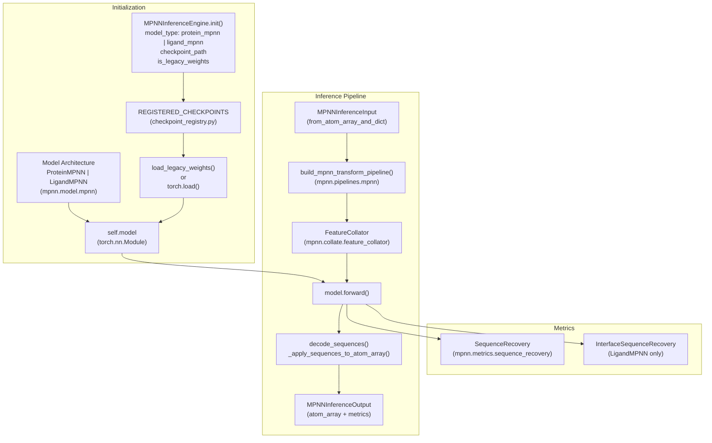
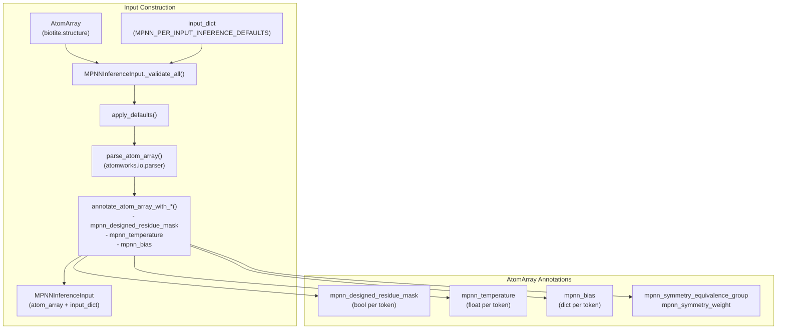
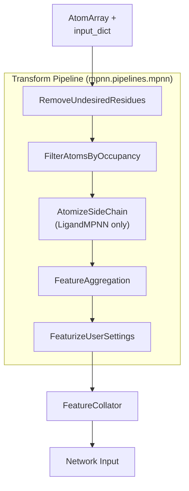

# ProteinMPNN and LigandMPNN

> **Relevant source files**
> * [models/mpnn/README.md](https://github.com/RosettaCommons/foundry/blob/cee116dc/models/mpnn/README.md?plain=1)
> * [models/mpnn/src/mpnn/__init__.py](https://github.com/RosettaCommons/foundry/blob/cee116dc/models/mpnn/src/mpnn/__init__.py)
> * [models/mpnn/src/mpnn/inference_engines/mpnn.py](https://github.com/RosettaCommons/foundry/blob/cee116dc/models/mpnn/src/mpnn/inference_engines/mpnn.py)
> * [models/mpnn/src/mpnn/loss/nll_loss.py](https://github.com/RosettaCommons/foundry/blob/cee116dc/models/mpnn/src/mpnn/loss/nll_loss.py)
> * [models/mpnn/src/mpnn/model/mpnn.py](https://github.com/RosettaCommons/foundry/blob/cee116dc/models/mpnn/src/mpnn/model/mpnn.py)
> * [models/mpnn/src/mpnn/utils/inference.py](https://github.com/RosettaCommons/foundry/blob/cee116dc/models/mpnn/src/mpnn/utils/inference.py)
> * [src/foundry/utils/ddp.py](https://github.com/RosettaCommons/foundry/blob/cee116dc/src/foundry/utils/ddp.py)

This document provides an overview of the ProteinMPNN and LigandMPNN sequence design models in the Foundry ecosystem. These models perform inverse folding: given a protein backbone structure, they design amino acid sequences likely to fold into that structure.

For detailed configuration options, see [MPNN Configuration](/RosettaCommons/foundry/6.2-mpnn-configuration). For running inference workflows, see [MPNN Inference](/RosettaCommons/foundry/6.3-mpnn-inference).

---

## Purpose and Role in Foundry

ProteinMPNN enables protein sequence design given a fixed backbone structure. LigandMPNN extends this to enable sequence design in the context of ligands (small molecules, ions, DNA/RNA, etc.) [models/mpnn/README.md L9-L14](https://github.com/RosettaCommons/foundry/blob/cee116dc/models/mpnn/README.md?plain=1#L9-L14)

 They represent the second stage in a typical three-stage protein design workflow:

1. **Backbone Generation** (RFdiffusion3) - Generate novel protein backbones
2. **Sequence Design** (ProteinMPNN/LigandMPNN) - Design sequences for the backbone
3. **Structure Validation** (RosettaFold3) - Validate designability by predicting structure from sequence

The key difference between the two models:

* **ProteinMPNN**: Designs sequences for protein-only structures [models/mpnn/src/mpnn/model/mpnn.py L19-L22](https://github.com/RosettaCommons/foundry/blob/cee116dc/models/mpnn/src/mpnn/model/mpnn.py#L19-L22)
* **LigandMPNN**: Handles ligands, nucleic acids, and other non-protein molecules in the design context [models/mpnn/src/mpnn/model/mpnn.py L220-L223](https://github.com/RosettaCommons/foundry/blob/cee116dc/models/mpnn/src/mpnn/model/mpnn.py#L220-L223)

Sources: [models/mpnn/README.md L9-L16](https://github.com/RosettaCommons/foundry/blob/cee116dc/models/mpnn/README.md?plain=1#L9-L16)

 [models/mpnn/src/mpnn/inference_engines/mpnn.py L37-L56](https://github.com/RosettaCommons/foundry/blob/cee116dc/models/mpnn/src/mpnn/inference_engines/mpnn.py#L37-L56)

---

## Three-Model Workflow

**MPNN's Role**: Given a fixed backbone structure, MPNN predicts amino acid sequences. The model can design all residues or selectively design certain regions while keeping others fixed [models/mpnn/src/mpnn/utils/inference.py L71-L75](https://github.com/RosettaCommons/foundry/blob/cee116dc/models/mpnn/src/mpnn/utils/inference.py#L71-L75)

Sources: [models/mpnn/README.md L9-L16](https://github.com/RosettaCommons/foundry/blob/cee116dc/models/mpnn/README.md?plain=1#L9-L16)

 [models/mpnn/src/mpnn/inference_engines/mpnn.py L37-L56](https://github.com/RosettaCommons/foundry/blob/cee116dc/models/mpnn/src/mpnn/inference_engines/mpnn.py#L37-L56)

---

## Model Architecture

### MPNNInferenceEngine

The `MPNNInferenceEngine` class [models/mpnn/src/mpnn/inference_engines/mpnn.py L37-L40](https://github.com/RosettaCommons/foundry/blob/cee116dc/models/mpnn/src/mpnn/inference_engines/mpnn.py#L37-L40)

 manages the complete inference workflow:

* **Model Selection**: `_build_and_load_model()` instantiates either `ProteinMPNN` or `LigandMPNN` [models/mpnn/src/mpnn/inference_engines/mpnn.py L156-L163](https://github.com/RosettaCommons/foundry/blob/cee116dc/models/mpnn/src/mpnn/inference_engines/mpnn.py#L156-L163)
* **Weight Loading**: Supports legacy weights via `load_legacy_weights()` [models/mpnn/src/mpnn/inference_engines/mpnn.py L166-L168](https://github.com/RosettaCommons/foundry/blob/cee116dc/models/mpnn/src/mpnn/inference_engines/mpnn.py#L166-L168)  or standard Foundry checkpoints [models/mpnn/src/mpnn/inference_engines/mpnn.py L170-L183](https://github.com/RosettaCommons/foundry/blob/cee116dc/models/mpnn/src/mpnn/inference_engines/mpnn.py#L170-L183)
* **Metrics**: `_build_metrics_manager()` constructs `SequenceRecovery` and `InterfaceSequenceRecovery` metrics [models/mpnn/src/mpnn/inference_engines/mpnn.py L190-L199](https://github.com/RosettaCommons/foundry/blob/cee116dc/models/mpnn/src/mpnn/inference_engines/mpnn.py#L190-L199)

Sources: [models/mpnn/src/mpnn/inference_engines/mpnn.py L37-L199](https://github.com/RosettaCommons/foundry/blob/cee116dc/models/mpnn/src/mpnn/inference_engines/mpnn.py#L37-L199)

 [models/mpnn/src/mpnn/model/mpnn.py L19-L223](https://github.com/RosettaCommons/foundry/blob/cee116dc/models/mpnn/src/mpnn/model/mpnn.py#L19-L223)

---

## Key Components

### Model Types

The inference engine supports two primary model architectures:

| Model | Purpose | Input Support | Legacy Checkpoint Example |
| --- | --- | --- | --- |
| `protein_mpnn` | Protein-only design | Protein chains | `proteinmpnn_v_48_020.pt` |
| `ligand_mpnn` | Ligand-aware design | Proteins, ligands, nucleic acids, ions | `ligandmpnn_v_32_010_25.pt` |

Sources: [models/mpnn/src/mpnn/inference_engines/mpnn.py L83](https://github.com/RosettaCommons/foundry/blob/cee116dc/models/mpnn/src/mpnn/inference_engines/mpnn.py#L83-L83)

 [models/mpnn/README.md L31-L88](https://github.com/RosettaCommons/foundry/blob/cee116dc/models/mpnn/README.md?plain=1#L31-L88)

### Input Handling: MPNNInferenceInput

The `MPNNInferenceInput` dataclass handles input preparation, including parsing structures and applying user annotations like temperature and design masks [models/mpnn/src/mpnn/utils/inference.py L677-L742](https://github.com/RosettaCommons/foundry/blob/cee116dc/models/mpnn/src/mpnn/utils/inference.py#L677-L742)

Sources: [models/mpnn/src/mpnn/utils/inference.py L677-L1180](https://github.com/RosettaCommons/foundry/blob/cee116dc/models/mpnn/src/mpnn/utils/inference.py#L677-L1180)

 [models/mpnn/src/mpnn/inference_engines/mpnn.py L204-L210](https://github.com/RosettaCommons/foundry/blob/cee116dc/models/mpnn/src/mpnn/inference_engines/mpnn.py#L204-L210)

### Configuration Defaults

The inference system uses a two-tier default configuration:

**Global Defaults** (`MPNN_GLOBAL_INFERENCE_DEFAULTS`):

* `model_type`, `checkpoint_path`, `is_legacy_weights`
* `out_directory`, `write_fasta`, `write_structures` [models/mpnn/src/mpnn/utils/inference.py L35-L46](https://github.com/RosettaCommons/foundry/blob/cee116dc/models/mpnn/src/mpnn/utils/inference.py#L35-L46)

**Per-Input Defaults** (`MPNN_PER_INPUT_INFERENCE_DEFAULTS`):

* Sampling parameters (`seed`, `batch_size`, `temperature`)
* Design scope (`fixed_residues`, `designed_residues`, etc.)
* Bias and Omission (`bias`, `omit`, `pair_bias`) [models/mpnn/src/mpnn/utils/inference.py L48-L90](https://github.com/RosettaCommons/foundry/blob/cee116dc/models/mpnn/src/mpnn/utils/inference.py#L48-L90)

Sources: [models/mpnn/src/mpnn/utils/inference.py L35-L90](https://github.com/RosettaCommons/foundry/blob/cee116dc/models/mpnn/src/mpnn/utils/inference.py#L35-L90)

---

## Design Control Features

### Design Scope Control

Users can control which residues are designed vs. fixed using four mutually exclusive options. If all are `None`, all residues are designed [models/mpnn/src/mpnn/utils/inference.py L71-L75](https://github.com/RosettaCommons/foundry/blob/cee116dc/models/mpnn/src/mpnn/utils/inference.py#L71-L75)

* `fixed_residues` / `designed_residues`: List of residue IDs.
* `fixed_chains` / `designed_chains`: List of chain IDs.

Sources: [models/mpnn/src/mpnn/utils/inference.py L71-L75](https://github.com/RosettaCommons/foundry/blob/cee116dc/models/mpnn/src/mpnn/utils/inference.py#L71-L75)

 [models/mpnn/src/mpnn/utils/inference.py L360-L389](https://github.com/RosettaCommons/foundry/blob/cee116dc/models/mpnn/src/mpnn/utils/inference.py#L360-L389)

### Bias and Omission

| Feature | Description | Granularity |
| --- | --- | --- |
| `bias` | Additive logit bias for specific amino acids | Global or per-residue |
| `omit` | Disallow certain amino acid types (default: `["UNK"]`) | Global or per-residue |
| `pair_bias` | Bias based on neighboring residue selections | Global or per-residue-pair |
| `temperature` | Sampling temperature (default: `0.1`) | Global or per-residue |

Sources: [models/mpnn/src/mpnn/utils/inference.py L77-L85](https://github.com/RosettaCommons/foundry/blob/cee116dc/models/mpnn/src/mpnn/utils/inference.py#L77-L85)

 [models/mpnn/src/mpnn/utils/inference.py L391-L464](https://github.com/RosettaCommons/foundry/blob/cee116dc/models/mpnn/src/mpnn/utils/inference.py#L391-L464)

---

## Output Structure

### MPNNInferenceOutput

Each designed sequence is returned as an `MPNNInferenceOutput` object [models/mpnn/src/mpnn/utils/inference.py L1183-L1281](https://github.com/RosettaCommons/foundry/blob/cee116dc/models/mpnn/src/mpnn/utils/inference.py#L1183-L1281)

:

* **atom_array**: The structure with designed sequence in `res_name`.
* **output_dict**: Contains `designed_sequence`, `sequence_recovery`, and `ligand_interface_seq_recovery`.
* **input_dict**: Original configuration for reproducibility.

Sources: [models/mpnn/src/mpnn/utils/inference.py L1183-L1281](https://github.com/RosettaCommons/foundry/blob/cee116dc/models/mpnn/src/mpnn/utils/inference.py#L1183-L1281)

 [models/mpnn/src/mpnn/inference_engines/mpnn.py L270-L276](https://github.com/RosettaCommons/foundry/blob/cee116dc/models/mpnn/src/mpnn/inference_engines/mpnn.py#L270-L276)

---

## Transform Pipeline

The MPNN transform pipeline prepares structures for inference through `build_mpnn_transform_pipeline()` [models/mpnn/src/mpnn/pipelines/mpnn.py L20](https://github.com/RosettaCommons/foundry/blob/cee116dc/models/mpnn/src/mpnn/pipelines/mpnn.py#L20-L20)

:

**FeaturizeUserSettings** processes design configuration from AtomArray annotations into network input features [models/mpnn/src/mpnn/transforms/feature_aggregation/user_settings.py L21-L348](https://github.com/RosettaCommons/foundry/blob/cee116dc/models/mpnn/src/mpnn/transforms/feature_aggregation/user_settings.py#L21-L348)

Sources: [models/mpnn/src/mpnn/inference_engines/mpnn.py L296-L315](https://github.com/RosettaCommons/foundry/blob/cee116dc/models/mpnn/src/mpnn/inference_engines/mpnn.py#L296-L315)

 [models/mpnn/src/mpnn/transforms/feature_aggregation/user_settings.py L21-L348](https://github.com/RosettaCommons/foundry/blob/cee116dc/models/mpnn/src/mpnn/transforms/feature_aggregation/user_settings.py#L21-L348)

---

## Training and Loss

MPNN models are trained using label-smoothed negative log likelihood loss [models/mpnn/src/mpnn/loss/nll_loss.py L5-L22](https://github.com/RosettaCommons/foundry/blob/cee116dc/models/mpnn/src/mpnn/loss/nll_loss.py#L5-L22)

| Loss Component | Description | Default |
| --- | --- | --- |
| `label_smoothing_eps` | Factor for label smoothing | 0.1 |
| `normalization_constant` | Constant used to normalize the loss | 6000.0 |

The loss is computed per-residue and masked by `mask_for_loss` before aggregation [models/mpnn/src/mpnn/loss/nll_loss.py L97-L114](https://github.com/RosettaCommons/foundry/blob/cee116dc/models/mpnn/src/mpnn/loss/nll_loss.py#L97-L114)

Sources: [models/mpnn/src/mpnn/loss/nll_loss.py L5-L122](https://github.com/RosettaCommons/foundry/blob/cee116dc/models/mpnn/src/mpnn/loss/nll_loss.py#L5-L122)

---

## Checkpoint Management

MPNN models use the Foundry checkpoint registry system [src/foundry/inference_engines/checkpoint_registry.py L80-L117](https://github.com/RosettaCommons/foundry/blob/cee116dc/src/foundry/inference_engines/checkpoint_registry.py#L80-L117)

:

| Key | Model Type | Training Noise ($\sigma$) |
| --- | --- | --- |
| `proteinmpnn` | `protein_mpnn` | 0.20 Å |
| `ligandmpnn` | `ligand_mpnn` | 0.10 Å |
| `solublempnn` | `protein_mpnn` | 0.20 Å |

When using weights from the original repositories, `is_legacy_weights` must be set to `True` [models/mpnn/README.md L127-L129](https://github.com/RosettaCommons/foundry/blob/cee116dc/models/mpnn/README.md?plain=1#L127-L129)

Sources: [src/foundry/inference_engines/checkpoint_registry.py L80-L117](https://github.com/RosettaCommons/foundry/blob/cee116dc/src/foundry/inference_engines/checkpoint_registry.py#L80-L117)

 [models/mpnn/README.md L31-L118](https://github.com/RosettaCommons/foundry/blob/cee116dc/models/mpnn/README.md?plain=1#L31-L118)