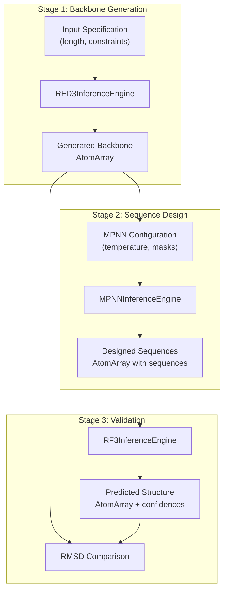
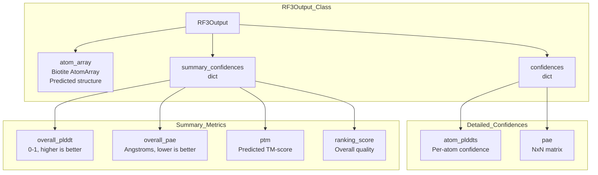
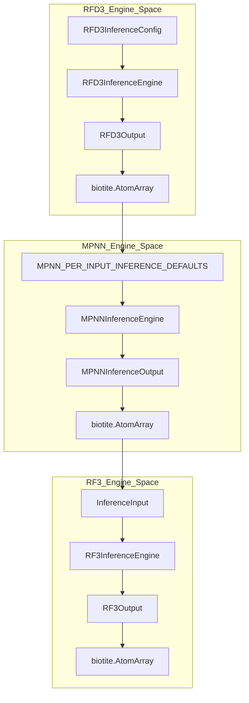

# Quick Start Tutorial

> **Relevant source files**
> * [docs/_static/superimposed_80_residue_protein.png](https://github.com/RosettaCommons/foundry/blob/cee116dc/docs/_static/superimposed_80_residue_protein.png)
> * [examples/all.ipynb](https://github.com/RosettaCommons/foundry/blob/cee116dc/examples/all.ipynb)
> * [examples/ipd_design_pipeline_collab.ipynb](https://github.com/RosettaCommons/foundry/blob/cee116dc/examples/ipd_design_pipeline_collab.ipynb)
> * [models/mpnn/README.md](https://github.com/RosettaCommons/foundry/blob/cee116dc/models/mpnn/README.md?plain=1)
> * [models/mpnn/src/mpnn/__init__.py](https://github.com/RosettaCommons/foundry/blob/cee116dc/models/mpnn/src/mpnn/__init__.py)
> * [models/mpnn/src/mpnn/loss/nll_loss.py](https://github.com/RosettaCommons/foundry/blob/cee116dc/models/mpnn/src/mpnn/loss/nll_loss.py)
> * [models/mpnn/src/mpnn/utils/inference.py](https://github.com/RosettaCommons/foundry/blob/cee116dc/models/mpnn/src/mpnn/utils/inference.py)
> * [models/rfd3/src/rfd3/engine.py](https://github.com/RosettaCommons/foundry/blob/cee116dc/models/rfd3/src/rfd3/engine.py)
> * [models/rfd3/src/rfd3/inference/datasets.py](https://github.com/RosettaCommons/foundry/blob/cee116dc/models/rfd3/src/rfd3/inference/datasets.py)
> * [models/rfd3/src/rfd3/utils/inference.py](https://github.com/RosettaCommons/foundry/blob/cee116dc/models/rfd3/src/rfd3/utils/inference.py)
> * [models/rfd3na/src/rfd3na/utils/inference.py](https://github.com/RosettaCommons/foundry/blob/cee116dc/models/rfd3na/src/rfd3na/utils/inference.py)

This tutorial demonstrates a complete *de novo* protein design workflow using Foundry's three core models: RFdiffusion3 (RFD3) for backbone generation, ProteinMPNN/LigandMPNN for sequence design, and RosettaFold3 (RF3) for structure validation. You will learn how to install the platform, download model checkpoints, and execute each step of the design pipeline programmatically.

For detailed model-specific usage patterns and advanced design applications, see:

* RFD3 design constraints and applications: [4.4](https://github.com/RosettaCommons/foundry/blob/cee116dc/4.4)
* MPNN configuration options: [6.2](https://github.com/RosettaCommons/foundry/blob/cee116dc/6.2)
* RF3 confidence metrics and interpretation: [5.4](https://github.com/RosettaCommons/foundry/blob/cee116dc/5.4)

---

## Installation

Install Foundry with all model dependencies:

```
pip install 'rc-foundry[all]'
```

For model-specific installations, use `rc-foundry[rfd3]`, `rc-foundry[rf3]`, or `rc-foundry[mpnn]` individually.

**Sources:** [examples/all.ipynb L30-L36](https://github.com/RosettaCommons/foundry/blob/cee116dc/examples/all.ipynb#L30-L36)

 [models/mpnn/README.md L18-L27](https://github.com/RosettaCommons/foundry/blob/cee116dc/models/mpnn/README.md?plain=1#L18-L27)

---

## Checkpoint Management

Download pre-trained model weights to a checkpoint directory. The default location is `~/.foundry/checkpoints`, configurable via the `FOUNDRY_CHECKPOINTS_DIR` environment variable.

```markdown
# Download all models (recommended for this tutorial)foundry install rfd3 ligandmpnn rf3
```

The `foundry` CLI provides checkpoint management commands:

* `foundry install <model>` - Download and verify checkpoints
* `foundry list-available` - Show available models
* `foundry list-installed` - Display installed checkpoints
* `foundry clean` - Remove downloaded checkpoints

**Sources:** [examples/all.ipynb L38-L44](https://github.com/RosettaCommons/foundry/blob/cee116dc/examples/all.ipynb#L38-L44)

 [examples/ipd_design_pipeline_collab.ipynb L29-L47](https://github.com/RosettaCommons/foundry/blob/cee116dc/examples/ipd_design_pipeline_collab.ipynb#L29-L47)

---

## Pipeline Overview

The complete protein design workflow follows a three-stage pipeline where `AtomArray` objects flow between models:

Title: Foundry Design Pipeline Flow



**Sources:** [examples/all.ipynb L8-L27](https://github.com/RosettaCommons/foundry/blob/cee116dc/examples/all.ipynb#L8-L27)

---

## Step 1: Generate Backbone with RFD3

RFdiffusion3 generates novel protein backbones using conditional diffusion. The inference engine is configured via `RFD3InferenceConfig` and returns `RFD3Output` objects containing `AtomArray` structures.

### Python API

```javascript
from rfd3.engine import RFD3InferenceConfig, RFD3InferenceEnginefrom lightning.fabric import seed_everything # Set reproducible seedseed_everything(0) # Configure backbone generationconfig = RFD3InferenceConfig(    specification={        'length': 80,  # Generate 80-residue protein    },    diffusion_batch_size=2,  # Number of structures per batch) # Initialize engine and generatemodel = RFD3InferenceEngine(**config)outputs = model.run(    inputs=None,        # None for unconditional generation    out_dir=None,       # None to return in-memory    n_batches=1,) # Extract generated backbonefirst_key = next(iter(outputs.keys()))atom_array = outputs[first_key][0].atom_array
```

**Key Classes:**

* `RFD3InferenceEngine` ([models/rfd3/src/rfd3/engine.py L139-L140](https://github.com/RosettaCommons/foundry/blob/cee116dc/models/rfd3/src/rfd3/engine.py#L139-L140) ): Main inference interface.
* `RFD3InferenceConfig` ([models/rfd3/src/rfd3/engine.py L44-L45](https://github.com/RosettaCommons/foundry/blob/cee116dc/models/rfd3/src/rfd3/engine.py#L44-L45) ): Configuration dataclass.
* `RFD3Output` ([models/rfd3/src/rfd3/engine.py L91-L92](https://github.com/RosettaCommons/foundry/blob/cee116dc/models/rfd3/src/rfd3/engine.py#L91-L92) ): Output container with `atom_array` and `metadata`.

**Sources:** [examples/all.ipynb L84-L106](https://github.com/RosettaCommons/foundry/blob/cee116dc/examples/all.ipynb#L84-L106)

 [models/rfd3/src/rfd3/engine.py L43-L138](https://github.com/RosettaCommons/foundry/blob/cee116dc/models/rfd3/src/rfd3/engine.py#L43-L138)

---

## Step 2: Design Sequence with MPNN

ProteinMPNN/LigandMPNN designs amino acid sequences that fold into the generated backbone. The engine processes `AtomArray` inputs and returns outputs with designed sequences.

### Python API

```javascript
from mpnn.inference_engines.mpnn import MPNNInferenceEngine # Configure MPNN inferenceengine_config = {    "model_type": "ligand_mpnn",      # or "protein_mpnn"    "is_legacy_weights": True,        # Required for current checkpoints    "out_directory": None,            # Return in-memory    "write_structures": False,    "write_fasta": False,} # Per-input configurationinput_configs = [{    "batch_size": 10,                 # Generate 10 sequences    "remove_waters": True,    "temperature": 0.1,               # Sampling temperature}] # Design sequencesmodel = MPNNInferenceEngine(**engine_config)mpnn_outputs = model.run(    input_dicts=input_configs,    atom_arrays=[atom_array])
```

### Configuration Options

| Parameter | Type | Description |
| --- | --- | --- |
| `batch_size` | `int` | Number of sequences to generate per structure ([models/mpnn/src/mpnn/utils/inference.py L203](https://github.com/RosettaCommons/foundry/blob/cee116dc/models/mpnn/src/mpnn/utils/inference.py#L203-L203) <br> ) |
| `temperature` | `float` | Sampling temperature (default: 0.1) ([models/mpnn/src/mpnn/utils/inference.py L84](https://github.com/RosettaCommons/foundry/blob/cee116dc/models/mpnn/src/mpnn/utils/inference.py#L84-L84) <br> ) |
| `fixed_residues` | `list` | Residue IDs to keep fixed ([models/mpnn/src/mpnn/utils/inference.py L72](https://github.com/RosettaCommons/foundry/blob/cee116dc/models/mpnn/src/mpnn/utils/inference.py#L72-L72) <br> ) |
| `designed_chains` | `list` | Chain IDs to redesign ([models/mpnn/src/mpnn/utils/inference.py L75](https://github.com/RosettaCommons/foundry/blob/cee116dc/models/mpnn/src/mpnn/utils/inference.py#L75-L75) <br> ) |

**Key Entities:**

* `MPNNInferenceEngine`: Main inference interface ([models/mpnn/src/mpnn/inference_engines/mpnn.py](https://github.com/RosettaCommons/foundry/blob/cee116dc/models/mpnn/src/mpnn/inference_engines/mpnn.py) ).
* `MPNN_GLOBAL_INFERENCE_DEFAULTS`: Global settings like `model_type` and `checkpoint_path` ([models/mpnn/src/mpnn/utils/inference.py L35-L46](https://github.com/RosettaCommons/foundry/blob/cee116dc/models/mpnn/src/mpnn/utils/inference.py#L35-L46) ).
* `MPNN_PER_INPUT_INFERENCE_DEFAULTS`: Per-structure settings like `seed` and `batch_size` ([models/mpnn/src/mpnn/utils/inference.py L48-L90](https://github.com/RosettaCommons/foundry/blob/cee116dc/models/mpnn/src/mpnn/utils/inference.py#L48-L90) ).

**Sources:** [examples/all.ipynb L169-L192](https://github.com/RosettaCommons/foundry/blob/cee116dc/examples/all.ipynb#L169-L192)

 [models/mpnn/src/mpnn/utils/inference.py L35-L90](https://github.com/RosettaCommons/foundry/blob/cee116dc/models/mpnn/src/mpnn/utils/inference.py#L35-L90)

---

## Step 3: Validate with RF3

RosettaFold3 predicts the structure from the designed sequence to validate designability.

### Python API

```javascript
from rf3.inference_engines.rf3 import RF3InferenceEnginefrom rf3.utils.inference import InferenceInput # Initialize RF3 inference engineinference_engine = RF3InferenceEngine(    ckpt_path='rf3',    verbose=False) # Create input from MPNN-designed structureinput_structure = InferenceInput.from_atom_array(    atom_array,    example_id="designed_protein") # Predict structurerf3_outputs = inference_engine.run(inputs=input_structure) # Extract top-ranked predictionrf3_output = rf3_outputs["designed_protein"][0]predicted_structure = rf3_output.atom_array
```

### Understanding RF3 Outputs

Title: RF3 Output Data Structure



**Sources:** [examples/all.ipynb L243-L300](https://github.com/RosettaCommons/foundry/blob/cee116dc/examples/all.ipynb#L243-L300)

 [models/rf3/README.md](https://github.com/RosettaCommons/foundry/blob/cee116dc/models/rf3/README.md?plain=1)

---

## Step 4: Analyze Results

Validate the design by comparing the RF3-predicted structure against the RFD3-generated backbone using RMSD.

### RMSD Calculation

```javascript
from biotite.structure import rmsd, superimposefrom atomworks.constants import PROTEIN_BACKBONE_ATOM_NAMESimport numpy as np # Filter to backbone atoms (N, CA, C, O)aa_generated = atom_array  # Original RFD3 backboneaa_refolded = rf3_output.atom_array  # RF3 prediction bb_generated = aa_generated[    np.isin(aa_generated.atom_name, PROTEIN_BACKBONE_ATOM_NAMES)]bb_refolded = aa_refolded[    np.isin(aa_refolded.atom_name, PROTEIN_BACKBONE_ATOM_NAMES)] # Superimpose and calculate RMSDbb_refolded_fitted, _ = superimpose(bb_generated, bb_refolded)rmsd_value = rmsd(bb_generated, bb_refolded_fitted) print(f"Backbone RMSD: {rmsd_value:.2f} Å")
```

| RMSD (Å) | Interpretation |
| --- | --- |
| < 1.0 | Excellent designability |
| 1.0-2.0 | Good designability |
| > 2.0 | Moderate to poor designability |

**Sources:** [examples/all.ipynb L341-L383](https://github.com/RosettaCommons/foundry/blob/cee116dc/examples/all.ipynb#L341-L383)

---

## Complete Workflow Diagram

Title: End-to-End Code Entity Flow



**Sources:** [models/rfd3/src/rfd3/engine.py L44-L140](https://github.com/RosettaCommons/foundry/blob/cee116dc/models/rfd3/src/rfd3/engine.py#L44-L140)

 [models/mpnn/src/mpnn/utils/inference.py L48-L90](https://github.com/RosettaCommons/foundry/blob/cee116dc/models/mpnn/src/mpnn/utils/inference.py#L48-L90)

 [examples/all.ipynb L1-L426](https://github.com/RosettaCommons/foundry/blob/cee116dc/examples/all.ipynb#L1-L426)