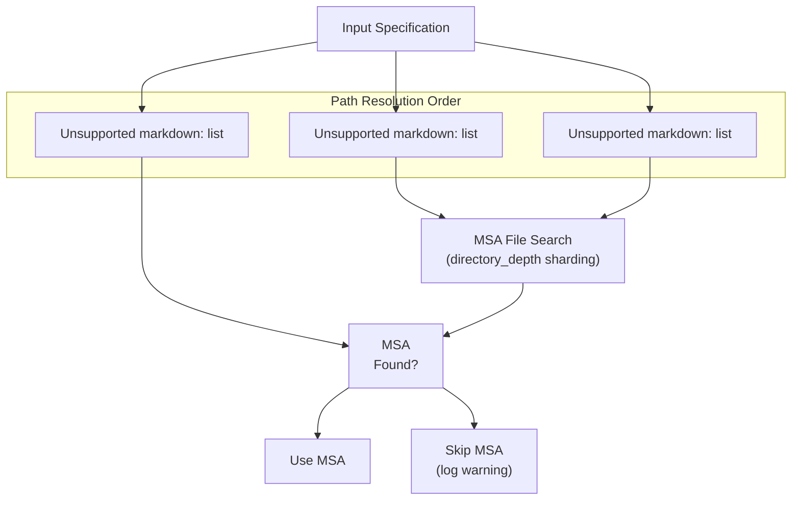
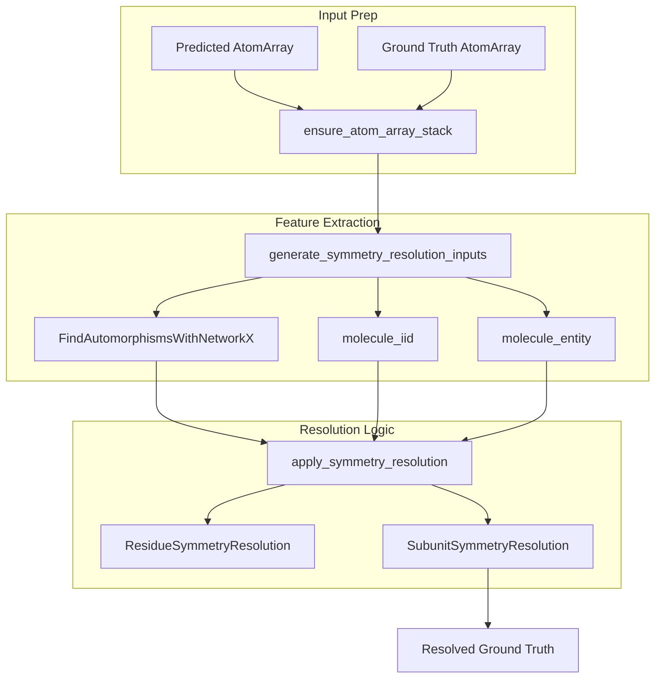

# RF3 Data Pipeline

> **Relevant source files**
> * [models/rf3/configs/datasets/train/disorder_distillation.yaml](https://github.com/RosettaCommons/foundry/blob/cee116dc/models/rf3/configs/datasets/train/disorder_distillation.yaml)
> * [models/rf3/configs/datasets/train/domain_distillation.yaml](https://github.com/RosettaCommons/foundry/blob/cee116dc/models/rf3/configs/datasets/train/domain_distillation.yaml)
> * [models/rf3/configs/datasets/train/monomer_distillation.yaml](https://github.com/RosettaCommons/foundry/blob/cee116dc/models/rf3/configs/datasets/train/monomer_distillation.yaml)
> * [models/rf3/configs/datasets/train/na_complex_distillation.yaml](https://github.com/RosettaCommons/foundry/blob/cee116dc/models/rf3/configs/datasets/train/na_complex_distillation.yaml)
> * [models/rf3/configs/datasets/train/rna_monomer_distillation.yaml](https://github.com/RosettaCommons/foundry/blob/cee116dc/models/rf3/configs/datasets/train/rna_monomer_distillation.yaml)
> * [models/rf3/configs/datasets/val/af3_ab_set.yaml](https://github.com/RosettaCommons/foundry/blob/cee116dc/models/rf3/configs/datasets/val/af3_ab_set.yaml)
> * [models/rf3/configs/datasets/val/af3_validation.yaml](https://github.com/RosettaCommons/foundry/blob/cee116dc/models/rf3/configs/datasets/val/af3_validation.yaml)
> * [models/rf3/configs/datasets/val/base.yaml](https://github.com/RosettaCommons/foundry/blob/cee116dc/models/rf3/configs/datasets/val/base.yaml)
> * [models/rf3/configs/datasets/val/runs_and_poses.yaml](https://github.com/RosettaCommons/foundry/blob/cee116dc/models/rf3/configs/datasets/val/runs_and_poses.yaml)
> * [models/rf3/configs/inference_engine/base.yaml](https://github.com/RosettaCommons/foundry/blob/cee116dc/models/rf3/configs/inference_engine/base.yaml)
> * [models/rf3/configs/inference_engine/rf3.yaml](https://github.com/RosettaCommons/foundry/blob/cee116dc/models/rf3/configs/inference_engine/rf3.yaml)
> * [models/rf3/configs/paths/data/default.yaml](https://github.com/RosettaCommons/foundry/blob/cee116dc/models/rf3/configs/paths/data/default.yaml)
> * [models/rf3/src/rf3/data/extra_xforms.py](https://github.com/RosettaCommons/foundry/blob/cee116dc/models/rf3/src/rf3/data/extra_xforms.py)
> * [models/rf3/src/rf3/data/pipelines.py](https://github.com/RosettaCommons/foundry/blob/cee116dc/models/rf3/src/rf3/data/pipelines.py)
> * [models/rf3/src/rf3/inference.py](https://github.com/RosettaCommons/foundry/blob/cee116dc/models/rf3/src/rf3/inference.py)
> * [models/rf3/src/rf3/inference_engines/rf3.py](https://github.com/RosettaCommons/foundry/blob/cee116dc/models/rf3/src/rf3/inference_engines/rf3.py)
> * [models/rf3/src/rf3/symmetry/resolve.py](https://github.com/RosettaCommons/foundry/blob/cee116dc/models/rf3/src/rf3/symmetry/resolve.py)
> * [models/rf3/src/rf3/utils/inference.py](https://github.com/RosettaCommons/foundry/blob/cee116dc/models/rf3/src/rf3/utils/inference.py)

This page documents the RF3 data sources, MSA databases, dataset configuration, and path management. It explains where training data comes from, how MSA databases are accessed, and how the Transform pipeline processes inputs into model-ready features.

For information about preparing inputs for the pipeline, see [Input Preparation and Selection](/RosettaCommons/foundry/5.3-input-preparation-and-selection). For inference execution details, see [RF3 Inference](/RosettaCommons/foundry/5.2-rf3-inference). For training configuration, see [RF3 Training](/RosettaCommons/foundry/5.8-rf3-training).

## Data Sources

RF3 training relies on multiple data sources including PDB splits and distillation datasets. All paths are configured through YAML files in `models/rf3/configs/paths/data/`.

### Training Dataset Sources

RF3 uses several curated datasets for training:

| Dataset | Configuration Path | Purpose | Default Path |
| --- | --- | --- | --- |
| **PDB Splits** | `pdb_data_dir` | Primary training data with diverse protein structures | `/projects/ml/datahub/dfs/af3_splits/2025_07_13` |
| **Monomer Distillation** | `monomer_distillation_data_dir` | AlphaFold2 distillation from Facebook | `/squash/af2_distillation_facebook` |
| **MGnify Distillation** | `mgnify_distillation_data_dir` | Metagenomics distillation | `/squash/mgnify_distill_rf3/` |
| **NA Complex Distillation** | `na_complex_distillation_data_dir` | Nucleic acid-protein complex distillation | `/projects/ml/prot_dna/rf3_newDL` |
| **Disorder Distillation** | `disorder_distill_parquet_dir` | Intrinsically disordered protein regions | `/projects/ml/disorder_distill` |

**PDB Splits** are the primary training source, containing time-split datasets to prevent leakage. The splits are organized by date and contain both training and validation sets.

**Distillation Datasets** provide additional training signal from predicted structures. These datasets include:

* **Monomer Distillation**: High-confidence AF2 predictions on Facebook monomer dataset [models/rf3/configs/datasets/train/monomer_distillation.yaml L22-L24](https://github.com/RosettaCommons/foundry/blob/cee116dc/models/rf3/configs/datasets/train/monomer_distillation.yaml#L22-L24)
* **MGnify**: Metagenomic sequences from MGnify database [models/rf3/configs/paths/data/default.yaml L12-L13](https://github.com/RosettaCommons/foundry/blob/cee116dc/models/rf3/configs/paths/data/default.yaml#L12-L13)
* **NA Complex**: Protein-DNA/RNA complexes for nucleic acid binding training [models/rf3/configs/datasets/train/na_complex_distillation.yaml](https://github.com/RosettaCommons/foundry/blob/cee116dc/models/rf3/configs/datasets/train/na_complex_distillation.yaml)
* **Disorder**: Disordered regions for improved flexibility modeling [models/rf3/configs/datasets/train/disorder_distillation.yaml](https://github.com/RosettaCommons/foundry/blob/cee116dc/models/rf3/configs/datasets/train/disorder_distillation.yaml)

Each distillation dataset has both a primary directory (`*_data_dir`) and a parquet metadata directory (`*_parquet_dir`) for efficient indexing.

**Sources:** [models/rf3/configs/paths/data/default.yaml L1-L21](https://github.com/RosettaCommons/foundry/blob/cee116dc/models/rf3/configs/paths/data/default.yaml#L1-L21)

 [models/rf3/configs/datasets/train/monomer_distillation.yaml L1-L24](https://github.com/RosettaCommons/foundry/blob/cee116dc/models/rf3/configs/datasets/train/monomer_distillation.yaml#L1-L24)

### MSA Database Configuration

RF3 requires Multiple Sequence Alignments (MSAs) for protein and RNA chains. MSA paths are configured through `protein_msa_dirs` and `rna_msa_dirs` in the data paths configuration.

**Protein MSA Directories:**

```
protein_msa_dirs:  - {"dir": "/projects/msa/hhblits", "extension": ".a3m.gz", "directory_depth": 2}  - {"dir": "/projects/msa/mmseqs_gpu", "extension": ".a3m.gz", "directory_depth": 2}  - {"dir": "/projects/msa/lab", "extension": ".a3m.gz", "directory_depth": 1}
```

**RNA MSA Directories:**

```
rna_msa_dirs:  - {"dir": "/projects/msa/rna", "extension": ".afa", "directory_depth": 0}
```

Each directory specification includes:

* `dir`: Root directory path for MSA files
* `extension`: File extension (`.a3m.gz` for protein, `.afa` for RNA)
* `directory_depth`: Subdirectory nesting level for hashing

The `directory_depth` parameter controls the sharding structure. For example, `directory_depth: 2` with chain ID `A1234` would look for the MSA at `<dir>/A1/23/A1234.a3m.gz`.

**Sources:** [models/rf3/configs/paths/data/default.yaml L23-L36](https://github.com/RosettaCommons/foundry/blob/cee116dc/models/rf3/configs/paths/data/default.yaml#L23-L36)

## MSA Path Management

MSA paths can be specified through multiple mechanisms, with a clear precedence order.

### MSA Path Resolution



**Precedence Order:**

1. **Per-Chain MSA Paths**: If `chain_info` contains an `msa_path` key for a chain, that path is used directly [models/rf3/src/rf3/utils/inference.py L190-L193](https://github.com/RosettaCommons/foundry/blob/cee116dc/models/rf3/src/rf3/utils/inference.py#L190-L193)
2. **Environment Variable**: The `LOCAL_MSA_DIRS` environment variable overrides YAML configuration [models/rf3/src/rf3/inference_engines/rf3.py L282-L315](https://github.com/RosettaCommons/foundry/blob/cee116dc/models/rf3/src/rf3/inference_engines/rf3.py#L282-L315)
3. **YAML Configuration**: Default paths from `protein_msa_dirs` and `rna_msa_dirs` [models/rf3/configs/paths/data/default.yaml L23-L36](https://github.com/RosettaCommons/foundry/blob/cee116dc/models/rf3/configs/paths/data/default.yaml#L23-L36)

### Environment Variable Override

The `RF3InferenceEngine` checks for the `LOCAL_MSA_DIRS` environment variable during initialization. The `get_msa_dirs_from_env` function retrieves MSA directories from this environment variable, which should be a colon-separated list of directory paths.

**Example:**

```javascript
export LOCAL_MSA_DIRS="/path/to/msas1:/path/to/msas2"
```

This mechanism allows runtime override without modifying configuration files, useful for different cluster environments or user-specific MSA collections.

**Sources:** [models/rf3/src/rf3/inference_engines/rf3.py L282-L315](https://github.com/RosettaCommons/foundry/blob/cee116dc/models/rf3/src/rf3/inference_engines/rf3.py#L282-L315)

 [models/rf3/src/rf3/utils/inference.py L17-L19](https://github.com/RosettaCommons/foundry/blob/cee116dc/models/rf3/src/rf3/utils/inference.py#L17-L19)

### MSA Search Algorithm

The MSA loading pipeline uses `get_msa_depth_and_ext_from_folder` to automatically detect directory structure and file extensions. The search follows this algorithm:

1. Extract chain ID from `chain_info`.
2. Compute sharding path based on `directory_depth`.
3. Search for files matching the expected extension.
4. Load first matching MSA file.
5. If no MSA found and `raise_if_missing_msa_for_protein_of_length_n` is set, raise error for proteins longer than threshold [models/rf3/src/rf3/data/pipelines.py L187](https://github.com/RosettaCommons/foundry/blob/cee116dc/models/rf3/src/rf3/data/pipelines.py#L187-L187)

For example, with `directory_depth: 2` and chain ID `A1B2C3`:

* Searches in `<dir>/A1/B2/A1B2C3.a3m.gz`.

The `LoadPolymerMSAs` transform [models/rf3/src/rf3/data/pipelines.py L94](https://github.com/RosettaCommons/foundry/blob/cee116dc/models/rf3/src/rf3/data/pipelines.py#L94-L94)

 handles this search process and loads matching MSAs into memory.

**Sources:** [models/rf3/src/rf3/inference_engines/rf3.py L305-L315](https://github.com/RosettaCommons/foundry/blob/cee116dc/models/rf3/src/rf3/inference_engines/rf3.py#L305-L315)

 [models/rf3/src/rf3/data/pipelines.py L94-L187](https://github.com/RosettaCommons/foundry/blob/cee116dc/models/rf3/src/rf3/data/pipelines.py#L94-L187)

## Dataset Configuration

RF3 datasets are configured through Hydra's compositional config system, with base configurations inherited and overridden for specific use cases.

### Base Dataset Configuration

The base dataset configuration defines parameters shared across all datasets, such as diffusion batching and recycling counts.

**Example Base Parameters:**

* `n_recycles_train`: 4
* `n_recycles_validation`: 10
* `n_msa`: 1024
* `crop_size`: 384

**Sources:** [models/rf3/configs/datasets/val/base.yaml L1-L33](https://github.com/RosettaCommons/foundry/blob/cee116dc/models/rf3/configs/datasets/val/base.yaml#L1-L33)

### Distillation Datasets

Distillation datasets like `monomer_distillation` use the `StructuralDatasetWrapper` to wrap a `PandasDataset` which loads structural metadata from parquet files [models/rf3/configs/datasets/train/monomer_distillation.yaml L4-L24](https://github.com/RosettaCommons/foundry/blob/cee116dc/models/rf3/configs/datasets/train/monomer_distillation.yaml#L4-L24)

```
monomer_distillation:  dataset:    _target_: atomworks.ml.datasets.StructuralDatasetWrapper    dataset:      _target_: atomworks.ml.datasets.PandasDataset      data: ${paths.data.monomer_distillation_parquet_dir}/af2_distillation_facebook.parquet    transform:      _target_: ${datasets.pipeline_target}      is_inference: False      protein_msa_dirs: [{"dir": "${paths.data.monomer_distillation_data_dir}/msa", "extension": ".a3m", "directory_depth": 2}]
```

**Sources:** [models/rf3/configs/datasets/train/monomer_distillation.yaml L4-L31](https://github.com/RosettaCommons/foundry/blob/cee116dc/models/rf3/configs/datasets/train/monomer_distillation.yaml#L4-L31)

## Pipeline Architecture

The RF3 data pipeline is built using the `build_af3_transform_pipeline` function, which constructs a sequence of composable transforms that process structures end-to-end.

### Pipeline Entry Point

The main pipeline builder is `build_af3_transform_pipeline` in `models/rf3/src/rf3/data/pipelines.py` [models/rf3/src/rf3/data/pipelines.py L128](https://github.com/RosettaCommons/foundry/blob/cee116dc/models/rf3/src/rf3/data/pipelines.py#L128-L128)

 which accepts configuration parameters and returns a `Compose` transform pipeline.

| Category | Parameters | Purpose |
| --- | --- | --- |
| **Mode** | `is_inference` | Controls training vs inference behavior |
| **Cropping** | `crop_size`, `crop_contiguous_probability` | Spatial and contiguous cropping configuration |
| **MSA** | `protein_msa_dirs`, `n_msa` | MSA loading and subsampling |
| **Conditioning** | `p_unconditional`, `template_noise_scales` | Ground truth templating probabilities |
| **Diffusion** | `sigma_data`, `diffusion_batch_size` | Noise sampling parameters |

**Sources:** [models/rf3/src/rf3/data/pipelines.py L128-L192](https://github.com/RosettaCommons/foundry/blob/cee116dc/models/rf3/src/rf3/data/pipelines.py#L128-L192)

### Pipeline Flow Diagram

```mermaid
flowchart TD

Input["InferenceInput<br>(atom_array, chain_info)"]
AddData["AddData<br>(is_inference)"]
RemoveH["RemoveHydrogens"]
FilterPoly["RemovePolymersWithTooFewResolvedResidues"]
FlagNonPoly["FlagNonPolymersForAtomization"]
AtomizeByCCD["AtomizeByCCDName"]
RandomAtomize["RandomAtomizeResidues"]
PreCropHash["annotate_pre_crop_hash"]
CropRoute["CropContiguousLikeAF3<br>OR<br>CropSpatialLikeAF3"]
PostCropHash["annotate_post_crop_hash"]
GTConformer["RandomApplyGroundTruthConformerByChainType"]
AddTokens["AddGlobalTokenIdAnnotation"]
LoadCache["LoadCachedResidueLevelData"]
EncodeTokens["EncodeAF3TokenLevelFeatures"]
AtomEmbed["FeaturizeAtomLevelEmbeddings"]
LoadMSA["LoadPolymerMSAs"]
PairMSA["PairAndMergePolymerMSAs"]
EncodeMSA["EncodeMSA"]
FeaturizeMSA["FeaturizeMSALikeAF3"]
Aggregate["AggregateFeaturesLikeAF3"]
Batch["BatchStructuresForDiffusionNoising"]
SampleNoise["SampleEDMNoise"]
Output["Pipeline Output<br>(feats, noise, ground_truth)"]

Input --> AddData
FilterPoly --> FlagNonPoly
RandomAtomize --> PreCropHash
PostCropHash --> GTConformer
GTConformer --> AddTokens
AtomEmbed --> LoadMSA
FeaturizeMSA --> Aggregate
SampleNoise --> Output

subgraph subGraph6 ["Diffusion Setup"]
    Aggregate
    Batch
    SampleNoise
    Aggregate --> Batch
    Batch --> SampleNoise
end

subgraph subGraph5 ["MSA Processing"]
    LoadMSA
    PairMSA
    EncodeMSA
    FeaturizeMSA
    LoadMSA --> PairMSA
    PairMSA --> EncodeMSA
    EncodeMSA --> FeaturizeMSA
end

subgraph subGraph4 ["Feature Generation"]
    AddTokens
    LoadCache
    EncodeTokens
    AtomEmbed
    AddTokens --> LoadCache
    LoadCache --> EncodeTokens
    EncodeTokens --> AtomEmbed
end

subgraph Templating ["Templating"]
    GTConformer
end

subgraph Cropping ["Cropping"]
    PreCropHash
    CropRoute
    PostCropHash
    PreCropHash --> CropRoute
    CropRoute --> PostCropHash
end

subgraph Atomization ["Atomization"]
    FlagNonPoly
    AtomizeByCCD
    RandomAtomize
    FlagNonPoly --> AtomizeByCCD
    AtomizeByCCD --> RandomAtomize
end

subgraph subGraph0 ["Initial Processing"]
    AddData
    RemoveH
    FilterPoly
    AddData --> RemoveH
    RemoveH --> FilterPoly
end
```



**Sources:** [models/rf3/src/rf3/data/pipelines.py L128-L558](https://github.com/RosettaCommons/foundry/blob/cee116dc/models/rf3/src/rf3/data/pipelines.py#L128-L558)

## Transform Pipeline Components

### Atomization

Atomization converts non-polymer residues into individual atoms for all-atom modeling. The process preserves standard amino acids, RNA, and DNA while converting ligands and non-standard residues into individual atom tokens using `AtomizeByCCDName` [models/rf3/src/rf3/data/pipelines.py L327-L332](https://github.com/RosettaCommons/foundry/blob/cee116dc/models/rf3/src/rf3/data/pipelines.py#L327-L332)

**Sources:** [models/rf3/src/rf3/data/pipelines.py L302-L336](https://github.com/RosettaCommons/foundry/blob/cee116dc/models/rf3/src/rf3/data/pipelines.py#L302-L336)

### Cropping

Cropping limits the structure size to fit model constraints. **Contiguous Cropping** (`CropContiguousLikeAF3`) selects a contiguous region of tokens, while **Spatial Cropping** (`CropSpatialLikeAF3`) selects tokens within a spatial radius [models/rf3/src/rf3/data/pipelines.py L342-L376](https://github.com/RosettaCommons/foundry/blob/cee116dc/models/rf3/src/rf3/data/pipelines.py#L342-L376)

The pre/post crop hash annotations enable tracking which atoms were affected by cropping [models/rf3/src/rf3/data/pipeline_utils.py L16-L42](https://github.com/RosettaCommons/foundry/blob/cee116dc/models/rf3/src/rf3/data/pipeline_utils.py#L16-L42)

**Sources:** [models/rf3/src/rf3/data/pipelines.py L342-L376](https://github.com/RosettaCommons/foundry/blob/cee116dc/models/rf3/src/rf3/data/pipelines.py#L342-L376)

 [models/rf3/src/rf3/data/pipeline_utils.py L16-L42](https://github.com/RosettaCommons/foundry/blob/cee116dc/models/rf3/src/rf3/data/pipeline_utils.py#L16-L42)

### Feature Generation

* **LoadCachedResidueLevelData**: Loads pre-computed MACE embeddings [models/rf3/src/rf3/data/pipelines.py L410-L413](https://github.com/RosettaCommons/foundry/blob/cee116dc/models/rf3/src/rf3/data/pipelines.py#L410-L413)
* **EncodeAF3TokenLevelFeatures**: Encodes token sequences using AF3's encoding scheme [models/rf3/src/rf3/data/pipelines.py L415](https://github.com/RosettaCommons/foundry/blob/cee116dc/models/rf3/src/rf3/data/pipelines.py#L415-L415)
* **FeaturizeAtomLevelEmbeddings**: Processes embeddings with dropout [models/rf3/src/rf3/data/pipelines.py L420-L425](https://github.com/RosettaCommons/foundry/blob/cee116dc/models/rf3/src/rf3/data/pipelines.py#L420-L425)

**Sources:** [models/rf3/src/rf3/data/pipelines.py L407-L432](https://github.com/RosettaCommons/foundry/blob/cee116dc/models/rf3/src/rf3/data/pipelines.py#L407-L432)

### MSA Processing

The MSA processing pipeline loads, pairs, and featurizes sequences:

* `LoadPolymerMSAs`: Searches and loads MSAs based on sharding depth [models/rf3/src/rf3/data/pipelines.py L435-L443](https://github.com/RosettaCommons/foundry/blob/cee116dc/models/rf3/src/rf3/data/pipelines.py#L435-L443)
* `PairAndMergePolymerMSAs`: Pairs MSAs across chains using a dense pairing strategy [models/rf3/src/rf3/data/pipelines.py L444-L445](https://github.com/RosettaCommons/foundry/blob/cee116dc/models/rf3/src/rf3/data/pipelines.py#L444-L445)
* `FeaturizeMSALikeAF3`: Subsamples MSA and adds recycling dimensions [models/rf3/src/rf3/data/pipelines.py L483-L487](https://github.com/RosettaCommons/foundry/blob/cee116dc/models/rf3/src/rf3/data/pipelines.py#L483-L487)
* `AddCyclicBonds`: Detects cyclic peptide bonds by checking spatial proximity of termini [models/rf3/src/rf3/data/cyclic_transform.py L9-L78](https://github.com/RosettaCommons/foundry/blob/cee116dc/models/rf3/src/rf3/data/cyclic_transform.py#L9-L78)

**Sources:** [models/rf3/src/rf3/data/pipelines.py L434-L472](https://github.com/RosettaCommons/foundry/blob/cee116dc/models/rf3/src/rf3/data/pipelines.py#L434-L472)

 [models/rf3/src/rf3/data/cyclic_transform.py L9-L78](https://github.com/RosettaCommons/foundry/blob/cee116dc/models/rf3/src/rf3/data/cyclic_transform.py#L9-L78)

## Symmetry Resolution

RF3 performs generalized symmetry resolution for both residue- and subunit-level symmetries to minimize RMSD between predicted and ground truth structures [models/rf3/src/rf3/symmetry/resolve.py L23-L28](https://github.com/RosettaCommons/foundry/blob/cee116dc/models/rf3/src/rf3/symmetry/resolve.py#L23-L28)

### Symmetry Resolution Flow



The process identifies automorphisms using NetworkX [models/rf3/src/rf3/symmetry/resolve.py L147](https://github.com/RosettaCommons/foundry/blob/cee116dc/models/rf3/src/rf3/symmetry/resolve.py#L147-L147)

 and applies the optimal coordinate transformation to the ground truth structure.

**Sources:** [models/rf3/src/rf3/symmetry/resolve.py L23-L152](https://github.com/RosettaCommons/foundry/blob/cee116dc/models/rf3/src/rf3/symmetry/resolve.py#L23-L152)

## Input Preparation

Inputs are converted to `InferenceInput` objects before processing.

### InferenceInput Class

The `InferenceInput` dataclass [models/rf3/src/rf3/utils/inference.py L61-L70](https://github.com/RosettaCommons/foundry/blob/cee116dc/models/rf3/src/rf3/utils/inference.py#L61-L70)

 encapsulates all information needed for inference:

* `atom_array`: Structure coordinates and annotations.
* `chain_info`: Chain metadata including MSA paths.
* `example_id`: Unique identifier.
* `template_selection`: Selection queries for templates.
* `ground_truth_conformer_selection`: Selection queries for conformers.

### Creation Methods

* `from_cif_path`: Loads from CIF/PDB files and resolves overrides [models/rf3/src/rf3/utils/inference.py L72-L142](https://github.com/RosettaCommons/foundry/blob/cee116dc/models/rf3/src/rf3/utils/inference.py#L72-L142)
* `from_json_dict`: Creates from JSON component specification [models/rf3/src/rf3/utils/inference.py L145-L205](https://github.com/RosettaCommons/foundry/blob/cee116dc/models/rf3/src/rf3/utils/inference.py#L145-L205)
* `prepare_inference_inputs_from_paths`: Loads multiple inputs in parallel using `ProcessPoolExecutor` [models/rf3/src/rf3/utils/inference.py L359-L426](https://github.com/RosettaCommons/foundry/blob/cee116dc/models/rf3/src/rf3/utils/inference.py#L359-L426)

**Sources:** [models/rf3/src/rf3/utils/inference.py L61-L426](https://github.com/RosettaCommons/foundry/blob/cee116dc/models/rf3/src/rf3/utils/inference.py#L61-L426)