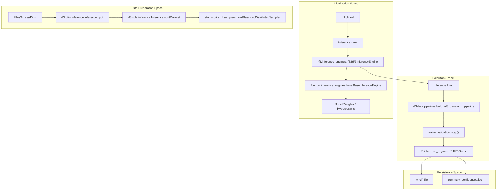
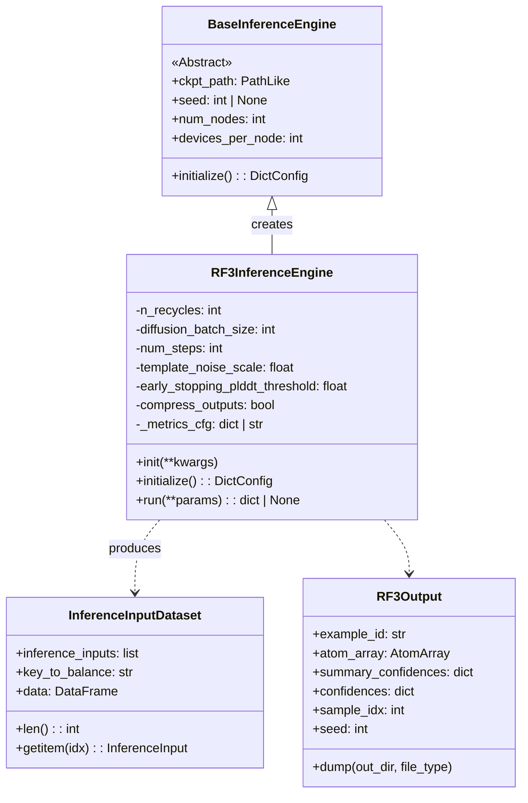
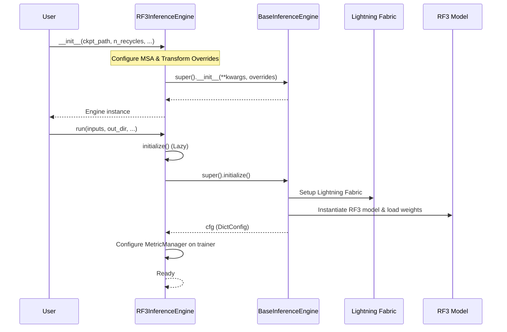
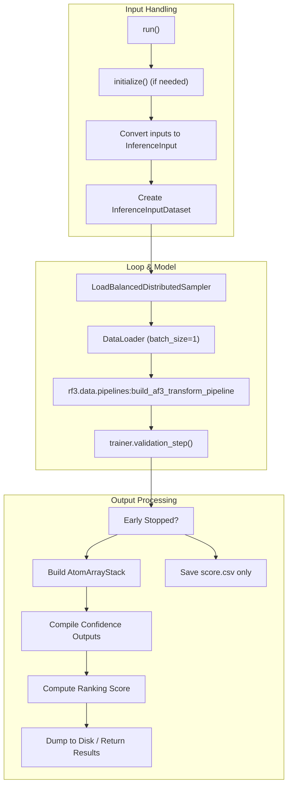

# RF3 Inference

> **Relevant source files**
> * [models/rf3/configs/experiment/pretrained/rf3.yaml](https://github.com/RosettaCommons/foundry/blob/cee116dc/models/rf3/configs/experiment/pretrained/rf3.yaml)
> * [models/rf3/configs/inference_engine/base.yaml](https://github.com/RosettaCommons/foundry/blob/cee116dc/models/rf3/configs/inference_engine/base.yaml)
> * [models/rf3/configs/inference_engine/rf3.yaml](https://github.com/RosettaCommons/foundry/blob/cee116dc/models/rf3/configs/inference_engine/rf3.yaml)
> * [models/rf3/src/rf3/callbacks/dump_validation_structures.py](https://github.com/RosettaCommons/foundry/blob/cee116dc/models/rf3/src/rf3/callbacks/dump_validation_structures.py)
> * [models/rf3/src/rf3/cli.py](https://github.com/RosettaCommons/foundry/blob/cee116dc/models/rf3/src/rf3/cli.py)
> * [models/rf3/src/rf3/data/extra_xforms.py](https://github.com/RosettaCommons/foundry/blob/cee116dc/models/rf3/src/rf3/data/extra_xforms.py)
> * [models/rf3/src/rf3/data/pipelines.py](https://github.com/RosettaCommons/foundry/blob/cee116dc/models/rf3/src/rf3/data/pipelines.py)
> * [models/rf3/src/rf3/inference.py](https://github.com/RosettaCommons/foundry/blob/cee116dc/models/rf3/src/rf3/inference.py)
> * [models/rf3/src/rf3/inference_engines/rf3.py](https://github.com/RosettaCommons/foundry/blob/cee116dc/models/rf3/src/rf3/inference_engines/rf3.py)
> * [models/rf3/src/rf3/symmetry/resolve.py](https://github.com/RosettaCommons/foundry/blob/cee116dc/models/rf3/src/rf3/symmetry/resolve.py)
> * [models/rf3/src/rf3/utils/inference.py](https://github.com/RosettaCommons/foundry/blob/cee116dc/models/rf3/src/rf3/utils/inference.py)
> * [models/rf3/src/rf3/utils/io.py](https://github.com/RosettaCommons/foundry/blob/cee116dc/models/rf3/src/rf3/utils/io.py)
> * [models/rfd3/src/rfd3/cli.py](https://github.com/RosettaCommons/foundry/blob/cee116dc/models/rfd3/src/rfd3/cli.py)
> * [pyproject.toml](https://github.com/RosettaCommons/foundry/blob/cee116dc/pyproject.toml)

This page provides detailed documentation of the `RF3InferenceEngine` class, its initialization parameters, execution flow, and inference configuration. The engine implements the structure prediction and validation capabilities of RosettaFold3.

For input preparation and selection details, see [Input Preparation and Selection](https://github.com/RosettaCommons/foundry/blob/cee116dc/Input Preparation and Selection)

 For confidence metrics and scoring, see [Confidence Metrics](https://github.com/RosettaCommons/foundry/blob/cee116dc/Confidence Metrics)

 For output format and file organization, see [Output Management](https://github.com/RosettaCommons/foundry/blob/cee116dc/Output Management)

---

## Overview

The `RF3InferenceEngine` implements a two-phase design that separates model setup (expensive, performed once) from inference execution (can be run multiple times with different inputs). This architecture enables efficient batch processing and reuse of loaded model weights.

**Key Design Principles:**

* **Stateful Setup**: Model checkpoints and configuration are loaded once during initialization.
* **Stateless Execution**: The `run()` method accepts inputs and parameters, returning results without modifying engine state.
* **Flexible Inputs**: Accepts `InferenceInput` objects, `AtomArray` objects, file paths, or directories.
* **Distributed Support**: Built-in load balancing and multi-GPU inference through `LoadBalancedDistributedSampler`.

### System Data Flow

The following diagram maps the high-level inference process to specific code entities within the `rf3` package.

**RosettaFold3 Inference Logic Mapping**



**Sources:** [models/rf3/src/rf3/inference_engines/rf3.py L222-L370](https://github.com/RosettaCommons/foundry/blob/cee116dc/models/rf3/src/rf3/inference_engines/rf3.py#L222-L370)

 [models/rf3/src/rf3/inference.py L32-L67](https://github.com/RosettaCommons/foundry/blob/cee116dc/models/rf3/src/rf3/inference.py#L32-L67)

 [models/rf3/src/rf3/cli.py L12-L69](https://github.com/RosettaCommons/foundry/blob/cee116dc/models/rf3/src/rf3/cli.py#L12-L69)

---

## RF3InferenceEngine Class Structure

The `RF3InferenceEngine` inherits from `BaseInferenceEngine` and implements RF3-specific inference logic. The class is defined at [models/rf3/src/rf3/inference_engines/rf3.py L222-L736](https://github.com/RosettaCommons/foundry/blob/cee116dc/models/rf3/src/rf3/inference_engines/rf3.py#L222-L736)

### Class Architecture



**Sources:** [models/rf3/src/rf3/inference_engines/rf3.py L222-L240](https://github.com/RosettaCommons/foundry/blob/cee116dc/models/rf3/src/rf3/inference_engines/rf3.py#L222-L240)

 [models/rf3/src/rf3/utils/inference.py L628-L666](https://github.com/RosettaCommons/foundry/blob/cee116dc/models/rf3/src/rf3/utils/inference.py#L628-L666)

 [models/rf3/src/rf3/inference_engines/rf3.py L98-L148](https://github.com/RosettaCommons/foundry/blob/cee116dc/models/rf3/src/rf3/inference_engines/rf3.py#L98-L148)

---

## Initialization Parameters

The `RF3InferenceEngine.__init__()` method accepts parameters that control model behavior, output format, and metrics computation.

### Parameter Categories

| Category | Parameters | Description |
| --- | --- | --- |
| **Model Parameters** | `n_recycles`, `diffusion_batch_size`, `num_steps` | Control the structure prediction process [models/rf3/configs/inference_engine/rf3.yaml L12-L16](https://github.com/RosettaCommons/foundry/blob/cee116dc/models/rf3/configs/inference_engine/rf3.yaml#L12-L16) |
| **Template/MSA** | `template_noise_scale`, `raise_if_missing_msa_for_protein_of_length_n` | Configure template and MSA handling [models/rf3/configs/inference_engine/rf3.yaml L17-L23](https://github.com/RosettaCommons/foundry/blob/cee116dc/models/rf3/configs/inference_engine/rf3.yaml#L17-L23) |
| **Output Control** | `compress_outputs` | Whether to gzip output files [models/rf3/configs/inference_engine/base.yaml L10](https://github.com/RosettaCommons/foundry/blob/cee116dc/models/rf3/configs/inference_engine/base.yaml#L10-L10) |
| **Early Stopping** | `early_stopping_plddt_threshold` | Stop inference if pLDDT falls below threshold [models/rf3/configs/inference_engine/rf3.yaml L20](https://github.com/RosettaCommons/foundry/blob/cee116dc/models/rf3/configs/inference_engine/rf3.yaml#L20-L20) |
| **Metrics** | `metrics_cfg` | Configure confidence metrics computation [models/rf3/configs/inference_engine/rf3.yaml L26-L33](https://github.com/RosettaCommons/foundry/blob/cee116dc/models/rf3/configs/inference_engine/rf3.yaml#L26-L33) |
| **Base Engine** | `ckpt_path`, `seed`, `num_nodes`, `devices_per_node`, `verbose` | Inherited from `BaseInferenceEngine` [models/rf3/configs/inference_engine/base.yaml L7-L9](https://github.com/RosettaCommons/foundry/blob/cee116dc/models/rf3/configs/inference_engine/base.yaml#L7-L9) |

### Model Parameters

* **`n_recycles`** (int, default: 10): Number of recycle iterations through the Evoformer. [models/rf3/configs/inference_engine/rf3.yaml L12](https://github.com/RosettaCommons/foundry/blob/cee116dc/models/rf3/configs/inference_engine/rf3.yaml#L12-L12)
* **`diffusion_batch_size`** (int, default: 5): Number of structure samples to generate per input. Each sample uses a different noise trajectory. [models/rf3/configs/inference_engine/rf3.yaml L13](https://github.com/RosettaCommons/foundry/blob/cee116dc/models/rf3/configs/inference_engine/rf3.yaml#L13-L13)
* **`num_steps`** (int, default: 50): Number of diffusion timesteps for structure generation. [models/rf3/configs/inference_engine/rf3.yaml L16](https://github.com/RosettaCommons/foundry/blob/cee116dc/models/rf3/configs/inference_engine/rf3.yaml#L16-L16)

### Template and MSA Configuration

* **`template_noise_scale`** (float, default: 1e-5): Noise added to template coordinates to prevent overfitting. [models/rf3/configs/inference_engine/rf3.yaml L17](https://github.com/RosettaCommons/foundry/blob/cee116dc/models/rf3/configs/inference_engine/rf3.yaml#L17-L17)
* **`raise_if_missing_msa_for_protein_of_length_n`** (int | None, default: None): If set, raises error if MSA is missing for proteins longer than specified length. [models/rf3/configs/inference_engine/rf3.yaml L23](https://github.com/RosettaCommons/foundry/blob/cee116dc/models/rf3/configs/inference_engine/rf3.yaml#L23-L23)
* **MSA Directory Configuration**: MSA directories are automatically loaded from environment variables using `get_msa_dirs_from_env`. [models/rf3/src/rf3/inference_engines/rf3.py L15-L16](https://github.com/RosettaCommons/foundry/blob/cee116dc/models/rf3/src/rf3/inference_engines/rf3.py#L15-L16)

### Metrics Configuration

The `metrics_cfg` parameter [models/rf3/src/rf3/inference_engines/rf3.py L332-L369](https://github.com/RosettaCommons/foundry/blob/cee116dc/models/rf3/src/rf3/inference_engines/rf3.py#L332-L369)

 controls which confidence metrics are computed.

* **Default**: Uses standard RF3 metrics defined in `DEFAULT_RF3_METRICS_CFG`: `ptm`, `iptm`, and `count_clashing_chains`. [models/rf3/src/rf3/inference_engines/rf3.py L50-L56](https://github.com/RosettaCommons/foundry/blob/cee116dc/models/rf3/src/rf3/inference_engines/rf3.py#L50-L56)
* **Custom**: Accepts a Hydra configuration dictionary where each key maps to a metric class with a `_target_`. [models/rf3/configs/inference_engine/rf3.yaml L26-L33](https://github.com/RosettaCommons/foundry/blob/cee116dc/models/rf3/configs/inference_engine/rf3.yaml#L26-L33)

---

## Initialization Process

The initialization process occurs in two stages: `__init__()` sets up configuration overrides, while `initialize()` loads the checkpoint and instantiates the model.

### Initialization Flow



**Sources:** [models/rf3/src/rf3/inference_engines/rf3.py L241-L370](https://github.com/RosettaCommons/foundry/blob/cee116dc/models/rf3/src/rf3/inference_engines/rf3.py#L241-L370)

 [foundry/inference_engines/base.py](https://github.com/RosettaCommons/foundry/blob/cee116dc/foundry/inference_engines/base.py)

---

## Inference Execution Flow

The `run()` method orchestrates the complete inference pipeline from input conversion to output generation.

### Execution Pipeline



### Input Conversion and Load Balancing

The engine accepts multiple input types (CIF, PDB, JSON, AtomArray) and converts them to `InferenceInput` objects. [models/rf3/src/rf3/inference_engines/rf3.py L440-L478](https://github.com/RosettaCommons/foundry/blob/cee116dc/models/rf3/src/rf3/inference_engines/rf3.py#L440-L478)

* **Load Balancing**: The `InferenceInputDataset` calculates approximate token counts using `AddGlobalTokenIdAnnotation` to enable load-balanced distribution across GPUs via `LoadBalancedDistributedSampler`. [models/rf3/src/rf3/utils/inference.py L640-L660](https://github.com/RosettaCommons/foundry/blob/cee116dc/models/rf3/src/rf3/utils/inference.py#L640-L660)  [models/rf3/src/rf3/inference_engines/rf3.py L488-L495](https://github.com/RosettaCommons/foundry/blob/cee116dc/models/rf3/src/rf3/inference_engines/rf3.py#L488-L495)

### Early Stopping

If `early_stopping_plddt_threshold` is set [models/rf3/configs/inference_engine/rf3.yaml L20](https://github.com/RosettaCommons/foundry/blob/cee116dc/models/rf3/configs/inference_engine/rf3.yaml#L20-L20)

 the engine uses `should_early_stop_by_mean_plddt()` to monitor confidence during the diffusion process. If the threshold is not met, inference for that sample terminates early to save compute. [models/rf3/src/rf3/inference_engines/rf3.py L203-L219](https://github.com/RosettaCommons/foundry/blob/cee116dc/models/rf3/src/rf3/inference_engines/rf3.py#L203-L219)

 [models/rf3/src/rf3/inference_engines/rf3.py L530-L540](https://github.com/RosettaCommons/foundry/blob/cee116dc/models/rf3/src/rf3/inference_engines/rf3.py#L530-L540)

### Output Generation

For successful predictions, outputs are encapsulated in `RF3Output` objects. [models/rf3/src/rf3/inference_engines/rf3.py L98-L109](https://github.com/RosettaCommons/foundry/blob/cee116dc/models/rf3/src/rf3/inference_engines/rf3.py#L98-L109)

* **Ranking**: A ranking score is computed using the formula: `0.8 * ipTM + 0.2 * pTM - 100 * has_clash`. [models/rf3/src/rf3/inference_engines/rf3.py L79-L95](https://github.com/RosettaCommons/foundry/blob/cee116dc/models/rf3/src/rf3/inference_engines/rf3.py#L79-L95)
* **B-Factor**: If `annotate_b_factor_with_plddt` is True, the B-factor column of the output CIF is replaced with per-residue pLDDT. [models/rf3/src/rf3/inference_engines/rf3.py L633-L639](https://github.com/RosettaCommons/foundry/blob/cee116dc/models/rf3/src/rf3/inference_engines/rf3.py#L633-L639)
* **Persistence**: Outputs are saved using `dump_json_compact_arrays` for an AlphaFold3-compatible format. [models/rf3/src/rf3/inference_engines/rf3.py L59-L77](https://github.com/RosettaCommons/foundry/blob/cee116dc/models/rf3/src/rf3/inference_engines/rf3.py#L59-L77)  [models/rf3/src/rf3/inference_engines/rf3.py L112-L148](https://github.com/RosettaCommons/foundry/blob/cee116dc/models/rf3/src/rf3/inference_engines/rf3.py#L112-L148)

**Sources:** [models/rf3/src/rf3/inference_engines/rf3.py L372-L736](https://github.com/RosettaCommons/foundry/blob/cee116dc/models/rf3/src/rf3/inference_engines/rf3.py#L372-L736)

 [models/rf3/src/rf3/utils/inference.py L260-L282](https://github.com/RosettaCommons/foundry/blob/cee116dc/models/rf3/src/rf3/utils/inference.py#L260-L282)

---

## Configuration and CLI

### Main Entry Point

The `run_inference` function in `models/rf3/src/rf3/inference.py` handles the separation of Hydra configuration into engine initialization and execution parameters. [models/rf3/src/rf3/inference.py L32-L67](https://github.com/RosettaCommons/foundry/blob/cee116dc/models/rf3/src/rf3/inference.py#L32-L67)

### Command Line Interface

The `rf3` CLI provides `fold` and `predict` commands. [models/rf3/src/rf3/cli.py L12-L82](https://github.com/RosettaCommons/foundry/blob/cee116dc/models/rf3/src/rf3/cli.py#L12-L82)

```markdown
# Basic usage with positional inputrf3 fold my_input.cif # Advanced usage with Hydra overridesrf3 fold inputs=my_input.cif out_dir=results n_recycles=20 diffusion_batch_size=10
```

**Sources:** [models/rf3/src/rf3/cli.py L1-L87](https://github.com/RosettaCommons/foundry/blob/cee116dc/models/rf3/src/rf3/cli.py#L1-L87)

 [models/rf3/configs/inference_engine/base.yaml L1-L26](https://github.com/RosettaCommons/foundry/blob/cee116dc/models/rf3/configs/inference_engine/base.yaml#L1-L26)