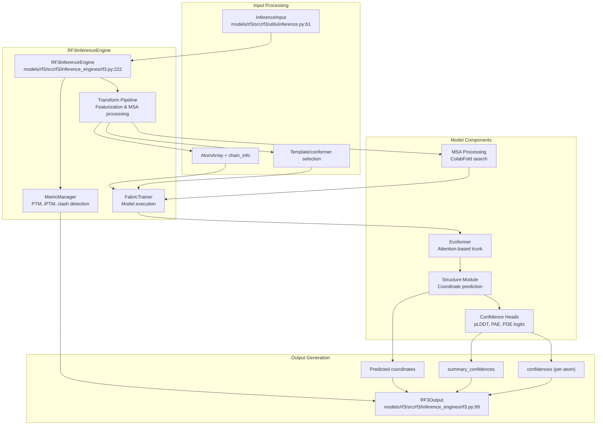
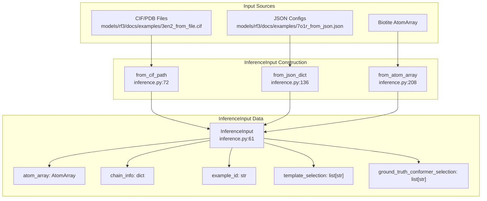
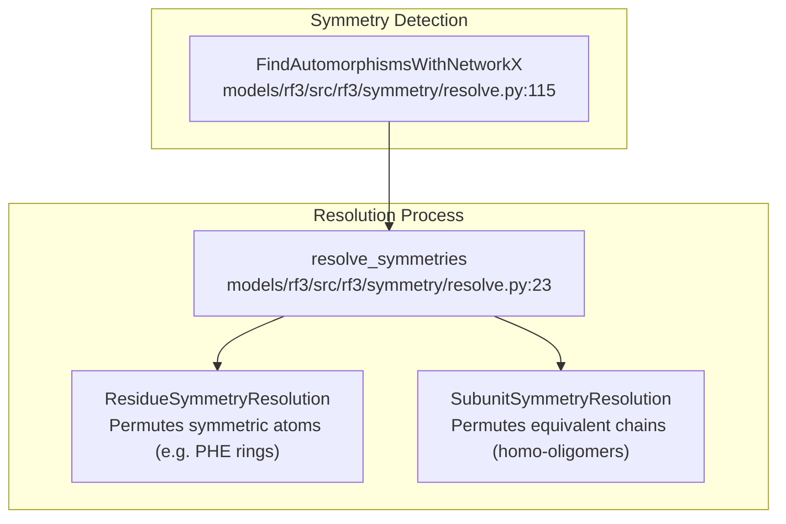

# RF3 Overview

> **Relevant source files**
> * [models/rf3/README.md](https://github.com/RosettaCommons/foundry/blob/cee116dc/models/rf3/README.md?plain=1)
> * [models/rf3/docs/examples/3en2_from_file.cif](https://github.com/RosettaCommons/foundry/blob/cee116dc/models/rf3/docs/examples/3en2_from_file.cif)
> * [models/rf3/docs/examples/3en2_from_json_with_msa.json](https://github.com/RosettaCommons/foundry/blob/cee116dc/models/rf3/docs/examples/3en2_from_json_with_msa.json)
> * [models/rf3/docs/examples/5hkn_from_file.cif](https://github.com/RosettaCommons/foundry/blob/cee116dc/models/rf3/docs/examples/5hkn_from_file.cif)
> * [models/rf3/docs/examples/7o1r_from_json.json](https://github.com/RosettaCommons/foundry/blob/cee116dc/models/rf3/docs/examples/7o1r_from_json.json)
> * [models/rf3/docs/examples/7xli_template_antigen_and_framework.json](https://github.com/RosettaCommons/foundry/blob/cee116dc/models/rf3/docs/examples/7xli_template_antigen_and_framework.json)
> * [models/rf3/docs/examples/9dfn.cif](https://github.com/RosettaCommons/foundry/blob/cee116dc/models/rf3/docs/examples/9dfn.cif)
> * [models/rf3/docs/examples/9dfn_template_ligand_and_protein.json](https://github.com/RosettaCommons/foundry/blob/cee116dc/models/rf3/docs/examples/9dfn_template_ligand_and_protein.json)
> * [models/rf3/docs/examples/ligands/HEM.sdf](https://github.com/RosettaCommons/foundry/blob/cee116dc/models/rf3/docs/examples/ligands/HEM.sdf)
> * [models/rf3/docs/examples/ligands/NAG.cif](https://github.com/RosettaCommons/foundry/blob/cee116dc/models/rf3/docs/examples/ligands/NAG.cif)
> * [models/rf3/docs/index.md](https://github.com/RosettaCommons/foundry/blob/cee116dc/models/rf3/docs/index.md?plain=1)

RosettaFold3 (RF3) is a deep learning model for all-atom biomolecular structure prediction and design validation. Competitive with leading open-source models, RF3 predicts three-dimensional structures from sequences and produces comprehensive confidence metrics. Within the Foundry ecosystem, RF3 serves as the primary validation component in end-to-end protein design workflows, re-folding sequences designed by ProteinMPNN to verify they adopt the intended backbone structure generated by RFdiffusion3.

RF3 includes features such as implicit chirality representations and atom-level geometric conditioning, improving performance on tasks like prediction of chiral ligands and fixed-conformer docking [models/rf3/README.md L10-L12](https://github.com/RosettaCommons/foundry/blob/cee116dc/models/rf3/README.md?plain=1#L10-L12)

---

## Purpose and Capabilities

RF3 provides three primary capabilities:

| Capability | Description | Use Case |
| --- | --- | --- |
| **Structure Prediction** | Predicts 3D coordinates from sequences and MSAs | *De novo* structure prediction and complex modeling [models/rf3/README.md L92-L109](https://github.com/RosettaCommons/foundry/blob/cee116dc/models/rf3/README.md?plain=1#L92-L109) |
| **Design Validation** | Re-folds designed sequences to verify designability | Validates RFD3→MPNN design pipeline outputs [models/rf3/README.md L8-L10](https://github.com/RosettaCommons/foundry/blob/cee116dc/models/rf3/README.md?plain=1#L8-L10) |
| **Confidence Scoring** | Computes per-atom and summary confidence metrics | Quality assessment and model ranking [models/rf3/README.md L81-L87](https://github.com/RosettaCommons/foundry/blob/cee116dc/models/rf3/README.md?plain=1#L81-L87) |

RF3 supports a wide range of biomolecules, including proteins, DNA, RNA, and small molecule ligands [models/rf3/README.md L4-L5](https://github.com/RosettaCommons/foundry/blob/cee116dc/models/rf3/README.md?plain=1#L4-L5)

 It handles Multiple Sequence Alignments (MSAs) in `.a3m` and `.fasta` formats and supports template-based prediction [models/rf3/README.md L92-L94](https://github.com/RosettaCommons/foundry/blob/cee116dc/models/rf3/README.md?plain=1#L92-L94)

**Sources:** [models/rf3/README.md L1-L115](https://github.com/RosettaCommons/foundry/blob/cee116dc/models/rf3/README.md?plain=1#L1-L115)

 [models/rf3/docs/index.md L8-L12](https://github.com/RosettaCommons/foundry/blob/cee116dc/models/rf3/docs/index.md?plain=1#L8-L12)

---

## Core Architecture

RF3's inference architecture is centered around the `RF3InferenceEngine` class, which manages the transition from raw input to predicted 3D coordinates.

**Component Descriptions:**

* **RF3InferenceEngine**: The main entry point inheriting from `BaseInferenceEngine`. It handles checkpoint loading (e.g., Latest, Preprint, or Benchmark models) and orchestrates the inference pipeline [models/rf3/src/rf3/inference_engines/rf3.py L222-L371](https://github.com/RosettaCommons/foundry/blob/cee116dc/models/rf3/src/rf3/inference_engines/rf3.py#L222-L371)  [models/rf3/README.md L35-L56](https://github.com/RosettaCommons/foundry/blob/cee116dc/models/rf3/README.md?plain=1#L35-L56)
* **InferenceInput**: A unified data structure that encapsulates structure data, MSA paths, and selection metadata [models/rf3/src/rf3/utils/inference.py L61-L69](https://github.com/RosettaCommons/foundry/blob/cee116dc/models/rf3/src/rf3/utils/inference.py#L61-L69)
* **MetricManager**: Computes structural metrics including PTM (predicted TM-score) and iPTM (interface PTM) [models/rf3/src/rf3/inference_engines/rf3.py L49-L56](https://github.com/RosettaCommons/foundry/blob/cee116dc/models/rf3/src/rf3/inference_engines/rf3.py#L49-L56)
* **Early Stopping**: A resource-saving feature where the model stops computation if pLDDT falls below a threshold (controlled by `early_stopping_plddt_threshold`) [models/rf3/README.md L137-L138](https://github.com/RosettaCommons/foundry/blob/cee116dc/models/rf3/README.md?plain=1#L137-L138)

**Sources:** [models/rf3/src/rf3/inference_engines/rf3.py L49-L371](https://github.com/RosettaCommons/foundry/blob/cee116dc/models/rf3/src/rf3/inference_engines/rf3.py#L49-L371)

 [models/rf3/README.md L35-L56](https://github.com/RosettaCommons/foundry/blob/cee116dc/models/rf3/README.md?plain=1#L35-L56)

 [models/rf3/src/rf3/utils/inference.py L61-L69](https://github.com/RosettaCommons/foundry/blob/cee116dc/models/rf3/src/rf3/utils/inference.py#L61-L69)

---

## Input Specification System

RF3 accepts inputs via JSON configuration files or CIF/PDB files. These are converted into `InferenceInput` objects.

**Common Input Examples:**

* **JSON with MSA**: Specifies sequences and explicit paths to `.a3m.gz` files [models/rf3/docs/examples/3en2_from_json_with_msa.json L1-L15](https://github.com/RosettaCommons/foundry/blob/cee116dc/models/rf3/docs/examples/3en2_from_json_with_msa.json#L1-L15)
* **JSON with Ligands**: Supports SMILES, CCD codes (e.g., `MG`, `NAG`), or external `.sdf`/`.cif` files for ligands [models/rf3/docs/examples/7o1r_from_json.json L1-L32](https://github.com/RosettaCommons/foundry/blob/cee116dc/models/rf3/docs/examples/7o1r_from_json.json#L1-L32)
* **CIF with MSA headers**: Uses custom CIF categories like `_msa_paths_by_chain_id` to link MSAs to structural data [models/rf3/docs/examples/3en2_from_file.cif L3-L4](https://github.com/RosettaCommons/foundry/blob/cee116dc/models/rf3/docs/examples/3en2_from_file.cif#L3-L4)
* **Bonds**: Explicit covalent bonds between chains (e.g., protein-ligand) can be specified in JSON [models/rf3/docs/examples/7o1r_from_json.json L27-L30](https://github.com/RosettaCommons/foundry/blob/cee116dc/models/rf3/docs/examples/7o1r_from_json.json#L27-L30)

**Sources:** [models/rf3/src/rf3/utils/inference.py L72-L258](https://github.com/RosettaCommons/foundry/blob/cee116dc/models/rf3/src/rf3/utils/inference.py#L72-L258)

 [models/rf3/docs/examples/7o1r_from_json.json L1-L32](https://github.com/RosettaCommons/foundry/blob/cee116dc/models/rf3/docs/examples/7o1r_from_json.json#L1-L32)

 [models/rf3/docs/examples/3en2_from_file.cif L1-L5](https://github.com/RosettaCommons/foundry/blob/cee116dc/models/rf3/docs/examples/3en2_from_file.cif#L1-L5)

---

## Confidence Metrics and Ranking

RF3 produces comprehensive confidence outputs. The model ranks multiple samples for a single input using a weighted score.

**Summary Confidences:**

* **pLDDT**: Local confidence score (0-100 scale) [models/rf3/README.md L81-L87](https://github.com/RosettaCommons/foundry/blob/cee116dc/models/rf3/README.md?plain=1#L81-L87)
* **pTM / ipTM**: Global and interface confidence scores [models/rf3/src/rf3/inference_engines/rf3.py L79-L95](https://github.com/RosettaCommons/foundry/blob/cee116dc/models/rf3/src/rf3/inference_engines/rf3.py#L79-L95)
* **Ranking Score**: Calculated as `0.8 * iptm + 0.2 * ptm - 100 * has_clash`. For single chains, `iptm` is set to `ptm` [models/rf3/src/rf3/inference_engines/rf3.py L79-L95](https://github.com/RosettaCommons/foundry/blob/cee116dc/models/rf3/src/rf3/inference_engines/rf3.py#L79-L95)

**Output Files:**
When running `rf3 fold`, the following files are produced:

* `{name}_model.cif`: The highest-ranked predicted structure [models/rf3/README.md L83](https://github.com/RosettaCommons/foundry/blob/cee116dc/models/rf3/README.md?plain=1#L83-L83)
* `{name}_ranking_scores.csv`: Granular metrics for all generated samples [models/rf3/README.md L82](https://github.com/RosettaCommons/foundry/blob/cee116dc/models/rf3/README.md?plain=1#L82-L82)
* `{name}_summary_confidences.json`: High-level metrics for the top sample [models/rf3/README.md L84](https://github.com/RosettaCommons/foundry/blob/cee116dc/models/rf3/README.md?plain=1#L84-L84)
* `{name}_confidences.csv`: Per-residue/atom metrics [models/rf3/README.md L81](https://github.com/RosettaCommons/foundry/blob/cee116dc/models/rf3/README.md?plain=1#L81-L81)

**Sources:** [models/rf3/src/rf3/inference_engines/rf3.py L79-L200](https://github.com/RosettaCommons/foundry/blob/cee116dc/models/rf3/src/rf3/inference_engines/rf3.py#L79-L200)

 [models/rf3/README.md L80-L87](https://github.com/RosettaCommons/foundry/blob/cee116dc/models/rf3/README.md?plain=1#L80-L87)

---

## Template and Conformer Selection

RF3 allows users to specify specific regions of a structure to be treated as templates or ground truth conformers.

* **Template Selection**: Users can select specific chains or residue ranges (e.g., `"B/*/1-42"`) to act as structural templates [models/rf3/docs/examples/7xli_template_antigen_and_framework.json L12](https://github.com/RosettaCommons/foundry/blob/cee116dc/models/rf3/docs/examples/7xli_template_antigen_and_framework.json#L12-L12)
* **Ground Truth Conformer Selection**: Specifies which chains in a multi-component input should be used as reference coordinates for validation [models/rf3/docs/examples/9dfn_template_ligand_and_protein.json L10](https://github.com/RosettaCommons/foundry/blob/cee116dc/models/rf3/docs/examples/9dfn_template_ligand_and_protein.json#L10-L10)

**Sources:** [models/rf3/docs/examples/7xli_template_antigen_and_framework.json L1-L14](https://github.com/RosettaCommons/foundry/blob/cee116dc/models/rf3/docs/examples/7xli_template_antigen_and_framework.json#L1-L14)

 [models/rf3/docs/examples/9dfn_template_ligand_and_protein.json L1-L13](https://github.com/RosettaCommons/foundry/blob/cee116dc/models/rf3/docs/examples/9dfn_template_ligand_and_protein.json#L1-L13)

---

## Symmetry Resolution

RF3 includes a robust symmetry resolution system to handle equivalent atoms (residue-level) and equivalent chains (subunit-level) during validation.

The `resolve_symmetries` function permutes the ground truth coordinates to minimize the RMSD against the predicted structure, ensuring that symmetric flips or chain swaps do not artificially inflate error metrics [models/rf3/src/rf3/symmetry/resolve.py L23-L112](https://github.com/RosettaCommons/foundry/blob/cee116dc/models/rf3/src/rf3/symmetry/resolve.py#L23-L112)

**Sources:** [models/rf3/src/rf3/symmetry/resolve.py L1-L284](https://github.com/RosettaCommons/foundry/blob/cee116dc/models/rf3/src/rf3/symmetry/resolve.py#L1-L284)