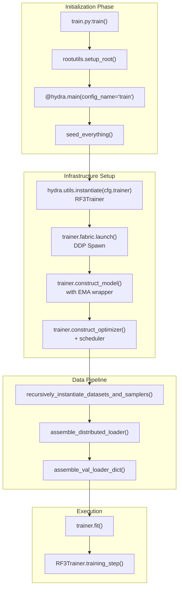
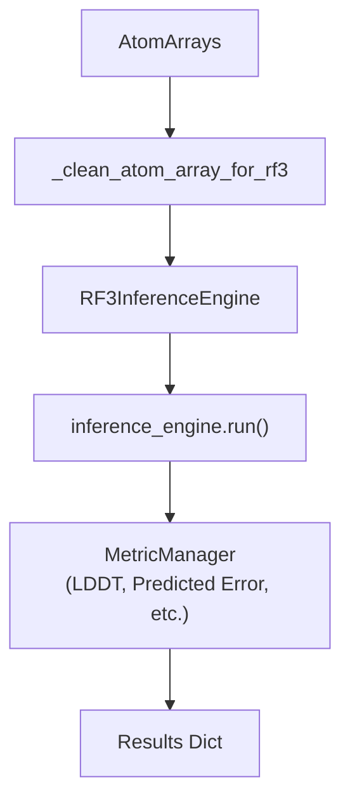

# RF3 Training

> **Relevant source files**
> * [Makefile](https://github.com/RosettaCommons/foundry/blob/cee116dc/Makefile)
> * [models/rf3/configs/inference.yaml](https://github.com/RosettaCommons/foundry/blob/cee116dc/models/rf3/configs/inference.yaml)
> * [models/rf3/configs/train.yaml](https://github.com/RosettaCommons/foundry/blob/cee116dc/models/rf3/configs/train.yaml)
> * [models/rf3/configs/validate.yaml](https://github.com/RosettaCommons/foundry/blob/cee116dc/models/rf3/configs/validate.yaml)
> * [models/rf3/src/rf3/metrics/clashing_chains.py](https://github.com/RosettaCommons/foundry/blob/cee116dc/models/rf3/src/rf3/metrics/clashing_chains.py)
> * [models/rf3/src/rf3/metrics/distogram.py](https://github.com/RosettaCommons/foundry/blob/cee116dc/models/rf3/src/rf3/metrics/distogram.py)
> * [models/rf3/src/rf3/metrics/lddt.py](https://github.com/RosettaCommons/foundry/blob/cee116dc/models/rf3/src/rf3/metrics/lddt.py)
> * [models/rf3/src/rf3/metrics/metadata.py](https://github.com/RosettaCommons/foundry/blob/cee116dc/models/rf3/src/rf3/metrics/metadata.py)
> * [models/rf3/src/rf3/metrics/predicted_error.py](https://github.com/RosettaCommons/foundry/blob/cee116dc/models/rf3/src/rf3/metrics/predicted_error.py)
> * [models/rf3/src/rf3/metrics/rasa.py](https://github.com/RosettaCommons/foundry/blob/cee116dc/models/rf3/src/rf3/metrics/rasa.py)
> * [models/rf3/src/rf3/train.py](https://github.com/RosettaCommons/foundry/blob/cee116dc/models/rf3/src/rf3/train.py)
> * [models/rf3/src/rf3/trainers/rf3.py](https://github.com/RosettaCommons/foundry/blob/cee116dc/models/rf3/src/rf3/trainers/rf3.py)
> * [models/rf3/src/rf3/utils/predict_and_score.py](https://github.com/RosettaCommons/foundry/blob/cee116dc/models/rf3/src/rf3/utils/predict_and_score.py)
> * [models/rf3/src/rf3/validate.py](https://github.com/RosettaCommons/foundry/blob/cee116dc/models/rf3/src/rf3/validate.py)
> * [models/rf3/tests/conftest.py](https://github.com/RosettaCommons/foundry/blob/cee116dc/models/rf3/tests/conftest.py)
> * [models/rfd3/configs/dev.yaml](https://github.com/RosettaCommons/foundry/blob/cee116dc/models/rfd3/configs/dev.yaml)
> * [models/rfd3/configs/inference.yaml](https://github.com/RosettaCommons/foundry/blob/cee116dc/models/rfd3/configs/inference.yaml)
> * [models/rfd3/configs/train.yaml](https://github.com/RosettaCommons/foundry/blob/cee116dc/models/rfd3/configs/train.yaml)
> * [models/rfd3/configs/validate.yaml](https://github.com/RosettaCommons/foundry/blob/cee116dc/models/rfd3/configs/validate.yaml)

This page documents the training and validation procedures for RosettaFold3 (RF3) models. It covers the script architecture, dataset configuration, the complex transform pipeline, and distributed training setup.

## Overview

RF3 training is built on a unified infrastructure leveraging **Lightning Fabric** for distributed execution and **Hydra** for configuration management. The pipeline processes raw structural data (PDB/mmCIF) and MSAs into model-ready tensors using a sophisticated sequence of AtomWorks transforms.

**Key Training Components:**

* **Training Orchestrator**: `train.py` handles the lifecycle from initialization to the final training loop [models/rf3/src/rf3/train.py L25-L194](https://github.com/RosettaCommons/foundry/blob/cee116dc/models/rf3/src/rf3/train.py#L25-L194)
* **Trainer Class**: `RF3Trainer` extends `FabricTrainer` to implement AF3-specific logic, including symmetry resolution and recycling schedules [models/rf3/src/rf3/trainers/rf3.py L36-L88](https://github.com/RosettaCommons/foundry/blob/cee116dc/models/rf3/src/rf3/trainers/rf3.py#L36-L88)
* **Validation Orchestrator**: `validate.py` provides a dedicated entry point for model evaluation with specialized metrics [models/rf3/src/rf3/validate.py L24-L140](https://github.com/RosettaCommons/foundry/blob/cee116dc/models/rf3/src/rf3/validate.py#L24-L140)

Sources: [models/rf3/src/rf3/train.py](https://github.com/RosettaCommons/foundry/blob/cee116dc/models/rf3/src/rf3/train.py)

 [models/rf3/src/rf3/trainers/rf3.py](https://github.com/RosettaCommons/foundry/blob/cee116dc/models/rf3/src/rf3/trainers/rf3.py)

 [models/rf3/src/rf3/validate.py](https://github.com/RosettaCommons/foundry/blob/cee116dc/models/rf3/src/rf3/validate.py)

---

## Training Architecture

The training process follows a strict flow managed by Hydra and Lightning Fabric.

### System Flow: From Config to Training Loop



Sources: [models/rf3/src/rf3/train.py L25-L168](https://github.com/RosettaCommons/foundry/blob/cee116dc/models/rf3/src/rf3/train.py#L25-L168)

 [models/rf3/src/rf3/trainers/rf3.py L89-L105](https://github.com/RosettaCommons/foundry/blob/cee116dc/models/rf3/src/rf3/trainers/rf3.py#L89-L105)

---

## RF3Trainer Implementation

The `RF3Trainer` is the central class managing the training logic. It handles the specific requirements of AlphaFold3-style models, such as recycling and symmetry resolution.

### Recycling Schedule

During training, the number of recycles is sampled per-batch to ensure all GPUs in a distributed environment are synchronized. The `get_recycle_schedule` function initializes this upfront [models/rf3/src/rf3/trainers/rf3.py L64-L69](https://github.com/RosettaCommons/foundry/blob/cee116dc/models/rf3/src/rf3/trainers/rf3.py#L64-L69)

### Symmetry Resolution

To compute accurate losses for complexes with symmetric subunits, the trainer utilizes:

* `SubunitSymmetryResolution`: Resolves symmetry at the chain/subunit level [models/rf3/src/rf3/trainers/rf3.py L86](https://github.com/RosettaCommons/foundry/blob/cee116dc/models/rf3/src/rf3/trainers/rf3.py#L86-L86)
* `ResidueSymmetryResolution`: Resolves symmetry for ambiguous residue types [models/rf3/src/rf3/trainers/rf3.py L87](https://github.com/RosettaCommons/foundry/blob/cee116dc/models/rf3/src/rf3/trainers/rf3.py#L87-L87)

### Network Input Assembly

The `_assemble_network_inputs` method prepares the final tensors for the model forward pass, specifically handling the addition of noise to coordinates [models/rf3/src/rf3/trainers/rf3.py L107-L142](https://github.com/RosettaCommons/foundry/blob/cee116dc/models/rf3/src/rf3/trainers/rf3.py#L107-L142)

Sources: [models/rf3/src/rf3/trainers/rf3.py L36-L142](https://github.com/RosettaCommons/foundry/blob/cee116dc/models/rf3/src/rf3/trainers/rf3.py#L36-L142)

---

## Dataset and Loader Configuration

RF3 uses a hierarchical dataset configuration system. The `StructuralDatasetWrapper` is used to wrap base datasets like `PandasDataset` with a transform pipeline.

### Training Loader Assembly

The `assemble_distributed_loader` function ensures that data is correctly sharded across multiple GPUs using a distributed sampler [models/rf3/src/rf3/train.py L149-L156](https://github.com/RosettaCommons/foundry/blob/cee116dc/models/rf3/src/rf3/train.py#L149-L156)

| Feature | Description | Code Pointer |
| --- | --- | --- |
| **Recycling** | Maximum recycles sampled during training | [models/rf3/src/rf3/trainers/rf3.py L63-L69](https://github.com/RosettaCommons/foundry/blob/cee116dc/models/rf3/src/rf3/trainers/rf3.py#L63-L69) |
| **DDP Launch** | Processes spawned via Fabric | [models/rf3/src/rf3/train.py L112](https://github.com/RosettaCommons/foundry/blob/cee116dc/models/rf3/src/rf3/train.py#L112-L112) |
| **Precision** | `float32_matmul_precision` set to 'medium' | [models/rf3/src/rf3/train.py L40](https://github.com/RosettaCommons/foundry/blob/cee116dc/models/rf3/src/rf3/train.py#L40-L40) |
| **EMA** | Optional Exponential Moving Average wrapper | [models/rf3/src/rf3/trainers/rf3.py L101-L103](https://github.com/RosettaCommons/foundry/blob/cee116dc/models/rf3/src/rf3/trainers/rf3.py#L101-L103) |

Sources: [models/rf3/src/rf3/train.py](https://github.com/RosettaCommons/foundry/blob/cee116dc/models/rf3/src/rf3/train.py)

 [models/rf3/src/rf3/trainers/rf3.py](https://github.com/RosettaCommons/foundry/blob/cee116dc/models/rf3/src/rf3/trainers/rf3.py)

---

## Configuration Hierarchy

RF3 uses Hydra's `defaults` list to compose configurations. This allows for modular overrides of models, datasets, and trainer settings.

### Base Training Config (train.yaml)

The root configuration defines the search paths and default components [models/rf3/configs/train.yaml L5-L21](https://github.com/RosettaCommons/foundry/blob/cee116dc/models/rf3/configs/train.yaml#L5-L21)

```markdown
# models/rf3/configs/train.yamldefaults:  - callbacks: default  - logger: csv  - trainer: ???  - paths: default  - datasets: ???  - dataloader: default  - model: ???  - _self_  - experiment: ???
```

### Validation Config (validate.yaml)

Specialized for evaluation, it includes callbacks for dumping CIF files of predictions [models/rf3/configs/validate.yaml L46-L50](https://github.com/RosettaCommons/foundry/blob/cee116dc/models/rf3/configs/validate.yaml#L46-L50)

Sources: [models/rf3/configs/train.yaml](https://github.com/RosettaCommons/foundry/blob/cee116dc/models/rf3/configs/train.yaml)

 [models/rf3/configs/validate.yaml](https://github.com/RosettaCommons/foundry/blob/cee116dc/models/rf3/configs/validate.yaml)

---

## Validation and Scoring Utility

The `predict_and_score_with_rf3` utility allows for high-level evaluation of model checkpoints against a set of ground truth structures [models/rf3/src/rf3/utils/predict_and_score.py L42-L165](https://github.com/RosettaCommons/foundry/blob/cee116dc/models/rf3/src/rf3/utils/predict_and_score.py#L42-L165)

### Evaluation Flow



### Metrics Support

RF3 supports a variety of metrics for training and validation:

* **LDDT**: `AllAtomLDDT` and `ByTypeLDDT` [models/rf3/src/rf3/metrics/lddt.py](https://github.com/RosettaCommons/foundry/blob/cee116dc/models/rf3/src/rf3/metrics/lddt.py)
* **Error Prediction**: `PredictedError` [models/rf3/src/rf3/metrics/predicted_error.py](https://github.com/RosettaCommons/foundry/blob/cee116dc/models/rf3/src/rf3/metrics/predicted_error.py)
* **Geometric**: `Distogram` and `ClashingChains` [models/rf3/src/rf3/metrics/distogram.py](https://github.com/RosettaCommons/foundry/blob/cee116dc/models/rf3/src/rf3/metrics/distogram.py)  [models/rf3/src/rf3/metrics/clashing_chains.py](https://github.com/RosettaCommons/foundry/blob/cee116dc/models/rf3/src/rf3/metrics/clashing_chains.py)

Sources: [models/rf3/src/rf3/utils/predict_and_score.py](https://github.com/RosettaCommons/foundry/blob/cee116dc/models/rf3/src/rf3/utils/predict_and_score.py)

 [models/rf3/src/rf3/metrics/](https://github.com/RosettaCommons/foundry/blob/cee116dc/models/rf3/src/rf3/metrics/)

---

## Distributed Training Details

Training is scaled across multiple nodes/GPUs using the `FabricTrainer`.

1. **Process Spawning**: `trainer.fabric.launch()` is called before model construction to allow efficient device-specific initialization using `init_module` [models/rf3/src/rf3/train.py L108-L112](https://github.com/RosettaCommons/foundry/blob/cee116dc/models/rf3/src/rf3/train.py#L108-L112)
2. **Ranked Logging**: The `RankedLogger` is used to prevent duplicate log messages, ensuring only the master process (Rank 0) outputs detailed logs [models/rf3/src/rf3/train.py L59-L75](https://github.com/RosettaCommons/foundry/blob/cee116dc/models/rf3/src/rf3/train.py#L59-L75)
3. **Seeding**: `seed_everything` is called with `workers=True` to ensure deterministic behavior in multi-process dataloaders [models/rf3/src/rf3/train.py L81](https://github.com/RosettaCommons/foundry/blob/cee116dc/models/rf3/src/rf3/train.py#L81-L81)

Sources: [models/rf3/src/rf3/train.py L59-L112](https://github.com/RosettaCommons/foundry/blob/cee116dc/models/rf3/src/rf3/train.py#L59-L112)

 [models/rf3/src/rf3/trainers/rf3.py L92](https://github.com/RosettaCommons/foundry/blob/cee116dc/models/rf3/src/rf3/trainers/rf3.py#L92-L92)