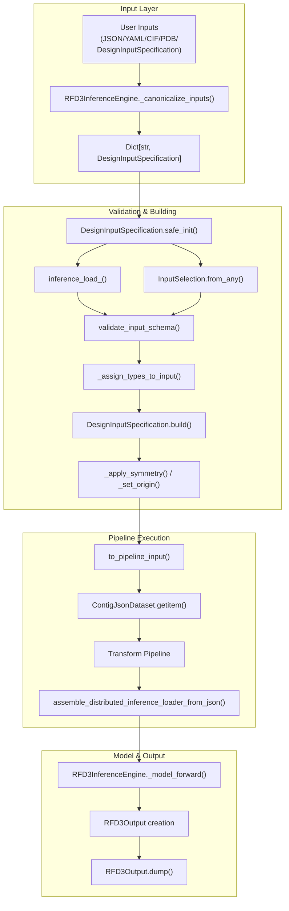
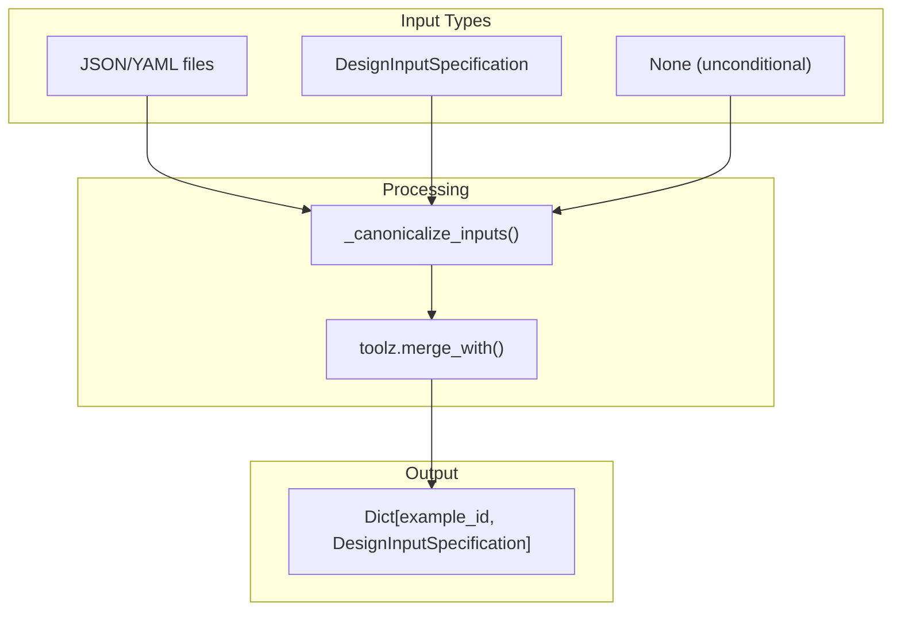

# RFD3 Inference Pipeline

> **Relevant source files**
> * [.gitignore](https://github.com/RosettaCommons/foundry/blob/cee116dc/.gitignore)
> * [examples/all.ipynb](https://github.com/RosettaCommons/foundry/blob/cee116dc/examples/all.ipynb)
> * [models/rfd3/configs/inference_engine/base.yaml](https://github.com/RosettaCommons/foundry/blob/cee116dc/models/rfd3/configs/inference_engine/base.yaml)
> * [models/rfd3/src/rfd3/engine.py](https://github.com/RosettaCommons/foundry/blob/cee116dc/models/rfd3/src/rfd3/engine.py)
> * [models/rfd3/src/rfd3/inference/datasets.py](https://github.com/RosettaCommons/foundry/blob/cee116dc/models/rfd3/src/rfd3/inference/datasets.py)
> * [models/rfd3/src/rfd3/inference/input_parsing.py](https://github.com/RosettaCommons/foundry/blob/cee116dc/models/rfd3/src/rfd3/inference/input_parsing.py)
> * [models/rfd3/src/rfd3/inference/legacy_input_parsing.py](https://github.com/RosettaCommons/foundry/blob/cee116dc/models/rfd3/src/rfd3/inference/legacy_input_parsing.py)
> * [models/rfd3/src/rfd3/model/layers/chunked_pairwise.py](https://github.com/RosettaCommons/foundry/blob/cee116dc/models/rfd3/src/rfd3/model/layers/chunked_pairwise.py)
> * [models/rfd3/src/rfd3/model/layers/encoders.py](https://github.com/RosettaCommons/foundry/blob/cee116dc/models/rfd3/src/rfd3/model/layers/encoders.py)
> * [models/rfd3/src/rfd3/run_inference.py](https://github.com/RosettaCommons/foundry/blob/cee116dc/models/rfd3/src/rfd3/run_inference.py)
> * [models/rfd3/src/rfd3/trainer/rfd3.py](https://github.com/RosettaCommons/foundry/blob/cee116dc/models/rfd3/src/rfd3/trainer/rfd3.py)
> * [models/rfd3/src/rfd3/utils/inference.py](https://github.com/RosettaCommons/foundry/blob/cee116dc/models/rfd3/src/rfd3/utils/inference.py)
> * [models/rfd3/tests/test_bond_preservation_cases.py](https://github.com/RosettaCommons/foundry/blob/cee116dc/models/rfd3/tests/test_bond_preservation_cases.py)
> * [models/rfd3/tests/test_conditioning.py](https://github.com/RosettaCommons/foundry/blob/cee116dc/models/rfd3/tests/test_conditioning.py)
> * [models/rfd3/tests/test_legacy_ptm_bonds.py](https://github.com/RosettaCommons/foundry/blob/cee116dc/models/rfd3/tests/test_legacy_ptm_bonds.py)
> * [models/rfd3na/src/rfd3na/utils/inference.py](https://github.com/RosettaCommons/foundry/blob/cee116dc/models/rfd3na/src/rfd3na/utils/inference.py)

This page documents the RFD3 inference pipeline architecture, detailing how inputs are processed, validated, and transformed into protein backbone designs. This covers the complete flow from input specification to final output generation.

For information about the RFD3 model architecture and diffusion sampling, see [4.3](https://github.com/RosettaCommons/foundry/blob/cee116dc/4.3)

 For input specification syntax and examples, see [4.2](https://github.com/RosettaCommons/foundry/blob/cee116dc/4.2)

 For training RFD3 models, see [4.6](https://github.com/RosettaCommons/foundry/blob/cee116dc/4.6)

## Overview

The RFD3 inference pipeline orchestrates the end-to-end process of generating protein backbones. It accepts flexible input specifications (JSON, YAML, CIF/PDB files, or programmatic objects), validates and normalizes them, constructs annotated atom arrays with conditioning information, passes them through the model's diffusion sampler, and produces structured outputs with metadata.

The pipeline enforces strict validation, supports batch processing, handles symmetry, and manages both regular diffusion and partial diffusion modes.

**Sources**: [models/rfd3/src/rfd3/engine.py L1-L561](https://github.com/RosettaCommons/foundry/blob/cee116dc/models/rfd3/src/rfd3/engine.py#L1-L561)

 [models/rfd3/src/rfd3/inference/input_parsing.py L1-L124](https://github.com/RosettaCommons/foundry/blob/cee116dc/models/rfd3/src/rfd3/inference/input_parsing.py#L1-L124)

---

## Core Components

### RFD3InferenceEngine

The `RFD3InferenceEngine` class is the main entry point for inference operations. It inherits from `BaseInferenceEngine` and coordinates all aspects of the inference workflow.

**Key Responsibilities:**

* Input canonicalization and specification management [models/rfd3/src/rfd3/engine.py L422-L541](https://github.com/RosettaCommons/foundry/blob/cee116dc/models/rfd3/src/rfd3/engine.py#L422-L541)
* Pipeline initialization and dataloader setup [models/rfd3/src/rfd3/engine.py L206-L253](https://github.com/RosettaCommons/foundry/blob/cee116dc/models/rfd3/src/rfd3/engine.py#L206-L253)
* Model forward passes and output generation [models/rfd3/src/rfd3/engine.py L272-L333](https://github.com/RosettaCommons/foundry/blob/cee116dc/models/rfd3/src/rfd3/engine.py#L272-L333)
* File I/O and checkpoint management [models/rfd3/src/rfd3/engine.py L103-L134](https://github.com/RosettaCommons/foundry/blob/cee116dc/models/rfd3/src/rfd3/engine.py#L103-L134)

**Key Methods:**

* `run()` - Main execution method accepting various input types [models/rfd3/src/rfd3/engine.py L206-L333](https://github.com/RosettaCommons/foundry/blob/cee116dc/models/rfd3/src/rfd3/engine.py#L206-L333)
* `_canonicalize_inputs()` - Normalizes inputs to specification dictionaries [models/rfd3/src/rfd3/engine.py L422-L541](https://github.com/RosettaCommons/foundry/blob/cee116dc/models/rfd3/src/rfd3/engine.py#L422-L541)
* `_multiply_specifications()` - Creates n_batches copies with skip-existing logic [models/rfd3/src/rfd3/engine.py L379-L420](https://github.com/RosettaCommons/foundry/blob/cee116dc/models/rfd3/src/rfd3/engine.py#L379-L420)
* `_model_forward()` - Executes model inference and packages outputs [models/rfd3/src/rfd3/engine.py L272-L333](https://github.com/RosettaCommons/foundry/blob/cee116dc/models/rfd3/src/rfd3/engine.py#L272-L333)

**Sources**: [models/rfd3/src/rfd3/engine.py L139-L420](https://github.com/RosettaCommons/foundry/blob/cee116dc/models/rfd3/src/rfd3/engine.py#L139-L420)

### RFD3InferenceConfig

Configuration dataclass storing all inference parameters:

| Field | Type | Default | Description |
| --- | --- | --- | --- |
| `ckpt_path` | str \| Path | "rfd3" | Path to model checkpoint [models/rfd3/src/rfd3/engine.py L45-L47](https://github.com/RosettaCommons/foundry/blob/cee116dc/models/rfd3/src/rfd3/engine.py#L45-L47) |
| `diffusion_batch_size` | int | 16 | Number of samples per batch [models/rfd3/src/rfd3/engine.py L48](https://github.com/RosettaCommons/foundry/blob/cee116dc/models/rfd3/src/rfd3/engine.py#L48-L48) |
| `skip_existing` | bool | True | Skip if output already exists [models/rfd3/src/rfd3/engine.py L51](https://github.com/RosettaCommons/foundry/blob/cee116dc/models/rfd3/src/rfd3/engine.py#L51-L51) |
| `specification` | dict | {} | Per-example specification overrides [models/rfd3/src/rfd3/engine.py L53](https://github.com/RosettaCommons/foundry/blob/cee116dc/models/rfd3/src/rfd3/engine.py#L53-L53) |
| `inference_sampler` | dict | {} | Sampler configuration overrides [models/rfd3/src/rfd3/engine.py L54](https://github.com/RosettaCommons/foundry/blob/cee116dc/models/rfd3/src/rfd3/engine.py#L54-L54) |
| `cleanup_guideposts` | bool | True | Remove unindexed guideposts from output [models/rfd3/src/rfd3/engine.py L57](https://github.com/RosettaCommons/foundry/blob/cee116dc/models/rfd3/src/rfd3/engine.py#L57-L57) |
| `cleanup_virtual_atoms` | bool | True | Remove virtual atoms from output [models/rfd3/src/rfd3/engine.py L58](https://github.com/RosettaCommons/foundry/blob/cee116dc/models/rfd3/src/rfd3/engine.py#L58-L58) |
| `dump_trajectories` | bool | False | Save diffusion trajectories [models/rfd3/src/rfd3/engine.py L69](https://github.com/RosettaCommons/foundry/blob/cee116dc/models/rfd3/src/rfd3/engine.py#L69-L69) |
| `low_memory_mode` | bool | False | Enable memory-efficient tokenization [models/rfd3/src/rfd3/engine.py L72-L74](https://github.com/RosettaCommons/foundry/blob/cee116dc/models/rfd3/src/rfd3/engine.py#L72-L74) |

**Sources**: [models/rfd3/src/rfd3/engine.py L43-L89](https://github.com/RosettaCommons/foundry/blob/cee116dc/models/rfd3/src/rfd3/engine.py#L43-L89)

### DesignInputSpecification

Pydantic model providing validated input specification with comprehensive validation logic. This is the canonical representation of a design task.

**Major Field Categories:**

1. **Data Inputs & Motif Selection** [models/rfd3/src/rfd3/inference/input_parsing.py L129-L144](https://github.com/RosettaCommons/foundry/blob/cee116dc/models/rfd3/src/rfd3/inference/input_parsing.py#L129-L144) * `input` - Path to PDB/CIF file * `atom_array_input` - Pre-loaded AtomArray (internal use) * `contig` - Indexed motif specification (InputSelection) * `unindex` - Unindexed motif components (InputSelection) * `length` - Length constraint string (e.g., "100-200") * `ligand` - Ligand names to include
2. **Conditioning Annotations** [models/rfd3/src/rfd3/inference/input_parsing.py L150-L184](https://github.com/RosettaCommons/foundry/blob/cee116dc/models/rfd3/src/rfd3/inference/input_parsing.py#L150-L184) * `select_fixed_atoms` - Atoms with fixed coordinates * `select_unfixed_sequence` - Residues with flexible sequence * `select_buried/partially_buried/exposed` - RASA bins * `select_hbond_acceptor/donor` - Hydrogen bond conditioning * `select_hotspots` - Hotspot atoms for PPI design
3. **Global Settings** [models/rfd3/src/rfd3/inference/input_parsing.py L186-L213](https://github.com/RosettaCommons/foundry/blob/cee116dc/models/rfd3/src/rfd3/inference/input_parsing.py#L186-L213) * `symmetry` - SymmetryConfig for symmetric assemblies * `ori_token` - Origin coordinates * `partial_t` - Noise level for partial diffusion * `plddt_enhanced` - Enable pLDDT enhancement * `is_non_loopy` - Encourage helical/sheet structure

**Sources**: [models/rfd3/src/rfd3/inference/input_parsing.py L113-L777](https://github.com/RosettaCommons/foundry/blob/cee116dc/models/rfd3/src/rfd3/inference/input_parsing.py#L113-L777)

### RFD3Output

Output dataclass encapsulating all results from a single design:

```python
@dataclassclass RFD3Output:    atom_array: AtomArray              # Final predicted structure    metadata: dict                      # Input spec, seed, checkpoint info    example_id: str                     # Unique identifier    denoised_trajectory_stack: Optional[AtomArrayStack]  # Forward trajectory    noisy_trajectory_stack: Optional[AtomArrayStack]     # Noisy trajectory
```

[models/rfd3/src/rfd3/engine.py L90-L97](https://github.com/RosettaCommons/foundry/blob/cee116dc/models/rfd3/src/rfd3/engine.py#L90-L97)

The `dump()` method writes outputs to disk:

* `{example_id}.cif.gz` - Main structure file [models/rfd3/src/rfd3/engine.py L105-L111](https://github.com/RosettaCommons/foundry/blob/cee116dc/models/rfd3/src/rfd3/engine.py#L105-L111)
* `{example_id}.json` - Metadata including input specification [models/rfd3/src/rfd3/engine.py L112-L114](https://github.com/RosettaCommons/foundry/blob/cee116dc/models/rfd3/src/rfd3/engine.py#L112-L114)
* `{example_id}_denoised_model_{idx}.cif.gz` - Optional denoised trajectory [models/rfd3/src/rfd3/engine.py L119-L125](https://github.com/RosettaCommons/foundry/blob/cee116dc/models/rfd3/src/rfd3/engine.py#L119-L125)
* `{example_id}_noisy_model_{idx}.cif.gz` - Optional noisy trajectory [models/rfd3/src/rfd3/engine.py L127-L133](https://github.com/RosettaCommons/foundry/blob/cee116dc/models/rfd3/src/rfd3/engine.py#L127-L133)

**Sources**: [models/rfd3/src/rfd3/engine.py L90-L138](https://github.com/RosettaCommons/foundry/blob/cee116dc/models/rfd3/src/rfd3/engine.py#L90-L138)

---

## Inference Pipeline Flow

The following diagram maps the high-level inference flow to specific code entities within the `RFD3InferenceEngine` and `DesignInputSpecification`.

### Data Flow Diagram



**Sources**: [models/rfd3/src/rfd3/engine.py L206-L333](https://github.com/RosettaCommons/foundry/blob/cee116dc/models/rfd3/src/rfd3/engine.py#L206-L333)

 [models/rfd3/src/rfd3/inference/input_parsing.py L504-L777](https://github.com/RosettaCommons/foundry/blob/cee116dc/models/rfd3/src/rfd3/inference/input_parsing.py#L504-L777)

 [models/rfd3/src/rfd3/inference/datasets.py L156-L173](https://github.com/RosettaCommons/foundry/blob/cee116dc/models/rfd3/src/rfd3/inference/datasets.py#L156-L173)

---

## Input Processing Pipeline

### Input Canonicalization

The `_canonicalize_inputs()` method normalizes various input types into a unified dictionary structure [models/rfd3/src/rfd3/engine.py L422-L541](https://github.com/RosettaCommons/foundry/blob/cee116dc/models/rfd3/src/rfd3/engine.py#L422-L541)



**Key Logic:**

* Loads JSON/YAML and applies global overrides [models/rfd3/src/rfd3/engine.py L433-L463](https://github.com/RosettaCommons/foundry/blob/cee116dc/models/rfd3/src/rfd3/engine.py#L433-L463)
* Ensures relative paths in JSON files are converted to absolute paths using `ensure_input_is_abspath` [models/rfd3/src/rfd3/inference/datasets.py L163](https://github.com/RosettaCommons/foundry/blob/cee116dc/models/rfd3/src/rfd3/inference/datasets.py#L163-L163)
* Generates unique example IDs based on file basenames and JSON keys [models/rfd3/src/rfd3/engine.py L448-L463](https://github.com/RosettaCommons/foundry/blob/cee116dc/models/rfd3/src/rfd3/engine.py#L448-L463)

**Sources**: [models/rfd3/src/rfd3/engine.py L422-L541](https://github.com/RosettaCommons/foundry/blob/cee116dc/models/rfd3/src/rfd3/engine.py#L422-L541)

 [models/rfd3/src/rfd3/inference/datasets.py L156-L173](https://github.com/RosettaCommons/foundry/blob/cee116dc/models/rfd3/src/rfd3/inference/datasets.py#L156-L173)

### Specification Multiplication

The `_multiply_specifications()` method creates multiple copies for batch sampling [models/rfd3/src/rfd3/engine.py L379-L420](https://github.com/RosettaCommons/foundry/blob/cee116dc/models/rfd3/src/rfd3/engine.py#L379-L420)

1. Scans the output directory to identify existing example IDs if `skip_existing=True` [models/rfd3/src/rfd3/engine.py L383-L388](https://github.com/RosettaCommons/foundry/blob/cee116dc/models/rfd3/src/rfd3/engine.py#L383-L388)
2. Iterates through requested `n_batches` [models/rfd3/src/rfd3/engine.py L397](https://github.com/RosettaCommons/foundry/blob/cee116dc/models/rfd3/src/rfd3/engine.py#L397-L397)
3. Creates unique IDs for each batch (e.g., `id_batch_0`) [models/rfd3/src/rfd3/engine.py L403](https://github.com/RosettaCommons/foundry/blob/cee116dc/models/rfd3/src/rfd3/engine.py#L403-L403)
4. Filters out specifications that have already been processed [models/rfd3/src/rfd3/engine.py L410-L413](https://github.com/RosettaCommons/foundry/blob/cee116dc/models/rfd3/src/rfd3/engine.py#L410-L413)

**Sources**: [models/rfd3/src/rfd3/engine.py L379-L420](https://github.com/RosettaCommons/foundry/blob/cee116dc/models/rfd3/src/rfd3/engine.py#L379-L420)

---

## DesignInputSpecification Building

The `DesignInputSpecification` class performs extensive validation and builds annotated atom arrays.

### Building Stages

1. **Pre-validation**: `validate_input_schema()` ensures mutual exclusivity of inputs (e.g., cannot specify both `input` and `length` for unconditional generation) [models/rfd3/src/rfd3/inference/input_parsing.py L234-L315](https://github.com/RosettaCommons/foundry/blob/cee116dc/models/rfd3/src/rfd3/inference/input_parsing.py#L234-L315)
2. **Input Loading**: `load_input()` uses `inference_load_()` to parse PDB/CIF files into Biotite `AtomArray` objects [models/rfd3/src/rfd3/inference/input_parsing.py L317-L360](https://github.com/RosettaCommons/foundry/blob/cee116dc/models/rfd3/src/rfd3/inference/input_parsing.py#L317-L360)
3. **Conditioning Assignment**: `_assign_types_to_input()` maps `InputSelection` strings to internal conditioning annotations [models/rfd3/src/rfd3/inference/input_parsing.py L419-L498](https://github.com/RosettaCommons/foundry/blob/cee116dc/models/rfd3/src/rfd3/inference/input_parsing.py#L419-L498)
4. **Structure Assembly**: `build()` iterates through contig components to construct the initial design state [models/rfd3/src/rfd3/inference/input_parsing.py L504-L749](https://github.com/RosettaCommons/foundry/blob/cee116dc/models/rfd3/src/rfd3/inference/input_parsing.py#L504-L749)

### Conditioning Annotation Assignment

Annotations are applied to the `AtomArray` during the building process:

| Selection Field | Annotation Name | Description |
| --- | --- | --- |
| `select_fixed_atoms` | `is_motif_atom_with_fixed_coord` | Atoms with frozen 3D coordinates [models/rfd3/src/rfd3/inference/input_parsing.py L423-L426](https://github.com/RosettaCommons/foundry/blob/cee116dc/models/rfd3/src/rfd3/inference/input_parsing.py#L423-L426) |
| `select_unfixed_sequence` | `is_motif_atom_with_fixed_seq` | Residues where the model samples sequence [models/rfd3/src/rfd3/inference/input_parsing.py L428-L431](https://github.com/RosettaCommons/foundry/blob/cee116dc/models/rfd3/src/rfd3/inference/input_parsing.py#L428-L431) |
| `unindex` | `is_motif_atom_unindexed` | Motif components without fixed sequence positions [models/rfd3/src/rfd3/inference/input_parsing.py L133-L137](https://github.com/RosettaCommons/foundry/blob/cee116dc/models/rfd3/src/rfd3/inference/input_parsing.py#L133-L137) |
| `select_buried` | `rasa_bin` | Forces RASA bin 0 (buried) [models/rfd3/src/rfd3/inference/input_parsing.py L433-L436](https://github.com/RosettaCommons/foundry/blob/cee116dc/models/rfd3/src/rfd3/inference/input_parsing.py#L433-L436) |
| `select_hotspots` | `is_atom_level_hotspot` | Marks hotspot atoms for PPI design [models/rfd3/src/rfd3/inference/input_parsing.py L453-L456](https://github.com/RosettaCommons/foundry/blob/cee116dc/models/rfd3/src/rfd3/inference/input_parsing.py#L453-L456) |

**Sources**: [models/rfd3/src/rfd3/inference/input_parsing.py L419-L498](https://github.com/RosettaCommons/foundry/blob/cee116dc/models/rfd3/src/rfd3/inference/input_parsing.py#L419-L498)

 [models/rfd3/src/rfd3/utils/inference.py L53-L84](https://github.com/RosettaCommons/foundry/blob/cee116dc/models/rfd3/src/rfd3/utils/inference.py#L53-L84)

---

## Dataset and DataLoader

### ContigJsonDataset

The `ContigJsonDataset` class enables efficient loading of design tasks from JSON/YAML files [models/rfd3/src/rfd3/inference/datasets.py L31-L173](https://github.com/RosettaCommons/foundry/blob/cee116dc/models/rfd3/src/rfd3/inference/datasets.py#L31-L173)

* **Lazy Loading**: `__getitem__` initializes the `DesignInputSpecification` and builds the `AtomArray` on-demand [models/rfd3/src/rfd3/inference/datasets.py L156-L168](https://github.com/RosettaCommons/foundry/blob/cee116dc/models/rfd3/src/rfd3/inference/datasets.py#L156-L168)
* **Pipeline Preparation**: Calls `to_pipeline_input()` to convert the `AtomArray` into a dictionary of features ready for model transforms [models/rfd3/src/rfd3/inference/datasets.py L168](https://github.com/RosettaCommons/foundry/blob/cee116dc/models/rfd3/src/rfd3/inference/datasets.py#L168-L168)

### Distributed Inference

The `assemble_distributed_inference_loader_from_json()` function creates a `DataLoader` that respects DDP rank and world size [models/rfd3/src/rfd3/inference/datasets.py L175-L194](https://github.com/RosettaCommons/foundry/blob/cee116dc/models/rfd3/src/rfd3/inference/datasets.py#L175-L194)

* Uses `SequentialSampler` to ensure deterministic ordering [models/rfd3/src/rfd3/inference/datasets.py L187](https://github.com/RosettaCommons/foundry/blob/cee116dc/models/rfd3/src/rfd3/inference/datasets.py#L187-L187)
* Rank-based splitting ensures each GPU processes a unique subset of designs [models/rfd3/src/rfd3/inference/datasets.py L188-L193](https://github.com/RosettaCommons/foundry/blob/cee116dc/models/rfd3/src/rfd3/inference/datasets.py#L188-L193)

**Sources**: [models/rfd3/src/rfd3/inference/datasets.py L31-L194](https://github.com/RosettaCommons/foundry/blob/cee116dc/models/rfd3/src/rfd3/inference/datasets.py#L31-L194)

---

## Model Execution and Trajectories

### Model Forward Pass

The `_model_forward()` method executes the actual inference [models/rfd3/src/rfd3/engine.py L272-L333](https://github.com/RosettaCommons/foundry/blob/cee116dc/models/rfd3/src/rfd3/engine.py#L272-L333)

1. Moves batch data to the correct device using `fabric.to_device()` [models/rfd3/src/rfd3/engine.py L273](https://github.com/RosettaCommons/foundry/blob/cee116dc/models/rfd3/src/rfd3/engine.py#L273-L273)
2. Calls `trainer.validation_step()` which invokes the `ConditionalDiffusionSampler` [models/rfd3/src/rfd3/engine.py L275](https://github.com/RosettaCommons/foundry/blob/cee116dc/models/rfd3/src/rfd3/engine.py#L275-L275)
3. Collects predicted coordinates, metadata, and optional trajectories [models/rfd3/src/rfd3/engine.py L276-L284](https://github.com/RosettaCommons/foundry/blob/cee116dc/models/rfd3/src/rfd3/engine.py#L276-L284)

### Trajectory Processing

If `dump_trajectories` is enabled, the engine reshapes and aligns the diffusion steps [models/rfd3/src/rfd3/engine.py L286-L318](https://github.com/RosettaCommons/foundry/blob/cee116dc/models/rfd3/src/rfd3/engine.py#L286-L318)

* **Subsampling**: Trajectories are limited to 100 frames to save space [models/rfd3/src/rfd3/engine.py L545](https://github.com/RosettaCommons/foundry/blob/cee116dc/models/rfd3/src/rfd3/engine.py#L545-L545)
* **Alignment**: If `align_trajectory_structures=True`, frames are aligned to the final prediction using `weighted_rigid_align()` [models/rfd3/src/rfd3/engine.py L295-L310](https://github.com/RosettaCommons/foundry/blob/cee116dc/models/rfd3/src/rfd3/engine.py#L295-L310)
* **Stacking**: `build_stack_from_atom_array_and_batched_coords()` converts raw coordinates into a `biotite.structure.AtomArrayStack` [models/rfd3/src/rfd3/engine.py L312-L317](https://github.com/RosettaCommons/foundry/blob/cee116dc/models/rfd3/src/rfd3/engine.py#L312-L317)

**Sources**: [models/rfd3/src/rfd3/engine.py L272-L333](https://github.com/RosettaCommons/foundry/blob/cee116dc/models/rfd3/src/rfd3/engine.py#L272-L333)

 [models/rfd3/src/rfd3/utils/io.py L34](https://github.com/RosettaCommons/foundry/blob/cee116dc/models/rfd3/src/rfd3/utils/io.py#L34-L34)

---

## Output Generation

The `RFD3Output` object manages the persistence of results [models/rfd3/src/rfd3/engine.py L90-L138](https://github.com/RosettaCommons/foundry/blob/cee116dc/models/rfd3/src/rfd3/engine.py#L90-L138)

### File Formats

* **CIF**: Structures are saved using `to_cif_file()` with `extra_fields=SAVED_CONDITIONING_ANNOTATIONS` to preserve conditioning info for inspection [models/rfd3/src/rfd3/engine.py L105-L111](https://github.com/RosettaCommons/foundry/blob/cee116dc/models/rfd3/src/rfd3/engine.py#L105-L111)
* **JSON**: Metadata containing the full input specification, seed, and model parameters is dumped for reproducibility [models/rfd3/src/rfd3/engine.py L112-L114](https://github.com/RosettaCommons/foundry/blob/cee116dc/models/rfd3/src/rfd3/engine.py#L112-L114)

### Cleanup Operations

The pipeline performs automated cleanup before saving unless disabled for debugging [models/rfd3/src/rfd3/trainer/rfd3.py L65-L68](https://github.com/RosettaCommons/foundry/blob/cee116dc/models/rfd3/src/rfd3/trainer/rfd3.py#L65-L68)

:

* **Guideposts**: Removes virtual tokens used for unindexed components [models/rfd3/src/rfd3/engine.py L57](https://github.com/RosettaCommons/foundry/blob/cee116dc/models/rfd3/src/rfd3/engine.py#L57-L57)
* **Virtual Atoms**: Removes internal model atoms (e.g., atom14 representations) to produce standard PDB-compatible outputs [models/rfd3/src/rfd3/engine.py L58](https://github.com/RosettaCommons/foundry/blob/cee116dc/models/rfd3/src/rfd3/engine.py#L58-L58)

**Sources**: [models/rfd3/src/rfd3/engine.py L90-L138](https://github.com/RosettaCommons/foundry/blob/cee116dc/models/rfd3/src/rfd3/engine.py#L90-L138)

 [models/rfd3/src/rfd3/trainer/rfd3.py L61-L74](https://github.com/RosettaCommons/foundry/blob/cee116dc/models/rfd3/src/rfd3/trainer/rfd3.py#L61-L74)