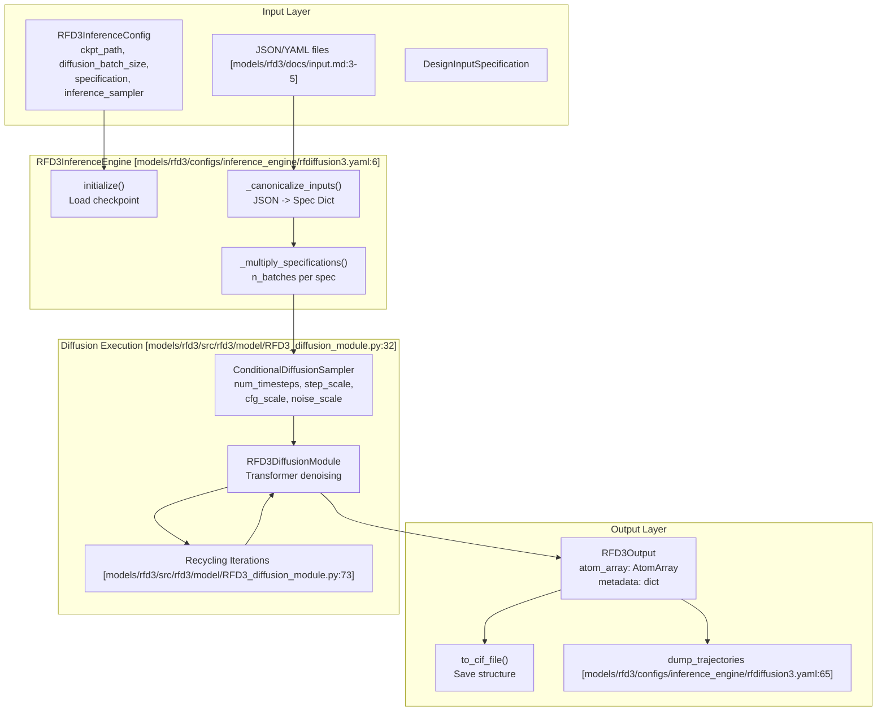

# RFD3 Overview and Capabilities

> **Relevant source files**
> * [models/rfd3/configs/inference_engine/rfdiffusion3.yaml](https://github.com/RosettaCommons/foundry/blob/cee116dc/models/rfd3/configs/inference_engine/rfdiffusion3.yaml)
> * [models/rfd3/configs/trainer/loss/losses/diffusion_loss.yaml](https://github.com/RosettaCommons/foundry/blob/cee116dc/models/rfd3/configs/trainer/loss/losses/diffusion_loss.yaml)
> * [models/rfd3/docs/.assets/input_selection_large.png](https://github.com/RosettaCommons/foundry/blob/cee116dc/models/rfd3/docs/.assets/input_selection_large.png)
> * [models/rfd3/docs/.assets/overview.png](https://github.com/RosettaCommons/foundry/blob/cee116dc/models/rfd3/docs/.assets/overview.png)
> * [models/rfd3/docs/designability_vs_diversity.md](https://github.com/RosettaCommons/foundry/blob/cee116dc/models/rfd3/docs/designability_vs_diversity.md?plain=1)
> * [models/rfd3/docs/input.md](https://github.com/RosettaCommons/foundry/blob/cee116dc/models/rfd3/docs/input.md?plain=1)
> * [models/rfd3/src/rfd3/model/RFD3_diffusion_module.py](https://github.com/RosettaCommons/foundry/blob/cee116dc/models/rfd3/src/rfd3/model/RFD3_diffusion_module.py)

## Purpose and Scope

This page provides a technical overview of RFdiffusion3 (RFD3), an all-atom generative model for biomolecular design. It covers the model's capabilities, core architecture, supported design applications, and conditioning mechanisms. For detailed information about the InputSpecification system and configuration syntax, see [InputSpecification System](/RosettaCommons/foundry/4.2-inputspecification-system). For specific design application guides and examples, see [Design Applications](/RosettaCommons/foundry/4.4-design-applications). For training details, see [RFD3 Training](/RosettaCommons/foundry/4.6-rfd3-training).

## What is RFdiffusion3?

RFdiffusion3 is an all-atom diffusion-based generative model that designs protein structures under complex constraints. Unlike backbone-only methods, RFD3 operates at full atomic resolution, enabling precise control over sidechain placement, ligand interactions, and interface design.

**Key Characteristics:**

* **All-atom generation**: Models complete atomic structures including sidechains with 14 heavy atoms per residue (Atom14 representation).
* **Conditional diffusion**: Supports multiple conditioning modalities via `DesignInputSpecification` (coordinates, sequence, RASA bins, hydrogen bonds, hotspots) [models/rfd3/docs/input.md L17-L24](https://github.com/RosettaCommons/foundry/blob/cee116dc/models/rfd3/docs/input.md?plain=1#L17-L24)
* **Flexible motif scaffolding**: Handles both indexed (`contig`) and unindexed (`unindex`) motifs with sequence-specified or sequence-free placement [models/rfd3/docs/input.md L18-L21](https://github.com/RosettaCommons/foundry/blob/cee116dc/models/rfd3/docs/input.md?plain=1#L18-L21)
* **Multi-modal compatibility**: Designs proteins, nucleic acids (DNA/RNA), and small molecule complexes.
* **Partial diffusion**: Refines existing structures by adding controlled noise via `partial_t` parameter [models/rfd3/docs/input.md L22](https://github.com/RosettaCommons/foundry/blob/cee116dc/models/rfd3/docs/input.md?plain=1#L22-L22)

Sources: [models/rfd3/docs/input.md L1-L47](https://github.com/RosettaCommons/foundry/blob/cee116dc/models/rfd3/docs/input.md?plain=1#L1-L47)

 [models/rfd3/configs/inference_engine/rfdiffusion3.yaml L6-L51](https://github.com/RosettaCommons/foundry/blob/cee116dc/models/rfd3/configs/inference_engine/rfdiffusion3.yaml#L6-L51)

## Core Architecture

### Diffusion Module Implementation

The core of RFD3 is the `RFD3DiffusionModule`, which implements a UNet-like architecture processing both token (residue) and atom levels.

**Key Components of RFD3DiffusionModule:**

* **LocalAtomTransformer**: Processes atom-level features and pairwise interactions [models/rfd3/src/rfd3/model/RFD3_diffusion_module.py L99-L101](https://github.com/RosettaCommons/foundry/blob/cee116dc/models/rfd3/src/rfd3/model/RFD3_diffusion_module.py#L99-L101)
* **DiffusionTokenEncoder**: Pools atom-level information to the token (residue) level [models/rfd3/src/rfd3/model/RFD3_diffusion_module.py L103-L109](https://github.com/RosettaCommons/foundry/blob/cee116dc/models/rfd3/src/rfd3/model/RFD3_diffusion_module.py#L103-L109)
* **LocalTokenTransformer**: Processes sequence-level relationships [models/rfd3/src/rfd3/model/RFD3_diffusion_module.py L111-L116](https://github.com/RosettaCommons/foundry/blob/cee116dc/models/rfd3/src/rfd3/model/RFD3_diffusion_module.py#L111-L116)
* **CompactStreamingDecoder**: Maps token-level updates back to atomic coordinate refinements [models/rfd3/src/rfd3/model/RFD3_diffusion_module.py L118-L125](https://github.com/RosettaCommons/foundry/blob/cee116dc/models/rfd3/src/rfd3/model/RFD3_diffusion_module.py#L118-L125)

**Data Flow in Forward Pass:**

1. **Time Processing**: Diffusion time `t` is embedded using `FourierEmbedding` and mapped to atom and token features [models/rfd3/src/rfd3/model/RFD3_diffusion_module.py L84-L92](https://github.com/RosettaCommons/foundry/blob/cee116dc/models/rfd3/src/rfd3/model/RFD3_diffusion_module.py#L84-L92)
2. **Position Scaling**: Input noisy coordinates `X_noisy_L` are scaled based on the prediction target (e.g., EDM scaling) [models/rfd3/src/rfd3/model/RFD3_diffusion_module.py L127-L142](https://github.com/RosettaCommons/foundry/blob/cee116dc/models/rfd3/src/rfd3/model/RFD3_diffusion_module.py#L127-L142)
3. **Recycling**: The module supports iterative refinement (recycling) where predictions are fed back to improve the denoising step [models/rfd3/src/rfd3/model/RFD3_diffusion_module.py L182-L191](https://github.com/RosettaCommons/foundry/blob/cee116dc/models/rfd3/src/rfd3/model/RFD3_diffusion_module.py#L182-L191)

Sources: [models/rfd3/src/rfd3/model/RFD3_diffusion_module.py L32-L125](https://github.com/RosettaCommons/foundry/blob/cee116dc/models/rfd3/src/rfd3/model/RFD3_diffusion_module.py#L32-L125)

 [models/rfd3/src/rfd3/model/RFD3_diffusion_module.py L187-L222](https://github.com/RosettaCommons/foundry/blob/cee116dc/models/rfd3/src/rfd3/model/RFD3_diffusion_module.py#L187-L222)

### Inference Engine Components

**RFD3InferenceEngine Architecture**



Sources: [models/rfd3/configs/inference_engine/rfdiffusion3.yaml L1-L69](https://github.com/RosettaCommons/foundry/blob/cee116dc/models/rfd3/configs/inference_engine/rfdiffusion3.yaml#L1-L69)

 [models/rfd3/src/rfd3/model/RFD3_diffusion_module.py L171-L222](https://github.com/RosettaCommons/foundry/blob/cee116dc/models/rfd3/src/rfd3/model/RFD3_diffusion_module.py#L171-L222)

## Design Capabilities

### Balancing Designability and Diversity

RFD3 allows users to tune the balance between the "novelty" of a fold and how easily it can be realized (designability).

* **Low Temperature Sampling**: By increasing `inference_sampler.step_scale` (default 1.5) and decreasing `inference_sampler.gamma_0` (default 0.6), the model is biased toward high-probability, more designable structures at the cost of diversity [models/rfd3/docs/designability_vs_diversity.md L6-L12](https://github.com/RosettaCommons/foundry/blob/cee116dc/models/rfd3/docs/designability_vs_diversity.md?plain=1#L6-L12)
* **Secondary Structure Control**: The `is_non_loopy` setting biases the model away from disordered regions, increasing designability [models/rfd3/docs/designability_vs_diversity.md L13-L15](https://github.com/RosettaCommons/foundry/blob/cee116dc/models/rfd3/docs/designability_vs_diversity.md?plain=1#L13-L15)

Sources: [models/rfd3/docs/designability_vs_diversity.md L1-L15](https://github.com/RosettaCommons/foundry/blob/cee116dc/models/rfd3/docs/designability_vs_diversity.md?plain=1#L1-L15)

 [models/rfd3/configs/inference_engine/rfdiffusion3.yaml L44-L48](https://github.com/RosettaCommons/foundry/blob/cee116dc/models/rfd3/configs/inference_engine/rfdiffusion3.yaml#L44-L48)

### Supported Design Applications

| Application | Key Parameters | Purpose |
| --- | --- | --- |
| **Unconditional Generation** | `length` | Generate novel protein backbones [models/rfd3/docs/input.md L39](https://github.com/RosettaCommons/foundry/blob/cee116dc/models/rfd3/docs/input.md?plain=1#L39-L39) |
| **Motif Scaffolding** | `contig`, `select_fixed_atoms` | Fix specific coordinates and sequence [models/rfd3/docs/input.md L39](https://github.com/RosettaCommons/foundry/blob/cee116dc/models/rfd3/docs/input.md?plain=1#L39-L39) |
| **Unindexed Scaffolding** | `unindex` | Sequence-free placement of motifs. |
| **Partial Diffusion** | `partial_t` | Refine existing structures by adding noise [models/rfd3/docs/input.md L22](https://github.com/RosettaCommons/foundry/blob/cee116dc/models/rfd3/docs/input.md?plain=1#L22-L22) |
| **Symmetry Support** | `inference_sampler.kind: "symmetry"` | Design cyclic, dihedral, or higher-order assemblies [models/rfd3/configs/inference_engine/rfdiffusion3.yaml L25](https://github.com/RosettaCommons/foundry/blob/cee116dc/models/rfd3/configs/inference_engine/rfdiffusion3.yaml#L25-L25) |
| **Ligand Binding** | `ligand`, `select_buried`, `select_exposed` | Design pockets around small molecules [models/rfd3/docs/input.md L41](https://github.com/RosettaCommons/foundry/blob/cee116dc/models/rfd3/docs/input.md?plain=1#L41-L41) |

Sources: [models/rfd3/docs/input.md L17-L24](https://github.com/RosettaCommons/foundry/blob/cee116dc/models/rfd3/docs/input.md?plain=1#L17-L24)

 [models/rfd3/configs/inference_engine/rfdiffusion3.yaml L24-L35](https://github.com/RosettaCommons/foundry/blob/cee116dc/models/rfd3/configs/inference_engine/rfdiffusion3.yaml#L24-L35)

### Conditioning and Classifier-Free Guidance (CFG)

RFD3 uses Classifier-Free Guidance to steer generation toward specific conditions without requiring a separate classifier model.

* **CFG Features**: Supported features for guidance include `active_donor`, `active_acceptor`, and `ref_atomwise_rasa` [models/rfd3/configs/inference_engine/rfdiffusion3.yaml L27-L30](https://github.com/RosettaCommons/foundry/blob/cee116dc/models/rfd3/configs/inference_engine/rfdiffusion3.yaml#L27-L30)
* **Control Parameters**: * `use_classifier_free_guidance`: Set to `True` to enable [models/rfd3/configs/inference_engine/rfdiffusion3.yaml L32](https://github.com/RosettaCommons/foundry/blob/cee116dc/models/rfd3/configs/inference_engine/rfdiffusion3.yaml#L32-L32) * `cfg_scale`: Controls the strength of the guidance (default 1.5) [models/rfd3/configs/inference_engine/rfdiffusion3.yaml L34](https://github.com/RosettaCommons/foundry/blob/cee116dc/models/rfd3/configs/inference_engine/rfdiffusion3.yaml#L34-L34) * `cfg_t_max`: Maximum diffusion time to apply guidance [models/rfd3/configs/inference_engine/rfdiffusion3.yaml L33](https://github.com/RosettaCommons/foundry/blob/cee116dc/models/rfd3/configs/inference_engine/rfdiffusion3.yaml#L33-L33)

Sources: [models/rfd3/configs/inference_engine/rfdiffusion3.yaml L24-L34](https://github.com/RosettaCommons/foundry/blob/cee116dc/models/rfd3/configs/inference_engine/rfdiffusion3.yaml#L24-L34)

 [models/rfd3/docs/input.md L85-L88](https://github.com/RosettaCommons/foundry/blob/cee116dc/models/rfd3/docs/input.md?plain=1#L85-L88)

## Example Configuration

### JSON Input Specification

The JSON input defines the physical constraints of the design task.

```json
{    "spec-1": {      "input": "path/to/pdb",      "contig": "50-80,/0,A1-100",      "select_unfixed_sequence": "A20-35",      "ligand": "HAX,OAA"    }}
```

Sources: [models/rfd3/docs/input.md L34-L47](https://github.com/RosettaCommons/foundry/blob/cee116dc/models/rfd3/docs/input.md?plain=1#L34-L47)

### CLI Execution

The CLI manages job parameters like batch size and output directory.

```html
rfd3 design \  out_dir=<path/to/outdir> \  inputs=<path/to/inputs.json> \  diffusion_batch_size=8 \  n_batches=1
```

Sources: [models/rfd3/docs/input.md L49-L66](https://github.com/RosettaCommons/foundry/blob/cee116dc/models/rfd3/docs/input.md?plain=1#L49-L66)

## Implementation Details

### Coordinate Scaling

RFD3 implements multiple scaling strategies for coordinates during the diffusion process in `RFD3DiffusionModule`:

* **EDM Scaling**: Scales positions based on `sigma_data` and time `t` [models/rfd3/src/rfd3/model/RFD3_diffusion_module.py L133-L134](https://github.com/RosettaCommons/foundry/blob/cee116dc/models/rfd3/src/rfd3/model/RFD3_diffusion_module.py#L133-L134)
* **Noise Prediction**: Direct prediction of added noise [models/rfd3/src/rfd3/model/RFD3_diffusion_module.py L137-L138](https://github.com/RosettaCommons/foundry/blob/cee116dc/models/rfd3/src/rfd3/model/RFD3_diffusion_module.py#L137-L138)

### Loss Function

The training objective is defined in `DiffusionLoss`, which includes weights for:

* **All-atom coordinates**: Weight of 4.0 [models/rfd3/configs/trainer/loss/losses/diffusion_loss.yaml L3](https://github.com/RosettaCommons/foundry/blob/cee116dc/models/rfd3/configs/trainer/loss/losses/diffusion_loss.yaml#L3-L3)
* **Ligands**: Weight of 10.0 [models/rfd3/configs/trainer/loss/losses/diffusion_loss.yaml L12](https://github.com/RosettaCommons/foundry/blob/cee116dc/models/rfd3/configs/trainer/loss/losses/diffusion_loss.yaml#L12-L12)
* **pLDDT**: Confidence prediction weight of 0.25 [models/rfd3/configs/trainer/loss/losses/diffusion_loss.yaml L4](https://github.com/RosettaCommons/foundry/blob/cee116dc/models/rfd3/configs/trainer/loss/losses/diffusion_loss.yaml#L4-L4)

Sources: [models/rfd3/src/rfd3/model/RFD3_diffusion_module.py L127-L159](https://github.com/RosettaCommons/foundry/blob/cee116dc/models/rfd3/src/rfd3/model/RFD3_diffusion_module.py#L127-L159)

 [models/rfd3/configs/trainer/loss/losses/diffusion_loss.yaml L1-L12](https://github.com/RosettaCommons/foundry/blob/cee116dc/models/rfd3/configs/trainer/loss/losses/diffusion_loss.yaml#L1-L12)