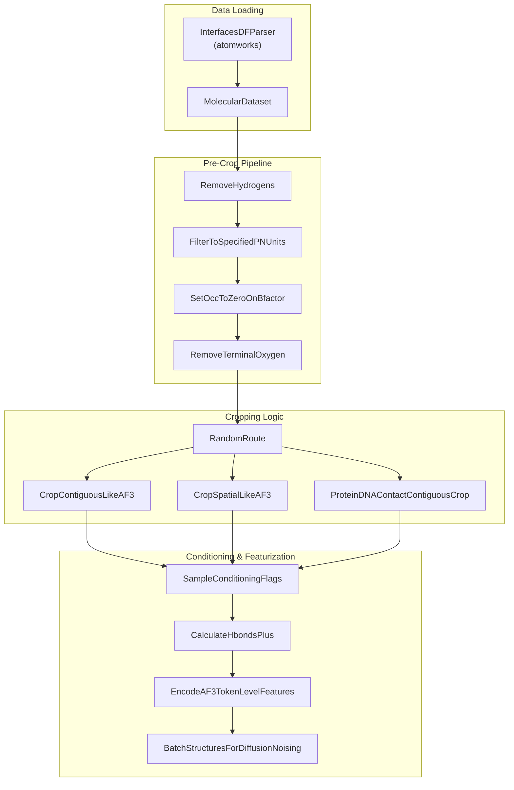
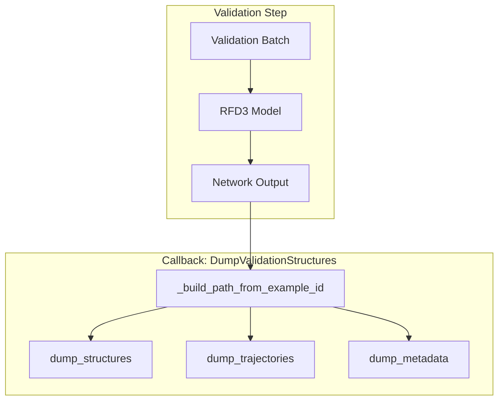

# RFD3 Training

> **Relevant source files**
> * [models/mpnn/tests/conftest.py](https://github.com/RosettaCommons/foundry/blob/cee116dc/models/mpnn/tests/conftest.py)
> * [models/rf3/configs/inference.yaml](https://github.com/RosettaCommons/foundry/blob/cee116dc/models/rf3/configs/inference.yaml)
> * [models/rf3/configs/train.yaml](https://github.com/RosettaCommons/foundry/blob/cee116dc/models/rf3/configs/train.yaml)
> * [models/rf3/configs/validate.yaml](https://github.com/RosettaCommons/foundry/blob/cee116dc/models/rf3/configs/validate.yaml)
> * [models/rfd3/configs/datasets/train/pdb/af3_train_interface.yaml](https://github.com/RosettaCommons/foundry/blob/cee116dc/models/rfd3/configs/datasets/train/pdb/af3_train_interface.yaml)
> * [models/rfd3/configs/datasets/train/pdb/af3_train_pn_unit.yaml](https://github.com/RosettaCommons/foundry/blob/cee116dc/models/rfd3/configs/datasets/train/pdb/af3_train_pn_unit.yaml)
> * [models/rfd3/configs/dev.yaml](https://github.com/RosettaCommons/foundry/blob/cee116dc/models/rfd3/configs/dev.yaml)
> * [models/rfd3/configs/experiment/pretrain.yaml](https://github.com/RosettaCommons/foundry/blob/cee116dc/models/rfd3/configs/experiment/pretrain.yaml)
> * [models/rfd3/configs/inference.yaml](https://github.com/RosettaCommons/foundry/blob/cee116dc/models/rfd3/configs/inference.yaml)
> * [models/rfd3/configs/logger/default.yaml](https://github.com/RosettaCommons/foundry/blob/cee116dc/models/rfd3/configs/logger/default.yaml)
> * [models/rfd3/configs/paths/data/default.yaml](https://github.com/RosettaCommons/foundry/blob/cee116dc/models/rfd3/configs/paths/data/default.yaml)
> * [models/rfd3/configs/train.yaml](https://github.com/RosettaCommons/foundry/blob/cee116dc/models/rfd3/configs/train.yaml)
> * [models/rfd3/configs/validate.yaml](https://github.com/RosettaCommons/foundry/blob/cee116dc/models/rfd3/configs/validate.yaml)
> * [models/rfd3/src/rfd3/trainer/dump_validation_structures.py](https://github.com/RosettaCommons/foundry/blob/cee116dc/models/rfd3/src/rfd3/trainer/dump_validation_structures.py)
> * [models/rfd3/src/rfd3/transforms/conditioning_base.py](https://github.com/RosettaCommons/foundry/blob/cee116dc/models/rfd3/src/rfd3/transforms/conditioning_base.py)
> * [models/rfd3/src/rfd3/transforms/hbonds_hbplus.py](https://github.com/RosettaCommons/foundry/blob/cee116dc/models/rfd3/src/rfd3/transforms/hbonds_hbplus.py)
> * [models/rfd3/src/rfd3/transforms/pipelines.py](https://github.com/RosettaCommons/foundry/blob/cee116dc/models/rfd3/src/rfd3/transforms/pipelines.py)

This page provides a comprehensive guide to training RFdiffusion3 models, including dataset configuration, conditioning strategies, hyperparameters, and distributed training setup. For information about running RFD3 inference, see [RFD3 Inference Pipeline](/RosettaCommons/foundry/4.5-rfd3-inference-pipeline). For general training infrastructure details applicable to all models, see [Training Infrastructure](/RosettaCommons/foundry/8.4-training-infrastructure).

---

## Overview

RFD3 training uses **Lightning Fabric** for distributed training orchestration, **Hydra** for hierarchical configuration management, and **AtomWorks** for unified biomolecular data processing. The training system supports:

* **PDB-scale training** on millions of structures with specialized filters for resolution and polymer units [models/rfd3/configs/datasets/train/pdb/af3_train_interface.yaml L13-L15](https://github.com/RosettaCommons/foundry/blob/cee116dc/models/rfd3/configs/datasets/train/pdb/af3_train_interface.yaml#L13-L15)
* **Conditional diffusion** with multiple conditioning strategies (unconditional, island, PPI, etc.) [models/rfd3/configs/experiment/pretrain.yaml L13-L23](https://github.com/RosettaCommons/foundry/blob/cee116dc/models/rfd3/configs/experiment/pretrain.yaml#L13-L23)
* **Multi-GPU/multi-node** distributed training via DDP using the `FabricTrainer`.
* **Hydrogen bond conditioning** via HBPLUS integration for motif-scaffolding tasks [models/rfd3/src/rfd3/transforms/hbonds_hbplus.py L177-L186](https://github.com/RosettaCommons/foundry/blob/cee116dc/models/rfd3/src/rfd3/transforms/hbonds_hbplus.py#L177-L186)
* **Validation dumping** of predicted structures and trajectories during training [models/rfd3/src/rfd3/trainer/dump_validation_structures.py L19-L34](https://github.com/RosettaCommons/foundry/blob/cee116dc/models/rfd3/src/rfd3/trainer/dump_validation_structures.py#L19-L34)

---

## Training Pipeline Architecture

The RFD3 training pipeline uses a complex series of transforms to prepare raw PDB data for diffusion training.

### Data Flow and Transform Pipeline



**Figure 1: RFD3 Training Transform Pipeline**
The pipeline filters structures based on B-factors [models/rfd3/src/rfd3/transforms/pipelines.py L156](https://github.com/RosettaCommons/foundry/blob/cee116dc/models/rfd3/src/rfd3/transforms/pipelines.py#L156-L156)

 performs stochastic cropping (contiguous vs. spatial) [models/rfd3/src/rfd3/transforms/pipelines.py L187-L213](https://github.com/RosettaCommons/foundry/blob/cee116dc/models/rfd3/src/rfd3/transforms/pipelines.py#L187-L213)

 and calculates hydrogen bonds [models/rfd3/src/rfd3/transforms/hbonds_hbplus.py L197-L202](https://github.com/RosettaCommons/foundry/blob/cee116dc/models/rfd3/src/rfd3/transforms/hbonds_hbplus.py#L197-L202)

 before batching for diffusion noising.

**Sources:** [models/rfd3/src/rfd3/transforms/pipelines.py L144-L213](https://github.com/RosettaCommons/foundry/blob/cee116dc/models/rfd3/src/rfd3/transforms/pipelines.py#L144-L213)

 [models/rfd3/src/rfd3/transforms/hbonds_hbplus.py L177-L202](https://github.com/RosettaCommons/foundry/blob/cee116dc/models/rfd3/src/rfd3/transforms/hbonds_hbplus.py#L177-L202)

---

## Dataset Configuration

### PDB Training

Training on the PDB uses specific filters to ensure data quality. The `InterfacesDFParser` loads metadata from parquet files [models/rfd3/configs/datasets/train/pdb/af3_train_interface.yaml L6-L10](https://github.com/RosettaCommons/foundry/blob/cee116dc/models/rfd3/configs/datasets/train/pdb/af3_train_interface.yaml#L6-L10)

Key filters applied during training:

* **Deposition Date**: Typically `< '2021-09-30'` to match RosettaFold2/3 benchmarks [models/rfd3/configs/datasets/train/pdb/af3_train_interface.yaml L13](https://github.com/RosettaCommons/foundry/blob/cee116dc/models/rfd3/configs/datasets/train/pdb/af3_train_interface.yaml#L13-L13)
* **Resolution**: Structures with resolution `> 9.0` are excluded [models/rfd3/configs/datasets/train/pdb/af3_train_interface.yaml L14](https://github.com/RosettaCommons/foundry/blob/cee116dc/models/rfd3/configs/datasets/train/pdb/af3_train_interface.yaml#L14-L14)
* **Polymer Size**: Maximum of 300 polymer units [models/rfd3/configs/datasets/train/pdb/af3_train_interface.yaml L15](https://github.com/RosettaCommons/foundry/blob/cee116dc/models/rfd3/configs/datasets/train/pdb/af3_train_interface.yaml#L15-L15)
* **Ligand Filtering**: Excludes common solvents and undesired ligands using `AF3_EXCLUDED_LIGANDS_REGEX` [models/rfd3/configs/datasets/train/pdb/af3_train_interface.yaml L18-L19](https://github.com/RosettaCommons/foundry/blob/cee116dc/models/rfd3/configs/datasets/train/pdb/af3_train_interface.yaml#L18-L19)

### Path Configuration

Paths for training data and caches are managed in `models/rfd3/configs/paths/data/default.yaml`:

* `pdb_data_dir`: Path to raw structure files [models/rfd3/configs/paths/data/default.yaml L2](https://github.com/RosettaCommons/foundry/blob/cee116dc/models/rfd3/configs/paths/data/default.yaml#L2-L2)
* `residue_cache_dir`: Directory for pre-computed embeddings (e.g., MACE/Egret) [models/rfd3/configs/paths/data/default.yaml L16](https://github.com/RosettaCommons/foundry/blob/cee116dc/models/rfd3/configs/paths/data/default.yaml#L16-L16)

---

## Conditioning Strategies

RFD3 is trained using a multi-task approach where different design scenarios are sampled with varying frequencies [models/rfd3/configs/experiment/pretrain.yaml L13-L23](https://github.com/RosettaCommons/foundry/blob/cee116dc/models/rfd3/configs/experiment/pretrain.yaml#L13-L23)

| Condition | Frequency | Purpose |
| --- | --- | --- |
| `unconditional` | 2.0 | General protein backbone generation |
| `island` | 2.0 | Partial diffusion/motif scaffolding |
| `tipatom` | 5.0 | High-frequency training for sparse atom conditioning |
| `sequence_design` | 0.5 | Sequence-constrained diffusion |
| `ppi` | 0.0 | (Configurable) Protein-protein interface design |

**Sources:** [models/rfd3/configs/experiment/pretrain.yaml L13-L23](https://github.com/RosettaCommons/foundry/blob/cee116dc/models/rfd3/configs/experiment/pretrain.yaml#L13-L23)

### Hydrogen Bond Conditioning (HBPLUS)

During training, hydrogen bonds are calculated to provide conditioning signals for polar atom interactions. The `CalculateHbondsPlus` transform [models/rfd3/src/rfd3/transforms/hbonds_hbplus.py L177](https://github.com/RosettaCommons/foundry/blob/cee116dc/models/rfd3/src/rfd3/transforms/hbonds_hbplus.py#L177-L177)

 uses the `hbplus` executable to identify donor and acceptor atoms between the motif and diffused regions [models/rfd3/src/rfd3/transforms/hbonds_hbplus.py L162-L167](https://github.com/RosettaCommons/foundry/blob/cee116dc/models/rfd3/src/rfd3/transforms/hbonds_hbplus.py#L162-L167)

This requires the `HBPLUS_PATH` environment variable to be set [models/rfd3/src/rfd3/transforms/hbonds_hbplus.py L70-L76](https://github.com/RosettaCommons/foundry/blob/cee116dc/models/rfd3/src/rfd3/transforms/hbonds_hbplus.py#L70-L76)

---

## Training and Validation Execution

### Configuration System

RFD3 uses Hydra for configuration composition. The `train.yaml` and `validate.yaml` files define the default stacks:

* **Model**: `rfd3_base` [models/rfd3/configs/train.yaml L8](https://github.com/RosettaCommons/foundry/blob/cee116dc/models/rfd3/configs/train.yaml#L8-L8)
* **Trainer**: `rfd3_base` [models/rfd3/configs/train.yaml L9](https://github.com/RosettaCommons/foundry/blob/cee116dc/models/rfd3/configs/train.yaml#L9-L9)
* **Dataloader**: `fast` [models/rfd3/configs/train.yaml L12](https://github.com/RosettaCommons/foundry/blob/cee116dc/models/rfd3/configs/train.yaml#L12-L12)

### Validation Structure Dumping

To monitor training progress, the `DumpValidationStructuresCallback` saves predicted structures as CIF files [models/rfd3/src/rfd3/trainer/dump_validation_structures.py L19-L34](https://github.com/RosettaCommons/foundry/blob/cee116dc/models/rfd3/src/rfd3/trainer/dump_validation_structures.py#L19-L34)



**Figure 2: Validation Structure Dumping Process**
The callback builds file paths based on PDB IDs and assembly IDs extracted from the `example_id` [models/rfd3/src/rfd3/trainer/dump_validation_structures.py L56-L71](https://github.com/RosettaCommons/foundry/blob/cee116dc/models/rfd3/src/rfd3/trainer/dump_validation_structures.py#L56-L71)

 It can dump full denoising trajectories (`X_denoised_L_traj`) or just final predictions [models/rfd3/src/rfd3/trainer/dump_validation_structures.py L132-L135](https://github.com/RosettaCommons/foundry/blob/cee116dc/models/rfd3/src/rfd3/trainer/dump_validation_structures.py#L132-L135)

**Sources:** [models/rfd3/src/rfd3/trainer/dump_validation_structures.py L56-L155](https://github.com/RosettaCommons/foundry/blob/cee116dc/models/rfd3/src/rfd3/trainer/dump_validation_structures.py#L56-L155)

 [models/rfd3/configs/validate.yaml L28-L33](https://github.com/RosettaCommons/foundry/blob/cee116dc/models/rfd3/configs/validate.yaml#L28-L33)

### Running Training

Training is typically initiated via the `train.py` entry point (inherited from the Foundry framework structure):

```markdown
# Example training commandpython models/rfd3/src/rfd3/train.py experiment=pretrain
```

Validation can be run independently to assess a checkpoint:

```
python models/rfd3/src/rfd3/train.py task_name=validate experiment=pretrain ckpt_path=/path/to/model.ckpt
```

**Sources:** [models/rfd3/configs/train.yaml L21-L25](https://github.com/RosettaCommons/foundry/blob/cee116dc/models/rfd3/configs/train.yaml#L21-L25)

 [models/rfd3/configs/validate.yaml L21-L35](https://github.com/RosettaCommons/foundry/blob/cee116dc/models/rfd3/configs/validate.yaml#L21-L35)