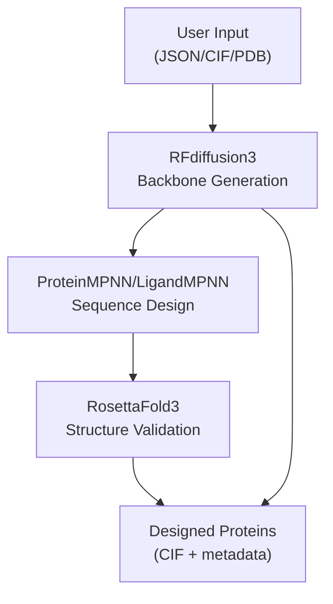
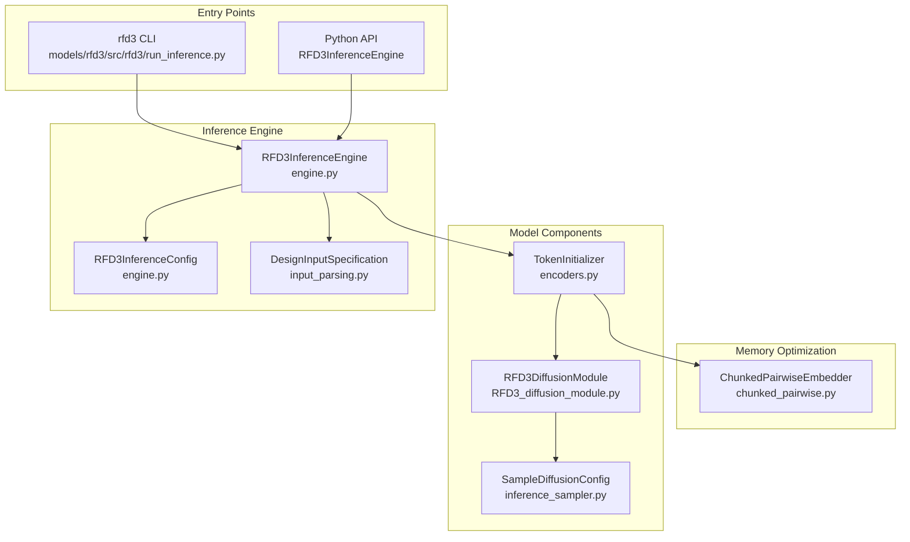
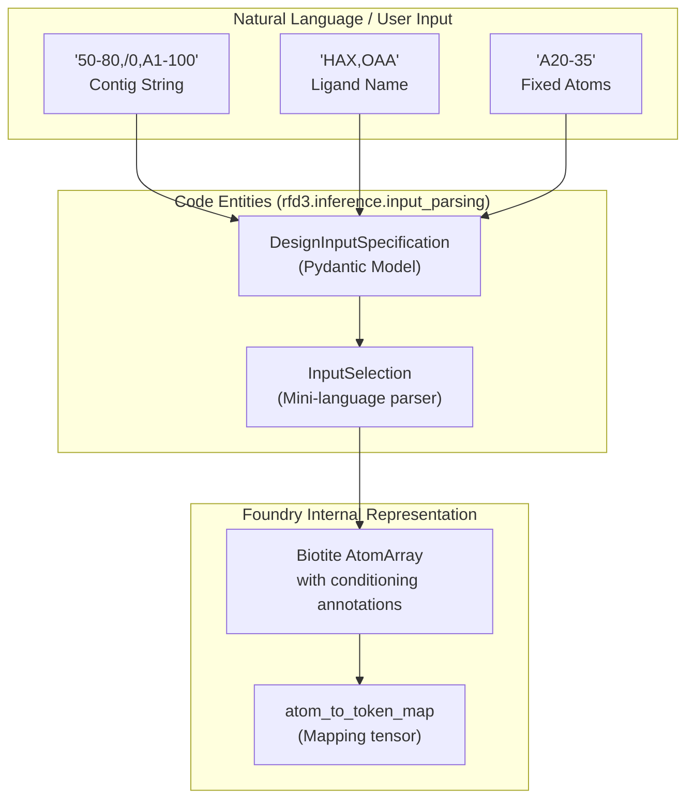

# RFdiffusion3 (RFD3)

> **Relevant source files**
> * [.gitignore](https://github.com/RosettaCommons/foundry/blob/cee116dc/.gitignore)
> * [examples/all.ipynb](https://github.com/RosettaCommons/foundry/blob/cee116dc/examples/all.ipynb)
> * [models/rfd3/configs/inference_engine/base.yaml](https://github.com/RosettaCommons/foundry/blob/cee116dc/models/rfd3/configs/inference_engine/base.yaml)
> * [models/rfd3/configs/inference_engine/rfdiffusion3.yaml](https://github.com/RosettaCommons/foundry/blob/cee116dc/models/rfd3/configs/inference_engine/rfdiffusion3.yaml)
> * [models/rfd3/configs/trainer/loss/losses/diffusion_loss.yaml](https://github.com/RosettaCommons/foundry/blob/cee116dc/models/rfd3/configs/trainer/loss/losses/diffusion_loss.yaml)
> * [models/rfd3/docs/.assets/input_selection_large.png](https://github.com/RosettaCommons/foundry/blob/cee116dc/models/rfd3/docs/.assets/input_selection_large.png)
> * [models/rfd3/docs/input.md](https://github.com/RosettaCommons/foundry/blob/cee116dc/models/rfd3/docs/input.md?plain=1)
> * [models/rfd3/src/rfd3/engine.py](https://github.com/RosettaCommons/foundry/blob/cee116dc/models/rfd3/src/rfd3/engine.py)
> * [models/rfd3/src/rfd3/inference/datasets.py](https://github.com/RosettaCommons/foundry/blob/cee116dc/models/rfd3/src/rfd3/inference/datasets.py)
> * [models/rfd3/src/rfd3/model/RFD3_diffusion_module.py](https://github.com/RosettaCommons/foundry/blob/cee116dc/models/rfd3/src/rfd3/model/RFD3_diffusion_module.py)
> * [models/rfd3/src/rfd3/model/layers/chunked_pairwise.py](https://github.com/RosettaCommons/foundry/blob/cee116dc/models/rfd3/src/rfd3/model/layers/chunked_pairwise.py)
> * [models/rfd3/src/rfd3/model/layers/encoders.py](https://github.com/RosettaCommons/foundry/blob/cee116dc/models/rfd3/src/rfd3/model/layers/encoders.py)
> * [models/rfd3/src/rfd3/run_inference.py](https://github.com/RosettaCommons/foundry/blob/cee116dc/models/rfd3/src/rfd3/run_inference.py)
> * [models/rfd3/src/rfd3/trainer/rfd3.py](https://github.com/RosettaCommons/foundry/blob/cee116dc/models/rfd3/src/rfd3/trainer/rfd3.py)
> * [models/rfd3/src/rfd3/utils/inference.py](https://github.com/RosettaCommons/foundry/blob/cee116dc/models/rfd3/src/rfd3/utils/inference.py)
> * [models/rfd3na/src/rfd3na/utils/inference.py](https://github.com/RosettaCommons/foundry/blob/cee116dc/models/rfd3na/src/rfd3na/utils/inference.py)

RFdiffusion3 (RFD3) is an all-atom generative diffusion model for protein structure design under complex constraints. It enables unconditional protein generation, motif scaffolding, partial diffusion, symmetric design, and conditioning on various biophysical properties including hydrogen bonds, hotspots, and solvent accessibility.

This page provides comprehensive documentation of the RFD3 model architecture, core components, and usage patterns within the Foundry framework. For specific topics:

* Input specification details: see [InputSpecification System](/RosettaCommons/foundry/4.2-inputspecification-system)
* Diffusion sampling and symmetry: see [Diffusion Sampling and Symmetry](/RosettaCommons/foundry/4.3-diffusion-sampling-and-symmetry)
* Application-specific guides: see [Design Applications](/RosettaCommons/foundry/4.4-design-applications)
* Inference pipeline details: see [RFD3 Inference Pipeline](/RosettaCommons/foundry/4.5-rfd3-inference-pipeline)
* Training and fine-tuning: see [RFD3 Training](/RosettaCommons/foundry/4.6-rfd3-training)
* Multipolymer (Protein-DNA-RNA) design: see [RFdiffusion3NA (RFD3NA)](/RosettaCommons/foundry/4.7-rfdiffusion3na-(rfd3na))

---

## RFD3 in the Foundry Ecosystem

RFD3 is the backbone generation module in the Foundry design pipeline. It generates all-atom backbones that are then passed to MPNN for sequence design and RosettaFold3 for structure validation.

**Diagram: RFD3 in the Foundry Pipeline**

**Sources:** [examples/all.ipynb L12-L27](https://github.com/RosettaCommons/foundry/blob/cee116dc/examples/all.ipynb#L12-L27)

 [models/rfd3/docs/input.md L3-L5](https://github.com/RosettaCommons/foundry/blob/cee116dc/models/rfd3/docs/input.md?plain=1#L3-L5)

---

## Core Architecture

RFD3 is built on a diffusion transformer architecture. It uses a UNet-like structure that processes information across both token (residue) and atom levels, allowing for precise all-atom conditioning.

**Diagram: RFD3 System Architecture**

**Sources:** [models/rfd3/src/rfd3/engine.py L139-L175](https://github.com/RosettaCommons/foundry/blob/cee116dc/models/rfd3/src/rfd3/engine.py#L139-L175)

 [models/rfd3/src/rfd3/model/RFD3_diffusion_module.py L32-L125](https://github.com/RosettaCommons/foundry/blob/cee116dc/models/rfd3/src/rfd3/model/RFD3_diffusion_module.py#L32-L125)

 [models/rfd3/src/rfd3/model/layers/encoders.py L36-L156](https://github.com/RosettaCommons/foundry/blob/cee116dc/models/rfd3/src/rfd3/model/layers/encoders.py#L36-L156)

---

## Key Classes and Their Roles

### RFD3InferenceEngine

The `RFD3InferenceEngine` is the central orchestrator. It handles input validation, model loading, and the execution of the diffusion sampling loop.

| Component | Class/File | Purpose |
| --- | --- | --- |
| **Main Engine** | `RFD3InferenceEngine` | Manages the inference lifecycle and batching [models/rfd3/src/rfd3/engine.py L139](https://github.com/RosettaCommons/foundry/blob/cee116dc/models/rfd3/src/rfd3/engine.py#L139-L139) |
| **Configuration** | `RFD3InferenceConfig` | Holds hyperparameters like `diffusion_batch_size` and `low_memory_mode` [models/rfd3/src/rfd3/engine.py L44](https://github.com/RosettaCommons/foundry/blob/cee116dc/models/rfd3/src/rfd3/engine.py#L44-L44) |
| **Output Container** | `RFD3Output` | Wraps generated `AtomArray` and prediction metadata [models/rfd3/src/rfd3/engine.py L91](https://github.com/RosettaCommons/foundry/blob/cee116dc/models/rfd3/src/rfd3/engine.py#L91-L91) |
| **Input Parser** | `DesignInputSpecification` | Pydantic model for validating design requirements [models/rfd3/src/rfd3/engine.py L25](https://github.com/RosettaCommons/foundry/blob/cee116dc/models/rfd3/src/rfd3/engine.py#L25-L25) |

**Key Methods:**

* `run()`: Entry point for starting design jobs [models/rfd3/src/rfd3/engine.py L205](https://github.com/RosettaCommons/foundry/blob/cee116dc/models/rfd3/src/rfd3/engine.py#L205-L205)
* `RFD3Output.dump()`: Writes structures to `.cif.gz` and metadata to `.json` [models/rfd3/src/rfd3/engine.py L98](https://github.com/RosettaCommons/foundry/blob/cee116dc/models/rfd3/src/rfd3/engine.py#L98-L98)

**Sources:** [models/rfd3/src/rfd3/engine.py L43-L175](https://github.com/RosettaCommons/foundry/blob/cee116dc/models/rfd3/src/rfd3/engine.py#L43-L175)

### Model Architecture (RFD3DiffusionModule)

The core neural network is a diffusion transformer that iteratively predicts denoised coordinates.

* **TokenInitializer**: Encodes 1D and 2D features into initial representations [models/rfd3/src/rfd3/model/layers/encoders.py L36](https://github.com/RosettaCommons/foundry/blob/cee116dc/models/rfd3/src/rfd3/model/layers/encoders.py#L36-L36)
* **ChunkedPairwiseEmbedder**: A memory-optimized embedder that reduces complexity from $O(L^2)$ to $O(L \times k)$ for large structures [models/rfd3/src/rfd3/model/layers/chunked_pairwise.py L142](https://github.com/RosettaCommons/foundry/blob/cee116dc/models/rfd3/src/rfd3/model/layers/chunked_pairwise.py#L142-L142)
* **LocalAtomTransformer**: Processes all-atom geometric information locally [models/rfd3/src/rfd3/model/RFD3_diffusion_module.py L99](https://github.com/RosettaCommons/foundry/blob/cee116dc/models/rfd3/src/rfd3/model/RFD3_diffusion_module.py#L99-L99)

**Sources:** [models/rfd3/src/rfd3/model/RFD3_diffusion_module.py L32-L125](https://github.com/RosettaCommons/foundry/blob/cee116dc/models/rfd3/src/rfd3/model/RFD3_diffusion_module.py#L32-L125)

 [models/rfd3/src/rfd3/model/layers/chunked_pairwise.py L1-L150](https://github.com/RosettaCommons/foundry/blob/cee116dc/models/rfd3/src/rfd3/model/layers/chunked_pairwise.py#L1-L150)

---

## Input Specification System

RFD3 uses a flexible JSON/YAML input format. Users define "contigs" (structural regions) and conditioning constraints.

**Diagram: Input Data Space to Code Entity Space**

**Sources:** [models/rfd3/docs/input.md L34-L47](https://github.com/RosettaCommons/foundry/blob/cee116dc/models/rfd3/docs/input.md?plain=1#L34-L47)

 [models/rfd3/src/rfd3/engine.py L24-L27](https://github.com/RosettaCommons/foundry/blob/cee116dc/models/rfd3/src/rfd3/engine.py#L24-L27)

 [models/rfd3/src/rfd3/utils/inference.py L92-L138](https://github.com/RosettaCommons/foundry/blob/cee116dc/models/rfd3/src/rfd3/utils/inference.py#L92-L138)

---

## Diffusion and Sampling

The sampling process is governed by the `SampleDiffusionConfig`. It controls the reverse diffusion schedule and conditioning guidance.

| Parameter | Default | Description |
| --- | --- | --- |
| `num_timesteps` | 200 | Number of denoising steps [models/rfd3/configs/inference_engine/rfdiffusion3.yaml L44](https://github.com/RosettaCommons/foundry/blob/cee116dc/models/rfd3/configs/inference_engine/rfdiffusion3.yaml#L44-L44) |
| `step_scale` | 1.5 | Scales step size; higher is less diverse but more designable [models/rfd3/configs/inference_engine/rfdiffusion3.yaml L45](https://github.com/RosettaCommons/foundry/blob/cee116dc/models/rfd3/configs/inference_engine/rfdiffusion3.yaml#L45-L45) |
| `kind` | "default" | Sampler type ("default" or "symmetry") [models/rfd3/configs/inference_engine/rfdiffusion3.yaml L25](https://github.com/RosettaCommons/foundry/blob/cee116dc/models/rfd3/configs/inference_engine/rfdiffusion3.yaml#L25-L25) |
| `cfg_scale` | 1.5 | Strength of classifier-free guidance [models/rfd3/configs/inference_engine/rfdiffusion3.yaml L34](https://github.com/RosettaCommons/foundry/blob/cee116dc/models/rfd3/configs/inference_engine/rfdiffusion3.yaml#L34-L34) |

**Sources:** [models/rfd3/configs/inference_engine/rfdiffusion3.yaml L23-L51](https://github.com/RosettaCommons/foundry/blob/cee116dc/models/rfd3/configs/inference_engine/rfdiffusion3.yaml#L23-L51)

 [models/rfd3/src/rfd3/model/RFD3_diffusion_module.py L171-L214](https://github.com/RosettaCommons/foundry/blob/cee116dc/models/rfd3/src/rfd3/model/RFD3_diffusion_module.py#L171-L214)

---

## Design Applications

RFD3 supports a variety of design tasks by modifying the `InputSpecification`:

* **Unconditional Generation**: Set `inputs=null` and specify `length` [examples/all.ipynb L101-L105](https://github.com/RosettaCommons/foundry/blob/cee116dc/examples/all.ipynb#L101-L105)
* **Motif Scaffolding**: Provide a PDB input and define fixed regions in the `contig` string [models/rfd3/docs/input.md L39](https://github.com/RosettaCommons/foundry/blob/cee116dc/models/rfd3/docs/input.md?plain=1#L39-L39)
* **Ligand Binding**: Specify ligand residue names via the `ligand` field [models/rfd3/docs/input.md L41](https://github.com/RosettaCommons/foundry/blob/cee116dc/models/rfd3/docs/input.md?plain=1#L41-L41)
* **Partial Diffusion**: Add noise to an existing structure and denoise from `partial_t` [models/rfd3/docs/input.md L22](https://github.com/RosettaCommons/foundry/blob/cee116dc/models/rfd3/docs/input.md?plain=1#L22-L22)

For details, see [Design Applications](/RosettaCommons/foundry/4.4-design-applications).

---

## RFD3 Training

Training involves a `FabricTrainer` (specifically `AADesignTrainer`) and a complex featurization pipeline.

* **AADesignTrainer**: Handles the training step, including recycling schedules and all-atom loss computation [models/rfd3/src/rfd3/trainer/rfd3.py L33](https://github.com/RosettaCommons/foundry/blob/cee116dc/models/rfd3/src/rfd3/trainer/rfd3.py#L33-L33)
* **Recycling**: RFD3 uses recycling during training to improve structure quality [models/rfd3/src/rfd3/trainer/rfd3.py L154](https://github.com/RosettaCommons/foundry/blob/cee116dc/models/rfd3/src/rfd3/trainer/rfd3.py#L154-L154)
* **Loss**: Coordinate prediction is supervised via a specialized diffusion loss [models/rfd3/configs/trainer/loss/losses/diffusion_loss.yaml L1-L12](https://github.com/RosettaCommons/foundry/blob/cee116dc/models/rfd3/configs/trainer/loss/losses/diffusion_loss.yaml#L1-L12)

For details, see [RFD3 Training](/RosettaCommons/foundry/4.6-rfd3-training).

---

## RFdiffusion3NA (RFD3NA)

RFD3NA extends the base model to support Nucleic Acids (DNA/RNA). It uses a specialized inference engine and CLI (`rfd3na`).

* **Capabilities**: Co-designing proteins with DNA/RNA chains.
* **Input Differences**: Requires NA-specific specifications in the contig and ligand strings.

For details, see [RFdiffusion3NA (RFD3NA)](/RosettaCommons/foundry/4.7-rfdiffusion3na-(rfd3na)).

**Sources:** [models/rfd3/src/rfd3/utils/inference.py L141-L164](https://github.com/RosettaCommons/foundry/blob/cee116dc/models/rfd3/src/rfd3/utils/inference.py#L141-L164)

 (NA extraction logic)