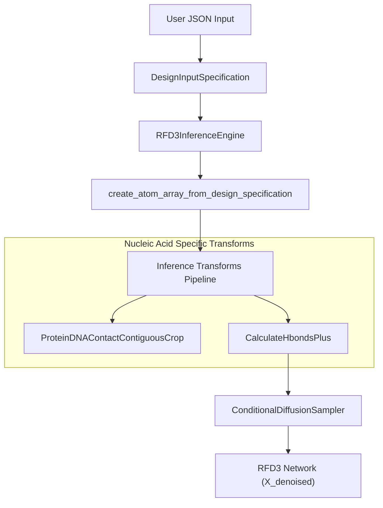
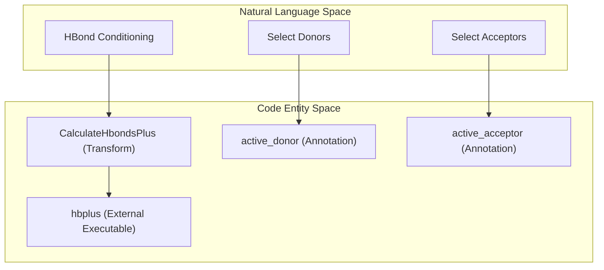

# RFdiffusion3NA (RFD3NA)

> **Relevant source files**
> * [models/mpnn/tests/conftest.py](https://github.com/RosettaCommons/foundry/blob/cee116dc/models/mpnn/tests/conftest.py)
> * [models/rfd3/configs/experiment/pretrain.yaml](https://github.com/RosettaCommons/foundry/blob/cee116dc/models/rfd3/configs/experiment/pretrain.yaml)
> * [models/rfd3/docs/examples/na_binder_design.md](https://github.com/RosettaCommons/foundry/blob/cee116dc/models/rfd3/docs/examples/na_binder_design.md?plain=1)
> * [models/rfd3/src/rfd3/trainer/dump_validation_structures.py](https://github.com/RosettaCommons/foundry/blob/cee116dc/models/rfd3/src/rfd3/trainer/dump_validation_structures.py)
> * [models/rfd3/src/rfd3/transforms/conditioning_base.py](https://github.com/RosettaCommons/foundry/blob/cee116dc/models/rfd3/src/rfd3/transforms/conditioning_base.py)
> * [models/rfd3/src/rfd3/transforms/hbonds_hbplus.py](https://github.com/RosettaCommons/foundry/blob/cee116dc/models/rfd3/src/rfd3/transforms/hbonds_hbplus.py)
> * [models/rfd3/src/rfd3/transforms/pipelines.py](https://github.com/RosettaCommons/foundry/blob/cee116dc/models/rfd3/src/rfd3/transforms/pipelines.py)

RFdiffusion3NA (RFD3NA) is an extension of the RFdiffusion3 (RFD3) model specifically optimized for the design of multipolymer systems, including protein-DNA and protein-RNA complexes. While the base RFD3 model supports nucleic acids as fixed targets, RFD3NA enables more sophisticated sampling and specification for complex interactions involving nucleic acid backbones and bases.

## Overview and Capabilities

RFD3NA expands the generative capabilities of the Foundry system by treating DNA and RNA as first-class polymers alongside proteins. It supports:

* **Multipolymer Design**: Simultaneous handling of protein, DNA, and RNA chains within a single design specification [models/rfd3/docs/examples/na_binder_design.md L1-L84](https://github.com/RosettaCommons/foundry/blob/cee116dc/models/rfd3/docs/examples/na_binder_design.md?plain=1#L1-L84)
* **Nucleic Acid Diffusion**: Ability to sample nucleic acid conformations rather than treating them as strictly fixed motifs [models/rfd3/docs/examples/na_binder_design.md L55-L68](https://github.com/RosettaCommons/foundry/blob/cee116dc/models/rfd3/docs/examples/na_binder_design.md?plain=1#L55-L68)
* **Advanced Conditioning**: Support for hydrogen bond (HBond) conditioning on specific nucleic acid atoms (e.g., N7, O6, phosphate backbone) to guide the design of specific interface interactions [models/rfd3/docs/examples/na_binder_design.md L86-L116](https://github.com/RosettaCommons/foundry/blob/cee116dc/models/rfd3/docs/examples/na_binder_design.md?plain=1#L86-L116)

## System Architecture and Data Flow

The RFD3NA pipeline leverages the standard RFD3 inference engine but utilizes specific transforms and input processing to handle the unique requirements of nucleic acids.

### Natural Language to Code Entity Space: Inference Pipeline

The following diagram illustrates how user-provided specifications in a JSON file are translated into the internal `AtomArray` and processed by the model.

**Inference Pipeline Flow**

Sources: [models/rfd3/src/rfd3/transforms/pipelines.py L144-L197](https://github.com/RosettaCommons/foundry/blob/cee116dc/models/rfd3/src/rfd3/transforms/pipelines.py#L144-L197)

 [models/rfd3/src/rfd3/transforms/conditioning_base.py L5-L8](https://github.com/RosettaCommons/foundry/blob/cee116dc/models/rfd3/src/rfd3/transforms/conditioning_base.py#L5-L8)

 [models/rfd3/src/rfd3/transforms/hbonds_hbplus.py L177-L200](https://github.com/RosettaCommons/foundry/blob/cee116dc/models/rfd3/src/rfd3/transforms/hbonds_hbplus.py#L177-L200)

## Nucleic Acid Specification

RFD3NA utilizes a specific syntax within the `contig` and `select_fixed_atoms` fields to define the behavior of nucleic acid chains.

### Contig Format

The `contig` string defines the sequence and connectivity of the polymers. For nucleic acids, standard PDB chain identifiers are used.

* **Fixed Nucleic Acids**: Specified by chain and residue range (e.g., `A1-10`).
* **Chain Breaks**: Denoted by `/0`.
* **Example**: `"contig": "A1-10,/0,B15-24,/0,120-130"` defines two fixed DNA strands (A and B) and a protein chain of length 120-130 [models/rfd3/docs/examples/na_binder_design.md L25-L37](https://github.com/RosettaCommons/foundry/blob/cee116dc/models/rfd3/docs/examples/na_binder_design.md?plain=1#L25-L37)

### Fixed vs. Diffused Atoms

By default, nucleic acids in the contig are treated as fixed. To allow the model to sample or "diffuse" the nucleic acid conformation, the `select_fixed_atoms` parameter is used with an empty string value for specific ranges.

| Input Parameter | Value Example | Effect |
| --- | --- | --- |
| `select_fixed_atoms` | `{"C9-14": "ALL"}` | Atoms in residues 9-14 of chain C are fixed in space. |
| `select_fixed_atoms` | `{"C5-8": ""}` | Residues 5-8 of chain C are included but their coordinates are sampled (diffused). |

Sources: [models/rfd3/docs/examples/na_binder_design.md L57-L68](https://github.com/RosettaCommons/foundry/blob/cee116dc/models/rfd3/docs/examples/na_binder_design.md?plain=1#L57-L68)

 [models/rfd3/docs/examples/na_binder_design.md L103-L108](https://github.com/RosettaCommons/foundry/blob/cee116dc/models/rfd3/docs/examples/na_binder_design.md?plain=1#L103-L108)

## Hydrogen Bond Conditioning

A key feature of RFD3NA is the ability to condition the generation on specific hydrogen bond interactions with the nucleic acid target. This is implemented via the `CalculateHbondsPlus` transform, which utilizes the external `hbplus` tool.

### Entity Mapping: HBond Conditioning

This diagram maps the high-level concept of "HBond Conditioning" to the specific code entities responsible for its execution.

**HBond Conditioning Code Map**

Sources: [models/rfd3/src/rfd3/transforms/hbonds_hbplus.py L70-L76](https://github.com/RosettaCommons/foundry/blob/cee116dc/models/rfd3/src/rfd3/transforms/hbonds_hbplus.py#L70-L76)

 [models/rfd3/src/rfd3/transforms/hbonds_hbplus.py L171-L174](https://github.com/RosettaCommons/foundry/blob/cee116dc/models/rfd3/src/rfd3/transforms/hbonds_hbplus.py#L171-L174)

 [models/rfd3/src/rfd3/transforms/hbonds_hbplus.py L177-L186](https://github.com/RosettaCommons/foundry/blob/cee116dc/models/rfd3/src/rfd3/transforms/hbonds_hbplus.py#L177-L186)

### Implementation Details

The `CalculateHbondsPlus` transform [models/rfd3/src/rfd3/transforms/hbonds_hbplus.py L177-L200](https://github.com/RosettaCommons/foundry/blob/cee116dc/models/rfd3/src/rfd3/transforms/hbonds_hbplus.py#L177-L200)

 performs the following:

1. **Validation**: Ensures the `AtomArray` contains required annotations like `res_name` [models/rfd3/src/rfd3/transforms/hbonds_hbplus.py L188-L192](https://github.com/RosettaCommons/foundry/blob/cee116dc/models/rfd3/src/rfd3/transforms/hbonds_hbplus.py#L188-L192)
2. **PDB Conversion**: Converts the internal `AtomArray` to a temporary PDB file, mapping complex `chain_iid` values to single-character PDB chain IDs [models/rfd3/src/rfd3/transforms/hbonds_hbplus.py L19-L57](https://github.com/RosettaCommons/foundry/blob/cee116dc/models/rfd3/src/rfd3/transforms/hbonds_hbplus.py#L19-L57)
3. **External Execution**: Calls the `hbplus` executable defined by the `HBPLUS_PATH` environment variable [models/rfd3/src/rfd3/transforms/hbonds_hbplus.py L70-L97](https://github.com/RosettaCommons/foundry/blob/cee116dc/models/rfd3/src/rfd3/transforms/hbonds_hbplus.py#L70-L97)
4. **Parsing and Annotation**: Parses the `.hb2` output file and sets `active_donor` and `active_acceptor` annotations on the `AtomArray` for atoms participating in bonds between the motif and diffused regions [models/rfd3/src/rfd3/transforms/hbonds_hbplus.py L100-L174](https://github.com/RosettaCommons/foundry/blob/cee116dc/models/rfd3/src/rfd3/transforms/hbonds_hbplus.py#L100-L174)

## Training and Data Pipeline

The RFD3NA model is trained using a specialized data pipeline that includes nucleic-acid-specific cropping strategies to ensure the model learns relevant protein-DNA/RNA interfaces.

* **ProteinDNAContactContiguousCrop**: A transform used during training that prioritizes cropping regions where proteins and DNA are in contact [models/rfd3/src/rfd3/transforms/pipelines.py L85](https://github.com/RosettaCommons/foundry/blob/cee116dc/models/rfd3/src/rfd3/transforms/pipelines.py#L85-L85)
* **Sequence Encoding**: Uses `AF3SequenceEncoding` which includes support for `STANDARD_DNA` and `STANDARD_RNA` token types [models/rfd3/src/rfd3/transforms/pipelines.py L10-L17](https://github.com/RosettaCommons/foundry/blob/cee116dc/models/rfd3/src/rfd3/transforms/pipelines.py#L10-L17)
* **Atomization**: Nucleic acids are handled by the `AtomizeByCCDName` transform, which specifically ignores standard DNA/RNA residues to prevent unnecessary atomization of these polymer backbones while allowing for atomization of non-standard components [models/rfd3/src/rfd3/transforms/pipelines.py L174-L179](https://github.com/RosettaCommons/foundry/blob/cee116dc/models/rfd3/src/rfd3/transforms/pipelines.py#L174-L179)

Sources: [models/rfd3/src/rfd3/transforms/pipelines.py L10-L184](https://github.com/RosettaCommons/foundry/blob/cee116dc/models/rfd3/src/rfd3/transforms/pipelines.py#L10-L184)

 [models/rfd3/src/rfd3/transforms/dna_crop.py L85](https://github.com/RosettaCommons/foundry/blob/cee116dc/models/rfd3/src/rfd3/transforms/dna_crop.py#L85-L85)