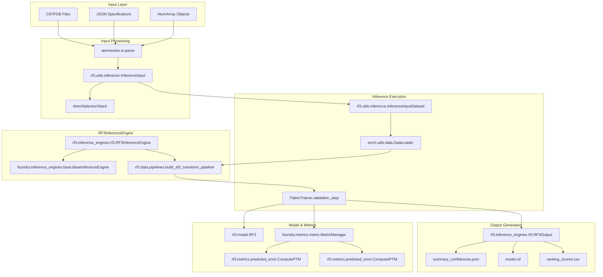
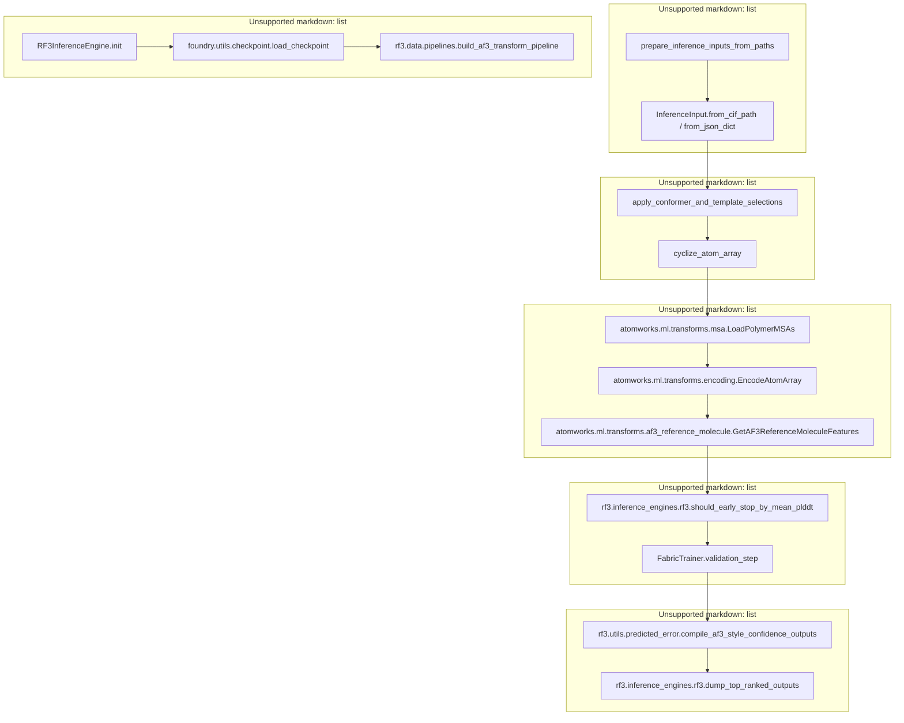

# RosettaFold3 (RF3)

> **Relevant source files**
> * [models/rf3/README.md](https://github.com/RosettaCommons/foundry/blob/cee116dc/models/rf3/README.md?plain=1)
> * [models/rf3/configs/inference_engine/base.yaml](https://github.com/RosettaCommons/foundry/blob/cee116dc/models/rf3/configs/inference_engine/base.yaml)
> * [models/rf3/configs/inference_engine/rf3.yaml](https://github.com/RosettaCommons/foundry/blob/cee116dc/models/rf3/configs/inference_engine/rf3.yaml)
> * [models/rf3/docs/examples/3en2_from_file.cif](https://github.com/RosettaCommons/foundry/blob/cee116dc/models/rf3/docs/examples/3en2_from_file.cif)
> * [models/rf3/docs/examples/3en2_from_json_with_msa.json](https://github.com/RosettaCommons/foundry/blob/cee116dc/models/rf3/docs/examples/3en2_from_json_with_msa.json)
> * [models/rf3/docs/examples/5hkn_from_file.cif](https://github.com/RosettaCommons/foundry/blob/cee116dc/models/rf3/docs/examples/5hkn_from_file.cif)
> * [models/rf3/docs/examples/7o1r_from_json.json](https://github.com/RosettaCommons/foundry/blob/cee116dc/models/rf3/docs/examples/7o1r_from_json.json)
> * [models/rf3/docs/examples/7xli_template_antigen_and_framework.json](https://github.com/RosettaCommons/foundry/blob/cee116dc/models/rf3/docs/examples/7xli_template_antigen_and_framework.json)
> * [models/rf3/docs/examples/9dfn.cif](https://github.com/RosettaCommons/foundry/blob/cee116dc/models/rf3/docs/examples/9dfn.cif)
> * [models/rf3/docs/examples/9dfn_template_ligand_and_protein.json](https://github.com/RosettaCommons/foundry/blob/cee116dc/models/rf3/docs/examples/9dfn_template_ligand_and_protein.json)
> * [models/rf3/docs/examples/ligands/HEM.sdf](https://github.com/RosettaCommons/foundry/blob/cee116dc/models/rf3/docs/examples/ligands/HEM.sdf)
> * [models/rf3/docs/examples/ligands/NAG.cif](https://github.com/RosettaCommons/foundry/blob/cee116dc/models/rf3/docs/examples/ligands/NAG.cif)
> * [models/rf3/src/rf3/data/extra_xforms.py](https://github.com/RosettaCommons/foundry/blob/cee116dc/models/rf3/src/rf3/data/extra_xforms.py)
> * [models/rf3/src/rf3/data/pipelines.py](https://github.com/RosettaCommons/foundry/blob/cee116dc/models/rf3/src/rf3/data/pipelines.py)
> * [models/rf3/src/rf3/inference.py](https://github.com/RosettaCommons/foundry/blob/cee116dc/models/rf3/src/rf3/inference.py)
> * [models/rf3/src/rf3/inference_engines/rf3.py](https://github.com/RosettaCommons/foundry/blob/cee116dc/models/rf3/src/rf3/inference_engines/rf3.py)
> * [models/rf3/src/rf3/symmetry/resolve.py](https://github.com/RosettaCommons/foundry/blob/cee116dc/models/rf3/src/rf3/symmetry/resolve.py)
> * [models/rf3/src/rf3/utils/inference.py](https://github.com/RosettaCommons/foundry/blob/cee116dc/models/rf3/src/rf3/utils/inference.py)

**Purpose**: RosettaFold3 (RF3) is an all-atom biomolecular structure prediction and validation model competitive with leading open-source models. It incorporates implicit chirality representations and atom-level geometric conditioning to improve performance on tasks like chiral ligand prediction and fixed-conformer docking [models/rf3/README.md L10-L12](https://github.com/RosettaCommons/foundry/blob/cee116dc/models/rf3/README.md?plain=1#L10-L12)

 RF3 serves as the validation step in end-to-end protein design workflows, taking sequences designed by MPNN and predicting their structures to assess designability [models/rf3/src/rf3/inference_engines/rf3.py L222-L281](https://github.com/RosettaCommons/foundry/blob/cee116dc/models/rf3/src/rf3/inference_engines/rf3.py#L222-L281)

**Scope**: This page covers RF3's inference system, input preparation, confidence metrics, and output formats.

---

## RF3 Capabilities

RF3 provides structure prediction with detailed confidence assessment:

| Capability | Description |
| --- | --- |
| **Structure Prediction** | Predicts all-atom structures from amino acid sequences [models/rf3/README.md L10-L12](https://github.com/RosettaCommons/foundry/blob/cee116dc/models/rf3/README.md?plain=1#L10-L12) |
| **Confidence Scoring** | Provides pLDDT, pTM, ipTM, PAE metrics [models/rf3/src/rf3/inference_engines/rf3.py L49-L56](https://github.com/RosettaCommons/foundry/blob/cee116dc/models/rf3/src/rf3/inference_engines/rf3.py#L49-L56) |
| **MSA Processing** | Supports `.a3m` and `.fasta` inputs for protein chains [models/rf3/README.md L93-L95](https://github.com/RosettaCommons/foundry/blob/cee116dc/models/rf3/README.md?plain=1#L93-L95) |
| **Template Support** | Optional template-guided prediction via geometric conditioning [models/rf3/src/rf3/utils/inference.py L67-L69](https://github.com/RosettaCommons/foundry/blob/cee116dc/models/rf3/src/rf3/utils/inference.py#L67-L69) |
| **Multi-Chain** | Handles protein complexes with interface metrics [models/rf3/src/rf3/inference_engines/rf3.py L80-L95](https://github.com/RosettaCommons/foundry/blob/cee116dc/models/rf3/src/rf3/inference_engines/rf3.py#L80-L95) |
| **Cyclic Chains** | Supports cyclic protein structures [models/rf3/src/rf3/inference.py L52](https://github.com/RosettaCommons/foundry/blob/cee116dc/models/rf3/src/rf3/inference.py#L52-L52) |
| **Ground Truth Conformers** | Incorporates experimental conformers during validation [models/rf3/src/rf3/utils/inference.py L68](https://github.com/RosettaCommons/foundry/blob/cee116dc/models/rf3/src/rf3/utils/inference.py#L68-L68) |
| **Symmetry Resolution** | Resolves residue and subunit symmetries for RMSD comparison [models/rf3/src/rf3/symmetry/resolve.py L23-L28](https://github.com/RosettaCommons/foundry/blob/cee116dc/models/rf3/src/rf3/symmetry/resolve.py#L23-L28) |
| **Early Stopping** | Optional pLDDT-based early termination to save compute [models/rf3/src/rf3/inference_engines/rf3.py L203-L219](https://github.com/RosettaCommons/foundry/blob/cee116dc/models/rf3/src/rf3/inference_engines/rf3.py#L203-L219) |

**Sources**: [models/rf3/README.md L10-L112](https://github.com/RosettaCommons/foundry/blob/cee116dc/models/rf3/README.md?plain=1#L10-L112)

 [models/rf3/src/rf3/inference_engines/rf3.py L49-L219](https://github.com/RosettaCommons/foundry/blob/cee116dc/models/rf3/src/rf3/inference_engines/rf3.py#L49-L219)

---

## System Architecture

### RF3 Component Diagram

**Sources**: [models/rf3/src/rf3/inference_engines/rf3.py L98-L370](https://github.com/RosettaCommons/foundry/blob/cee116dc/models/rf3/src/rf3/inference_engines/rf3.py#L98-L370)

 [models/rf3/src/rf3/utils/inference.py L60-L142](https://github.com/RosettaCommons/foundry/blob/cee116dc/models/rf3/src/rf3/utils/inference.py#L60-L142)

 [models/rf3/src/rf3/data/pipelines.py L128-L160](https://github.com/RosettaCommons/foundry/blob/cee116dc/models/rf3/src/rf3/data/pipelines.py#L128-L160)

---

## Inference Flow

### Execution Pipeline Diagram

**Sources**: [models/rf3/src/rf3/inference_engines/rf3.py L372-L735](https://github.com/RosettaCommons/foundry/blob/cee116dc/models/rf3/src/rf3/inference_engines/rf3.py#L372-L735)

 [models/rf3/src/rf3/utils/inference.py L359-L426](https://github.com/RosettaCommons/foundry/blob/cee116dc/models/rf3/src/rf3/utils/inference.py#L359-L426)

 [models/rf3/src/rf3/data/pipelines.py L128-L200](https://github.com/RosettaCommons/foundry/blob/cee116dc/models/rf3/src/rf3/data/pipelines.py#L128-L200)

---

## InferenceInput System

The `InferenceInput` class provides a unified interface for preparing inputs from various sources [models/rf3/src/rf3/utils/inference.py L60-L70](https://github.com/RosettaCommons/foundry/blob/cee116dc/models/rf3/src/rf3/utils/inference.py#L60-L70)

### Creating InferenceInput Objects

#### From CIF/PDB Files

Loads structure data and extracts metadata (like template selections) directly from CIF blocks [models/rf3/src/rf3/utils/inference.py L72-L142](https://github.com/RosettaCommons/foundry/blob/cee116dc/models/rf3/src/rf3/utils/inference.py#L72-L142)

#### From JSON Specifications

Creates inputs from component-based JSON dictionaries, common in design workflows [models/rf3/src/rf3/utils/inference.py L144-L211](https://github.com/RosettaCommons/foundry/blob/cee116dc/models/rf3/src/rf3/utils/inference.py#L144-L211)

### Selection Syntax

Both `template_selection` and `ground_truth_conformer_selection` accept lists of selection strings using the `AtomSelectionStack` syntax [models/rf3/src/rf3/utils/inference.py L67-L68](https://github.com/RosettaCommons/foundry/blob/cee116dc/models/rf3/src/rf3/utils/inference.py#L67-L68)

* **Template Selection**: Enables template-guided prediction for selected atoms [models/rf3/src/rf3/utils/inference.py L113-L115](https://github.com/RosettaCommons/foundry/blob/cee116dc/models/rf3/src/rf3/utils/inference.py#L113-L115)
* **Ground Truth Conformer Selection**: Incorporates experimental conformers for validation [models/rf3/src/rf3/utils/inference.py L118-L123](https://github.com/RosettaCommons/foundry/blob/cee116dc/models/rf3/src/rf3/utils/inference.py#L118-L123)

**Sources**: [models/rf3/src/rf3/utils/inference.py L60-L258](https://github.com/RosettaCommons/foundry/blob/cee116dc/models/rf3/src/rf3/utils/inference.py#L60-L258)

---

## RF3InferenceEngine

The `RF3InferenceEngine` manages the model lifecycle, data pipeline construction, and distributed execution [models/rf3/src/rf3/inference_engines/rf3.py L222-L240](https://github.com/RosettaCommons/foundry/blob/cee116dc/models/rf3/src/rf3/inference_engines/rf3.py#L222-L240)

### Configuration Parameters

| Parameter | Type | Default | Description |
| --- | --- | --- | --- |
| `ckpt_path` | str | "rf3" | Path to model checkpoint [models/rf3/configs/inference_engine/rf3.yaml L9](https://github.com/RosettaCommons/foundry/blob/cee116dc/models/rf3/configs/inference_engine/rf3.yaml#L9-L9) |
| `n_recycles` | int | 10 | Number of recycling iterations [models/rf3/configs/inference_engine/rf3.yaml L12](https://github.com/RosettaCommons/foundry/blob/cee116dc/models/rf3/configs/inference_engine/rf3.yaml#L12-L12) |
| `diffusion_batch_size` | int | 5 | Number of structures generated per input [models/rf3/configs/inference_engine/rf3.yaml L13](https://github.com/RosettaCommons/foundry/blob/cee116dc/models/rf3/configs/inference_engine/rf3.yaml#L13-L13) |
| `num_steps` | int | 50 | Diffusion denoising steps [models/rf3/configs/inference_engine/rf3.yaml L16](https://github.com/RosettaCommons/foundry/blob/cee116dc/models/rf3/configs/inference_engine/rf3.yaml#L16-L16) |
| `early_stopping_plddt_threshold` | float | 0.5 | Stop if mean pLDDT below threshold [models/rf3/configs/inference_engine/rf3.yaml L20](https://github.com/RosettaCommons/foundry/blob/cee116dc/models/rf3/configs/inference_engine/rf3.yaml#L20-L20) |

For details on execution flow, see [RF3 Inference](/RosettaCommons/foundry/5.2-rf3-inference).

**Sources**: [models/rf3/src/rf3/inference_engines/rf3.py L241-L370](https://github.com/RosettaCommons/foundry/blob/cee116dc/models/rf3/src/rf3/inference_engines/rf3.py#L241-L370)

 [models/rf3/configs/inference_engine/rf3.yaml L1-L33](https://github.com/RosettaCommons/foundry/blob/cee116dc/models/rf3/configs/inference_engine/rf3.yaml#L1-L33)

---

## Confidence Metrics

RF3 provides comprehensive confidence assessment through multiple metrics.

| Metric | Formula / Source | Description |
| --- | --- | --- |
| **pLDDT** | `get_mean_atomwise_plddt` | Per-atom local distance difference test [models/rf3/src/rf3/utils/predicted_error.py L39-L40](https://github.com/RosettaCommons/foundry/blob/cee116dc/models/rf3/src/rf3/utils/predicted_error.py#L39-L40) |
| **pTM** | `rf3.metrics.predicted_error.ComputePTM` | Predicted TM-score [models/rf3/src/rf3/inference_engines/rf3.py L51](https://github.com/RosettaCommons/foundry/blob/cee116dc/models/rf3/src/rf3/inference_engines/rf3.py#L51-L51) |
| **ipTM** | `rf3.metrics.predicted_error.ComputeIPTM` | Interface predicted TM-score [models/rf3/src/rf3/inference_engines/rf3.py L52](https://github.com/RosettaCommons/foundry/blob/cee116dc/models/rf3/src/rf3/inference_engines/rf3.py#L52-L52) |
| **ranking_score** | `0.8 * ipTM + 0.2 * pTM - 100 * has_clash` | Weighted score for ranking multiple samples [models/rf3/src/rf3/inference_engines/rf3.py L79-L95](https://github.com/RosettaCommons/foundry/blob/cee116dc/models/rf3/src/rf3/inference_engines/rf3.py#L79-L95) |

For details, see [Confidence Metrics](/RosettaCommons/foundry/5.4-confidence-metrics).

**Sources**: [models/rf3/src/rf3/inference_engines/rf3.py L49-L95](https://github.com/RosettaCommons/foundry/blob/cee116dc/models/rf3/src/rf3/inference_engines/rf3.py#L49-L95)

 [models/rf3/src/rf3/utils/predicted_error.py L36-L40](https://github.com/RosettaCommons/foundry/blob/cee116dc/models/rf3/src/rf3/utils/predicted_error.py#L36-L40)

---

## Output Management

RF3 organizes outputs into an AlphaFold3-compatible format, including structure files and JSON confidence summaries [models/rf3/src/rf3/inference_engines/rf3.py L98-L103](https://github.com/RosettaCommons/foundry/blob/cee116dc/models/rf3/src/rf3/inference_engines/rf3.py#L98-L103)

* **Structure**: Saved as `.cif` or `.cif.gz` [models/rf3/src/rf3/inference_engines/rf3.py L115-L137](https://github.com/RosettaCommons/foundry/blob/cee116dc/models/rf3/src/rf3/inference_engines/rf3.py#L115-L137)
* **Summary**: `summary_confidences.json` contains aggregate metrics [models/rf3/src/rf3/inference_engines/rf3.py L139-L141](https://github.com/RosettaCommons/foundry/blob/cee116dc/models/rf3/src/rf3/inference_engines/rf3.py#L139-L141)
* **Full**: `confidences.json` contains per-atom data [models/rf3/src/rf3/inference_engines/rf3.py L144-L146](https://github.com/RosettaCommons/foundry/blob/cee116dc/models/rf3/src/rf3/inference_engines/rf3.py#L144-L146)
* **Ranking**: `ranking_scores.csv` lists scores for all generated samples [models/rf3/src/rf3/inference_engines/rf3.py L149-L164](https://github.com/RosettaCommons/foundry/blob/cee116dc/models/rf3/src/rf3/inference_engines/rf3.py#L149-L164)

For details, see [Output Management](/RosettaCommons/foundry/5.5-output-management).

**Sources**: [models/rf3/src/rf3/inference_engines/rf3.py L98-L200](https://github.com/RosettaCommons/foundry/blob/cee116dc/models/rf3/src/rf3/inference_engines/rf3.py#L98-L200)

---

## Symmetry Resolution

RF3 includes symmetry resolution capabilities to ensure accurate RMSD comparison against ground truth structures that have symmetric residues or subunits [models/rf3/src/rf3/symmetry/resolve.py L1-L5](https://github.com/RosettaCommons/foundry/blob/cee116dc/models/rf3/src/rf3/symmetry/resolve.py#L1-L5)

* **Residue Level**: Resolves atom permutations in symmetric residues (e.g., PHE, TYR) [models/rf3/src/rf3/symmetry/resolve.py L15-L16](https://github.com/RosettaCommons/foundry/blob/cee116dc/models/rf3/src/rf3/symmetry/resolve.py#L15-L16)
* **Subunit Level**: Resolves chain permutations in homo-oligomers [models/rf3/src/rf3/symmetry/resolve.py L17-L18](https://github.com/RosettaCommons/foundry/blob/cee116dc/models/rf3/src/rf3/symmetry/resolve.py#L17-L18)

For details, see [Symmetry Resolution](/RosettaCommons/foundry/5.7-symmetry-resolution).

**Sources**: [models/rf3/src/rf3/symmetry/resolve.py L1-L112](https://github.com/RosettaCommons/foundry/blob/cee116dc/models/rf3/src/rf3/symmetry/resolve.py#L1-L112)

---

## Child Pages

* [RF3 Overview](/RosettaCommons/foundry/5.1-rf3-overview) — Capabilities for structure prediction and validation.
* [RF3 Inference](/RosettaCommons/foundry/5.2-rf3-inference) — Detailed documentation of the `RF3InferenceEngine`.
* [Input Preparation and Selection](/RosettaCommons/foundry/5.3-input-preparation-and-selection) — `InferenceInput` creation and selection syntax.
* [Confidence Metrics](/RosettaCommons/foundry/5.4-confidence-metrics) — pLDDT, pTM, ipTM, and ranking scores.
* [Output Management](/RosettaCommons/foundry/5.5-output-management) — `RF3Output` structure and sharding.
* [RF3 Data Pipeline](/RosettaCommons/foundry/5.6-rf3-data-pipeline) — MSA processing and dataset configuration.
* [Symmetry Resolution](/RosettaCommons/foundry/5.7-symmetry-resolution) — Resolving residue and subunit symmetries.
* [RF3 Training](/RosettaCommons/foundry/5.8-rf3-training) — Training configuration and distributed setup.