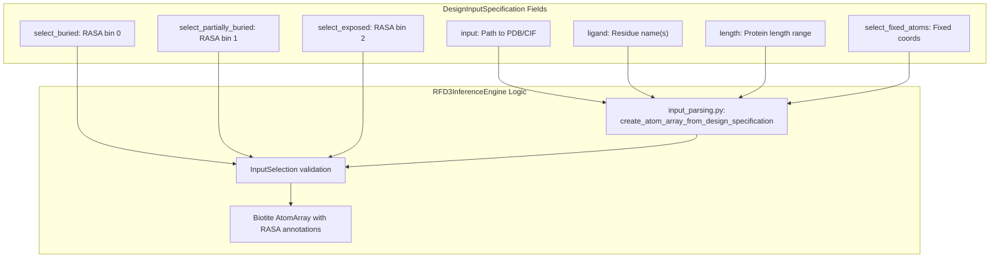
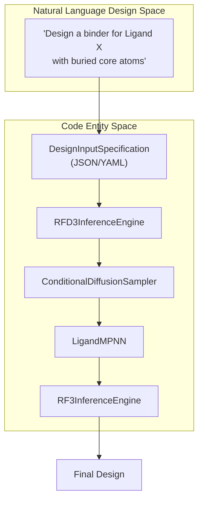
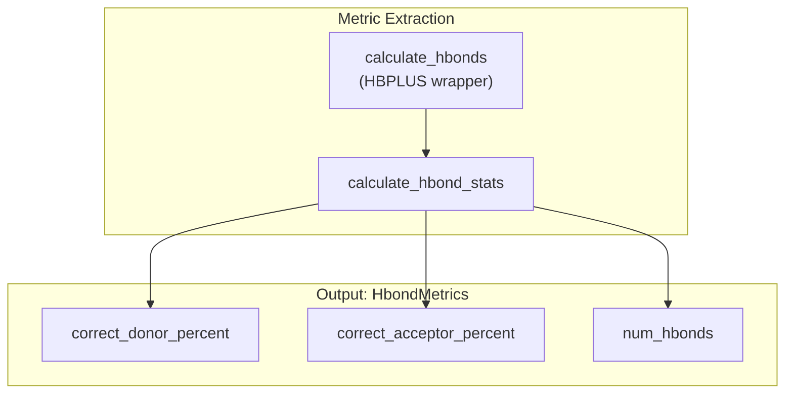

# Small Molecule Binder Design

> **Relevant source files**
> * [models/rfd3/docs/.assets/intermediate_enzyme_tutorial/1mg5_final.png](https://github.com/RosettaCommons/foundry/blob/cee116dc/models/rfd3/docs/.assets/intermediate_enzyme_tutorial/1mg5_final.png)
> * [models/rfd3/docs/.assets/intermediate_enzyme_tutorial/1mg5_redesign_final.png](https://github.com/RosettaCommons/foundry/blob/cee116dc/models/rfd3/docs/.assets/intermediate_enzyme_tutorial/1mg5_redesign_final.png)
> * [models/rfd3/docs/.assets/intermediate_enzyme_tutorial/1mg5_theozyme_final.png](https://github.com/RosettaCommons/foundry/blob/cee116dc/models/rfd3/docs/.assets/intermediate_enzyme_tutorial/1mg5_theozyme_final.png)
> * [models/rfd3/docs/tutorials/enzyme_design_tutorial.md](https://github.com/RosettaCommons/foundry/blob/cee116dc/models/rfd3/docs/tutorials/enzyme_design_tutorial.md?plain=1)
> * [models/rfd3/docs/tutorials/enzyme_tutorial_files/outputs.zip](https://github.com/RosettaCommons/foundry/blob/cee116dc/models/rfd3/docs/tutorials/enzyme_tutorial_files/outputs.zip)
> * [models/rfd3/docs/tutorials/enzyme_tutorial_files/rfd3_enzyme_tutorial.json](https://github.com/RosettaCommons/foundry/blob/cee116dc/models/rfd3/docs/tutorials/enzyme_tutorial_files/rfd3_enzyme_tutorial.json)
> * [models/rfd3/docs/tutorials/intermediate_enzyme_design_tutorial.md](https://github.com/RosettaCommons/foundry/blob/cee116dc/models/rfd3/docs/tutorials/intermediate_enzyme_design_tutorial.md?plain=1)
> * [models/rfd3/docs/tutorials/intermediate_enzyme_tutorial_files/1MG5.pdb](https://github.com/RosettaCommons/foundry/blob/cee116dc/models/rfd3/docs/tutorials/intermediate_enzyme_tutorial_files/1MG5.pdb)
> * [models/rfd3/docs/tutorials/intermediate_enzyme_tutorial_files/1mg5_motif.pdb](https://github.com/RosettaCommons/foundry/blob/cee116dc/models/rfd3/docs/tutorials/intermediate_enzyme_tutorial_files/1mg5_motif.pdb)
> * [models/rfd3/docs/tutorials/intermediate_enzyme_tutorial_files/outputs.zip](https://github.com/RosettaCommons/foundry/blob/cee116dc/models/rfd3/docs/tutorials/intermediate_enzyme_tutorial_files/outputs.zip)
> * [models/rfd3/docs/tutorials/na_binder_tutorial.md](https://github.com/RosettaCommons/foundry/blob/cee116dc/models/rfd3/docs/tutorials/na_binder_tutorial.md?plain=1)
> * [models/rfd3/docs/tutorials/ppi_design_tutorial.md](https://github.com/RosettaCommons/foundry/blob/cee116dc/models/rfd3/docs/tutorials/ppi_design_tutorial.md?plain=1)

## Purpose and Scope

This page describes how to design proteins that bind small molecules using RFdiffusion3 (RFD3). It focuses on the configuration and workflow specific to small molecule binder design, including Relative Accessible Surface Area (RASA) conditioning (buried/exposed atom specification) and ligand-aware design.

For general RFD3 capabilities and the InputSpecification system, see [RFD3 Overview and Capabilities](https://github.com/RosettaCommons/foundry/blob/cee116dc/RFD3 Overview and Capabilities)

 and [InputSpecification System](https://github.com/RosettaCommons/foundry/blob/cee116dc/InputSpecification System)

**Sources:** [models/rfd3/README.md L1-L166](https://github.com/RosettaCommons/foundry/blob/cee116dc/models/rfd3/README.md?plain=1#L1-L166)

 [models/rfd3/docs/sm_binder_design.md L1-L42](https://github.com/RosettaCommons/foundry/blob/cee116dc/models/rfd3/docs/sm_binder_design.md?plain=1#L1-L42)

## Overview

Small molecule binder design in RFD3 generates novel protein scaffolds that bind to specified small molecules (ligands). The key differentiator from other design tasks is **RASA conditioning**, which allows you to specify which parts of the ligand should be buried within the protein binding pocket versus exposed to solvent.

RFD3 treats small molecules as all-atom structures and can condition generation on:

* Fixed ligand coordinates via `select_fixed_atoms`.
* Burial state of specific ligand atoms (buried, partially buried, or exposed).
* Desired binding pocket geometry through the use of an `ori_token` or inferred origin.

The model generates protein backbones that satisfy these geometric and burial constraints while maintaining designable, stable protein structures.

**Sources:** [models/rfd3/docs/sm_binder_design.md L1-L11](https://github.com/RosettaCommons/foundry/blob/cee116dc/models/rfd3/docs/sm_binder_design.md?plain=1#L1-L11)

 [models/rfd3/docs/tutorials/enzyme_design_tutorial.md L101-L109](https://github.com/RosettaCommons/foundry/blob/cee116dc/models/rfd3/docs/tutorials/enzyme_design_tutorial.md?plain=1#L101-L109)

 [models/rfd3/docs/tutorials/enzyme_tutorial_files/rfd3_enzyme_tutorial.json L16-L21](https://github.com/RosettaCommons/foundry/blob/cee116dc/models/rfd3/docs/tutorials/enzyme_tutorial_files/rfd3_enzyme_tutorial.json#L16-L21)

## RASA Conditioning Concept

### Relative Accessible Surface Area (RASA)

RASA measures the solvent accessibility of atoms in a structure. In small molecule binder design, RASA bins categorize ligand atoms into three mutually exclusive categories:

| RASA Bin | InputSpecification Field | Meaning | Typical Use |
| --- | --- | --- | --- |
| **Bin 0** | `select_buried` | Atom is completely buried in binding pocket | Core binding interactions, hydrophobic effects |
| **Bin 1** | `select_partially_buried` | Atom is at the interface | Partial burial, interface contacts |
| **Bin 2** | `select_exposed` | Atom is exposed to solvent | Polar groups that maintain solubility |

### Mutual Exclusivity

The three RASA bins are mutually exclusive—each atom can only be assigned to one bin. The InputSpecification validation enforces this constraint; if an atom is listed in both `select_buried` and `select_exposed`, the system will raise a validation error.

**Sources:** [models/rfd3/docs/input.md L58-L59](https://github.com/RosettaCommons/foundry/blob/cee116dc/models/rfd3/docs/input.md?plain=1#L58-L59)

 [models/rfd3/docs/sm_binder_design.md L9-L11](https://github.com/RosettaCommons/foundry/blob/cee116dc/models/rfd3/docs/sm_binder_design.md?plain=1#L9-L11)

 [models/rfd3/docs/tutorials/enzyme_design_tutorial.md L103-L108](https://github.com/RosettaCommons/foundry/blob/cee116dc/models/rfd3/docs/tutorials/enzyme_design_tutorial.md?plain=1#L103-L108)

## InputSpecification Configuration

### Core Fields for Small Molecule Binding



**Diagram: Small Molecule Binder InputSpecification Processing Flow**

### Field Descriptions

| Field | Type | Required | Description |
| --- | --- | --- | --- |
| `input` | `str` | Yes | Path to PDB/CIF file containing the ligand [models/rfd3/docs/tutorials/enzyme_design_tutorial.md L50-L52](https://github.com/RosettaCommons/foundry/blob/cee116dc/models/rfd3/docs/tutorials/enzyme_design_tutorial.md?plain=1#L50-L52) |
| `ligand` | `str` | Yes | Ligand residue name. Use `l:g` or similar if the ligand is non-standard [models/rfd3/docs/tutorials/enzyme_design_tutorial.md L54-L59](https://github.com/RosettaCommons/foundry/blob/cee116dc/models/rfd3/docs/tutorials/enzyme_design_tutorial.md?plain=1#L54-L59) |
| `length` | `str` | Yes | Desired protein length range (e.g., `"100-200"`) [models/rfd3/docs/tutorials/enzyme_design_tutorial.md L68-L70](https://github.com/RosettaCommons/foundry/blob/cee116dc/models/rfd3/docs/tutorials/enzyme_design_tutorial.md?plain=1#L68-L70) |
| `select_fixed_atoms` | `dict` | Recommended | Specific ligand atoms to hold stationary [models/rfd3/docs/tutorials/enzyme_design_tutorial.md L83-L93](https://github.com/RosettaCommons/foundry/blob/cee116dc/models/rfd3/docs/tutorials/enzyme_design_tutorial.md?plain=1#L83-L93) |
| `select_buried` | `dict` | Optional | Atoms that must be buried (RASA bin 0) [models/rfd3/docs/tutorials/enzyme_design_tutorial.md L103-L105](https://github.com/RosettaCommons/foundry/blob/cee116dc/models/rfd3/docs/tutorials/enzyme_design_tutorial.md?plain=1#L103-L105) |
| `select_exposed` | `dict` | Optional | Atoms that must be exposed (RASA bin 2) [models/rfd3/docs/tutorials/enzyme_design_tutorial.md L106-L108](https://github.com/RosettaCommons/foundry/blob/cee116dc/models/rfd3/docs/tutorials/enzyme_design_tutorial.md?plain=1#L106-L108) |

**Sources:** [models/rfd3/docs/tutorials/enzyme_design_tutorial.md L50-L108](https://github.com/RosettaCommons/foundry/blob/cee116dc/models/rfd3/docs/tutorials/enzyme_design_tutorial.md?plain=1#L50-L108)

 [models/rfd3/docs/tutorials/enzyme_tutorial_files/rfd3_enzyme_tutorial.json L1-L24](https://github.com/RosettaCommons/foundry/blob/cee116dc/models/rfd3/docs/tutorials/enzyme_tutorial_files/rfd3_enzyme_tutorial.json#L1-L24)

## Configuration Example

This example demonstrates a binder design where specific ligand atoms are forced to be buried while others remain exposed.

```json
{    "cys_1euv_lig": {        "input": "./1euv_lig.pdb",         "ligand": "l:g",                "length": "100-200",        "select_fixed_atoms": {            "l:g": "ALL"        },        "select_buried": {            "l:g": "O1,C8,O3,C4,C5,C23,C24,C25,C26,C27"        },        "select_exposed": {            "l:g": "C2,C22,C19,C18,C17,C20,C16,C15,O21,O14,C13,C12"        }    }}
```

**Sources:** [models/rfd3/docs/tutorials/enzyme_tutorial_files/rfd3_enzyme_tutorial.json L1-L24](https://github.com/RosettaCommons/foundry/blob/cee116dc/models/rfd3/docs/tutorials/enzyme_tutorial_files/rfd3_enzyme_tutorial.json#L1-L24)

 [models/rfd3/docs/tutorials/enzyme_design_tutorial.md L103-L108](https://github.com/RosettaCommons/foundry/blob/cee116dc/models/rfd3/docs/tutorials/enzyme_design_tutorial.md?plain=1#L103-L108)

## Design Workflow



**Diagram: Binder Design Pipeline - From Intent to Code Entities**

### Step 1: Input Preparation

Prepare a PDB containing the ligand in its desired conformation. If the ligand is not in the Chemical Component Database (CCD), use a colon in the name (e.g., `l:g`) to prevent automated lookups [models/rfd3/docs/tutorials/enzyme_design_tutorial.md L54-L59](https://github.com/RosettaCommons/foundry/blob/cee116dc/models/rfd3/docs/tutorials/enzyme_design_tutorial.md?plain=1#L54-L59)

### Step 2: Backbone Generation (RFD3)

Run the `rfd3 design` command. RFD3 will use the `select_buried` and `select_exposed` annotations to bias the diffusion toward backbones that create a pocket around the buried atoms while leaving the exposed atoms accessible [models/rfd3/docs/tutorials/enzyme_design_tutorial.md L101-L109](https://github.com/RosettaCommons/foundry/blob/cee116dc/models/rfd3/docs/tutorials/enzyme_design_tutorial.md?plain=1#L101-L109)

### Step 3: Sequence Design (LigandMPNN)

Use `LigandMPNN` to generate sequences. LigandMPNN is ligand-aware and will design side chains that form favorable interactions with the ligand's specific chemical features [models/mpnn/README.md](https://github.com/RosettaCommons/foundry/blob/cee116dc/models/mpnn/README.md?plain=1)

### Step 4: Validation (RosettaFold3)

Use `RF3InferenceEngine` to predict the structure of the designed sequences in the presence of the ligand. Designs are considered successful if the predicted structure has high pLDDT and low RMSD to the RFD3 backbone [models/rf3/README.md](https://github.com/RosettaCommons/foundry/blob/cee116dc/models/rf3/README.md?plain=1)

**Sources:** [models/rfd3/docs/tutorials/enzyme_design_tutorial.md L1-L110](https://github.com/RosettaCommons/foundry/blob/cee116dc/models/rfd3/docs/tutorials/enzyme_design_tutorial.md?plain=1#L1-L110)

 [models/rfd3/docs/tutorials/ppi_design_tutorial.md L1-L96](https://github.com/RosettaCommons/foundry/blob/cee116dc/models/rfd3/docs/tutorials/ppi_design_tutorial.md?plain=1#L1-L96)

## Evaluation Metrics

### Hydrogen Bond Analysis

The `HbondMetrics` class and the `get_hbond_metrics` function are used to evaluate the quality of interactions between the protein and the small molecule.



**Diagram: Hydrogen Bond Metric Calculation Flow**

The system tracks:

* **`correct_donor_percent`**: Percentage of target donor atoms forming bonds [models/rfd3/src/rfd3/metrics/hbonds_hbplus_metrics.py L273-L309](https://github.com/RosettaCommons/foundry/blob/cee116dc/models/rfd3/src/rfd3/metrics/hbonds_hbplus_metrics.py#L273-L309)
* **`correct_acceptor_percent`**: Percentage of target acceptor atoms forming bonds [models/rfd3/src/rfd3/metrics/hbonds_hbplus_metrics.py L273-L309](https://github.com/RosettaCommons/foundry/blob/cee116dc/models/rfd3/src/rfd3/metrics/hbonds_hbplus_metrics.py#L273-L309)
* **`num_hbonds`**: Total count of H-bonds between the ligand and the designed scaffold [models/rfd3/src/rfd3/metrics/hbonds_hbplus_metrics.py L273-L309](https://github.com/RosettaCommons/foundry/blob/cee116dc/models/rfd3/src/rfd3/metrics/hbonds_hbplus_metrics.py#L273-L309)

**Sources:** [models/rfd3/src/rfd3/metrics/hbonds_hbplus_metrics.py L238-L309](https://github.com/RosettaCommons/foundry/blob/cee116dc/models/rfd3/src/rfd3/metrics/hbonds_hbplus_metrics.py#L238-L309)

## Practical Guidelines

### Best Practices

* **Origin (ORI) Token**: Use `ori_token` to specify the center of mass for the designed protein. For binder design, placing it near the ligand ensures the protein is built around the molecule [models/rfd3/docs/tutorials/enzyme_design_tutorial.md L71-L82](https://github.com/RosettaCommons/foundry/blob/cee116dc/models/rfd3/docs/tutorials/enzyme_design_tutorial.md?plain=1#L71-L82)
* **Length Ranges**: Use ranges for `length` (e.g., `"100-200"`) to allow the diffusion model to find the most topologically stable scaffold size for the binding site [models/rfd3/docs/tutorials/enzyme_design_tutorial.md L68-L70](https://github.com/RosettaCommons/foundry/blob/cee116dc/models/rfd3/docs/tutorials/enzyme_design_tutorial.md?plain=1#L68-L70)
* **Unindexed Motifs**: If specific catalytic residues are required but their position in the sequence is unknown, use the `unindex` field [models/rfd3/docs/tutorials/enzyme_design_tutorial.md L60-L66](https://github.com/RosettaCommons/foundry/blob/cee116dc/models/rfd3/docs/tutorials/enzyme_design_tutorial.md?plain=1#L60-L66)

### Common Pitfalls

* **Tab Characters**: YAML/JSON files must use spaces for indentation; tab characters (`\t`) will cause RFD3 to crash [models/rfd3/docs/tutorials/ppi_design_tutorial.md L44-L47](https://github.com/RosettaCommons/foundry/blob/cee116dc/models/rfd3/docs/tutorials/ppi_design_tutorial.md?plain=1#L44-L47)
* **Over-constraining**: Fixing too many atoms via `select_fixed_atoms` can prevent the model from finding a valid protein topology that fits the constraints [models/rfd3/docs/tutorials/enzyme_design_tutorial.md L64-L66](https://github.com/RosettaCommons/foundry/blob/cee116dc/models/rfd3/docs/tutorials/enzyme_design_tutorial.md?plain=1#L64-L66)

**Sources:** [models/rfd3/docs/tutorials/enzyme_design_tutorial.md L60-L82](https://github.com/RosettaCommons/foundry/blob/cee116dc/models/rfd3/docs/tutorials/enzyme_design_tutorial.md?plain=1#L60-L82)

 [models/rfd3/docs/tutorials/ppi_design_tutorial.md L44-L47](https://github.com/RosettaCommons/foundry/blob/cee116dc/models/rfd3/docs/tutorials/ppi_design_tutorial.md?plain=1#L44-L47)