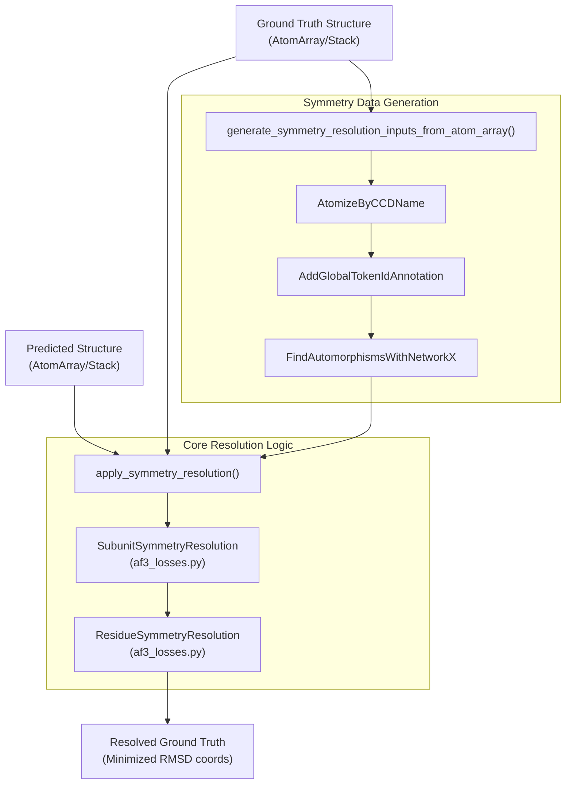

# Symmetry Resolution

> **Relevant source files**
> * [models/rf3/configs/inference_engine/base.yaml](https://github.com/RosettaCommons/foundry/blob/cee116dc/models/rf3/configs/inference_engine/base.yaml)
> * [models/rf3/configs/inference_engine/rf3.yaml](https://github.com/RosettaCommons/foundry/blob/cee116dc/models/rf3/configs/inference_engine/rf3.yaml)
> * [models/rf3/src/rf3/data/extra_xforms.py](https://github.com/RosettaCommons/foundry/blob/cee116dc/models/rf3/src/rf3/data/extra_xforms.py)
> * [models/rf3/src/rf3/data/pipelines.py](https://github.com/RosettaCommons/foundry/blob/cee116dc/models/rf3/src/rf3/data/pipelines.py)
> * [models/rf3/src/rf3/inference.py](https://github.com/RosettaCommons/foundry/blob/cee116dc/models/rf3/src/rf3/inference.py)
> * [models/rf3/src/rf3/inference_engines/rf3.py](https://github.com/RosettaCommons/foundry/blob/cee116dc/models/rf3/src/rf3/inference_engines/rf3.py)
> * [models/rf3/src/rf3/symmetry/resolve.py](https://github.com/RosettaCommons/foundry/blob/cee116dc/models/rf3/src/rf3/symmetry/resolve.py)
> * [models/rf3/src/rf3/utils/inference.py](https://github.com/RosettaCommons/foundry/blob/cee116dc/models/rf3/src/rf3/utils/inference.py)

## Purpose and Scope

This document explains how RosettaFold3 resolves residue-level and subunit-level symmetries when comparing predicted structures to ground truth coordinates. Symmetry resolution is necessary because molecules often contain symmetric substructures where multiple atom arrangements are chemically equivalent. Without resolution, RMSD-based metrics and coordinate losses would be incorrectly penalized when the model predicts a valid symmetric arrangement that differs from the ground truth.

For information about RF3's confidence metrics that use these resolved coordinates, see [Confidence Metrics](/RosettaCommons/foundry/5.4-confidence-metrics). For details about RF3 training where symmetry resolution is applied, see [RF3 Training](/RosettaCommons/foundry/5.8-rf3-training).

Sources: [models/rf3/src/rf3/symmetry/resolve.py L1-L20](https://github.com/RosettaCommons/foundry/blob/cee116dc/models/rf3/src/rf3/symmetry/resolve.py#L1-L20)

## Overview

Symmetry resolution addresses two types of structural symmetries:

1. **Residue-level symmetries**: Symmetric atoms within individual residues (e.g., the two oxygen atoms in carboxylate groups of Aspartate, or the symmetric ring carbons in Phenylalanine).
2. **Subunit-level symmetries**: Symmetric chains or subunits in multimeric complexes (e.g., homodimers where chain A and B are identical and interchangeable).

The `resolve_symmetries()` function in `rf3.symmetry.resolve` updates ground truth coordinates to minimize RMSD with predicted structures by permuting symmetric atoms and subunits. This ensures that validation metrics reflect true structural accuracy rather than arbitrary symmetry choices.

Sources: [models/rf3/src/rf3/symmetry/resolve.py L23-L42](https://github.com/RosettaCommons/foundry/blob/cee116dc/models/rf3/src/rf3/symmetry/resolve.py#L23-L42)

## Symmetry Resolution Architecture

The resolution process bridges raw structural data to permutation-aware coordinate comparison.

**Symmetry Resolution Flow**



Sources: [models/rf3/src/rf3/symmetry/resolve.py L23-L112](https://github.com/RosettaCommons/foundry/blob/cee116dc/models/rf3/src/rf3/symmetry/resolve.py#L23-L112)

 [models/rf3/src/rf3/symmetry/resolve.py L247-L284](https://github.com/RosettaCommons/foundry/blob/cee116dc/models/rf3/src/rf3/symmetry/resolve.py#L247-L284)

## Core Function: resolve_symmetries()

The main entry point for symmetry resolution accepts predicted and ground truth structures and returns an updated `AtomArrayStack`.

### Function Signature

```python
def resolve_symmetries(    predicted_atom_array: AtomArray | AtomArrayStack,    ground_truth_atom_array: AtomArray | AtomArrayStack,    resolve_residue_symmetries: bool = True,    resolve_subunit_symmetries: bool = True,) -> AtomArrayStack:
```

### Preprocessing and Masking

Before resolution, the function aligns coordinate masks and handles missing data:

1. **NaN Synchronization**: Ground truth coordinates are set to `NaN` where the predicted coordinates are `NaN` [models/rf3/src/rf3/symmetry/resolve.py L47](https://github.com/RosettaCommons/foundry/blob/cee116dc/models/rf3/src/rf3/symmetry/resolve.py#L47-L47)
2. **NaN-to-Num**: Predicted coordinates are converted from `NaN` to `0` to prevent resolution failure [models/rf3/src/rf3/symmetry/resolve.py L51](https://github.com/RosettaCommons/foundry/blob/cee116dc/models/rf3/src/rf3/symmetry/resolve.py#L51-L51)
3. **Occupancy Masking**: If an `occupancy` annotation exists, it is used to create a `crd_mask` (where `occupancy > 0.0`). Otherwise, it falls back to coordinate validity [models/rf3/src/rf3/symmetry/resolve.py L80-L87](https://github.com/RosettaCommons/foundry/blob/cee116dc/models/rf3/src/rf3/symmetry/resolve.py#L80-L87)

Sources: [models/rf3/src/rf3/symmetry/resolve.py L43-L92](https://github.com/RosettaCommons/foundry/blob/cee116dc/models/rf3/src/rf3/symmetry/resolve.py#L43-L92)

## Residue-Level Symmetries

Residue-level symmetries arise from chemically equivalent atoms within a single residue.

### Automorphism Detection

The function `generate_symmetry_resolution_inputs_from_atom_array` uses a transform pipeline to detect internal symmetries:

1. **`AtomizeByCCDName`**: Breaks residues into constituent atoms based on the Chemical Component Dictionary (CCD) [models/rf3/src/rf3/symmetry/resolve.py L142](https://github.com/RosettaCommons/foundry/blob/cee116dc/models/rf3/src/rf3/symmetry/resolve.py#L142-L142)
2. **`FindAutomorphismsWithNetworkX`**: Builds a molecular graph and identifies symmetric atom groups using graph isomorphism algorithms [models/rf3/src/rf3/symmetry/resolve.py L147](https://github.com/RosettaCommons/foundry/blob/cee116dc/models/rf3/src/rf3/symmetry/resolve.py#L147-L147)

### Resolution Logic

The resolution uses the `ResidueSymmetryResolution` class. It iterates through identified automorphism groups and selects the permutation that minimizes the RMSD between the predicted atoms (`X_pred`) and ground truth atoms (`X_gt`) [models/rf3/src/rf3/symmetry/resolve.py L272-L281](https://github.com/RosettaCommons/foundry/blob/cee116dc/models/rf3/src/rf3/symmetry/resolve.py#L272-L281)

Sources: [models/rf3/src/rf3/symmetry/resolve.py L115-L152](https://github.com/RosettaCommons/foundry/blob/cee116dc/models/rf3/src/rf3/symmetry/resolve.py#L115-L152)

 [models/rf3/src/rf3/symmetry/resolve.py L272-L281](https://github.com/RosettaCommons/foundry/blob/cee116dc/models/rf3/src/rf3/symmetry/resolve.py#L272-L281)

## Subunit-Level Symmetries

Subunit-level symmetries occur when entire chains or molecular entities are interchangeable.

### Entity and Instance Identification

Resolution relies on specific annotations in the `AtomArray`:

* **`molecule_entity`**: Identifies the chemical type of the molecule [models/rf3/src/rf3/symmetry/resolve.py L164](https://github.com/RosettaCommons/foundry/blob/cee116dc/models/rf3/src/rf3/symmetry/resolve.py#L164-L164)
* **`molecule_iid`**: Instance ID distinguishing copies of the same entity (e.g., in a homodimer, both chains share an entity ID but have unique instance IDs) [models/rf3/src/rf3/symmetry/resolve.py L165](https://github.com/RosettaCommons/foundry/blob/cee116dc/models/rf3/src/rf3/symmetry/resolve.py#L165-L165)

### Resolution Process

The `SubunitSymmetryResolution` logic permutes equivalent subunits:

1. It identifies subunits belonging to the same `molecule_entity`.
2. It tests permutations of these subunits.
3. The permutation that yields the lowest global RMSD is applied to the ground truth coordinates [models/rf3/src/rf3/symmetry/resolve.py L252-L271](https://github.com/RosettaCommons/foundry/blob/cee116dc/models/rf3/src/rf3/symmetry/resolve.py#L252-L271)

Sources: [models/rf3/src/rf3/symmetry/resolve.py L157-L165](https://github.com/RosettaCommons/foundry/blob/cee116dc/models/rf3/src/rf3/symmetry/resolve.py#L157-L165)

 [models/rf3/src/rf3/symmetry/resolve.py L252-L271](https://github.com/RosettaCommons/foundry/blob/cee116dc/models/rf3/src/rf3/symmetry/resolve.py#L252-L271)

## Implementation Details

### Data Extraction Pipeline

The `generate_symmetry_resolution_inputs_from_atom_array` function prepares the tensors required for the resolution classes.

**Code Entity Space Mapping**

| Data Requirement | Code Entity / Source | Tensor Shape |
| --- | --- | --- |
| Permutations | `FindAutomorphismsWithNetworkX` | `List[np.ndarray]` |
| Entity IDs | `atom_array.molecule_entity` | `[N_atoms]` |
| Instance IDs | `atom_array.molecule_iid` | `[N_atoms]` |
| Coordinates | `atom_array.coord` | `[N_atoms, 3]` |
| Token Mapping | `atom_array.token_id` | `[N_atoms]` |

Sources: [models/rf3/src/rf3/symmetry/resolve.py L115-L211](https://github.com/RosettaCommons/foundry/blob/cee116dc/models/rf3/src/rf3/symmetry/resolve.py#L115-L211)

### Coordinate Updating

After the optimal permutations are found for both subunits and residues, the function `apply_symmetry_resolution` returns the reordered ground truth coordinates. These are then copied back into a new `AtomArrayStack` [models/rf3/src/rf3/symmetry/resolve.py L109-L110](https://github.com/RosettaCommons/foundry/blob/cee116dc/models/rf3/src/rf3/symmetry/resolve.py#L109-L110)

Sources: [models/rf3/src/rf3/symmetry/resolve.py L94-L112](https://github.com/RosettaCommons/foundry/blob/cee116dc/models/rf3/src/rf3/symmetry/resolve.py#L94-L112)

## Integration in Inference

While symmetry resolution is critical for training losses, it is also utilized in the inference engine to provide accurate ground truth comparisons (e.g., when calculating RMSD for a predicted structure against a known crystal structure).

In `RF3InferenceEngine`, symmetry resolution can be configured via `ground_truth_conformer_selection` parameters [models/rf3/src/rf3/inference.py L49-L51](https://github.com/RosettaCommons/foundry/blob/cee116dc/models/rf3/src/rf3/inference.py#L49-L51)

Sources: [models/rf3/src/rf3/inference.py L49-L51](https://github.com/RosettaCommons/foundry/blob/cee116dc/models/rf3/src/rf3/inference.py#L49-L51)

 [models/rf3/src/rf3/utils/inference.py L61-L70](https://github.com/RosettaCommons/foundry/blob/cee116dc/models/rf3/src/rf3/utils/inference.py#L61-L70)

## Key Code Entities

| Entity | Location | Purpose |
| --- | --- | --- |
| `resolve_symmetries` | [models/rf3/src/rf3/symmetry/resolve.py L23-L112](https://github.com/RosettaCommons/foundry/blob/cee116dc/models/rf3/src/rf3/symmetry/resolve.py#L23-L112) | High-level API for coordinate resolution. |
| `generate_symmetry_resolution_inputs_from_atom_array` | [models/rf3/src/rf3/symmetry/resolve.py L115-L211](https://github.com/RosettaCommons/foundry/blob/cee116dc/models/rf3/src/rf3/symmetry/resolve.py#L115-L211) | Prepares tensors and detects automorphisms. |
| `apply_symmetry_resolution` | [models/rf3/src/rf3/symmetry/resolve.py L214-L244](https://github.com/RosettaCommons/foundry/blob/cee116dc/models/rf3/src/rf3/symmetry/resolve.py#L214-L244) | Orchestrates subunit and residue resolution calls. |
| `SubunitSymmetryResolution` | [models/rf3/src/rf3/symmetry/resolve.py L252-L271](https://github.com/RosettaCommons/foundry/blob/cee116dc/models/rf3/src/rf3/symmetry/resolve.py#L252-L271) | Permutes interchangeable chains to minimize RMSD. |
| `ResidueSymmetryResolution` | [models/rf3/src/rf3/symmetry/resolve.py L272-L281](https://github.com/RosettaCommons/foundry/blob/cee116dc/models/rf3/src/rf3/symmetry/resolve.py#L272-L281) | Permutes symmetric atoms within residues. |

Sources: [models/rf3/src/rf3/symmetry/resolve.py L1-L284](https://github.com/RosettaCommons/foundry/blob/cee116dc/models/rf3/src/rf3/symmetry/resolve.py#L1-L284)