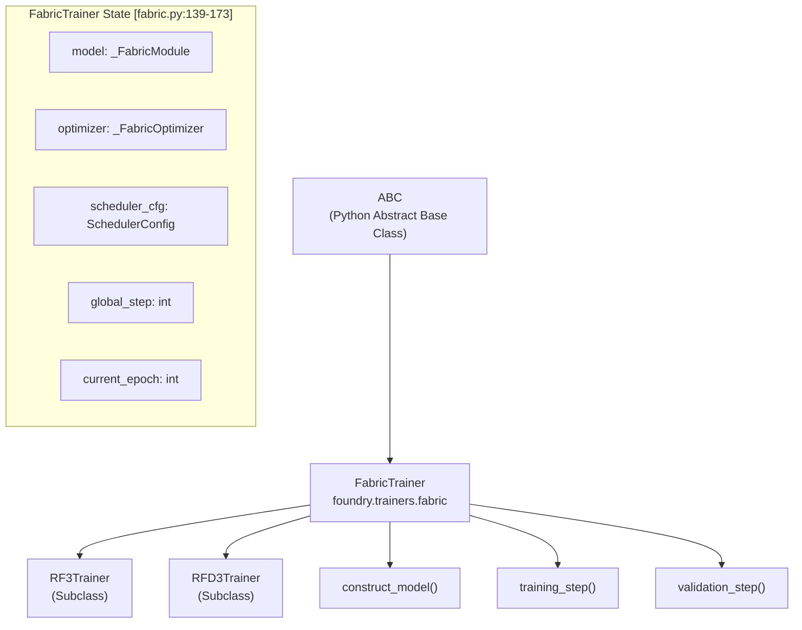
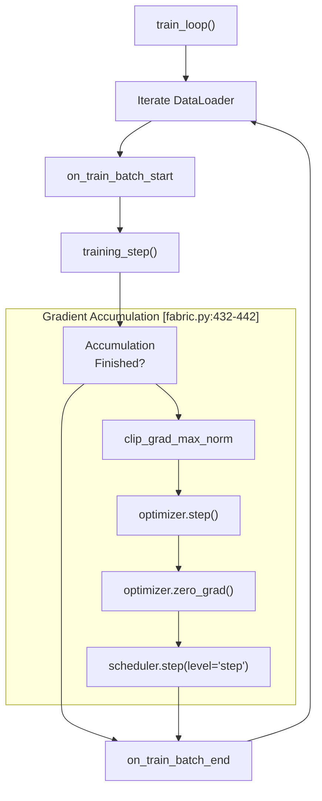

# Training Infrastructure

> **Relevant source files**
> * [models/mpnn/src/mpnn/inference_engines/mpnn.py](https://github.com/RosettaCommons/foundry/blob/cee116dc/models/mpnn/src/mpnn/inference_engines/mpnn.py)
> * [models/mpnn/src/mpnn/model/mpnn.py](https://github.com/RosettaCommons/foundry/blob/cee116dc/models/mpnn/src/mpnn/model/mpnn.py)
> * [models/rf3/configs/trainer/xpu.yaml](https://github.com/RosettaCommons/foundry/blob/cee116dc/models/rf3/configs/trainer/xpu.yaml)
> * [models/rfd3/configs/trainer/xpu.yaml](https://github.com/RosettaCommons/foundry/blob/cee116dc/models/rfd3/configs/trainer/xpu.yaml)
> * [src/foundry/__init__.py](https://github.com/RosettaCommons/foundry/blob/cee116dc/src/foundry/__init__.py)
> * [src/foundry/metrics/metric.py](https://github.com/RosettaCommons/foundry/blob/cee116dc/src/foundry/metrics/metric.py)
> * [src/foundry/testing/__init__.py](https://github.com/RosettaCommons/foundry/blob/cee116dc/src/foundry/testing/__init__.py)
> * [src/foundry/testing/pytest_hooks.py](https://github.com/RosettaCommons/foundry/blob/cee116dc/src/foundry/testing/pytest_hooks.py)
> * [src/foundry/trainers/fabric.py](https://github.com/RosettaCommons/foundry/blob/cee116dc/src/foundry/trainers/fabric.py)
> * [src/foundry/utils/ddp.py](https://github.com/RosettaCommons/foundry/blob/cee116dc/src/foundry/utils/ddp.py)
> * [src/foundry/utils/logging.py](https://github.com/RosettaCommons/foundry/blob/cee116dc/src/foundry/utils/logging.py)
> * [src/foundry/utils/squashfs.py](https://github.com/RosettaCommons/foundry/blob/cee116dc/src/foundry/utils/squashfs.py)
> * [src/foundry/utils/xpu/__init__.py](https://github.com/RosettaCommons/foundry/blob/cee116dc/src/foundry/utils/xpu/__init__.py)
> * [src/foundry/utils/xpu/single_xpu_strategy.py](https://github.com/RosettaCommons/foundry/blob/cee116dc/src/foundry/utils/xpu/single_xpu_strategy.py)
> * [src/foundry/utils/xpu/xpu_accelerator.py](https://github.com/RosettaCommons/foundry/blob/cee116dc/src/foundry/utils/xpu/xpu_accelerator.py)
> * [src/foundry/utils/xpu/xpu_precision.py](https://github.com/RosettaCommons/foundry/blob/cee116dc/src/foundry/utils/xpu/xpu_precision.py)

This document describes the training infrastructure built around PyTorch Lightning Fabric, including the `FabricTrainer` base class, distributed training support (DDP), logging systems, and gradient accumulation mechanisms.

## Overview

The Foundry training infrastructure provides a unified framework for training deep learning models across single or multiple GPUs, XPUs, and nodes. The core abstraction is the `FabricTrainer` class, which wraps PyTorch Lightning Fabric to handle:

* **Distributed Training**: Multi-GPU (DDP) and multi-node execution with automatic device detection [src/foundry/utils/ddp.py L22-L55](https://github.com/RosettaCommons/foundry/blob/cee116dc/src/foundry/utils/ddp.py#L22-L55)
* **Mixed Precision**: Automatic mixed precision (AMP) including custom support for Intel XPU devices [src/foundry/utils/xpu/xpu_precision.py L11-L41](https://github.com/RosettaCommons/foundry/blob/cee116dc/src/foundry/utils/xpu/xpu_precision.py#L11-L41)
* **Gradient Accumulation**: Efficient training with limited GPU memory by stepping the optimizer every $N$ batches [src/foundry/trainers/fabric.py L69-L70](https://github.com/RosettaCommons/foundry/blob/cee116dc/src/foundry/trainers/fabric.py#L69-L70)
* **Checkpointing**: Automatic checkpoint saving and loading with state management for resumable training [src/foundry/trainers/fabric.py L714-L895](https://github.com/RosettaCommons/foundry/blob/cee116dc/src/foundry/trainers/fabric.py#L714-L895)
* **Logging**: Integration with W&B, TensorBoard, and a custom `RankedLogger` for clean multi-GPU output [src/foundry/utils/ddp.py L58-L79](https://github.com/RosettaCommons/foundry/blob/cee116dc/src/foundry/utils/ddp.py#L58-L79)

**Sources**: [src/foundry/trainers/fabric.py L1-L128](https://github.com/RosettaCommons/foundry/blob/cee116dc/src/foundry/trainers/fabric.py#L1-L128)

 [src/foundry/utils/ddp.py L1-L55](https://github.com/RosettaCommons/foundry/blob/cee116dc/src/foundry/utils/ddp.py#L1-L55)

## FabricTrainer Architecture

### Class Hierarchy and State

The `FabricTrainer` is an abstract base class (ABC) that provides the boilerplate for training loops while requiring model-specific logic to be implemented in subclasses.



**Sources**: [src/foundry/trainers/fabric.py L57-L128](https://github.com/RosettaCommons/foundry/blob/cee116dc/src/foundry/trainers/fabric.py#L57-L128)

 [src/foundry/trainers/fabric.py L222-L237](https://github.com/RosettaCommons/foundry/blob/cee116dc/src/foundry/trainers/fabric.py#L222-L237)

### Hardware Acceleration and DDP

The infrastructure automatically detects hardware and configures the appropriate Lightning Fabric accelerator and strategy.

| Component | Code Entity | Description |
| --- | --- | --- |
| **Accelerator** | `XPUAccelerator` | Custom accelerator for Intel GPUs [src/foundry/utils/xpu/xpu_accelerator.py L9-L15](https://github.com/RosettaCommons/foundry/blob/cee116dc/src/foundry/utils/xpu/xpu_accelerator.py#L9-L15) |
| **Strategy** | `SingleXPUStrategy` | Strategy for single-device Intel XPU training [src/foundry/utils/xpu/single_xpu_strategy.py L13-L20](https://github.com/RosettaCommons/foundry/blob/cee116dc/src/foundry/utils/xpu/single_xpu_strategy.py#L13-L20) |
| **DDP Strategy** | `DDPStrategy` | Default strategy for multi-GPU training [src/foundry/trainers/fabric.py L62](https://github.com/RosettaCommons/foundry/blob/cee116dc/src/foundry/trainers/fabric.py#L62-L62) |
| **Precision** | `XPUMixedPrecision` | Custom plugin for XPU `bf16-mixed` or `16-mixed` [src/foundry/utils/xpu/xpu_precision.py L11-L20](https://github.com/RosettaCommons/foundry/blob/cee116dc/src/foundry/utils/xpu/xpu_precision.py#L11-L20) |

**Sources**: [src/foundry/utils/ddp.py L22-L55](https://github.com/RosettaCommons/foundry/blob/cee116dc/src/foundry/utils/ddp.py#L22-L55)

 [src/foundry/utils/xpu/xpu_accelerator.py L9-L91](https://github.com/RosettaCommons/foundry/blob/cee116dc/src/foundry/utils/xpu/xpu_accelerator.py#L9-L91)

## Training and Validation Flow

### Distributed Training Loop

The `train_loop` manages the iteration over the `DataLoader` and handles gradient accumulation.



**Sources**: [src/foundry/trainers/fabric.py L397-L502](https://github.com/RosettaCommons/foundry/blob/cee116dc/src/foundry/trainers/fabric.py#L397-L502)

### Metric Management

Foundry uses a `MetricManager` to compute and aggregate metrics during validation.

* **MetricManager**: Orchestrates multiple `Metric` instances [src/foundry/metrics/metric.py L39-L60](https://github.com/RosettaCommons/foundry/blob/cee116dc/src/foundry/metrics/metric.py#L39-L60)
* **Tag-based Execution**: Metrics can be conditionally executed based on tags in `extra_info` (e.g., `required_tags_all`) [src/foundry/metrics/metric.py L143-L157](https://github.com/RosettaCommons/foundry/blob/cee116dc/src/foundry/metrics/metric.py#L143-L157)
* **Hydra Integration**: Managers are typically instantiated via `instantiate_metric_manager` from config [src/foundry/metrics/metric.py L17-L32](https://github.com/RosettaCommons/foundry/blob/cee116dc/src/foundry/metrics/metric.py#L17-L32)

**Sources**: [src/foundry/metrics/metric.py L39-L176](https://github.com/RosettaCommons/foundry/blob/cee116dc/src/foundry/metrics/metric.py#L39-L176)

## Logging and Debugging

### Ranked Logging

To avoid cluttered logs in distributed environments, Foundry provides `RankedLogger`. It prefixes messages with the process rank and can restrict output to rank zero only.

```javascript
# Example usage in MPNN Inferencefrom foundry.utils.ddp import RankedLoggerranked_logger = RankedLogger(__name__, rank_zero_only=True)ranked_logger.info("Loading MPNN weights.") # Only logs on rank 0
```

**Sources**: [src/foundry/utils/ddp.py L58-L112](https://github.com/RosettaCommons/foundry/blob/cee116dc/src/foundry/utils/ddp.py#L58-L112)

 [models/mpnn/src/mpnn/inference_engines/mpnn.py L34-L170](https://github.com/RosettaCommons/foundry/blob/cee116dc/models/mpnn/src/mpnn/inference_engines/mpnn.py#L34-L170)

### Configuration Tree

The `print_config_tree` function uses the `rich` library to output the Hydra configuration in a readable YAML-like structure at the start of training, but only on the master process.

**Sources**: [src/foundry/utils/logging.py L127-L159](https://github.com/RosettaCommons/foundry/blob/cee116dc/src/foundry/utils/logging.py#L127-L159)

## Gradient Accumulation and Optimization

Gradient accumulation is controlled by the `grad_accum_steps` parameter in the `FabricTrainer`.

1. **Context Management**: Fabric handles the `no_sync()` context automatically when `grad_accum_steps > 1`.
2. **Optimizer Step**: `step_optimizer()` is called only when the accumulation buffer is full [src/foundry/trainers/fabric.py L646-L685](https://github.com/RosettaCommons/foundry/blob/cee116dc/src/foundry/trainers/fabric.py#L646-L685)
3. **EMA Updates**: If the model supports Exponential Moving Average (EMA), `model.update()` is called immediately after the optimizer step [src/foundry/trainers/fabric.py L682-L684](https://github.com/RosettaCommons/foundry/blob/cee116dc/src/foundry/trainers/fabric.py#L682-L684)

**Sources**: [src/foundry/trainers/fabric.py L101](https://github.com/RosettaCommons/foundry/blob/cee116dc/src/foundry/trainers/fabric.py#L101-L101)

 [src/foundry/trainers/fabric.py L646-L685](https://github.com/RosettaCommons/foundry/blob/cee116dc/src/foundry/trainers/fabric.py#L646-L685)