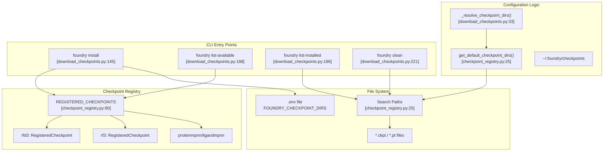
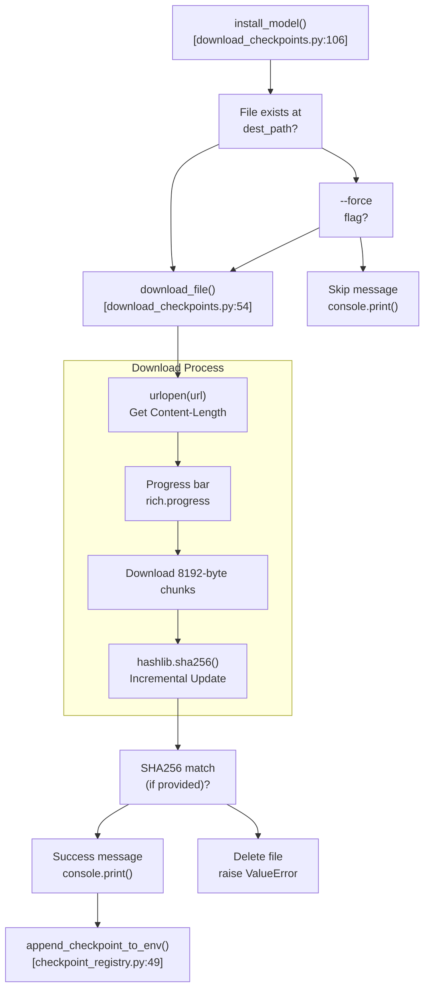

# foundry CLI

> **Relevant source files**
> * [.env](https://github.com/RosettaCommons/foundry/blob/cee116dc/.env)
> * [README.md](https://github.com/RosettaCommons/foundry/blob/cee116dc/README.md?plain=1)
> * [models/rfd3/README.md](https://github.com/RosettaCommons/foundry/blob/cee116dc/models/rfd3/README.md?plain=1)
> * [src/foundry/inference_engines/base.py](https://github.com/RosettaCommons/foundry/blob/cee116dc/src/foundry/inference_engines/base.py)
> * [src/foundry/inference_engines/checkpoint_registry.py](https://github.com/RosettaCommons/foundry/blob/cee116dc/src/foundry/inference_engines/checkpoint_registry.py)
> * [src/foundry_cli/__init__.py](https://github.com/RosettaCommons/foundry/blob/cee116dc/src/foundry_cli/__init__.py)
> * [src/foundry_cli/download_checkpoints.py](https://github.com/RosettaCommons/foundry/blob/cee116dc/src/foundry_cli/download_checkpoints.py)

The `foundry` CLI provides checkpoint management utilities for downloading, verifying, and managing model weights for RFD3, RF3, ProteinMPNN, and LigandMPNN models. This page documents the command-line interface for checkpoint installation and maintenance.

For information about using models after checkpoint installation, see model-specific CLI pages: [rfd3 CLI](https://github.com/RosettaCommons/foundry/blob/cee116dc/rfd3 CLI)

 [rf3 CLI](https://github.com/RosettaCommons/foundry/blob/cee116dc/rf3 CLI)

 and [mpnn CLI](https://github.com/RosettaCommons/foundry/blob/cee116dc/mpnn CLI)

## Overview

The foundry CLI manages model checkpoints through four primary commands that handle the complete lifecycle of checkpoint management: discovering available models, downloading and verifying checkpoints, inspecting installed checkpoints, and cleaning up storage.

**Command Summary**

| Command | Purpose |
| --- | --- |
| `foundry install` | Download and verify model checkpoints |
| `foundry list-available` | Display available models in the remote registry |
| `foundry list-installed` | Show installed checkpoints and disk usage across search paths |
| `foundry clean` | Remove downloaded checkpoints from the primary directory |

All commands are implemented in `src/foundry_cli/download_checkpoints.py` [src/foundry_cli/download_checkpoints.py L1-L240](https://github.com/RosettaCommons/foundry/blob/cee116dc/src/foundry_cli/download_checkpoints.py#L1-L240)

 The CLI uses the checkpoint registry in `src/foundry/inference_engines/checkpoint_registry.py` [src/foundry/inference_engines/checkpoint_registry.py L80-L122](https://github.com/RosettaCommons/foundry/blob/cee116dc/src/foundry/inference_engines/checkpoint_registry.py#L80-L122)

 as the source of truth for available models, URLs, and filenames.

Sources: [src/foundry_cli/download_checkpoints.py L1-L240](https://github.com/RosettaCommons/foundry/blob/cee116dc/src/foundry_cli/download_checkpoints.py#L1-L240)

 [src/foundry/inference_engines/checkpoint_registry.py L1-L122](https://github.com/RosettaCommons/foundry/blob/cee116dc/src/foundry/inference_engines/checkpoint_registry.py#L1-L122)

## Architecture

### CLI and Registry System



The CLI commands interact with the `REGISTERED_CHECKPOINTS` dictionary to discover available models [src/foundry/inference_engines/checkpoint_registry.py L80-L122](https://github.com/RosettaCommons/foundry/blob/cee116dc/src/foundry/inference_engines/checkpoint_registry.py#L80-L122)

 Each `RegisteredCheckpoint` object contains the download URL, filename, and description [src/foundry/inference_engines/checkpoint_registry.py L65-L69](https://github.com/RosettaCommons/foundry/blob/cee116dc/src/foundry/inference_engines/checkpoint_registry.py#L65-L69)

 The system resolves search paths using `get_default_checkpoint_dirs()`, which combines the default `~/.foundry/checkpoints` with any paths defined in the `FOUNDRY_CHECKPOINT_DIRS` environment variable [src/foundry/inference_engines/checkpoint_registry.py L25-L41](https://github.com/RosettaCommons/foundry/blob/cee116dc/src/foundry/inference_engines/checkpoint_registry.py#L25-L41)

Sources: [src/foundry_cli/download_checkpoints.py L33-L51](https://github.com/RosettaCommons/foundry/blob/cee116dc/src/foundry_cli/download_checkpoints.py#L33-L51)

 [src/foundry/inference_engines/checkpoint_registry.py L25-L122](https://github.com/RosettaCommons/foundry/blob/cee116dc/src/foundry/inference_engines/checkpoint_registry.py#L25-L122)

### Download and Verification Flow



The `download_file()` function implements streaming download with progress tracking using `rich.progress` [src/foundry_cli/download_checkpoints.py L67-L81](https://github.com/RosettaCommons/foundry/blob/cee116dc/src/foundry_cli/download_checkpoints.py#L67-L81)

 Each 8192-byte chunk is written to disk and fed to a SHA256 hasher for verification [src/foundry_cli/download_checkpoints.py L86-L93](https://github.com/RosettaCommons/foundry/blob/cee116dc/src/foundry_cli/download_checkpoints.py#L86-L93)

 If the computed hash doesn't match the expected hash from the registry, the corrupted file is deleted [src/foundry_cli/download_checkpoints.py L96-L103](https://github.com/RosettaCommons/foundry/blob/cee116dc/src/foundry_cli/download_checkpoints.py#L96-L103)

Sources: [src/foundry_cli/download_checkpoints.py L54-L105](https://github.com/RosettaCommons/foundry/blob/cee116dc/src/foundry_cli/download_checkpoints.py#L54-L105)

 [src/foundry_cli/download_checkpoints.py L106-L143](https://github.com/RosettaCommons/foundry/blob/cee116dc/src/foundry_cli/download_checkpoints.py#L106-L143)

## Commands

### foundry install

Download and verify model checkpoints from the registry.

**Usage:**

```
foundry install <models...> [OPTIONS]
```

**Arguments:**

* `models`: One or more model names to install. * `all`: Installs every registered model [src/foundry_cli/download_checkpoints.py L173-L174](https://github.com/RosettaCommons/foundry/blob/cee116dc/src/foundry_cli/download_checkpoints.py#L173-L174) * `base-models`: Installs `rfd3`, `rfd3na`, `proteinmpnn`, `ligandmpnn`, and `rf3` [src/foundry_cli/download_checkpoints.py L175-L176](https://github.com/RosettaCommons/foundry/blob/cee116dc/src/foundry_cli/download_checkpoints.py#L175-L176) * Individual names: `rfd3`, `rf3`, `proteinmpnn`, etc. [src/foundry_cli/download_checkpoints.py L178](https://github.com/RosettaCommons/foundry/blob/cee116dc/src/foundry_cli/download_checkpoints.py#L178-L178)

**Options:**

* `--checkpoint-dir, -d PATH`: Directory to save checkpoints. Defaults to search path [src/foundry_cli/download_checkpoints.py L150-L155](https://github.com/RosettaCommons/foundry/blob/cee116dc/src/foundry_cli/download_checkpoints.py#L150-L155)
* `--force, -f`: Overwrite existing checkpoints [src/foundry_cli/download_checkpoints.py L156-L158](https://github.com/RosettaCommons/foundry/blob/cee116dc/src/foundry_cli/download_checkpoints.py#L156-L158)

**Behavior:**

1. Resolves the target directory. If a custom directory is provided, it is moved to the front of the search path and persisted to the `.env` file via `append_checkpoint_to_env()` [src/foundry_cli/download_checkpoints.py L33-L51](https://github.com/RosettaCommons/foundry/blob/cee116dc/src/foundry_cli/download_checkpoints.py#L33-L51)
2. Iterates through requested models and calls `install_model()` [src/foundry_cli/download_checkpoints.py L181-L182](https://github.com/RosettaCommons/foundry/blob/cee116dc/src/foundry_cli/download_checkpoints.py#L181-L182)
3. Downloads files using `urllib.request.urlopen` in chunks [src/foundry_cli/download_checkpoints.py L76-L93](https://github.com/RosettaCommons/foundry/blob/cee116dc/src/foundry_cli/download_checkpoints.py#L76-L93)

Sources: [src/foundry_cli/download_checkpoints.py L145-L187](https://github.com/RosettaCommons/foundry/blob/cee116dc/src/foundry_cli/download_checkpoints.py#L145-L187)

 [src/foundry/inference_engines/checkpoint_registry.py L49-L61](https://github.com/RosettaCommons/foundry/blob/cee116dc/src/foundry/inference_engines/checkpoint_registry.py#L49-L61)

### foundry list-available

Display all models registered in the Foundry registry available for download.

**Usage:**

```
foundry list-available
```

**Implementation:**
Iterates over `REGISTERED_CHECKPOINTS.items()` and prints each model name with its description [src/foundry_cli/download_checkpoints.py L192-L193](https://github.com/RosettaCommons/foundry/blob/cee116dc/src/foundry_cli/download_checkpoints.py#L192-L193)

Sources: [src/foundry_cli/download_checkpoints.py L188-L194](https://github.com/RosettaCommons/foundry/blob/cee116dc/src/foundry_cli/download_checkpoints.py#L188-L194)

 [src/foundry/inference_engines/checkpoint_registry.py L80-L122](https://github.com/RosettaCommons/foundry/blob/cee116dc/src/foundry/inference_engines/checkpoint_registry.py#L80-L122)

### foundry list-installed

Display checkpoints currently found in the search paths (`~/.foundry/checkpoints` and `$FOUNDRY_CHECKPOINT_DIRS`).

**Usage:**

```
foundry list-installed
```

**Behavior:**

1. Retrieves all active checkpoint directories [src/foundry_cli/download_checkpoints.py L199](https://github.com/RosettaCommons/foundry/blob/cee116dc/src/foundry_cli/download_checkpoints.py#L199-L199)
2. Scans for `*.ckpt` and `*.pt` files [src/foundry_cli/download_checkpoints.py L205](https://github.com/RosettaCommons/foundry/blob/cee116dc/src/foundry_cli/download_checkpoints.py#L205-L205)
3. Calculates and displays file sizes in GB [src/foundry_cli/download_checkpoints.py L207-L217](https://github.com/RosettaCommons/foundry/blob/cee116dc/src/foundry_cli/download_checkpoints.py#L207-L217)

Sources: [src/foundry_cli/download_checkpoints.py L196-L219](https://github.com/RosettaCommons/foundry/blob/cee116dc/src/foundry_cli/download_checkpoints.py#L196-L219)

### foundry clean

Remove downloaded checkpoint files from the primary directory.

**Usage:**

```
foundry clean [OPTIONS]
```

**Options:**

* `--checkpoint-dir, -d PATH`: Specific directory to clean [src/foundry_cli/download_checkpoints.py L226](https://github.com/RosettaCommons/foundry/blob/cee116dc/src/foundry_cli/download_checkpoints.py#L226-L226)
* `--confirm/--no-confirm`: Toggle the interactive confirmation prompt [src/foundry_cli/download_checkpoints.py L227](https://github.com/RosettaCommons/foundry/blob/cee116dc/src/foundry_cli/download_checkpoints.py#L227-L227)

Sources: [src/foundry_cli/download_checkpoints.py L221-L240](https://github.com/RosettaCommons/foundry/blob/cee116dc/src/foundry_cli/download_checkpoints.py#L221-L240)

## Checkpoint Registry

### Registry Structure

The `REGISTERED_CHECKPOINTS` dictionary defines the metadata for all supported models [src/foundry/inference_engines/checkpoint_registry.py L80-L122](https://github.com/RosettaCommons/foundry/blob/cee116dc/src/foundry/inference_engines/checkpoint_registry.py#L80-L122)

**RegisteredCheckpoint Dataclass:** [src/foundry/inference_engines/checkpoint_registry.py L64-L69](https://github.com/RosettaCommons/foundry/blob/cee116dc/src/foundry/inference_engines/checkpoint_registry.py#L64-L69)

```python
@dataclassclass RegisteredCheckpoint:    url: str              # Remote URL for download    filename: str         # Target filename on disk    description: str      # UI description    sha256: None = None   # Verification hash
```

**Key Registered Models:**

| Key | Filename | Description |
| --- | --- | --- |
| `rfd3` | `rfd3_latest.ckpt` | RFdiffusion3 checkpoint [src/foundry/inference_engines/checkpoint_registry.py L86-L90](https://github.com/RosettaCommons/foundry/blob/cee116dc/src/foundry/inference_engines/checkpoint_registry.py#L86-L90) |
| `rf3` | `rf3_foundry_01_24_latest_remapped.ckpt` | Latest RF3 checkpoint [src/foundry/inference_engines/checkpoint_registry.py L91-L95](https://github.com/RosettaCommons/foundry/blob/cee116dc/src/foundry/inference_engines/checkpoint_registry.py#L91-L95) |
| `proteinmpnn` | `proteinmpnn_v_48_020.pt` | ProteinMPNN checkpoint [src/foundry/inference_engines/checkpoint_registry.py L96-L100](https://github.com/RosettaCommons/foundry/blob/cee116dc/src/foundry/inference_engines/checkpoint_registry.py#L96-L100) |

### Path Resolution Logic

The system supports multiple search paths for checkpoints to facilitate shared environments and custom installs.

1. **Default Path**: `~/.foundry/checkpoints` [src/foundry/inference_engines/checkpoint_registry.py L10](https://github.com/RosettaCommons/foundry/blob/cee116dc/src/foundry/inference_engines/checkpoint_registry.py#L10-L10)
2. **Environment Variable**: `FOUNDRY_CHECKPOINT_DIRS` (colon-separated list) [src/foundry/inference_engines/checkpoint_registry.py L32-L40](https://github.com/RosettaCommons/foundry/blob/cee116dc/src/foundry/inference_engines/checkpoint_registry.py#L32-L40)
3. **Resolution**: `get_default_checkpoint_dirs()` returns a normalized, deduplicated list of these paths, prioritizing the environment variable entries [src/foundry/inference_engines/checkpoint_registry.py L25-L41](https://github.com/RosettaCommons/foundry/blob/cee116dc/src/foundry/inference_engines/checkpoint_registry.py#L25-L41)

**Inference Integration**:
Inference engines use `RegisteredCheckpoint.get_default_path()` to find weights. It iterates through all registered search paths and returns the first existing match, or the primary path if none are found [src/foundry/inference_engines/checkpoint_registry.py L71-L77](https://github.com/RosettaCommons/foundry/blob/cee116dc/src/foundry/inference_engines/checkpoint_registry.py#L71-L77)

Sources: [src/foundry/inference_engines/checkpoint_registry.py L1-L78](https://github.com/RosettaCommons/foundry/blob/cee116dc/src/foundry/inference_engines/checkpoint_registry.py#L1-L78)

 [src/foundry/inference_engines/base.py L72-L91](https://github.com/RosettaCommons/foundry/blob/cee116dc/src/foundry/inference_engines/base.py#L72-L91)

## Configuration and Persistence

### Environment Variable Management

Foundry uses `.env` files to persist configuration across sessions.

* **Loading**: `load_dotenv(override=True)` is called at the CLI entry point [src/foundry_cli/download_checkpoints.py L27](https://github.com/RosettaCommons/foundry/blob/cee116dc/src/foundry_cli/download_checkpoints.py#L27-L27)
* **Persistence**: When a user specifies a `--checkpoint-dir` during installation, the CLI calls `append_checkpoint_to_env()`. This function uses `dotenv.set_key` to write the updated search paths to the `.env` file [src/foundry/inference_engines/checkpoint_registry.py L49-L61](https://github.com/RosettaCommons/foundry/blob/cee116dc/src/foundry/inference_engines/checkpoint_registry.py#L49-L61)

### Integration with BaseInferenceEngine

The `BaseInferenceEngine` uses the CLI's registry system to allow users to specify models by shorthand names (e.g., `ckpt_path="rfd3"`) [src/foundry/inference_engines/base.py L72-L85](https://github.com/RosettaCommons/foundry/blob/cee116dc/src/foundry/inference_engines/base.py#L72-L85)

```
if "." not in str(ckpt_path):    name = str(ckpt_path)    if name in REGISTERED_CHECKPOINTS:        ckpt = REGISTERED_CHECKPOINTS[name]        ckpt_path = ckpt.get_default_path()
```

Sources: [src/foundry/inference_engines/base.py L72-L92](https://github.com/RosettaCommons/foundry/blob/cee116dc/src/foundry/inference_engines/base.py#L72-L92)

 [src/foundry/inference_engines/checkpoint_registry.py L49-L61](https://github.com/RosettaCommons/foundry/blob/cee116dc/src/foundry/inference_engines/checkpoint_registry.py#L49-L61)

 [src/foundry_cli/download_checkpoints.py L27](https://github.com/RosettaCommons/foundry/blob/cee116dc/src/foundry_cli/download_checkpoints.py#L27-L27)