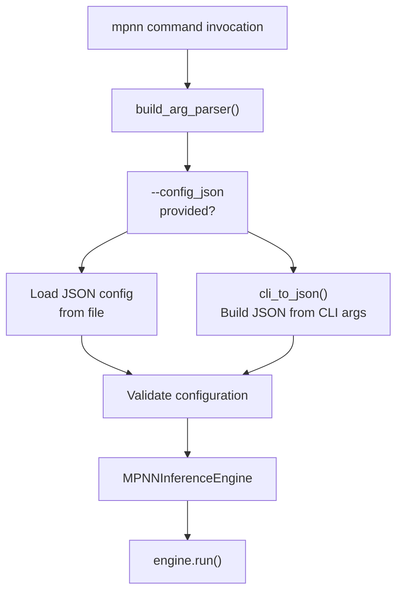
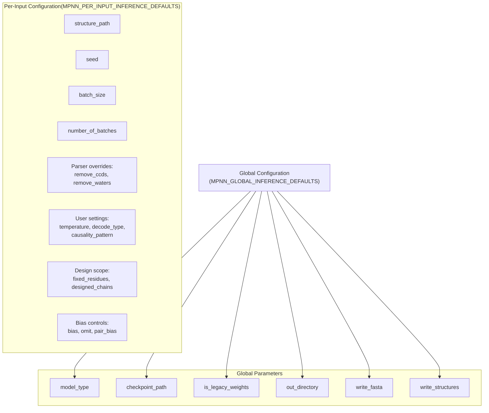
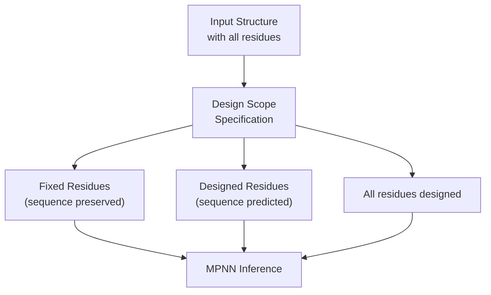
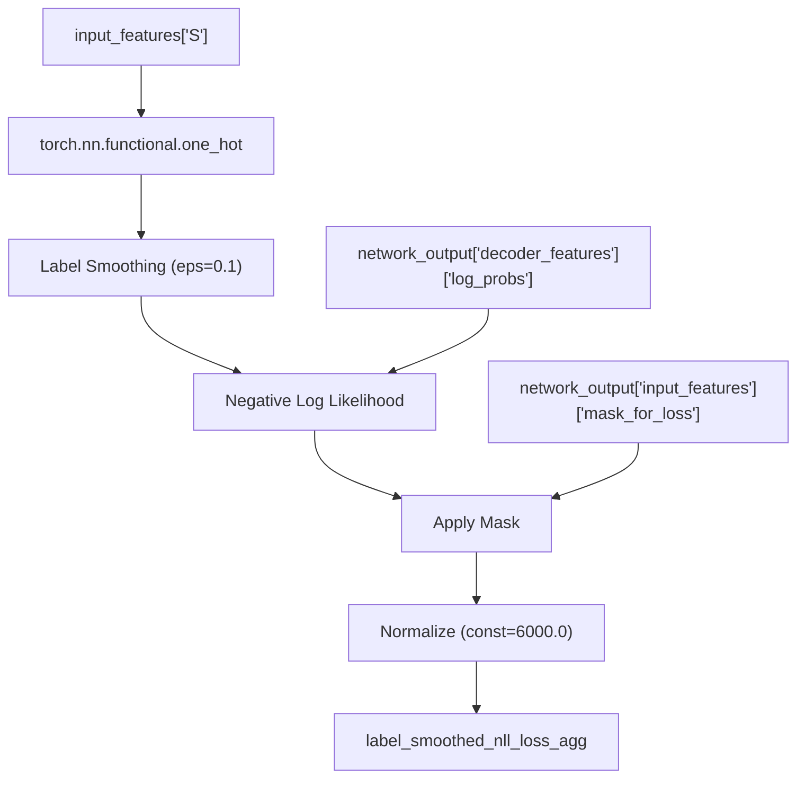

# mpnn CLI

> **Relevant source files**
> * [models/mpnn/README.md](https://github.com/RosettaCommons/foundry/blob/cee116dc/models/mpnn/README.md?plain=1)
> * [models/mpnn/src/mpnn/__init__.py](https://github.com/RosettaCommons/foundry/blob/cee116dc/models/mpnn/src/mpnn/__init__.py)
> * [models/mpnn/src/mpnn/loss/nll_loss.py](https://github.com/RosettaCommons/foundry/blob/cee116dc/models/mpnn/src/mpnn/loss/nll_loss.py)
> * [models/mpnn/src/mpnn/utils/inference.py](https://github.com/RosettaCommons/foundry/blob/cee116dc/models/mpnn/src/mpnn/utils/inference.py)
> * [models/rf3/configs/experiment/pretrained/rf3.yaml](https://github.com/RosettaCommons/foundry/blob/cee116dc/models/rf3/configs/experiment/pretrained/rf3.yaml)
> * [models/rf3/src/rf3/callbacks/dump_validation_structures.py](https://github.com/RosettaCommons/foundry/blob/cee116dc/models/rf3/src/rf3/callbacks/dump_validation_structures.py)
> * [models/rf3/src/rf3/cli.py](https://github.com/RosettaCommons/foundry/blob/cee116dc/models/rf3/src/rf3/cli.py)
> * [models/rf3/src/rf3/utils/io.py](https://github.com/RosettaCommons/foundry/blob/cee116dc/models/rf3/src/rf3/utils/io.py)
> * [models/rfd3/src/rfd3/cli.py](https://github.com/RosettaCommons/foundry/blob/cee116dc/models/rfd3/src/rfd3/cli.py)
> * [pyproject.toml](https://github.com/RosettaCommons/foundry/blob/cee116dc/pyproject.toml)

The `mpnn` CLI provides a command-line interface for running ProteinMPNN and LigandMPNN sequence design models. It enables inverse folding: given a protein backbone structure, the models design amino acid sequences that are likely to fold into that structure.

For information about the Python API and inference engine implementation, see [MPNN Inference](/RosettaCommons/foundry/6.3-mpnn-inference). For an overview of ProteinMPNN and LigandMPNN capabilities, see [MPNN Overview](/RosettaCommons/foundry/6.1-mpnn-overview).

## Purpose and Scope

The `mpnn` CLI handles:

* Command-line invocation of ProteinMPNN/LigandMPNN models.
* Argument parsing and validation.
* JSON-based configuration for complex workflows.
* Structure input from CIF/PDB files.
* Design scope specification (which residues to design vs. fix).
* Sequence design controls (temperature, bias, omission, pair bias).
* Output generation (FASTA sequences, designed structures).

## Command Entry Point

The `mpnn` command is registered in [pyproject.toml L93](https://github.com/RosettaCommons/foundry/blob/cee116dc/pyproject.toml#L93-L93)

 and maps to the `main` function in the `mpnn.inference` module:

```
mpnn = "mpnn.inference:main"
```

### Basic Usage

```markdown
# Design sequences for a structure using ProteinMPNNmpnn --model_type protein_mpnn \     --checkpoint_path proteinmpnn \     --is_legacy_weights True \     --structure_path input.cif \     --out_directory ./outputs \     --batch_size 8 # Use LigandMPNN for ligand-aware designmpnn --model_type ligand_mpnn \     --checkpoint_path ligandmpnn \     --is_legacy_weights True \     --structure_path protein_ligand_complex.cif \     --out_directory ./outputs \     --batch_size 8 \     --atomize_side_chains True # Use JSON configuration for complex workflowsmpnn --config_json my_design_config.json
```

**Sources:** [pyproject.toml L93](https://github.com/RosettaCommons/foundry/blob/cee116dc/pyproject.toml#L93-L93)

 [models/mpnn/src/mpnn/utils/inference.py L120-L180](https://github.com/RosettaCommons/foundry/blob/cee116dc/models/mpnn/src/mpnn/utils/inference.py#L120-L180)

## Configuration System

The `mpnn` CLI supports two configuration modes: **CLI arguments** and **JSON configuration files**. When a JSON config is provided, CLI arguments are ignored.

Title: MPNN CLI Configuration Flow



The configuration is processed by logic in `mpnn.utils.inference`, which converts CLI arguments into a standardized JSON structure.

**Sources:** [models/mpnn/src/mpnn/utils/inference.py L120-L180](https://github.com/RosettaCommons/foundry/blob/cee116dc/models/mpnn/src/mpnn/utils/inference.py#L120-L180)

## Configuration Hierarchy

MPNN configuration has two levels: **global inference defaults** and **per-input inference defaults**.

| Level | Scope | Example Parameters |
| --- | --- | --- |
| Global | Applies to all inputs | `model_type`, `checkpoint_path`, `out_directory`, `write_fasta`, `write_structures` |
| Per-Input | Specific to each structure | `structure_path`, `batch_size`, `temperature`, `fixed_residues`, `bias` |

Title: MPNN Configuration Hierarchy



**Sources:** [models/mpnn/src/mpnn/utils/inference.py L35-L90](https://github.com/RosettaCommons/foundry/blob/cee116dc/models/mpnn/src/mpnn/utils/inference.py#L35-L90)

## Global Inference Parameters

Global parameters are defined in `MPNN_GLOBAL_INFERENCE_DEFAULTS`:

```css
MPNN_GLOBAL_INFERENCE_DEFAULTS: dict[str, Any] = {    "config_json": None,           # Path to JSON config (overrides CLI)    "checkpoint_path": None,       # Model checkpoint path    "model_type": None,            # "protein_mpnn" or "ligand_mpnn"    "is_legacy_weights": None,     # Whether checkpoint uses legacy format    "out_directory": None,         # Output directory for results    "write_fasta": True,           # Write FASTA file with sequences    "write_structures": True,      # Write designed structures as CIF}
```

### Model Type and Checkpoints

The `model_type` parameter determines which MPNN variant to use:

| Model Type | Description | Use Case |
| --- | --- | --- |
| `protein_mpnn` | Original ProteinMPNN | Protein-only design |
| `ligand_mpnn` | LigandMPNN extension | Ligand-aware design, supports atomized ligands |

When using weights from original repositories, ensure `is_legacy_weights` is set to `True` [models/mpnn/README.md L127-L129](https://github.com/RosettaCommons/foundry/blob/cee116dc/models/mpnn/README.md?plain=1#L127-L129)

**Sources:** [models/mpnn/src/mpnn/utils/inference.py L35-L46](https://github.com/RosettaCommons/foundry/blob/cee116dc/models/mpnn/src/mpnn/utils/inference.py#L35-L46)

 [models/mpnn/README.md L127-L129](https://github.com/RosettaCommons/foundry/blob/cee116dc/models/mpnn/README.md?plain=1#L127-L129)

## Per-Input Inference Parameters

Per-input parameters control the design process for each structure. They are defined in `MPNN_PER_INPUT_INFERENCE_DEFAULTS`:

### Structure Input

```markdown
--structure_path input.cif--name my_design  # Optional identifier
```

### Sampling Parameters

```markdown
--seed 42                  # Random seed for reproducibility--batch_size 8             # Number of sequences per structure--number_of_batches 5      # Number of batches to generate
```

The total number of designed sequences is `batch_size × number_of_batches`.

### Parser Overrides

```markdown
--remove_ccds "SO4,GOL"    # Remove specific CCD residues--remove_waters True       # Remove water molecules
```

### Pipeline Setup Overrides

```
--occupancy_threshold_sidechain 0.5--occupancy_threshold_backbone 0.0--undesired_res_names "MSE,SEP"
```

**Sources:** [models/mpnn/src/mpnn/utils/inference.py L48-L90](https://github.com/RosettaCommons/foundry/blob/cee116dc/models/mpnn/src/mpnn/utils/inference.py#L48-L90)

## Design Scope Specification

The design scope determines which residues are fixed (keep their sequence) versus designed (sequence will be predicted).

Title: Design Scope Flow



### Residue-Level Control

```markdown
# Fix specific residues by chain+resid--fixed_residues '["A35","A40","B52"]'# or comma-separated--fixed_residues "A35,A40,B52" # Design only specific residues--designed_residues '["C10","C11","C12"]'
```

### Chain-Level Control

```markdown
# Fix entire chains--fixed_chains '["A","B"]' # Design only specific chains--designed_chains '["C"]'
```

**Note:** If no scope is specified, all residues are designed [models/mpnn/src/mpnn/utils/inference.py L71](https://github.com/RosettaCommons/foundry/blob/cee116dc/models/mpnn/src/mpnn/utils/inference.py#L71-L71)

**Sources:** [models/mpnn/src/mpnn/utils/inference.py L71-L75](https://github.com/RosettaCommons/foundry/blob/cee116dc/models/mpnn/src/mpnn/utils/inference.py#L71-L75)

## Sequence Design Controls

### Decoding and Causality

```markdown
--decode_type auto_regressive        # Use predicted residues (inference default)--decode_type teacher_forcing        # Use ground truth residues (training default) --causality_pattern auto_regressive  # Attend to previously decoded positions--causality_pattern unconditional    # No sequence attention--causality_pattern conditional      # Attend to all positions
```

### Temperature Control

Temperature controls the randomness of sequence sampling:

```css
# Global temperature for all residues--temperature 0.1 # Per-residue temperature (JSON dict)--temperature_per_residue '{"A35": 0.5, "B40": 0.01}'
```

Lower temperature → more deterministic sampling; Higher temperature → more diverse sampling.

### Bias and Omission

**Bias** adjusts logit values to favor or disfavor specific amino acids:

```css
# Global bias--bias '{"ALA": -1.0, "GLY": 0.5}' # Per-residue bias (overrides global)--bias_per_residue '{"A35": {"ALA": -2.0, "PRO": 1.0}}'
```

**Omission** completely excludes amino acids from selection:

```css
# Omit amino acids globally--omit '["CYS","MET","UNK"]' # Per-residue omission (overrides global)--omit_per_residue '{"A35": ["PRO"], "B40": ["GLY","ALA"]}'
```

### Pair Bias

Pair bias controls the bias applied when residue pairs are selected:

```css
# Global pair bias--pair_bias '{"ALA": {"GLY": -0.5}, "GLY": {"ALA": -0.5}}' # Per-residue-pair bias--pair_bias_per_residue_pair '{"A35": {"B40": {"ALA": {"GLY": -1.0}}}}'
```

**Sources:** [models/mpnn/src/mpnn/utils/inference.py L64-L85](https://github.com/RosettaCommons/foundry/blob/cee116dc/models/mpnn/src/mpnn/utils/inference.py#L64-L85)

## Symmetry Handling

MPNN supports symmetry constraints for designing homo-oligomers or symmetric interfaces:

### Residue-Based Symmetry

```
--symmetry_residues '[["A35","B35"], ["A40","B40","C40"]]'--symmetry_residues_weights '[[1.0, 1.0], [1.0, 0.5, -0.5]]'
```

Residues within each group are constrained to have the same amino acid type.

### Homo-Oligomer Symmetry

```
--homo_oligomer_chains '[["A","B","C"]]'
```

**Sources:** [models/mpnn/src/mpnn/utils/inference.py L87-L90](https://github.com/RosettaCommons/foundry/blob/cee116dc/models/mpnn/src/mpnn/utils/inference.py#L87-L90)

## LigandMPNN-Specific Options

When using `model_type=ligand_mpnn`, additional options are available:

```markdown
--atomize_side_chains True   # Atomize side chains of fixed residues
```

**Sources:** [models/mpnn/src/mpnn/utils/inference.py L70](https://github.com/RosettaCommons/foundry/blob/cee116dc/models/mpnn/src/mpnn/utils/inference.py#L70-L70)

## Argument Parser Details

The argument parser is constructed by `build_arg_parser()` and handles complex type conversions:

### Special Type Parsers

| Parser | Function | Usage |
| --- | --- | --- |
| `str2bool()` | Parse boolean strings | `"True"` → `True`, `"False"` → `False` |
| `none_or_type()` | Parse `None` or typed value | `"None"` → `None`, otherwise cast to type |

**Sources:** [models/mpnn/src/mpnn/utils/inference.py L98-L117](https://github.com/RosettaCommons/foundry/blob/cee116dc/models/mpnn/src/mpnn/utils/inference.py#L98-L117)

## Loss Calculation

During training or validation, MPNN uses a label-smoothed negative log likelihood loss.

Title: MPNN Loss Calculation Data Flow



**Sources:** [models/mpnn/src/mpnn/loss/nll_loss.py L5-L122](https://github.com/RosettaCommons/foundry/blob/cee116dc/models/mpnn/src/mpnn/loss/nll_loss.py#L5-L122)