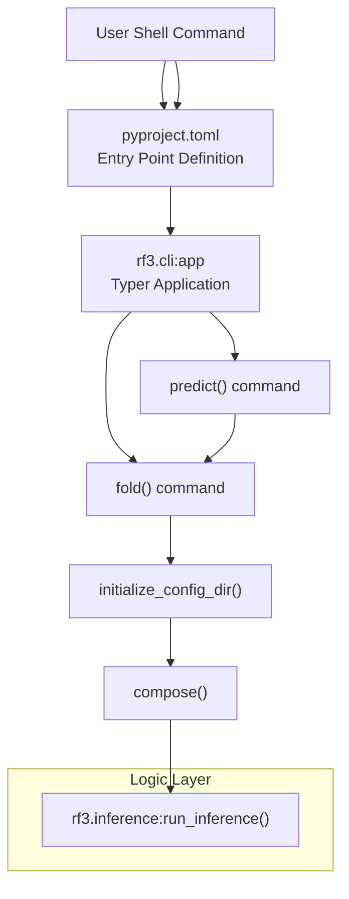
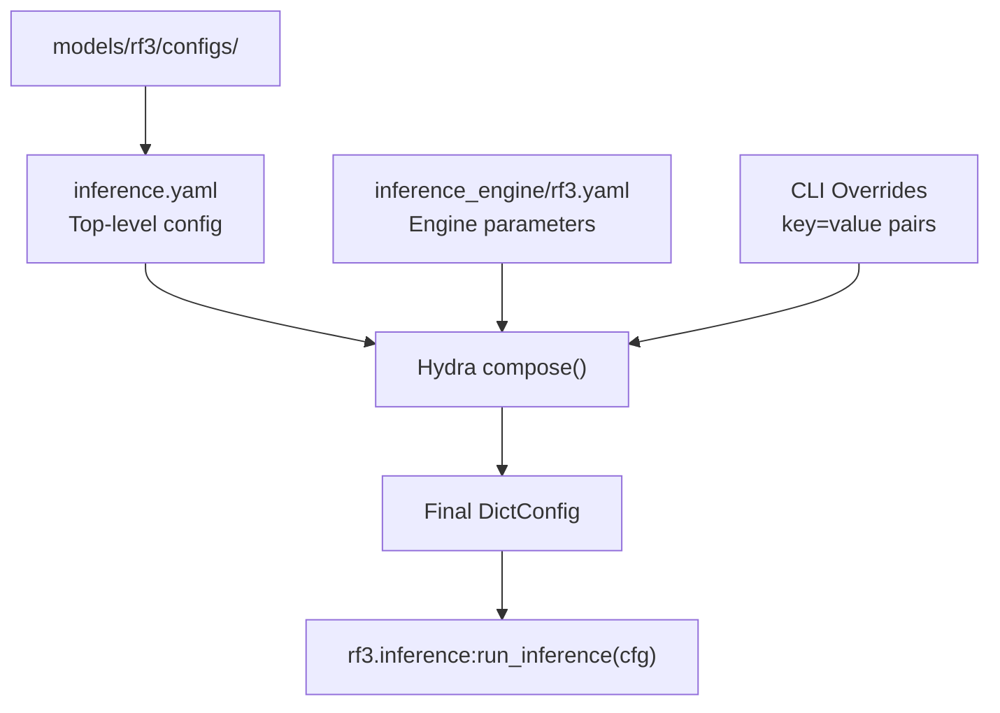

# rf3 CLI

> **Relevant source files**
> * [models/rf3/README.md](https://github.com/RosettaCommons/foundry/blob/cee116dc/models/rf3/README.md?plain=1)
> * [models/rf3/configs/experiment/pretrained/rf3.yaml](https://github.com/RosettaCommons/foundry/blob/cee116dc/models/rf3/configs/experiment/pretrained/rf3.yaml)
> * [models/rf3/docs/examples/3en2_from_file.cif](https://github.com/RosettaCommons/foundry/blob/cee116dc/models/rf3/docs/examples/3en2_from_file.cif)
> * [models/rf3/docs/examples/3en2_from_json_with_msa.json](https://github.com/RosettaCommons/foundry/blob/cee116dc/models/rf3/docs/examples/3en2_from_json_with_msa.json)
> * [models/rf3/docs/examples/5hkn_from_file.cif](https://github.com/RosettaCommons/foundry/blob/cee116dc/models/rf3/docs/examples/5hkn_from_file.cif)
> * [models/rf3/docs/examples/7o1r_from_json.json](https://github.com/RosettaCommons/foundry/blob/cee116dc/models/rf3/docs/examples/7o1r_from_json.json)
> * [models/rf3/docs/examples/7xli_template_antigen_and_framework.json](https://github.com/RosettaCommons/foundry/blob/cee116dc/models/rf3/docs/examples/7xli_template_antigen_and_framework.json)
> * [models/rf3/docs/examples/9dfn.cif](https://github.com/RosettaCommons/foundry/blob/cee116dc/models/rf3/docs/examples/9dfn.cif)
> * [models/rf3/docs/examples/9dfn_template_ligand_and_protein.json](https://github.com/RosettaCommons/foundry/blob/cee116dc/models/rf3/docs/examples/9dfn_template_ligand_and_protein.json)
> * [models/rf3/docs/examples/ligands/HEM.sdf](https://github.com/RosettaCommons/foundry/blob/cee116dc/models/rf3/docs/examples/ligands/HEM.sdf)
> * [models/rf3/docs/examples/ligands/NAG.cif](https://github.com/RosettaCommons/foundry/blob/cee116dc/models/rf3/docs/examples/ligands/NAG.cif)
> * [models/rf3/src/rf3/callbacks/dump_validation_structures.py](https://github.com/RosettaCommons/foundry/blob/cee116dc/models/rf3/src/rf3/callbacks/dump_validation_structures.py)
> * [models/rf3/src/rf3/cli.py](https://github.com/RosettaCommons/foundry/blob/cee116dc/models/rf3/src/rf3/cli.py)
> * [models/rf3/src/rf3/utils/io.py](https://github.com/RosettaCommons/foundry/blob/cee116dc/models/rf3/src/rf3/utils/io.py)
> * [models/rfd3/src/rfd3/cli.py](https://github.com/RosettaCommons/foundry/blob/cee116dc/models/rfd3/src/rfd3/cli.py)
> * [pyproject.toml](https://github.com/RosettaCommons/foundry/blob/cee116dc/pyproject.toml)

The `rf3` CLI provides command-line access to RosettaFold3 structure prediction capabilities. It supports folding proteins, nucleic acids, small molecules, and their complexes from sequence, MSA, and optional template information.

For general RosettaFold3 concepts and capabilities, see [RF3 Overview](/RosettaCommons/foundry/5.1-rf3-overview). For programmatic access to the inference engine, see [RF3 Inference](/RosettaCommons/foundry/5.2-rf3-inference). For checkpoint management, see [Checkpoint Management](/RosettaCommons/foundry/8.1-checkpoint-management).

---

## Command Structure

The `rf3` CLI provides two equivalent commands for running structure prediction:

```markdown
rf3 fold [OPTIONS] [HYDRA_OVERRIDES...]rf3 predict [OPTIONS] [HYDRA_OVERRIDES...]  # Alias for fold
```

Both commands accept the same arguments and options. The `predict` command exists as a convenience alias.

**Sources:** [models/rf3/src/rf3/cli.py L9-L17](https://github.com/RosettaCommons/foundry/blob/cee116dc/models/rf3/src/rf3/cli.py#L9-L17)

 [models/rf3/src/rf3/cli.py L72-L82](https://github.com/RosettaCommons/foundry/blob/cee116dc/models/rf3/src/rf3/cli.py#L72-L82)

---

## Command Entry Points



The `rf3` command is registered as a console script entry point in `pyproject.toml`, which routes to the Typer application defined in `rf3.cli`. The `fold` command initializes Hydra configuration, composes the final config with overrides, and delegates to the main inference script.

**Sources:** [pyproject.toml L90](https://github.com/RosettaCommons/foundry/blob/cee116dc/pyproject.toml#L90-L90)

 [models/rf3/src/rf3/cli.py L6-L17](https://github.com/RosettaCommons/foundry/blob/cee116dc/models/rf3/src/rf3/cli.py#L6-L17)

 [models/rf3/src/rf3/cli.py L64-L69](https://github.com/RosettaCommons/foundry/blob/cee116dc/models/rf3/src/rf3/cli.py#L64-L69)

---

## Basic Usage

### Simple Input File

The most basic usage accepts a single input file path (JSON or CIF):

```
rf3 fold input.json
```

The CLI automatically detects single positional arguments without `=` and treats them as the `inputs` parameter by prepending `inputs=`.

**Sources:** [models/rf3/src/rf3/cli.py L46-L48](https://github.com/RosettaCommons/foundry/blob/cee116dc/models/rf3/src/rf3/cli.py#L46-L48)

 [models/rf3/README.md L65-L67](https://github.com/RosettaCommons/foundry/blob/cee116dc/models/rf3/README.md?plain=1#L65-L67)

### Multiple Inputs

To predict multiple structures, pass a list of files using Hydra syntax:

```markdown
# Multiple files with Hydra list syntaxrf3 fold inputs='[file1.json,file2.json]'
```

### Output Directory

Specify where predictions should be saved:

```
rf3 fold inputs='input.json' out_dir='/path/to/output'
```

**Sources:** [models/rf3/README.md L66](https://github.com/RosettaCommons/foundry/blob/cee116dc/models/rf3/README.md?plain=1#L66-L66)

 [models/rf3/src/rf3/cli.py L46-L51](https://github.com/RosettaCommons/foundry/blob/cee116dc/models/rf3/src/rf3/cli.py#L46-L51)

---

## Configuration System

The RF3 CLI uses Hydra for hierarchical configuration management. All parameters can be specified as command-line overrides using `key=value` syntax.



Configuration merges in this order (later values override earlier):

1. Default `inference.yaml`
2. `inference_engine=rf3` (automatically added if not specified)
3. Command-line overrides

**Sources:** [models/rf3/src/rf3/cli.py L53-L59](https://github.com/RosettaCommons/foundry/blob/cee116dc/models/rf3/src/rf3/cli.py#L53-L59)

 [models/rf3/src/rf3/cli.py L64-L65](https://github.com/RosettaCommons/foundry/blob/cee116dc/models/rf3/src/rf3/cli.py#L64-L65)

---

## Common Parameters

### Model and Sampling Configuration

| Parameter | Type | Default | Description |
| --- | --- | --- | --- |
| `ckpt_path` | str | `null` | Path to model checkpoint (.ckpt or .pt) |
| `n_recycles` | int | `10` | Number of structure recycling iterations |
| `diffusion_batch_size` | int | `1` | Number of samples to generate per input |
| `num_steps` | int | `50` | Number of diffusion denoising steps |

**Sources:** [models/rf3/README.md L69-L71](https://github.com/RosettaCommons/foundry/blob/cee116dc/models/rf3/README.md?plain=1#L69-L71)

 [models/rf3/configs/experiment/pretrained/rf3.yaml L1-L10](https://github.com/RosettaCommons/foundry/blob/cee116dc/models/rf3/configs/experiment/pretrained/rf3.yaml#L1-L10)

### Quality and Resource Control

| Parameter | Type | Default | Description |
| --- | --- | --- | --- |
| `early_stopping_plddt_threshold` | float | `null` | Stop early if pLDDT is below this threshold |
| `raise_if_missing_msa_for_protein_of_length_n` | int | `null` | Error if proteins >= N residues lack MSAs |
| `verbose` | bool | `false` | Enable detailed logging |

**Sources:** [models/rf3/README.md L137-L141](https://github.com/RosettaCommons/foundry/blob/cee116dc/models/rf3/README.md?plain=1#L137-L141)

 [models/rf3/src/rf3/cli.py L14-L16](https://github.com/RosettaCommons/foundry/blob/cee116dc/models/rf3/src/rf3/cli.py#L14-L16)

---

## Usage Examples

### Folding with MSA (JSON Input)

Create a JSON file specifying sequences and MSA paths:

```json
{    "name": "example_with_msa",    "components": [        {            "seq": "AINRLQL...",            "msa_path": "/path/to/msa.a3m",            "chain_id": "A"        }    ]}
```

Run with:

```
rf3 fold inputs='example.json' out_dir='./output'
```

**Sources:** [models/rf3/README.md L98-L114](https://github.com/RosettaCommons/foundry/blob/cee116dc/models/rf3/README.md?plain=1#L98-L114)

 [models/rf3/docs/examples/3en2_from_json_with_msa.json L1-L15](https://github.com/RosettaCommons/foundry/blob/cee116dc/models/rf3/docs/examples/3en2_from_json_with_msa.json#L1-L15)

### Folding with Templates

Specify template CIF files and selection strings:

```json
{    "name": "template_example",    "components": [        { "path": "antigen.cif" },        { "path": "antibody.cif" }    ],    "template_selection": ["A", "B/*/1-42"]}
```

**Sources:** [models/rf3/docs/examples/7xli_template_antigen_and_framework.json L1-L14](https://github.com/RosettaCommons/foundry/blob/cee116dc/models/rf3/docs/examples/7xli_template_antigen_and_framework.json#L1-L14)

### Ligand and Bond Specification

Specify small molecules via CCD code, SMILES, or file paths, and define covalent bonds:

```json
{    "name": "ligand_complex",    "components": [        { "seq": "MKSL...", "chain_id": "A" },        { "ccd_code": "MG" },        { "path": "ligand.sdf" },        { "smiles": "[nH]1cc[nH+]c1" }    ],    "bonds": [        ["A/ASN/133/ND2", "F/NAG/1/C1"]    ]}
```

**Sources:** [models/rf3/docs/examples/7o1r_from_json.json L1-L32](https://github.com/RosettaCommons/foundry/blob/cee116dc/models/rf3/docs/examples/7o1r_from_json.json#L1-L32)

---

## Output Files

Upon successful execution, the following files are generated in the `out_dir`:

| File | Description |
| --- | --- |
| `*_confidences.csv` | Overall confidence metrics (pLDDT, pTM, etc.) |
| `*_ranking_scores.csv` | Granular confidence metrics for all generated folds |
| `*_model.cif` | Structure file for the highest-ranked sample |
| `*_summary_confidences.json` | Additional metadata for the top-scoring fold |
| `seed-0_sample-n/` | Directories containing structure and score files for other samples |

**Sources:** [models/rf3/README.md L80-L86](https://github.com/RosettaCommons/foundry/blob/cee116dc/models/rf3/README.md?plain=1#L80-L86)

---

## Verbose Mode

Enable detailed logging to see configuration trees and internal execution steps:

```
rf3 fold inputs='input.json' --verbose
```

By default, the CLI uses a minimal logging configuration to reduce noise.

**Sources:** [models/rf3/src/rf3/cli.py L19-L23](https://github.com/RosettaCommons/foundry/blob/cee116dc/models/rf3/src/rf3/cli.py#L19-L23)

 [models/rf3/src/rf3/cli.py L61-L62](https://github.com/RosettaCommons/foundry/blob/cee116dc/models/rf3/src/rf3/cli.py#L61-L62)