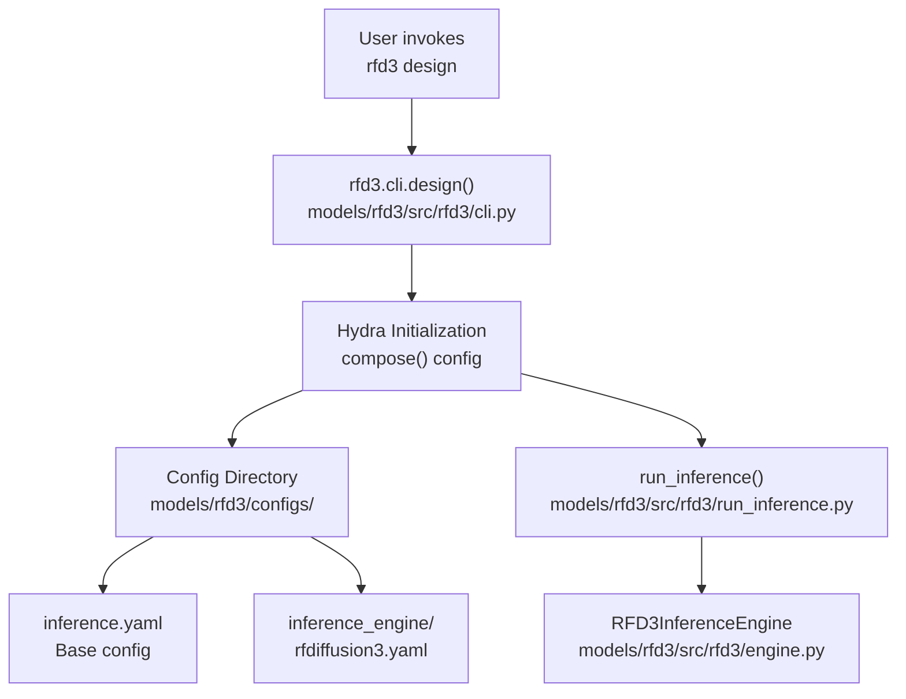
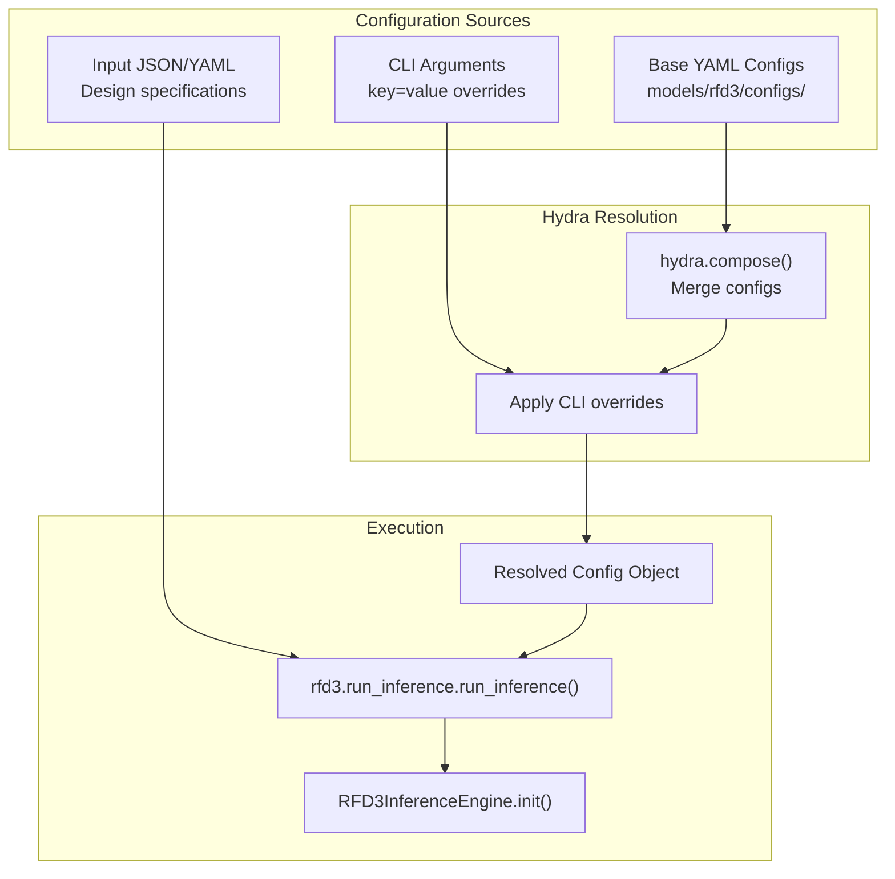

# rfd3 CLI

> **Relevant source files**
> * [models/rf3/configs/experiment/pretrained/rf3.yaml](https://github.com/RosettaCommons/foundry/blob/cee116dc/models/rf3/configs/experiment/pretrained/rf3.yaml)
> * [models/rf3/src/rf3/callbacks/dump_validation_structures.py](https://github.com/RosettaCommons/foundry/blob/cee116dc/models/rf3/src/rf3/callbacks/dump_validation_structures.py)
> * [models/rf3/src/rf3/cli.py](https://github.com/RosettaCommons/foundry/blob/cee116dc/models/rf3/src/rf3/cli.py)
> * [models/rf3/src/rf3/utils/io.py](https://github.com/RosettaCommons/foundry/blob/cee116dc/models/rf3/src/rf3/utils/io.py)
> * [models/rfd3/configs/inference_engine/rfdiffusion3.yaml](https://github.com/RosettaCommons/foundry/blob/cee116dc/models/rfd3/configs/inference_engine/rfdiffusion3.yaml)
> * [models/rfd3/configs/trainer/loss/losses/diffusion_loss.yaml](https://github.com/RosettaCommons/foundry/blob/cee116dc/models/rfd3/configs/trainer/loss/losses/diffusion_loss.yaml)
> * [models/rfd3/docs/.assets/input_selection_large.png](https://github.com/RosettaCommons/foundry/blob/cee116dc/models/rfd3/docs/.assets/input_selection_large.png)
> * [models/rfd3/docs/input.md](https://github.com/RosettaCommons/foundry/blob/cee116dc/models/rfd3/docs/input.md?plain=1)
> * [models/rfd3/src/rfd3/cli.py](https://github.com/RosettaCommons/foundry/blob/cee116dc/models/rfd3/src/rfd3/cli.py)
> * [models/rfd3/src/rfd3/model/RFD3_diffusion_module.py](https://github.com/RosettaCommons/foundry/blob/cee116dc/models/rfd3/src/rfd3/model/RFD3_diffusion_module.py)
> * [pyproject.toml](https://github.com/RosettaCommons/foundry/blob/cee116dc/pyproject.toml)

This page documents the `rfd3` command-line interface for running RFdiffusion3 inference. For details about the InputSpecification system used to configure design tasks, see [InputSpecification System](/RosettaCommons/foundry/4.2-inputspecification-system). For the underlying inference pipeline mechanics, see [RFD3 Inference Pipeline](/RosettaCommons/foundry/4.5-rfd3-inference-pipeline). For training RFD3 models, see [RFD3 Training](/RosettaCommons/foundry/4.6-rfd3-training).

## Purpose and Scope

The `rfd3` CLI provides a simple command-line entry point for running RFdiffusion3 design tasks. It wraps the Hydra-based configuration system and routes commands to the appropriate inference engine. This page covers command syntax, configuration override patterns, and common usage workflows.

## Command Architecture

The CLI is structured as a single command with Hydra-based configuration:



**Sources:** [models/rfd3/src/rfd3/cli.py L9-L43](https://github.com/RosettaCommons/foundry/blob/cee116dc/models/rfd3/src/rfd3/cli.py#L9-L43)

 [pyproject.toml L91](https://github.com/RosettaCommons/foundry/blob/cee116dc/pyproject.toml#L91-L91)

## Entry Point Registration

The `rfd3` command is registered in the package distribution as a console script:

```markdown
# From pyproject.toml[project.scripts]rfd3 = "rfd3.cli:app"
```

This maps the `rfd3` command to the `app` object in [models/rfd3/src/rfd3/cli.py L6](https://github.com/RosettaCommons/foundry/blob/cee116dc/models/rfd3/src/rfd3/cli.py#L6-L6)

 which is a `typer.Typer()` application.

**Sources:** [pyproject.yaoml L91](https://github.com/RosettaCommons/foundry/blob/cee116dc/pyproject.yaoml#L91-L91)

 [models/rfd3/src/rfd3/cli.py L6](https://github.com/RosettaCommons/foundry/blob/cee116dc/models/rfd3/src/rfd3/cli.py#L6-L6)

## Command: rfd3 design

The primary command for running RFdiffusion3 inference.

### Basic Syntax

```
rfd3 design [HYDRA_OVERRIDES...]
```

### Required CLI Arguments

| Parameter | Type | Description |
| --- | --- | --- |
| `out_dir` | `str` | Output directory path where results will be written. [models/rfd3/docs/input.md L59](https://github.com/RosettaCommons/foundry/blob/cee116dc/models/rfd3/docs/input.md?plain=1#L59-L59) |
| `inputs` | `str` | Path to JSON or YAML file containing design specifications. [models/rfd3/docs/input.md L60](https://github.com/RosettaCommons/foundry/blob/cee116dc/models/rfd3/docs/input.md?plain=1#L60-L60) |

### Core Inference Parameters

From the default configuration in [models/rfd3/configs/inference_engine/rfdiffusion3.yaml](https://github.com/RosettaCommons/foundry/blob/cee116dc/models/rfd3/configs/inference_engine/rfdiffusion3.yaml)

:

| Parameter | Type | Default | Description |
| --- | --- | --- | --- |
| `ckpt_path` | `str` | `rfd3` | Path or registry key for the model checkpoint. [models/rfd3/docs/input.md L71](https://github.com/RosettaCommons/foundry/blob/cee116dc/models/rfd3/docs/input.md?plain=1#L71-L71) |
| `n_batches` | `int` | 1 | Number of batches to generate per input key. [models/rfd3/docs/input.md L65](https://github.com/RosettaCommons/foundry/blob/cee116dc/models/rfd3/docs/input.md?plain=1#L65-L65) |
| `diffusion_batch_size` | `int` | 8 | Number of diffusion samples (designs) per batch. [models/rfd3/docs/input.md L66](https://github.com/RosettaCommons/foundry/blob/cee116dc/models/rfd3/docs/input.md?plain=1#L66-L66) |
| `skip_existing` | `bool` | `True` | Skip designing systems whose output files already exist. [models/rfd3/docs/input.md L72](https://github.com/RosettaCommons/foundry/blob/cee116dc/models/rfd3/docs/input.md?plain=1#L72-L72) |
| `dump_trajectories` | `bool` | `False` | Save intermediate denoising trajectories. [models/rfd3/docs/input.md L74](https://github.com/RosettaCommons/foundry/blob/cee116dc/models/rfd3/docs/input.md?plain=1#L74-L74) |
| `prevalidate_inputs` | `bool` | `False` | Check input validity before starting inference. [models/rfd3/docs/input.md L75](https://github.com/RosettaCommons/foundry/blob/cee116dc/models/rfd3/docs/input.md?plain=1#L75-L75) |
| `low_memory_mode` | `bool` | `False` | Enable memory-efficient tokenization. [models/rfd3/docs/input.md L76](https://github.com/RosettaCommons/foundry/blob/cee116dc/models/rfd3/docs/input.md?plain=1#L76-L76) |

**Sources:** [models/rfd3/docs/input.md L55-L76](https://github.com/RosettaCommons/foundry/blob/cee116dc/models/rfd3/docs/input.md?plain=1#L55-L76)

 [models/rfd3/configs/inference_engine/rfdiffusion3.yaml L8-L21](https://github.com/RosettaCommons/foundry/blob/cee116dc/models/rfd3/configs/inference_engine/rfdiffusion3.yaml#L8-L21)

## Configuration Flow



**Sources:** [models/rfd3/src/rfd3/cli.py L35-L43](https://github.com/RosettaCommons/foundry/blob/cee116dc/models/rfd3/src/rfd3/cli.py#L35-L43)

 [models/rfd3/configs/inference_engine/rfdiffusion3.yaml L1-L69](https://github.com/RosettaCommons/foundry/blob/cee116dc/models/rfd3/configs/inference_engine/rfdiffusion3.yaml#L1-L69)

## Advanced Sampler Overrides

The `inference_sampler` sub-config controls the diffusion process. These can be overridden via `inference_sampler.<key>=<value>`.

| Parameter | Default | Description |
| --- | --- | --- |
| `num_timesteps` | 200 | Number of diffusion denoising steps. [models/rfd3/docs/input.md L82](https://github.com/RosettaCommons/foundry/blob/cee116dc/models/rfd3/docs/input.md?plain=1#L82-L82) |
| `step_scale` | 1.5 | Scales step size; higher values reduce diversity but increase designability. [models/rfd3/docs/input.md L69](https://github.com/RosettaCommons/foundry/blob/cee116dc/models/rfd3/docs/input.md?plain=1#L69-L69) |
| `kind` | `default` | Set to `symmetry` for symmetric generation. [models/rfd3/docs/input.md L84](https://github.com/RosettaCommons/foundry/blob/cee116dc/models/rfd3/docs/input.md?plain=1#L84-L84) |
| `use_classifier_free_guidance` | `False` | Enable CFG for conditioned generation. [models/rfd3/docs/input.md L86](https://github.com/RosettaCommons/foundry/blob/cee116dc/models/rfd3/docs/input.md?plain=1#L86-L86) |
| `cfg_scale` | 1.5 | Influence of classifier-free guidance. [models/rfd3/docs/input.md L88](https://github.com/RosettaCommons/foundry/blob/cee116dc/models/rfd3/docs/input.md?plain=1#L88-L88) |
| `center_option` | `all` | How to center coordinates (`all`, `motif`, `diffuse`). [models/rfd3/docs/input.md L89-L92](https://github.com/RosettaCommons/foundry/blob/cee116dc/models/rfd3/docs/input.md?plain=1#L89-L92) |
| `n_recycle` | `null` | Iterations per step (defaults to 2 from checkpoint). [models/rfd3/docs/input.md L83](https://github.com/RosettaCommons/foundry/blob/cee116dc/models/rfd3/docs/input.md?plain=1#L83-L83) |

**Sources:** [models/rfd3/docs/input.md L79-L100](https://github.com/RosettaCommons/foundry/blob/cee116dc/models/rfd3/docs/input.md?plain=1#L79-L100)

 [models/rfd3/configs/inference_engine/rfdiffusion3.yaml L24-L51](https://github.com/RosettaCommons/foundry/blob/cee116dc/models/rfd3/configs/inference_engine/rfdiffusion3.yaml#L24-L51)

## Common Usage Patterns

### Minimal Example

```
rfd3 design out_dir=outputs/my_design inputs=input_spec.json
```

**Sources:** [models/rfd3/docs/input.md L51](https://github.com/RosettaCommons/foundry/blob/cee116dc/models/rfd3/docs/input.md?plain=1#L51-L51)

### Quick Debugging with Overrides

You can bypass an input file for simple tests using the `specification` override:

```
rfd3 design inputs=null specification.length=200 out_dir=debug_200
```

**Sources:** [models/rfd3/docs/input.md L67](https://github.com/RosettaCommons/foundry/blob/cee116dc/models/rfd3/docs/input.md?plain=1#L67-L67)

### Symmetry Mode

```
rfd3 design \  out_dir=outputs/sym \  inputs=sym.json \  inference_sampler.kind=symmetry
```

**Sources:** [models/rfd3/docs/input.md L84](https://github.com/RosettaCommons/foundry/blob/cee116dc/models/rfd3/docs/input.md?plain=1#L84-L84)

### Trajectory Saving

```
rfd3 design \  out_dir=outputs/traj \  inputs=spec.json \  dump_trajectories=True
```

**Sources:** [models/rfd3/docs/input.md L74](https://github.com/RosettaCommons/foundry/blob/cee116dc/models/rfd3/docs/input.md?plain=1#L74-L74)

## Input Specification Files

The `inputs` parameter accepts JSON or YAML files following the InputSpecification schema.

```json
{    "spec-1": {      "input": "path/to/pdb",      "contig": "50-80,/0,A1-100",      "ligand": "HAX,OAA"    }}
```

* **input**: Path to template PDB/CIF.
* **contig**: Mini-language for defining diffused and fixed regions.
* **ligand**: Selects ligands by residue name.

**Sources:** [models/rfd3/docs/input.md L34-L47](https://github.com/RosettaCommons/foundry/blob/cee116dc/models/rfd3/docs/input.md?plain=1#L34-L47)

## CLI Implementation Details

### Command Handler

[models/rfd3/src/rfd3/cli.py L9-L12](https://github.com/RosettaCommons/foundry/blob/cee116dc/models/rfd3/src/rfd3/cli.py#L9-L12)

 defines the `design` command using Typer. It allows extra arguments to support Hydra's `key=value` syntax.

### Config Path Resolution

The CLI dynamically locates the configuration directory:

1. **Development Mode**: Checks `models/rfd3/configs/` relative to the source. [models/rfd3/src/rfd3/cli.py L19-L21](https://github.com/RosettaCommons/foundry/blob/cee116dc/models/rfd3/src/rfd3/cli.py#L19-L21)
2. **Installed Mode**: Falls back to the package-relative `configs/` directory. [models/rfd3/src/rfd3/cli.py L24](https://github.com/RosettaCommons/foundry/blob/cee116dc/models/rfd3/src/rfd3/cli.py#L24-L24)

### Argument Processing

[models/rfd3/src/rfd3/cli.py L27-L33](https://github.com/RosettaCommons/foundry/blob/cee116dc/models/rfd3/src/rfd3/cli.py#L27-L33)

:

1. Merges `ctx.args` and parameters.
2. Filters out command aliases (`design`, `fold`).
3. Defaults `inference_engine` to `rfdiffusion3` if not provided.
4. Initializes Hydra and composes the config object.

### Warning Suppression

The CLI wraps the inference call in a `suppress_warnings` context to ensure clean output during design runs. [models/rfd3/src/rfd3/cli.py L39-L43](https://github.com/RosettaCommons/foundry/blob/cee116dc/models/rfd3/src/rfd3/cli.py#L39-L43)

**Sources:** [models/rfd3/src/rfd3/cli.py L1-L47](https://github.com/RosettaCommons/foundry/blob/cee116dc/models/rfd3/src/rfd3/cli.py#L1-L47)

## Output Management

The CLI and underlying engine produce several files in the `out_dir`:

* **Generated Structures**: Saved as CIF files.
* **Metadata**: A `prediction_metadata.json` is dumped by default. [models/rfd3/configs/inference_engine/rfdiffusion3.yaml L64](https://github.com/RosettaCommons/foundry/blob/cee116dc/models/rfd3/configs/inference_engine/rfdiffusion3.yaml#L64-L64)
* **Trajectories**: If `dump_trajectories=True`, saved in the output directory. [models/rfd3/docs/input.md L74](https://github.com/RosettaCommons/foundry/blob/cee116dc/models/rfd3/docs/input.md?plain=1#L74-L74)
* **Guideposts**: Virtual atoms used during inference can be saved by setting `cleanup_guideposts=False`. [models/rfd3/docs/input.md L101](https://github.com/RosettaCommons/foundry/blob/cee116dc/models/rfd3/docs/input.md?plain=1#L101-L101)

**Sources:** [models/rfd3/configs/inference_engine/rfdiffusion3.yaml L53-L69](https://github.com/RosettaCommons/foundry/blob/cee116dc/models/rfd3/configs/inference_engine/rfdiffusion3.yaml#L53-L69)

Sources: [models/rfd3/src/rfd3/cli.py L1-L48](https://github.com/RosettaCommons/foundry/blob/cee116dc/models/rfd3/src/rfd3/cli.py#L1-L48)

 [models/rfd3/docs/input.md L1-L101](https://github.com/RosettaCommons/foundry/blob/cee116dc/models/rfd3/docs/input.md?plain=1#L1-L101)

 [models/rfd3/configs/inference_engine/rfdiffusion3.yaml L1-L69](https://github.com/RosettaCommons/foundry/blob/cee116dc/models/rfd3/configs/inference_engine/rfdiffusion3.yaml#L1-L69)

 [pyproject.toml L85-L95](https://github.com/RosettaCommons/foundry/blob/cee116dc/pyproject.toml#L85-L95)