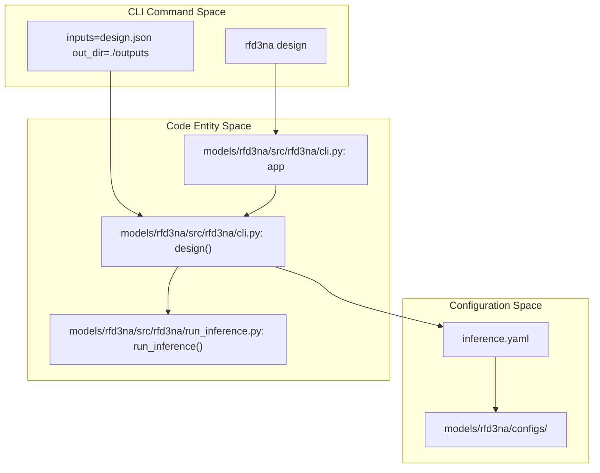

# rfd3na CLI

> **Relevant source files**
> * [models/rf3/configs/experiment/pretrained/rf3.yaml](https://github.com/RosettaCommons/foundry/blob/cee116dc/models/rf3/configs/experiment/pretrained/rf3.yaml)
> * [models/rf3/src/rf3/callbacks/dump_validation_structures.py](https://github.com/RosettaCommons/foundry/blob/cee116dc/models/rf3/src/rf3/callbacks/dump_validation_structures.py)
> * [models/rf3/src/rf3/cli.py](https://github.com/RosettaCommons/foundry/blob/cee116dc/models/rf3/src/rf3/cli.py)
> * [models/rf3/src/rf3/utils/io.py](https://github.com/RosettaCommons/foundry/blob/cee116dc/models/rf3/src/rf3/utils/io.py)
> * [models/rfd3/docs/examples/na_binder_design.md](https://github.com/RosettaCommons/foundry/blob/cee116dc/models/rfd3/docs/examples/na_binder_design.md?plain=1)
> * [models/rfd3/src/rfd3/cli.py](https://github.com/RosettaCommons/foundry/blob/cee116dc/models/rfd3/src/rfd3/cli.py)
> * [pyproject.toml](https://github.com/RosettaCommons/foundry/blob/cee116dc/pyproject.toml)

The `rfd3na` CLI provides the primary interface for running RosettaFold3-Diffusion Nucleic Acid (RFD3NA) design tasks. It extends the capabilities of the standard `rfd3` tool to support multipolymer design, specifically enabling the generation of protein backbones in the presence of or in complex with DNA and RNA chains.

## Purpose and Scope

The `rfd3na` command is used to invoke the RFD3NA inference engine. It handles the parsing of complex design specifications, including nucleic acid chain definitions, and manages the diffusion sampling process to produce all-atom structures of protein-nucleic acid complexes.

Key features accessible via the CLI include:

* **Multipolymer Design**: Support for protein, DNA, and RNA chains within a single design task.
* **Nucleic Acid Specification**: Detailed control over fixed vs. diffused nucleic acid atoms.
* **Sequence Integration**: Ability to read nucleic acid sequences directly from input headers.
* **Hydra-based Configuration**: Full access to model hyperparameters and inference settings via command-line overrides.

Sources: [models/rfd3na/src/rfd3na/cli.py L12-L43](https://github.com/RosettaCommons/foundry/blob/cee116dc/models/rfd3na/src/rfd3na/cli.py#L12-L43)

 [pyproject.toml L92](https://github.com/RosettaCommons/foundry/blob/cee116dc/pyproject.toml#L92-L92)

## CLI Command: design

The `design` command is the main entry point for running inference. It uses the `typer` library to manage the command-line interface and `hydra` for configuration management.

### Usage Syntax

```
rfd3na design [HYDRA_OVERRIDES]
```

### Parameters and Overrides

| Parameter | Description |
| --- | --- |
| `inputs` | Path to a JSON file containing the design specifications (contigs, lengths, etc.). |
| `out_dir` | Directory where the generated structures and trajectories will be saved. |
| `ckpt_path` | Path to the RFD3NA model checkpoint file. |
| `inference_engine` | Defaults to `rfdiffusion3na`. Determines the inference logic used. |
| `read_sequence_from_sequence_head` | Boolean flag to determine if nucleic acid sequences should be parsed from the PDB file headers. |

Sources: [models/rfd3na/src/rfd3na/cli.py L12-L36](https://github.com/RosettaCommons/foundry/blob/cee116dc/models/rfd3na/src/rfd3na/cli.py#L12-L36)

 [models/rfd3/docs/examples/na_binder_design.md L5-L8](https://github.com/RosettaCommons/foundry/blob/cee116dc/models/rfd3/docs/examples/na_binder_design.md?plain=1#L5-L8)

## System Architecture and Data Flow

The `rfd3na` CLI acts as a wrapper that initializes the environment, composes the configuration, and executes the `run_inference` function.

### Natural Language to Code Entity Space: CLI Execution

The following diagram maps the CLI command components to their respective code entities and configuration paths.

Title: rfd3na CLI Execution Mapping



Sources: [models/rfd3na/src/rfd3na/cli.py L6-L43](https://github.com/RosettaCommons/foundry/blob/cee116dc/models/rfd3na/src/rfd3na/cli.py#L6-L43)

 [pyproject.toml L92](https://github.com/RosettaCommons/foundry/blob/cee116dc/pyproject.toml#L92-L92)

 [models/rfd3/src/rfd3/cli.py L12-L69](https://github.com/RosettaCommons/foundry/blob/cee116dc/models/rfd3/src/rfd3/cli.py#L12-L69)

## Implementation Details

### Configuration Initialization

The CLI identifies the configuration directory based on the execution environment (development vs. installed package). It uses `initialize_config_dir` from Hydra to load the base `inference.yaml` and applies user-provided overrides.

### Inference Execution Flow

Once the configuration is composed, the CLI performs a lazy import of `run_inference`. This prevents heavy dependencies (like PyTorch and AtomWorks) from loading during basic CLI help or argument parsing, improving responsiveness.

Title: RFD3NA Inference Data Flow

```mermaid
sequenceDiagram
  participant CLI User
  participant rfd3na/cli.py
  participant Hydra Config
  participant run_inference()

  CLI User->>rfd3na/cli.py: rfd3na design inputs=spec.json
  rfd3na/cli.py->>Hydra Config: initialize_config_dir(config_path)
  Hydra Config-->>rfd3na/cli.py: cfg object
  rfd3na/cli.py->>run_inference(): run_inference(cfg)
  note over run_inference(): Load Checkpoint
  note over run_inference(): Parse DesignInputSpecification
  note over run_inference(): Diffusion Sampling
  run_inference()-->>CLI User: Output .cif files
```

Sources: [models/rfd3na/src/rfd3na/cli.py L18-L43](https://github.com/RosettaCommons/foundry/blob/cee116dc/models/rfd3na/src/rfd3na/cli.py#L18-L43)

 [models/rfd3/src/rfd3/cli.py L12-L69](https://github.com/RosettaCommons/foundry/blob/cee116dc/models/rfd3/src/rfd3/cli.py#L12-L69)

## Nucleic Acid Specific Configurations

When using the `rfd3na` CLI, specific parameters in the `inputs` JSON or as Hydra overrides are critical for nucleic acid handling:

1. **Contig Specification**: Nucleic acid chains must be explicitly defined in the contig string (e.g., `A1-10` for a DNA strand).
2. **Fixed Atom Selection**: The `select_fixed_atoms` parameter allows users to specify which parts of the nucleic acid should remain static and which should be sampled by the model.
3. **Sequence Handling**: If `read_sequence_from_sequence_head` is enabled, the model will attempt to extract the specific nucleotide sequence from the input PDB/CIF file to inform the design.

### Example CLI Command with Overrides

```
rfd3na design \    inputs=./my_dna_protein_complex.json \    out_dir=./results \    inference_engine.read_sequence_from_sequence_head=True \    inference_engine.sampling.num_steps=50
```

Sources: [models/rfd3/docs/examples/na_binder_design.md L23-L37](https://github.com/RosettaCommons/foundry/blob/cee116dc/models/rfd3/docs/examples/na_binder_design.md?plain=1#L23-L37)

 [models/rfd3/docs/examples/na_binder_design.md L57-L68](https://github.com/RosettaCommons/foundry/blob/cee116dc/models/rfd3/docs/examples/na_binder_design.md?plain=1#L57-L68)