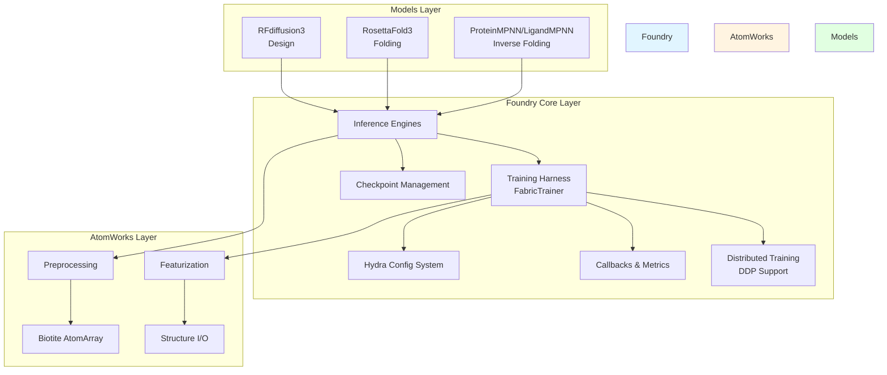
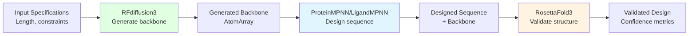

---
slug:1-overview
blog_type:normal
---


Foundry 是一个全面的蛋白质设计框架，为使用和训练深度学习模型提供统一的工具和基础设施，涵盖三个关键领域：**设计** (RFdiffusion3)、**逆折叠** (ProteinMPNN 和 LigandMPNN) 以及 **蛋白质折叠** (RosettaFold3)。该框架通过通用接口集成这些模型，实现了端到端的蛋白质设计流程，所有组件均构建在 [AtomWorks](https://github.com/RosettaCommons/atomworks) 之上，用于生物分子结构的操作和处理。

来源：[README.md](README.md#L1-L9)

## 架构与设计理念

Foundry 遵循严格的依赖层次结构：`foundry` → `atomworks`。其中，**AtomWorks** 负责结构 I/O、预处理和特征化，而 **Foundry** 提供模型架构、训练基础设施和推理端点。这种关注点分离使 Foundry 能够作为多个独立蛋白质设计模型的统一平台，每个模型单独打包在 `models/` 目录中，同时共享核心基础设施。

来源：[README.md](README.md#L36-L42)



该架构围绕几个核心组件构建：

- **BaseInferenceEngine**：为加载检查点和在所有模型上运行推理提供统一接口，将昂贵的模型设置与迭代推理执行分离
- **FabricTrainer**：基于 PyTorch Lightning Fabric 构建的通用训练框架，支持梯度累积、混合精度、分布式训练和原生指数移动平均 (EMA) 集成
- **Hydra Configuration System**：使用自定义解析器管理复杂的模型配置，实现动态参数解析
- **Checkpoint Management**：用于下载和管理模型权重的中心化注册表系统，具有自动路径解析功能

来源：[base.py](src/foundry/inference_engines/base.py#L32-L66), [fabric.py](src/foundry/trainers/fabric.py#L1-L50), [resolvers.py](src/foundry/hydra/resolvers.py#L1-L25)

## 支持的模型

Foundry 目前集成了三个最先进的蛋白质设计模型，每个模型解决蛋白质设计工作流的不同方面：

| 模型 | 类型 | 主要功能 | 关键特性 |
|-------|------|------------------|--------------|
| **RFdiffusion3 (RFD3)** | 设计 | 在复杂约束下生成新型蛋白质骨架 | 全原子扩散，支持核酸结合物、小分子结合物、酶、对称性 |
| **RosettaFold3 (RF3)** | 折叠 | 从氨基酸序列预测 3D 结构 | 可与 AlphaFold-3 竞争，支持蛋白质-DNA 复合物，多种检查点变体 |
| **ProteinMPNN/LigandMPNN** | 逆折叠 | 为固定骨架设计序列 | 轻量级，快速推理，支持配体条件化，可溶性蛋白质设计 |


来源：[README.md](README.md#L20-L32), [all.ipynb](examples/all.ipynb#L10-L19)

### RFdiffusion3 (RFD3)

RFdiffusion3 是一个全原子生成式扩散模型，能够在复杂约束下设计蛋白质结构，包括蛋白质-蛋白质、蛋白质-DNA、蛋白质-配体和酶活性位点设计。该模型支持对称设计和各种条件化模式，以适应不同的设计场景。


来源：[README.md](README.md#L20-L24), [rfd3/README.md](models/rfd3/README.md#L1-L14)

### RosettaFold3 (RF3)

RosettaFold3 是一个结构预测神经网络，缩小了闭源 AlphaFold-3 与开源替代方案之间的差距。它在训练时包含隐式手性表示和原子级几何条件化，改善了手性配体和蛋白质-DNA 复合物预测等任务的表现。提供多种检查点变体以适应不同的用例（最新版、预印版和基准版）。

来源：[README.md](README.md#L28-L32), [rf3/README.md](models/rf3/README.md#L1-L18)

### ProteinMPNN 和 LigandMPNN

这些是轻量级的逆折叠模型，能够在约束条件下为骨架设计多样化的序列。ProteinMPNN 处理标准蛋白质序列设计，而 LigandMPNN 将其扩展到包括小分子、离子、DNA/RNA 和其他配体。SolubleMPNN 专注于设计膜蛋白的可溶性类似物。所有模型都支持传统权重加载以实现向后兼容。

来源：[README.md](README.md#L33-L35), [mpnn/README.md](models/mpnn/README.md#L1-L20)

## 关键特性

### 统一数据模型

Foundry 中的所有模型都依赖 AtomWorks 的 Biotite `AtomArray` 对象进行训练和推理，在整个流程中提供一致的数据表示。这使得模型之间能够无缝互操作，而无需格式转换。

来源：[README.md](README.md#L5-L9), [all.ipynb](examples/all.ipynb#L25-L27)

### 训练基础设施

Foundry 提供全面的训练框架，具有以下特性：

- **分布式训练**：跨多个节点和 GPU 原生支持 DDP (Distributed Data Parallel)
- **精度控制**：支持 64 位、32 位、16 位混合和 bfloat16 混合精度训练
- **EMA 集成**：内置指数移动平均以稳定模型权重
- **灵活回调**：模块化回调系统，用于指标记录、健康监控和自定义训练事件
- **梯度管理**：梯度累积、裁剪和 NaN 检查功能

来源：[fabric.py](src/foundry/trainers/fabric.py#L1-L72)

### 配置管理

基于 Hydra 的配置系统支持：

- **动态解析器**：自定义解析器，用于在运行时导入模块和解析链类型信息
- **分层配置**：带有模型特定覆盖的基础配置
- **CLI 覆盖**：强大的命令行覆盖语法，用于运行时参数调整

来源：[resolvers.py](src/foundry/hydra/resolvers.py#L1-L40)

### 检查点管理

集中化的 CLI 工具 (`foundry install`) 简化了模型权重管理：

- **自动注册**：检查点在中心注册表中注册，便于访问
- **哈希验证**：SHA256 验证确保下载的权重未损坏
- **进度跟踪**：丰富的进度条，显示下载速度和剩余时间
- **灵活安装**：可安装单个模型或一次性安装所有模型

来源：[download_checkpoints.py](src/foundry_cli/download_checkpoints.py#L1-L50)

## 仓库结构

```
foundry/
├── models/              # 模型特定包（独立）
│   ├── rfd3/           # RFdiffusion3 实现
│   ├── rf3/            # RosettaFold3 实现
│   └── mpnn/           # ProteinMPNN/LigandMPNN 实现
├── src/
│   ├── foundry/        # 核心共享基础设施
│   │   ├── callbacks/              # 训练回调
│   │   ├── inference_engines/      # 基础推理引擎
│   │   ├── metrics/                # 损失和指标
│   │   ├── model/                  # 模型层
│   │   ├── trainers/               # FabricTrainer 框架
│   │   ├── training/               # EMA、检查点、调度器
│   │   ├── hydra/                  # 配置解析器
│   │   └── utils/                  # 工具（DDP、数据集等）
│   └── foundry_cli/   # CLI 工具（检查点管理）
├── examples/           # Jupyter notebooks（端到端流程）
└── tests/              # 测试基础设施
```

这种结构实现了模块化开发工作流，核心基础设施 (`src/foundry`) 开发一次并在所有模型包中重用，而模型特定代码则隔离在 `models/` 目录中。每个模型包都有自己的 `pyproject.toml`，可以独立安装或以可编辑模式安装以进行开发。

来源：[README.md](README.md#L44-L59), [pyproject.toml](pyproject.toml#L65-L85)

<CgxTip>模块化架构意味着你可以只安装需要的模型。使用 `pip install rc-foundry[rfd3]` 仅安装 RFdiffusion3，或使用 `pip install rc-foundry[all]` 安装所有模型。</CgxTip>

## 安装与快速开始

### 安装

安装包含所有模型的 Foundry：

```bash
pip install rc-foundry[all]
```

或仅安装特定模型：

```bash
pip install rc-foundry[rfd3]  # 仅 RFdiffusion3
pip install rc-foundry[rf3]   # 仅 RosettaFold3
pip install rc-foundry[all]   # 所有模型
```

### 下载检查点

将模型权重下载到目标目录：

```bash
# 所有模型（总计约 6GB）
foundry install all --checkpoint-dir /path/to/ckpt/dir

# 或特定模型（推荐给初学者）
foundry install rfd3 ligandmpnn rf3 --checkpoint-dir /path/to/ckpt/dir
```

这将设置 `FOUNDRY_CHECKPOINTS_DIR` 环境变量，使模型能够自动找到而无需指定路径。

来源：[README.md](README.md#L12-L21), [download_checkpoints.py](src/foundry_cli/download_checkpoints.py#L1-L50)

### 端到端示例

完整的蛋白质设计流程展示了模型如何协同工作：



来源：[all.ipynb](examples/all.ipynb#L23-L25)

## 后续步骤

本概述为了解 Foundry 的架构和功能奠定了基础。要加深理解并获得框架的实际操作经验：

1. **[快速开始](2-quick-start)** - 分步安装指南和你的第一个蛋白质设计流程
2. **[端到端设计流程教程](3-end-to-end-design-pipeline-tutorial)** - 演示完整设计工作流程的综合教程
3. **[Google Colab 快速开始](4-google-colab-quick-start)** - 无需本地安装的交互式笔记本体验

对于对架构和扩展 Foundry 感兴趣的开发者：

- **[架构与设计理念](5-architecture-and-design-philosophy)** - 深入探讨设计原则和技术决策
- **[推理引擎架构](6-inference-engine-architecture)** - 详细探索基础推理引擎
- **[使用 FabricTrainer 的训练框架](7-training-harness-with-fabrictrainer)** - 训练基础设施的综合指南
- **[向 Foundry 添加新模型](21-adding-new-models-to-foundry)** - 如何将自己的模型集成到 Foundry 框架中

<CgxTip>对于无需本地安装的交互式学习，请先尝试 [Google Colab 快速开始](4-google-colab-quick-start) 笔记本。它可在浏览器中提供完整的端到端设计流程体验。</CgxTip>