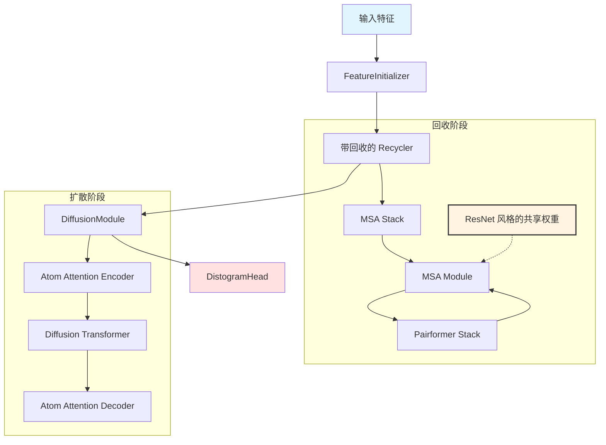

---
slug:10-rosettafold3-structure-prediction-network
blog_type:normal
---


RosettaFold3 (RF3) 是一个全原子生物分子结构预测网络，它利用基于扩散的生成建模来预测蛋白质、核酸、配体及其复合物的三维结构。该架构在 AlphaFold3 原理的基础上进行了扩展，融合了隐式手性表示和原子级几何条件，以提升在手性配体预测任务上的性能。

## 核心架构概览


RF3 实现了一个多尺度表示系统，该系统在 Token 级（粗粒度）和原子级（细粒度）分辨率上运行。该架构遵循双阶段设计：首先是一个用于初始结构优化的带回收（recycling）的主干模块，随后是一个用于详细全原子生成的扩散模块。

### 形状标注术语表

理解 RF3 的张量形状对于使用该模型至关重要：

- **I**：Token 数量（粗粒度表示）
- **L**：原子数量（细粒度表示）
- **M**：MSA 序列数量
- **T**：模版数量
- **D**：扩散结构批次维度
- **C_s**：Token 级单一表示通道维度 (384)
- **C_z**：Token 级成对表示通道维度 (128)
- **C_atom**：原子级单一表示通道维度 (128)
- **C_atompair**：原子级成对表示通道维度 (16)

来源：[RF3.py](models/rf3/src/rf3/model/RF3.py#L21-L34)

## 模型架构

RF3 模型由五个核心组件组成，它们在前向传播过程中依次工作：



### FeatureInitializer

`FeatureInitializer` 从输入特征创建初始的 Token 级单一 (S) 和成对 (Z) 表示。它嵌入序列特征（restype, profile, deletion_mean），并通过 AtomAttentionEncoder 处理原子级特征以生成粗粒度的 Token 表示。

关键参数：
- **c_token**：Token 表示的 384 个通道
- **c_atom_1d_features**：389 个特征，包括 ref_pos, ref_charge, ref_mask, ref_element, ref_atom_name_chars
- **use_inv_dist_squared**：True 表示嵌入成对逆平方距离

来源：[rf3_net.yaml](models/rf3/configs/model/components/rf3_net.yaml#L9-L26), [pairformer_layers.py](models/rf3/src/rf3/model/layers/pairformer_layers.py#L21-L77)

### Recycler

`Recycler` 实现了具有 ResNet 风格回收机制的主干架构，使用共享权重重复运行模型主干。这种迭代优化过程包括：

- **MSA Module**：处理包含 4 个块的多序列比对，使用外积平均值和 MSA 成对加权平均来创建初始成对表示
- **Pairformer Stack**：48 个由三角注意力（triangle attention）和三角乘法操作组成的块，用于残基内和残基间的信息交互
- **Template Embedder**：2 块模块，融入 raw_template_dim 为 108 的模版信息

回收机制为每个回收步骤 (i_cycle) 采样一个独立的 MSA，仅在最后一次回收时运行梯度，从而在训练期间实现高效的内存使用。

来源：[rf3_net.yaml](models/rf3/configs/model/components/rf3_net.yaml#L42-L109), [RF3.py](models/rf3/src/rf3/model/RF3.py#L257-L334)

### DiffusionModule

`DiffusionModule` 使用 EDM (Efficient Diffusion Model) 公式执行原子级扩散建模。该模块接收噪声原子坐标，并通过具有原子级注意力的 Transformer 架构逐步对其进行去噪。

关键组件：

- **AtomAttentionEncoder**：序列局部原子注意力并聚合到粗粒度 Token，可选的手性特征条件
- **DiffusionTransformer**：24 块 Transformer，具有 16 个注意力头，用于 Token 级别的全自注意力
- **AtomAttentionDecoder**：交叉注意力 Transformer，将 Token 级表示广播回原子级位置

该模块支持多种预测策略：
- **f_pred="edm"**：使用 EDM 公式预测缩放位置
- **f_pred="noise_pred"**：直接噪声预测
- **f_pred="unconditioned"**：无条件预测模式

<CgxTip>扩散模块全程使用激活检查点（activation checkpointing）来平衡内存效率和计算成本，这在考虑到 L×L 原子对表示时尤为重要。</CgxTip>

来源：[RF3_structure.py](models/rf3/src/rf3/model/RF3_structure.py#L73-L150), [rf3_net.yaml](models/rf3/configs/model/components/rf3_net.yaml#L111-L158)

### DistogramHead

`DistogramHead` 预测残基对之间的距离分布，提供与基于扩散的坐标预测互补的置信度信息。它在具有 65 个距离分箱的成对表示 (Z_II) 上运行。

来源：[rf3_net.yaml](models/rf3/configs/model/components/rf3_net.yaml#L158-L160), [RF3.py](models/rf3/src/rf3/model/RF3.py#L1-L150)

## 前向传播机制

训练模式和推理模式下的前向传播存在显著差异：

### 训练模式

在训练期间，RF3 执行单步去噪，且仅在最后一次回收时启用梯度：

1. 运行 n_recycles 个循环的回收过程，除最后一次外禁用所有循环的梯度
2. 从最终的成对表示生成距离图预测
3. 将噪声坐标传递给 diffusion_module 进行单步去噪
4. 返回预测的坐标和距离图

```python
# 训练期间的单步去噪
X_pred = self.diffusion_module(
    X_noisy_L=input["X_noisy_L"],
    t=input["t"],
    f=input["f"],
    S_inputs_I=recycling_outputs["S_inputs_I"],
    S_trunk_I=recycling_outputs["S_I"],
    Z_trunk_II=recycling_outputs["Z_II"],
)
```

来源：[RF3.py](models/rf3/src/rf3/model/RF3.py#L174-L190)

### 推理模式

在推理期间，RF3 执行完整的扩散展开，计算过程不涉及梯度：

1. 完成禁用梯度的回收阶段
2. 运行推理采样器 num_timesteps（默认 50）步
3. 生成噪声和去噪坐标的轨迹以进行监控
4. 计算包括 pTM 和 ipTM 在内的置信度指标

推理采样器使用具有以下参数的 AlphaFold3 风格求解器：
- **num_timesteps**：50 步用于扩散展开
- **sigma_data**：16.0 用于 EDM 公式
- **noise_scale**：1.003 用于噪声调度
- **step_scale**：1.5 用于步长缩放

来源：[RF3.py](models/rf3/src/rf3/model/RF3.py#L190-L213), [rf3.yaml](models/rf3/configs/inference_engine/rf3.yaml#L1-L33)

## 输入特征和数据管道

RF3 接受包含序列级和原子级信息的综合特征字典：

### 序列级特征

- **restype**：One-hot 编码的残基类型（20 种标准 + 特殊代码）
- **profile**：来自 MSA 的位置特异性评分矩阵
- **deletion_mean**：来自 MSA 的平均缺失概率
- **msa_stack**：MSA 堆栈 (n_recycles × M × I)，每个回收周期一个

### 原子级特征

- **ref_pos**：3D 空间中的参考原子位置
- **ref_charge**：原子电荷
- **ref_mask**：原子的有效性掩码
- **ref_element**：原子元素类型
- **ref_atom_name_chars**：One-hot 编码的原子名称
- **ref_space_uid**：用于掩码的链/残基标识符

<CgxTip>atom_to_token_map 将每个原子映射到其对应的 Token，从而能够使用索引操作高效地从原子级聚合到 Token 级表示。</CgxTip>

来源：[RF3.py](models/rf3/src/rf3/model/RF3.py#L21-L34), [pairformer_layers.py](models/rf3/src/rf3/model/layers/pairformer_layers.py#L100-L134)

## 推理引擎

`RF3InferenceEngine` 封装了模型，提供配置管理和输出格式化，用于生产环境：

### 配置参数

| 参数 | 默认值 | 描述 |
|-----------|---------|-------------|
| n_recycles | 10 | 回收迭代次数 |
| diffusion_batch_size | 5 | 扩散采样的批次大小 |
| num_steps | 50 | 扩散时间步数 |
| early_stopping_plddt_threshold | 0.5 | 基于置信度的早停阈值 |

### 置信度指标

RF3 计算 AlphaFold3 风格的置信度指标：

- **pTM**：预测的 TM-score，用于整体结构质量（范围 0-1，越高越好）
- **ipTM**：多链预测的接口 pTM，衡量接口质量
- **ranking_score**：综合得分，计算公式为 `0.8 * ipTM + 0.2 * pTM - 100 * has_clash`

### 输出格式

推理引擎输出与 AlphaFold3 兼容的文件：

- **{example_id}_model_*.cif.gz**：mmCIF 格式的预测结构
- **{example_id}_metrics.csv**：汇总置信度指标，包括 pTM, ipTM, ranking_score
- **{example_id}.score**：每残基置信度得分（结构文件中的 B-factor 列）

来源：[rf3.py](models/rf3/src/rf3/inference_engines/rf3.py#L1-L200), [rf3.yaml](models/rf3/configs/inference_engine/rf3.yaml#L1-L33)

## 训练配置

训练 RF3 需要仔细配置数据加载器、优化器和调度器：

### 训练循环参数

```yaml
max_epochs: 10_000
n_examples_per_epoch: 24000
n_recycles_train: 4  # 在数据集配置中指定
clip_grad_max_norm: 10.0
precision: bf16-mixed
```

训练管道包括：
- **DiffusionLoss**：坐标预测的主要损失
- **DistogramLoss**：距离预测的辅助损失
- **StructurePredictionTrainer**：处理 RF3 特定需求的定制训练器

训练器支持预验证、梯度裁剪和周期性检查点，并使用 bf16 混合精度以提高内存效率。

来源：[rf3.yaml](models/rf3/configs/trainer/rf3.yaml#L1-L21), [structure_prediction.yaml](models/rf3/configs/trainer/loss/structure_prediction.yaml#L1-L5)

## 模型变体

提供三个模型检查点，均共享相同的推理 API：

| 模型 | 训练截止日期 | 用例 |
|-------|-----------------|----------|
| Latest | 01/24 | 生产使用，包含错误修复和改进 |
| Preprint | 01/24 | 用于可重复性的原始预印本模型 |
| Benchmark | 09/21 | 与具有相同日期截止的模型进行基准测试 |

所有检查点保持相同的架构和推理接口，允许在不更改代码的情况下无缝切换。

来源：[README.md](models/rf3/README.md#L30-L60)

## 高级功能

### 手性条件

RF3 融合了隐式手性表示以改善配体预测：

```yaml
use_chiral_features: true
no_grad_on_chiral_center: false
```

模型在训练期间计算手性梯度以强制执行正确的立体化学，并可根据特定用例在手性中心禁用梯度。

来源：[rf3_net.yaml](models/rf3/configs/model/components/rf3_net.yaml#L132-L133), [af3_diffusion_transformer.py](models/rf3/src/rf3/model/layers/af3_diffusion_transformer.py#L27-L29)

### 早停

推理引擎支持基于置信度预测的早停功能，会中止不太可能成功的预测以节省计算资源。这由 `early_stopping_plddt_threshold` 控制，对于没有 MSA 的序列特别有用。

### 多 GPU 分布式推理

当处理多个输入时，RF3 自动在可用 GPU 之间分布预测，并通过分布式采样器处理负载平衡。这对于批处理多个序列非常高效。

## 后续步骤

要加深你对 RF3 架构和实现的理解：

1. **架构背景**：查看 [架构与设计理念](5-architecture-and-design-philosophy) 了解 Foundry 的整体系统设计
2. **训练基础设施**：探索 [使用 FabricTrainer 的训练工具](7-training-harness-with-fabrictrainer) 了解分布式训练细节
3. **推理系统**：研究 [推理引擎架构](6-inference-engine-architecture) 了解生产部署模式
4. **对比模型**：查看 [RFdiffusion3：全原子生成模型](9-rfdiffusion3-all-atom-generative-model) 以了解互补的生成方法
5. **配置系统**：深入探究 [Hydra 配置系统](12-hydra-configuration-system) 了解如何管理复杂的模型配置

有关实际的实现细节和示例，请参阅 [RF3 README](models/rf3/README.md) 并探索 `models/rf3/configs/` 中的配置文件。