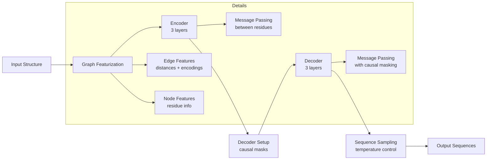
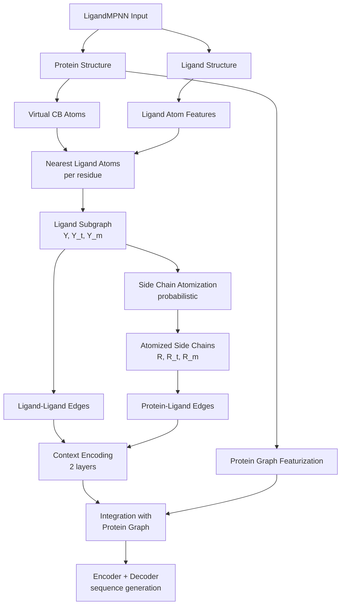
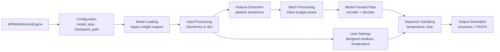
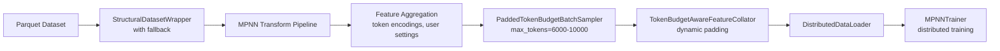
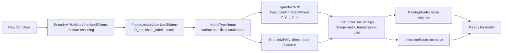

---
slug:11-proteinmpnn-and-ligandmpnn-inverse-folding
blog_type:normal
---


ProteinMPNN 和 LigandMPNN 是用于蛋白质逆向折叠的消息传递神经网络架构，即根据固定的骨架结构设计氨基酸序列的任务。ProteinMPNN 处理仅含蛋白质的系统，而 LigandMPNN 将此能力扩展到蛋白质-配体复合物（小分子、离子、DNA/RNA）。Foundry 中的这一重新实现为多种 MPNN 变体提供了一个统一的框架，并简化了推理和训练流程。


## 模型架构概述

MPNN 架构采用基于图的表示法，其中蛋白质残基作为节点，根据空间邻近性通过边连接。该架构由三个核心组件组成：编码结构信息的图特征化模块、处理输入图的编码器，以及使用因果掩码自回归地生成序列的解码器。

来源：[mpnn.py](models/mpnn/src/mpnn/model/mpnn.py#L19-L233), [graph_embeddings.py](models/mpnn/src/mpnn/model/layers/graph_embeddings.py#L9-L690)

### 核心架构流程



编码器在不包含序列信息的情况下处理完整图，通过消息传递学习结构表示。然后，解码器一次生成一个残基的序列，仅关注先前生成的残基（因果掩码）和编码器输出。此架构在所有 MPNN 变体中共享，主要在特征化层进行特化。

来源：[mpnn.py](models/mpnn/src/mpnn/model/mpnn.py#L252-L333), [message_passing.py](models/mpnn/src/mpnn/model/layers/message_passing.py#L106-L233)

### 消息传递机制

消息传递层实现了核心图神经网络操作。用于编码器的 `EncLayer` 和用于解码器的 `DecLayer` 使用类似的结构，但在注意力模式上有所不同。每一层执行收集操作以聚合来自邻居的信息，应用注意力机制，并更新节点表示。

来源：[message_passing.py](models/mpnn/src/mpnn/model/layers/message_passing.py#L106-L233)

## MPNN 模型变体

该实现提供了六个专门的 MPNN 模型，均继承自通用的 `ProteinMPNN` 基类。每个变体通过专门的特征化和训练数据集针对特定设计场景进行了优化。

来源：[mpnn.py](models/mpnn/src/mpnn/model/mpnn.py#L19-L2263)

| Model | Architecture | Specialization | Nearest Neighbors | Training Data Focus |
|-------|-------------|----------------|-------------------|---------------------|
| **ProteinMPNN** | Base | General protein design | 48 | Diverse PDB structures |
| **LigandMPNN** | Extended | Protein-ligand complexes | 32 | Structures with small molecules/DNA/RNA |
| **SolubleMPNN** | Base | Soluble protein design | 48 | Soluble protein dataset |
| **AntibodyMPNN** | Base | Antibody optimization | 48 | Antibody structures |
| **MembraneMPNN** | Extended | Membrane protein design | 48 | Membrane proteins with environment labels |
| **PSSMMPNN** | Extended | Evolution-aware design | 48 | PSSM profile integration |

来源：[mpnn.py](models/mpnn/src/mpnn/model/mpnn.py#L2133-L2263), [graph_embeddings.py](models/mpnn/src/mpnn/model/layers/graph_embeddings.py#L763-L838)

### ProteinMPNN 基础模型

`ProteinMPNN` 类实现了核心逆向折叠功能。关键超参数包括 `num_encoder_layers` 和 `num_decoder_layers`（默认：各 3 层）、`hidden_dim`（默认：128）和 `num_neighbors`（蛋白质模型默认：48）。该模型使用高斯 RBF 嵌入来编码成对距离，并使用位置编码来处理序列上下文。

来源：[mpnn.py](models/mpnn/src/mpnn/model/mpnn.py#L43-L57), [graph_embeddings.py](models/mpnn/src/mpnn/model/layers/graph_embeddings.py#L381-L481)

### LigandMPNN 扩展

`LigandMPNN` 扩展了基础架构以纳入配体上下文。关键创新在于构建一个由配体原子和可选原子化侧链组成的蛋白质-配体子图。该子图在集成到主蛋白质图之前，通过专用层进行编码。

LigandMPNN 的主要特性：
- **Context atoms**：每个残基最多 25 个最近的配体原子（可通过 `num_context_atoms` 配置）
- **Context encoding**：用于配体子图的 2 个专用编码层
- **Side chain atomization**：基于概率的原子化，以获得更好的几何表示
- **Hybrid representation**：结合了配体和蛋白质-配体边特征

来源：[mpnn.py](models/mpnn/src/mpnn/model/mpnn.py#L2263-L2292), [graph_embeddings.py](models/mpnn/src/mpnn/model/layers/graph_embeddings.py#L865-L2124)



### 专用变体

**MembraneMPNN** 通过 `HAS_NODE_FEATURES` 标志添加了每个残基和全局膜环境标签，实现了对膜嵌入蛋白的上下文感知设计。**PSSMMPNN** 纳入了位置特异性评分矩阵 (PSSM) 特征，以利用进化信息指导序列设计。这两种变体都在不改变核心 MPNN 架构的情况下扩展了基础特征化。

来源：[mpnn.py](models/mpnn/src/mpnn/model/mpnn.py#L2149-L2263), [graph_embeddings.py](models/mpnn/src/mpnn/model/layers/graph_embeddings.py#L763-L838)

## 图特征化

图特征化过程将原子坐标转换为 MPNN 模型所需的图表示。`ProteinFeatures` 基类及其专门的子类使用针对每个变体的不同特征集来处理此转换。

来源：[graph_embeddings.py](models/mpnn/src/mpnn/model/layers/graph_embeddings.py#L9-L690)

### 纯蛋白质特征化

对于仅含蛋白质的模型（ProteinMPNN, SolubleMPNN, AntibodyMPNN），特征化涉及：

1. **Atom selection**：骨架原子 (N, CA, C, O) 和代表性原子 (CA)
2. **Virtual atom construction**：使用加权键从骨架几何结构计算出的虚拟 CB 原子
3. **Distance computation**：代表性原子之间的成对距离
4. **RBF embedding**：距离到固定维度特征的径向基函数编码
5. **K-nearest neighbors**：为每个位置选择 `num_neighbors` 个最近的残基
6. **Edge features**：RBF 嵌入、位置编码和链信息的串联
7. **Node features**：残基类型编码和骨架二面角

来源：[graph_embeddings.py](models/mpnn/src/mpnn/model/layers/graph_embeddings.py#L135-L524)

### 配体感知特征化

LigandMPNN 的 `ProteinFeaturesLigand` 显著扩展了此过程：

1. **Ligand atom collection**：提取所有具有类型信息的配体原子
2. **Per-residue ligand context**：对于每个残基，收集 `num_context_atoms` 个最近的配体原子
3. **Angle features**：计算蛋白质虚拟原子与配体原子之间的角度以获得方向上下文
4. **Side chain atomization**：选定侧链的概率性原子化以获得详细的几何结构
5. **Subgraph construction**：组合的配体 + 原子化侧链原子形成配体子图
6. **Bipartite edges**：捕获交叉相互作用的蛋白质-配体边
7. **Context encoding**：在集成之前对配体子图进行专用编码

来源：[graph_embeddings.py](models/mpnn/src/mpnn/model/layers/graph_embeddings.py#L1285-L2124)

## 推理引擎

`MPNNInferenceEngine` 提供了一个高级接口用于运行 MPNN 推理，处理模型加载、预处理、批处理和输出生成。

来源：[mpnn.py](models/mpnn/src/mpnn/inference_engines/mpnn.py#L37-L133)

### 推理流程



### 配置和加载

推理引擎支持加载遗留权重（来自原始存储库）和重新训练的权重。关键配置参数包括：
- `model_type`："protein_mpnn"、"ligand_mpnn"、"soluble_mpnn" 之一
- `checkpoint_path`：模型权重文件的路径
- `is_legacy_weights`：原始存储库权重的布尔标志（当前公共权重需要）
- `device`：目标计算设备 (CPU/GPU)

来源：[mpnn.py](models/mpnn/src/mpnn/inference_engines/mpnn.py#L40-L91), [README.md](models/mpnn/README.md#L30-L101)

### 模型变体和检查点兼容性

| Model Type | Legacy Weights Required | Default Neighbors | Training Noise (σ) |
|------------|------------------------|-------------------|-------------------|
| protein_mpnn | True | 48 | 0.20 Å |
| ligand_mpnn | True | 32 | 0.10 Å |
| soluble_mpnn | True | 48 | 0.20 Å |

存在多种权重变体，它们在训练期间使用了不同的高斯噪声水平 (σ = 0.02, 0.05, 0.10, 0.20, 0.30 Å)，允许用户选择适合其设计任务噪声容忍度的模型。

来源：[README.md](models/mpnn/README.md#L30-L101)

<CgxTip>
当从公共存储库加载原始的 ProteinMPNN/LigandMPNN 权重时，始终设置 `is_legacy_weights=True`。重新实现保持了兼容性，但需要此标志才能正确映射参数。
</CgxTip>

### 输入格式

推理引擎接受两种输入格式：
1. **AtomArray**：具有设计控制注释的生物结构对象（mask、temperature、bias）
2. **Input dictionary**：直接指定设计参数，绕过 CIF 注释

由于形状限制，当前无法将 `mpnn_bias` 和 `mpnn_pair_bias` 注释保存到 CIF 文件，需要在重新加载时重新创建这些注释。

来源：[mpnn.py](models/mpnn/src/mpnn/inference_engines/mpnn.py#L204-L278), [README.md](models/mpnn/README.md#L128-L137)

### 解码策略

该模型实现了两种解码模式：

**Teacher Forcing**：在训练或评估期间使用，其中提供真实序列。解码器关注真实的先前残基，从而实现序列上的并行计算。

**Auto-regressive**：用于推理，其中逐个 token 生成序列。每个位置仅关注先前生成的残基，确保因果依赖。解码器在每一步从输出分布中采样，并具有可配置的温度。

来源：[mpnn.py](models/mpnn/src/mpnn/model/mpnn.py#L958-L1810)

## 训练基础设施

MPNN 训练流程利用 Foundry 的分布式训练框架，并配备了专门的高效蛋白质结构处理组件。

来源：[train.py](models/mpnn/src/mpnn/train.py#L25-L340), [mpnn_trainer.py](models/mpnn/src/mpnn/trainers/mpnn.py#L21-L194)

### 数据流程

训练流程使用 token 预算方法来高效处理可变长度的蛋白质结构：



关键组件：
- **PaddedTokenBudgetBatchSampler**：将结构分组到批次中，遵守最大 token 预算（LigandMPNN 为 6000，ProteinMPNN 为 10000）
- **TokenBudgetAwareFeatureCollator**：对批处理的特征应用动态填充
- **Feature aggregation transforms**：编码 token，添加用户设置（设计 mask、temperature、bias），并应用训练噪声

来源：[samplers.py](models/mpnn/src/mpnn/samplers/samplers.py#L9-L168), [feature_collator.py](models/mpnn/src/mpnn/collate/feature_collator.py#L187-L236), [mpnn_pipeline.py](models/mpnn/src/mpnn/pipelines/mpnn.py#L59-L163)

### 训练配置

特定于模型的训练参数反映了不同的数据分布和要求：

| Parameter | ProteinMPNN | LigandMPNN |
|-----------|-------------|------------|
| Batch Size (tokens) | 10,000 | 6,000 |
| Training Date Cutoff | 2021-08-02 | 2022-12-16 |
| Structure Noise (σ) | 0.2 Å | 0.1 Å |
| Gradient Clipping | None | 1.0 |

训练使用带有 6000 token 归一化常数的标签平滑负对数似然损失。优化器采用带有预热 (warmup) 的 Noam 学习率调度。

来源：[train.py](models/mpnn/src/mpnn/train.py#L27-L41), [nll_loss.py](models/mpnn/src/mpnn/loss/nll_loss.py#L5-L123)

### 分布式训练

`MPNNTrainer` 类扩展了 `FabricTrainer` 以实现具有分布式支持的训练循环。关键方法包括：
- `training_step()`：前向传递、损失计算和反向传播
- `validation_step()`：使用序列恢复指标进行评估
- 与 Foundry 的检查点管理和回调集成

来源：[mpnn_trainer.py](models/mpnn/src/mpnn/trainers/mpnn.py#L79-L194)

<CgxTip>
Token 预算批处理策略对于训练效率至关重要。ProteinMPNN 和 LigandMPNN 使用不同的预算大小（10,000 vs 6,000），这是由于 LigandMPNN 中配体特征化的额外内存开销。
</CgxTip>

## 转换流程和特征聚合

转换流程通过一系列模块化转换将原始结构转换为模型就绪的特征。

来源：[mpnn_pipeline.py](models/mpnn/src/mpnn/pipelines/mpnn.py#L38-L163)

### 流程阶段



### 特征聚合转换

- **EncodeMPNNNonAtomizedTokens**：使用基于占位率的过滤将残基名称转换为整数 token
- **FeaturizeNonAtomizedTokens**：添加残基索引、链标签和残基 mask
- **FeaturizeAtomizedTokens**：（仅 LigandMPNN）添加配体原子坐标、类型和 mask
- **FeaturizeUserSettings**：应用用户提供的设计约束（mask、temperature、bias、train_structure_noise）

来源：[mpnn_aggregation.py](models/mpnn/src/mpnn/transforms/feature_aggregation/mpnn.py#L14-L151), [user_settings.py](models/mpnn/src/mpnn/transforms/feature_aggregation/user_settings.py#L21-L348)

### 设计控制功能

用户设置能够对设计过程进行精确控制：
- **Design mask**：指定要重新设计位置的二进制 mask
- **Temperature**：控制序列多样性的采样温度
- **MPNN bias**：用于指导设计的每个位置、每个残基类型的 logits
- **MPNN pair bias**：位置之间的成对相互作用偏好
- **Train structure noise**：训练期间添加到坐标的高斯噪声，以提高鲁棒性

来源：[user_settings.py](models/mpnn/src/mpnn/transforms/feature_aggregation/user_settings.py#L139-L348)

## 指标和评估

序列恢复（匹配真实序列的残基百分比）作为 MPNN 模型的主要评估指标。该实现为训练和验证提供了专门的指标。

来源：[sequence_recovery.py](models/mpnn/src/mpnn/metrics/sequence_recovery.py)

## 安装和使用

### 安装

```bash
git clone https://github.com/RosettaCommons/rc-foundry.git \
  && cd rc-foundry \
  && uv python install 3.12 \
  && uv venv --python 3.12 \
  && source .venv/bin/activate \
  && uv pip install -e ".[mpnn]"
```

来源：[README.md](models/mpnn/README.md#L25-L33)

### 下载权重

从原始存储库下载遗留权重：

```bash
# ProteinMPNN (48 neighbors, σ = 0.20 Å)
wget https://files.ipd.uw.edu/pub/ligandmpnn/proteinmpnn_v_48_020.pt

# LigandMPNN (32 neighbors, σ = 0.10 Å, 25 context atoms)
wget https://files.ipd.uw.edu/pub/ligandmpnn/ligandmpnn_v_32_010_25.pt

# SolubleMPNN (48 neighbors, σ = 0.20 Å)
wget https://files.ipd.uw.edu/pub/ligandmpnn/solublempnn_v_48_020.pt
```

来源：[README.md](models/mpnn/README.md#L35-L101)

## 后续步骤

若要更深入地了解架构，请探索 [Inference Engine Architecture](6-inference-engine-architecture) 以查看 MPNN 如何与 Foundry 的更广泛基础设施集成，或参阅 [Architecture and Design Philosophy](5-architecture-and-design-philosophy) 以了解系统级设计原理。若要扩展 MPNN 功能，请参阅 [Model-Specific Configuration Structure](22-model-specific-configuration-structure) 和 [Adding New Models to Foundry](21-adding-new-models-to-foundry)。