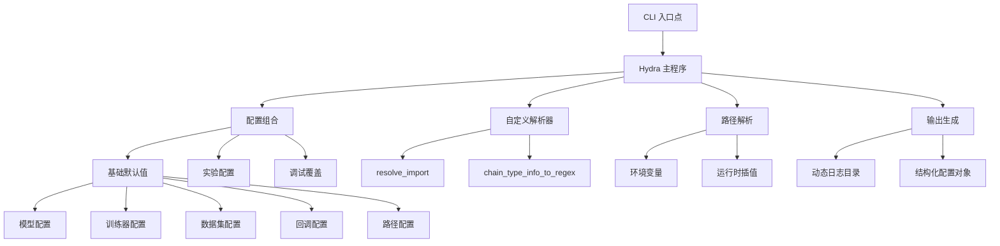
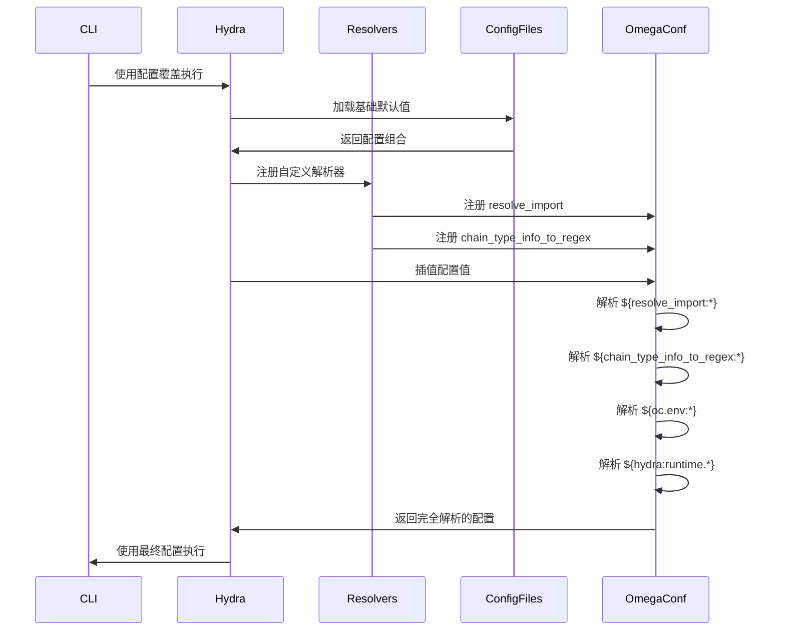

---
slug:12-hydra-configuration-system
blog_type:normal
---


Hydra 配置系统提供了一个灵活的、分层的框架，用于管理 Foundry 生物分子结构预测模型的训练和推理参数。通过利用 Hydra 的组合能力和 OmegaConf 强大的插值功能，Foundry 能够无缝配置复杂的机器学习工作流程，同时保持可重复性和模块化。

## 架构概述

Foundry 的配置架构遵循模块化、可组合的设计，其中基础配置定义默认参数，实验特定配置有选择地覆盖它们。该系统集成了自定义解析器用于动态计算，以及用于分布式计算环境的环境感知路径管理。



## 自定义解析器

Foundry 通过在 `src/foundry/hydra/resolvers.py` 中注册的自定义 OmegaConf 解析器扩展了 Hydra 的功能。这些解析器支持直接在配置文件中进行动态计算和类型安全的导入。

### 导入解析器

`resolve_import` 解析器简化了运行时模块和属性的导入，使配置文件能够引用 Python 类和函数，而无需硬编码依赖关系。这种模式将配置定义与实现细节解耦。

来源：[resolvers.py](/src/foundry/hydra/resolvers.py#L28-L48)

该解析器接受模块路径和可选的属性路径，通过点号表示法导航嵌套属性。例如，`${resolve_import:torch.optim,Adam}` 会动态导入 Adam 优化器类。

### 链类型解析器

`chain_type_info_to_regex` 解析器将 `ChainType` 和 `ChainTypeInfo` 枚举转换为正则表达式模式，主要用于在训练和验证期间按分子链类型过滤数据集。

来源：[resolvers.py](/src/foundry/hydra/resolvers.py#L51-L77)

该解析器接受多个枚举属性并构造一个交替正则表达式模式。例如，`${chain_type_info_to_regex:PROTEINS,NUCLEIC_ACIDS}` 生成一个匹配蛋白质和核酸链类型的正则表达式，从而在配置表达式中实现灵活的数据集过滤，例如：

```yaml
filters:
  - "pn_unit_1_type.astype('str').str.match('${chain_type_info_to_regex:PROTEINS}')"
```

<CgxTip>自定义解析器使用 `@run_once` 装饰器在每个进程中注册一次，防止在多个进程可能导入配置模块的分布式训练场景中出现重复注册问题。</CgxTip>

## 配置层次结构

Foundry 在多个模型（RFdiffusion3、RosettaFold3、ProteinMPNN）之间按层次组织配置，每个模型在 `models/<model>/configs/` 下维护其配置目录结构。

### 基础配置结构

配置层次结构遵循 Hydra 的默认列表模式，其中较高优先级的配置会覆盖较低优先级的配置。对于 RosettaFold3 训练：

```yaml
defaults:
  - callbacks: default
  - logger: csv
  - trainer: ???
  - paths: default
  - datasets: ???
  - dataloader: default
  - hydra: default
  - model: ???
  - _self_
  - experiment: ???
  - debug: null
```

来源：[train.yaml](/models/rf3/configs/train.yaml#L6-L19)

`???` 占位符模式强制要求指定配置，防止意外遗漏关键参数。`_self_` 指令确保本地配置值可以在被实验配置覆盖之前覆盖默认值。

### 特定于模型的组织结构

每个模型都实现了针对其特定架构定制的配置层次结构：

**RosettaFold3** ([rf3/configs](/models/rf3/configs)):
- `model/`：网络架构、优化器、调度器
- `trainer/`：训练策略、损失函数、指标
- `datasets/`：训练/验证数据集定义
- `inference_engine/`：推理参数和检查点管理
- `callbacks/`：训练回调和日志记录

**RFdiffusion3** ([rfd3/configs](/models/rfd3/configs)):
- `model/`：扩散网络组件、采样器
- `datasets/conditions/`：条件策略（DNA、PPI、无条件）
- `trainer/`：基于 Fabric 的训练配置
- `inference_engine/`：设计流水线配置

### 实验配置

实验配置对生产训练运行的特定超参数组合进行版本控制。这些文件结合了基础模型配置与数据集规范和训练参数：

```yaml
defaults:
  - pretrained/rf3
  - override /datasets: pdb_only

name: quick-rf3
tags:
  - quick

trainer:
  limit_train_batches: 4
  limit_val_batches: 4
```

来源：[quick-rf3.yaml](/models/rf3/configs/experiment/quick-rf3.yaml#L4-L14)

`override /datasets:` 语法演示了 Hydra 的包覆盖功能，可以有选择地替换整个配置组。

## 路径管理系统

Foundry 实现了环境感知的路径解析，结合了 Hydra 的运行时插值与环境变量引用。该设计支持在本地开发、HPC 集群和云环境之间无缝切换。

### 路径配置层次结构

路径管理系统遵循三层结构：

| 层级 | 目的 | 示例 |
|------|---------|---------|
| **环境变量** | 系统特定路径 | `PROJECT_ROOT`, `USER` |
| **Hydra 运行时变量** | 动态运行特定路径 | `${hydra:runtime.output_dir}` |
| **配置默认值** | 应用程序级路径 | `log_dir`, `data_dir` |

来源：[default.yaml](/models/rf3/configs/paths/default.yaml#L6-L21)

根路径配置从 `PROJECT_ROOT` 环境变量中读取，该变量在项目初始化期间由 `rootutils` 自动设置：

```yaml
root_dir: ${oc.env:PROJECT_ROOT}
log_dir: /net/scratch/${oc.env:USER}/training/logs
output_dir: ${hydra:runtime.output_dir}
work_dir: ${hydra:runtime.cwd}
```

### 动态输出目录生成

Hydra 使用时间戳和 SLURM 作业 ID 插值为每次训练运行生成唯一的输出目录：

```yaml
run:
  dir: ${paths.log_dir}/${task_name}/${name}/${now:%Y-%m-%d}_${now:%H-%M}_JOB_${oc.env:SLURM_JOB_ID,default}
```

来源：[default.yaml](/models/rf3/configs/hydra/default.yaml#L8-L9)

当不在 SLURM 上运行时，`${oc.env:SLURM_JOB_ID,default}` 模式默认为 "default"，从而实现无缝的本地开发。

<CgxTip>日志配置集成了 [Hydra PR #2242](https://github.com/facebookresearch/hydra/pull/2242) 的修复，指定相对于运行时输出目录的日志文件路径，而不是绝对路径。</CgxTip>

## 配置组合模式

Foundry 采用了几种高级 Hydra 模式来实现灵活的配置组合。

### 配置组默认值与包插值

模型配置演示了包插值语法，允许从多个配置文件进行组合：

```yaml
defaults:
  - optimizers/adam@optimizer
  - schedulers/af3@lr_scheduler
  - components/ema@ema
  - components/rf3_net@net
  - _self_
```

来源：[rf3.yaml](/models/rf3/configs/model/rf3.yaml#L1-L8)

`@` 语法将加载的配置放在特定键（`optimizer`、`lr_scheduler`、`ema`、`net`）下，而不是在顶层合并。这种模式可以防止键冲突并保持分层组织。

### 目标实例化模式

配置文件使用 `_target_` 字段指定 Python 类实例化目标：

```yaml
_target_: rf3.inference_engines.rf3.RF3InferenceEngine

ckpt_path: rf3_foundry_01_24_latest.ckpt
n_recycles: 10
diffusion_batch_size: 5
```

来源：[rf3.yaml](/models/rf3/configs/inference_engine/rf3.yaml#L4-L7)

Hydra 的结构化配置系统自动实例化指定的类，并将剩余字段作为构造函数参数传递。这种模式实现了配置驱动的依赖注入。

### 跨模型配置共享

RFdiffusion3 演示了使用 `@package _global_` 和搜索路径配置的更紧凑的配置结构：

```yaml
# @package _global_
hydra:
  searchpath:
    - pkg://configs

defaults:
  - model: rfd3_base
  - trainer: rfd3_base
  - datasets: design_base
```

来源：[train.yaml](/models/rfd3/configs/train.yaml#L1-L10)

`@package _global_` 指令在根级别而不是在包键下合并配置。`searchpath` 配置支持从共享包加载配置。

## 跨模型配置对比

| 方面 | RosettaFold3 | RFdiffusion3 | ProteinMPNN |
|--------|-------------|--------------|-------------|
| **训练框架** | Lightning | Fabric | Lightning |
| **默认日志记录器** | CSV | Default | Default |
| **配置包** | 按组合并 | 全局合并 | 按组合并 |
| **数据集策略** | 多重拆分（PDB、蒸馏） | 基于条件的设计 | 基于结构 |
| **检查点模式** | `.ckpt` 扩展名 | `.ckpt` 扩展名 | `.pt` 扩展名 |
| **推理引擎** | RF3InferenceEngine | RFD3Engine | 直接模型推理 |

来源：[rf3/train.yaml](/models/rf3/configs/train.yaml#L1-L43), [rfd3/train.yaml](/models/rfd3/configs/train.yaml#L1-L28)

## 运行时行为和执行流程

当 Foundry 执行训练或推理命令时，Hydra 会编排以下序列：



运行时输出目录结构展示了此解析过程：

```
/net/scratch/<USER>/training/logs/train/quick-rf3/2025-01-15_14-30_JOB_12345/
├── .hydra/
│   ├── config.yaml           # 完整的组合配置
│   ├── hydra.yaml            # Hydra 配置
│   └── overrides.yaml        # 应用的 CLI 覆盖
├── checkpoints/
│   └── epoch_1.ckpt
└── experiment.log
```

## 高级配置技术

### 使用调试覆盖的条件配置

调试配置模式支持在不修改生产配置的情况下进行快速实验：

```yaml
defaults:
  - _self_
  - debug: null

# 生产值
trainer:
  max_epochs: 10_000
  limit_train_batches: null
```

来源：[train.yaml](/models/rf3/configs/train.yaml#L20-L21)

通过 CLI 覆盖设置 `debug=dev.yaml` 会加载覆盖生产参数的调试配置，从而实现快速测试循环。

### 使用自定义解析器过滤数据集

链类型解析器支持复杂的数据集过滤表达式：

```yaml
datasets:
  val:
    af3_validation:
      dataset:
        dataset:
          filters:
            - "n_tokens_total < 500"
            - "interfaces_to_score.str.contains('protein-ligand')"
            - "pn_unit_1_type.astype('str').str.match('${chain_type_info_to_regex:PROTEINS}')"
```

来源：[quick-rf3.yaml](/models/rf3/configs/experiment/quick-rf3.yaml#L40-L47)

此模式展示了结合 Hydra 插值与自定义解析器和 pandas 字符串操作的强大功能。

## 与 Foundry 组件的集成

配置系统通过几种关键机制与 Foundry 的核心基础架构集成：

### 训练器配置集成

训练器配置通过插值引用数据集和模型配置：

```yaml
_target_: rf3.trainers.rf3.RF3Trainer
n_recycles_train: ${datasets.n_recycles_train}
output_dir: ${paths.output_dir}
```

来源：[rf3.yaml](/models/rf3/configs/trainer/rf3.yaml#L4-L8)

这确保训练器参数与数据集规范保持同步。

### 回调配置

回调配置从单独的文件组合多种回调类型：

```yaml
defaults:
  - train_logging
  - metrics_logging
  - dump_validation_structures
  - _self_
```

来源：[default.yaml](/models/rf3/configs/callbacks/default.yaml#L1-L5)

每个子配置定义一个回调类及其参数，由 Hydra 实例化并传递给训练器。

### 指标配置集成

指标配置使用目标实例化进行灵活的指标选择：

```yaml
by_type_lddt:
  _target_: rf3.metrics.lddt.ByTypeLDDT
all_atom_lddt:
  _target_: rf3.metrics.lddt.AllAtomLDDT
distogram:
  _target_: rf3.metrics.distogram.DistogramLoss
```

来源：[structure_prediction.yaml](/models/rf3/configs/trainer/metrics/structure_prediction.yaml#L1-L8)

此模式支持指标组合，而无需修改训练器代码。

## 最佳实践和通用模式

### 必填字段强制

使用 `???` 占位符模式标记必须在实验配置中指定的字段：

```yaml
project: ???
trainer: ???
datasets: ???
```

来源：[train.yaml](/models/rf3/configs/train.yaml#L28-L30)

此模式可防止因未指定关键参数而导致的静默失败。

### 配置覆盖

使用覆盖语法进行选择性配置替换：

```yaml
defaults:
  - pretrained/rf3
  - override /datasets: pdb_only
```

来源：[quick-rf3.yaml](/models/rf3/configs/experiment/quick-rf3.yaml#L5-L6)

这可以交换整个配置组，同时保留其他默认值。

### 特定于环境的默认值

通过文件选择提供特定于环境的配置：

```yaml
defaults:
  - hydra: default          # 生产日志记录
  # - hydra: no_logging      # 用于无日志推理
```

来源：[base.yaml](/models/rf3/configs/inference_engine/base.yaml#L3-L4)

推理引擎基础配置覆盖为 `no_logging`，用于对性能要求高的推理运行。

## 后续步骤

了解 Hydra 配置系统为针对特定用例定制 Foundry 奠定了基础。继续探索：

- **[动态配置的自定义解析器](13-custom-resolvers-for-dynamic-configs)**：深入了解解析器实现和扩展
- **[数据集实例化和采样](14-dataset-instantiation-and-sampling)**：配置如何驱动数据集加载和采样
- **[特定于模型的配置结构](22-model-specific-configuration-structure)**：RF3 和 RFD3 配置模式的详细细分
- **[使用 FabricTrainer 的训练工具](7-training-harness-with-fabrictrainer)**：配置如何与训练基础架构集成

配置系统的模块化设计支持快速实验，同时在开发、测试和生产环境中保持可重复性。