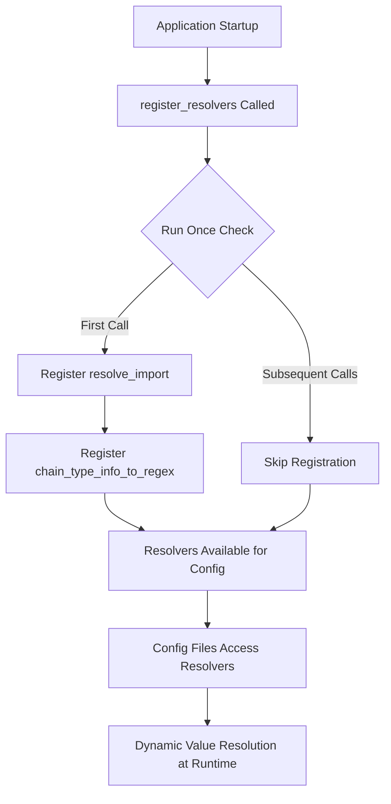

---
slug:13-custom-resolvers-for-dynamic-configs
blog_type:normal
---


自定义解析器通过在运行时启用动态值解析来扩展 Hydra 的配置系统。这些解析器允许配置文件引用外部代码、动态转换值以及计算衍生属性，而无需修改底层配置。Foundry 实现了自定义解析器，以弥合静态 YAML 配置与动态 Python 运行时行为之间的差距，从而支持能够适应不同用例和环境的复杂配置模式。

## 解析器架构概述

Foundry 的自定义解析器系统与 OmegaConf 的解析器注册机制集成，允许在配置文件中进行动态插值。解析器架构采用集中式注册模式，即所有解析器在应用程序启动期间通过受保护的注册函数注册一次。



注册过程使用了来自 [`src/foundry/common.py`](src/foundry/common.py#L8-L22) 的装饰器模式，确保幂等执行，防止在多次导入时重复注册。对于基于 Hydra 的应用程序，这种模式至关重要，因为在分布式训练期间，同一模块可能会在不同子进程中多次导入。

## 可用的自定义解析器

### `resolve_import`

`resolve_import` 解析器支持直接从配置文件动态导入模块和属性。该解析器对于指定应在运行时实例化的类、函数或常量特别有用，而无需在应用程序代码中硬编码其导入路径。

**解析器签名：**
```yaml
${resolve_import:module_path,attribute_path}
```

**参数：**

| Parameter | Type | Required | Description |
|-----------|------|----------|-------------|
| `module_path` | string | Yes | Python 模块的点分路径（例如 `torch.nn`、`foundry.trainers`） |
| `attribute_path` | string | No | 模块内属性的点分路径（例如 `Linear`、`FabricTrainer`） |

**使用模式：**

1. **简单模块导入**（返回模块对象）：
```yaml
module: ${resolve_import:torch.optim}
```

2. **属性导入**（返回特定的类或函数）：
```yaml
optimizer_class: ${resolve_import:torch.optim,Adam}
```

3. **嵌套属性访问**（通过多级访问属性）：
```yaml
custom_transform: ${resolve_import:atomworks.transforms,processing.Normalize}
```

此解析器常用于 [`模型配置文件`](models/rfd3/configs/model/rfd3_base.yaml#L1-L9) 中，其中需要动态指定模型类，从而允许使用相同的配置结构实例化不同的模型架构。

### `chain_type_info_to_regex`

`chain_type_info_to_regex` 解析器将 ChainType 和 ChainTypeInfo 枚举值转换为正则表达式模式，用于数据集过滤。此解析器专为结构生物学工作流程设计，在这些流程中，需要在训练或验证之前按分子链类型（蛋白质、核酸、配体）过滤数据集。

**解析器签名：**
```yaml
${chain_type_info_to_regex:type1,type2,...}
```

**参数：**

| Parameter | Type | Description |
|-----------|------|-------------|
| `*args` | variable string arguments | 一个或多个 ChainType 或 ChainTypeInfo 枚举成员名称 |

**支持的枚举来源：**
- **ChainType**：单个链类型（例如 `PROTEIN`、`DNA`、`RNA`、`LIGAND`）
- **ChainTypeInfo**：链类型的预定义分组（例如 `PROTEINS`、`NUCLEIC_ACIDS`、`SMALL_MOLECULES`）

**使用示例：**

1. **单个链类型过滤器：**
```yaml
filter_pattern: ${chain_type_info_to_regex:PROTEIN}
# 返回: "PROTEIN"
```

2. **多个链类型：**
```yaml
filter_pattern: ${chain_type_info_to_regex:PROTEIN,DNA,RNA}
# 返回: "PROTEIN|DNA|RNA"
```

3. **使用预定义分组：**
```yaml
filter_pattern: ${chain_type_info_to_regex:PROTEINS,NUCLEIC_ACIDS}
# 返回: "PROTEIN|DNA|RNA|DNA|RNA" (展开并组合)
```

4. **混合类型和分组：**
```yaml
filter_pattern: ${chain_type_info_to_regex:PROTEINS,LIGAND}
# 返回: "PROTEIN|DNA|RNA|LIGAND"
```

此解析器通常用于 [`数据集配置文件`](models/rfd3/configs/datasets/train/rfd3_monomer_distillation.yaml#L1-L39) 中的过滤操作，特别是在 Pandas 风格的数据集过滤器中：

```yaml
dataset_filter: "pn_unit_1_type.astype('str').str.match('${chain_type_info_to_regex:PROTEINS}')"
```

<CgxTip>
该解析器通过连接所有解析后的值自动处理正则表达式交替运算符（`|`），从而消除了在配置文件中手动进行字符串连接的需要。这为复杂的过滤逻辑提供了一个简洁的声明式接口。
</CgxTip>

## 解析器注册机制

自定义解析器的注册集中在 [`src/foundry/hydra/resolvers.py`](src/foundry/hydra/resolvers.py#L11-L21) 中的 `register_resolvers` 函数内：

```python
@run_once
def register_resolvers():
    resolvers = {
        "resolve_import": resolve_import,
        "chain_type_info_to_regex": chain_type_info_to_regex,
    }
    
    for name, resolver in resolvers.items():
        OmegaConf.register_new_resolver(name, resolver)
```

**关键设计模式：**

| Pattern | Purpose | Implementation |
|---------|---------|----------------|
| **Guarded Registration** | 防止跨导入重复注册 | 来自 [`src/foundry/common.py`](src/foundry/common.py#L8-L22) 的 `@run_once` 装饰器 |
| **Centralized Registration** | 可用解析器的单一事实来源 | 基于字典的解析器映射 |
| **OmegaConf Integration** | 利用标准的 Hydra 解析器基础设施 | `OmegaConf.register_new_resolver` |

`@run_once` 装饰器通过检查被包装函数上的 `_has_run` 属性来确保线程安全、幂等的执行。这在 Hydra 的多进程环境中尤为重要，因为配置组合可能会在并行子进程中发生。

## 解析器实现细节

### `resolve_import` 实现

来自 [`src/foundry/hydra/resolvers.py`](src/foundry/hydra/resolvers.py#L24-L45) 的解析器实现处理简单的模块导入和嵌套属性访问：

```python
def resolve_import(module_path: str, attribute_path: str = None) -> Any:
    module = importlib.import_module(module_path)
    if attribute_path is not None:
        attributes = attribute_path.split(".")
        attr = module
        for attr_name in attributes:
            attr = getattr(attr, attr_name)
        return attr
    return module
```

该实现使用 Python 的 `importlib` 进行动态导入，并使用 `getattr` 迭代解析嵌套属性。这种方法提供了访问深层嵌套类层次的灵活性，同时通过标准 Python 导入机制保持错误传播。

### `chain_type_info_to_regex` 实现

来自 [`src/foundry/hydra/resolvers.py`](src/foundry/hydra/resolvers.py#L48-L78) 的解析器实现根据 `atomworks.enums` 模块验证输入并构造正则表达式模式：

```python
def chain_type_info_to_regex(*args) -> Any:
    regex_str = ""
    for arg in args:
        if hasattr(ChainType, arg):
            regex_str += f"{getattr(ChainType, arg).value}|"
        elif hasattr(ChainTypeInfo, arg):
            chain_types_list = getattr(ChainTypeInfo, arg)
            for ct in chain_types_list:
                regex_str += f"{ct.value}|"
        else:
            raise ValueError(
                f"Attribute not found for ChainType or ChainTypeInfo: {arg}."
            )
    return regex_str[:-1]  # Remove trailing '|'
```

该实现包括运行时验证，以便尽早发现拼写错误或无效的枚举引用，从而在配置解析时而不是在数据集加载期间提供清晰的错误消息。

## 与 Hydra 配置系统的集成

自定义解析器与 Hydra 的配置组合模型深度集成，支持在整个配置层次结构中进行动态解析。解析器可以在 Hydra 配置搜索路径内的任何 YAML 文件中使用，包括：

- 模型配置文件 ([`model/rfd3_base.yaml`](models/rfd3/configs/model/rfd3_base.yaml#L1-L9))
- 数据集配置文件 ([`datasets/train/rfd3_monomer_distillation.yaml`](models/rfd3/configs/datasets/train/rfd3_monomer_distillation.yaml#L1-L39))
- 推理引擎配置 ([`inference_engine/rfdiffusion3.yaml`](models/rfd3/configs/inference_engine/rfdiffusion3.yaml#L1-L66))
- 训练流水线配置 ([`train.yaml`](models/rfd3/configs/train.yaml#L1-L28))

**解析器解析顺序：**

1. **配置组合**：Hydra 加载并组合 YAML 文件
2. **默认值合并**：根据 Hydra 的覆盖规则合并默认值
3. **解析器应用**：评估所有解析器表达式
4. **最终配置**：解析后的配置传递给应用程序

此顺序确保解析器可以访问完全组合的配置层次结构，允许它们引用在其他配置文件中定义的值或通过命令行覆盖定义的值。

## 实际应用

### 动态模型实例化

`resolve_import` 解析器支持配置驱动的模型选择，允许相同的训练流水线实例化不同的模型架构：

```yaml
# 在模型配置中
model:
  _target_: ${resolve_import:foundry.models,RFD3Model}
  backbone_config:
    hidden_dim: 512
    num_layers: 12
```

### 数据集过滤

`chain_type_info_to_regex` 解析器为多模态结构数据集提供声明式数据集过滤：

```yaml
# 在数据集配置中
dataset:
  filter_expression: "chain_type.match('${chain_type_info_to_regex:PROTEINS,SMALL_MOLECULES}')"
```

### 特定环境的配置

解析器通过导入特定环境的模块支持环境感知配置：

```yaml
# 在推理配置中
device_module: ${resolve_import:torch.cuda,${resolve_import:os,environ}.get('DEVICE_MODULE')}
```

<CgxTip>
组合多个解析器时，请考虑性能影响。解析器表达式在配置组合时进行评估，因此复杂的嵌套解析器调用可能会增加启动时间。对于对性能敏感的应用程序，请预先计算值或使用更简单的配置结构。
</CgxTip>

## 错误处理和调试

自定义解析器会传播错误，并包含有关哪个解析器失败以及提供了哪些参数的上下文信息。常见的错误场景包括：

**导入错误：**
```python
ModuleNotFoundError: No module named 'nonexistent.module'
# 解决方案：验证模块路径是否已安装且正确
```

**属性错误：**
```python
AttributeError: module 'torch.optim' has no attribute 'NonExistentClass'
# 解决方案：验证 attribute_path 是否正确且属性是否存在
```

**枚举验证错误：**
```python
ValueError: Attribute not found for ChainType or ChainTypeInfo: INVALID_TYPE
# 解决方案：验证枚举名称是否存在于 atomworks.enums 中
```

要调试解析器问题，请启用 Hydra 的详细模式以查看配置组合过程和解析器评估步骤。

## 最佳实践

1. **使用描述性名称**：创建解析器别名或分组链类型时，请选择在配置上下文中能清楚表明其用途的名称。

2. **记录解析器依赖项**：如果解析器依赖于外部包（如 `atomworks`），请确保这些依赖项已记录并安装在目标环境中。

3. **测试解析器表达式**：在将解析器表达式合并到复杂的配置层次结构之前，请先单独验证它们。

4. **考虑解析器性能**：对于在配置组合期间频繁调用的解析器，请确保实现高效，并避免不必要的计算。

5. **尽早验证**：使用执行输入验证的解析器实现，以便在流水线早期而不是在运行时执行期间捕获配置错误。

## 扩展解析器系统

要向 Foundry 添加新的自定义解析器：

1. **实现解析器函数**：在 [`src/foundry/hydra/resolvers.py`](src/foundry/hydra/resolvers.py#L1-L78) 中创建一个函数，该函数接受必要的参数并返回解析后的值。

2. **注册解析器**：将新解析器添加到 [`register_resolvers()`](src/foundry/hydra/resolvers.py#L11-L21) 中的 `resolvers` 字典：

```python
@run_once
def register_resolvers():
    resolvers = {
        "resolve_import": resolve_import,
        "chain_type_info_to_regex": chain_type_info_to_regex,
        "your_new_resolver": your_new_resolver_function,
    }
    for name, resolver in resolvers.items():
        OmegaConf.register_new_resolver(name, resolver)
```

3. **测试解析器**：通过使用示例配置文件进行测试，确保解析器与 Hydra 的配置组合系统正常工作。

4. **记录解析器**：提供有关解析器用途、签名、参数和使用示例的清晰文档。

## 后续步骤

自定义解析器是动态配置的强大工具，但它们只是 Foundry 配置生态系统的一个组成部分。要加深你的理解：

- 探索更广泛的 [Hydra 配置系统](12-hydra-configuration-system)，以了解解析器如何融入整体配置组合模型
- 查看 [数据集实例化和采样](14-dataset-instantiation-and-sampling)，了解 `chain_type_info_to_regex` 如何在实际中用于数据集过滤
- 研究 [特定于模型的配置结构](22-model-specific-configuration-structure)，了解 `resolve_import` 如何实现灵活的模型实例化

这些相互关联的主题全面展示了 Foundry 的配置系统如何在不同的域和用例中实现灵活、可重现的工作流程。