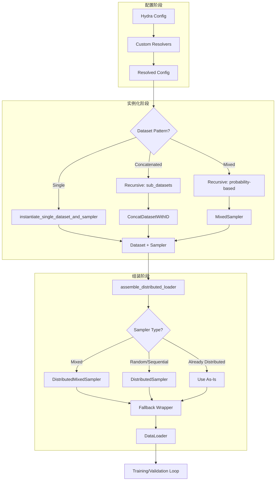

---
slug:14-dataset-instantiation-and-sampling
blog_type:normal
---


本页面介绍了 Foundry 灵活的数据集实例化和采样系统，该系统提供了一个强大且可配置的框架，用于组装训练和验证数据管道。该系统通过基于 Hydra 的配置支持多种数据集组合策略、分布式训练、回退机制以及高级采样技术。

## 架构概览

数据集实例化系统作为一个分层管道运行，将声明式配置转换为功能性的 PyTorch 数据加载器。该架构遵循三阶段模式：配置解析、递归实例化和分布式加载器组装。

来源：[datasets.py](src/foundry/utils/datasets.py#L1-L50), [resolvers.py](src/foundry/hydra/resolvers.py#L1-L25)



## 配置解析层

配置层利用 Hydra 的可扩展解析器系统来实现动态导入和数据集过滤操作。自定义解析器在模块初始化时注册，并在配置生命周期的整个过程中可用。

来源：[resolvers.py](src/foundry/hydra/resolvers.py#L17-L25), [datasets.py](src/foundry/utils/datasets.py#L40-L42)

`register_resolvers()` 函数注册了两个自定义解析器，用于扩展 Hydra 的配置功能：

```python
@run_once
def register_resolvers():
    resolvers = {
        "resolve_import": resolve_import,
        "chain_type_info_to_regex": chain_type_info_to_regex,
    }
    for name, resolver in resolvers.items():
        OmegaConf.register_new_resolver(name, resolver)
```

`chain_type_info_to_regex` 解析器对于数据集过滤特别有用，它将 ChainType 枚举转换为正则表达式模式，用于 DataFrame 过滤操作。例如，你可以使用以下方式过滤数据集以仅包含蛋白质链：

来源：[resolvers.py](src/foundry/hydra/resolvers.py#L51-L78)

```yaml
filters:
  - "pn_unit_1_type.astype('str').str.match('${chain_type_info_to_regex:PROTEINS}')"
```

## 递归数据集实例化

核心实例化逻辑支持三种不同的数据集组合模式，由配置结构决定。这种灵活性允许在来自不同数据源的数据上进行训练，同时保持一致的采样语义。

来源：[datasets.py](src/foundry/utils/datasets.py#L128-L221)

### 单数据集模式

基础情况实例化一个单独的数据集及其关联的采样器。系统支持三种采样器实例化策略：

来源：[datasets.py](src/foundry/utils/datasets.py#L88-L127)

| 策略 | 配置 | 结果 |
|----------|--------------|--------|
| **加权采样** | 存在 `weights` 键 | 带有计算权重的 `WeightedRandomSampler` |
| **自定义采样器** | 存在 `sampler` 键 | 用户指定的采样器类 |
| **均匀默认** | 两者都不存在 | 带有均匀权重的 `WeightedRandomSampler` |

实现处理采样器选择逻辑：

```python
if "weights" in cfg and "sampler" not in cfg:
    weights = hydra.utils.instantiate(cfg.weights, dataset_df=dataset.data)
    sampler = WeightedRandomSampler(
        weights=weights,
        num_samples=len(dataset),
        replacement=True,
    )
elif "sampler" in cfg and "weights" not in cfg:
    sampler = hydra.utils.instantiate(cfg.sampler)
else:
    sampler = WeightedRandomSampler(
        weights=torch.ones(len(dataset)),
        num_samples=len(dataset),
        replacement=True,
    )
```

### 拼接子数据集模式

此模式将多个子数据集合并为一个统一的数据集，同时保留权重信息。权重按数据集顺序拼接，从而能够在组合数据集内对采样比例进行细粒度控制。

来源：[datasets.py](src/foundry/utils/datasets.py#L152-L175)

<CgxTip>
拼接结果中的权重顺序必须与 `ConcatDatasetWithID` 中数据集的顺序匹配。这是正确采样行为的关键不变量。

</CgxTip>

用于 RFdiffusion3 训练的配置示例：

来源：[design_base.yaml](models/rfd3/configs/datasets/design_base.yaml#L5-L12)

```yaml
defaults:
  - train/pdb/rfd3_train_interface@train.pdb.sub_datasets.interface
  - train/pdb/rfd3_train_pn_unit@train.pdb.sub_datasets.pn_unit
```

实现递归实例化每个子数据集，然后组合它们：

```python
datasets_info = []
for sub_dataset_name, sub_dataset_cfg in cfg.sub_datasets.items():
    datasets_info.append(
        recursively_instantiate_datasets_and_samplers(
            sub_dataset_cfg, name=sub_dataset_name
        )
    )

concatenated_dataset = ConcatDatasetWithID(
    datasets=[info["dataset"] for info in datasets_info]
)
concatenated_weights = torch.cat(
    [info["sampler"].weights for info in datasets_info]
)
```

### 混合采样模式

此模式根据指定的概率从多个独立数据集中进行采样。每个数据集必须定义一个 `probability` 键，系统在实例化之前会验证概率之和为 1.0。

来源：[datasets.py](src/foundry/utils/datasets.py#L176-L221)

来自 RosettaFold3 训练配置的示例：

来源：[pdb_and_distillation.yaml](models/rf3/configs/datasets/pdb_and_distillation.yaml#L14-L25)

```yaml
train: 
  pdb:
    probability: 0.50
  monomer_distillation:
    probability: 0.46
  na_complex_distillation:
    probability: 0.02
  disorder_distillation:
    probability: 0.02
```

实现验证概率总和并创建 `MixedSampler`：

```python
assert (
    abs(1 - sum(dataset_info["probability"] for dataset_info in datasets_info))
    < 1e-5
), "Sum of probabilities must be 1.0"

composed_train_dataset = ConcatDatasetWithID(
    datasets=[dataset["dataset"] for dataset in datasets_info]
)
composed_train_sampler = MixedSampler(datasets_info=datasets_info, shuffle=True)
```

## 分布式加载器组装

组装阶段将实例化的数据集和采样器转换为支持分布式的数据加载器。这涉及基于采样器类型和训练环境的条件采样器转换。

来源：[datasets.py](src/foundry/utils/datasets.py#L222-L326)

### 采样器转换逻辑

`assemble_distributed_loader()` 函数根据采样器类型应用不同的转换策略：

来源：[datasets.py](src/foundry/utils/datasets.py#L240-L279)

| 输入采样器类型 | 转换策略 | 必需参数 |
|-------------------|---------------------|---------------------|
| `MixedSampler` | `DistributedMixedSampler` | `rank`, `world_size`, `n_examples_per_epoch` |
| `RandomSampler`/`SequentialSampler` | `DistributedSampler` | `rank`, `world_size` |
| `DistributedSampler`/`DistributedMixedSampler` | 原样使用 | 无 |

转换逻辑确保数据在 GPU 之间正确分布：

```python
if isinstance(sampler, MixedSampler):
    sampler = DistributedMixedSampler(
        datasets_info=sampler.datasets_info,
        num_replicas=world_size,
        rank=rank,
        n_examples_per_epoch=n_examples_per_epoch,
        shuffle=shuffle,
        drop_last=drop_last,
    )
elif isinstance(sampler, (RandomSampler, SequentialSampler)):
    sampler = DistributedSampler(
        dataset=dataset,
        num_replicas=world_size,
        rank=rank,
        shuffle=shuffle,
        drop_last=drop_last,
    )
```

### 回退机制

系统为数据加载失败实现了强大的回退机制。配置后，数据集和采样器将使用回退包装器进行包装，该包装器会使用回退数据集自动重试失败的加载。

来源：[datasets.py](src/foundry/utils/datasets.py#L43-L87), [datasets.py](src/foundry/utils/datasets.py#L280-L295)

```python
if (
    "n_fallback_retries" in loader_cfg
    and loader_cfg.n_fallback_retries > 0
    and sampler is not None
):
    dataset, sampler = wrap_dataset_and_sampler_with_fallbacks(
        dataset_to_be_wrapped=dataset,
        sampler_to_be_wrapped=sampler,
        dataset_to_fallback_to=dataset,
        sampler_to_fallback_to=sampler,
        n_fallback_retries=loader_cfg.n_fallback_retries,
    )
```

回退包装器为回退数据集创建一个启用了放回采样的 `LazyWeightedRandomSampler`，以支持任意次数的重试尝试。

<CgxTip>
回退采样使用放回采样（`replacement=True`），以便在重试失败的加载时能够从回退数据集中抽取大量样本。

</CgxTip>

## 验证加载器配置

验证加载器支持在 GPU 之间进行平衡评估的附加功能。`assemble_val_loader_dict()` 函数创建命名验证加载器的字典，并可选择负载均衡。

来源：[datasets.py](src/foundry/utils/datasets.py#L340-L406)

### 负载均衡采样

当数据集包含可变长度的示例时，`LoadBalancedDistributedSampler` 确保进程之间的计算负载分布均匀。这可以防止一个 GPU 接收许多小示例而另一个 GPU 接收较少的大示例的情况。

来源：[datasets.py](src/foundry/utils/datasets.py#L366-L385)

```python
if "key_to_balance" in val_dataset and val_dataset.key_to_balance:
    key_to_balance = val_dataset.key_to_balance
    sampler = LoadBalancedDistributedSampler(
        dataset=dataset,
        num_replicas=world_size,
        rank=rank,
        key_to_balance=key_to_balance,
    )
else:
    sampler = DistributedSampler(
        dataset,
        num_replicas=world_size,
        rank=rank,
        shuffle=False,
        drop_last=False,
    )
```

`key_to_balance` 参数通常设置为数据集元数据 DataFrame 中的 token 计数或序列长度列。

## 配置示例

### RosettaFold3 多源训练

此示例演示了使用基于概率的混合采样将 PDB 结构与多个蒸馏数据集相结合：

来源：[pdb_and_distillation.yaml](models/rf3/configs/datasets/pdb_and_distillation.yaml)

```yaml
defaults:
  - base
  - train/pdb/train_interface@train.pdb.sub_datasets.interface
  - train/pdb/train_pn_unit@train.pdb.sub_datasets.pn_unit
  - train:
    - monomer_distillation
    - na_complex_distillation
    - disorder_distillation

pipeline_target: rf3.data.pipelines.build_af3_transform_pipeline

train: 
  pdb:
    probability: 0.50
  monomer_distillation:
    probability: 0.46
  na_complex_distillation:
    probability: 0.02
  disorder_distillation:
    probability: 0.02
```

### RFdiffusion3 设计训练

此示例展示了用于蛋白质界面和蛋白质-核酸单元训练的拼接子数据集：

来源：[design_base.yaml](models/rfd3/configs/datasets/design_base.yaml)

```yaml
defaults:
  - train/pdb/rfd3_train_interface@train.pdb.sub_datasets.interface
  - train/pdb/rfd3_train_pn_unit@train.pdb.sub_datasets.pn_unit
  - val/unconditional@val.unconditional
  - val/unconditional_deep@val.unconditional_deep
  - val/indexed@val.indexed

global_transform_args:
  train_conditions:
    unconditional:
      frequency: 5.0
    sequence_design:
      frequency: 2.0
    island:
      frequency: 1.0
```

## 数据集子集化

系统支持将数据集子集化为特定的示例 ID，以进行有针对性的验证或调试。`subset_dataset_to_example_ids()` 函数将示例 ID 映射到其相应的数据集索引。

来源：[datasets.py](src/foundry/utils/datasets.py#L327-L338)

```python
def subset_dataset_to_example_ids(
    dataset: Dataset,
    example_ids: list[str] | ListConfig,
) -> Dataset:
    indices = []
    for example_id in example_ids:
        index = get_row_and_index_by_example_id(dataset, example_id)["index"]
        indices.append(index)
    return Subset(dataset, indices)
```

此功能可用于：
- 在特定测试集上进行验证
- 调试有问题的示例
- 在精选子集上进行消融研究

## 与训练管道的集成

数据集实例化发生在 FabricTrainer 的训练循环设置中。训练器接受 `train_loader` 和 `val_loaders` 参数，这些参数通常使用本文档中描述的数据集工具在外部构建。

来源：[fabric.py](src/foundry/trainers/fabric.py#L304-L310)

```python
def fit(
    self,
    train_loader: torch.utils.data.DataLoader,
    val_loaders: dict[str, torch.utils.data.DataLoader] | None = None,
    ckpt_config: CheckpointConfig | None = None,
) -> None:
```

训练器的 `train_loop()` 和 `validation_loop()` 方法使用这些数据加载器，验证循环支持多个命名验证数据集：

来源：[fabric.py](src/foundry/trainers/fabric.py#L565-L577)

```python
def validation_loop(
    self,
    *,
    val_loaders: dict[str, _FabricDataLoader],
    limit_batches: int | float = float("inf"),
):
    for val_loader_name, val_loader in val_loaders.items():
        # 独立处理每个验证数据集
```

## 关键设计模式

### 基于解析器的动态导入

自定义解析器支持数据集类和转换函数的后期绑定，允许配置文件引用类而无需直接导入它们。这减少了配置与实现之间的耦合。

来源：[resolvers.py](src/foundry/hydra/resolvers.py#L28-L50)

### 递归配置遍历

递归实例化模式自然地处理嵌套数据集配置，允许任意复杂的数据集层次结构，同时保持单个实例化入口点。

来源：[datasets.py](src/foundry/utils/datasets.py#L128-L221)

### 条件采样器适配

分布式加载器组装根据训练环境（单 GPU 与多 GPU）自动适配采样器类型，从数据集配置中抽象出分布式训练的复杂性。

来源：[datasets.py](src/foundry/utils/datasets.py#L240-L279)

## 后续步骤

要了解数据集在训练期间是如何被使用的，请参阅 [使用 FabricTrainer 的训练工具](7-training-harness-with-fabrictrainer) 文档。对于特定于模型的数据集配置，请参阅 [模型特定配置结构](22-model-specific-configuration-structure) 页面。要了解高级采样策略，请探索 [使用 DDP 进行分布式训练](15-distributed-training-with-ddp) 文档。